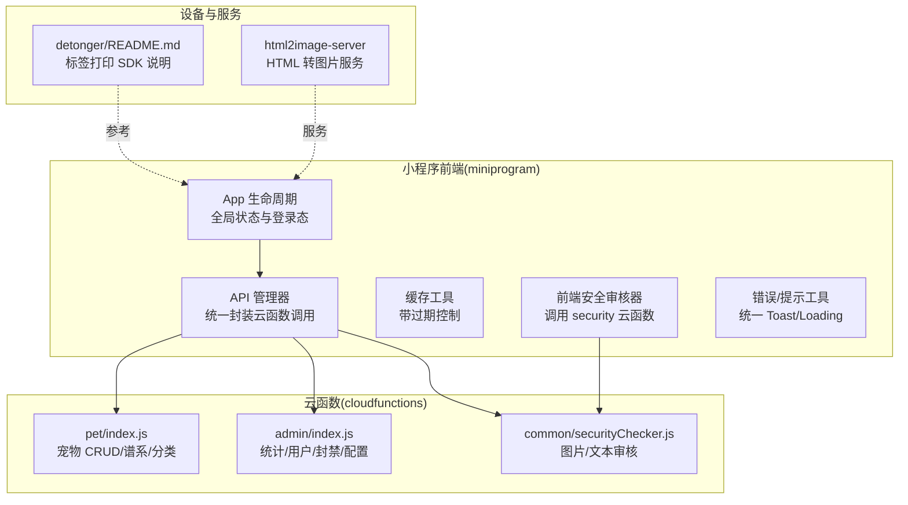
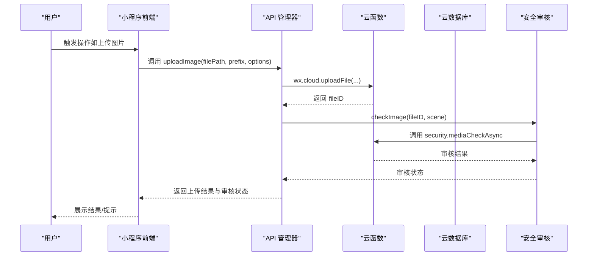
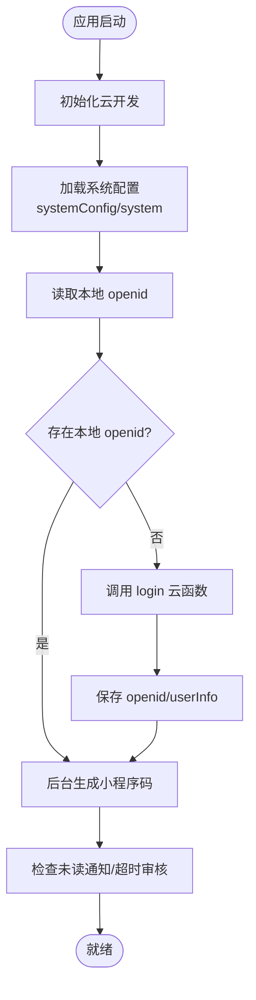
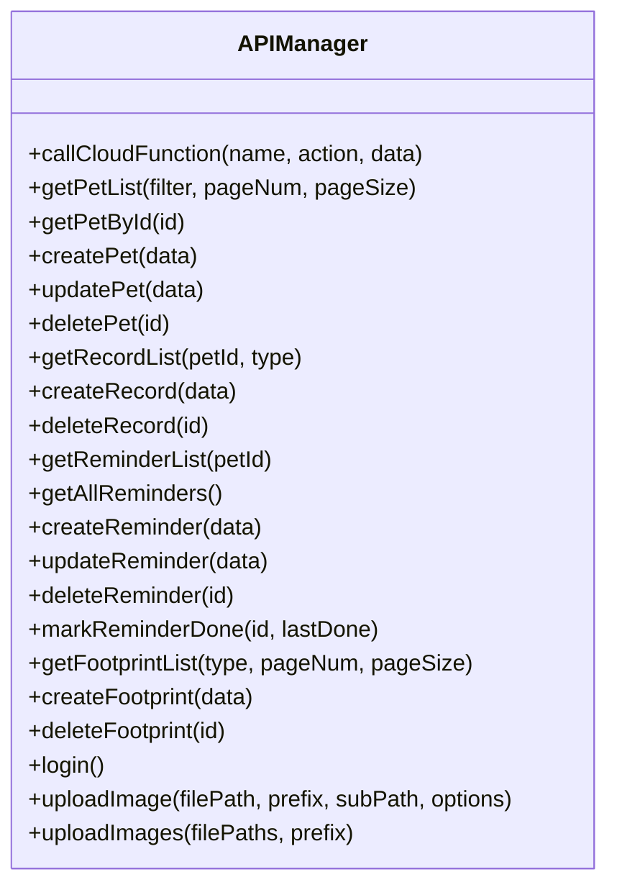
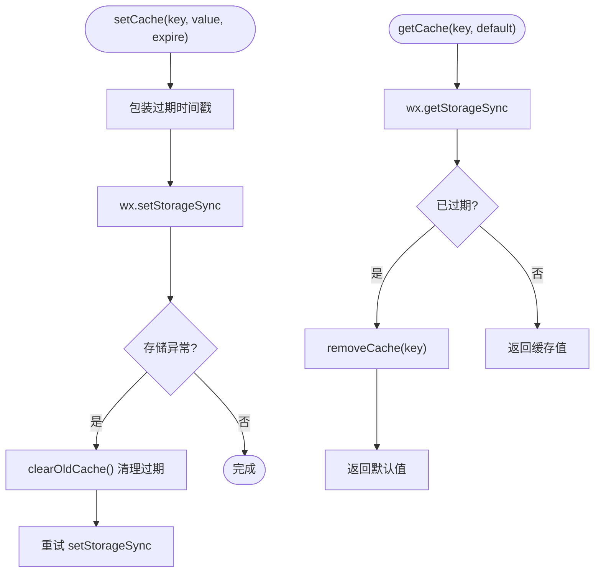
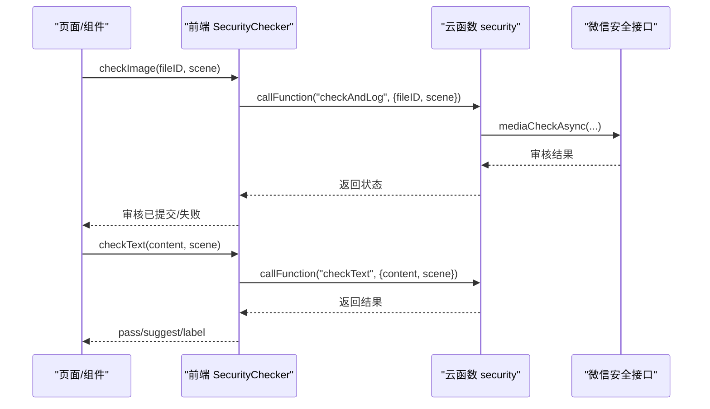
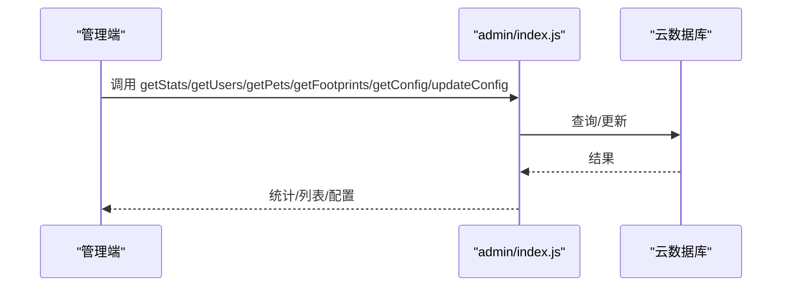
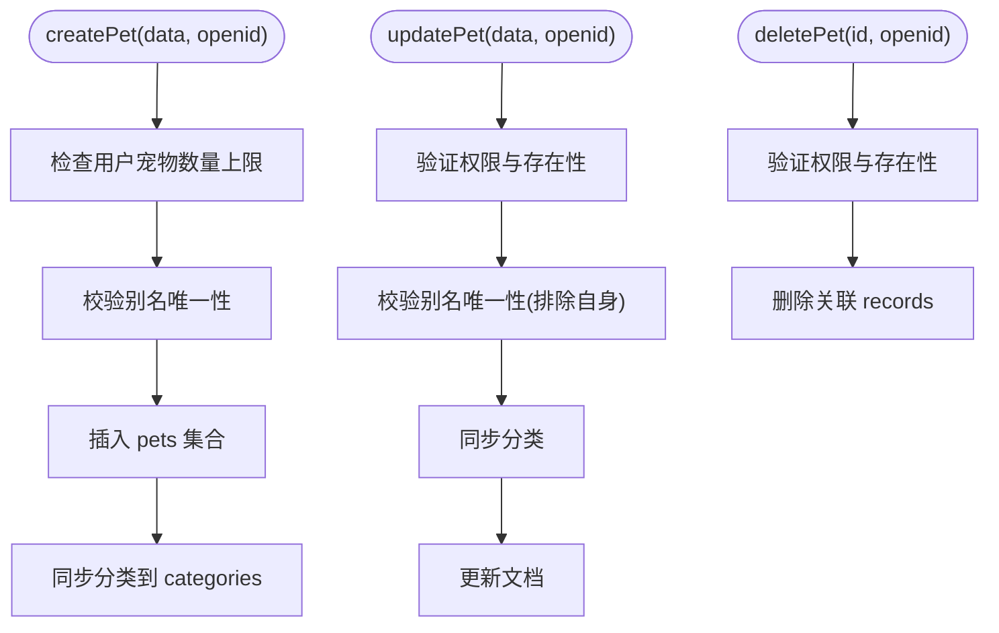
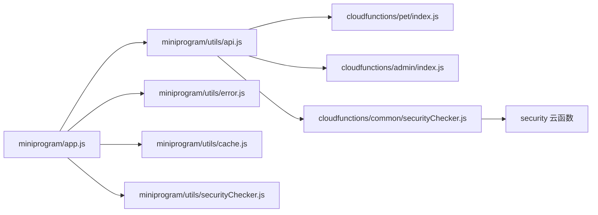

# 开发指南

<cite>
**本文引用的文件**
- [project.config.json](file://project.config.json)
- [miniprogram/app.js](file://miniprogram/app.js)
- [miniprogram/utils/api.js](file://miniprogram/utils/api.js)
- [miniprogram/utils/cache.js](file://miniprogram/utils/cache.js)
- [miniprogram/utils/error.js](file://miniprogram/utils/error.js)
- [miniprogram/utils/securityChecker.js](file://miniprogram/utils/securityChecker.js)
- [cloudfunctions/common/securityChecker.js](file://cloudfunctions/common/securityChecker.js)
- [cloudfunctions/admin/index.js](file://cloudfunctions/admin/index.js)
- [cloudfunctions/pet/index.js](file://cloudfunctions/pet/index.js)
- [detonger/README.md](file://detonger/README.md)
- [html2image-server/start-server.sh](file://html2image-server/start-server.sh)
- [html2image-server-dist/start-server.sh](file://html2image-server-dist/start-server.sh)
</cite>

## 目录
1. [简介](#简介)
2. [项目结构](#项目结构)
3. [核心组件](#核心组件)
4. [架构总览](#架构总览)
5. [详细组件分析](#详细组件分析)
6. [依赖关系分析](#依赖关系分析)
7. [性能考量](#性能考量)
8. [故障排查指南](#故障排查指南)
9. [结论](#结论)
10. [附录](#附录)

## 简介
本开发指南面向“养龟档案”项目的开发者，覆盖代码规范、命名约定、项目结构、开发流程、分支管理、代码审查、测试策略、新功能开发模板与最佳实践、调试与性能分析、团队协作与文档规范、版本管理与发布回滚、开发工具与环境优化，以及面向新成员的入职培训与实践项目。文档以仓库现有代码为依据，结合小程序云开发与云函数体系，帮助团队建立一致的工程实践。

## 项目结构
项目采用多模块并行组织：
- 小程序前端：miniprogram 目录，包含页面、组件、工具库与云函数调用封装
- 云函数：cloudfunctions 目录，按业务域拆分（pet、record、reminder、footprint、login、qrcode、security、admin 等）
- 通用能力：cloudfunctions/common 下的安全审核、工具函数等
- 设备打印能力：detonger 目录提供德佟印立方标签打印 SDK 说明与示例
- HTML 转图片服务：html2image-server 与 dist 版本，提供服务启动脚本与配置
- 设计预览：design-preview 目录包含若干页面原型
- 服务器部署：server-setup 提供数据库 SQL 与 Nginx 配置样例
- 项目配置：project.config.json 管理小程序编译与打包配置

图表来源
- [project.config.json:1-85](file://project.config.json#L1-L85)
- [miniprogram/app.js:1-312](file://miniprogram/app.js#L1-L312)
- [miniprogram/utils/api.js:1-208](file://miniprogram/utils/api.js#L1-L208)
- [cloudfunctions/pet/index.js:1-723](file://cloudfunctions/pet/index.js#L1-L723)
- [cloudfunctions/admin/index.js:1-533](file://cloudfunctions/admin/index.js#L1-L533)
- [cloudfunctions/common/securityChecker.js:1-226](file://cloudfunctions/common/securityChecker.js#L1-L226)
- [detonger/README.md:1-901](file://detonger/README.md#L1-L901)
- [html2image-server/start-server.sh:1-200](file://html2image-server/start-server.sh#L1-L200)

章节来源
- [project.config.json:1-85](file://project.config.json#L1-L85)

## 核心组件
- 应用生命周期与全局状态：负责云开发初始化、系统配置加载、登录态维护、二维码生成、通知检查与登出流程
- API 管理器：统一封装云函数调用、错误处理与降级策略、图片上传与安全审核联动
- 缓存工具：提供带过期控制的本地缓存，自动清理过期数据
- 安全审核器：前端与后端双层审核封装，支持图片/文本审核与异步提交
- 云函数：按领域拆分，提供宠物管理、管理员后台、安全审核等能力

章节来源
- [miniprogram/app.js:1-312](file://miniprogram/app.js#L1-L312)
- [miniprogram/utils/api.js:1-208](file://miniprogram/utils/api.js#L1-L208)
- [miniprogram/utils/cache.js:1-121](file://miniprogram/utils/cache.js#L1-L121)
- [miniprogram/utils/securityChecker.js:1-122](file://miniprogram/utils/securityChecker.js#L1-L122)
- [cloudfunctions/common/securityChecker.js:1-226](file://cloudfunctions/common/securityChecker.js#L1-L226)
- [cloudfunctions/admin/index.js:1-533](file://cloudfunctions/admin/index.js#L1-L533)
- [cloudfunctions/pet/index.js:1-723](file://cloudfunctions/pet/index.js#L1-L723)

## 架构总览
整体采用“小程序前端 + 云开发 + 云函数 + 数据库存储”的架构。前端通过 API 管理器调用云函数，云函数访问数据库与微信开放能力，安全审核贯穿图片上传与文本输入环节。

图表来源
- [miniprogram/utils/api.js:148-190](file://miniprogram/utils/api.js#L148-L190)
- [cloudfunctions/common/securityChecker.js:66-105](file://cloudfunctions/common/securityChecker.js#L66-L105)

## 详细组件分析

### 应用生命周期与全局状态
- 初始化：云开发初始化、系统配置加载（优先读取 systemConfig，降级到 system）
- 登录态：本地优先，失败则调用 login 云函数静默获取 openid，写入本地存储
- 二维码：后台静默生成并持久化到本地存储
- 通知：进入前台时检查未读通知与超时审核记录
- 登出：清理本地存储并跳转首页

图表来源
- [miniprogram/app.js:17-174](file://miniprogram/app.js#L17-L174)
- [miniprogram/app.js:267-288](file://miniprogram/app.js#L267-L288)

章节来源
- [miniprogram/app.js:1-312](file://miniprogram/app.js#L1-L312)

### API 管理器
- 统一调用云函数，封装成功/失败与错误降级
- 宠物、记录、提醒、足迹、登录、图片上传等接口封装
- 图片上传后异步触发安全审核（可选跳过）

图表来源
- [miniprogram/utils/api.js:4-191](file://miniprogram/utils/api.js#L4-L191)

章节来源
- [miniprogram/utils/api.js:1-208](file://miniprogram/utils/api.js#L1-L208)

### 缓存工具
- 带过期时间的本地缓存，自动清理过期项
- 异常兜底：存储满时主动清理旧缓存并重试

图表来源
- [miniprogram/utils/cache.js:11-85](file://miniprogram/utils/cache.js#L11-L85)

章节来源
- [miniprogram/utils/cache.js:1-121](file://miniprogram/utils/cache.js#L1-L121)

### 安全审核器（前端）
- 封装对 security 云函数的调用，支持异步/同步审核与批量处理
- 文本审核在服务不可用时放行，保证用户体验

图表来源
- [miniprogram/utils/securityChecker.js:18-106](file://miniprogram/utils/securityChecker.js#L18-L106)
- [cloudfunctions/common/securityChecker.js:66-149](file://cloudfunctions/common/securityChecker.js#L66-L149)

章节来源
- [miniprogram/utils/securityChecker.js:1-122](file://miniprogram/utils/securityChecker.js#L1-L122)
- [cloudfunctions/common/securityChecker.js:1-226](file://cloudfunctions/common/securityChecker.js#L1-L226)

### 管理员云函数
- 权限校验：从数据库或兜底列表读取管理员 openid
- 统计：用户/宠物/足迹总量、今日活跃、用户/宠物增长
- 用户管理：搜索、筛选、更新状态、封禁/解封联动
- 宠物管理：按条件检索、展示归属用户昵称
- 足迹管理：按日期/关键词检索
- 配置管理：读取/更新 systemConfig，记录更新人

图表来源
- [cloudfunctions/admin/index.js:27-71](file://cloudfunctions/admin/index.js#L27-L71)
- [cloudfunctions/admin/index.js:74-115](file://cloudfunctions/admin/index.js#L74-L115)
- [cloudfunctions/admin/index.js:118-174](file://cloudfunctions/admin/index.js#L118-L174)
- [cloudfunctions/admin/index.js:261-320](file://cloudfunctions/admin/index.js#L261-L320)
- [cloudfunctions/admin/index.js:322-362](file://cloudfunctions/admin/index.js#L322-L362)
- [cloudfunctions/admin/index.js:434-473](file://cloudfunctions/admin/index.js#L434-L473)
- [cloudfunctions/admin/index.js:476-508](file://cloudfunctions/admin/index.js#L476-L508)

章节来源
- [cloudfunctions/admin/index.js:1-533](file://cloudfunctions/admin/index.js#L1-L533)

### 宠物云函数
- 支持创建、列表、详情、更新、删除、公开列表、谱系查询、分类管理
- 创建时校验别名唯一性与用户上限，更新时同步分类
- 公开列表附带主人名片与最新产蛋/交配记录，计算距上次产蛋天数
- 谱系查询支持递归构建家谱树、提取父系/母系主线、统计信息

图表来源
- [cloudfunctions/pet/index.js:84-138](file://cloudfunctions/pet/index.js#L84-L138)
- [cloudfunctions/pet/index.js:193-231](file://cloudfunctions/pet/index.js#L193-L231)
- [cloudfunctions/pet/index.js:233-250](file://cloudfunctions/pet/index.js#L233-L250)
- [cloudfunctions/pet/index.js:252-349](file://cloudfunctions/pet/index.js#L252-L349)
- [cloudfunctions/pet/index.js:376-412](file://cloudfunctions/pet/index.js#L376-L412)

章节来源
- [cloudfunctions/pet/index.js:1-723](file://cloudfunctions/pet/index.js#L1-L723)

### 设备打印能力（德佟印立方）
- 提供基于微信小程序 BLE 与 canvas 的标签编辑与蓝牙打印接口
- 支持多种绘制元素（文本、条码、二维码、表格等）与打印任务管理
- 提供接口文档与使用示例，强调仅适用于特定打印机系列

章节来源
- [detonger/README.md:1-901](file://detonger/README.md#L1-L901)

## 依赖关系分析
- 前端依赖：API 管理器依赖云函数；安全审核器依赖 security 云函数；缓存工具依赖本地存储；错误工具提供统一提示
- 云函数依赖：pet 与 admin 依赖云数据库；security 云函数依赖微信开放安全接口；admin 依赖事务实现数据一致性

图表来源
- [miniprogram/app.js:1-312](file://miniprogram/app.js#L1-L312)
- [miniprogram/utils/api.js:1-208](file://miniprogram/utils/api.js#L1-L208)
- [cloudfunctions/pet/index.js:1-723](file://cloudfunctions/pet/index.js#L1-L723)
- [cloudfunctions/admin/index.js:1-533](file://cloudfunctions/admin/index.js#L1-L533)
- [cloudfunctions/common/securityChecker.js:1-226](file://cloudfunctions/common/securityChecker.js#L1-L226)
- [miniprogram/utils/error.js:1-92](file://miniprogram/utils/error.js#L1-L92)
- [miniprogram/utils/cache.js:1-121](file://miniprogram/utils/cache.js#L1-L121)
- [miniprogram/utils/securityChecker.js:1-122](file://miniprogram/utils/securityChecker.js#L1-L122)

## 性能考量
- 云函数调用：统一通过 API 管理器封装，减少重复逻辑与错误处理成本
- 缓存策略：合理设置缓存过期时间，避免频繁请求数据库；存储满时自动清理旧缓存
- 图片上传：上传完成后异步触发安全审核，不阻塞主流程
- 分页与排序：列表查询支持分页与排序，降低单次数据量
- 事务一致性：管理员删除用户时使用事务，保证数据一致性

章节来源
- [miniprogram/utils/api.js:12-38](file://miniprogram/utils/api.js#L12-L38)
- [miniprogram/utils/cache.js:41-61](file://miniprogram/utils/cache.js#L41-L61)
- [cloudfunctions/admin/index.js:228-257](file://cloudfunctions/admin/index.js#L228-L257)

## 故障排查指南
- 登录失败：检查云开发初始化、login 云函数返回、本地存储读写
- 图片上传失败：检查上传文件路径、云存储权限、安全审核服务可用性
- 审核异常：前端安全审核器在服务不可用时放行，可在日志中定位错误
- 数据库查询异常：确认集合存在、索引、权限与查询条件
- 管理员权限：确认 admins 集合或兜底列表配置正确

章节来源
- [miniprogram/app.js:84-140](file://miniprogram/app.js#L84-L140)
- [miniprogram/utils/api.js:156-178](file://miniprogram/utils/api.js#L156-L178)
- [miniprogram/utils/securityChecker.js:82-92](file://miniprogram/utils/securityChecker.js#L82-L92)
- [cloudfunctions/common/securityChecker.js:66-105](file://cloudfunctions/common/securityChecker.js#L66-L105)
- [cloudfunctions/admin/index.js:16-25](file://cloudfunctions/admin/index.js#L16-L25)

## 结论
本指南基于现有代码梳理了项目架构、核心组件与关键流程，明确了前后端协作模式与安全审核策略。建议在后续迭代中持续完善测试与监控，强化文档与知识沉淀，保持代码风格与命名一致性，确保团队高效协作与项目稳定演进。

## 附录

### 代码规范与命名约定
- 文件与模块：按功能域划分（pet、record、reminder、footprint、admin、security），统一使用小写与短横线命名
- 类与函数：采用驼峰命名；类首字母大写；私有方法以下划线前缀
- 常量：全大写下划线命名
- 云函数：统一入口 exports.main，按 action 分发
- 前端：页面/组件文件与 JSON/WXML/WXSS/WXS 成对存在，遵循小程序命名规范

章节来源
- [cloudfunctions/pet/index.js:45-82](file://cloudfunctions/pet/index.js#L45-L82)
- [cloudfunctions/admin/index.js:27-71](file://cloudfunctions/admin/index.js#L27-L71)
- [miniprogram/utils/api.js:4-191](file://miniprogram/utils/api.js#L4-L191)

### 开发流程与分支管理
- 分支策略：主干保护，特性分支从 develop 拉取，合并前要求代码审查
- 提交规范：简明语义化提交信息，关联 Issue/需求编号
- 代码审查：至少一名 reviewer，关注安全性、性能与可维护性
- 测试策略：单元测试（云函数）、集成测试（端到端）、回归测试（重要修复）

章节来源
- [miniprogram/utils/api.js:12-38](file://miniprogram/utils/api.js#L12-L38)
- [cloudfunctions/common/securityChecker.js:66-105](file://cloudfunctions/common/securityChecker.js#L66-L105)

### 新功能开发模板与最佳实践
- 模板步骤
  - 在 cloudfunctions 下新增功能目录与 index.js，定义 action 分发
  - 在 miniprogram/utils/api.js 中新增对应方法，封装参数与返回值
  - 在页面中调用 API 管理器方法，处理加载/错误/成功提示
  - 如涉及图片/文本，调用安全审核器并处理异步结果
- 最佳实践
  - 统一错误处理与提示
  - 合理使用缓存与分页
  - 严格权限校验与数据校验
  - 事务保证关键操作一致性

章节来源
- [cloudfunctions/pet/index.js:45-82](file://cloudfunctions/pet/index.js#L45-L82)
- [miniprogram/utils/api.js:43-124](file://miniprogram/utils/api.js#L43-L124)
- [miniprogram/utils/securityChecker.js:44-106](file://miniprogram/utils/securityChecker.js#L44-L106)

### 调试技巧与性能分析
- 前端调试：利用微信开发者工具断点、网络面板、Storage 面板；关注云函数调用耗时与错误
- 云函数调试：开启日志输出，分批处理大数据量；使用事务与并发控制
- 性能分析：关注数据库查询索引、分页与排序、缓存命中率、安全审核异步化

章节来源
- [miniprogram/utils/cache.js:41-61](file://miniprogram/utils/cache.js#L41-L61)
- [cloudfunctions/admin/index.js:228-257](file://cloudfunctions/admin/index.js#L228-L257)

### 团队协作规范与文档标准
- 文档：README、设计文档、API 文档、变更日志
- 知识分享：定期技术分享、代码评审总结、问题复盘
- 沟通：Issue/需求/PR 描述清晰，必要时附截图/录屏

章节来源
- [detonger/README.md:1-901](file://detonger/README.md#L1-L901)

### 版本管理、发布与回滚
- 版本号：语义化版本，变更日志记录重大改动
- 发布流程：构建产物校验、灰度发布、监控告警
- 回滚策略：快速回滚至上一稳定版本，保留日志与备份

章节来源
- [project.config.json:55-58](file://project.config.json#L55-L58)

### 开发工具与环境优化
- IDE：推荐 VS Code，安装小程序/云开发插件
- 代码质量：ESLint/Prettier 规范，提交前检查
- 环境：本地开发使用云开发模拟器，生产环境使用正式环境 ID

章节来源
- [project.config.json:7-54](file://project.config.json#L7-L54)

### 入职培训与实践项目
- 第一周：熟悉项目结构、小程序配置、云开发与云函数
- 第二周：阅读 API 管理器与安全审核器，完成一个简单页面的 CRUD
- 第三周：参与管理员功能开发，理解事务与权限
- 第四周：接入设备打印能力，完成标签打印流程

章节来源
- [miniprogram/utils/api.js:1-208](file://miniprogram/utils/api.js#L1-L208)
- [cloudfunctions/admin/index.js:1-533](file://cloudfunctions/admin/index.js#L1-L533)
- [detonger/README.md:1-901](file://detonger/README.md#L1-L901)