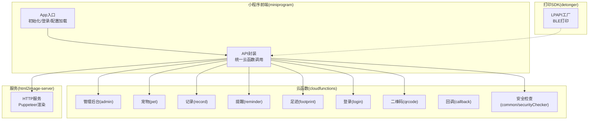
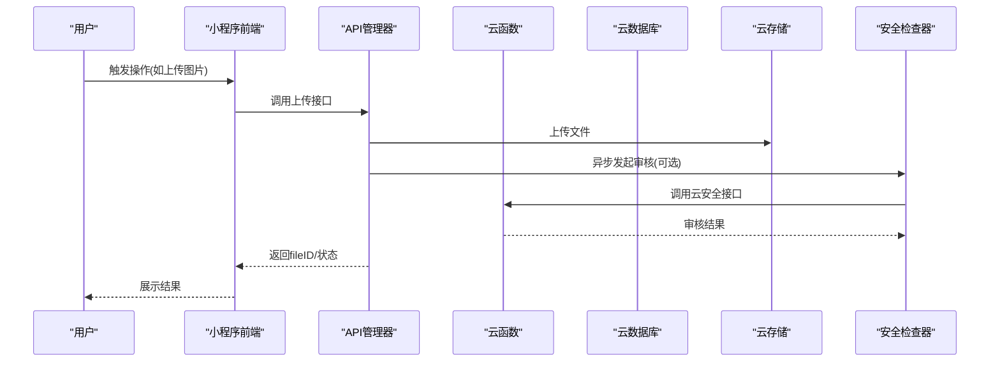
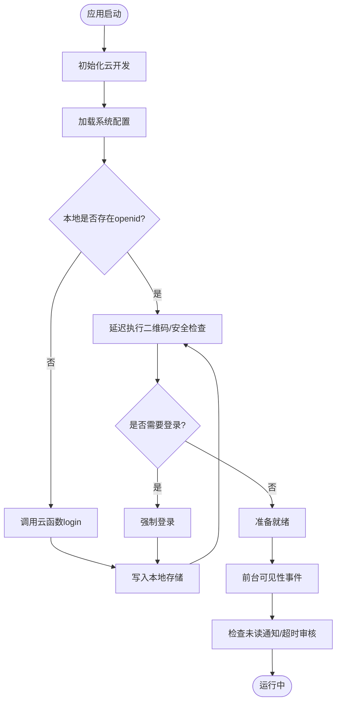
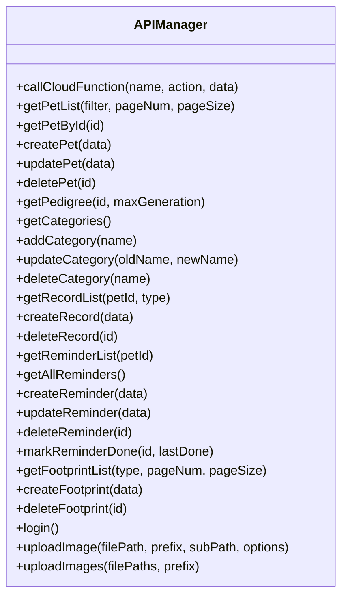
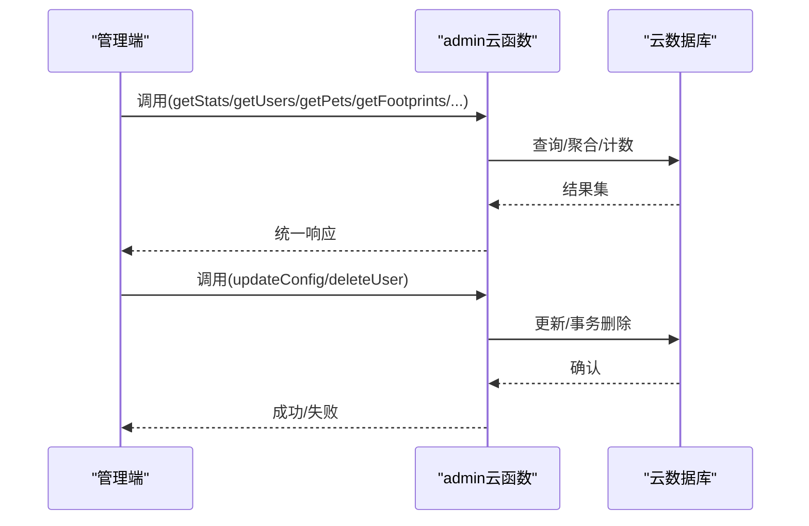
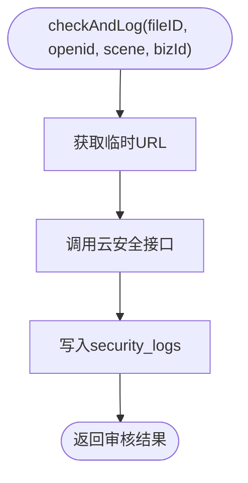
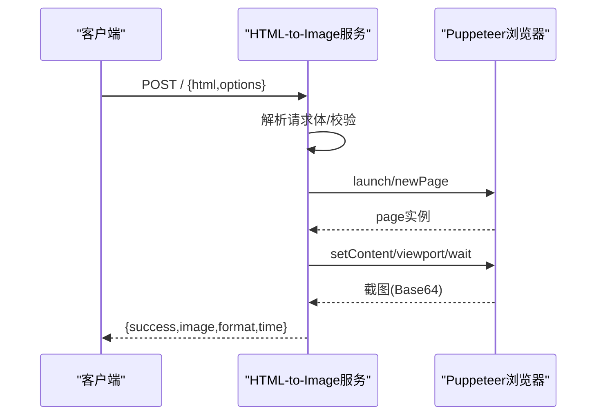
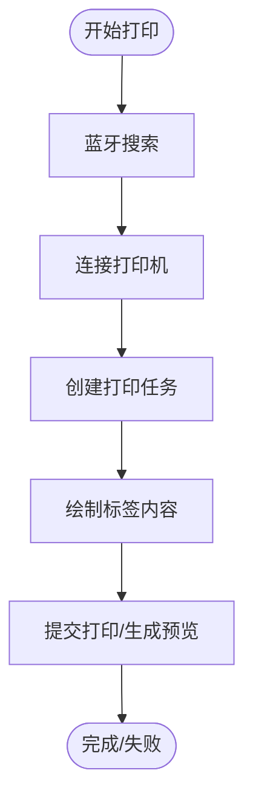
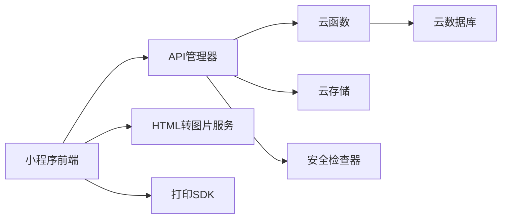

# 开发流程

<cite>
**本文引用的文件**
- [miniprogram/app.js](file://miniprogram/app.js)
- [miniprogram/utils/api.js](file://miniprogram/utils/api.js)
- [cloudfunctions/admin/index.js](file://cloudfunctions/admin/index.js)
- [cloudfunctions/common/securityChecker.js](file://cloudfunctions/common/securityChecker.js)
- [html2image-server/server.js](file://html2image-server/server.js)
- [html2image-server-dist/server.js](file://html2image-server-dist/server.js)
- [miniprogram/project.config.json](file://miniprogram/project.config.json)
- [cloudfunctions/admin/package.json](file://cloudfunctions/admin/package.json)
- [detonger/README.md](file://detonger/README.md)
</cite>

## 目录
1. [引言](#引言)
2. [项目结构](#项目结构)
3. [核心组件](#核心组件)
4. [架构总览](#架构总览)
5. [详细组件分析](#详细组件分析)
6. [依赖关系分析](#依赖关系分析)
7. [性能考虑](#性能考虑)
8. [故障排查指南](#故障排查指南)
9. [结论](#结论)
10. [附录](#附录)

## 引言
本文件为“养龟档案”项目的完整开发流程规范，覆盖需求分析、技术设计、开发实现、测试验证、分支管理、功能开发流程、代码合并规范、开发环境搭建、本地调试与联调测试、任务分配与进度跟踪、质量保证机制、开发工具与IDE配置建议、开发效率提升技巧、版本发布流程、部署策略与回滚预案，以及面向新成员的入职开发流程培训。旨在帮助团队建立统一、高效、可追溯的协作方式。

## 项目结构
项目采用多模块分层组织：
- 小程序前端：miniprogram，包含页面、组件、工具类、云函数调用封装等
- 云开发云函数：cloudfunctions，按功能拆分为 admin、pet、record、reminder、footprint、login、qrcode、callback、speech、html2image、security 等子模块
- HTML转图片服务：html2image-server 与 dist 版本，提供HTTP API将HTML渲染为图像
- 打印SDK：detonger，提供德佟印立方标签打印机的BLE打印能力
- 服务器环境：server-setup，包含数据库SQL与Nginx配置样例
- 设计预览：design-preview，静态页面用于界面预览
- Cloudflare Worker：cloudflare-worker，边缘计算示例

图表来源
- [miniprogram/app.js:1-312](file://miniprogram/app.js#L1-L312)
- [miniprogram/utils/api.js:1-208](file://miniprogram/utils/api.js#L1-L208)
- [cloudfunctions/admin/index.js:1-533](file://cloudfunctions/admin/index.js#L1-L533)
- [cloudfunctions/common/securityChecker.js:1-226](file://cloudfunctions/common/securityChecker.js#L1-L226)
- [html2image-server/server.js:1-365](file://html2image-server/server.js#L1-L365)
- [detonger/README.md:1-800](file://detonger/README.md#L1-L800)

章节来源
- [miniprogram/app.js:1-312](file://miniprogram/app.js#L1-L312)
- [miniprogram/utils/api.js:1-208](file://miniprogram/utils/api.js#L1-L208)
- [cloudfunctions/admin/index.js:1-533](file://cloudfunctions/admin/index.js#L1-L533)
- [cloudfunctions/common/securityChecker.js:1-226](file://cloudfunctions/common/securityChecker.js#L1-L226)
- [html2image-server/server.js:1-365](file://html2image-server/server.js#L1-L365)
- [detonger/README.md:1-800](file://detonger/README.md#L1-L800)

## 核心组件
- 小程序App生命周期与全局状态：负责云开发初始化、系统配置加载、本地数据初始化、静默登录、二维码生成、登录态校验、通知检查、登出与前台可见性事件处理
- API管理器：统一封装云函数调用、图片上传、安全审核触发、分页与类型化接口
- 管理后台云函数：提供统计、用户、宠物、足迹、配置管理与事务删除等能力
- 安全检查器：封装图片与文本内容审核，支持异步审核与日志落库
- HTML转图片服务：基于Puppeteer的HTTP API，支持PNG/JPEG/WebP输出与视口控制
- 打印SDK：提供德佟印立方标签打印机的BLE连接、任务创建、绘制与打印流程

章节来源
- [miniprogram/app.js:1-312](file://miniprogram/app.js#L1-L312)
- [miniprogram/utils/api.js:1-208](file://miniprogram/utils/api.js#L1-L208)
- [cloudfunctions/admin/index.js:1-533](file://cloudfunctions/admin/index.js#L1-L533)
- [cloudfunctions/common/securityChecker.js:1-226](file://cloudfunctions/common/securityChecker.js#L1-L226)
- [html2image-server/server.js:1-365](file://html2image-server/server.js#L1-L365)
- [detonger/README.md:1-800](file://detonger/README.md#L1-L800)

## 架构总览
整体采用“小程序前端 + 云开发云函数 + 辅助服务”的架构。前端通过API管理器调用云函数，云函数访问云数据库与云存储；图片安全审核由云函数触发腾讯云安全接口；HTML转图片服务独立部署，供前端或云函数调用；打印SDK用于标签打印场景。

图表来源
- [miniprogram/utils/api.js:156-190](file://miniprogram/utils/api.js#L156-L190)
- [cloudfunctions/common/securityChecker.js:74-105](file://cloudfunctions/common/securityChecker.js#L74-L105)

## 详细组件分析

### 组件A：App生命周期与全局状态
职责与流程要点：
- 初始化云开发环境，准备系统配置加载
- 加载systemConfig（优先新集合，降级旧集合）
- 本地初始化：读取openid，若存在则延迟执行二维码生成与安全通知检查
- 异步登录：调用云函数login，写入本地存储，刷新登录态
- 二维码生成：调用云函数qrcode，持久化到本地存储
- 登录态校验：requireLogin/promptLogin/forceLogin
- 安全通知检查：进入前台时检查未读通知与超时审核
- 登出：清理本地存储并跳转首页

图表来源
- [miniprogram/app.js:17-140](file://miniprogram/app.js#L17-L140)
- [miniprogram/app.js:176-288](file://miniprogram/app.js#L176-L288)

章节来源
- [miniprogram/app.js:1-312](file://miniprogram/app.js#L1-L312)

### 组件B：API管理器
职责与流程要点：
- 统一调用云函数，封装成功/失败与降级逻辑
- 宠物、记录、提醒、足迹、分类、登录等接口封装
- 图片上传：上传至云存储，可选触发安全审核
- 批量上传：顺序遍历上传并汇总结果

图表来源
- [miniprogram/utils/api.js:4-191](file://miniprogram/utils/api.js#L4-L191)

章节来源
- [miniprogram/utils/api.js:1-208](file://miniprogram/utils/api.js#L1-L208)

### 组件C：管理后台云函数
职责与流程要点：
- 管理员鉴权：读取数据库管理员列表或兜底配置
- 统计数据：用户/宠物/足迹总量、今日活跃、用户/宠物增长率
- 用户管理：搜索、排序、分页、封禁/解封联动
- 宠物管理：按名称/分类筛选、关联用户昵称
- 足迹管理：按日期/搜索过滤
- 最近动态与趋势：用户增长趋势、宠物类型分布
- 系统配置：读取/更新，带更新人与时间戳
- 事务删除：删除用户及其全部数据

图表来源
- [cloudfunctions/admin/index.js:27-71](file://cloudfunctions/admin/index.js#L27-L71)
- [cloudfunctions/admin/index.js:74-115](file://cloudfunctions/admin/index.js#L74-L115)
- [cloudfunctions/admin/index.js:118-174](file://cloudfunctions/admin/index.js#L118-L174)
- [cloudfunctions/admin/index.js:220-258](file://cloudfunctions/admin/index.js#L220-L258)
- [cloudfunctions/admin/index.js:434-473](file://cloudfunctions/admin/index.js#L434-L473)
- [cloudfunctions/admin/index.js:476-508](file://cloudfunctions/admin/index.js#L476-L508)

章节来源
- [cloudfunctions/admin/index.js:1-533](file://cloudfunctions/admin/index.js#L1-L533)

### 组件D：安全检查器
职责与流程要点：
- 场景映射：头像/封面/宠物/足迹/评论/昵称
- 标签映射：正常/时政/色情/违法犯罪/其他
- 文件ID转临时URL，调用云安全接口进行媒体/文本审核
- 审核日志落库：记录fileID、场景、bizId、traceId、状态与原因

图表来源
- [cloudfunctions/common/securityChecker.js:180-207](file://cloudfunctions/common/securityChecker.js#L180-L207)

章节来源
- [cloudfunctions/common/securityChecker.js:1-226](file://cloudfunctions/common/securityChecker.js#L1-L226)

### 组件E：HTML转图片服务
职责与流程要点：
- HTTP路由：健康检查、API文档、配置查询、根路径说明
- 请求体解析：最大尺寸限制
- 渲染：Puppeteer启动浏览器池、设置视口、等待网络空闲、截图
- 响应：Base64图像与格式、耗时统计
- 关闭：优雅停机，关闭浏览器与PID文件清理

图表来源
- [html2image-server/server.js:208-330](file://html2image-server/server.js#L208-L330)
- [html2image-server/server.js:157-205](file://html2image-server/server.js#L157-L205)

章节来源
- [html2image-server/server.js:1-365](file://html2image-server/server.js#L1-L365)
- [html2image-server-dist/server.js:1-365](file://html2image-server-dist/server.js#L1-L365)

### 组件F：打印SDK（德佟印立方）
职责与流程要点：
- LPAPI工厂：通过离屏/隐藏Canvas获取实例
- 蓝牙搜索与连接：限定机型、超时、状态回调
- 打印任务：创建任务、绘制内容、提交打印、预览/打印结果
- 参数：打印浓度、速度、纸张类型、对齐方式、旋转与对齐

图表来源
- [detonger/README.md:118-231](file://detonger/README.md#L118-L231)
- [detonger/README.md:281-413](file://detonger/README.md#L281-L413)

章节来源
- [detonger/README.md:1-800](file://detonger/README.md#L1-L800)

## 依赖关系分析
- 小程序前端依赖云函数与云存储，API管理器集中封装调用
- 管理后台云函数依赖云数据库与云存储，涉及事务与聚合查询
- 安全检查器依赖腾讯云安全开放接口与云存储临时URL
- HTML转图片服务依赖Puppeteer与系统Chrome/Chromium
- 打印SDK依赖微信小程序BLE与Canvas

图表来源
- [miniprogram/utils/api.js:12-38](file://miniprogram/utils/api.js#L12-L38)
- [cloudfunctions/admin/index.js:1-10](file://cloudfunctions/admin/index.js#L1-L10)
- [cloudfunctions/common/securityChecker.js:1-10](file://cloudfunctions/common/securityChecker.js#L1-L10)
- [html2image-server/server.js:12-14](file://html2image-server/server.js#L12-L14)
- [detonger/README.md:1-14](file://detonger/README.md#L1-L14)

章节来源
- [miniprogram/utils/api.js:1-208](file://miniprogram/utils/api.js#L1-L208)
- [cloudfunctions/admin/index.js:1-533](file://cloudfunctions/admin/index.js#L1-L533)
- [cloudfunctions/common/securityChecker.js:1-226](file://cloudfunctions/common/securityChecker.js#L1-L226)
- [html2image-server/server.js:1-365](file://html2image-server/server.js#L1-L365)
- [detonger/README.md:1-800](file://detonger/README.md#L1-L800)

## 性能考虑
- 小程序端：避免频繁网络请求，合理缓存系统配置与用户信息；图片上传后异步审核，不阻塞主流程
- 云函数：并发查询使用Promise.all；大字段分页与条件过滤；事务删除时按需批量处理
- HTML转图片：浏览器池复用，避免重复launch；视口与质量参数合理设置；超时与错误快速失败
- 打印SDK：蓝牙搜索超时控制，连接状态检查，避免重复打印任务

## 故障排查指南
- App初始化失败：检查云开发初始化与系统配置加载链路
- 云函数调用失败：查看API管理器返回的useFallback标记与错误信息
- 安全审核异常：确认临时URL获取与云安全接口调用结果，检查security_logs
- HTML转图片失败：检查浏览器启动、headless模式、视口参数与请求体大小限制
- 打印失败：检查蓝牙权限、设备状态码与打印参数

章节来源
- [miniprogram/app.js:176-288](file://miniprogram/app.js#L176-L288)
- [miniprogram/utils/api.js:27-38](file://miniprogram/utils/api.js#L27-L38)
- [cloudfunctions/common/securityChecker.js:74-105](file://cloudfunctions/common/securityChecker.js#L74-L105)
- [html2image-server/server.js:217-330](file://html2image-server/server.js#L217-L330)
- [detonger/README.md:350-372](file://detonger/README.md#L350-L372)

## 结论
本规范明确了“养龟档案”项目从需求到发布的全流程标准，强调统一的API封装、严格的权限与安全审核、可扩展的服务架构与高效的打印能力。建议在团队内推广标准化的分支策略、代码评审与自动化测试，持续优化性能与稳定性。

## 附录

### 需求分析与技术设计
- 需求收集：通过用户故事与用例图梳理功能边界
- 技术选型：小程序+云开发+Puppeteer+打印SDK
- 数据模型：用户、宠物、记录、足迹、系统配置、安全日志
- 接口设计：统一云函数Action与API管理器封装

### 分支管理策略
- 主干分支：master/main（受保护）
- 开发分支：develop（每日构建）
- 功能分支：feature/功能名
- 修复分支：fix/问题编号
- 发布分支：release/x.y.z
- 热修复分支：hotfix/问题编号

### 功能开发流程
- 任务分解：将需求拆分为小而可交付的功能点
- 设计评审：接口与数据模型评审
- 编码实现：遵循统一风格与注释规范
- 单元测试：针对关键逻辑编写测试
- 代码评审：至少一名同伴评审
- 集成测试：跨模块联调

### 代码合并规范
- 提交信息：类型(scope): 描述（参考Conventional Commits）
- 合并要求：通过CI、评审通过、无冲突
- 合并策略：squash合并保持历史整洁

### 开发环境搭建
- 小程序：安装开发者工具，配置项目设置与appid
- 云函数：使用云开发CLI或开发者工具部署
- HTML转图片服务：安装Node.js与依赖，配置Chrome/Chromium路径
- 打印SDK：按文档配置蓝牙权限与设备

章节来源
- [miniprogram/project.config.json:1-34](file://miniprogram/project.config.json#L1-L34)
- [cloudfunctions/admin/package.json:1-10](file://cloudfunctions/admin/package.json#L1-L10)
- [html2image-server/package.json:1-26](file://html2image-server/package.json#L1-L26)
- [detonger/README.md:29-43](file://detonger/README.md#L29-L43)

### 本地调试与联调测试
- 小程序：使用开发者工具真机调试，开启云开发环境
- 云函数：本地模拟调用与日志查看
- HTML转图片：本地启动服务，curl或小程序端调用
- 安全审核：关注审核回调与日志表

章节来源
- [miniprogram/app.js:176-288](file://miniprogram/app.js#L176-L288)
- [cloudfunctions/common/securityChecker.js:180-207](file://cloudfunctions/common/securityChecker.js#L180-L207)
- [html2image-server/server.js:355-364](file://html2image-server/server.js#L355-L364)

### 任务分配与进度跟踪
- 工作项：Jira/Tapd/Excel
- 进度：看板可视化，每日站会
- 质量：代码覆盖率、缺陷密度、回归率

### 质量保证机制
- 代码规范：ESLint/Prettier
- 安全：图片/文本审核、权限校验
- 稳定性：超时与重试、降级策略、监控告警

### 开发工具与IDE配置建议
- VS Code：推荐插件（ESLint、Prettier、小程序开发助手）
- Git：配置提交模板与别名
- 云开发：CLI工具与本地模拟

### 开发效率提升技巧
- 快捷键：常用快捷键与宏
- 复用：通用组件与工具函数
- 自动化：脚本化部署与测试

### 版本发布流程
- 版本号：语义化版本
- 构建：打包小程序与云函数
- 部署：灰度发布与全量切换
- 回滚：镜像回退与数据库回滚

### 部署策略与回滚预案
- 小程序：预览/体验/正式版分层发布
- 云函数：蓝绿部署与版本管理
- HTML转图片：容器化部署与滚动升级
- 回滚：版本回退、配置回滚、数据备份