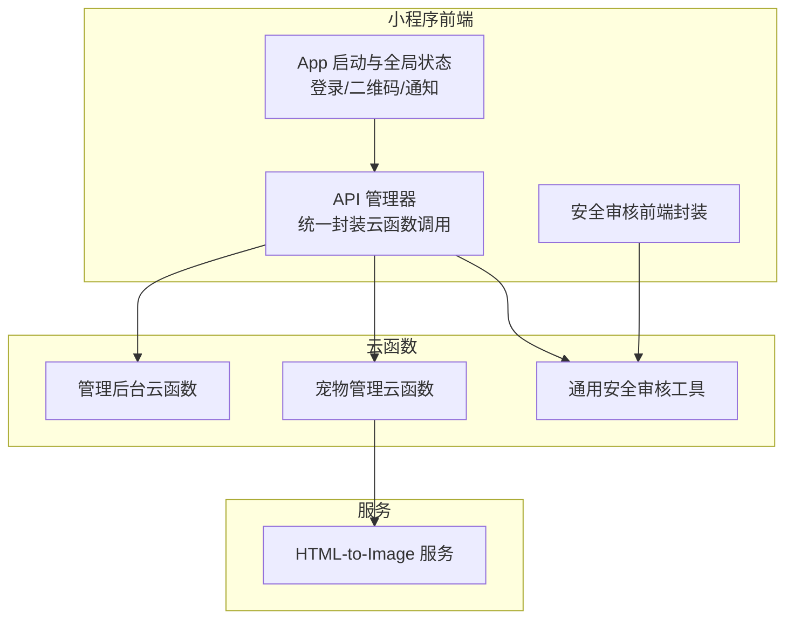
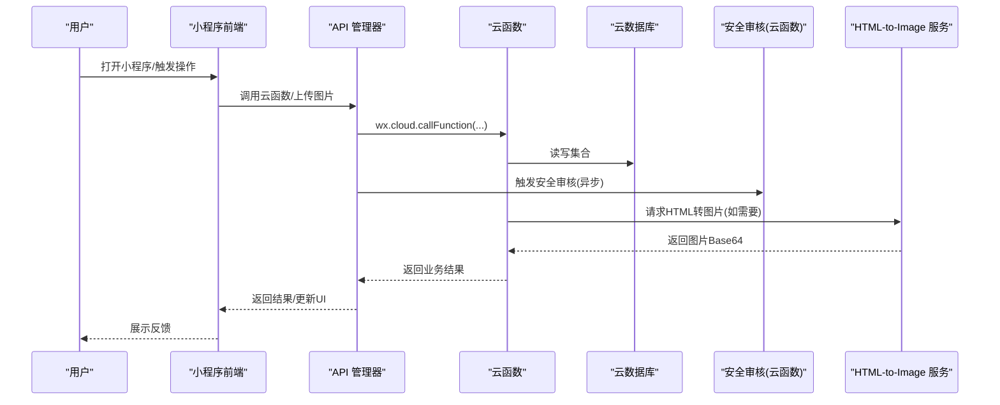
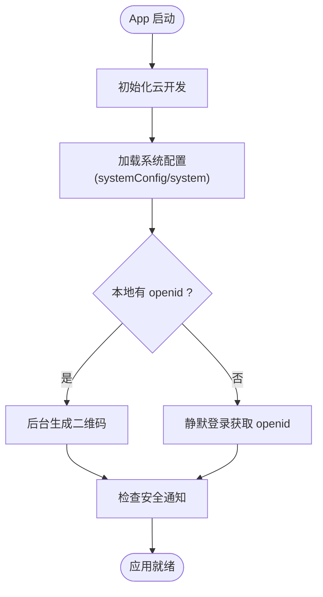
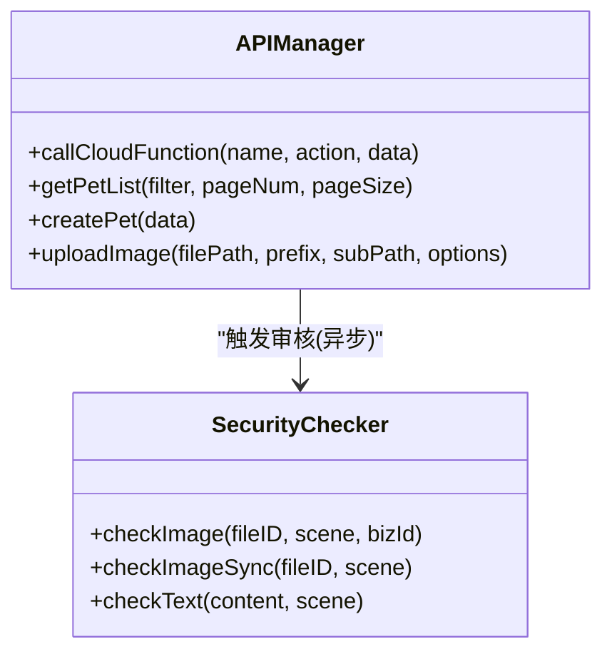
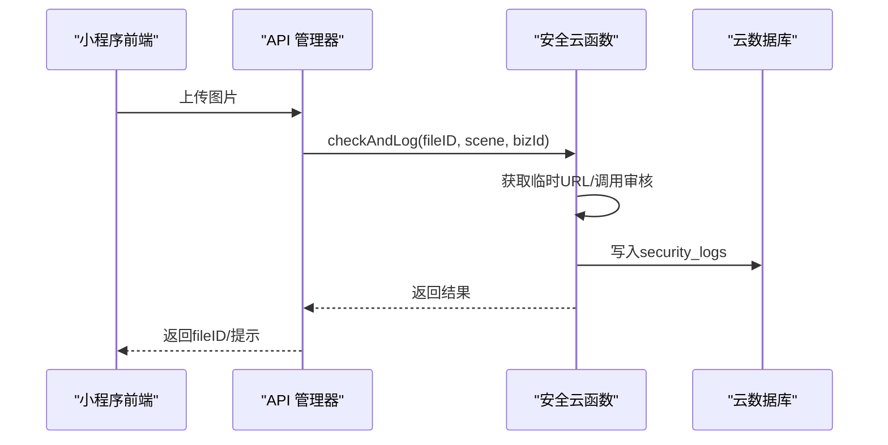
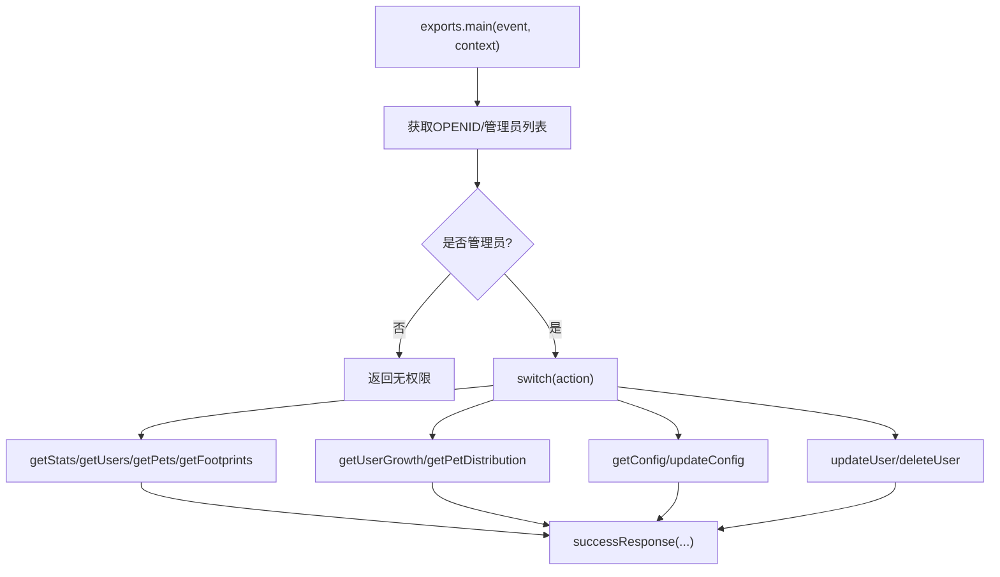
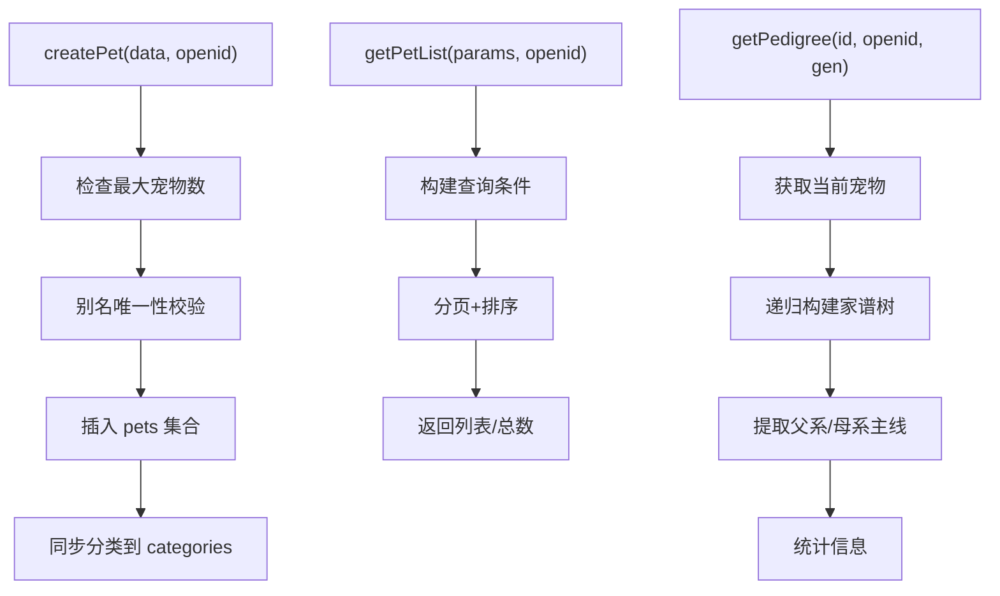
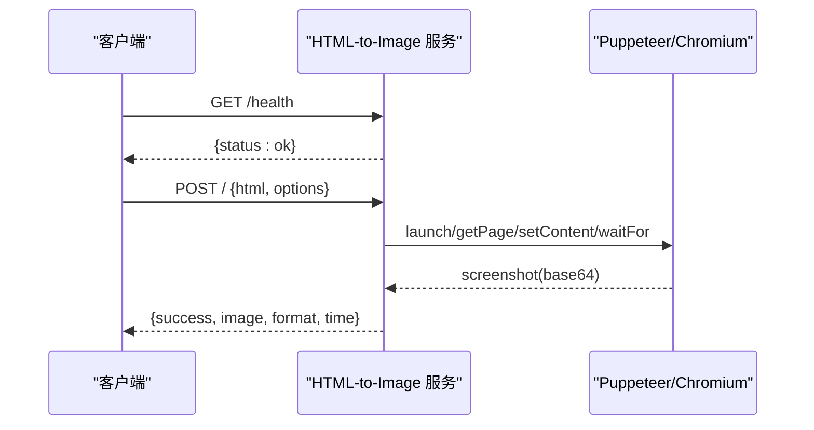
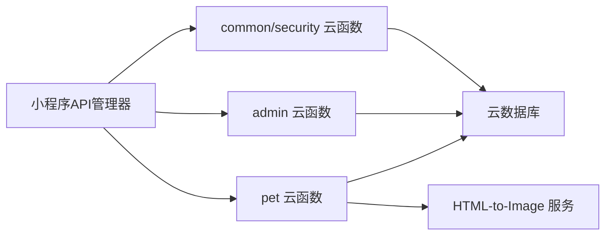

# 测试策略

<cite>
**本文引用的文件**   
- [miniprogram/app.js](file://miniprogram/app.js)
- [miniprogram/utils/api.js](file://miniprogram/utils/api.js)
- [miniprogram/utils/securityChecker.js](file://miniprogram/utils/securityChecker.js)
- [cloudfunctions/common/securityChecker.js](file://cloudfunctions/common/securityChecker.js)
- [cloudfunctions/admin/index.js](file://cloudfunctions/admin/index.js)
- [cloudfunctions/pet/index.js](file://cloudfunctions/pet/index.js)
- [html2image-server/server.js](file://html2image-server/server.js)
- [html2image-server/test.js](file://html2image-server/test.js)
- [miniprogram/project.config.json](file://miniprogram/project.config.json)
</cite>

## 目录
1. [引言](#引言)
2. [项目结构](#项目结构)
3. [核心组件](#核心组件)
4. [架构总览](#架构总览)
5. [详细组件分析](#详细组件分析)
6. [依赖分析](#依赖分析)
7. [性能考虑](#性能考虑)
8. [故障排查指南](#故障排查指南)
9. [结论](#结论)
10. [附录](#附录)

## 引言
本测试策略面向“养龟档案”项目，覆盖小程序页面、云函数与API接口、以及HTML转图片服务的端到端测试。目标包括：
- 建立分层测试体系：单元测试、集成测试、端到端测试
- 明确小程序页面、云函数、API接口的测试方法与工具
- 规划自动化测试脚本、测试数据准备与测试环境配置
- 覆盖性能、兼容性与安全测试
- 设定测试覆盖率要求、缺陷管理与回归流程
- 在持续集成中落地测试自动化与测试报告生成
- 提供面向开发团队的测试工具使用指南与最佳实践

## 项目结构
项目由四部分组成：
- 小程序前端（miniprogram）：页面、组件、工具库、云函数封装
- 云函数（cloudfunctions）：业务逻辑与数据库交互
- HTML转图片服务（html2image-server）：基于Puppeteer的HTTP服务
- 设计预览与辅助工具（design-preview、detonger等）

图表来源
- [miniprogram/app.js:1-312](file://miniprogram/app.js#L1-L312)
- [miniprogram/utils/api.js:1-208](file://miniprogram/utils/api.js#L1-L208)
- [cloudfunctions/admin/index.js:1-533](file://cloudfunctions/admin/index.js#L1-L533)
- [cloudfunctions/pet/index.js:1-723](file://cloudfunctions/pet/index.js#L1-L723)
- [cloudfunctions/common/securityChecker.js:1-226](file://cloudfunctions/common/securityChecker.js#L1-L226)
- [html2image-server/server.js:1-365](file://html2image-server/server.js#L1-L365)

章节来源
- [miniprogram/app.js:1-312](file://miniprogram/app.js#L1-L312)
- [miniprogram/utils/api.js:1-208](file://miniprogram/utils/api.js#L1-L208)
- [cloudfunctions/admin/index.js:1-533](file://cloudfunctions/admin/index.js#L1-L533)
- [cloudfunctions/pet/index.js:1-723](file://cloudfunctions/pet/index.js#L1-L723)
- [cloudfunctions/common/securityChecker.js:1-226](file://cloudfunctions/common/securityChecker.js#L1-L226)
- [html2image-server/server.js:1-365](file://html2image-server/server.js#L1-L365)

## 核心组件
- 小程序App生命周期与全局状态：负责云开发初始化、系统配置加载、登录态维护、二维码生成、安全通知检查等
- API管理器：统一封装云函数调用、图片上传与安全审核触发
- 安全审核：前端安全检查封装与云函数侧媒体/文本审核能力
- 云函数（admin/pet）：用户/宠物/足迹/统计等管理与业务逻辑
- HTML-to-Image 服务：接收HTML生成图片的HTTP服务

章节来源
- [miniprogram/app.js:1-312](file://miniprogram/app.js#L1-L312)
- [miniprogram/utils/api.js:1-208](file://miniprogram/utils/api.js#L1-L208)
- [miniprogram/utils/securityChecker.js:1-122](file://miniprogram/utils/securityChecker.js#L1-L122)
- [cloudfunctions/common/securityChecker.js:1-226](file://cloudfunctions/common/securityChecker.js#L1-L226)
- [cloudfunctions/admin/index.js:1-533](file://cloudfunctions/admin/index.js#L1-L533)
- [cloudfunctions/pet/index.js:1-723](file://cloudfunctions/pet/index.js#L1-L723)
- [html2image-server/server.js:1-365](file://html2image-server/server.js#L1-L365)

## 架构总览
下图展示从小程序前端到云函数与外部服务的调用链路及关键控制点。

图表来源
- [miniprogram/utils/api.js:1-208](file://miniprogram/utils/api.js#L1-L208)
- [cloudfunctions/admin/index.js:1-533](file://cloudfunctions/admin/index.js#L1-L533)
- [cloudfunctions/pet/index.js:1-723](file://cloudfunctions/pet/index.js#L1-L723)
- [cloudfunctions/common/securityChecker.js:1-226](file://cloudfunctions/common/securityChecker.js#L1-L226)
- [html2image-server/server.js:1-365](file://html2image-server/server.js#L1-L365)

## 详细组件分析

### 小程序页面与全局逻辑测试
- 登录与静默登录流程：验证App启动时的云开发初始化、系统配置加载、登录态持久化与二维码生成
- 页面访问控制：requireLogin/promptLogin/forceLogin的分支与交互
- 安全通知检查：进入前台时检查未读通知与超时审核记录
- 测试要点
  - 断言：登录态变化、页面跳转、弹窗提示、云函数调用次数与参数
  - 数据：本地存储（openid/userInfo/registerTime）、云数据库systemConfig
  - 异常：网络失败、云函数返回错误、二维码生成失败
  - 自动化：使用小程序IDE内置测试框架或第三方方案（如Miniprogram CI），模拟用户点击、页面导航、云函数桩

图表来源
- [miniprogram/app.js:1-312](file://miniprogram/app.js#L1-L312)

章节来源
- [miniprogram/app.js:1-312](file://miniprogram/app.js#L1-L312)

### API 管理器与云函数调用测试
- 统一调用：callCloudFunction封装错误处理、降级与回退标记
- 功能覆盖：宠物、记录、提醒、足迹、登录、图片上传与安全审核
- 测试要点
  - 单元测试：mock wx.cloud.callFunction，断言返回结构与错误分支
  - 集成测试：对接真实云环境，验证参数序列化、分页、排序、过滤
  - 端到端：页面触发API调用，断言UI更新与错误提示

图表来源
- [miniprogram/utils/api.js:1-208](file://miniprogram/utils/api.js#L1-L208)
- [miniprogram/utils/securityChecker.js:1-122](file://miniprogram/utils/securityChecker.js#L1-L122)

章节来源
- [miniprogram/utils/api.js:1-208](file://miniprogram/utils/api.js#L1-L208)
- [miniprogram/utils/securityChecker.js:1-122](file://miniprogram/utils/securityChecker.js#L1-L122)

### 安全审核测试
- 前端：异步/同步审核接口，审核失败时的降级策略
- 云函数：媒体/文本审核、临时URL转换、审核日志入库
- 测试要点
  - 单元：mock云函数返回，断言日志写入与返回结构
  - 集成：上传文件后触发审核，验证回调与状态更新
  - 安全：构造敏感内容，验证拦截与告警

图表来源
- [cloudfunctions/common/securityChecker.js:1-226](file://cloudfunctions/common/securityChecker.js#L1-L226)
- [miniprogram/utils/securityChecker.js:1-122](file://miniprogram/utils/securityChecker.js#L1-L122)

章节来源
- [cloudfunctions/common/securityChecker.js:1-226](file://cloudfunctions/common/securityChecker.js#L1-L226)
- [miniprogram/utils/securityChecker.js:1-122](file://miniprogram/utils/securityChecker.js#L1-L122)

### 管理后台云函数测试
- 权限校验：管理员白名单/数据库管理员表
- 功能覆盖：统计、用户/宠物/足迹查询、用户增长趋势、配置读写、用户封禁/解封
- 测试要点
  - 单元：按action分支断言返回结构与错误码
  - 集成：事务删除用户及其数据，断言一致性
  - 数据：正则搜索、分页、排序、聚合统计

图表来源
- [cloudfunctions/admin/index.js:1-533](file://cloudfunctions/admin/index.js#L1-L533)

章节来源
- [cloudfunctions/admin/index.js:1-533](file://cloudfunctions/admin/index.js#L1-L533)

### 宠物管理云函数测试
- 核心能力：创建/查询/更新/删除宠物、谱系查询、分类管理、公开宠物列表
- 限制与约束：最大宠物数、别名唯一性、权限校验、图片URL净化
- 测试要点
  - 单元：断言权限校验、唯一性约束、分页与过滤
  - 集成：谱系递归构建、公开宠物关联查询、产蛋/交配记录映射
  - 性能：批量查询优化、索引命中情况

图表来源
- [cloudfunctions/pet/index.js:1-723](file://cloudfunctions/pet/index.js#L1-L723)

章节来源
- [cloudfunctions/pet/index.js:1-723](file://cloudfunctions/pet/index.js#L1-L723)

### HTML-to-Image 服务测试
- 能力：健康检查、配置查询、HTML转图片（PNG/JPEG/WebP）、截图参数控制
- 测试要点
  - 单元：解析请求体、参数校验、截图选项、错误处理
  - 集成：浏览器池管理、超时与断连恢复、PID文件与优雅停机
  - 端到端：POST / 传入HTML，断言返回格式与耗时

图表来源
- [html2image-server/server.js:1-365](file://html2image-server/server.js#L1-L365)

章节来源
- [html2image-server/server.js:1-365](file://html2image-server/server.js#L1-L365)
- [html2image-server/test.js:159-190](file://html2image-server/test.js#L159-L190)

## 依赖分析
- 前端对云函数的依赖：API管理器集中封装调用，便于测试替换与桩
- 云函数对数据库的依赖：大量查询、事务、聚合统计
- 安全审核：前端触发，云函数执行腾讯云审核API并落库
- HTML服务：依赖Puppeteer与系统浏览器，受环境与资源限制

图表来源
- [miniprogram/utils/api.js:1-208](file://miniprogram/utils/api.js#L1-L208)
- [cloudfunctions/admin/index.js:1-533](file://cloudfunctions/admin/index.js#L1-L533)
- [cloudfunctions/pet/index.js:1-723](file://cloudfunctions/pet/index.js#L1-L723)
- [cloudfunctions/common/securityChecker.js:1-226](file://cloudfunctions/common/securityChecker.js#L1-L226)
- [html2image-server/server.js:1-365](file://html2image-server/server.js#L1-L365)

章节来源
- [miniprogram/utils/api.js:1-208](file://miniprogram/utils/api.js#L1-L208)
- [cloudfunctions/admin/index.js:1-533](file://cloudfunctions/admin/index.js#L1-L533)
- [cloudfunctions/pet/index.js:1-723](file://cloudfunctions/pet/index.js#L1-L723)
- [cloudfunctions/common/securityChecker.js:1-226](file://cloudfunctions/common/securityChecker.js#L1-L226)
- [html2image-server/server.js:1-365](file://html2image-server/server.js#L1-L365)

## 性能考虑
- 小程序端
  - 预加载与懒加载：首页/我的页数据预加载，减少首屏等待
  - 云函数调用批量化：合并请求、避免重复查询
- 云函数端
  - 并发与事务：批量删除/更新使用事务保证一致性
  - 分页与索引：合理使用分页与查询条件，避免全表扫描
- HTML服务
  - 浏览器池与超时：控制启动超时、协议超时，断连自动重建
  - 截图参数：合理设置分辨率与质量，平衡清晰度与体积

## 故障排查指南
- 登录失败/二维码生成失败
  - 检查云函数返回与网络状态，确认App层错误降级逻辑
- 安全审核未生效
  - 核对fileID格式、临时URL获取、云函数返回结构
- 宠物列表为空或分页异常
  - 校验查询条件、权限校验、分页参数
- HTML转图片失败
  - 检查健康检查、请求体大小限制、浏览器启动参数与超时

章节来源
- [miniprogram/app.js:1-312](file://miniprogram/app.js#L1-L312)
- [cloudfunctions/common/securityChecker.js:1-226](file://cloudfunctions/common/securityChecker.js#L1-L226)
- [cloudfunctions/pet/index.js:1-723](file://cloudfunctions/pet/index.js#L1-L723)
- [html2image-server/server.js:1-365](file://html2image-server/server.js#L1-L365)

## 结论
通过分层测试策略与自动化脚本，结合性能、兼容性与安全测试，可显著提升“养龟档案”系统的稳定性与交付质量。建议以云函数为核心测试对象，配合小程序端与服务端联调，逐步完善测试覆盖率与回归流程，并在CI中落地测试自动化与报告输出。

## 附录

### 测试策略实施计划
- 单元测试
  - 小程序：API管理器、安全检查封装、工具函数
  - 云函数：admin/pet核心逻辑、错误分支、边界条件
  - HTML服务：路由、参数解析、截图选项、错误处理
- 集成测试
  - 云函数与数据库：事务、权限、分页、聚合
  - 小程序与云函数：鉴权、参数传递、返回结构
  - HTML服务：浏览器池、超时与断连恢复
- 端到端测试
  - 关键业务流：登录/注册、宠物增删改查、谱系查询、公开分享
  - 审核流程：图片上传、异步审核、通知提示
  - 性能与兼容：不同机型/系统版本、弱网环境

### 测试数据准备与环境配置
- 测试数据
  - 用户：普通用户、管理员、封禁用户
  - 宠物：多条记录、公开/私有、带/不带图片
  - 记录：产蛋/交配/喂食等类型
  - 审核：正常/敏感内容样本
- 环境
  - 云开发环境隔离、数据库清空/初始化脚本
  - HTML服务本地启动与健康检查
  - 小程序IDE测试环境与真机调试

### 测试覆盖率与缺陷管理
- 覆盖率
  - 行覆盖率≥80%，分支覆盖率≥70%，函数覆盖率≥85%
- 缺陷管理
  - Jira/飞书缺陷看板，按严重级别与优先级跟踪
  - 回归测试清单：每次发布前执行关键路径回归
- 回归流程
  - 提测前自测+单元测试
  - 集成测试+端到端测试
  - 发布后监控与快速修复

### 持续集成与测试报告
- CI流水线
  - 代码提交触发：单元测试、静态检查
  - 集成测试：部署测试环境、执行关键API测试
  - 端到端测试：小程序真机/模拟器、HTML服务联调
- 报告
  - 测试报告：JUnit/Allure，覆盖趋势图与失败用例
  - 质量门禁：覆盖率阈值、失败用例阻断发布

### 测试工具使用指南与最佳实践
- 小程序测试
  - 使用小程序IDE内置测试框架或第三方方案
  - mock云函数与云存储，隔离外部依赖
- 云函数测试
  - Jest/Supertest，结合云SDK测试工具
  - 事务与并发场景重点覆盖
- HTML服务测试
  - 使用内置测试脚本，确保浏览器可用
  - 超时与资源限制下的健壮性测试

章节来源
- [miniprogram/project.config.json:1-34](file://miniprogram/project.config.json#L1-L34)
- [html2image-server/test.js:159-190](file://html2image-server/test.js#L159-L190)