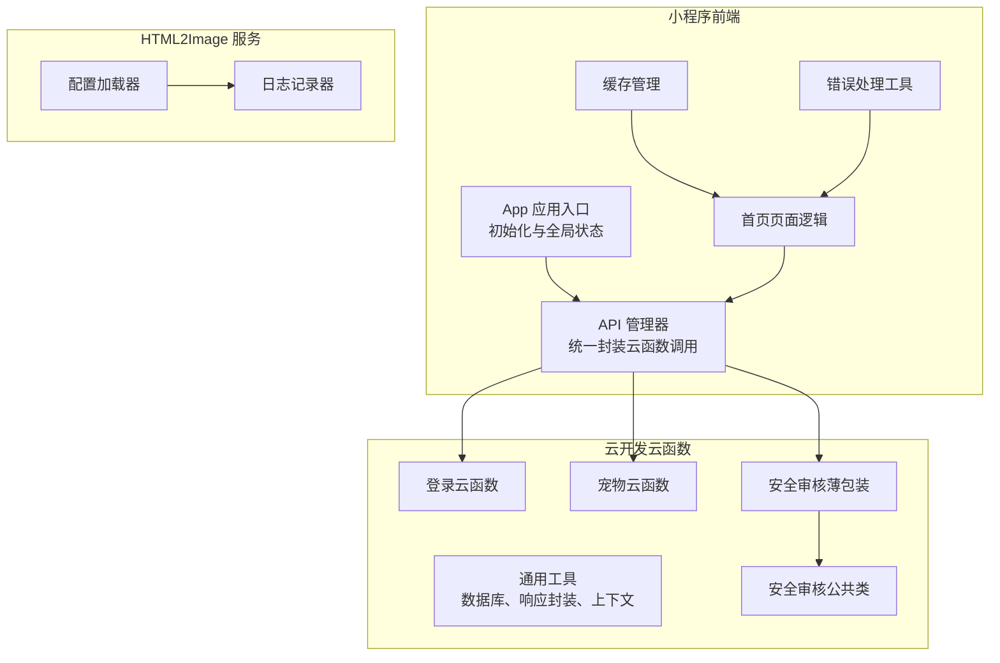
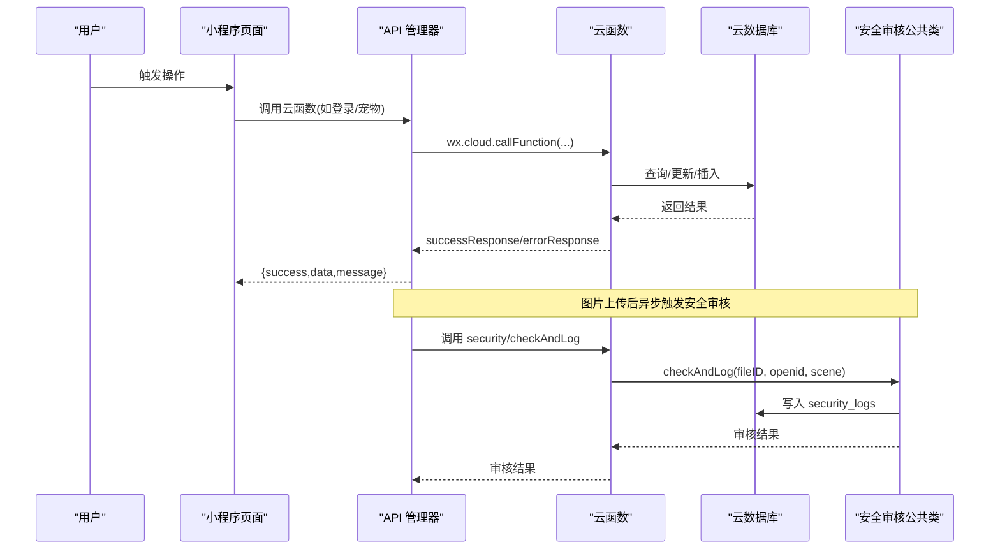
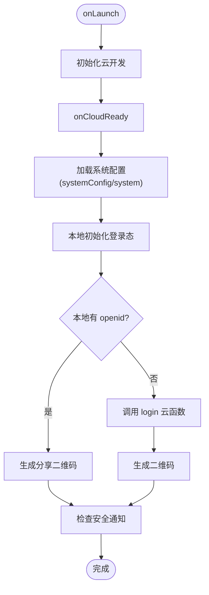
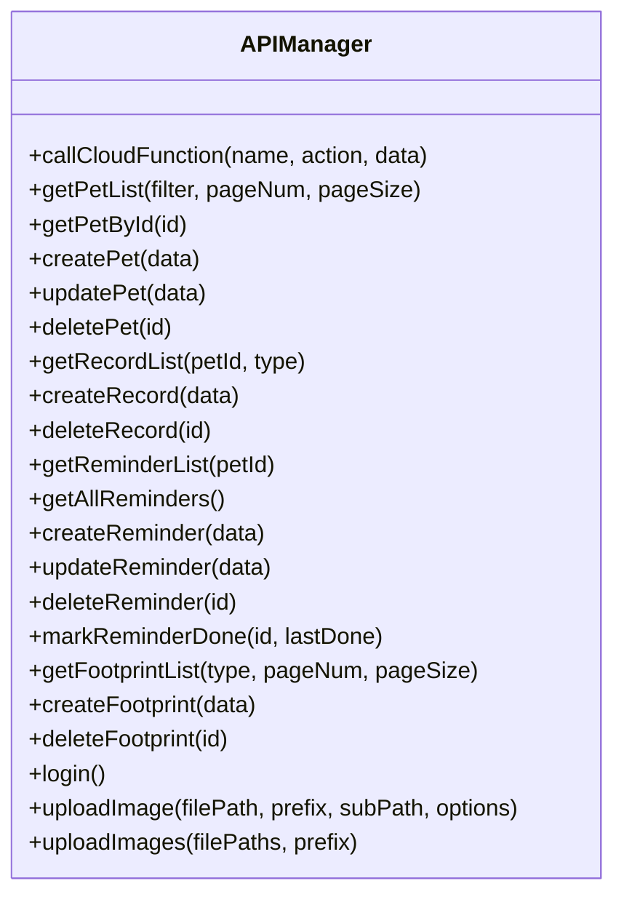
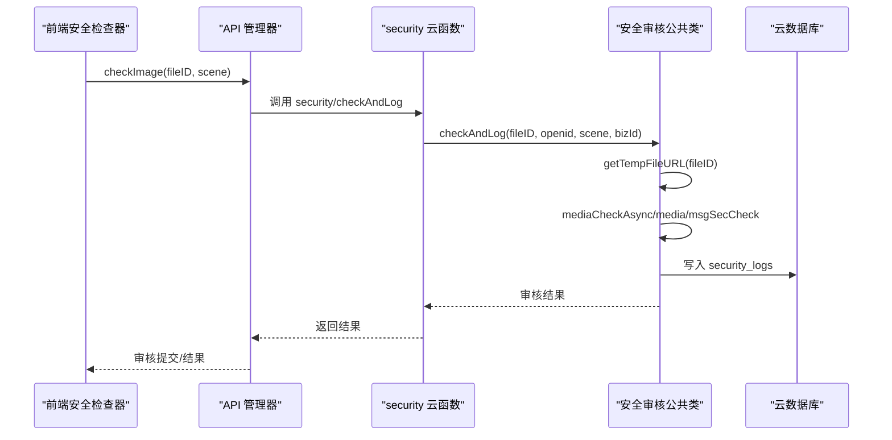
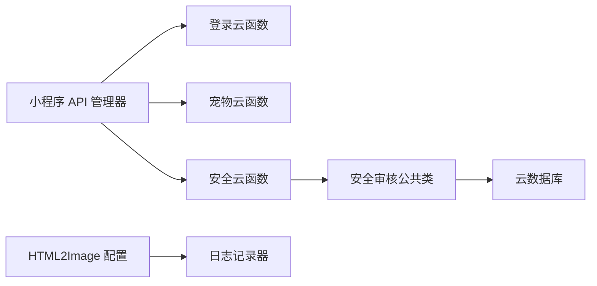

# 调试与故障排查

<cite>
**本文引用的文件**
- [miniprogram/app.js](file://miniprogram/app.js)
- [miniprogram/utils/api.js](file://miniprogram/utils/api.js)
- [miniprogram/utils/error.js](file://miniprogram/utils/error.js)
- [miniprogram/utils/cache.js](file://miniprogram/utils/cache.js)
- [miniprogram/utils/securityChecker.js](file://miniprogram/utils/securityChecker.js)
- [miniprogram/pages/index/index.js](file://miniprogram/pages/index/index.js)
- [cloudfunctions/common/utils.js](file://cloudfunctions/common/utils.js)
- [cloudfunctions/common/securityChecker.js](file://cloudfunctions/common/securityChecker.js)
- [cloudfunctions/login/index.js](file://cloudfunctions/login/index.js)
- [cloudfunctions/pet/index.js](file://cloudfunctions/pet/index.js)
- [cloudfunctions/security/index.js](file://cloudfunctions/security/index.js)
- [html2image-server/logger.js](file://html2image-server/logger.js)
- [html2image-server/config.js](file://html2image-server/config.js)
- [miniprogram/project.config.json](file://miniprogram/project.config.json)
</cite>

## 目录
1. [引言](#引言)
2. [项目结构](#项目结构)
3. [核心组件](#核心组件)
4. [架构总览](#架构总览)
5. [详细组件分析](#详细组件分析)
6. [依赖关系分析](#依赖关系分析)
7. [性能考量](#性能考量)
8. [故障排查指南](#故障排查指南)
9. [结论](#结论)
10. [附录](#附录)

## 引言
本指南面向“养龟档案”项目开发者，提供一套系统化的调试与故障排查方法。内容覆盖微信开发者工具使用、断点调试、网络请求监控、云函数调试、数据库查询调试、API 接口调试、常见错误识别与定位、性能问题诊断、内存泄漏检测、运行时异常处理、日志记录规范、错误上报机制、监控告警配置、生产环境问题排查流程、紧急修复与热修复策略，并给出实用的调试工具推荐与问题解决模板。

## 项目结构
项目采用“小程序前端 + 云开发云函数 + HTML2Image 服务”的三层架构：
- 小程序前端：负责用户界面、状态管理、API 调用、缓存与错误提示。
- 云开发云函数：封装通用工具、业务云函数（登录、宠物、提醒、足迹、安全审核等）。
- HTML2Image 服务：独立的图片渲染服务，提供日志与配置能力。

图表来源
- [miniprogram/app.js:1-312](file://miniprogram/app.js#L1-L312)
- [miniprogram/utils/api.js:1-208](file://miniprogram/utils/api.js#L1-L208)
- [cloudfunctions/common/utils.js:1-69](file://cloudfunctions/common/utils.js#L1-L69)
- [cloudfunctions/login/index.js:1-148](file://cloudfunctions/login/index.js#L1-L148)
- [cloudfunctions/pet/index.js:1-723](file://cloudfunctions/pet/index.js#L1-L723)
- [cloudfunctions/security/index.js:1-200](file://cloudfunctions/security/index.js#L1-L200)
- [cloudfunctions/common/securityChecker.js:1-226](file://cloudfunctions/common/securityChecker.js#L1-L226)
- [html2image-server/config.js:1-268](file://html2image-server/config.js#L1-L268)
- [html2image-server/logger.js:1-95](file://html2image-server/logger.js#L1-L95)

章节来源
- [miniprogram/app.js:1-312](file://miniprogram/app.js#L1-L312)
- [miniprogram/utils/api.js:1-208](file://miniprogram/utils/api.js#L1-L208)
- [cloudfunctions/common/utils.js:1-69](file://cloudfunctions/common/utils.js#L1-L69)
- [cloudfunctions/login/index.js:1-148](file://cloudfunctions/login/index.js#L1-L148)
- [cloudfunctions/pet/index.js:1-723](file://cloudfunctions/pet/index.js#L1-L723)
- [cloudfunctions/security/index.js:1-200](file://cloudfunctions/security/index.js#L1-L200)
- [cloudfunctions/common/securityChecker.js:1-226](file://cloudfunctions/common/securityChecker.js#L1-L226)
- [html2image-server/config.js:1-268](file://html2image-server/config.js#L1-L268)
- [html2image-server/logger.js:1-95](file://html2image-server/logger.js#L1-L95)

## 核心组件
- 应用入口与全局状态：负责云开发初始化、系统配置加载、登录态维护、二维码生成、安全通知检查等。
- API 管理器：统一封装云函数调用、错误处理、图片上传与安全审核触发。
- 错误处理工具：提供统一错误消息提取、成功/失败提示、确认对话框等。
- 缓存管理：提供带过期控制的本地缓存，支持清理过期与异常兜底。
- 页面逻辑：首页聚合提醒、统计、用户信息刷新与头像 URL 刷新。
- 云函数通用工具：数据库连接、响应封装、上下文获取、动作包装。
- 安全审核：前端安全检查器与云侧审核公共类，支持图片/文本审核与日志记录。
- HTML2Image 服务：配置加载、日志记录、浏览器启动参数与渲染参数。

章节来源
- [miniprogram/app.js:1-312](file://miniprogram/app.js#L1-L312)
- [miniprogram/utils/api.js:1-208](file://miniprogram/utils/api.js#L1-L208)
- [miniprogram/utils/error.js:1-92](file://miniprogram/utils/error.js#L1-L92)
- [miniprogram/utils/cache.js:1-121](file://miniprogram/utils/cache.js#L1-L121)
- [miniprogram/pages/index/index.js:1-477](file://miniprogram/pages/index/index.js#L1-L477)
- [cloudfunctions/common/utils.js:1-69](file://cloudfunctions/common/utils.js#L1-L69)
- [cloudfunctions/common/securityChecker.js:1-226](file://cloudfunctions/common/securityChecker.js#L1-L226)
- [html2image-server/config.js:1-268](file://html2image-server/config.js#L1-L268)
- [html2image-server/logger.js:1-95](file://html2image-server/logger.js#L1-L95)

## 架构总览
小程序前端通过 API 管理器调用云函数，云函数通过通用工具连接数据库与封装响应。安全审核由前端安全检查器触发，云函数薄包装层调用安全审核公共类，最终写入安全日志集合。HTML2Image 服务提供独立的日志与配置能力。

图表来源
- [miniprogram/utils/api.js:1-208](file://miniprogram/utils/api.js#L1-L208)
- [cloudfunctions/login/index.js:1-148](file://cloudfunctions/login/index.js#L1-L148)
- [cloudfunctions/pet/index.js:1-723](file://cloudfunctions/pet/index.js#L1-L723)
- [cloudfunctions/security/index.js:1-200](file://cloudfunctions/security/index.js#L1-L200)
- [cloudfunctions/common/securityChecker.js:1-226](file://cloudfunctions/common/securityChecker.js#L1-L226)

## 详细组件分析

### 组件A：应用入口与全局状态（App）
职责与要点
- 初始化云开发并监听就绪事件。
- 从云数据库加载系统配置，兼容旧集合降级。
- 本地初始化登录态，异步静默登录并生成分享二维码。
- 提供登录态校验、强制登录、登出与安全通知检查。
- 全局数据预加载与共享。

调试关注点
- 云开发初始化失败、系统配置读取失败、静默登录失败、二维码生成失败。
- 登录态持久化异常、登出跳转失败回退。

图表来源
- [miniprogram/app.js:1-312](file://miniprogram/app.js#L1-L312)

章节来源
- [miniprogram/app.js:1-312](file://miniprogram/app.js#L1-L312)

### 组件B：API 管理器
职责与要点
- 统一调用云函数，解析 success/message/useFallback。
- 宠物、记录、提醒、足迹、登录等 API 方法封装。
- 图片上传到云存储并触发安全审核（可选跳过）。
- 单例模式，避免重复实例化。

调试关注点
- 云函数调用失败、网络错误、返回结构异常、上传失败、审核触发失败。

图表来源
- [miniprogram/utils/api.js:1-208](file://miniprogram/utils/api.js#L1-L208)

章节来源
- [miniprogram/utils/api.js:1-208](file://miniprogram/utils/api.js#L1-L208)

### 组件C：错误处理工具
职责与要点
- 统一提取错误消息，支持字符串与 Error 对象。
- 成功/失败提示、加载状态、确认对话框。

调试关注点
- 错误消息被吞掉、提示样式不一致、确认框未正确返回。

章节来源
- [miniprogram/utils/error.js:1-92](file://miniprogram/utils/error.js#L1-L92)

### 组件D：缓存管理
职责与要点
- 带过期时间的本地缓存，支持清理过期与异常兜底。
- 前缀隔离、统一过期键。

调试关注点
- 存储空间不足导致写入失败、过期清理异常、键冲突。

章节来源
- [miniprogram/utils/cache.js:1-121](file://miniprogram/utils/cache.js#L1-L121)

### 组件E：首页页面逻辑
职责与要点
- 预加载数据应用、下拉刷新、提醒计算与排序、标记完成、导航跳转。
- 用户头像 URL 刷新与错误回退、统计聚合。

调试关注点
- 预加载数据缺失、提醒计算不一致、标记完成前后端状态不同步。

章节来源
- [miniprogram/pages/index/index.js:1-477](file://miniprogram/pages/index/index.js#L1-L477)

### 组件F：云函数通用工具
职责与要点
- 初始化云环境、获取数据库实例、获取 OPENID。
- 统一响应结构 successResponse/errorResponse。
- wrapAction 动作包装，捕获异常并返回标准错误结构。
- ID 规范化（_id -> id）。

调试关注点
- 数据库连接失败、环境变量未正确注入、动作包装异常。

章节来源
- [cloudfunctions/common/utils.js:1-69](file://cloudfunctions/common/utils.js#L1-L69)

### 组件G：安全审核（前端与云侧）
职责与要点
- 前端安全检查器：异步/同步审核图片与文本，批量触发。
- 云侧安全审核薄包装：转发调用安全审核公共类，记录 security_logs。
- 安全审核公共类：获取临时 URL、调用微信开放接口、写入日志。

调试关注点
- 云存储 fileID 无效、临时 URL 获取失败、审核接口错误、日志写入失败。

图表来源
- [miniprogram/utils/securityChecker.js:1-122](file://miniprogram/utils/securityChecker.js#L1-L122)
- [cloudfunctions/security/index.js:1-200](file://cloudfunctions/security/index.js#L1-L200)
- [cloudfunctions/common/securityChecker.js:1-226](file://cloudfunctions/common/securityChecker.js#L1-L226)

章节来源
- [miniprogram/utils/securityChecker.js:1-122](file://miniprogram/utils/securityChecker.js#L1-L122)
- [cloudfunctions/security/index.js:1-200](file://cloudfunctions/security/index.js#L1-L200)
- [cloudfunctions/common/securityChecker.js:1-226](file://cloudfunctions/common/securityChecker.js#L1-L226)

### 组件H：HTML2Image 服务（日志与配置）
职责与要点
- 配置加载器：支持环境变量覆盖、注释清理、嵌套键映射、冻结配置。
- 日志记录器：控制台输出与文件落盘，支持 INFO/WARN/ERROR/DEBUG。

调试关注点
- 配置解析失败、环境变量映射错误、日志文件写入失败。

章节来源
- [html2image-server/config.js:1-268](file://html2image-server/config.js#L1-L268)
- [html2image-server/logger.js:1-95](file://html2image-server/logger.js#L1-L95)

## 依赖关系分析
- 小程序前端依赖云函数；云函数依赖通用工具与数据库；安全审核链路贯穿前后端。
- HTML2Image 服务与小程序/云函数解耦，独立运行与配置。

图表来源
- [miniprogram/utils/api.js:1-208](file://miniprogram/utils/api.js#L1-L208)
- [cloudfunctions/login/index.js:1-148](file://cloudfunctions/login/index.js#L1-L148)
- [cloudfunctions/pet/index.js:1-723](file://cloudfunctions/pet/index.js#L1-L723)
- [cloudfunctions/security/index.js:1-200](file://cloudfunctions/security/index.js#L1-L200)
- [cloudfunctions/common/securityChecker.js:1-226](file://cloudfunctions/common/securityChecker.js#L1-L226)
- [html2image-server/config.js:1-268](file://html2image-server/config.js#L1-L268)
- [html2image-server/logger.js:1-95](file://html2image-server/logger.js#L1-L95)

章节来源
- [miniprogram/utils/api.js:1-208](file://miniprogram/utils/api.js#L1-L208)
- [cloudfunctions/common/utils.js:1-69](file://cloudfunctions/common/utils.js#L1-L69)
- [cloudfunctions/common/securityChecker.js:1-226](file://cloudfunctions/common/securityChecker.js#L1-L226)
- [html2image-server/config.js:1-268](file://html2image-server/config.js#L1-L268)
- [html2image-server/logger.js:1-95](file://html2image-server/logger.js#L1-L95)

## 性能考量
- 云函数冷启动：尽量减少初始化开销，复用数据库连接与工具函数。
- 数据库查询：使用索引、分页、投影字段，避免一次性读取大量数据。
- 前端渲染：图片 URL 刷新与懒加载、骨架屏、下拉刷新合并请求。
- 缓存策略：合理设置过期时间，避免频繁读写存储。
- 安全审核：异步提交，避免阻塞主流程；批量触发时注意去重与限流。

## 故障排查指南

### 微信开发者工具使用技巧
- 启用“不校验合法域名、HTTPS 证书、AppID”以加速联调。
- 使用“真机调试”定位真机差异问题。
- 在“网络”面板查看云函数与云存储请求详情，观察响应体与耗时。
- 在“调试器”设置断点，逐步跟踪调用链。

章节来源
- [miniprogram/project.config.json:1-34](file://miniprogram/project.config.json#L1-L34)

### 断点调试方法
- 在小程序页面与 API 管理器关键节点设置断点，观察参数与返回值。
- 在云函数入口与关键分支设置断点，结合日志定位异常。
- 使用“条件断点”过滤特定场景（如特定 openid 或错误码）。

章节来源
- [miniprogram/utils/api.js:1-208](file://miniprogram/utils/api.js#L1-L208)
- [cloudfunctions/common/utils.js:1-69](file://cloudfunctions/common/utils.js#L1-L69)

### 网络请求监控
- 小程序端：在“网络”面板查看 wx.cloud.callFunction 与 wx.cloud.uploadFile 的请求与响应。
- 云函数端：在云开发控制台查看实时日志，关注 errorResponse 与 successResponse 的输出。
- HTML2Image 服务：查看日志文件与启动参数，确认浏览器启动与渲染参数。

章节来源
- [miniprogram/utils/api.js:1-208](file://miniprogram/utils/api.js#L1-L208)
- [cloudfunctions/common/utils.js:1-69](file://cloudfunctions/common/utils.js#L1-L69)
- [html2image-server/logger.js:1-95](file://html2image-server/logger.js#L1-L95)

### 云函数调试最佳实践
- 使用 wrapAction 统一封装动作，确保异常被捕获并返回标准错误结构。
- 在云函数入口打印关键上下文（OPENID、action、data），便于定位。
- 对数据库操作增加 try/catch，区分业务异常与系统异常。

章节来源
- [cloudfunctions/common/utils.js:1-69](file://cloudfunctions/common/utils.js#L1-L69)
- [cloudfunctions/login/index.js:1-148](file://cloudfunctions/login/index.js#L1-L148)
- [cloudfunctions/pet/index.js:1-723](file://cloudfunctions/pet/index.js#L1-L723)

### 数据库查询调试
- 使用 limit/分页/排序/投影字段减少数据传输。
- 在云函数中打印查询条件与总数，确认索引命中情况。
- 对并发写入场景，使用事务或条件更新避免竞态。

章节来源
- [cloudfunctions/pet/index.js:1-723](file://cloudfunctions/pet/index.js#L1-L723)
- [cloudfunctions/common/utils.js:1-69](file://cloudfunctions/common/utils.js#L1-L69)

### API 接口调试
- 统一通过 APIManager 调用，集中处理错误与回退。
- 对图片上传与安全审核，区分同步/异步两种模式，避免阻塞。
- 对批量操作，记录单项结果与总体状态，便于重试与补偿。

章节来源
- [miniprogram/utils/api.js:1-208](file://miniprogram/utils/api.js#L1-L208)
- [miniprogram/utils/securityChecker.js:1-122](file://miniprogram/utils/securityChecker.js#L1-L122)

### 常见错误类型与定位
- 网络错误：云函数调用失败、上传失败、临时 URL 获取失败。
- 权限错误：无 openid、无权限访问文档、通知归属校验失败。
- 数据异常：数据库返回空、字段缺失、类型不匹配。
- 审核异常：接口错误码、审核服务异常、日志写入失败。

章节来源
- [miniprogram/utils/error.js:1-92](file://miniprogram/utils/error.js#L1-L92)
- [cloudfunctions/common/utils.js:1-69](file://cloudfunctions/common/utils.js#L1-L69)
- [cloudfunctions/common/securityChecker.js:1-226](file://cloudfunctions/common/securityChecker.js#L1-L226)

### 性能问题诊断
- 云函数冷启动：优化初始化逻辑，延迟加载非必要模块。
- 数据库慢查询：添加索引、减少字段、分页查询。
- 前端卡顿：减少一次性渲染数据量、使用骨架屏、下拉刷新合并。
- 缓存命中率低：调整过期策略、避免频繁写入。

章节来源
- [miniprogram/utils/cache.js:1-121](file://miniprogram/utils/cache.js#L1-L121)
- [cloudfunctions/pet/index.js:1-723](file://cloudfunctions/pet/index.js#L1-L723)

### 内存泄漏检测
- 避免在页面生命周期外持有定时器与事件监听。
- 及时清理缓存与存储中的过期数据。
- 对图片 URL 刷新与头像加载，设置错误回退与重试上限。

章节来源
- [miniprogram/pages/index/index.js:1-477](file://miniprogram/pages/index/index.js#L1-L477)
- [miniprogram/utils/cache.js:1-121](file://miniprogram/utils/cache.js#L1-L121)

### 运行时异常处理
- 前端：统一错误提示与回退逻辑，避免崩溃。
- 云函数：wrapAction 捕获异常，返回明确 message 与 error。
- 安全审核：审核服务不可用时放行，保证业务可用性。

章节来源
- [miniprogram/utils/error.js:1-92](file://miniprogram/utils/error.js#L1-L92)
- [cloudfunctions/common/utils.js:1-69](file://cloudfunctions/common/utils.js#L1-L69)
- [cloudfunctions/common/securityChecker.js:1-226](file://cloudfunctions/common/securityChecker.js#L1-L226)

### 日志记录规范与错误上报
- 前端：API 调用失败、二维码生成失败、安全通知检查失败。
- 云函数：数据库操作异常、审核接口错误、日志写入失败。
- HTML2Image：请求开始/结束、HTTP 请求日志、浏览器事件日志。

章节来源
- [miniprogram/app.js:1-312](file://miniprogram/app.js#L1-L312)
- [cloudfunctions/common/utils.js:1-69](file://cloudfunctions/common/utils.js#L1-L69)
- [cloudfunctions/common/securityChecker.js:1-226](file://cloudfunctions/common/securityChecker.js#L1-L226)
- [html2image-server/logger.js:1-95](file://html2image-server/logger.js#L1-L95)

### 监控告警配置
- 云函数：开启实时日志与错误告警，设置阈值报警。
- HTML2Image：监控进程 PID 文件、日志轮转、启动/停止日志。
- 前端：错误上报 SDK（如自定义上报接口），收集用户可见错误。

章节来源
- [html2image-server/config.js:1-268](file://html2image-server/config.js#L1-L268)
- [html2image-server/logger.js:1-95](file://html2image-server/logger.js#L1-L95)

### 生产环境问题排查流程
- 快速定位：查看云函数实时日志、小程序网络面板、HTML2Image 日志。
- 影响面评估：确认受影响用户规模与功能范围。
- 紧急修复：回滚最近变更、临时关闭问题功能、降级策略。
- 热修复：灰度发布、AB 测试、快速验证。

章节来源
- [cloudfunctions/common/utils.js:1-69](file://cloudfunctions/common/utils.js#L1-L69)
- [html2image-server/logger.js:1-95](file://html2image-server/logger.js#L1-L95)

### 调试工具推荐与问题解决模板
- 调试工具：微信开发者工具、云开发控制台、浏览器开发者工具。
- 问题模板：环境信息、复现步骤、期望结果、实际结果、日志截取、截图/录屏。

章节来源
- [miniprogram/project.config.json:1-34](file://miniprogram/project.config.json#L1-L34)

## 结论
通过统一的 API 管理器、完善的错误处理与日志体系、严格的云函数与数据库调试规范，以及独立的 HTML2Image 服务监控，可以显著提升“养龟档案”项目的稳定性与可维护性。建议在团队内固化调试流程与问题模板，持续完善监控告警与热修复机制。

## 附录
- 关键文件路径参考：见本文“本文引用的文件”。