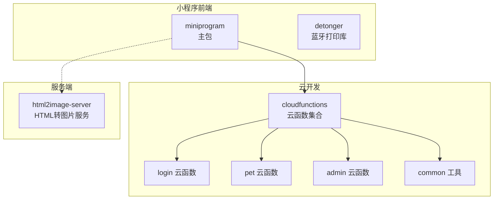
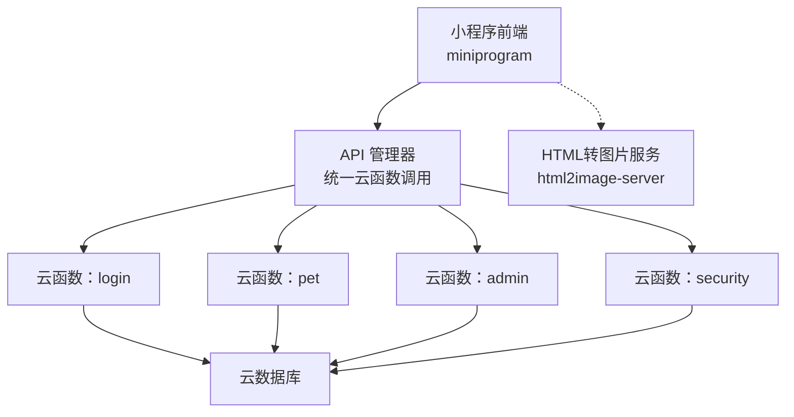
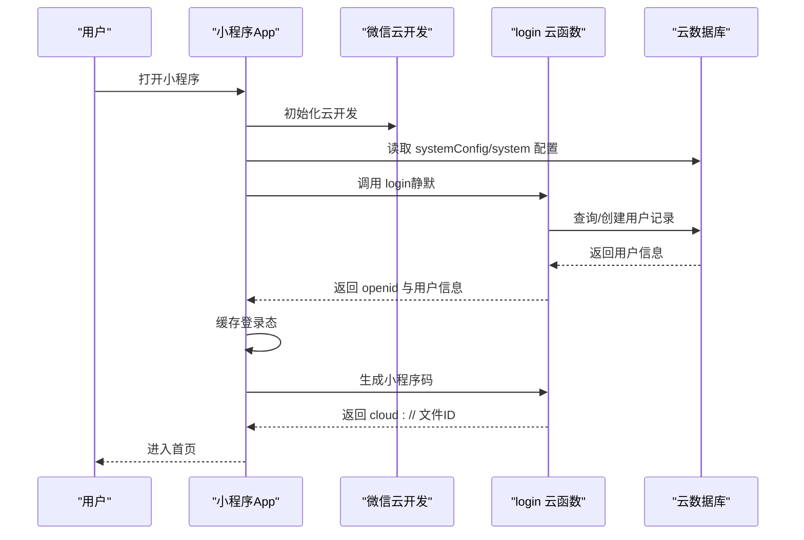
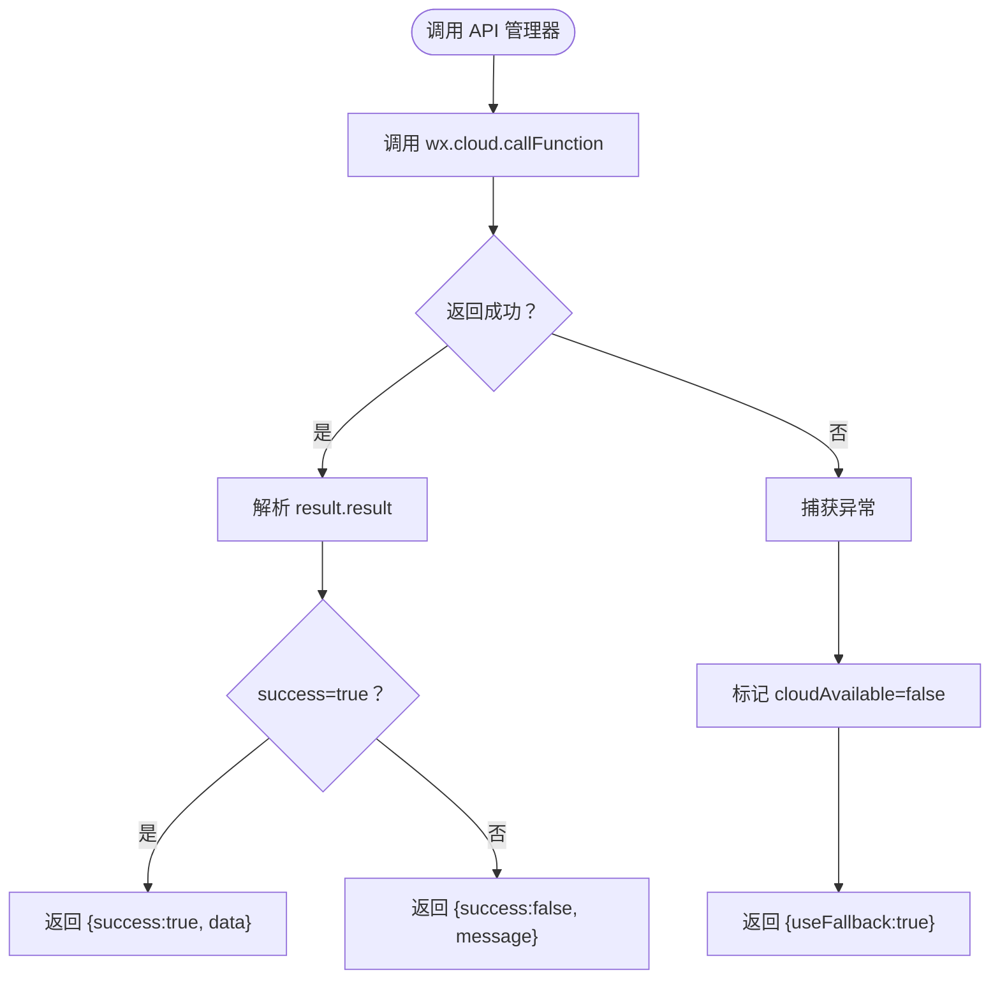
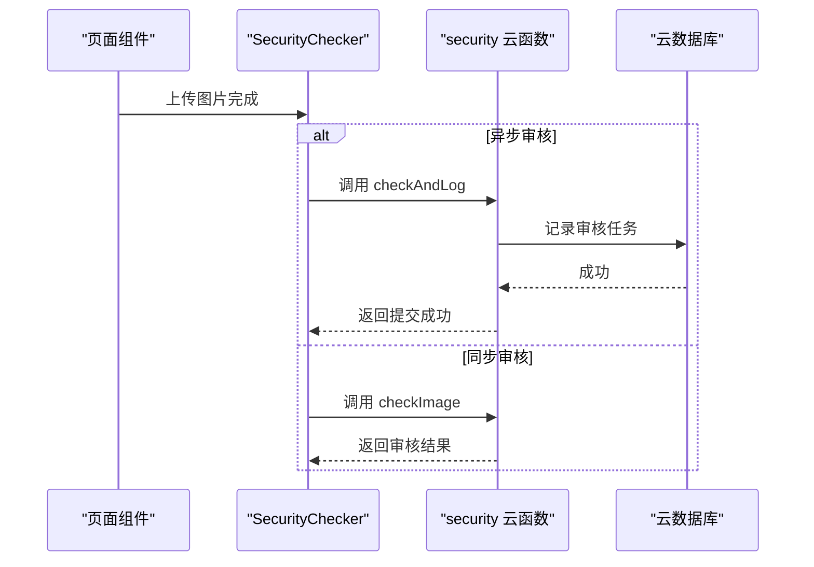
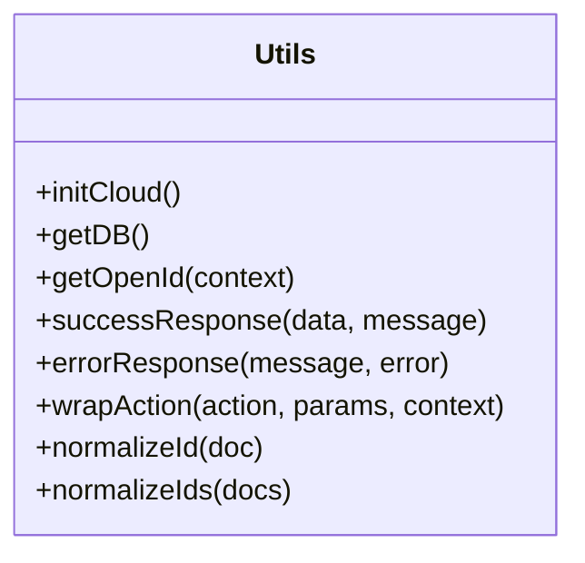
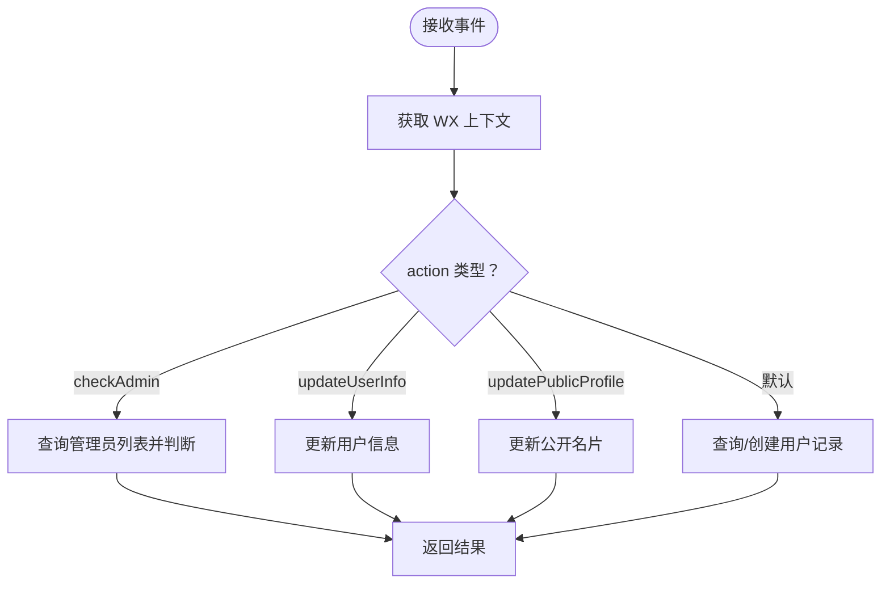
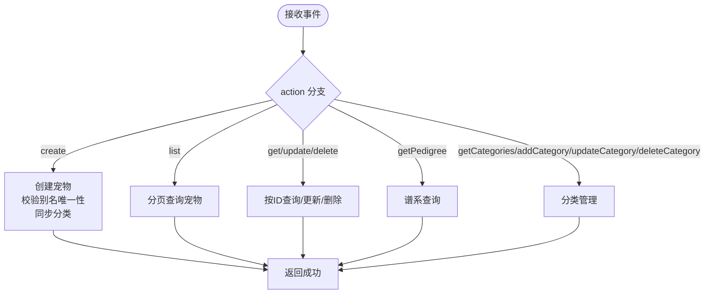
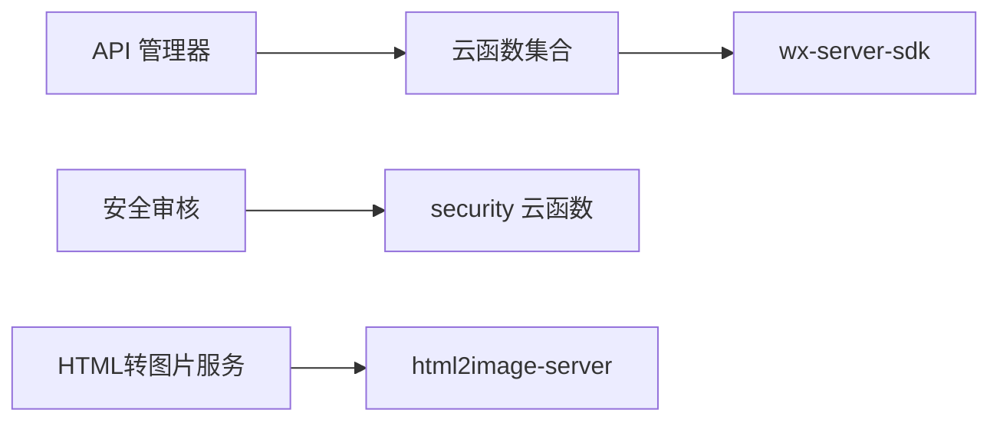

# 快速开始

<cite>
**本文引用的文件**
- [miniprogram/app.json](file://miniprogram/app.json)
- [miniprogram/project.config.json](file://miniprogram/project.config.json)
- [miniprogram/app.js](file://miniprogram/app.js)
- [miniprogram/utils/api.js](file://miniprogram/utils/api.js)
- [miniprogram/utils/securityChecker.js](file://miniprogram/utils/securityChecker.js)
- [cloudfunctions/common/utils.js](file://cloudfunctions/common/utils.js)
- [cloudfunctions/login/index.js](file://cloudfunctions/login/index.js)
- [cloudfunctions/login/package.json](file://cloudfunctions/login/package.json)
- [cloudfunctions/login/config.json](file://cloudfunctions/login/config.json)
- [cloudfunctions/admin/index.js](file://cloudfunctions/admin/index.js)
- [cloudfunctions/admin/package.json](file://cloudfunctions/admin/package.json)
- [cloudfunctions/admin/config.json](file://cloudfunctions/admin/config.json)
- [cloudfunctions/pet/index.js](file://cloudfunctions/pet/index.js)
- [html2image-server/package.json](file://html2image-server/package.json)
- [html2image-server/config.js](file://html2image-server/config.js)
</cite>

## 目录
1. [引言](#引言)
2. [项目结构](#项目结构)
3. [核心组件](#核心组件)
4. [架构概览](#架构概览)
5. [详细组件分析](#详细组件分析)
6. [依赖关系分析](#依赖关系分析)
7. [性能考虑](#性能考虑)
8. [故障排除指南](#故障排除指南)
9. [结论](#结论)
10. [附录](#附录)

## 引言
本指南面向首次接触“养龟档案”项目的开发者，目标是在约30分钟内完成开发环境搭建与项目运行验证。文档覆盖以下关键环节：
- 开发工具与环境准备：微信开发者工具、Node.js、腾讯云开发环境
- 项目克隆与依赖安装
- 配置文件修改与云开发初始化
- 常见问题排查与解决方案
- 第一个功能演示：登录与云函数调用

## 项目结构
该项目采用多包结构，包含：
- 小程序前端：miniprogram（主包）、detonger（蓝牙打印库）
- 云开发云函数：cloudfunctions（多个子模块）
- HTML转图片服务：html2image-server
- 设计预览与文档：design-preview、Doc
- 服务器脚本：server-setup

图表来源
- [miniprogram/app.json:1-74](file://miniprogram/app.json#L1-L74)
- [cloudfunctions/login/index.js:1-148](file://cloudfunctions/login/index.js#L1-L148)
- [cloudfunctions/pet/index.js:1-200](file://cloudfunctions/pet/index.js#L1-L200)
- [cloudfunctions/admin/index.js:1-200](file://cloudfunctions/admin/index.js#L1-L200)
- [cloudfunctions/common/utils.js:1-69](file://cloudfunctions/common/utils.js#L1-L69)
- [html2image-server/package.json:1-26](file://html2image-server/package.json#L1-L26)

章节来源
- [miniprogram/app.json:1-74](file://miniprogram/app.json#L1-L74)
- [miniprogram/project.config.json:1-34](file://miniprogram/project.config.json#L1-L34)

## 核心组件
- 小程序应用入口与云开发初始化：负责云开发环境初始化、系统配置加载、自动登录与二维码生成。
- API 管理器：封装统一的云函数调用方法，提供宠物、记录、提醒、足迹等业务接口。
- 安全审核工具：封装图片与文本的安全审核调用，支持异步与同步两种模式。
- 云函数通用工具：提供云函数初始化、数据库访问、上下文获取、响应封装等通用能力。
- 登录云函数：处理用户登录、管理员校验、用户信息更新等逻辑。
- 宠物云函数：提供宠物增删改查、谱系查询、分类管理等核心业务。

章节来源
- [miniprogram/app.js:1-312](file://miniprogram/app.js#L1-L312)
- [miniprogram/utils/api.js:1-208](file://miniprogram/utils/api.js#L1-L208)
- [miniprogram/utils/securityChecker.js:1-122](file://miniprogram/utils/securityChecker.js#L1-L122)
- [cloudfunctions/common/utils.js:1-69](file://cloudfunctions/common/utils.js#L1-L69)
- [cloudfunctions/login/index.js:1-148](file://cloudfunctions/login/index.js#L1-L148)
- [cloudfunctions/pet/index.js:1-200](file://cloudfunctions/pet/index.js#L1-L200)

## 架构概览
小程序通过云函数与云数据库交互，前端负责UI与用户交互，云函数负责业务逻辑与数据持久化。安全审核通过独立的云函数实现，图片上传后可异步触发审核。

图表来源
- [miniprogram/utils/api.js:1-208](file://miniprogram/utils/api.js#L1-L208)
- [cloudfunctions/login/index.js:1-148](file://cloudfunctions/login/index.js#L1-L148)
- [cloudfunctions/pet/index.js:1-200](file://cloudfunctions/pet/index.js#L1-L200)
- [cloudfunctions/admin/index.js:1-200](file://cloudfunctions/admin/index.js#L1-L200)
- [cloudfunctions/common/utils.js:1-69](file://cloudfunctions/common/utils.js#L1-L69)
- [html2image-server/package.json:1-26](file://html2image-server/package.json#L1-L26)

## 详细组件分析

### 小程序应用初始化与登录流程
小程序启动时会初始化云开发环境，加载系统配置，尝试静默登录并生成分享二维码。若未登录，则弹窗提示并支持强制登录。

图表来源
- [miniprogram/app.js:1-312](file://miniprogram/app.js#L1-L312)
- [cloudfunctions/login/index.js:1-148](file://cloudfunctions/login/index.js#L1-L148)

章节来源
- [miniprogram/app.js:1-312](file://miniprogram/app.js#L1-L312)
- [cloudfunctions/login/index.js:1-148](file://cloudfunctions/login/index.js#L1-L148)

### API 管理器与云函数调用
API 管理器统一封装了云函数调用，前端通过该管理器发起宠物、记录、提醒、足迹等业务请求。调用失败时会回退到网络错误提示并标记云环境不可用。

图表来源
- [miniprogram/utils/api.js:1-208](file://miniprogram/utils/api.js#L1-L208)

章节来源
- [miniprogram/utils/api.js:1-208](file://miniprogram/utils/api.js#L1-L208)

### 安全审核流程
前端上传图片后，可选择异步或同步方式调用安全审核云函数。异步审核不阻塞上传流程，同步审核会等待审核结果再继续业务。

图表来源
- [miniprogram/utils/securityChecker.js:1-122](file://miniprogram/utils/securityChecker.js#L1-L122)

章节来源
- [miniprogram/utils/securityChecker.js:1-122](file://miniprogram/utils/securityChecker.js#L1-L122)

### 云函数通用工具
云函数通过通用工具完成初始化、数据库访问、上下文获取与响应封装，降低重复代码并统一错误处理。

图表来源
- [cloudfunctions/common/utils.js:1-69](file://cloudfunctions/common/utils.js#L1-L69)

章节来源
- [cloudfunctions/common/utils.js:1-69](file://cloudfunctions/common/utils.js#L1-L69)

### 登录云函数
登录云函数负责：
- 获取用户上下文（OPENID、APPID、UNIONID）
- 查询/创建用户记录
- 管理员校验与用户信息更新
- 注册开关控制与降级处理

图表来源
- [cloudfunctions/login/index.js:1-148](file://cloudfunctions/login/index.js#L1-L148)

章节来源
- [cloudfunctions/login/index.js:1-148](file://cloudfunctions/login/index.js#L1-L148)

### 宠物云函数
宠物云函数提供宠物增删改查、谱系查询、分类管理等功能，并包含系统配置读取与数量限制控制。

图表来源
- [cloudfunctions/pet/index.js:1-200](file://cloudfunctions/pet/index.js#L1-L200)

章节来源
- [cloudfunctions/pet/index.js:1-200](file://cloudfunctions/pet/index.js#L1-L200)

## 依赖关系分析
- 小程序前端依赖云函数提供的统一接口，云函数依赖微信云开发 SDK。
- 安全审核依赖独立的 security 云函数，图片上传后可异步触发。
- HTML 转图片服务由独立进程提供，小程序可通过配置指向该服务。

图表来源
- [miniprogram/utils/api.js:1-208](file://miniprogram/utils/api.js#L1-L208)
- [cloudfunctions/common/utils.js:1-69](file://cloudfunctions/common/utils.js#L1-L69)
- [html2image-server/package.json:1-26](file://html2image-server/package.json#L1-L26)

章节来源
- [miniprogram/utils/api.js:1-208](file://miniprogram/utils/api.js#L1-L208)
- [cloudfunctions/common/utils.js:1-69](file://cloudfunctions/common/utils.js#L1-L69)
- [html2image-server/package.json:1-26](file://html2image-server/package.json#L1-L26)

## 性能考虑
- 云函数冷启动：首次调用可能存在延迟，建议在小程序启动阶段预热常用云函数。
- 图片上传与审核：上传完成后立即触发异步审核，避免阻塞主线程。
- 分页查询：宠物列表采用分页查询，减少单次数据传输量。
- 缓存策略：小程序端缓存登录态与系统配置，降低重复请求。

## 故障排除指南
- 云开发初始化失败
  - 检查小程序项目配置中的环境 ID 是否正确。
  - 确认已开启云开发并正确绑定环境。
  - 参考：[miniprogram/app.js:1-312](file://miniprogram/app.js#L1-L312)、[miniprogram/project.config.json:1-34](file://miniprogram/project.config.json#L1-L34)

- 云函数调用失败
  - 查看云函数日志，确认环境变量与权限配置。
  - 确认云函数已部署且版本匹配。
  - 参考：[cloudfunctions/login/index.js:1-148](file://cloudfunctions/login/index.js#L1-L148)、[cloudfunctions/pet/index.js:1-200](file://cloudfunctions/pet/index.js#L1-L200)

- 安全审核异常
  - 检查 security 云函数是否可用，必要时降级放行。
  - 参考：[miniprogram/utils/securityChecker.js:1-122](file://miniprogram/utils/securityChecker.js#L1-L122)

- HTML 转图片服务无法连接
  - 检查服务端口与防火墙设置，确认服务已启动。
  - 参考：[html2image-server/config.js:1-268](file://html2image-server/config.js#L1-L268)、[html2image-server/package.json:1-26](file://html2image-server/package.json#L1-L26)

- 数据库集合缺失
  - 在云开发控制台创建缺失的集合（如 users、pets、systemConfig 等）。
  - 参考：[cloudfunctions/login/index.js:1-148](file://cloudfunctions/login/index.js#L1-L148)、[cloudfunctions/pet/index.js:1-200](file://cloudfunctions/pet/index.js#L1-L200)

章节来源
- [miniprogram/app.js:1-312](file://miniprogram/app.js#L1-L312)
- [miniprogram/project.config.json:1-34](file://miniprogram/project.config.json#L1-L34)
- [cloudfunctions/login/index.js:1-148](file://cloudfunctions/login/index.js#L1-L148)
- [cloudfunctions/pet/index.js:1-200](file://cloudfunctions/pet/index.js#L1-L200)
- [miniprogram/utils/securityChecker.js:1-122](file://miniprogram/utils/securityChecker.js#L1-L122)
- [html2image-server/config.js:1-268](file://html2image-server/config.js#L1-L268)
- [html2image-server/package.json:1-26](file://html2image-server/package.json#L1-L26)

## 结论
通过本指南，您可以在30分钟内完成“养龟档案”项目的环境搭建与基础功能验证。建议后续深入学习各云函数的业务逻辑与数据库设计，逐步扩展功能模块。

## 附录

### 开发环境搭建步骤
- 安装微信开发者工具
  - 下载并安装最新版微信开发者工具。
  - 在工具中导入项目根目录，选择小程序项目类型。
  - 参考：[miniprogram/project.config.json:1-34](file://miniprogram/project.config.json#L1-L34)

- 配置 Node.js 环境
  - 安装 Node.js（推荐 LTS 版本）。
  - 在项目根目录打开终端，安装依赖（如需本地调试 html2image-server）。
  - 参考：[html2image-server/package.json:1-26](file://html2image-server/package.json#L1-L26)

- 腾讯云开发环境设置
  - 在微信公众平台开通云开发。
  - 在小程序项目中配置云开发环境 ID。
  - 参考：[miniprogram/app.js:1-312](file://miniprogram/app.js#L1-L312)、[miniprogram/project.config.json:1-34](file://miniprogram/project.config.json#L1-L34)

### 项目克隆与依赖安装
- 克隆仓库至本地目录。
- 在根目录执行依赖安装（如使用 npm 或 yarn）。
- 若需本地运行 HTML 转图片服务，进入 html2image-server 目录安装依赖并启动。
- 参考：[html2image-server/package.json:1-26](file://html2image-server/package.json#L1-L26)

### 配置文件修改
- 修改小程序项目配置以适配您的 AppID 与打包选项。
- 参考：[miniprogram/project.config.json:1-34](file://miniprogram/project.config.json#L1-L34)

### 云开发初始化流程
- 在小程序端初始化云开发并加载系统配置。
- 部署云函数并在云开发控制台配置权限与环境变量。
- 参考：[miniprogram/app.js:1-312](file://miniprogram/app.js#L1-L312)、[cloudfunctions/login/index.js:1-148](file://cloudfunctions/login/index.js#L1-L148)

### 常见环境问题排查
- 云开发初始化失败：检查环境 ID 与网络连通性。
- 云函数部署失败：确认依赖与权限配置。
- 安全审核异常：检查 security 云函数状态与日志。
- HTML 转图片服务：确认服务端口开放与进程运行。
- 参考：[miniprogram/app.js:1-312](file://miniprogram/app.js#L1-L312)、[cloudfunctions/login/index.js:1-148](file://cloudfunctions/login/index.js#L1-L148)、[miniprogram/utils/securityChecker.js:1-122](file://miniprogram/utils/securityChecker.js#L1-L122)、[html2image-server/config.js:1-268](file://html2image-server/config.js#L1-L268)

### 第一个功能演示：登录验证
- 在小程序中打开“我的”页面，触发登录流程。
- 观察控制台输出与云函数日志，确认登录成功。
- 验证二维码生成与系统配置加载。
- 参考：[miniprogram/app.js:1-312](file://miniprogram/app.js#L1-L312)、[cloudfunctions/login/index.js:1-148](file://cloudfunctions/login/index.js#L1-L148)

章节来源
- [miniprogram/project.config.json:1-34](file://miniprogram/project.config.json#L1-L34)
- [miniprogram/app.js:1-312](file://miniprogram/app.js#L1-L312)
- [cloudfunctions/login/index.js:1-148](file://cloudfunctions/login/index.js#L1-L148)
- [miniprogram/utils/securityChecker.js:1-122](file://miniprogram/utils/securityChecker.js#L1-L122)
- [html2image-server/config.js:1-268](file://html2image-server/config.js#L1-L268)