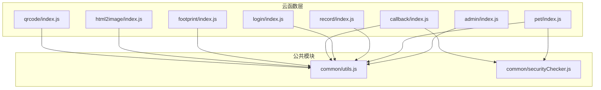
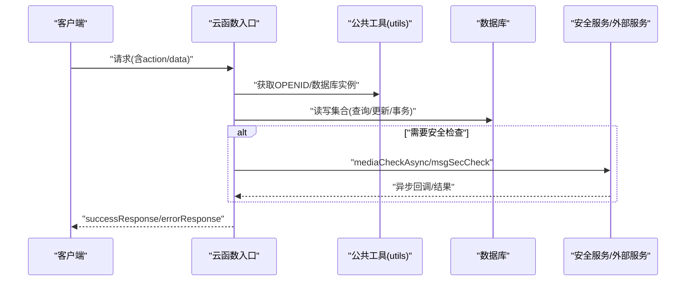
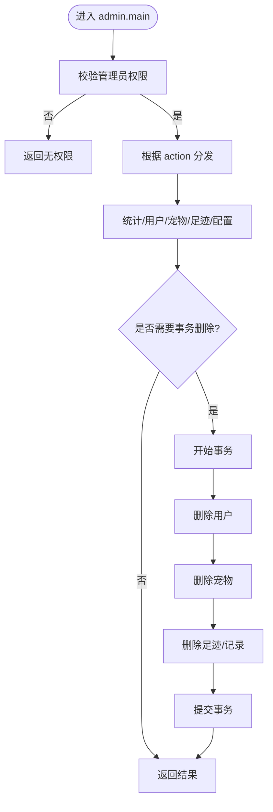
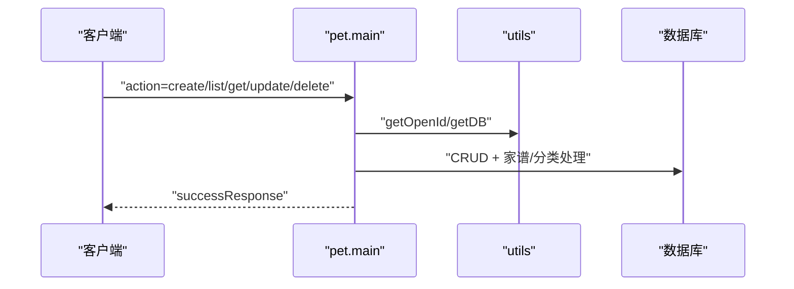
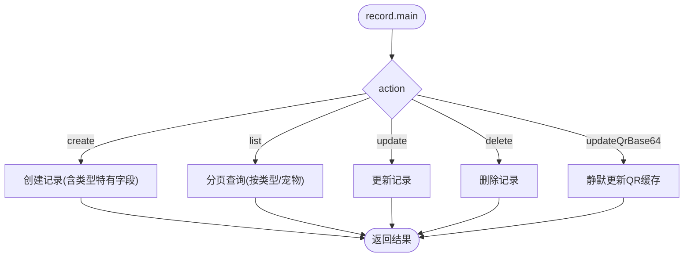
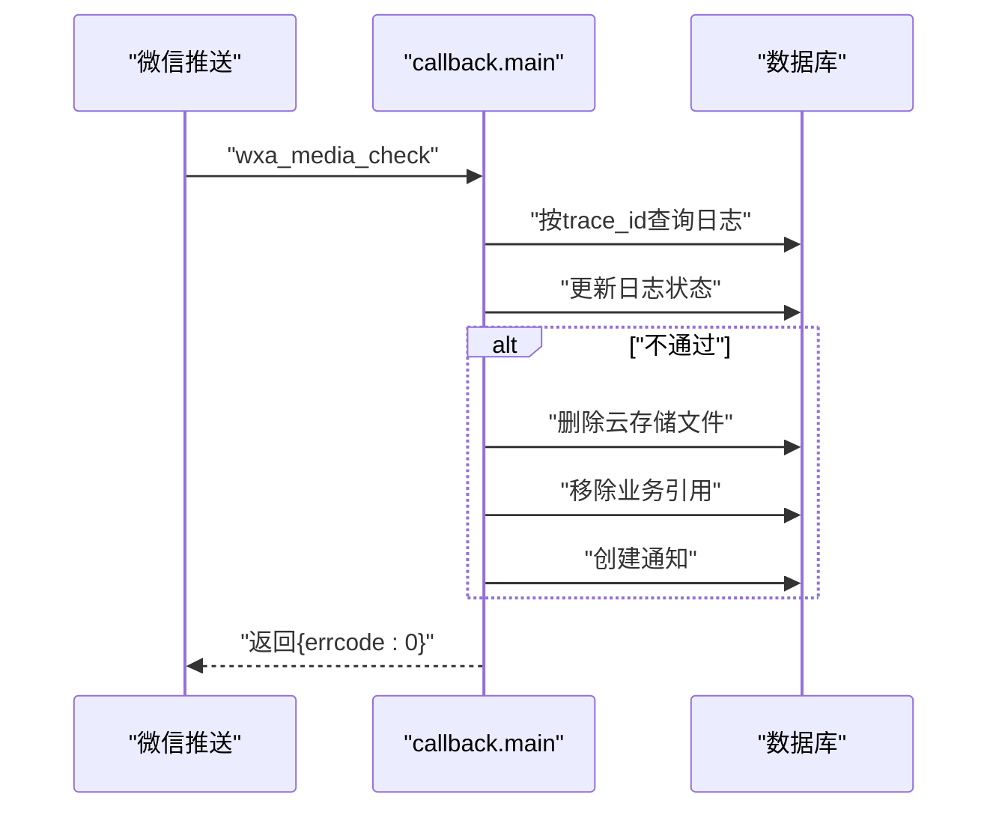
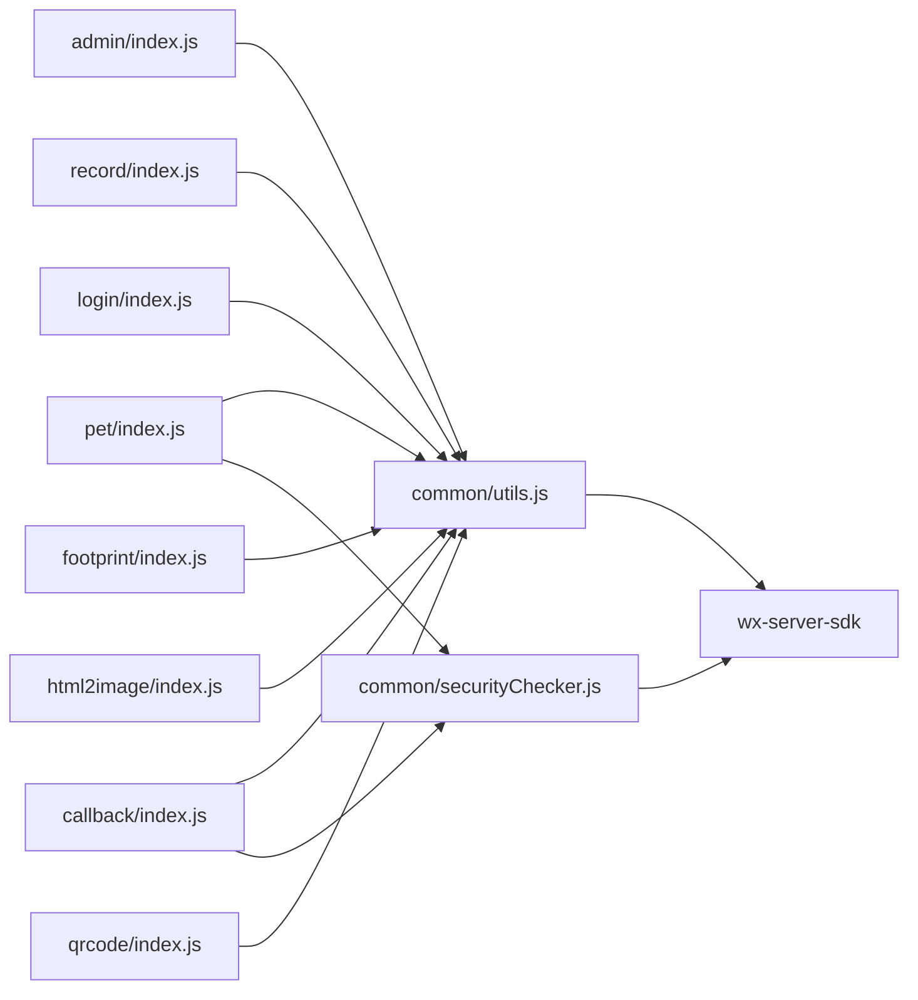

# 云函数性能优化

<cite>
**本文引用的文件**
- [cloudfunctions/admin/index.js](file://cloudfunctions/admin/index.js)
- [cloudfunctions/pet/index.js](file://cloudfunctions/pet/index.js)
- [cloudfunctions/record/index.js](file://cloudfunctions/record/index.js)
- [cloudfunctions/common/utils.js](file://cloudfunctions/common/utils.js)
- [cloudfunctions/common/securityChecker.js](file://cloudfunctions/common/securityChecker.js)
- [cloudfunctions/login/index.js](file://cloudfunctions/login/index.js)
- [cloudfunctions/callback/index.js](file://cloudfunctions/callback/index.js)
- [cloudfunctions/footprint/index.js](file://cloudfunctions/footprint/index.js)
- [cloudfunctions/html2image/index.js](file://cloudfunctions/html2image/index.js)
- [cloudfunctions/qrcode/index.js](file://cloudfunctions/qrcode/index.js)
- [cloudfunctions/admin/config.json](file://cloudfunctions/admin/config.json)
- [cloudfunctions/pet/config.json](file://cloudfunctions/pet/config.json)
- [cloudfunctions/record/config.json](file://cloudfunctions/record/config.json)
</cite>

## 目录
1. [引言](#引言)
2. [项目结构](#项目结构)
3. [核心组件](#核心组件)
4. [架构总览](#架构总览)
5. [详细组件分析](#详细组件分析)
6. [依赖关系分析](#依赖关系分析)
7. [性能考量](#性能考量)
8. [故障排查指南](#故障排查指南)
9. [结论](#结论)
10. [附录](#附录)

## 引言
本指南聚焦“养龟档案”项目的云函数性能优化，围绕冷启动、并发与资源管理、调用链与异步处理、错误重试、数据库交互（连接池、查询与事务）、内存与超时、成本控制、调试与监控、云函数间调用与数据传输优化等方面，结合现有代码实现给出可落地的最佳实践与改进建议。

## 项目结构
云函数采用按功能域划分的模块化组织方式，公共工具集中在 common 目录，各业务域（管理员、宠物、记录、登录、回调、足迹、HTML转图片、二维码）独立目录，便于职责清晰与性能隔离。

图示来源
- [cloudfunctions/admin/index.js:1-71](file://cloudfunctions/admin/index.js#L1-L71)
- [cloudfunctions/pet/index.js:1-82](file://cloudfunctions/pet/index.js#L1-L82)
- [cloudfunctions/record/index.js:1-35](file://cloudfunctions/record/index.js#L1-L35)
- [cloudfunctions/login/index.js:1-148](file://cloudfunctions/login/index.js#L1-L148)
- [cloudfunctions/callback/index.js:1-52](file://cloudfunctions/callback/index.js#L1-L52)
- [cloudfunctions/footprint/index.js:1-32](file://cloudfunctions/footprint/index.js#L1-L32)
- [cloudfunctions/html2image/index.js:1-27](file://cloudfunctions/html2image/index.js#L1-L27)
- [cloudfunctions/qrcode/index.js:1-22](file://cloudfunctions/qrcode/index.js#L1-L22)
- [cloudfunctions/common/utils.js:1-69](file://cloudfunctions/common/utils.js#L1-L69)
- [cloudfunctions/common/securityChecker.js:1-30](file://cloudfunctions/common/securityChecker.js#L1-L30)

章节来源
- [cloudfunctions/admin/index.js:1-71](file://cloudfunctions/admin/index.js#L1-L71)
- [cloudfunctions/pet/index.js:1-82](file://cloudfunctions/pet/index.js#L1-L82)
- [cloudfunctions/record/index.js:1-35](file://cloudfunctions/record/index.js#L1-L35)
- [cloudfunctions/common/utils.js:1-69](file://cloudfunctions/common/utils.js#L1-L69)

## 核心组件
- 数据库访问封装：统一初始化与获取数据库实例，减少重复初始化带来的冷启动开销。
- 请求响应封装：统一封装成功/失败响应，便于前端一致处理与错误上报。
- 权限与上下文：从云开发上下文提取 OPENID，贯穿各业务逻辑。
- 安全审核：封装图片/文本安全检查与异步回调处理，支持异步审核与违规清理。
- 业务域云函数：管理员、宠物、记录、登录、回调、足迹、HTML转图片、二维码等，职责单一、入口集中。

章节来源
- [cloudfunctions/common/utils.js:1-69](file://cloudfunctions/common/utils.js#L1-L69)
- [cloudfunctions/common/securityChecker.js:1-30](file://cloudfunctions/common/securityChecker.js#L1-L30)
- [cloudfunctions/admin/index.js:27-71](file://cloudfunctions/admin/index.js#L27-L71)
- [cloudfunctions/pet/index.js:45-82](file://cloudfunctions/pet/index.js#L45-L82)
- [cloudfunctions/record/index.js:10-35](file://cloudfunctions/record/index.js#L10-L35)
- [cloudfunctions/login/index.js:38-147](file://cloudfunctions/login/index.js#L38-L147)
- [cloudfunctions/callback/index.js:42-52](file://cloudfunctions/callback/index.js#L42-L52)
- [cloudfunctions/footprint/index.js:9-32](file://cloudfunctions/footprint/index.js#L9-L32)
- [cloudfunctions/html2image/index.js:14-27](file://cloudfunctions/html2image/index.js#L14-L27)
- [cloudfunctions/qrcode/index.js:7-22](file://cloudfunctions/qrcode/index.js#L7-L22)

## 架构总览
整体调用链以“云函数入口 -> 权限校验/参数解析 -> 业务处理 -> 数据库/外部服务 -> 响应封装”为主，部分场景引入异步回调（安全审核）与外部图片生成服务。

图示来源
- [cloudfunctions/common/utils.js:10-18](file://cloudfunctions/common/utils.js#L10-L18)
- [cloudfunctions/common/securityChecker.js:74-105](file://cloudfunctions/common/securityChecker.js#L74-L105)
- [cloudfunctions/admin/index.js:40-70](file://cloudfunctions/admin/index.js#L40-L70)
- [cloudfunctions/pet/index.js:84-138](file://cloudfunctions/pet/index.js#L84-L138)
- [cloudfunctions/record/index.js:37-82](file://cloudfunctions/record/index.js#L37-L82)

## 详细组件分析

### 管理员云函数（admin）
- 功能要点
  - 管理员权限校验（数据库兜底管理员列表）
  - 统一 action 分发，覆盖统计、用户、宠物、足迹、配置等多类操作
  - 并行查询与聚合统计，降低响应延迟
  - 事务删除用户及其关联数据，保证一致性
- 性能优化建议
  - 将管理员白名单缓存于内存或KV，避免每次查询 admins 集合
  - 对高频统计接口增加本地缓存与TTL
  - 删除用户时，事务内批量删除可合并为更少的事务调用次数
  - 对分页查询增加索引（如 users/pets/footprints 的 createdAt/openid）

图示来源
- [cloudfunctions/admin/index.js:27-71](file://cloudfunctions/admin/index.js#L27-L71)
- [cloudfunctions/admin/index.js:220-258](file://cloudfunctions/admin/index.js#L220-L258)

章节来源
- [cloudfunctions/admin/index.js:17-25](file://cloudfunctions/admin/index.js#L17-L25)
- [cloudfunctions/admin/index.js:74-115](file://cloudfunctions/admin/index.js#L74-L115)
- [cloudfunctions/admin/index.js:220-258](file://cloudfunctions/admin/index.js#L220-L258)

### 宠物云函数（pet）
- 功能要点
  - 宠物增删改查、公开列表、谱系查询、分类管理
  - URL净化（临时URL转cloud://fileID），确保后续引用稳定
  - 家谱树递归构建与主线提取，统计谱系信息
- 性能优化建议
  - 家谱树递归深度受 maxGeneration 控制，建议限制最大代数并做缓存
  - 分类同步到 categories 集合可异步执行，避免阻塞主流程
  - 列表查询增加复合索引（openid+category/gender/createdAt）

图示来源
- [cloudfunctions/pet/index.js:45-82](file://cloudfunctions/pet/index.js#L45-L82)
- [cloudfunctions/pet/index.js:140-180](file://cloudfunctions/pet/index.js#L140-L180)
- [cloudfunctions/pet/index.js:376-412](file://cloudfunctions/pet/index.js#L376-L412)

章节来源
- [cloudfunctions/pet/index.js:16-43](file://cloudfunctions/pet/index.js#L16-L43)
- [cloudfunctions/pet/index.js:140-180](file://cloudfunctions/pet/index.js#L140-L180)
- [cloudfunctions/pet/index.js:376-412](file://cloudfunctions/pet/index.js#L376-L412)
- [cloudfunctions/pet/index.js:417-469](file://cloudfunctions/pet/index.js#L417-L469)

### 记录云函数（record）
- 功能要点
  - 日常/产蛋/出苗/交配等记录的增删改查
  - QR缓存字段静默更新（仅记录创建者可更新）
- 性能优化建议
  - 列表查询按 petId/type/createdAt 建立复合索引
  - 静默更新QR缓存避免权限校验开销

图示来源
- [cloudfunctions/record/index.js:10-35](file://cloudfunctions/record/index.js#L10-L35)
- [cloudfunctions/record/index.js:37-82](file://cloudfunctions/record/index.js#L37-L82)
- [cloudfunctions/record/index.js:161-190](file://cloudfunctions/record/index.js#L161-L190)

章节来源
- [cloudfunctions/record/index.js:37-82](file://cloudfunctions/record/index.js#L37-L82)
- [cloudfunctions/record/index.js:161-190](file://cloudfunctions/record/index.js#L161-L190)

### 登录云函数（login）
- 功能要点
  - 检查管理员身份、更新用户信息、更新公开名片
  - 新用户注册时读取系统配置与创建用户记录
- 性能优化建议
  - 系统配置读取可缓存，避免频繁查询 systemConfig
  - 用户信息更新走增量更新，减少写放大

章节来源
- [cloudfunctions/login/index.js:24-36](file://cloudfunctions/login/index.js#L24-L36)
- [cloudfunctions/login/index.js:87-147](file://cloudfunctions/login/index.js#L87-L147)

### 回调云函数（callback）
- 功能要点
  - 接收微信异步审核结果，更新审核日志状态
  - 不通过时清理违规图片与业务引用，并发送通知
- 性能优化建议
  - 审核日志按 trace_id 建立索引，提升查找效率
  - 清理业务引用可批量执行，减少多次往返

图示来源
- [cloudfunctions/callback/index.js:42-52](file://cloudfunctions/callback/index.js#L42-L52)
- [cloudfunctions/callback/index.js:57-109](file://cloudfunctions/callback/index.js#L57-L109)
- [cloudfunctions/callback/index.js:114-197](file://cloudfunctions/callback/index.js#L114-L197)

章节来源
- [cloudfunctions/callback/index.js:57-109](file://cloudfunctions/callback/index.js#L57-L109)
- [cloudfunctions/callback/index.js:114-197](file://cloudfunctions/callback/index.js#L114-L197)

### 足迹云函数（footprint）
- 功能要点
  - 足迹增删改查，按类型/分页查询
- 性能优化建议
  - 限制每条足迹图片数量，避免大对象写入
  - 列表查询按 openid+type+createdAt 建立索引

章节来源
- [cloudfunctions/footprint/index.js:34-72](file://cloudfunctions/footprint/index.js#L34-L72)
- [cloudfunctions/footprint/index.js:74-107](file://cloudfunctions/footprint/index.js#L74-L107)

### HTML转图片云函数（html2image）
- 功能要点
  - 调用外部图片生成服务，支持上传至COS或云开发存储
  - 读取系统配置（服务地址、超时、COS凭据）
- 性能优化建议
  - 外部服务调用设置合理超时与重试
  - COS上传失败时降级返回本地图片，不影响主流程
  - 配置项缓存，避免每次查询 systemConfig

章节来源
- [cloudfunctions/html2image/index.js:66-140](file://cloudfunctions/html2image/index.js#L66-L140)
- [cloudfunctions/html2image/index.js:145-172](file://cloudfunctions/html2image/index.js#L145-L172)
- [cloudfunctions/html2image/index.js:177-205](file://cloudfunctions/html2image/index.js#L177-L205)

### 二维码云函数（qrcode）
- 功能要点
  - 生成小程序码与URL Link（多环境兼容）
- 性能优化建议
  - URL Link生成多环境回退策略，避免失败导致阻塞
  - 二维码上传云存储后返回fileID，客户端直接引用

章节来源
- [cloudfunctions/qrcode/index.js:24-61](file://cloudfunctions/qrcode/index.js#L24-L61)
- [cloudfunctions/qrcode/index.js:65-117](file://cloudfunctions/qrcode/index.js#L65-L117)

## 依赖关系分析
- 公共工具依赖 wx-server-sdk，提供数据库、上传、二维码、URL Link、安全开放接口等能力
- 安全检查器依赖 wx-server-sdk 的 security/openapi 能力，负责媒体与文本审核
- 业务云函数通过公共工具获取数据库实例与上下文，保持一致的初始化与响应格式

图示来源
- [cloudfunctions/common/utils.js:1-8](file://cloudfunctions/common/utils.js#L1-L8)
- [cloudfunctions/common/securityChecker.js:1-10](file://cloudfunctions/common/securityChecker.js#L1-L10)
- [cloudfunctions/pet/index.js:1-9](file://cloudfunctions/pet/index.js#L1-L9)
- [cloudfunctions/callback/index.js:36-40](file://cloudfunctions/callback/index.js#L36-L40)

章节来源
- [cloudfunctions/common/utils.js:1-8](file://cloudfunctions/common/utils.js#L1-L8)
- [cloudfunctions/common/securityChecker.js:1-10](file://cloudfunctions/common/securityChecker.js#L1-L10)

## 性能考量

### 冷启动优化
- 初始化复用：数据库实例通过公共工具统一获取，避免在模块作用域重复初始化
- 环境变量：使用动态环境 ID，减少硬编码带来的切换成本
- 依赖精简：仅引入必要模块，避免加载无关依赖

章节来源
- [cloudfunctions/common/utils.js:10-13](file://cloudfunctions/common/utils.js#L10-L13)
- [cloudfunctions/pet/index.js:1-9](file://cloudfunctions/pet/index.js#L1-L9)

### 并发与资源管理
- 并行查询：管理员统计使用 Promise.all 并行多个 count 查询，缩短总耗时
- 事务控制：删除用户时使用事务保证一致性，避免部分失败导致脏数据
- 资源释放：外部HTTP调用设置超时，COS上传失败时降级返回

章节来源
- [cloudfunctions/admin/index.js:75-79](file://cloudfunctions/admin/index.js#L75-L79)
- [cloudfunctions/admin/index.js:227-257](file://cloudfunctions/admin/index.js#L227-L257)
- [cloudfunctions/html2image/index.js:82-98](file://cloudfunctions/html2image/index.js#L82-L98)

### 调用链与异步处理
- 异步审核：安全检查通过 mediaCheckAsync 异步提交，回调云函数处理结果
- 静默更新：记录QR缓存仅在创建者权限下更新，避免多余校验
- 多环境URL Link：生成URL Link失败时回退到纯文本链接

章节来源
- [cloudfunctions/common/securityChecker.js:74-105](file://cloudfunctions/common/securityChecker.js#L74-L105)
- [cloudfunctions/callback/index.js:57-109](file://cloudfunctions/callback/index.js#L57-L109)
- [cloudfunctions/record/index.js:162-190](file://cloudfunctions/record/index.js#L162-L190)
- [cloudfunctions/qrcode/index.js:80-93](file://cloudfunctions/qrcode/index.js#L80-L93)

### 错误重试机制
- 外部服务调用：设置超时与降级返回，避免阻塞主流程
- 审核回调：按 trace_id 查找日志，更新状态并执行清理，失败记录日志

章节来源
- [cloudfunctions/html2image/index.js:132-139](file://cloudfunctions/html2image/index.js#L132-L139)
- [cloudfunctions/callback/index.js:62-88](file://cloudfunctions/callback/index.js#L62-L88)

### 数据库交互优化
- 连接池：云开发数据库内置连接池，无需手动管理
- 查询优化：分页查询、条件过滤、字段投影（如 categories 字段选择）、索引建立
- 事务处理：删除用户时使用事务，保证跨集合一致性

章节来源
- [cloudfunctions/pet/index.js:638-647](file://cloudfunctions/pet/index.js#L638-L647)
- [cloudfunctions/admin/index.js:227-257](file://cloudfunctions/admin/index.js#L227-L257)

### 内存使用与超时控制
- 内存：避免在函数作用域构造超大数组，及时释放中间变量
- 超时：外部HTTP调用设置合理超时（如图片生成服务），防止长时间占用
- 成本：COS上传失败时降级返回本地图片，减少不必要的上传成本

章节来源
- [cloudfunctions/html2image/index.js:75-78](file://cloudfunctions/html2image/index.js#L75-L78)
- [cloudfunctions/html2image/index.js:96-98](file://cloudfunctions/html2image/index.js#L96-L98)

### 调试、监控与性能分析
- 日志：统一使用 console 输出错误与关键路径日志
- 响应：successResponse/errorResponse 统一结构，便于前端与监控系统解析
- 审核日志：安全检查结果写入 security_logs，便于追踪与审计

章节来源
- [cloudfunctions/common/utils.js:28-35](file://cloudfunctions/common/utils.js#L28-L35)
- [cloudfunctions/common/securityChecker.js:188-204](file://cloudfunctions/common/securityChecker.js#L188-L204)

### 云函数间调用与数据传输优化
- 回调云函数：通过 trace_id 关联审核日志，避免轮询
- 数据传输：二维码生成返回fileID，客户端直连云存储；HTML转图片可返回COS URL或本地图片

章节来源
- [cloudfunctions/callback/index.js:62-88](file://cloudfunctions/callback/index.js#L62-L88)
- [cloudfunctions/qrcode/index.js:38-47](file://cloudfunctions/qrcode/index.js#L38-L47)
- [cloudfunctions/html2image/index.js:104-118](file://cloudfunctions/html2image/index.js#L104-L118)

## 故障排查指南
- 权限不足：确认 OPENID 是否在管理员列表或业务数据归属范围内
- 审核不通过：检查 security_logs 中 trace_id 与 label，确认清理流程是否执行
- 外部服务失败：检查图片生成服务地址、超时与COS凭据配置
- 事务回滚：删除用户失败时检查事务回滚日志与错误信息

章节来源
- [cloudfunctions/admin/index.js:35-38](file://cloudfunctions/admin/index.js#L35-L38)
- [cloudfunctions/callback/index.js:96-109](file://cloudfunctions/callback/index.js#L96-L109)
- [cloudfunctions/html2image/index.js:32-55](file://cloudfunctions/html2image/index.js#L32-L55)
- [cloudfunctions/admin/index.js:254-257](file://cloudfunctions/admin/index.js#L254-L257)

## 结论
通过对云函数的初始化复用、并行查询、事务一致性、异步回调、外部服务超时与降级、索引与缓存策略的综合优化，可在保证功能正确性的前提下显著提升系统性能与稳定性。建议在生产环境中持续监控关键指标（冷启动时间、平均响应时间、错误率、超时率、COS上传失败率），并结合业务热点数据建立缓存与索引，进一步降低延迟与成本。

## 附录
- 配置文件
  - admin/record/pet 的 config.json 当前为空，建议按需开启所需 openapi 权限
- 建议的索引与缓存
  - users/pets/footprints/records：按 openid、createdAt、type、petId 等建立复合索引
  - systemConfig：读取频率高，建议缓存
  - 审核日志：按 trace_id 建立索引

章节来源
- [cloudfunctions/admin/config.json:1-6](file://cloudfunctions/admin/config.json#L1-L6)
- [cloudfunctions/pet/config.json:1-6](file://cloudfunctions/pet/config.json#L1-L6)
- [cloudfunctions/record/config.json:1-6](file://cloudfunctions/record/config.json#L1-L6)