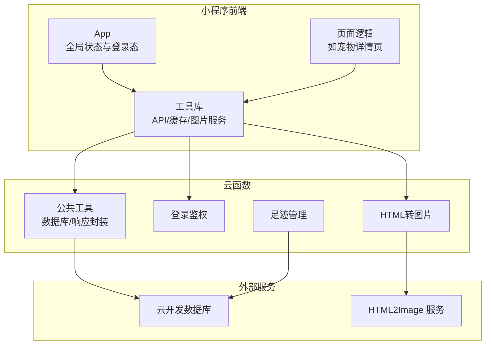
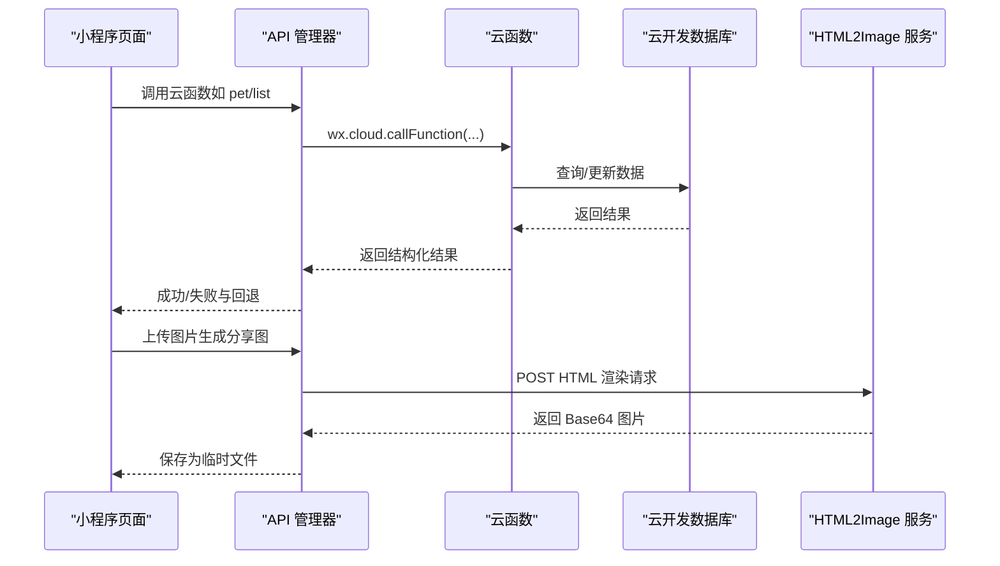
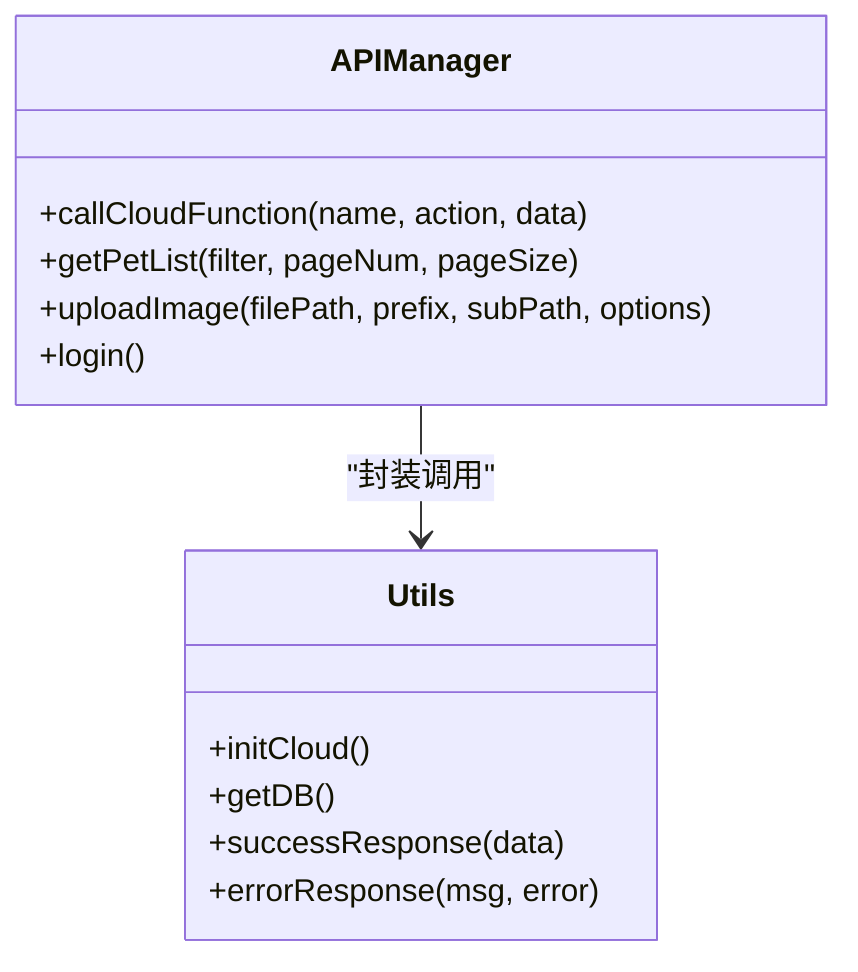
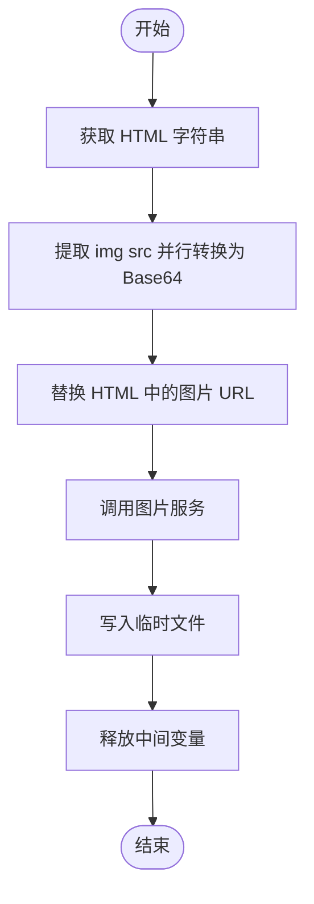
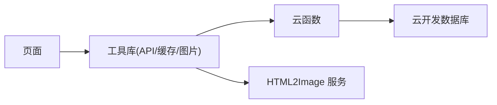

# 内存管理优化

<cite>
**本文引用的文件**
- [miniprogram/app.js](file://miniprogram/app.js)
- [miniprogram/utils/cache.js](file://miniprogram/utils/cache.js)
- [miniprogram/utils/api.js](file://miniprogram/utils/api.js)
- [miniprogram/utils/imageService.js](file://miniprogram/utils/imageService.js)
- [miniprogram/utils/theme.js](file://miniprogram/utils/theme.js)
- [miniprogram/pages/pet/detail.js](file://miniprogram/pages/pet/detail.js)
- [cloudfunctions/common/utils.js](file://cloudfunctions/common/utils.js)
- [cloudfunctions/login/index.js](file://cloudfunctions/login/index.js)
- [cloudfunctions/html2image/index.js](file://cloudfunctions/html2image/index.js)
- [cloudfunctions/footprint/index.js](file://cloudfunctions/footprint/index.js)
</cite>

## 目录
1. [引言](#引言)
2. [项目结构](#项目结构)
3. [核心组件](#核心组件)
4. [架构总览](#架构总览)
5. [详细组件分析](#详细组件分析)
6. [依赖分析](#依赖分析)
7. [性能考量](#性能考量)
8. [故障排查指南](#故障排查指南)
9. [结论](#结论)
10. [附录](#附录)

## 引言
本指南聚焦“养龟档案”项目的内存管理优化，覆盖小程序端与云函数端的内存使用模式、垃圾回收机制、内存泄漏预防策略，并结合项目实际代码，给出对象生命周期管理、闭包优化、循环引用规避、大对象与数组处理、字符串处理、缓存策略、内存监控与分析方法，以及跨平台（iOS/Android）适配建议。目标是帮助开发者在保证功能正确性的前提下，显著降低内存峰值、减少卡顿与崩溃风险，提升用户体验。

## 项目结构
项目由四大部分组成：
- 小程序前端（miniprogram）：页面、工具库、缓存与图片生成服务
- 云函数（cloudfunctions）：业务逻辑与数据库交互
- HTML2Image 服务（html2image-server 与 cloudfunctions/html2image）：图片渲染与存储
- Cloudflare Worker（cloudflare-worker）：边缘代理与静态资源

**图表来源**
- [miniprogram/app.js:1-312](file://miniprogram/app.js#L1-L312)
- [miniprogram/utils/api.js:1-208](file://miniprogram/utils/api.js#L1-L208)
- [cloudfunctions/common/utils.js:1-69](file://cloudfunctions/common/utils.js#L1-L69)
- [cloudfunctions/login/index.js:1-148](file://cloudfunctions/login/index.js#L1-L148)
- [cloudfunctions/html2image/index.js:1-205](file://cloudfunctions/html2image/index.js#L1-L205)
- [cloudfunctions/footprint/index.js:1-160](file://cloudfunctions/footprint/index.js#L1-L160)

**章节来源**
- [miniprogram/app.js:1-312](file://miniprogram/app.js#L1-L312)
- [miniprogram/utils/api.js:1-208](file://miniprogram/utils/api.js#L1-L208)
- [cloudfunctions/common/utils.js:1-69](file://cloudfunctions/common/utils.js#L1-L69)
- [cloudfunctions/login/index.js:1-148](file://cloudfunctions/login/index.js#L1-L148)
- [cloudfunctions/html2image/index.js:1-205](file://cloudfunctions/html2image/index.js#L1-L205)
- [cloudfunctions/footprint/index.js:1-160](file://cloudfunctions/footprint/index.js#L1-L160)

## 核心组件
- 全局应用与登录态管理：负责系统配置加载、登录态持久化、二维码生成与安全通知检查，直接影响全局内存占用与生命周期。
- API 管理器：统一封装云函数调用、错误处理与回退策略，避免重复创建实例导致的内存泄漏。
- 缓存管理：基于本地存储的带过期控制的缓存，包含清理过期项与存储满错误的兜底处理。
- 图片生成服务：将 HTML 渲染为图片，涉及大量字符串拼接、Base64 转换与临时文件写入，是内存与磁盘 IO 的关键点。
- 云函数工具：封装数据库初始化、上下文获取、响应封装与动作包装，统一错误处理与返回格式。

**章节来源**
- [miniprogram/app.js:1-312](file://miniprogram/app.js#L1-L312)
- [miniprogram/utils/api.js:1-208](file://miniprogram/utils/api.js#L1-L208)
- [miniprogram/utils/cache.js:1-121](file://miniprogram/utils/cache.js#L1-L121)
- [miniprogram/utils/imageService.js:1-202](file://miniprogram/utils/imageService.js#L1-L202)
- [cloudfunctions/common/utils.js:1-69](file://cloudfunctions/common/utils.js#L1-L69)

## 架构总览
小程序前端通过 API 管理器调用云函数，云函数访问云开发数据库与外部 HTML2Image 服务，最终返回结果给前端。图片生成链路中，前端将 HTML 转为 Base64 图片，再写入用户数据目录临时文件，涉及大量字符串与二进制数据的转换与复制。

**图表来源**
- [miniprogram/utils/api.js:12-38](file://miniprogram/utils/api.js#L12-L38)
- [cloudfunctions/login/index.js:38-147](file://cloudfunctions/login/index.js#L38-L147)
- [cloudfunctions/html2image/index.js:66-140](file://cloudfunctions/html2image/index.js#L66-L140)

## 详细组件分析

### 全局应用与登录态管理（内存与生命周期）
- 全局状态：包含登录态、系统配置、预加载数据等，应避免在全局对象中存放大型不可序列化对象，减少常驻内存。
- 登录流程：异步获取 openid 并持久化，成功后触发二维码生成与安全通知检查，注意在失败时及时隐藏加载与提示，释放 UI 资源。
- 页面跳转与退出：退出时清理全局状态并尝试页面跳转，失败时降级提示，避免长时间持有回调或定时器。

优化要点
- 控制全局对象大小，避免在 globalData 中存放大型数组或深层嵌套对象。
- 在 onUnload/onHide 中停止蓝牙扫描等资源，防止后台仍占用。
- 使用 try/catch 包裹存储操作，失败时降级并记录日志，避免异常中断流程。

**章节来源**
- [miniprogram/app.js:292-310](file://miniprogram/app.js#L292-L310)
- [miniprogram/app.js:84-140](file://miniprogram/app.js#L84-L140)
- [miniprogram/app.js:233-256](file://miniprogram/app.js#L233-L256)
- [miniprogram/pages/pet/detail.js:229-239](file://miniprogram/pages/pet/detail.js#L229-L239)

### API 管理器（对象生命周期与闭包）
- 单例模式：通过惰性创建与缓存实例，避免重复构造带来的内存抖动。
- 错误处理：捕获云函数调用异常，设置可用性标记，便于后续回退策略。
- 云函数封装：统一封装调用与结果解析，减少页面层样板代码。

优化要点
- 避免在实例方法中捕获大对象形成闭包，必要时在方法结束时释放引用。
- 对于频繁调用的接口，考虑结果缓存与去重，减少重复请求。
- 在页面卸载时取消未完成的请求，避免悬挂回调。

**图表来源**
- [miniprogram/utils/api.js:4-208](file://miniprogram/utils/api.js#L4-L208)
- [cloudfunctions/common/utils.js:1-69](file://cloudfunctions/common/utils.js#L1-L69)

**章节来源**
- [miniprogram/utils/api.js:4-208](file://miniprogram/utils/api.js#L4-L208)
- [cloudfunctions/common/utils.js:1-69](file://cloudfunctions/common/utils.js#L1-L69)

### 缓存管理（过期清理与存储满兜底）
- 命名空间与过期键：统一前缀与过期键，按需清理过期项，避免无限增长。
- 存储满兜底：当写入失败且命中存储错误时，主动清理旧缓存并重试，保障关键数据写入。
- 清理策略：遍历存储键，逐项校验过期并删除，避免一次性读取过多造成内存峰值。

优化要点
- 控制缓存项大小与数量，对热点数据设置合理过期时间。
- 清理过程尽量异步化，避免阻塞主线程。
- 对异常进行幂等处理，避免重复清理或写入。

**章节来源**
- [miniprogram/utils/cache.js:1-121](file://miniprogram/utils/cache.js#L1-L121)

### 图片生成服务（大对象与字符串处理）
- HTML 转 Base64：提取 img src 并行转换，替换 HTML 中的图片 URL，涉及大量字符串拼接与正则匹配。
- 请求与保存：向 HTML2Image 服务发起请求，接收 Base64 数据后写入用户数据目录临时文件。
- 资源释放：写入完成后释放中间变量，避免长生命周期持有大字符串。

**图表来源**
- [miniprogram/utils/theme.js:103-133](file://miniprogram/utils/theme.js#L103-L133)
- [miniprogram/utils/imageService.js:59-80](file://miniprogram/utils/imageService.js#L59-L80)
- [miniprogram/utils/imageService.js:98-143](file://miniprogram/utils/imageService.js#L98-L143)
- [miniprogram/utils/imageService.js:149-196](file://miniprogram/utils/imageService.js#L149-L196)

**章节来源**
- [miniprogram/utils/theme.js:1-800](file://miniprogram/utils/theme.js#L1-L800)
- [miniprogram/utils/imageService.js:1-202](file://miniprogram/utils/imageService.js#L1-L202)

### 云函数工具与业务（数据库与响应封装）
- 数据库初始化：按需初始化云 SDK，避免重复初始化造成的资源浪费。
- 响应封装：统一 success/error 返回结构，便于前端解析与错误处理。
- 动作包装：将业务动作包裹在 try/catch 中，确保异常被捕获并返回标准格式。

**章节来源**
- [cloudfunctions/common/utils.js:1-69](file://cloudfunctions/common/utils.js#L1-L69)
- [cloudfunctions/login/index.js:1-148](file://cloudfunctions/login/index.js#L1-L148)
- [cloudfunctions/html2image/index.js:1-205](file://cloudfunctions/html2image/index.js#L1-L205)
- [cloudfunctions/footprint/index.js:1-160](file://cloudfunctions/footprint/index.js#L1-L160)

## 依赖分析
- 小程序端依赖关系：页面依赖工具库，工具库依赖云函数；云函数依赖云开发 SDK 与数据库。
- 跨域与网络：图片生成依赖外部 HTML2Image 服务，需关注超时与失败重试。
- 资源耦合：图片生成链路中，前端与云函数均涉及大量字符串与二进制数据处理，需避免重复拷贝与长生命周期持有。

**图表来源**
- [miniprogram/utils/api.js:12-38](file://miniprogram/utils/api.js#L12-L38)
- [cloudfunctions/common/utils.js:10-13](file://cloudfunctions/common/utils.js#L10-L13)
- [cloudfunctions/html2image/index.js:66-140](file://cloudfunctions/html2image/index.js#L66-L140)

**章节来源**
- [miniprogram/utils/api.js:1-208](file://miniprogram/utils/api.js#L1-L208)
- [cloudfunctions/common/utils.js:1-69](file://cloudfunctions/common/utils.js#L1-L69)
- [cloudfunctions/html2image/index.js:1-205](file://cloudfunctions/html2image/index.js#L1-L205)

## 性能考量
- 大对象与数组
  - 避免在全局或页面 data 中存放大型数组，分页加载与懒加载策略优先。
  - 对数组操作采用就地修改与浅拷贝，减少深拷贝与中间副本。
- 字符串处理
  - HTML 转 Base64 时避免重复拼接，使用模板字符串或数组 join。
  - 正则匹配与替换尽量限定范围，避免全局扫描。
- 临时文件与内存
  - 图片写入临时文件后及时释放中间字符串与 Buffer，避免长生命周期持有。
  - 控制并发数量，避免同时转换过多图片导致内存峰值过高。
- 缓存策略
  - 合理设置过期时间与容量上限，定期清理过期项。
  - 对热点数据进行压缩或降采样，减少内存占用。

[本节为通用指导，无需列出具体文件来源]

## 故障排查指南
- 登录态与存储错误
  - 现象：设置存储失败、存储满报错。
  - 排查：检查存储错误信息，触发清理旧缓存并重试。
- 图片生成失败
  - 现象：生成图片超时或失败。
  - 排查：检查 HTML2Image 服务可达性、超时配置与网络状态；前端隐藏加载提示并提示重试。
- 云函数异常
  - 现象：云函数调用抛错或返回失败。
  - 排查：查看错误日志与返回消息，启用回退策略（如本地缓存或降级接口）。
- 页面生命周期
  - 现象：页面切换卡顿或后台资源未释放。
  - 排查：在 onHide/onUnload 中停止蓝牙扫描、取消请求与定时器，避免资源泄露。

**章节来源**
- [miniprogram/utils/cache.js:18-35](file://miniprogram/utils/cache.js#L18-L35)
- [miniprogram/utils/imageService.js:133-142](file://miniprogram/utils/imageService.js#L133-L142)
- [miniprogram/utils/api.js:27-37](file://miniprogram/utils/api.js#L27-L37)
- [miniprogram/pages/pet/detail.js:229-239](file://miniprogram/pages/pet/detail.js#L229-L239)

## 结论
通过规范全局状态与生命周期管理、优化 API 管理器的实例与闭包使用、完善缓存的过期与兜底策略、严格控制图片生成链路中的大对象与字符串处理、以及强化页面生命周期与云函数异常处理，可以显著降低“养龟档案”项目的内存峰值与泄漏风险。建议在持续集成中加入内存与性能回归测试，确保优化效果稳定。

## 附录
- 跨平台适配建议
  - iOS：更严格的内存限制与后台冻结策略，需减少后台常驻任务与大对象持有。
  - Android：注意内存抖动与 GC 抖动，避免在主线程进行大量字符串拼接与文件写入。
- 内存监控与分析
  - 使用微信开发者工具的性能面板与内存快照，定位大对象与泄漏点。
  - 对高频接口与图片生成链路进行采样分析，识别峰值与耗时热点。

[本节为通用指导，无需列出具体文件来源]