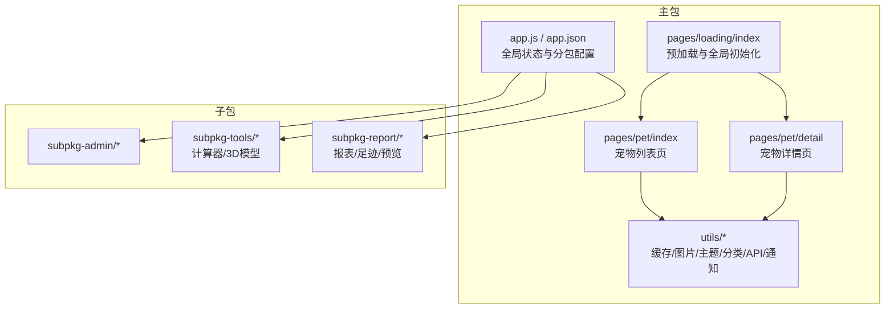
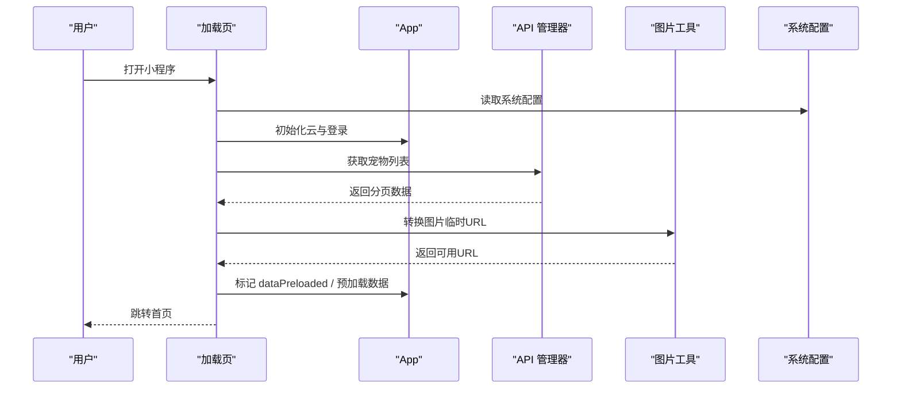
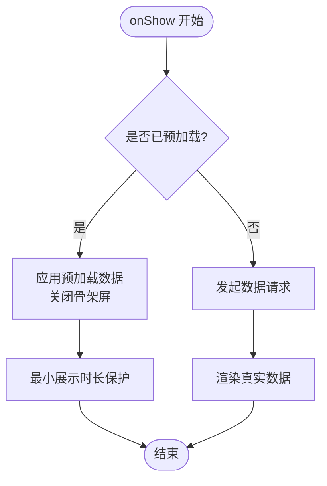
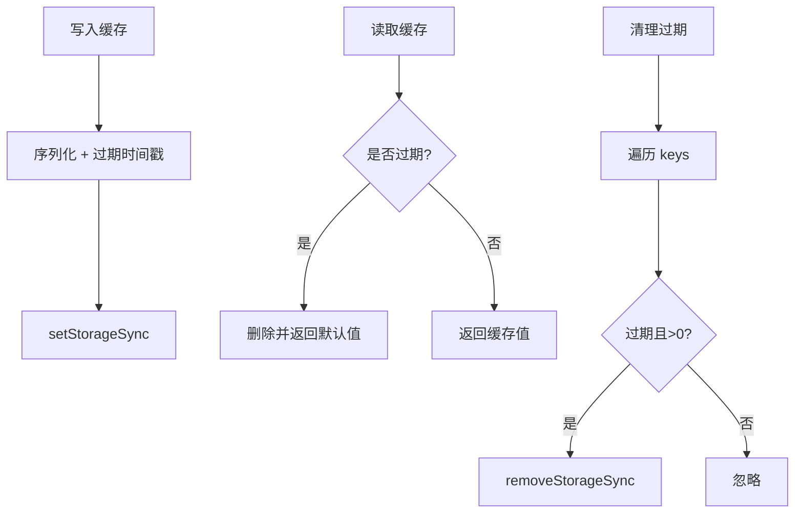
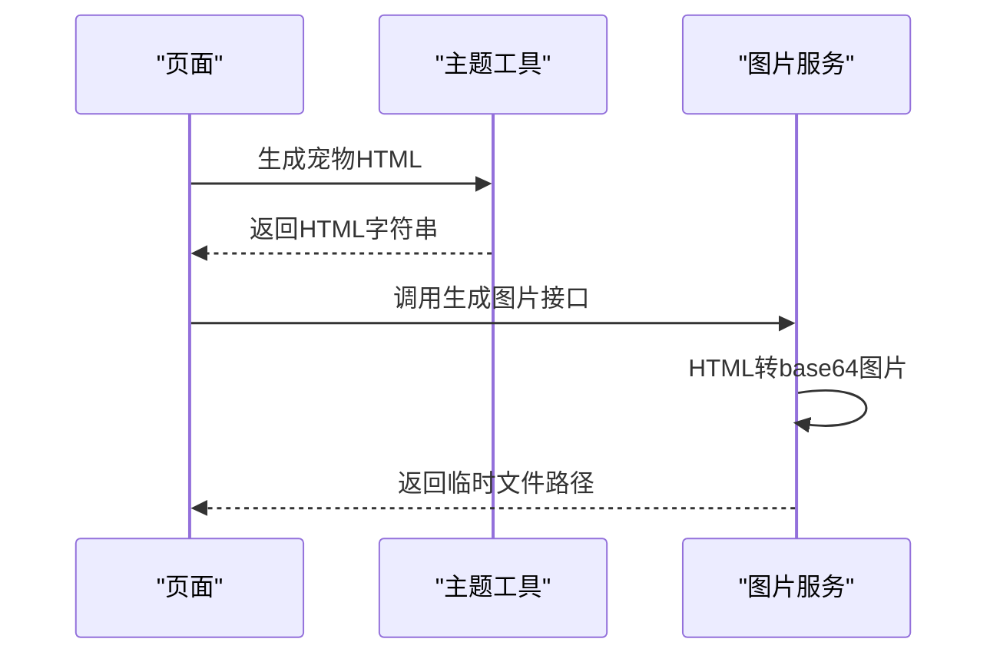
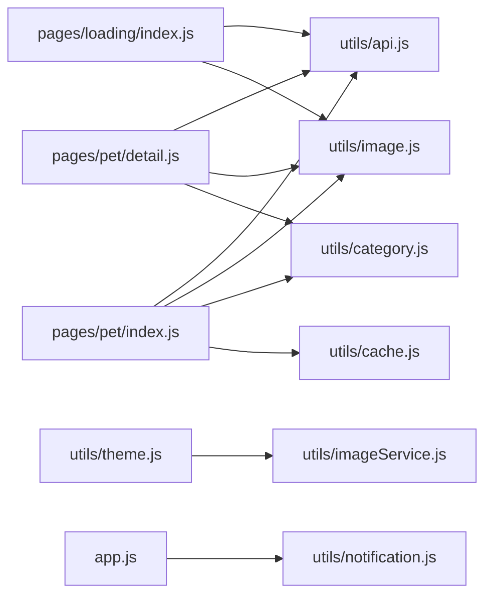

# 前端性能优化

<cite>
**本文引用的文件**
- [miniprogram/app.js](file://miniprogram/app.js)
- [miniprogram/app.json](file://miniprogram/app.json)
- [miniprogram/utils/cache.js](file://miniprogram/utils/cache.js)
- [miniprogram/utils/theme.js](file://miniprogram/utils/theme.js)
- [miniprogram/utils/category.js](file://miniprogram/utils/category.js)
- [miniprogram/utils/api.js](file://miniprogram/utils/api.js)
- [miniprogram/utils/image.js](file://miniprogram/utils/image.js)
- [miniprogram/utils/imageService.js](file://miniprogram/utils/imageService.js)
- [miniprogram/utils/notification.js](file://miniprogram/utils/notification.js)
- [miniprogram/pages/pet/detail.js](file://miniprogram/pages/pet/detail.js)
- [miniprogram/pages/pet/index.js](file://miniprogram/pages/pet/index.js)
- [miniprogram/pages/loading/index.js](file://miniprogram/pages/loading/index.js)
- [miniprogram/subpkg-tools/pages/tools/calculator.js](file://miniprogram/subpkg-tools/pages/tools/calculator.js)
- [miniprogram/project.config.json](file://miniprogram/project.config.json)
- [miniprogram/sitemap.json](file://miniprogram/sitemap.json)
</cite>

## 目录
1. [引言](#引言)
2. [项目结构](#项目结构)
3. [核心组件](#核心组件)
4. [架构总览](#架构总览)
5. [详细组件分析](#详细组件分析)
6. [依赖分析](#依赖分析)
7. [性能考量](#性能考量)
8. [故障排查指南](#故障排查指南)
9. [结论](#结论)
10. [附录](#附录)

## 引言
本指南聚焦“养龟档案”小程序前端的性能优化，围绕页面渲染性能、组件复用策略、状态管理优化、缓存机制（本地存储、内存缓存、网络请求缓存）、主题切换与分类管理、页面生命周期与事件处理、DOM 操作优化、分包与按需加载、资源压缩、以及小程序特有的性能瓶颈（渲染阻塞、内存泄漏、网络请求优化）等方面，提供系统性的分析与实操建议，并给出具体调优案例与监控方法。

## 项目结构
项目采用分包架构，主包负责基础能力与核心页面，子包承载管理、工具与报表功能，配合懒加载与预加载策略提升首屏体验与运行效率。全局配置启用懒代码加载与 WXML 压缩，减少包体积与初次渲染压力。

图表来源
- [miniprogram/app.json:11-40](file://miniprogram/app.json#L11-L40)
- [miniprogram/pages/loading/index.js:15-43](file://miniprogram/pages/loading/index.js#L15-L43)
- [miniprogram/pages/pet/index.js:97-139](file://miniprogram/pages/pet/index.js#L97-L139)
- [miniprogram/pages/pet/detail.js:158-216](file://miniprogram/pages/pet/detail.js#L158-L216)

章节来源
- [miniprogram/app.json:11-40](file://miniprogram/app.json#L11-L40)
- [miniprogram/project.config.json:19-30](file://miniprogram/project.config.json#L19-L30)

## 核心组件
- 全局应用层：负责云初始化、系统配置加载、登录态与二维码预生成、通知检查、全局数据预加载标记。
- 页面层：加载页负责串行预热与预加载；列表页负责骨架屏控制、分页与去重、本地回退；详情页负责公开/私有模式切换、图片 URL 转换与错误兜底。
- 工具层：缓存管理（带过期清理）、图片转换与净化、主题与 HTML 生成、分类合并与同步、API 统一封装、通知管理、图片服务（Puppeteer 渲染）。

章节来源
- [miniprogram/app.js:1-312](file://miniprogram/app.js#L1-L312)
- [miniprogram/pages/loading/index.js:15-74](file://miniprogram/pages/loading/index.js#L15-L74)
- [miniprogram/pages/pet/index.js:199-338](file://miniprogram/pages/pet/index.js#L199-L338)
- [miniprogram/pages/pet/detail.js:420-514](file://miniprogram/pages/pet/detail.js#L420-L514)
- [miniprogram/utils/cache.js:1-121](file://miniprogram/utils/cache.js#L1-L121)
- [miniprogram/utils/image.js:38-108](file://miniprogram/utils/image.js#L38-L108)
- [miniprogram/utils/theme.js:103-133](file://miniprogram/utils/theme.js#L103-L133)
- [miniprogram/utils/category.js:4-59](file://miniprogram/utils/category.js#L4-L59)
- [miniprogram/utils/api.js:12-38](file://miniprogram/utils/api.js#L12-L38)
- [miniprogram/utils/notification.js:41-54](file://miniprogram/utils/notification.js#L41-L54)
- [miniprogram/utils/imageService.js:59-80](file://miniprogram/utils/imageService.js#L59-L80)

## 架构总览
小程序前端采用“预加载 + 分包 + 懒加载”的组合策略：加载页串行初始化云与登录，预取宠物列表与分类，填充全局预加载标记；首页与详情页在 onShow 时根据预加载状态快速渲染骨架屏后切换真实数据；子包按需加载，降低主包体积与冷启动时间。

图表来源
- [miniprogram/pages/loading/index.js:15-43](file://miniprogram/pages/loading/index.js#L15-L43)
- [miniprogram/app.js:17-58](file://miniprogram/app.js#L17-L58)
- [miniprogram/utils/api.js:43-49](file://miniprogram/utils/api.js#L43-L49)
- [miniprogram/utils/image.js:64-80](file://miniprogram/utils/image.js#L64-L80)

## 详细组件分析

### 页面渲染性能与骨架屏策略
- 骨架屏最小展示时长：首页在 onShow 时记录开始时间，隐藏时延时至少 600ms，避免闪烁。
- 预加载与骨架屏：加载页完成后，首页 onShow 时直接使用预加载数据，后台静默刷新，保证首屏快速可见。
- 列表去重与分页：合并新旧数据时基于 id 去重，避免重复渲染。
- 图片转换与错误兜底：详情页在图片加载失败时主动刷新临时 URL 或清空无效图片，避免长时间占位。

图表来源
- [miniprogram/pages/pet/index.js:111-127](file://miniprogram/pages/pet/index.js#L111-L127)
- [miniprogram/pages/pet/index.js:147-154](file://miniprogram/pages/pet/index.js#L147-L154)

章节来源
- [miniprogram/pages/pet/index.js:97-154](file://miniprogram/pages/pet/index.js#L97-L154)
- [miniprogram/pages/loading/index.js:45-74](file://miniprogram/pages/loading/index.js#L45-L74)

### 组件复用与状态管理优化
- 全局状态集中：App 全局数据包含预加载标记与预取数据，页面通过 onShow 读取，避免重复请求。
- 分类合并与同步：分类工具提供去重与云端补齐，避免 UI 重复渲染与网络抖动。
- 通知管理节流：通知管理器对未读查询做 1 分钟节流，减少频繁请求。

章节来源
- [miniprogram/app.js:292-310](file://miniprogram/app.js#L292-L310)
- [miniprogram/utils/category.js:4-24](file://miniprogram/utils/category.js#L4-L24)
- [miniprogram/utils/notification.js:41-54](file://miniprogram/utils/notification.js#L41-L54)

### 缓存机制实现原理
- 本地存储缓存：以统一前缀 + 过期时间键值存储，支持清理过期项与批量清空。
- 内存缓存：App 全局预加载数据作为内存缓存，页面 onShow 优先命中。
- 网络请求缓存：列表页在本地存在有效临时 URL 时优先使用，避免重复转换。

图表来源
- [miniprogram/utils/cache.js:11-36](file://miniprogram/utils/cache.js#L11-L36)
- [miniprogram/utils/cache.js:69-85](file://miniprogram/utils/cache.js#L69-L85)
- [miniprogram/utils/cache.js:41-61](file://miniprogram/utils/cache.js#L41-L61)

章节来源
- [miniprogram/utils/cache.js:1-121](file://miniprogram/utils/cache.js#L1-L121)
- [miniprogram/pages/pet/index.js:253-303](file://miniprogram/pages/pet/index.js#L253-L303)

### 主题切换与 HTML 生成优化
- 主题配置：主题管理器提供白主题配置与当前主题标识，供 HTML 生成使用。
- 图片转 base64：将 cloud://、临时 URL、wxfile:// 等转换为 data URI，确保 Puppeteer 可访问。
- HTML 生成：按宠物数据生成完整 HTML，结合主题注入样式，最终通过图片服务渲染为图片。

图表来源
- [miniprogram/utils/theme.js:174-481](file://miniprogram/utils/theme.js#L174-L481)
- [miniprogram/utils/imageService.js:59-80](file://miniprogram/utils/imageService.js#L59-L80)
- [miniprogram/utils/imageService.js:98-143](file://miniprogram/utils/imageService.js#L98-L143)

章节来源
- [miniprogram/utils/theme.js:135-159](file://miniprogram/utils/theme.js#L135-L159)
- [miniprogram/utils/theme.js:103-133](file://miniprogram/utils/theme.js#L103-L133)
- [miniprogram/utils/imageService.js:59-92](file://miniprogram/utils/imageService.js#L59-L92)

### 分类管理与数据一致性
- 合并策略：保证“无”在首位且去重，优先云端，回退本地。
- 同步策略：将本地缺失分类同步至云端，避免 UI 重复与网络抖动。

章节来源
- [miniprogram/utils/category.js:4-24](file://miniprogram/utils/category.js#L4-L24)
- [miniprogram/utils/category.js:29-59](file://miniprogram/utils/category.js#L29-L59)

### 页面生命周期管理与事件处理优化
- 首页：onHide 提前开启骨架屏，onShow 控制最小展示时长与预加载应用。
- 详情页：onLoad 初始化打印配置与 LPAPI；onShow 根据登录态刷新提醒；onHide/onUnload 停止蓝牙发现。
- 计算器：输入变更即时更新显示参数，计算结果延迟展示，避免频繁 setData。

章节来源
- [miniprogram/pages/pet/index.js:141-154](file://miniprogram/pages/pet/index.js#L141-L154)
- [miniprogram/pages/pet/detail.js:218-239](file://miniprogram/pages/pet/detail.js#L218-L239)
- [miniprogram/subpkg-tools/pages/tools/calculator.js:166-198](file://miniprogram/subpkg-tools/pages/tools/calculator.js#L166-L198)

### DOM 操作与渲染优化
- 骨架屏最小展示：避免频繁显隐导致的抖动。
- 图片错误处理：在图片加载失败时刷新临时 URL 或清空无效图片，减少占位渲染。
- 列表去重：合并新旧数据时基于 id 去重，避免重复节点。

章节来源
- [miniprogram/pages/pet/index.js:288-296](file://miniprogram/pages/pet/index.js#L288-L296)
- [miniprogram/pages/pet/detail.js:516-547](file://miniprogram/pages/pet/detail.js#L516-L547)

### 网络请求优化
- 请求幂等与序号：列表加载使用序列号防过期结果覆盖。
- 登录态校验：未登录时直接返回空数据，避免无效请求。
- 云端回退：云函数失败时回退本地数据，保障可用性。
- 通知节流：1 分钟内不重复查询未读通知。

章节来源
- [miniprogram/pages/pet/index.js:209-250](file://miniprogram/pages/pet/index.js#L209-L250)
- [miniprogram/pages/pet/index.js:227-241](file://miniprogram/pages/pet/index.js#L227-L241)
- [miniprogram/utils/api.js:12-38](file://miniprogram/utils/api.js#L12-L38)
- [miniprogram/utils/notification.js:41-54](file://miniprogram/utils/notification.js#L41-L54)

### 分包加载、按需加载与资源压缩
- 分包配置：admin、tools、report 三个子包独立打包，按需加载。
- 懒加载：启用 lazyCodeLoading，按需解析组件。
- 资源压缩：开启 WXML 压缩与代码压缩，忽略无关文件。

章节来源
- [miniprogram/app.json:11-40](file://miniprogram/app.json#L11-L40)
- [miniprogram/app.json:72-73](file://miniprogram/app.json#L72-L73)
- [miniprogram/project.config.json:15-16](file://miniprogram/project.config.json#L15-L16)
- [miniprogram/project.config.json:19-30](file://miniprogram/project.config.json#L19-L30)

## 依赖分析
- 页面依赖工具层：列表页与详情页均依赖 API、图片、分类、缓存与通知模块。
- 工具层内部耦合：图片服务依赖主题工具进行 HTML 生成与图片转换。
- 全局依赖：App 全局状态贯穿预加载与登录态管理。

图表来源
- [miniprogram/pages/pet/index.js:1-10](file://miniprogram/pages/pet/index.js#L1-L10)
- [miniprogram/pages/pet/detail.js:1-10](file://miniprogram/pages/pet/detail.js#L1-L10)
- [miniprogram/pages/loading/index.js:1-5](file://miniprogram/pages/loading/index.js#L1-L5)
- [miniprogram/utils/imageService.js:16-17](file://miniprogram/utils/imageService.js#L16-L17)
- [miniprogram/app.js:270-288](file://miniprogram/app.js#L270-L288)

章节来源
- [miniprogram/pages/pet/index.js:1-10](file://miniprogram/pages/pet/index.js#L1-L10)
- [miniprogram/pages/pet/detail.js:1-10](file://miniprogram/pages/pet/detail.js#L1-L10)
- [miniprogram/pages/loading/index.js:1-5](file://miniprogram/pages/loading/index.js#L1-L5)
- [miniprogram/utils/imageService.js:16-17](file://miniprogram/utils/imageService.js#L16-L17)
- [miniprogram/app.js:270-288](file://miniprogram/app.js#L270-L288)

## 性能考量
- 渲染阻塞：避免在 onShow 中进行大量计算；将耗时任务拆分为多个阶段或使用 wx.nextTick。
- 内存泄漏：及时停止蓝牙发现与定时器；页面卸载时清理事件监听。
- 网络优化：对高频请求做节流与缓存；对图片转换与渲染服务调用增加超时与重试策略。
- 骨架屏策略：最小展示时长与预加载结合，减少视觉闪烁。
- 分包与懒加载：将重型页面与工具页放入子包，减少主包体积与首屏压力。

## 故障排查指南
- 预加载未生效：检查加载页是否正确设置全局预加载标记与数据。
- 图片无法显示：检查临时 URL 获取与转换逻辑，必要时刷新或清空无效图片。
- 通知弹窗不出现：确认通知管理器节流间隔与调用链路。
- 登录态异常：检查 App 登录流程与本地存储同步。

章节来源
- [miniprogram/pages/loading/index.js:45-74](file://miniprogram/pages/loading/index.js#L45-L74)
- [miniprogram/pages/pet/detail.js:516-547](file://miniprogram/pages/pet/detail.js#L516-L547)
- [miniprogram/utils/notification.js:41-54](file://miniprogram/utils/notification.js#L41-L54)
- [miniprogram/app.js:84-140](file://miniprogram/app.js#L84-L140)

## 结论
通过“预加载 + 分包 + 懒加载 + 骨架屏 + 缓存 + 请求节流”的综合策略，小程序前端在渲染性能、交互流畅度与资源占用方面实现了平衡。建议持续监控关键指标（首屏时长、骨架屏展示时长、网络请求成功率、图片渲染耗时），并根据业务增长迭代优化策略。

## 附录
- 性能监控建议：埋点记录首屏渲染耗时、骨架屏最小展示时长、网络请求耗时与失败率、图片转换与渲染耗时、分包加载耗时。
- 调优案例：将重型计算拆分为多段执行、对高频分类与通知接口做本地缓存、对图片转换结果做短期缓存、对渲染服务调用增加超时与重试。