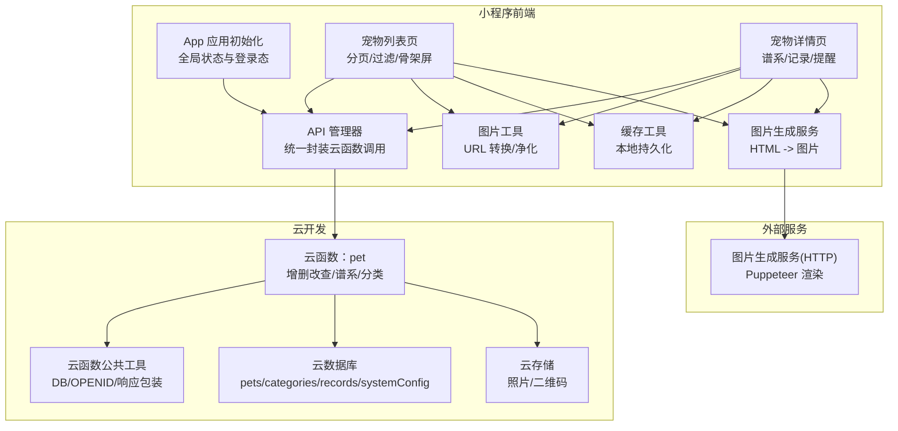
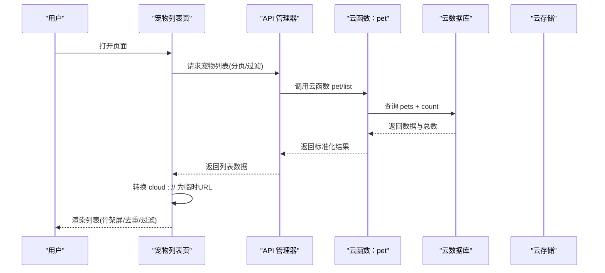
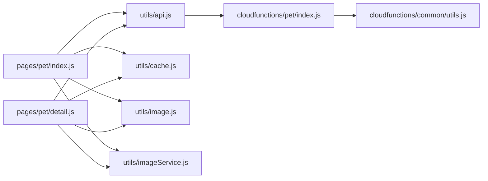

# 性能优化

<cite>
**本文引用的文件**
- [miniprogram/app.js](file://miniprogram/app.js)
- [miniprogram/utils/api.js](file://miniprogram/utils/api.js)
- [miniprogram/utils/cache.js](file://miniprogram/utils/cache.js)
- [miniprogram/utils/image.js](file://miniprogram/utils/image.js)
- [miniprogram/utils/imageService.js](file://miniprogram/utils/imageService.js)
- [miniprogram/pages/pet/index.js](file://miniprogram/pages/pet/index.js)
- [miniprogram/pages/pet/detail.js](file://miniprogram/pages/pet/detail.js)
- [cloudfunctions/common/utils.js](file://cloudfunctions/common/utils.js)
- [cloudfunctions/pet/index.js](file://cloudfunctions/pet/index.js)
- [cloudfunctions/pet/utils.js](file://cloudfunctions/pet/utils.js)
- [miniprogram/project.config.json](file://miniprogram/project.config.json)
</cite>

## 目录
1. [简介](#简介)
2. [项目结构](#项目结构)
3. [核心组件](#核心组件)
4. [架构总览](#架构总览)
5. [详细组件分析](#详细组件分析)
6. [依赖关系分析](#依赖关系分析)
7. [性能考量](#性能考量)
8. [故障排查指南](#故障排查指南)
9. [结论](#结论)
10. [附录](#附录)

## 简介
本指南聚焦“养龟档案”项目的性能优化，覆盖小程序前端渲染与资源加载、云函数冷启动与资源管理、数据库查询与索引、图片生成与缓存策略、以及移动端适配与内存管理等方面。目标是帮助开发者建立系统化的性能基线与优化方法论，并提供可落地的实践建议。

## 项目结构
项目采用“小程序前端 + 云开发 + 云函数 + 外部图片生成服务”的分层架构：
- 小程序前端负责页面渲染、交互、缓存与图片转换、调用云函数与云存储。
- 云函数提供业务接口封装、数据库访问与响应包装。
- 图片生成服务通过外部 HTTP 接口将 HTML 渲染为图片，供分享与导出使用。

图表来源
- [miniprogram/app.js:1-312](file://miniprogram/app.js#L1-L312)
- [miniprogram/utils/api.js:1-208](file://miniprogram/utils/api.js#L1-L208)
- [miniprogram/utils/cache.js:1-121](file://miniprogram/utils/cache.js#L1-L121)
- [miniprogram/utils/image.js:1-170](file://miniprogram/utils/image.js#L1-L170)
- [miniprogram/utils/imageService.js:1-202](file://miniprogram/utils/imageService.js#L1-L202)
- [cloudfunctions/common/utils.js:1-69](file://cloudfunctions/common/utils.js#L1-L69)
- [cloudfunctions/pet/index.js:1-723](file://cloudfunctions/pet/index.js#L1-L723)

章节来源
- [miniprogram/app.js:1-312](file://miniprogram/app.js#L1-L312)
- [miniprogram/utils/api.js:1-208](file://miniprogram/utils/api.js#L1-L208)
- [cloudfunctions/common/utils.js:1-69](file://cloudfunctions/common/utils.js#L1-L69)
- [cloudfunctions/pet/index.js:1-723](file://cloudfunctions/pet/index.js#L1-L723)

## 核心组件
- 应用初始化与登录态：在应用启动阶段完成云开发初始化、系统配置加载、静默登录与二维码生成，降低首屏等待。
- API 管理器：统一封装云函数调用、错误处理与可用性标记，便于前端快速扩展与降级。
- 缓存工具：提供带过期时间的本地缓存，自动清理过期项，提升离线与弱网体验。
- 图片工具：支持 cloud:// 与临时 URL 的相互转换与净化，保证缓存与渲染一致性。
- 图片生成服务：通过外部 HTTP 服务将 HTML 渲染为图片，支持自定义宽高、缩放与质量。
- 云函数 pet：提供宠物 CRUD、谱系查询、分类管理与公开访问接口，内置权限校验与数据净化。

章节来源
- [miniprogram/app.js:1-312](file://miniprogram/app.js#L1-L312)
- [miniprogram/utils/api.js:1-208](file://miniprogram/utils/api.js#L1-L208)
- [miniprogram/utils/cache.js:1-121](file://miniprogram/utils/cache.js#L1-L121)
- [miniprogram/utils/image.js:1-170](file://miniprogram/utils/image.js#L1-L170)
- [miniprogram/utils/imageService.js:1-202](file://miniprogram/utils/imageService.js#L1-L202)
- [cloudfunctions/pet/index.js:1-723](file://cloudfunctions/pet/index.js#L1-L723)

## 架构总览
小程序前端通过 API 管理器调用云函数 pet，云函数访问云数据库与云存储，必要时返回净化后的数据。图片生成流程通过图片服务将 HTML 渲染为图片，最终落盘至用户数据目录供分享使用。

图表来源
- [miniprogram/pages/pet/index.js:199-338](file://miniprogram/pages/pet/index.js#L199-L338)
- [miniprogram/utils/api.js:43-45](file://miniprogram/utils/api.js#L43-L45)
- [cloudfunctions/pet/index.js:140-180](file://cloudfunctions/pet/index.js#L140-L180)

## 详细组件分析

### 组件A：应用初始化与登录态（App）
- 关键点
  - 云开发初始化与系统配置加载，优先从 systemConfig 集合读取，降级到旧集合。
  - 静默登录获取 openid，自动写入本地存储并触发二维码生成。
  - 全局数据预加载标记，配合首页骨架屏策略，减少白屏与闪烁。
- 性能影响
  - 配置加载与登录态初始化在 onLaunch 阶段完成，避免页面级重复请求。
  - 二维码生成通过云函数后台静默执行，不阻塞用户操作。
- 优化建议
  - 对系统配置增加本地兜底与缓存有效期，缩短首屏等待。
  - 登录态检查与页面渲染解耦，避免竞态导致的重复请求。

章节来源
- [miniprogram/app.js:1-312](file://miniprogram/app.js#L1-L312)

### 组件B：API 管理器（API 管理云函数调用）
- 关键点
  - 统一调用 wx.cloud.callFunction，封装成功/失败与错误信息。
  - 支持宠物、记录、提醒、足迹、登录等多类接口。
  - 图片上传后异步触发安全审核，不阻塞上传主流程。
- 性能影响
  - 错误时标记 cloudAvailable，便于前端降级策略。
  - 批量上传图片顺序执行，可考虑并发优化以提升吞吐。
- 优化建议
  - 在批量上传场景引入并发控制与重试机制。
  - 对高频接口增加本地缓存与失效策略。

章节来源
- [miniprogram/utils/api.js:1-208](file://miniprogram/utils/api.js#L1-L208)

### 组件C：缓存工具（本地持久化）
- 关键点
  - 前缀命名 + 过期时间戳，自动清理过期项。
  - 存储满时主动清理旧缓存并重试，提升稳定性。
- 性能影响
  - 有效降低重复网络请求，改善弱网与离线体验。
- 优化建议
  - 为不同数据类型设定差异化过期策略（如 pets 永久，临时图片短时）。
  - 增加缓存命中统计与淘汰阈值告警。

章节来源
- [miniprogram/utils/cache.js:1-121](file://miniprogram/utils/cache.js#L1-L121)

### 组件D：图片工具（URL 转换与净化）
- 关键点
  - 支持 cloud:// 与临时 URL 相互转换，失败时保留原始值。
  - 批量转换与净化，确保缓存中只保存永久有效的 fileID。
- 性能影响
  - 将临时 URL 转换为临时链接，避免频繁刷新导致的二次请求。
- 优化建议
  - 对热点图片增加本地缩略图缓存，减少网络与转换成本。
  - 在渲染前进行图片尺寸裁剪，避免超大图占用内存。

章节来源
- [miniprogram/utils/image.js:1-170](file://miniprogram/utils/image.js#L1-L170)

### 组件E：图片生成服务（HTML -> 图片）
- 关键点
  - 通过外部 HTTP 服务将 HTML 渲染为图片，支持宽高、缩放与质量。
  - 将图片保存至用户数据目录，便于分享与下载。
- 性能影响
  - 外部服务可能成为性能瓶颈，需合理设置超时与重试。
- 优化建议
  - 对生成结果进行本地缓存，避免重复渲染。
  - 在弱网环境下提供占位图与进度反馈。

章节来源
- [miniprogram/utils/imageService.js:1-202](file://miniprogram/utils/imageService.js#L1-L202)

### 组件F：云函数 pet（业务接口）
- 关键点
  - 提供 create/list/get/update/delete/publicGet/publicList/getPedigree/getCategories/addCategory/updateCategory/deleteCategory 等接口。
  - 权限校验：仅允许用户访问自己的数据。
  - 数据净化：将临时 URL 转为 cloud://fileID，统一存储。
- 性能影响
  - 分页查询与 count 并行/串行策略影响整体延迟。
  - 谱系查询为递归，深度受限于 maxGeneration。
- 优化建议
  - 为 pets/openid、records/petId、categories/openid 等常用查询建立复合索引。
  - 对谱系查询引入缓存与分页深度限制。

章节来源
- [cloudfunctions/pet/index.js:1-723](file://cloudfunctions/pet/index.js#L1-L723)
- [cloudfunctions/common/utils.js:1-69](file://cloudfunctions/common/utils.js#L1-L69)

### 组件G：宠物列表页（分页/过滤/骨架屏）
- 关键点
  - 骨架屏最小展示时长保障体验，避免闪烁。
  - 并发请求序列号防过期，避免旧数据覆盖新数据。
  - 本地缓存与云端数据合并，优先使用本地有效图片 URL。
  - 动态计算宠物状态（待配/预警/正常），减少重复计算。
- 性能影响
  - 骨架屏与去重策略显著改善感知性能。
  - 本地图片 URL 优先可减少云存储转换次数。
- 优化建议
  - 对搜索与过滤增加防抖，减少频繁请求。
  - 对图片 URL 转换采用并发池，控制最大并发度。

章节来源
- [miniprogram/pages/pet/index.js:199-338](file://miniprogram/pages/pet/index.js#L199-L338)

### 组件H：宠物详情页（谱系/记录/提醒）
- 关键点
  - 公开模式与私有模式分别调用 publicGet 与 getPetById。
  - 图片错误时自动刷新临时链接，增强鲁棒性。
  - 分类加载与同步，确保本地与云端一致。
- 性能影响
  - 谱系树递归构建可能带来计算开销，建议缓存与分页展示。
  - 分类同步与图片转换在渲染前完成，避免重复工作。
- 优化建议
  - 对谱系树采用懒加载与虚拟滚动。
  - 对分类与记录按需加载，减少一次性渲染压力。

章节来源
- [miniprogram/pages/pet/detail.js:420-514](file://miniprogram/pages/pet/detail.js#L420-L514)

## 依赖关系分析
- 前端模块间依赖
  - 页面依赖 API 管理器与工具模块（缓存、图片、分类）。
  - API 管理器依赖错误处理与安全检查工具。
- 云函数依赖
  - 云函数依赖公共工具模块（DB/OPENID/响应包装）。
  - 业务逻辑依赖云数据库与云存储。
- 外部依赖
  - 图片生成服务通过 HTTP 请求调用，需关注超时与失败重试。

图表来源
- [miniprogram/pages/pet/index.js:1-800](file://miniprogram/pages/pet/index.js#L1-L800)
- [miniprogram/pages/pet/detail.js:1-800](file://miniprogram/pages/pet/detail.js#L1-L800)
- [miniprogram/utils/api.js:1-208](file://miniprogram/utils/api.js#L1-L208)
- [cloudfunctions/pet/index.js:1-723](file://cloudfunctions/pet/index.js#L1-L723)
- [cloudfunctions/common/utils.js:1-69](file://cloudfunctions/common/utils.js#L1-L69)
- [miniprogram/utils/cache.js:1-121](file://miniprogram/utils/cache.js#L1-L121)
- [miniprogram/utils/image.js:1-170](file://miniprogram/utils/image.js#L1-L170)
- [miniprogram/utils/imageService.js:1-202](file://miniprogram/utils/imageService.js#L1-L202)

## 性能考量

### 前端页面渲染优化
- 骨架屏与最小展示时长：确保用户感知流畅，避免闪烁。
- 并发请求防过期：通过序列号避免旧请求覆盖新数据。
- 本地缓存优先：合并本地有效图片 URL，减少云存储转换。
- 动态状态计算：离线计算宠物状态，减少重复网络请求。

章节来源
- [miniprogram/pages/pet/index.js:146-154](file://miniprogram/pages/pet/index.js#L146-L154)
- [miniprogram/pages/pet/index.js:209-250](file://miniprogram/pages/pet/index.js#L209-L250)
- [miniprogram/pages/pet/index.js:264-273](file://miniprogram/pages/pet/index.js#L264-L273)
- [miniprogram/pages/pet/index.js:400-475](file://miniprogram/pages/pet/index.js#L400-L475)

### 图片压缩与资源加载
- 图片 URL 转换与净化：统一存储 cloud://fileID，避免临时链接失效。
- 外部图片生成：通过 HTTP 服务渲染 HTML 为图片，支持自定义宽高与质量。
- 本地缓存：对热点图片与生成结果进行缓存，减少重复请求。

章节来源
- [miniprogram/utils/image.js:115-126](file://miniprogram/utils/image.js#L115-L126)
- [miniprogram/utils/imageService.js:59-92](file://miniprogram/utils/imageService.js#L59-L92)
- [miniprogram/utils/cache.js:11-35](file://miniprogram/utils/cache.js#L11-L35)

### 云函数性能优化
- 冷启动与资源管理：云函数按需触发，避免常驻进程；合理设置超时与并发。
- 权限与数据净化：严格校验 openid，统一净化临时 URL。
- 分页与聚合：count 与查询分离，避免不必要的全量扫描。

章节来源
- [cloudfunctions/pet/index.js:140-180](file://cloudfunctions/pet/index.js#L140-L180)
- [cloudfunctions/common/utils.js:37-44](file://cloudfunctions/common/utils.js#L37-L44)

### 数据库查询优化与索引设计
- 建议索引
  - pets/openid（按用户维度查询）
  - records/petId（按宠物维度查询）
  - categories/openid（按用户维度查询）
- 查询策略
  - 使用 limit/offset 或基于游标分页，避免 deep pagination。
  - 对模糊搜索与多字段匹配使用合适的索引与查询表达式。

章节来源
- [cloudfunctions/pet/index.js:140-180](file://cloudfunctions/pet/index.js#L140-L180)

### 缓存策略
- 本地缓存
  - 带过期时间的持久化缓存，自动清理过期项。
  - 针对 pets、categories、records 等数据设定差异化过期策略。
- 云端缓存
  - 对热点接口结果进行短期缓存，结合 ETag/Last-Modified 实现条件请求。

章节来源
- [miniprogram/utils/cache.js:1-121](file://miniprogram/utils/cache.js#L1-L121)

### 性能监控指标与测试方法
- 指标建议
  - 首屏渲染时间（骨架屏到首屏内容）。
  - 云函数平均/95 分位耗时与错误率。
  - 图片生成成功率与平均耗时。
  - 本地缓存命中率与淘汰频率。
- 测试方法
  - 使用小程序开发者工具的性能面板与网络面板。
  - 对关键路径（列表加载、详情加载、图片生成）进行基准测试。
  - 在弱网与低内存设备上进行回归测试。

章节来源
- [miniprogram/project.config.json:1-34](file://miniprogram/project.config.json#L1-L34)

### 内存管理与垃圾回收
- 避免内存泄漏
  - 页面生命周期中及时停止蓝牙扫描、关闭定时器与监听器。
  - 渲染前进行图片 URL 转换，避免长时间持有大对象。
- 垃圾回收
  - 合理释放临时变量与闭包引用，减少长生命周期对象。
  - 对列表渲染使用稳定 key，避免重复创建节点。

章节来源
- [miniprogram/pages/pet/detail.js:235-239](file://miniprogram/pages/pet/detail.js#L235-L239)
- [miniprogram/pages/pet/index.js:141-144](file://miniprogram/pages/pet/index.js#L141-L144)

### 移动端性能优化与适配
- 设备差异
  - 低内存设备上减少一次性渲染的数据量，采用分页与懒加载。
  - 控制图片尺寸与质量，避免超大图导致卡顿。
- 网络环境
  - 弱网下优先使用本地缓存，降级策略明确。
  - 对图片生成与云函数调用设置合理的超时与重试。

章节来源
- [miniprogram/utils/imageService.js:102-142](file://miniprogram/utils/imageService.js#L102-L142)
- [miniprogram/utils/api.js:27-38](file://miniprogram/utils/api.js#L27-L38)

## 故障排查指南
- 登录态异常
  - 检查静默登录与强制登录流程，确认 openid 写入与 userInfo 同步。
- 云函数调用失败
  - 查看 API 管理器错误标记与降级逻辑，确认网络与权限。
- 图片加载失败
  - 检查 cloud:// 与临时 URL 转换链路，必要时刷新临时链接。
- 图片生成失败
  - 检查外部服务可达性、超时设置与返回格式，必要时启用本地缓存。

章节来源
- [miniprogram/app.js:84-140](file://miniprogram/app.js#L84-L140)
- [miniprogram/utils/api.js:27-38](file://miniprogram/utils/api.js#L27-L38)
- [miniprogram/utils/image.js:64-80](file://miniprogram/utils/image.js#L64-L80)
- [miniprogram/utils/imageService.js:102-142](file://miniprogram/utils/imageService.js#L102-L142)

## 结论
通过统一的 API 管理器、本地缓存与图片净化、云函数权限与数据净化、以及分页与骨架屏策略，“养龟档案”项目在弱网与低端设备上仍能提供稳定的用户体验。建议持续完善索引设计、缓存策略与监控体系，并针对移动端特性进行专项优化与回归测试。

## 附录
- 开发配置建议
  - 启用压缩与编译优化，减少包体积与运行时开销。
  - 对 npm 包进行按需打包，剔除无关依赖。

章节来源
- [miniprogram/project.config.json:1-34](file://miniprogram/project.config.json#L1-L34)