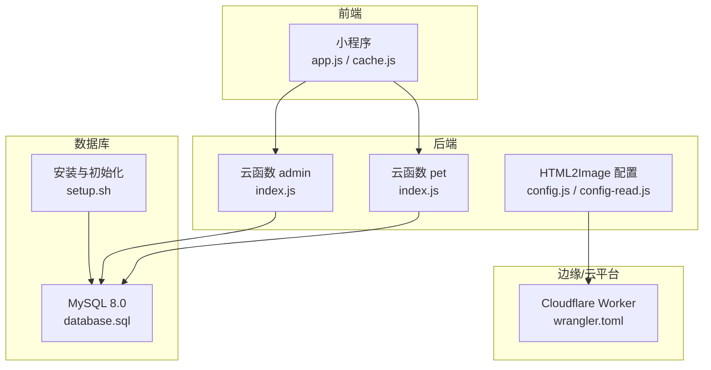
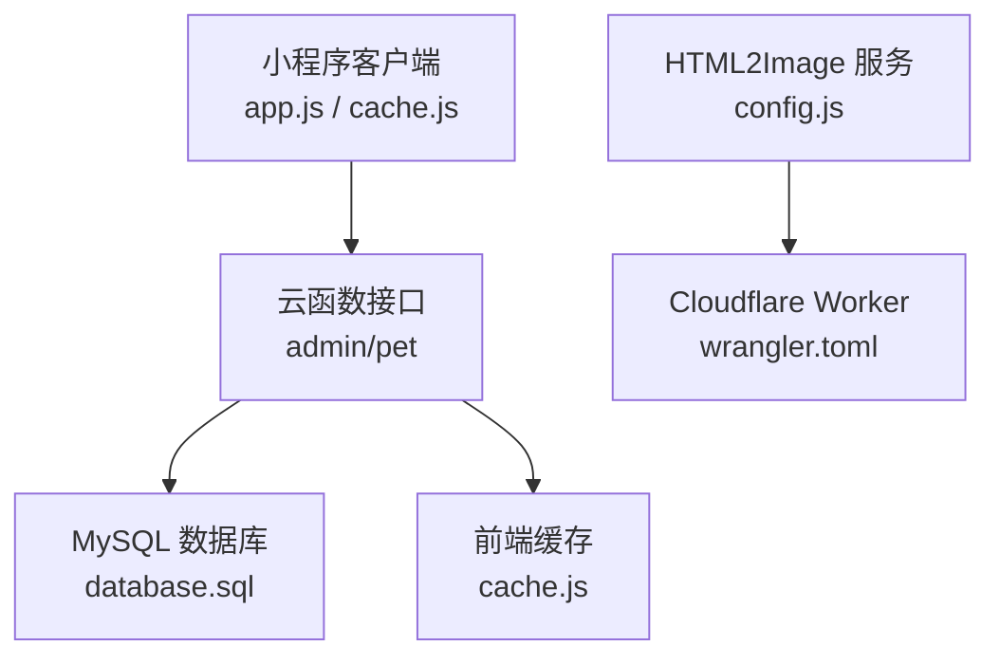
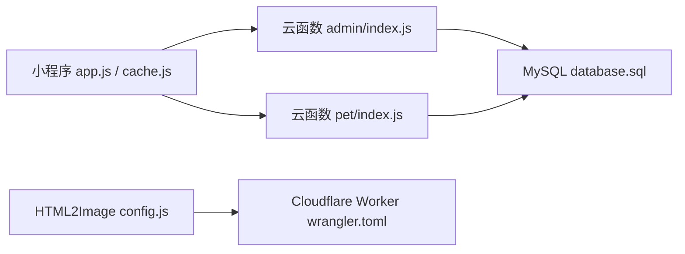

# 数据库性能优化

<cite>
**本文引用的文件**   
- [database.sql](file://server-setup/database.sql)
- [setup.sh](file://server-setup/setup.sh)
- [config.js](file://html2image-server/config.js)
- [config-read.js](file://html2image-server/config-read.js)
- [config.js](file://html2image-server-dist/config.js)
- [config-read.js](file://html2image-server-dist/config-read.js)
- [index.js](file://cloudfunctions/admin/index.js)
- [index.js](file://cloudfunctions/pet/index.js)
- [cache.js](file://miniprogram/utils/cache.js)
- [app.js](file://miniprogram/app.js)
- [wrangler.toml](file://cloudflare-worker/wrangler.toml)
</cite>

## 目录
1. [简介](#简介)
2. [项目结构](#项目结构)
3. [核心组件](#核心组件)
4. [架构总览](#架构总览)
5. [详细组件分析](#详细组件分析)
6. [依赖关系分析](#依赖关系分析)
7. [性能考量](#性能考量)
8. [故障排查指南](#故障排查指南)
9. [结论](#结论)
10. [附录](#附录)

## 简介
本指南面向“养龟档案”项目的数据库与后端性能优化，聚焦以下方面：
- MySQL 查询优化、索引设计与表结构优化策略
- 数据库连接池、事务管理与锁机制优化
- 读写分离、缓存策略与批量操作实施方案
- 监控指标、慢查询分析与性能瓶颈诊断
- 备份恢复、数据迁移与版本升级的性能考量
- 云数据库配置优化与成本控制
- 面向开发者的调优步骤与实用工具

## 项目结构
该项目包含多处与数据库相关的关键文件与模块：
- MySQL 表结构与初始化脚本：server-setup/database.sql
- 服务器环境安装与数据库初始化脚本：server-setup/setup.sh
- 云函数（后端）示例：cloudfunctions/admin/index.js、cloudfunctions/pet/index.js
- 小程序前端缓存与配置加载：miniprogram/utils/cache.js、miniprogram/app.js
- HTML 到图片服务配置：html2image-server/config.js、html2image-server-dist/config.js 及其配置读取器
- Cloudflare Worker 部署配置：cloudflare-worker/wrangler.toml

**图表来源**
- [database.sql:1-221](file://server-setup/database.sql#L1-L221)
- [setup.sh:65-98](file://server-setup/setup.sh#L65-L98)
- [index.js:40-115](file://cloudfunctions/admin/index.js#L40-L115)
- [index.js:140-169](file://cloudfunctions/pet/index.js#L140-L169)
- [config.js:1-268](file://html2image-server/config.js#L1-L268)
- [config-read.js:1-33](file://html2image-server/config-read.js#L1-L33)
- [config.js:1-268](file://html2image-server-dist/config.js#L1-L268)
- [config-read.js:1-33](file://html2image-server-dist/config-read.js#L1-L33)
- [wrangler.toml:1-37](file://cloudflare-worker/wrangler.toml#L1-L37)

**章节来源**
- [database.sql:1-221](file://server-setup/database.sql#L1-L221)
- [setup.sh:65-98](file://server-setup/setup.sh#L65-L98)

## 核心组件
- MySQL 表结构与索引：users、admins、pets、records、footprints、reminders、categories、system_config、banned_users
- 云函数：管理员统计与用户管理、宠物列表与分类同步
- 小程序缓存与系统配置加载
- HTML 到图片服务配置与环境变量注入
- Cloudflare Worker 部署与资源限制

**章节来源**
- [database.sql:9-26](file://server-setup/database.sql#L9-L26)
- [database.sql:28-42](file://server-setup/database.sql#L28-L42)
- [database.sql:49-76](file://server-setup/database.sql#L49-L76)
- [database.sql:78-109](file://server-setup/database.sql#L78-L109)
- [database.sql:111-136](file://server-setup/database.sql#L111-L136)
- [database.sql:138-161](file://server-setup/database.sql#L138-L161)
- [database.sql:163-181](file://server-setup/database.sql#L163-L181)
- [database.sql:183-194](file://server-setup/database.sql#L183-L194)
- [database.sql:203-214](file://server-setup/database.sql#L203-L214)
- [index.js:74-115](file://cloudfunctions/admin/index.js#L74-L115)
- [index.js:140-169](file://cloudfunctions/pet/index.js#L140-L169)
- [cache.js:1-120](file://miniprogram/utils/cache.js#L1-L120)
- [app.js:17-48](file://miniprogram/app.js#L17-L48)
- [config.js:28-74](file://html2image-server/config.js#L28-L74)
- [wrangler.toml:18-24](file://cloudflare-worker/wrangler.toml#L18-L24)

## 架构总览
系统采用“小程序前端 + 云函数后端 + MySQL 数据库存储”的三层架构；部分渲染能力通过 Cloudflare Worker 提供。

**图表来源**
- [app.js:1-48](file://miniprogram/app.js#L1-L48)
- [cache.js:1-120](file://miniprogram/utils/cache.js#L1-L120)
- [index.js:40-115](file://cloudfunctions/admin/index.js#L40-L115)
- [index.js:140-169](file://cloudfunctions/pet/index.js#L140-L169)
- [database.sql:1-221](file://server-setup/database.sql#L1-L221)
- [config.js:1-268](file://html2image-server/config.js#L1-L268)
- [wrangler.toml:1-37](file://cloudflare-worker/wrangler.toml#L1-L37)

## 详细组件分析

### MySQL 表结构与索引优化
- 用户表 users：主键、唯一索引 openid、普通索引 phone/status，适合按 openid 登录与按状态/电话检索
- 管理员表 admins：主键、唯一索引 username
- 宠物表 pets：主键、唯一索引 pet_id、索引 openid/category/status/created_at，支持按用户、分类、状态与时间范围查询
- 记录表 records：主键、唯一索引 record_id、索引 openid/pet_id/type/date/created_at，适合按类型、日期、时间线查询
- 足迹表 footprints：主键、唯一索引 footprint_id、索引 openid/pet_id/date/created_at，支持按日期与时间线检索
- 提醒表 reminders：主键、唯一索引 reminder_id、索引 openid/pet_id/remind_time/status，适合按提醒时间与状态查询
- 分类表 categories：主键、唯一索引 category_id、索引 openid/status
- 系统配置表 system_config：主键、唯一索引 config_key
- 黑名单表 banned_users：主键、唯一索引 openid

建议优化点：
- 对高频过滤字段建立复合索引（如 records 的 openid+date、pets 的 openid+status）
- 对热点查询（如按 openid 的聚合统计）考虑物化视图或应用层缓存
- 对大字段（如 text/json）谨慎建立索引，必要时拆表或使用二级索引

**章节来源**
- [database.sql:9-26](file://server-setup/database.sql#L9-L26)
- [database.sql:28-42](file://server-setup/database.sql#L28-L42)
- [database.sql:49-76](file://server-setup/database.sql#L49-L76)
- [database.sql:78-109](file://server-setup/database.sql#L78-L109)
- [database.sql:111-136](file://server-setup/database.sql#L111-L136)
- [database.sql:138-161](file://server-setup/database.sql#L138-L161)
- [database.sql:163-181](file://server-setup/database.sql#L163-L181)
- [database.sql:183-194](file://server-setup/database.sql#L183-L194)
- [database.sql:203-214](file://server-setup/database.sql#L203-L214)

### 云函数查询与并发优化
- 管理端统计：使用 Promise 并行执行多个集合计数，减少串行等待
- 宠物列表：统一构建查询条件，避免多次 .where() 覆盖；支持分页与正则搜索；对分类同步进行幂等插入

优化建议：
- 对高并发场景，将统计类查询结果缓存于前端或应用层缓存
- 对频繁读取的配置（system_config）采用缓存与失效策略
- 对批量写入（如导入数据）使用事务与批量提交，降低锁竞争

**章节来源**
- [index.js:74-115](file://cloudfunctions/admin/index.js#L74-L115)
- [index.js:140-169](file://cloudfunctions/pet/index.js#L140-L169)
- [index.js:672-688](file://cloudfunctions/pet/index.js#L672-L688)

### 前端缓存与配置加载
- 小程序缓存工具：带过期时间的本地缓存，支持清理过期项与批量清空
- 应用启动时优先从 systemConfig 集合加载系统配置，兼容旧集合 fallback

优化建议：
- 对高频读取的配置与列表数据增加缓存 TTL 与一致性校验
- 在弱网环境下结合本地缓存与增量更新策略

**章节来源**
- [cache.js:1-120](file://miniprogram/utils/cache.js#L1-L120)
- [app.js:17-48](file://miniprogram/app.js#L17-L48)

### HTML 到图片服务配置与环境变量
- 支持通过 H2I_ 前缀的环境变量覆盖配置，包括 server/port、browser、rendering、http 等
- 配置读取器可按路径输出指定配置值，便于启动脚本解析

优化建议：
- 将敏感参数置于环境变量中，避免硬编码
- 在容器化部署时，结合配置中心与密钥管理

**章节来源**
- [config.js:1-268](file://html2image-server/config.js#L1-L268)
- [config-read.js:1-33](file://html2image-server/config-read.js#L1-L33)
- [config.js:1-268](file://html2image-server-dist/config.js#L1-L268)
- [config-read.js:1-33](file://html2image-server-dist/config-read.js#L1-L33)

### Cloudflare Worker 部署与资源限制
- 默认宽高、质量、账户 ID 等参数通过 vars 注入
- 免费版存在请求量、CPU 时间与响应大小限制，付费版可提升配额

优化建议：
- 对高并发渲染任务进行队列化与限流
- 结合 KV 缓存热点内容，降低重复渲染

**章节来源**
- [wrangler.toml:18-37](file://cloudflare-worker/wrangler.toml#L18-L37)

## 依赖关系分析
- 前端依赖后端云函数提供的数据接口
- 云函数依赖 MySQL 存储与系统配置
- HTML2Image 服务通过 Cloudflare Worker 提供渲染能力
- 安装脚本负责初始化数据库与基础环境

**图表来源**
- [app.js:1-48](file://miniprogram/app.js#L1-L48)
- [cache.js:1-120](file://miniprogram/utils/cache.js#L1-L120)
- [index.js:40-115](file://cloudfunctions/admin/index.js#L40-L115)
- [index.js:140-169](file://cloudfunctions/pet/index.js#L140-L169)
- [database.sql:1-221](file://server-setup/database.sql#L1-L221)
- [config.js:1-268](file://html2image-server/config.js#L1-L268)
- [wrangler.toml:1-37](file://cloudflare-worker/wrangler.toml#L1-L37)

**章节来源**
- [setup.sh:65-98](file://server-setup/setup.sh#L65-L98)

## 性能考量

### MySQL 查询优化
- 使用 EXPLAIN 分析慢查询，关注全表扫描、回表次数与临时表/文件排序
- 对高频过滤字段建立复合索引，避免过多前缀索引导致的选择性不足
- 将 ORDER BY 与 LIMIT 结合，避免先排序再截断

### 索引设计与表结构优化
- 为热点查询字段（如 openid、pet_id、status、date）建立合适索引
- 对 JSON 字段的查询，优先考虑规范化或二级索引
- 控制索引数量，平衡写入性能与查询性能

### 事务管理与锁机制
- 批量写入使用事务，减少锁持有时间
- 避免长事务，及时提交或回滚
- 对高并发写入场景，考虑分片或分区策略

### 读写分离与缓存策略
- 读多写少场景下，将只读查询路由至从库
- 对热点数据（配置、列表、统计）采用多级缓存（应用层/边缘缓存）
- 缓存失效策略：TTL + 变更驱动失效

### 批量操作
- 使用批量 INSERT/UPDATE，减少网络往返
- 对大事务进行分批处理，避免锁膨胀

### 监控与慢查询分析
- 开启慢查询日志与性能模式，定期巡检
- 关注锁等待、行锁冲突与临时表使用情况
- 建立关键指标看板：QPS、P95/P99 延迟、连接数、缓存命中率

### 备份恢复与迁移
- 定期全备 + 增量备份，验证恢复流程
- 迁移窗口尽量安排在低峰时段，使用只读副本与灰度切换
- 版本升级前做兼容性测试与回滚预案

### 云数据库与成本控制
- 选择合适的实例规格与存储类型，按需弹性伸缩
- 使用只读副本分流读流量，降低主库压力
- 结合缓存与压缩，降低带宽与 IOPS 成本

## 故障排查指南
- 慢查询定位
  - 使用 EXPLAIN 分析 SQL 执行计划
  - 检查是否存在全表扫描与不必要的排序
- 锁冲突与死锁
  - 减少事务粒度，避免在事务内执行耗时操作
  - 观察锁等待与超时日志
- 缓存不一致
  - 明确缓存失效策略，确保变更后及时刷新
  - 对关键路径增加缓存校验与降级逻辑
- 配置生效问题
  - 检查环境变量前缀与大小写
  - 使用配置读取器验证最终生效值

**章节来源**
- [config.js:234-243](file://html2image-server/config.js#L234-L243)
- [config-read.js:16-33](file://html2image-server/config-read.js#L16-L33)
- [config.js:234-243](file://html2image-server-dist/config.js#L234-L243)
- [config-read.js:16-33](file://html2image-server-dist/config-read.js#L16-L33)

## 结论
通过合理的索引设计、查询优化、缓存与批量策略，以及完善的监控与运维流程，可以显著提升“养龟档案”系统的数据库性能与稳定性。针对云与边缘场景，应结合资源限制与成本控制，制定弹性与高可用方案。

## 附录

### MySQL 初始化与安装要点
- 安装 MySQL 8.0 并创建数据库与用户
- 导入表结构与默认配置
- 配置防火墙与项目目录权限

**章节来源**
- [setup.sh:65-98](file://server-setup/setup.sh#L65-L98)
- [database.sql:1-221](file://server-setup/database.sql#L1-L221)