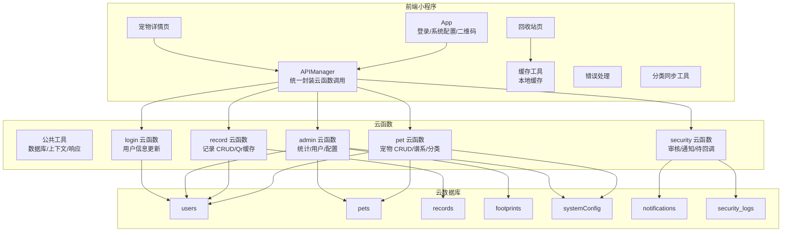
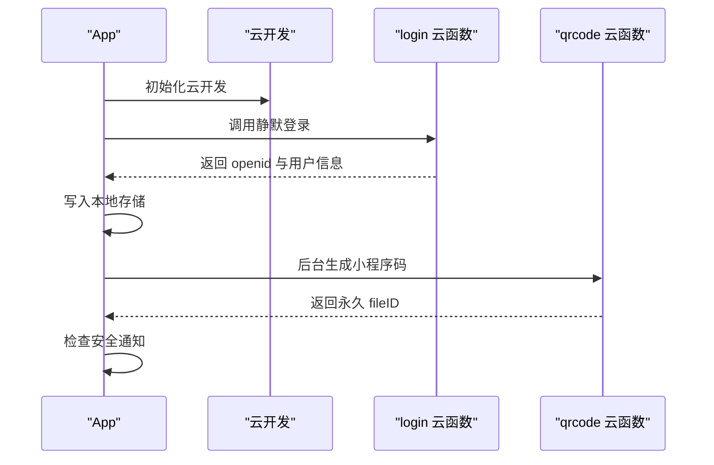
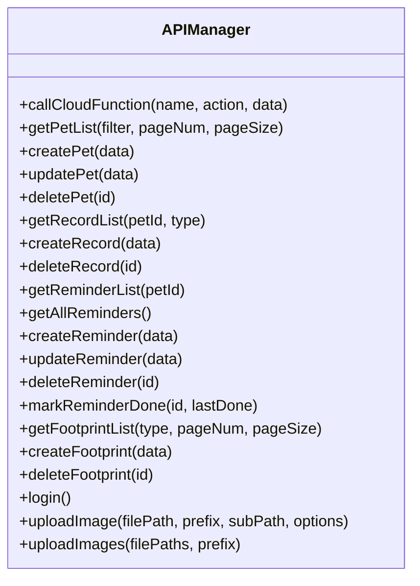
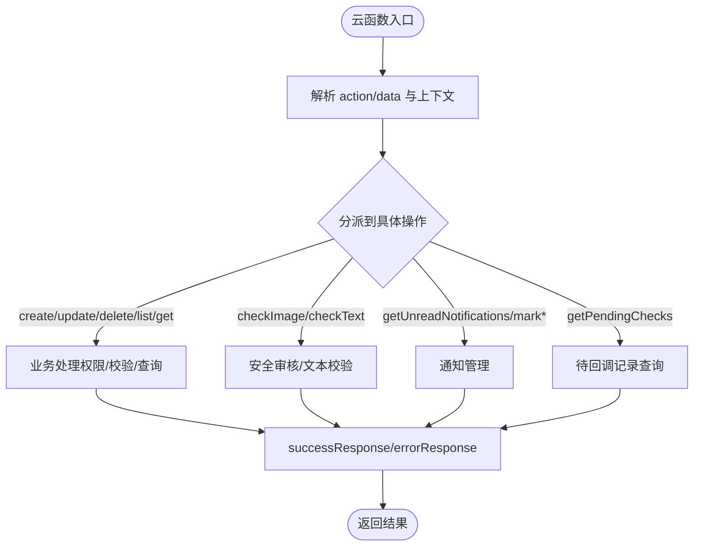
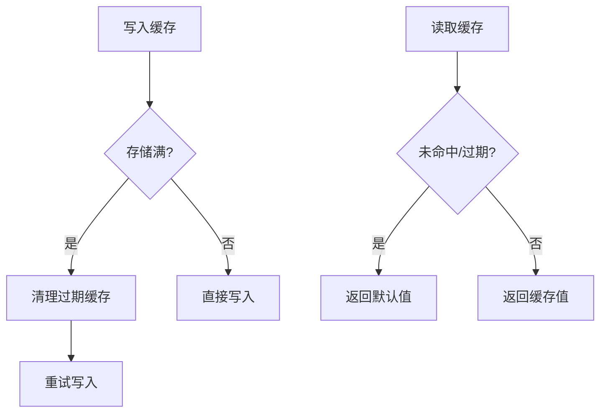
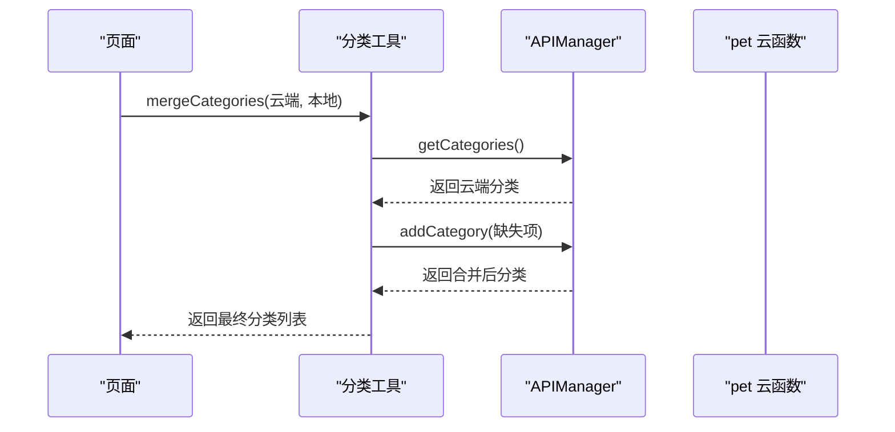
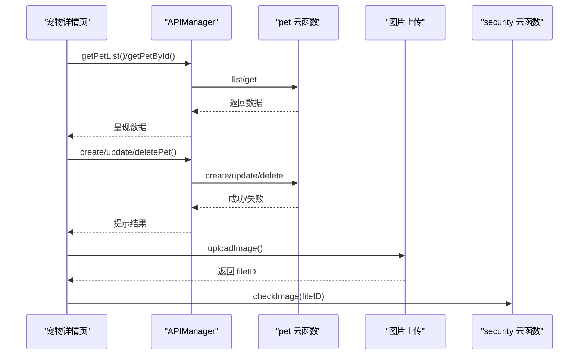
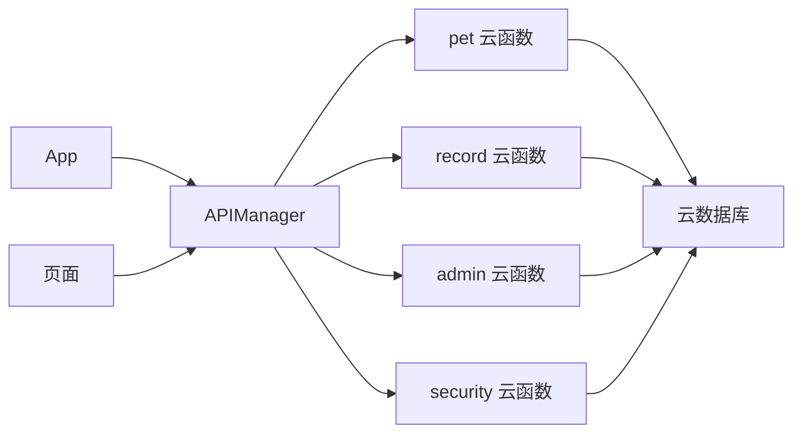

# 数据同步

<cite>
**本文引用的文件**
- [miniprogram/app.js](file://miniprogram/app.js)
- [miniprogram/utils/api.js](file://miniprogram/utils/api.js)
- [miniprogram/utils/cache.js](file://miniprogram/utils/cache.js)
- [miniprogram/utils/error.js](file://miniprogram/utils/error.js)
- [miniprogram/utils/category.js](file://miniprogram/utils/category.js)
- [miniprogram/pages/pet/detail.js](file://miniprogram/pages/pet/detail.js)
- [miniprogram/pages/my/recycle-bin/index.js](file://miniprogram/pages/my/recycle-bin/index.js)
- [cloudfunctions/common/utils.js](file://cloudfunctions/common/utils.js)
- [cloudfunctions/pet/index.js](file://cloudfunctions/pet/index.js)
- [cloudfunctions/pet/utils.js](file://cloudfunctions/pet/utils.js)
- [cloudfunctions/record/index.js](file://cloudfunctions/record/index.js)
- [cloudfunctions/record/utils.js](file://cloudfunctions/record/utils.js)
- [cloudfunctions/admin/index.js](file://cloudfunctions/admin/index.js)
- [cloudfunctions/security/index.js](file://cloudfunctions/security/index.js)
- [cloudfunctions/login/index.js](file://cloudfunctions/login/index.js)
</cite>

## 目录
1. [引言](#引言)
2. [项目结构](#项目结构)
3. [核心组件](#核心组件)
4. [架构总览](#架构总览)
5. [详细组件分析](#详细组件分析)
6. [依赖关系分析](#依赖关系分析)
7. [性能考量](#性能考量)
8. [故障排查指南](#故障排查指南)
9. [结论](#结论)
10. [附录](#附录)

## 引言
本文件面向“养龟档案”项目，系统化梳理前端与云端之间的数据同步机制，覆盖实时与异步同步策略、变更检测、冲突解决与版本控制、离线数据处理、一致性与事务、网络异常与重试、状态监控与恢复、多设备与用户切换、以及性能优化与调试技巧。目标是帮助开发者在不深入源码的前提下，快速理解并高效维护数据同步链路。

## 项目结构
- 前端（微信小程序）负责用户交互、本地缓存与离线数据管理、调用云函数、展示与引导。
- 云函数（Node.js）负责业务逻辑、数据校验、数据库读写、事务与安全审核。
- 数据库（云开发数据库）持久化用户、宠物、记录、足迹、系统配置等数据。
- 安全与通知：内容安全审核、未读通知、待回调记录监控。

图示来源
- [miniprogram/app.js:1-312](file://miniprogram/app.js#L1-L312)
- [miniprogram/utils/api.js:1-208](file://miniprogram/utils/api.js#L1-L208)
- [cloudfunctions/common/utils.js:1-69](file://cloudfunctions/common/utils.js#L1-L69)
- [cloudfunctions/pet/index.js:1-723](file://cloudfunctions/pet/index.js#L1-L723)
- [cloudfunctions/record/index.js:1-191](file://cloudfunctions/record/index.js#L1-L191)
- [cloudfunctions/admin/index.js:1-533](file://cloudfunctions/admin/index.js#L1-L533)
- [cloudfunctions/security/index.js:1-200](file://cloudfunctions/security/index.js#L1-L200)
- [cloudfunctions/login/index.js:55-67](file://cloudfunctions/login/index.js#L55-L67)

章节来源
- [miniprogram/app.js:1-312](file://miniprogram/app.js#L1-L312)
- [miniprogram/utils/api.js:1-208](file://miniprogram/utils/api.js#L1-L208)
- [cloudfunctions/common/utils.js:1-69](file://cloudfunctions/common/utils.js#L1-L69)

## 核心组件
- 前端应用与登录态
  - 应用启动时初始化云开发，加载系统配置；本地无 openid 则静默获取并自动登录；提供强制登录与登出。
- API 管理器
  - 统一调用云函数，封装成功/失败响应、网络异常标记与降级提示；提供宠物、记录、提醒、足迹、登录等接口。
- 本地缓存与错误处理
  - 本地缓存工具支持过期清理与兜底；错误处理提供统一提示与加载状态。
- 云函数与数据库
  - 宠物与记录云函数负责权限校验、数据清洗、分页与批量查询；管理员云函数提供统计与配置管理；安全云函数负责审核与通知。
- 分类同步工具
  - 合并本地与云端分类，缺失时自动补同步至云端，保证分类一致性。

章节来源
- [miniprogram/app.js:1-312](file://miniprogram/app.js#L1-L312)
- [miniprogram/utils/api.js:1-208](file://miniprogram/utils/api.js#L1-L208)
- [miniprogram/utils/cache.js:1-121](file://miniprogram/utils/cache.js#L1-L121)
- [miniprogram/utils/error.js:1-92](file://miniprogram/utils/error.js#L1-L92)
- [miniprogram/utils/category.js:1-64](file://miniprogram/utils/category.js#L1-L64)
- [cloudfunctions/pet/index.js:1-723](file://cloudfunctions/pet/index.js#L1-L723)
- [cloudfunctions/record/index.js:1-191](file://cloudfunctions/record/index.js#L1-L191)
- [cloudfunctions/admin/index.js:1-533](file://cloudfunctions/admin/index.js#L1-L533)
- [cloudfunctions/security/index.js:1-200](file://cloudfunctions/security/index.js#L1-L200)

## 架构总览
- 实时同步
  - 前端在关键页面（如宠物详情）通过 API 管理器即时调用云函数，读取/写入云端数据；部分操作（如生成二维码、上传图片后安全审核）采用异步处理，不阻塞主流程。
- 异步同步
  - 上传图片后触发安全审核（异步），不阻塞上传；待审核回调未及时到达时，安全云函数提供“待回调”查询与超时标记。
- 变更检测与冲突解决
  - 云函数内对读写进行权限校验与唯一性约束；前端通过本地缓存与错误提示反馈网络异常；未提供基于时间戳/版本号的显式冲突解决策略。
- 版本控制
  - 未发现显式的版本号字段或 MVCC 机制；通过数据库服务端时间字段与幂等操作（如重复提醒创建）规避并发问题。
- 离线数据处理
  - 前端使用本地缓存与回收站页面实现离线暂存与恢复；未见集中式离线队列与批量提交机制。
- 一致性与事务
  - 管理员删除用户时使用事务，确保跨集合的一致性；普通业务 CRUD 主要依赖权限校验与幂等。
- 网络异常与重试
  - API 管理器在网络错误时标记不可用并返回降级提示；前端未见自动重试逻辑，建议在业务层补充指数退避重试。
- 状态监控与恢复
  - 安全云函数提供未读通知与“待回调”记录查询；前端在前台可见时检查通知；未见全局同步状态面板。
- 多设备与用户切换
  - 通过 openid 严格区分数据；登出清理本地存储并跳转首页；未见跨设备同步策略。

章节来源
- [miniprogram/utils/api.js:1-208](file://miniprogram/utils/api.js#L1-L208)
- [cloudfunctions/security/index.js:1-200](file://cloudfunctions/security/index.js#L1-L200)
- [cloudfunctions/admin/index.js:227-258](file://cloudfunctions/admin/index.js#L227-L258)

## 详细组件分析

### 前端应用与登录态（App）
- 初始化云开发与系统配置加载，支持降级读取。
- 本地无 openid 时静默获取并自动登录，成功后生成小程序码并检查安全通知。
- 提供强制登录、登出与前台可见时的通知检查。

图示来源
- [miniprogram/app.js:1-312](file://miniprogram/app.js#L1-L312)
- [cloudfunctions/login/index.js:55-67](file://cloudfunctions/login/index.js#L55-L67)

章节来源
- [miniprogram/app.js:1-312](file://miniprogram/app.js#L1-L312)
- [cloudfunctions/login/index.js:55-67](file://cloudfunctions/login/index.js#L55-L67)

### API 管理器（APIManager）
- 统一调用云函数，封装响应结构与错误处理；网络异常时标记不可用并返回降级提示；提供宠物、记录、提醒、足迹、登录等接口。
- 图片上传后触发安全审核（异步），不阻塞上传流程。

图示来源
- [miniprogram/utils/api.js:1-208](file://miniprogram/utils/api.js#L1-L208)

章节来源
- [miniprogram/utils/api.js:1-208](file://miniprogram/utils/api.js#L1-L208)

### 云函数与数据库（宠物/记录/管理员/安全）
- 宠物云函数
  - 权限校验（openid）、唯一性校验（别名）、分类同步、谱系查询、公开访问控制。
- 记录云函数
  - 权限校验、分页查询、QR 缓存更新（静默，仅允许创建者更新）。
- 管理员云函数
  - 事务删除用户及其关联数据；统计与配置管理。
- 安全云函数
  - 审核、通知、待回调记录查询与超时标记。

图示来源
- [cloudfunctions/pet/index.js:1-723](file://cloudfunctions/pet/index.js#L1-L723)
- [cloudfunctions/record/index.js:1-191](file://cloudfunctions/record/index.js#L1-L191)
- [cloudfunctions/admin/index.js:1-533](file://cloudfunctions/admin/index.js#L1-L533)
- [cloudfunctions/security/index.js:1-200](file://cloudfunctions/security/index.js#L1-L200)

章节来源
- [cloudfunctions/pet/index.js:1-723](file://cloudfunctions/pet/index.js#L1-L723)
- [cloudfunctions/record/index.js:1-191](file://cloudfunctions/record/index.js#L1-L191)
- [cloudfunctions/admin/index.js:1-533](file://cloudfunctions/admin/index.js#L1-L533)
- [cloudfunctions/security/index.js:1-200](file://cloudfunctions/security/index.js#L1-L200)

### 本地缓存与离线处理
- 本地缓存工具
  - 支持设置/获取/移除/清空缓存，过期时间控制；当存储满时尝试清理旧缓存并重试。
- 回收站页面
  - 本地暂存删除项，支持恢复与永久删除；恢复时写回本地存储。

图示来源
- [miniprogram/utils/cache.js:1-121](file://miniprogram/utils/cache.js#L1-L121)
- [miniprogram/pages/my/recycle-bin/index.js:1-148](file://miniprogram/pages/my/recycle-bin/index.js#L1-L148)

章节来源
- [miniprogram/utils/cache.js:1-121](file://miniprogram/utils/cache.js#L1-L121)
- [miniprogram/pages/my/recycle-bin/index.js:1-148](file://miniprogram/pages/my/recycle-bin/index.js#L1-L148)

### 分类同步与冲突预防
- 合并本地与云端分类，确保“无”在首位且不重复。
- 若本地存在而云端缺失，则逐项补同步至云端，失败时记录告警。

图示来源
- [miniprogram/utils/category.js:1-64](file://miniprogram/utils/category.js#L1-L64)
- [cloudfunctions/pet/index.js:517-634](file://cloudfunctions/pet/index.js#L517-L634)

章节来源
- [miniprogram/utils/category.js:1-64](file://miniprogram/utils/category.js#L1-L64)
- [cloudfunctions/pet/index.js:517-634](file://cloudfunctions/pet/index.js#L517-L634)

### 宠物详情页数据流（典型业务）
- 页面加载时准备基础数据与打印配置；根据路由参数决定只读模式与公开浏览；通过 API 管理器调用云函数读取/写入数据；图片上传后触发安全审核。

图示来源
- [miniprogram/pages/pet/detail.js:1-200](file://miniprogram/pages/pet/detail.js#L1-L200)
- [miniprogram/utils/api.js:140-190](file://miniprogram/utils/api.js#L140-L190)
- [cloudfunctions/security/index.js:1-200](file://cloudfunctions/security/index.js#L1-L200)

章节来源
- [miniprogram/pages/pet/detail.js:1-200](file://miniprogram/pages/pet/detail.js#L1-L200)
- [miniprogram/utils/api.js:140-190](file://miniprogram/utils/api.js#L140-L190)
- [cloudfunctions/security/index.js:1-200](file://cloudfunctions/security/index.js#L1-L200)

## 依赖关系分析
- 前端依赖
  - App 依赖云开发初始化与系统配置；APIManager 依赖云函数；页面依赖 APIManager 与工具模块。
- 云函数依赖
  - 宠物/记录/管理员/安全云函数依赖公共工具模块与数据库；安全云函数依赖通知与日志集合。
- 数据库依赖
  - 宠物/记录/足迹/系统配置/通知/日志等集合构成数据域。

图示来源
- [miniprogram/app.js:1-312](file://miniprogram/app.js#L1-L312)
- [miniprogram/utils/api.js:1-208](file://miniprogram/utils/api.js#L1-L208)
- [cloudfunctions/common/utils.js:1-69](file://cloudfunctions/common/utils.js#L1-L69)
- [cloudfunctions/pet/index.js:1-723](file://cloudfunctions/pet/index.js#L1-L723)
- [cloudfunctions/record/index.js:1-191](file://cloudfunctions/record/index.js#L1-L191)
- [cloudfunctions/admin/index.js:1-533](file://cloudfunctions/admin/index.js#L1-L533)
- [cloudfunctions/security/index.js:1-200](file://cloudfunctions/security/index.js#L1-L200)

章节来源
- [miniprogram/app.js:1-312](file://miniprogram/app.js#L1-L312)
- [miniprogram/utils/api.js:1-208](file://miniprogram/utils/api.js#L1-L208)
- [cloudfunctions/common/utils.js:1-69](file://cloudfunctions/common/utils.js#L1-L69)

## 性能考量
- 云函数侧
  - 使用分页查询与批量查询（如谱系查询、用户增长趋势）减少单次传输量；Promise 并行查询提升吞吐。
  - 事务删除用户时一次性清理多个集合，避免多次往返。
- 前端侧
  - 本地缓存减少重复请求；图片上传后异步审核，避免阻塞主流程。
- 建议
  - 在前端增加指数退避重试与请求去抖；对高频接口引入本地缓存 TTL 与失效策略；对大列表分页加载与虚拟滚动。

## 故障排查指南
- 网络异常
  - API 管理器在网络错误时标记不可用并返回降级提示；前端应结合错误码与提示进行用户引导。
- 安全审核与通知
  - 安全云函数提供未读通知与“待回调”记录查询；若长时间未回调，可在前端提示用户稍后重试或联系客服。
- 权限与唯一性
  - 云函数内对权限与唯一性进行严格校验；若报错，检查 openid 与输入参数。
- 事务一致性
  - 管理员删除用户使用事务，若失败会回滚；检查日志定位具体失败步骤。

章节来源
- [miniprogram/utils/api.js:1-38](file://miniprogram/utils/api.js#L1-L38)
- [cloudfunctions/security/index.js:69-200](file://cloudfunctions/security/index.js#L69-L200)
- [cloudfunctions/admin/index.js:227-258](file://cloudfunctions/admin/index.js#L227-L258)

## 结论
本项目采用“前端直连云函数”的轻量同步模型：通过权限校验与幂等操作保障基本一致性，借助本地缓存与异步审核提升用户体验。对于复杂场景（如多设备实时协同、强一致事务），建议在现有基础上引入版本号/时间戳、冲突解决策略与集中式离线队列，并完善重试与监控体系。

## 附录
- 关键流程与文件索引
  - 登录与系统配置：[miniprogram/app.js:1-312](file://miniprogram/app.js#L1-L312)
  - 云函数调用封装：[miniprogram/utils/api.js:1-208](file://miniprogram/utils/api.js#L1-L208)
  - 本地缓存工具：[miniprogram/utils/cache.js:1-121](file://miniprogram/utils/cache.js#L1-L121)
  - 宠物 CRUD 与谱系：[cloudfunctions/pet/index.js:1-723](file://cloudfunctions/pet/index.js#L1-L723)
  - 记录 CRUD 与 QR 缓存：[cloudfunctions/record/index.js:1-191](file://cloudfunctions/record/index.js#L1-L191)
  - 管理员事务删除：[cloudfunctions/admin/index.js:227-258](file://cloudfunctions/admin/index.js#L227-L258)
  - 安全审核与通知：[cloudfunctions/security/index.js:1-200](file://cloudfunctions/security/index.js#L1-L200)
  - 分类同步工具：[miniprogram/utils/category.js:1-64](file://miniprogram/utils/category.js#L1-L64)