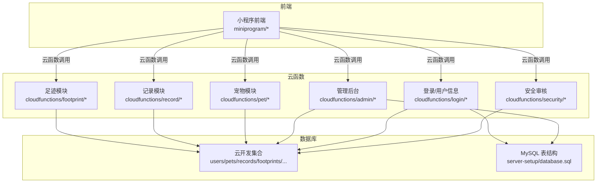
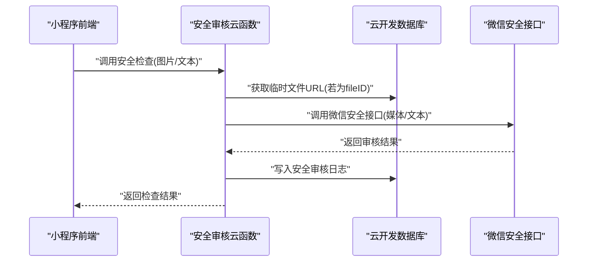
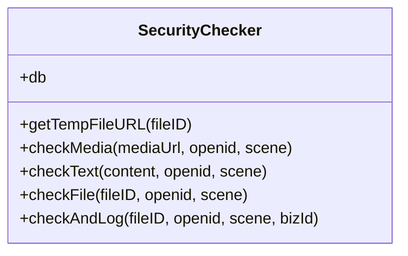
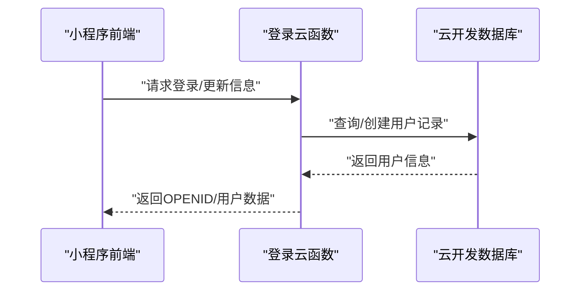
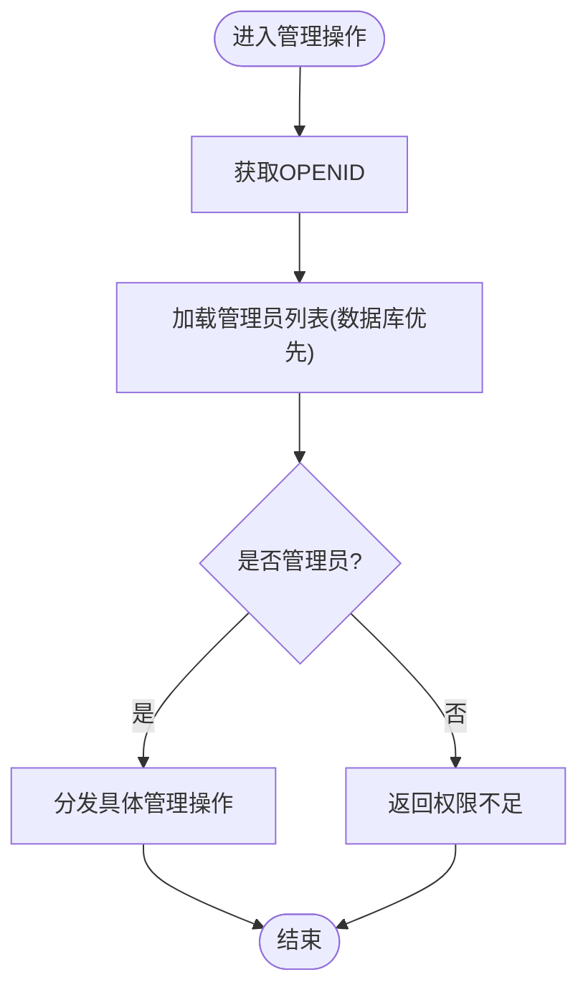
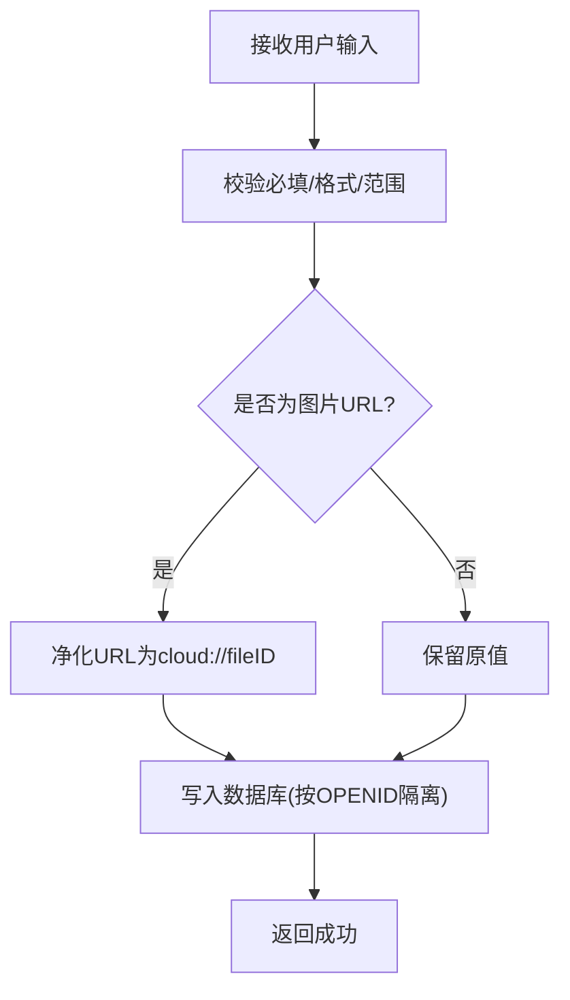
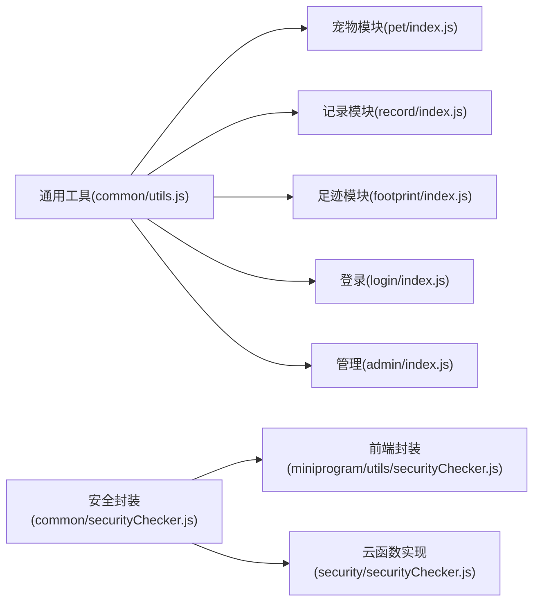

# 数据安全

<cite>
**本文引用的文件**
- [cloudfunctions/common/securityChecker.js](file://cloudfunctions/common/securityChecker.js)
- [miniprogram/utils/securityChecker.js](file://miniprogram/utils/securityChecker.js)
- [cloudfunctions/security/securityChecker.js](file://cloudfunctions/security/securityChecker.js)
- [cloudfunctions/admin/index.js](file://cloudfunctions/admin/index.js)
- [cloudfunctions/login/index.js](file://cloudfunctions/login/index.js)
- [cloudfunctions/pet/index.js](file://cloudfunctions/pet/index.js)
- [cloudfunctions/record/index.js](file://cloudfunctions/record/index.js)
- [cloudfunctions/footprint/index.js](file://cloudfunctions/footprint/index.js)
- [cloudfunctions/common/utils.js](file://cloudfunctions/common/utils.js)
- [cloudfunctions/pet/utils.js](file://cloudfunctions/pet/utils.js)
- [cloudfunctions/record/utils.js](file://cloudfunctions/record/utils.js)
- [server-setup/database.sql](file://server-setup/database.sql)
</cite>

## 目录
1. [引言](#引言)
2. [项目结构](#项目结构)
3. [核心组件](#核心组件)
4. [架构总览](#架构总览)
5. [详细组件分析](#详细组件分析)
6. [依赖关系分析](#依赖关系分析)
7. [性能与安全特性](#性能与安全特性)
8. [故障排查指南](#故障排查指南)
9. [结论](#结论)
10. [附录](#附录)

## 引言
本文件面向“养龟档案”项目，系统化梳理数据安全保护方案，覆盖身份认证与权限控制、数据隔离策略、敏感数据处理、输入校验与防注入、前端安全（XSS/CSRF）、审计与监控、备份与恢复、隐私脱敏、黑名单与行为监控，以及开发者安全编码规范与漏洞检测方法。文档以仓库现有实现为基础，结合可落地的改进建议，帮助团队建立可持续的安全基线。

## 项目结构
项目采用“小程序前端 + 云开发云函数 + 云数据库 + 备份脚本”的组合架构。前端通过云函数调用实现用户管理、宠物档案、记录与足迹等业务能力；云函数负责鉴权、权限校验、数据净化与安全审核；数据库层包含云开发集合与MySQL结构文件，支撑系统配置、用户、宠物、记录、足迹、提醒、分类与黑名单等实体。

图表来源
- [cloudfunctions/security/securityChecker.js:1-206](file://cloudfunctions/security/securityChecker.js#L1-L206)
- [cloudfunctions/login/index.js:1-148](file://cloudfunctions/login/index.js#L1-L148)
- [cloudfunctions/admin/index.js:1-533](file://cloudfunctions/admin/index.js#L1-L533)
- [cloudfunctions/pet/index.js:1-723](file://cloudfunctions/pet/index.js#L1-L723)
- [cloudfunctions/record/index.js:1-191](file://cloudfunctions/record/index.js#L1-L191)
- [cloudfunctions/footprint/index.js:1-160](file://cloudfunctions/footprint/index.js#L1-L160)
- [server-setup/database.sql:1-221](file://server-setup/database.sql#L1-L221)

章节来源
- [cloudfunctions/security/securityChecker.js:1-206](file://cloudfunctions/security/securityChecker.js#L1-L206)
- [cloudfunctions/login/index.js:1-148](file://cloudfunctions/login/index.js#L1-L148)
- [cloudfunctions/admin/index.js:1-533](file://cloudfunctions/admin/index.js#L1-L533)
- [cloudfunctions/pet/index.js:1-723](file://cloudfunctions/pet/index.js#L1-L723)
- [cloudfunctions/record/index.js:1-191](file://cloudfunctions/record/index.js#L1-L191)
- [cloudfunctions/footprint/index.js:1-160](file://cloudfunctions/footprint/index.js#L1-L160)
- [server-setup/database.sql:1-221](file://server-setup/database.sql#L1-L221)

## 核心组件
- 安全审核组件：封装图片/文本内容安全审核、文件ID到URL转换、审核日志落库，支持异步提交与同步等待两种模式。
- 登录与用户信息：基于微信上下文获取OPENID，首次登录自动创建用户记录，支持更新昵称/头像/公开名片等。
- 权限与管理：管理员白名单/数据库配置，支持统计、用户/宠物/足迹查询、用户状态变更与删除（含事务）。
- 数据净化：对云存储URL进行规范化处理，确保后续审核与展示稳定。
- 输入校验与隔离：各模块对关键字段进行长度、格式、范围校验，并按OPENID强制数据隔离。
- 审计与日志：安全审核日志写入集合，便于追踪与回溯。

章节来源
- [cloudfunctions/common/securityChecker.js:1-226](file://cloudfunctions/common/securityChecker.js#L1-L226)
- [miniprogram/utils/securityChecker.js:1-122](file://miniprogram/utils/securityChecker.js#L1-L122)
- [cloudfunctions/security/securityChecker.js:1-206](file://cloudfunctions/security/securityChecker.js#L1-L206)
- [cloudfunctions/login/index.js:1-148](file://cloudfunctions/login/index.js#L1-L148)
- [cloudfunctions/admin/index.js:1-533](file://cloudfunctions/admin/index.js#L1-L533)
- [cloudfunctions/pet/index.js:1-723](file://cloudfunctions/pet/index.js#L1-L723)
- [cloudfunctions/record/index.js:1-191](file://cloudfunctions/record/index.js#L1-L191)
- [cloudfunctions/footprint/index.js:1-160](file://cloudfunctions/footprint/index.js#L1-L160)

## 架构总览
下图展示从前端到云函数再到数据库的调用链路与安全控制点：

图表来源
- [cloudfunctions/common/securityChecker.js:1-226](file://cloudfunctions/common/securityChecker.js#L1-L226)
- [miniprogram/utils/securityChecker.js:1-122](file://miniprogram/utils/securityChecker.js#L1-L122)
- [cloudfunctions/security/securityChecker.js:1-206](file://cloudfunctions/security/securityChecker.js#L1-L206)

## 详细组件分析

### 安全审核组件
- 功能要点
  - 场景映射：资料、评论、论坛、社交日志等场景值映射。
  - 文件ID到URL转换：将cloud://fileID转换为临时HTTP URL，供微信安全接口调用。
  - 图片/文本审核：异步提交媒体审核、同步获取文本审核结果。
  - 审核日志：将fileID、场景、业务ID、traceId、状态等写入集合，便于审计。
- 前端封装：提供异步/同步两种调用方式，支持批量图片检查；文本审核在服务异常时采取“宽松放行”策略，避免影响用户体验。
- 日志与追踪：记录trace_id与状态，便于后续回调与人工复核。

图表来源
- [cloudfunctions/common/securityChecker.js:30-207](file://cloudfunctions/common/securityChecker.js#L30-L207)
- [cloudfunctions/security/securityChecker.js:30-191](file://cloudfunctions/security/securityChecker.js#L30-L191)

章节来源
- [cloudfunctions/common/securityChecker.js:1-226](file://cloudfunctions/common/securityChecker.js#L1-L226)
- [miniprogram/utils/securityChecker.js:1-122](file://miniprogram/utils/securityChecker.js#L1-L122)
- [cloudfunctions/security/securityChecker.js:1-206](file://cloudfunctions/security/securityChecker.js#L1-L206)

### 登录与用户信息
- 登录流程：获取OPENID/UNIONID/APPID，查询或创建用户记录；支持更新昵称、头像、公开名片等字段。
- 注册控制：读取系统配置中的注册开关，未开启时拒绝新用户注册。
- 前端交互：即使数据库异常，仍返回OPENID，保证登录可用性。

图表来源
- [cloudfunctions/login/index.js:38-147](file://cloudfunctions/login/index.js#L38-L147)

章节来源
- [cloudfunctions/login/index.js:1-148](file://cloudfunctions/login/index.js#L1-L148)

### 管理后台与权限控制
- 管理员校验：优先从数据库admins集合读取启用管理员列表，兜底使用内置OPENID；仅管理员可执行管理操作。
- 管理操作：统计、用户/宠物/足迹查询、用户状态变更、删除用户（含事务清理其全部数据）、系统配置读取与更新。
- 黑名单联动：封禁用户时写入bannedUsers集合，解封时移除。

图表来源
- [cloudfunctions/admin/index.js:27-71](file://cloudfunctions/admin/index.js#L27-L71)

章节来源
- [cloudfunctions/admin/index.js:1-533](file://cloudfunctions/admin/index.js#L1-L533)

### 数据净化与隔离
- URL净化：将过期的临时URL转换为cloud://fileID，确保后续审核与展示稳定。
- 数据隔离：所有增删改查均以OPENID为条件，防止越权访问。
- 配额控制：系统配置限制每张足迹图片数量、每只宠物最大照片数、用户最大宠物数量等。

图表来源
- [cloudfunctions/pet/index.js:16-43](file://cloudfunctions/pet/index.js#L16-L43)
- [cloudfunctions/record/index.js:10-35](file://cloudfunctions/record/index.js#L10-L35)
- [cloudfunctions/footprint/index.js:34-72](file://cloudfunctions/footprint/index.js#L34-L72)

章节来源
- [cloudfunctions/pet/index.js:1-723](file://cloudfunctions/pet/index.js#L1-L723)
- [cloudfunctions/record/index.js:1-191](file://cloudfunctions/record/index.js#L1-L191)
- [cloudfunctions/footprint/index.js:1-160](file://cloudfunctions/footprint/index.js#L1-L160)

### 审计日志与异常处理
- 审计日志：安全审核结果写入security_logs集合，包含fileID、场景、traceId、状态、原因等。
- 异常处理：统一success/error响应包装，错误信息记录到日志，避免敏感堆栈泄露。
- 日志落库：前端调用checkAndLog后，云函数写入日志集合，便于后续追踪。

章节来源
- [cloudfunctions/common/securityChecker.js:172-207](file://cloudfunctions/common/securityChecker.js#L172-L207)
- [cloudfunctions/security/securityChecker.js:160-191](file://cloudfunctions/security/securityChecker.js#L160-L191)
- [cloudfunctions/common/utils.js:20-35](file://cloudfunctions/common/utils.js#L20-L35)
- [cloudfunctions/pet/utils.js:20-35](file://cloudfunctions/pet/utils.js#L20-L35)
- [cloudfunctions/record/utils.js:20-35](file://cloudfunctions/record/utils.js#L20-L35)

## 依赖关系分析
- 组件耦合
  - 安全审核组件依赖云开发SDK与微信安全接口，输出标准化结果并写入日志集合。
  - 各业务云函数依赖通用工具模块（初始化、OPENID获取、响应封装、ID规范化）。
  - 管理后台依赖数据库管理员表与系统配置表，实现权限与策略控制。
- 外部依赖
  - 微信云开发环境（OPENID/UNIONID/APPID、云函数、云数据库、云存储）。
  - MySQL（用于管理端与备份场景，包含用户、宠物、记录、足迹、提醒、分类、系统配置、黑名单等表）。

图表来源
- [cloudfunctions/common/utils.js:1-69](file://cloudfunctions/common/utils.js#L1-L69)
- [cloudfunctions/pet/utils.js:1-69](file://cloudfunctions/pet/utils.js#L1-L69)
- [cloudfunctions/record/utils.js:1-69](file://cloudfunctions/record/utils.js#L1-L69)
- [cloudfunctions/common/securityChecker.js:1-226](file://cloudfunctions/common/securityChecker.js#L1-L226)
- [miniprogram/utils/securityChecker.js:1-122](file://miniprogram/utils/securityChecker.js#L1-L122)
- [cloudfunctions/security/securityChecker.js:1-206](file://cloudfunctions/security/securityChecker.js#L1-L206)

章节来源
- [cloudfunctions/common/utils.js:1-69](file://cloudfunctions/common/utils.js#L1-L69)
- [cloudfunctions/pet/utils.js:1-69](file://cloudfunctions/pet/utils.js#L1-L69)
- [cloudfunctions/record/utils.js:1-69](file://cloudfunctions/record/utils.js#L1-L69)
- [cloudfunctions/common/securityChecker.js:1-226](file://cloudfunctions/common/securityChecker.js#L1-L226)
- [miniprogram/utils/securityChecker.js:1-122](file://miniprogram/utils/securityChecker.js#L1-L122)
- [cloudfunctions/security/securityChecker.js:1-206](file://cloudfunctions/security/securityChecker.js#L1-L206)

## 性能与安全特性
- 性能
  - 异步审核：图片审核采用异步提交，避免阻塞主流程。
  - 并发查询：管理后台统计使用Promise.all并发获取多个计数。
  - 分页与索引：业务模块普遍采用分页与合理索引，降低查询成本。
- 安全
  - 数据隔离：所有写入/更新/删除均以OPENID为条件，防止越权。
  - 配额控制：通过系统配置限制上传数量与用户上限，降低滥用风险。
  - 审核前置：图片/文本在发布前进行安全审核，降低违规内容传播风险。
  - 异常兜底：前端文本审核失败时宽松放行，保障可用性；云函数统一错误包装，避免敏感信息泄露。

章节来源
- [cloudfunctions/admin/index.js:74-115](file://cloudfunctions/admin/index.js#L74-L115)
- [cloudfunctions/pet/index.js:84-138](file://cloudfunctions/pet/index.js#L84-L138)
- [cloudfunctions/record/index.js:37-82](file://cloudfunctions/record/index.js#L37-L82)
- [cloudfunctions/footprint/index.js:34-72](file://cloudfunctions/footprint/index.js#L34-L72)
- [cloudfunctions/common/securityChecker.js:50-105](file://cloudfunctions/common/securityChecker.js#L50-L105)

## 故障排查指南
- 安全审核失败
  - 检查fileID是否有效、是否可转换为临时URL。
  - 关注微信安全接口返回的errcode与errmsg，必要时重试或人工复核。
  - 审核日志集合是否存在写入异常。
- 权限不足
  - 确认OPENID是否在管理员列表中；若数据库异常，检查兜底管理员配置。
- 数据越权
  - 检查业务云函数是否正确使用OPENID作为查询/更新/删除条件。
- 注册受限
  - 检查系统配置中的注册开关；确认首次登录是否成功创建用户记录。
- 数据库异常
  - 管理端与登录云函数均具备降级返回OPENID的能力，便于定位问题。

章节来源
- [cloudfunctions/common/securityChecker.js:172-207](file://cloudfunctions/common/securityChecker.js#L172-L207)
- [cloudfunctions/admin/index.js:16-25](file://cloudfunctions/admin/index.js#L16-L25)
- [cloudfunctions/login/index.js:87-147](file://cloudfunctions/login/index.js#L87-L147)

## 结论
项目已在身份认证、权限控制、数据隔离、内容安全审核与审计日志等方面形成基础安全体系。建议进一步完善以下方面：强化传输加密、引入输入校验与参数绑定、补充CSRF防护、细化审计指标与告警、制定备份与恢复演练计划、完善隐私脱敏策略与合规流程，并持续开展安全培训与漏洞扫描。

## 附录

### 数据访问控制机制
- 身份认证：通过微信上下文获取OPENID，作为用户唯一标识贯穿全链路。
- 权限验证：管理员权限从数据库admins集合读取，失败时使用内置OPENID兜底。
- 数据隔离：所有业务操作均以OPENID为条件，确保用户间数据隔离。

章节来源
- [cloudfunctions/login/index.js:38-53](file://cloudfunctions/login/index.js#L38-L53)
- [cloudfunctions/admin/index.js:16-38](file://cloudfunctions/admin/index.js#L16-L38)
- [cloudfunctions/pet/index.js:182-191](file://cloudfunctions/pet/index.js#L182-L191)
- [cloudfunctions/record/index.js:113-122](file://cloudfunctions/record/index.js#L113-L122)
- [cloudfunctions/footprint/index.js:109-118](file://cloudfunctions/footprint/index.js#L109-L118)

### 敏感数据处理与传输安全
- 存储：云存储文件ID（cloud://）用于安全访问，避免直接暴露源地址。
- 传输：前端通过云函数调用，后端再调用微信安全接口，减少明文传输路径。
- 建议：在生产环境启用HTTPS与TLS，确保云函数与数据库连接加密。

章节来源
- [cloudfunctions/common/securityChecker.js:51-64](file://cloudfunctions/common/securityChecker.js#L51-L64)
- [cloudfunctions/security/securityChecker.js:51-64](file://cloudfunctions/security/securityChecker.js#L51-L64)

### SQL注入防护、XSS与CSRF
- SQL注入：当前云函数主要使用云开发数据库API，未直接拼接SQL；MySQL侧表结构清晰，建议在自建服务中使用参数化查询与ORM。
- XSS：前端渲染应避免内联eval/innerHTML；图片URL经净化后使用，避免恶意脚本。
- CSRF：云函数通过OPENID上下文识别调用方，结合微信平台信任链，降低CSRF风险；建议在自建服务中增加Token校验与SameSite Cookie。

章节来源
- [cloudfunctions/pet/index.js:16-43](file://cloudfunctions/pet/index.js#L16-L43)
- [cloudfunctions/footprint/index.js:34-72](file://cloudfunctions/footprint/index.js#L34-L72)
- [server-setup/database.sql:1-221](file://server-setup/database.sql#L1-L221)

### 数据备份策略、恢复流程与灾难恢复
- 备份策略：定期导出MySQL结构与数据，结合云开发集合快照；对敏感表（用户、黑名单）单独备份。
- 恢复流程：验证备份完整性，按顺序导入结构与数据；对云开发集合进行一致性校验。
- 灾难恢复：制定RTO/RPO目标，演练跨环境切换与数据回滚流程。

章节来源
- [server-setup/database.sql:1-221](file://server-setup/database.sql#L1-L221)

### 数据脱敏与隐私保护
- 脱敏建议：导出报表时对手机号、头像URL等敏感字段进行遮蔽或替换；仅在授权范围内展示公开名片。
- 隐私保护：遵循最小必要原则，仅收集与提供实现功能所必需的信息；提供用户删除与更正权。

章节来源
- [cloudfunctions/login/index.js:69-85](file://cloudfunctions/login/index.js#L69-L85)

### 审计日志与异常监控
- 审计：安全审核日志记录traceId、场景、状态与原因；管理操作记录管理员OPENID与操作时间。
- 监控：对云函数错误率、安全审核失败率、数据库慢查询进行告警；定期审查日志。

章节来源
- [cloudfunctions/common/securityChecker.js:172-207](file://cloudfunctions/common/securityChecker.js#L172-L207)
- [cloudfunctions/admin/index.js:476-508](file://cloudfunctions/admin/index.js#L476-L508)

### 黑名单管理与用户行为监控
- 黑名单：封禁用户写入bannedUsers集合；解封时移除。
- 行为监控：结合足迹与记录统计，识别异常高频操作；对违规内容进行二次审核与人工复核。

章节来源
- [cloudfunctions/admin/index.js:196-214](file://cloudfunctions/admin/index.js#L196-L214)
- [server-setup/database.sql:203-214](file://server-setup/database.sql#L203-L214)

### 开发者安全编码规范与漏洞检测
- 规范
  - 输入校验：必填、长度、格式、范围；对数组/JSON字段进行白名单校验。
  - 参数绑定：避免字符串拼接；使用ORM/参数化查询。
  - 权限最小化：仅授予必要权限；分离读写与管理权限。
  - 错误处理：统一错误包装，避免敏感信息泄露。
- 漏洞检测
  - 定期进行静态分析（SAST）与依赖扫描（DAST）。
  - 对云函数进行权限与逻辑审计；对数据库连接与密钥进行轮换与最小暴露。

章节来源
- [cloudfunctions/common/utils.js:20-35](file://cloudfunctions/common/utils.js#L20-L35)
- [cloudfunctions/pet/utils.js:20-35](file://cloudfunctions/pet/utils.js#L20-L35)
- [cloudfunctions/record/utils.js:20-35](file://cloudfunctions/record/utils.js#L20-L35)