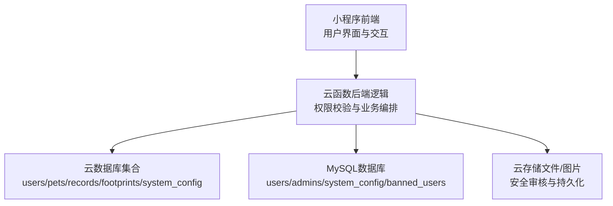
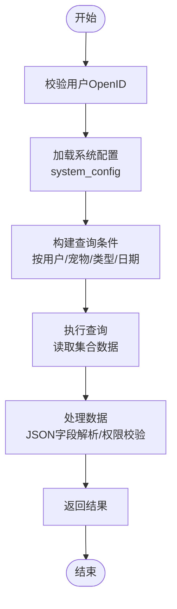

# 数据库设计

<cite>
**本文引用的文件**
- [database.sql](file://server-setup/database.sql)
- [setup.sh](file://server-setup/setup.sh)
- [pet/index.js](file://cloudfunctions/pet/index.js)
- [record/index.js](file://cloudfunctions/record/index.js)
- [footprint/index.js](file://cloudfunctions/footprint/index.js)
- [api.js](file://miniprogram/utils/api.js)
- [app.js](file://miniprogram/app.js)
</cite>

## 目录
1. [简介](#简介)
2. [项目结构](#项目结构)
3. [核心组件](#核心组件)
4. [架构总览](#架构总览)
5. [详细组件分析](#详细组件分析)
6. [依赖分析](#依赖分析)
7. [性能考虑](#性能考虑)
8. [故障排查指南](#故障排查指南)
9. [结论](#结论)
10. [附录](#附录)

## 简介
本文件面向“养龟档案”项目的数据库设计与实现，聚焦于MySQL数据库的整体架构、表结构设计、字段定义与数据类型选择、主键/外键/索引策略、约束条件、JSON字段使用场景与数据格式规范，并提供表间关系图与ER模型。同时，文档包含数据库初始化脚本的执行步骤与注意事项、字符集与排序规则的选择理由、存储引擎的取舍，以及面向开发者的扩展与自定义字段指南。

## 项目结构
- 本项目采用“前端（小程序）+ 云函数（后端逻辑）+ 云数据库/云存储”的混合架构。数据库层由两部分组成：
  - 云数据库集合：用于用户、宠物、记录、足迹、系统配置等业务数据的实时读写（云开发数据库）。
  - MySQL数据库：通过初始化脚本创建，包含用户、管理员、系统配置、黑名单等结构化数据，供后台管理与系统运维使用。
- 云函数负责与云数据库交互，封装业务逻辑与权限控制；小程序通过云函数暴露的接口进行数据操作。



**图表来源**
- [api.js](file://miniprogram/utils/api.js)
- [pet/index.js](file://cloudfunctions/pet/index.js)
- [record/index.js](file://cloudfunctions/record/index.js)
- [footprint/index.js](file://cloudfunctions/footprint/index.js)

**章节来源**
- [api.js](file://miniprogram/utils/api.js)
- [app.js](file://miniprogram/app.js)

## 核心组件
本节概述MySQL数据库的核心表及其职责与关键字段。

- 用户表（users）
  - 负责存储小程序用户的基本信息与登录状态，支持按微信OpenID唯一标识。
  - 关键字段：id（主键）、openid（唯一索引）、nickname、avatar、phone、role、status、last_login_time、created_at、updated_at。
  - 索引策略：唯一索引 idx_openid；普通索引 idx_phone、idx_status，便于登录态与状态检索。

- 管理员表（admins）
  - 存储后台管理员账户信息，支持启用/禁用与角色管理。
  - 关键字段：id（主键）、username（唯一索引）、password、nickname、role、enabled、last_login_time、created_at、updated_at。
  - 索引策略：唯一索引 idx_username。

- 宠物表（pets）
  - 记录每只宠物的唯一ID、归属用户、名称、别名、分类、性别、生日、头像、相册（JSON数组）、亲缘关系（父/母ID与别名）、状态、备注、时间戳。
  - JSON字段：photos（相册数组）。
  - 关键字段：id（主键）、pet_id（唯一索引）、openid、name、alias、category、gender、birth_date、avatar、photos（JSON）、father_id、mother_id、father_alias、mother_alias、status、remark、created_at、updated_at。
  - 索引策略：唯一索引 idx_pet_id；普通索引 idx_openid、idx_category、idx_status、idx_created_at。

- 记录表（records）
  - 记录宠物的各类事件与指标，如产蛋、孵化、健康、喂食等，支持自定义字段。
  - JSON字段：photos（图片列表数组）、custom_fields（自定义字段）。
  - 关键字段：id（主键）、record_id（唯一索引）、openid、pet_id、type、title、content、date、time、photos（JSON）、weight、temperature、humidity、food、quantity、health_status、medicine、notes、custom_fields（JSON）、created_at、updated_at。
  - 索引策略：唯一索引 idx_record_id；普通索引 idx_openid、idx_pet_id、idx_type、idx_date、idx_created_at。

- 足迹表（footprints）
  - 记录用户对宠物的操作足迹，支持图片/视频类型与缩略图、时长、动作、日期时间与描述。
  - JSON字段：photos（图片列表数组）。
  - 关键字段：id（主键）、footprint_id（唯一索引）、openid、pet_id、pet_name、type、url、photos（JSON）、thumbnail、duration、action、date、time、description、created_at、updated_at。
  - 索引策略：唯一索引 idx_footprint_id；普通索引 idx_openid、idx_pet_id、idx_date、idx_created_at。

- 提醒表（reminders）
  - 记录用户的提醒事项，支持重复类型与状态、通知标记。
  - 关键字段：id（主键）、reminder_id（唯一索引）、openid、pet_id、type、title、content、remind_time、repeat_type、repeat_interval、status、notified、created_at、updated_at。
  - 索引策略：唯一索引 idx_reminder_id；普通索引 idx_openid、idx_pet_id、idx_remind_time、idx_status。

- 分类表（categories）
  - 记录用户自定义的分类信息，支持图标、颜色、排序、默认状态与启用/禁用。
  - 关键字段：id（主键）、category_id（唯一索引）、openid、name、icon、color、sort_order、is_default、status、created_at、updated_at。
  - 索引策略：唯一索引 idx_category_id；普通索引 idx_openid、idx_status。

- 系统配置表（system_config）
  - 存储系统运行时配置项，如最大图片数、提醒开关、版本号等。
  - 关键字段：id（主键）、config_key（唯一索引）、config_value、description、created_at、updated_at。
  - 索引策略：唯一索引 idx_config_key。

- 黑名单表（banned_users）
  - 记录被封禁的用户OpenID及封禁原因、操作人与时间。
  - 关键字段：id（主键）、openid（唯一索引）、reason、banned_by、banned_at、created_at。
  - 索引策略：唯一索引 idx_openid。

**章节来源**
- [database.sql](file://server-setup/database.sql)

## 架构总览
下图展示MySQL数据库各核心表之间的关系与约束（基于唯一键与外键策略）。由于项目中MySQL主要用于后台管理与系统配置，实际业务数据主要在云数据库集合中，因此此处强调结构化数据与系统配置的独立性。

```mermaid
erDiagram
USERS {
int id PK
varchar openid UK
varchar nickname
varchar avatar
varchar phone
varchar role
tinyint status
datetime last_login_time
datetime created_at
datetime updated_at
}
ADMINS {
int id PK
varchar username UK
varchar password
varchar nickname
varchar role
tinyint enabled
datetime last_login_time
datetime created_at
datetime updated_at
}
PETS {
int id PK
varchar pet_id UK
varchar openid
varchar name
varchar alias
varchar category
varchar gender
date birth_date
varchar avatar
json photos
varchar father_id
varchar mother_id
varchar father_alias
varchar mother_alias
varchar status
text remark
datetime created_at
datetime updated_at
}
RECORDS {
int id PK
varchar record_id UK
varchar openid
varchar pet_id
varchar type
varchar title
text content
date date
time time
json photos
decimal weight
decimal temperature
decimal humidity
varchar food
varchar quantity
varchar health_status
varchar medicine
text notes
json custom_fields
datetime created_at
datetime updated_at
}
FOOTPRINTS {
int id PK
varchar footprint_id UK
varchar openid
varchar pet_id
varchar pet_name
varchar type
varchar url
json photos
varchar thumbnail
int duration
varchar action
date date
time time
text description
datetime created_at
datetime updated_at
}
REMINDERS {
int id PK
varchar reminder_id UK
varchar openid
varchar pet_id
varchar type
varchar title
text content
datetime remind_time
varchar repeat_type
int repeat_interval
varchar status
tinyint notified
datetime created_at
datetime updated_at
}
CATEGORIES {
int id PK
varchar category_id UK
varchar openid
varchar name
varchar icon
varchar color
int sort_order
tinyint is_default
tinyint status
datetime created_at
datetime updated_at
}
SYSTEM_CONFIG {
int id PK
varchar config_key UK
text config_value
varchar description
datetime created_at
datetime updated_at
}
BANNED_USERS {
int id PK
varchar openid UK
varchar reason
varchar banned_by
datetime banned_at
datetime created_at
}
-- 关系示意概念性
PETS }o--|| USERS : "归属"
RECORDS }o--|| PETS : "关联"
FOOTPRINTS }o--|| PETS : "关联"
REMINDERS }o--|| PETS : "关联"
CATEGORIES }o--|| USERS : "归属"
```

**图表来源**
- [database.sql](file://server-setup/database.sql)

## 详细组件分析

### 用户表（users）
- 设计要点
  - 主键：自增id。
  - 唯一键：openid，确保用户唯一性。
  - 索引：phone、status辅助查询与状态管理。
  - 时间戳：created_at、updated_at自动维护。
- JSON字段：无。
- 约束：status为tinyint（0/1），role为枚举字符串（user/admin）。

**章节来源**
- [database.sql](file://server-setup/database.sql)

### 管理员表（admins）
- 设计要点
  - 主键：自增id。
  - 唯一键：username，保证管理员账号唯一。
  - 索引：无显式索引，可通过username快速定位。
  - 约束：enabled为tinyint（0/1），role为枚举字符串（admin）。

**章节来源**
- [database.sql](file://server-setup/database.sql)

### 宠物表（pets）
- 设计要点
  - 主键：自增id。
  - 唯一键：pet_id，全局唯一宠物标识。
  - JSON字段：photos（相册数组），用于存储多张图片URL。
  - 索引：openid、category、status、created_at，支撑按用户、分类、状态与时间的查询。
  - 外键：无显式外键约束，通过业务层保证pet_id与records/footprints等表的关联一致性。
- JSON字段规范
  - photos：数组，元素为字符串（图片URL），建议遵循云存储fileID或HTTP URL格式。
- 约束：status支持“active/archived/deleted”等状态；gender支持“male/female/unknown”。

**章节来源**
- [database.sql](file://server-setup/database.sql)

### 记录表（records）
- 设计要点
  - 主键：自增id。
  - 唯一键：record_id，全局唯一记录标识。
  - JSON字段：photos（图片数组）、custom_fields（自定义字段对象/数组，视业务而定）。
  - 索引：openid、pet_id、type、date、created_at，支撑按用户、宠物、类型、日期与时间的查询。
- JSON字段规范
  - photos：数组，元素为字符串（图片URL）。
  - custom_fields：对象或数组，建议包含字段名与值，便于前端渲染与统计。
- 约束：type涵盖“egg/breeding/health/feeding/custom”等类型；支持温度、湿度、体重等数值型字段。

**章节来源**
- [database.sql](file://server-setup/database.sql)

### 足迹表（footprints）
- 设计要点
  - 主键：自增id。
  - 唯一键：footprint_id，全局唯一足迹标识。
  - JSON字段：photos（图片数组）。
  - 索引：openid、pet_id、date、created_at，支撑按用户、宠物、日期与时间的查询。
- JSON字段规范
  - photos：数组，元素为字符串（图片URL）。
- 约束：type支持“image/video”，duration为整型（秒）。

**章节来源**
- [database.sql](file://server-setup/database.sql)

### 提醒表（reminders）
- 设计要点
  - 主键：自增id。
  - 唯一键：reminder_id，全局唯一提醒标识。
  - 索引：openid、pet_id、remind_time、status，支撑按用户、宠物、提醒时间与状态的查询。
- 约束：repeat_type支持“none/daily/weekly/monthly”，status支持“active/completed/expired”，notified为tinyint（0/1）。

**章节来源**
- [database.sql](file://server-setup/database.sql)

### 分类表（categories）
- 设计要点
  - 主键：自增id。
  - 唯一键：category_id，全局唯一分类标识。
  - 索引：openid、status，支撑按用户与状态的查询。
- 约束：is_default为tinyint（0/1），status为tinyint（0/1），sort_order为整型排序字段。

**章节来源**
- [database.sql](file://server-setup/database.sql)

### 系统配置表（system_config）
- 设计要点
  - 主键：自增id。
  - 唯一键：config_key，保证配置项唯一。
  - 索引：无显式索引。
- 默认配置
  - maxFootprintImages：每张足迹最多上传图片数。
  - maxPetPhotos：每只宠物最多照片数。
  - enableReminder：是否启用提醒功能。
  - version：系统版本号。
- 约束：config_value为text，可存储JSON字符串或简单文本。

**章节来源**
- [database.sql](file://server-setup/database.sql)

### 黑名单表（banned_users）
- 设计要点
  - 主键：自增id。
  - 唯一键：openid，确保被封禁用户唯一。
  - 索引：无显式索引。
- 约束：banned_at为自动时间戳，reason与banned_by为可选字段。

**章节来源**
- [database.sql](file://server-setup/database.sql)

## 依赖分析
- 表间关系
  - pets与records/footprints/reminders之间通过pet_id建立一对多关系（概念性，无外键约束）。
  - users与pets之间通过openid建立一对多关系（概念性，无外键约束）。
  - admins与users无直接关系，但可通过业务层进行权限控制。
- 外键与约束
  - 项目中未启用显式外键约束，而是通过业务层与唯一键保障数据一致性。
- 索引策略
  - 在高频查询字段上建立索引（如openid、pet_id、type、date、status等），提升查询性能。
- JSON字段使用
  - pets.photos、records.photos、records.custom_fields、footprints.photos均采用JSON字段存储数组或对象，便于灵活扩展。



**图表来源**
- [pet/index.js](file://cloudfunctions/pet/index.js)
- [record/index.js](file://cloudfunctions/record/index.js)
- [footprint/index.js](file://cloudfunctions/footprint/index.js)

**章节来源**
- [pet/index.js](file://cloudfunctions/pet/index.js)
- [record/index.js](file://cloudfunctions/record/index.js)
- [footprint/index.js](file://cloudfunctions/footprint/index.js)

## 性能考虑
- 索引优化
  - 对高频过滤字段建立索引（如openid、pet_id、type、date、status），避免全表扫描。
  - 合理使用复合索引，减少回表次数。
- JSON字段查询
  - JSON字段适合存储半结构化数据，但不建议在JSON内进行复杂查询；建议将常用字段沉淀为关系型列以提升查询效率。
- 分页与排序
  - 使用created_at或date字段进行分页与排序，避免对大结果集进行昂贵的排序。
- 存储引擎与字符集
  - InnoDB提供事务与外键支持，utf8mb4_unicode_ci支持完整的四字节字符与排序规则，满足国际化需求。
- 外键检查
  - 初始化脚本中暂时关闭外键检查，导入完成后恢复，避免导入顺序导致的约束冲突。

**章节来源**
- [database.sql](file://server-setup/database.sql)

## 故障排查指南
- 数据导入失败
  - 确认已正确设置字符集与排序规则（utf8mb4与utf8mb4_unicode_ci）。
  - 检查是否存在外键约束冲突，必要时参考初始化脚本中的外键检查开关。
- 权限与数据隔离
  - 云函数中严格校验openid，确保用户只能访问自己的数据。
  - 若出现跨用户数据泄露，检查云函数中的权限判断逻辑。
- JSON字段异常
  - 确保JSON字段为合法数组或对象格式；前端传参时避免传递null或undefined。
- 系统配置不生效
  - 检查system_config中的config_key是否正确，确认小程序端已正确加载配置。

**章节来源**
- [pet/index.js](file://cloudfunctions/pet/index.js)
- [record/index.js](file://cloudfunctions/record/index.js)
- [footprint/index.js](file://cloudfunctions/footprint/index.js)
- [database.sql](file://server-setup/database.sql)

## 结论
本数据库设计以MySQL为核心，承载后台管理与系统配置等结构化数据；业务主数据通过云数据库集合实现高可用与低耦合。通过合理的索引策略、JSON字段规范与权限控制，系统在可扩展性与性能之间取得平衡。建议在后续迭代中持续评估JSON字段的查询成本，并根据业务增长逐步引入必要的关系型列以优化查询性能。

## 附录

### 数据库初始化与执行步骤
- 执行环境准备
  - 使用Ubuntu 22.04，具备root权限。
  - 安装MySQL 8.0、Nginx、Node.js 20.x、PM2等依赖。
- 创建数据库与用户
  - 使用脚本创建数据库与用户，并授予相应权限。
- 导入表结构
  - 使用命令导入SQL脚本，创建所有核心表与默认配置。
- 防火墙与目录
  - 配置防火墙开放必要端口，创建项目目录并赋权。

**章节来源**
- [setup.sh](file://server-setup/setup.sh)
- [database.sql](file://server-setup/database.sql)

### 字符集、排序规则与存储引擎选择
- 字符集：utf8mb4，支持emoji与四字节字符。
- 排序规则：utf8mb4_unicode_ci，兼顾Unicode比较与性能。
- 存储引擎：InnoDB，支持事务、行级锁与崩溃恢复。

**章节来源**
- [database.sql](file://server-setup/database.sql)

### 开发者扩展与自定义字段指南
- 新增字段
  - 对于频繁查询的字段，建议使用关系型列而非JSON字段，以提升查询性能。
  - 对于灵活度要求高的字段，可在JSON对象中新增键值对，并在前端与云函数两端保持一致的解析逻辑。
- JSON字段命名规范
  - photos：数组，元素为字符串（图片URL）。
  - custom_fields：对象或数组，建议包含字段名与值，便于前端渲染与统计。
- 索引策略
  - 新增字段若用于过滤或排序，应考虑建立索引；避免在JSON内部进行复杂查询。
- 权限与安全
  - 所有写操作必须校验openid，防止越权访问；涉及敏感字段（如手机号）需遵循隐私保护规范。

**章节来源**
- [database.sql](file://server-setup/database.sql)
- [pet/index.js](file://cloudfunctions/pet/index.js)
- [record/index.js](file://cloudfunctions/record/index.js)
- [footprint/index.js](file://cloudfunctions/footprint/index.js)