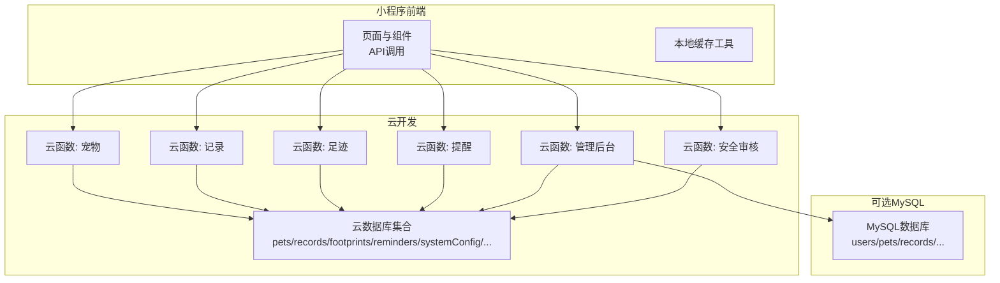
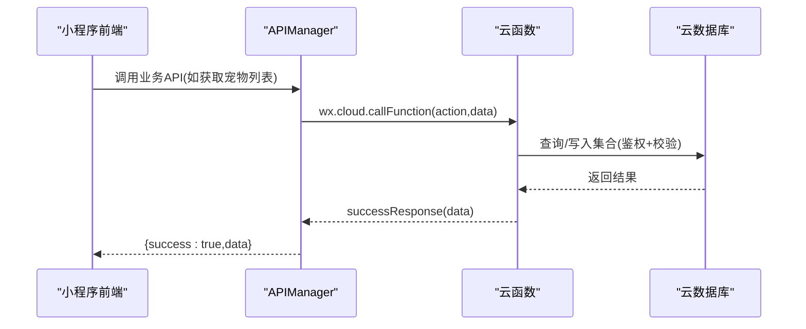
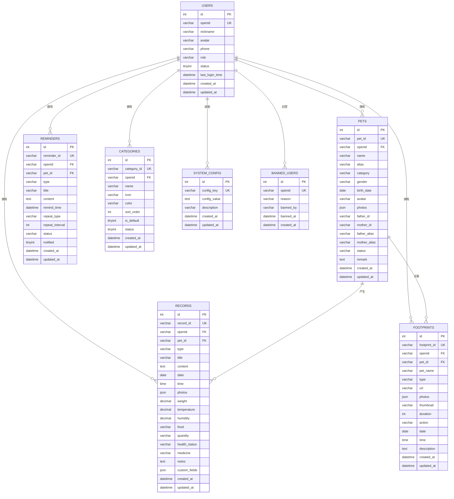
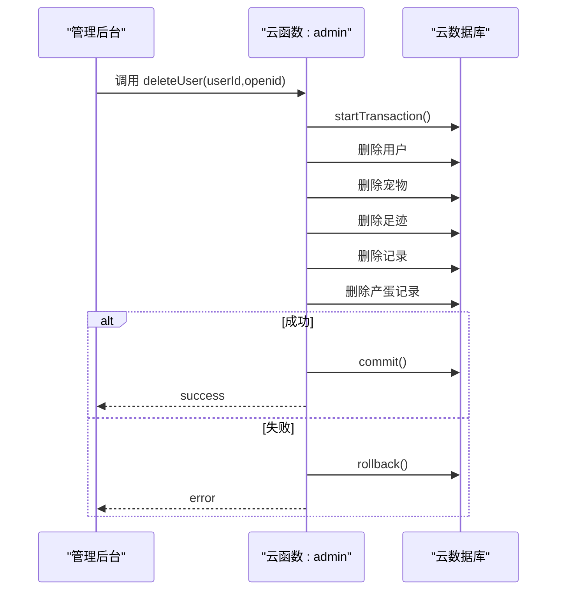
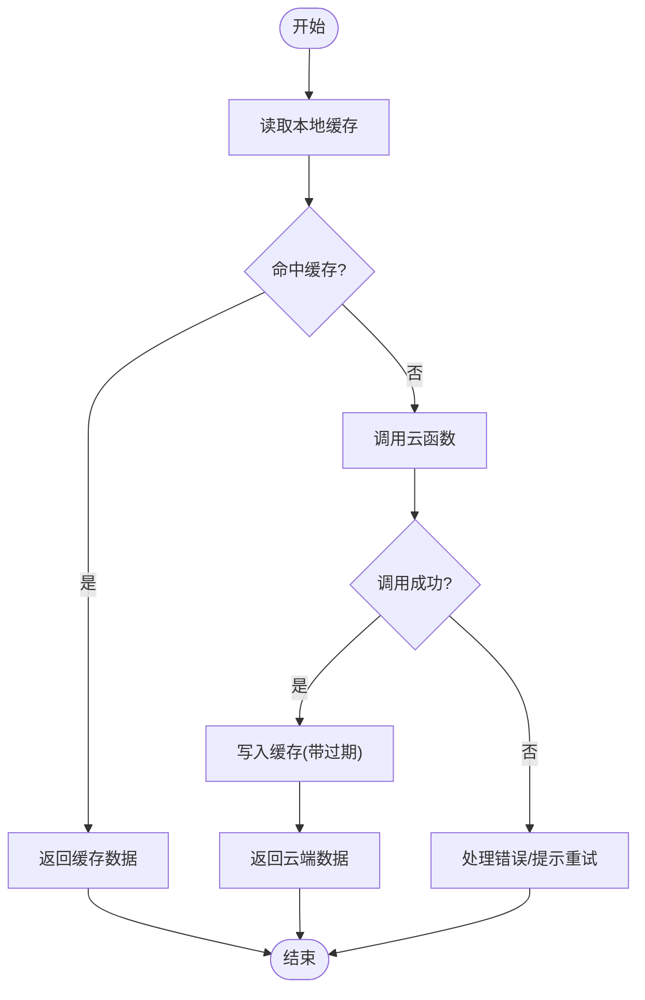
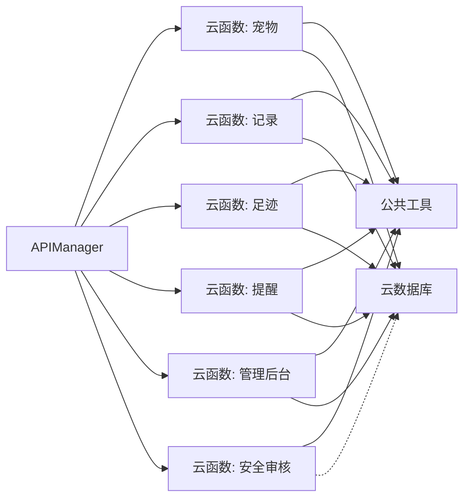
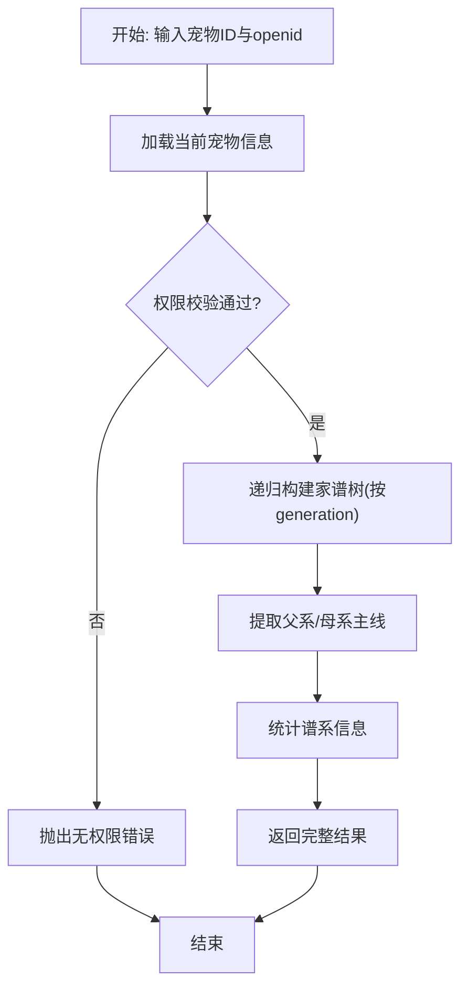

# 数据管理

<cite>
**本文引用的文件**
- [cloudfunctions/pet/index.js](file://cloudfunctions/pet/index.js)
- [cloudfunctions/record/index.js](file://cloudfunctions/record/index.js)
- [cloudfunctions/admin/index.js](file://cloudfunctions/admin/index.js)
- [cloudfunctions/footprint/index.js](file://cloudfunctions/footprint/index.js)
- [cloudfunctions/reminder/index.js](file://cloudfunctions/reminder/index.js)
- [cloudfunctions/common/utils.js](file://cloudfunctions/common/utils.js)
- [cloudfunctions/pet/utils.js](file://cloudfunctions/pet/utils.js)
- [cloudfunctions/record/utils.js](file://cloudfunctions/record/utils.js)
- [cloudfunctions/security/index.js](file://cloudfunctions/security/index.js)
- [miniprogram/utils/api.js](file://miniprogram/utils/api.js)
- [miniprogram/utils/cache.js](file://miniprogram/utils/cache.js)
- [miniprogram/utils/securityChecker.js](file://miniprogram/utils/securityChecker.js)
- [miniprogram/app.js](file://miniprogram/app.js)
- [server-setup/database.sql](file://server-setup/database.sql)
</cite>

## 目录
1. [简介](#简介)
2. [项目结构](#项目结构)
3. [核心组件](#核心组件)
4. [架构总览](#架构总览)
5. [详细组件分析](#详细组件分析)
6. [依赖分析](#依赖分析)
7. [性能考虑](#性能考虑)
8. [故障排查指南](#故障排查指南)
9. [结论](#结论)
10. [附录](#附录)

## 简介
本文件面向开发者与运维人员，系统化梳理“养龟档案”项目的数据管理方案，覆盖数据库设计、数据模型与关系架构、云数据库使用方式、查询优化与索引策略、本地缓存与离线处理、数据同步策略、数据安全与合规、备份恢复与迁移、数据访问层设计与事务处理、数据验证与约束、性能监控与成本控制，以及扩展与自定义字段的开发指南。

## 项目结构
项目采用“小程序前端 + 云开发云函数 + 云数据库 + 可选MySQL”的混合架构：
- 前端通过云函数调用实现数据访问，统一经由云函数封装鉴权、校验与返回格式。
- 云函数使用微信云开发数据库，按模块拆分（宠物、记录、足迹、提醒、管理后台、安全审核等）。
- 项目包含一套MySQL建库脚本，可用于历史迁移、报表统计或与云数据库并行运行。

图表来源
- [miniprogram/utils/api.js:12-38](file://miniprogram/utils/api.js#L12-L38)
- [cloudfunctions/pet/index.js:45-82](file://cloudfunctions/pet/index.js#L45-L82)
- [cloudfunctions/record/index.js:10-35](file://cloudfunctions/record/index.js#L10-L35)
- [cloudfunctions/footprint/index.js:9-32](file://cloudfunctions/footprint/index.js#L9-L32)
- [cloudfunctions/reminder/index.js:10-37](file://cloudfunctions/reminder/index.js#L10-L37)
- [cloudfunctions/admin/index.js:27-71](file://cloudfunctions/admin/index.js#L27-L71)
- [cloudfunctions/security/index.js:15-64](file://cloudfunctions/security/index.js#L15-L64)
- [server-setup/database.sql:9-221](file://server-setup/database.sql#L9-L221)

章节来源
- [miniprogram/utils/api.js:12-38](file://miniprogram/utils/api.js#L12-L38)
- [cloudfunctions/pet/index.js:45-82](file://cloudfunctions/pet/index.js#L45-L82)
- [cloudfunctions/record/index.js:10-35](file://cloudfunctions/record/index.js#L10-L35)
- [cloudfunctions/footprint/index.js:9-32](file://cloudfunctions/footprint/index.js#L9-L32)
- [cloudfunctions/reminder/index.js:10-37](file://cloudfunctions/reminder/index.js#L10-L37)
- [cloudfunctions/admin/index.js:27-71](file://cloudfunctions/admin/index.js#L27-L71)
- [cloudfunctions/security/index.js:15-64](file://cloudfunctions/security/index.js#L15-L64)
- [server-setup/database.sql:9-221](file://server-setup/database.sql#L9-L221)

## 核心组件
- 数据访问层（API封装）：统一调用云函数，处理返回格式与错误，支持图片上传与安全审核联动。
- 云函数层（业务域）：按模块划分，统一鉴权、校验、分页、权限控制与返回格式。
- 云数据库层（集合）：以集合为单位承载实体数据，配合索引与查询策略。
- 本地缓存层：小程序端本地持久化缓存，提升离线体验与减少网络请求。
- 安全审核层：统一的安全审核薄包装，支持图片/文本审核与通知管理。
- 可选MySQL：提供历史迁移、报表与统计能力，与云数据库互补。

章节来源
- [miniprogram/utils/api.js:4-38](file://miniprogram/utils/api.js#L4-L38)
- [cloudfunctions/common/utils.js:10-68](file://cloudfunctions/common/utils.js#L10-L68)
- [cloudfunctions/pet/utils.js:10-68](file://cloudfunctions/pet/utils.js#L10-L68)
- [cloudfunctions/record/utils.js:10-68](file://cloudfunctions/record/utils.js#L10-L68)
- [miniprogram/utils/cache.js:11-85](file://miniprogram/utils/cache.js#L11-L85)
- [cloudfunctions/security/index.js:15-64](file://cloudfunctions/security/index.js#L15-L64)
- [server-setup/database.sql:9-221](file://server-setup/database.sql#L9-L221)

## 架构总览
下图展示从前端到云函数再到数据库的整体数据流与职责边界：

图表来源
- [miniprogram/utils/api.js:12-38](file://miniprogram/utils/api.js#L12-L38)
- [cloudfunctions/pet/index.js:45-82](file://cloudfunctions/pet/index.js#L45-L82)
- [cloudfunctions/common/utils.js:20-35](file://cloudfunctions/common/utils.js#L20-L35)

## 详细组件分析

### 数据模型与关系架构
- 集合划分与关键字段
  - 宠物集合（pets）：包含名称、别名、分类、性别、父子关系、公开状态、图片、创建/更新时间等。
  - 记录集合（records）：包含类型（日常/产蛋/出苗/交配）、时间、照片、关联宠物ID等。
  - 足迹集合（footprints）：包含类型（图片/视频）、照片、缩略图、描述、关联宠物等。
  - 提醒集合（reminders）：包含类型、间隔天数、最近完成时间、状态等。
  - 系统配置（systemConfig）：集中式配置项，如最大宠物数、最大图片数等。
  - 管理后台相关：用户、管理员、黑名单、通知等。
- 关系与约束
  - 权限隔离：各集合均以 openid 作为用户维度的过滤条件，保障数据隔离。
  - 外键关系：云数据库不支持传统外键，通过业务层保证引用一致性（如记录中的 petId）。
  - 唯一性：别名唯一（同一用户内）、分类名称唯一（同一用户内）、系统配置唯一读取等。
- 可选MySQL模型
  - users、pets、records、footprints、reminders、categories、system_config、banned_users 等表，提供标准SQL索引与约束，便于迁移与报表。

图表来源
- [server-setup/database.sql:9-221](file://server-setup/database.sql#L9-L221)

章节来源
- [server-setup/database.sql:9-221](file://server-setup/database.sql#L9-L221)

### 云数据库使用方式与事务处理
- 统一初始化与工具
  - 云函数通过公共工具获取数据库实例与OPENID，统一封装成功/失败响应与ID规范化。
- 事务处理
  - 管理后台删除用户时开启事务，原子性删除用户、宠物、足迹、记录、产蛋记录，失败回滚。
- 权限与校验
  - 读写操作均先校验文档是否存在且 openid 匹配，防止越权访问。
- 分页与排序
  - 列表查询统一支持分页、排序与计数，避免一次性拉取过多数据。

图表来源
- [cloudfunctions/admin/index.js:227-258](file://cloudfunctions/admin/index.js#L227-L258)

章节来源
- [cloudfunctions/common/utils.js:10-68](file://cloudfunctions/common/utils.js#L10-L68)
- [cloudfunctions/pet/utils.js:10-68](file://cloudfunctions/pet/utils.js#L10-L68)
- [cloudfunctions/record/utils.js:10-68](file://cloudfunctions/record/utils.js#L10-L68)
- [cloudfunctions/admin/index.js:227-258](file://cloudfunctions/admin/index.js#L227-L258)

### 数据查询优化与索引策略
- 查询模式
  - 前端传入过滤条件（分类、性别、关键字等），云函数拼接 where 条件并统一分页。
  - 家谱查询采用递归查询，按 generation 控制深度，避免无限展开。
- 索引建议（基于现有字段）
  - 用户维度：openid、status、role 等常用过滤字段。
  - 时间维度：createdAt、updatedAt、date 等排序/范围查询。
  - 名称/别名：模糊搜索使用正则，建议结合 name 或 nameOR 字段优化。
  - 类型/分类：type、category 等高频过滤字段。
- 索引落地
  - 云数据库集合层面建议建立复合索引（如 openid+createdAt、type+date），减少全表扫描。
  - 对频繁排序字段（如 createdAt desc）建立相应索引。

章节来源
- [cloudfunctions/pet/index.js:140-180](file://cloudfunctions/pet/index.js#L140-L180)
- [cloudfunctions/record/index.js:84-111](file://cloudfunctions/record/index.js#L84-L111)
- [cloudfunctions/footprint/index.js:74-107](file://cloudfunctions/footprint/index.js#L74-L107)
- [cloudfunctions/reminder/index.js:104-142](file://cloudfunctions/reminder/index.js#L104-L142)

### 本地缓存机制与离线数据处理
- 本地缓存
  - 前端提供统一缓存工具，支持设置/获取/移除/清理缓存，带过期时间与容量不足自动清理。
  - 建议对列表数据（如宠物列表、分类、提醒汇总）做短期缓存，提升首屏与离线体验。
- 离线策略
  - 仅对读取友好型数据做缓存；写入类操作必须在线完成，写入成功后再更新本地缓存。
  - 对图片URL进行净化（cloud:// 永久地址），避免临时URL失效导致的离线问题。

图表来源
- [miniprogram/utils/cache.js:69-85](file://miniprogram/utils/cache.js#L69-L85)
- [miniprogram/utils/api.js:12-38](file://miniprogram/utils/api.js#L12-L38)

章节来源
- [miniprogram/utils/cache.js:11-121](file://miniprogram/utils/cache.js#L11-L121)
- [cloudfunctions/pet/index.js:16-43](file://cloudfunctions/pet/index.js#L16-L43)

### 数据同步策略
- 前端侧
  - 首屏预加载与增量更新：应用启动时预取必要数据，后续按需刷新。
  - 本地状态与云端状态对齐：写入成功后更新本地缓存与内存状态。
- 云函数侧
  - 分类同步：新增宠物时若分类不存在则同步到分类集合，保持分类一致性。
  - 家谱树构建：按 generation 递归查询，避免跨用户数据泄露。
- 跨端一致性
  - 通过 openid 严格隔离用户数据，避免跨用户污染。

章节来源
- [cloudfunctions/pet/index.js:672-688](file://cloudfunctions/pet/index.js#L672-L688)
- [cloudfunctions/pet/index.js:417-469](file://cloudfunctions/pet/index.js#L417-L469)

### 数据安全、备份恢复与迁移
- 数据安全
  - 权限控制：所有读写均校验 openid，防止越权。
  - 审核联动：上传图片后异步提交安全审核，失败可阻断或提示。
  - 配置中心：系统配置集中管理，避免硬编码。
- 备份与恢复
  - 云数据库：定期导出集合数据，保留版本号与时间戳。
  - MySQL：使用SQL脚本维护结构与默认数据，便于迁移与审计。
- 迁移方案
  - 从MySQL迁移到云数据库：按表结构映射为集合，批量导入+索引重建。
  - 从旧集合迁移到新集合：兼容旧字段，逐步替换。

章节来源
- [cloudfunctions/admin/index.js:475-508](file://cloudfunctions/admin/index.js#L475-L508)
- [cloudfunctions/security/index.js:15-64](file://cloudfunctions/security/index.js#L15-L64)
- [server-setup/database.sql:196-201](file://server-setup/database.sql#L196-L201)

### 数据访问层设计、ORM与事务
- 访问层
  - APIManager 统一封装云函数调用、错误处理与返回格式，屏蔽云函数差异。
  - 云函数内部统一使用公共工具获取数据库、OPENID，并标准化响应。
- ORM与原生
  - 云数据库采用原生查询DSL，不使用ORM；通过工具函数实现规范化与错误处理。
- 事务
  - 管理后台删除用户时使用事务，确保多集合原子性。

章节来源
- [miniprogram/utils/api.js:4-38](file://miniprogram/utils/api.js#L4-L38)
- [cloudfunctions/common/utils.js:10-68](file://cloudfunctions/common/utils.js#L10-L68)
- [cloudfunctions/admin/index.js:227-258](file://cloudfunctions/admin/index.js#L227-L258)

### 数据验证规则、约束与业务规则
- 宠物
  - 名称必填；别名在同一用户内唯一；公开状态与数量上限（系统配置）。
- 记录
  - 类型区分（产蛋/出苗/交配）并附加对应字段；照片数量受系统配置限制。
- 足迹
  - 照片数量受系统配置限制；类型支持图片/视频。
- 提醒
  - 同一宠物+类型唯一；间隔天数合法；完成状态更新 lastDone。
- 管理
  - 管理员权限校验；用户封禁/解封联动黑名单。

章节来源
- [cloudfunctions/pet/index.js:84-138](file://cloudfunctions/pet/index.js#L84-L138)
- [cloudfunctions/record/index.js:37-82](file://cloudfunctions/record/index.js#L37-L82)
- [cloudfunctions/footprint/index.js:34-72](file://cloudfunctions/footprint/index.js#L34-L72)
- [cloudfunctions/reminder/index.js:54-102](file://cloudfunctions/reminder/index.js#L54-L102)
- [cloudfunctions/admin/index.js:117-217](file://cloudfunctions/admin/index.js#L117-L217)

### 性能监控、查询优化与存储成本控制
- 监控指标
  - 请求耗时、错误率、分页大小、图片上传成功率、审核回调延迟。
- 查询优化
  - 合理使用索引、避免 N+1 查询、批量查询与聚合。
- 成本控制
  - 控制分页大小与并发请求；图片压缩与CDN；缓存命中率。

[本节为通用指导，无需列出具体文件来源]

### 数据模型扩展与自定义字段开发指南
- 扩展原则
  - 保持 openid 隔离；新增字段需考虑默认值与兼容性。
- 自定义字段
  - 记录集合支持 custom_fields JSON 字段，便于灵活扩展。
  - 建议在云函数层统一序列化/反序列化，保证前后端一致。
- 新增集合
  - 遵循现有命名规范与权限模型；补充索引与查询策略。

章节来源
- [server-setup/database.sql:99-99](file://server-setup/database.sql#L99-L99)
- [cloudfunctions/record/index.js:53-76](file://cloudfunctions/record/index.js#L53-L76)

## 依赖分析
- 前端依赖云函数：APIManager 依赖各云函数（pet/record/footprint/reminder/admin/security）。
- 云函数依赖公共工具：统一数据库初始化、OPENID获取、响应封装。
- 安全审核依赖：图片上传后异步提交审核，支持通知与超时检查。
- MySQL依赖：用于迁移与报表，不参与实时业务。

图表来源
- [miniprogram/utils/api.js:4-38](file://miniprogram/utils/api.js#L4-L38)
- [cloudfunctions/common/utils.js:10-68](file://cloudfunctions/common/utils.js#L10-L68)
- [cloudfunctions/security/index.js:15-64](file://cloudfunctions/security/index.js#L15-L64)

章节来源
- [miniprogram/utils/api.js:4-38](file://miniprogram/utils/api.js#L4-L38)
- [cloudfunctions/common/utils.js:10-68](file://cloudfunctions/common/utils.js#L10-L68)
- [cloudfunctions/security/index.js:15-64](file://cloudfunctions/security/index.js#L15-L64)

## 性能考虑
- 查询优化
  - 为高频过滤与排序字段建立索引；避免在大数据集上进行正则匹配。
- 缓存策略
  - 列表数据短期缓存；写入成功后更新缓存；图片URL使用永久cloud://地址。
- 并发与批处理
  - 批量查询与更新；避免串行多次请求。
- 存储与CDN
  - 图片压缩与CDN加速；控制最大图片数量与尺寸。

[本节为通用指导，无需列出具体文件来源]

## 故障排查指南
- 常见问题
  - 无权限/文档不存在：检查 openid 校验与文档存在性。
  - 云函数调用失败：检查网络状态与云函数返回的错误信息。
  - 审核未回调：检查安全审核云函数状态与超时提示。
- 排查步骤
  - 前端：查看API调用返回与错误提示。
  - 云函数：查看日志与错误堆栈。
  - 数据库：确认索引与查询条件是否合理。

章节来源
- [cloudfunctions/pet/index.js:182-250](file://cloudfunctions/pet/index.js#L182-L250)
- [cloudfunctions/record/index.js:113-159](file://cloudfunctions/record/index.js#L113-L159)
- [cloudfunctions/security/index.js:151-199](file://cloudfunctions/security/index.js#L151-L199)

## 结论
本项目通过清晰的模块化云函数、严格的权限控制与统一的响应封装，实现了稳定的数据访问层；结合本地缓存与安全审核，兼顾性能与合规；MySQL脚本为迁移与报表提供了基础。建议持续完善索引与监控，强化自定义字段的版本演进策略，确保数据模型随业务演进而平滑扩展。

## 附录
- 关键流程图（家谱查询）

图表来源
- [cloudfunctions/pet/index.js:376-412](file://cloudfunctions/pet/index.js#L376-L412)
- [cloudfunctions/pet/index.js:417-469](file://cloudfunctions/pet/index.js#L417-L469)
- [cloudfunctions/pet/index.js:693-722](file://cloudfunctions/pet/index.js#L693-L722)