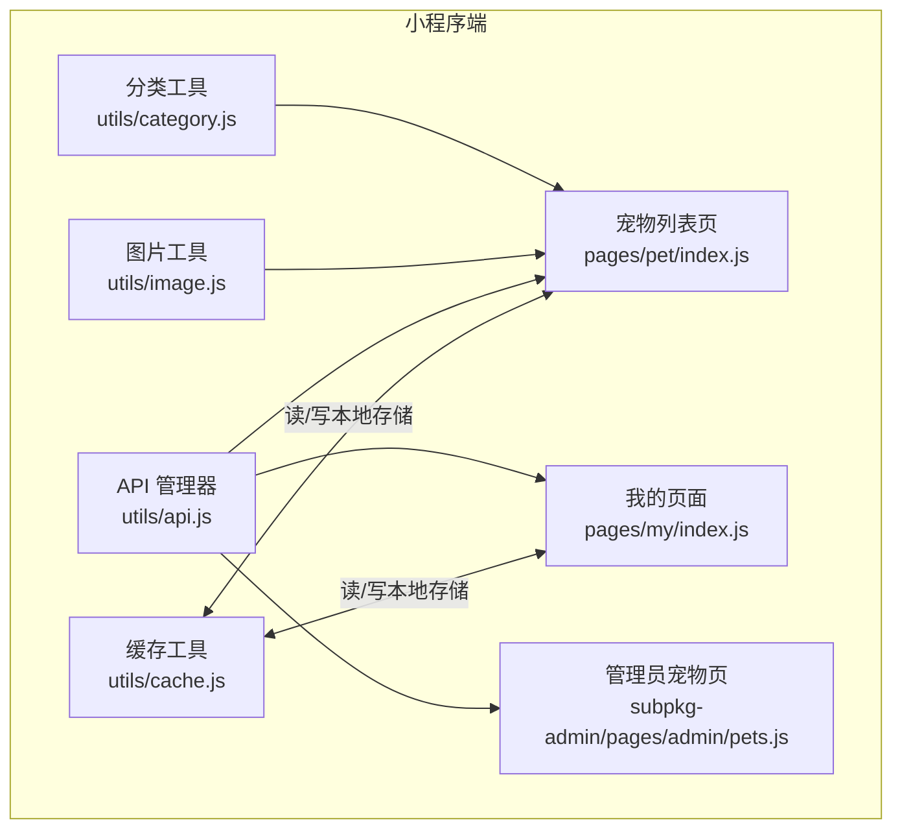
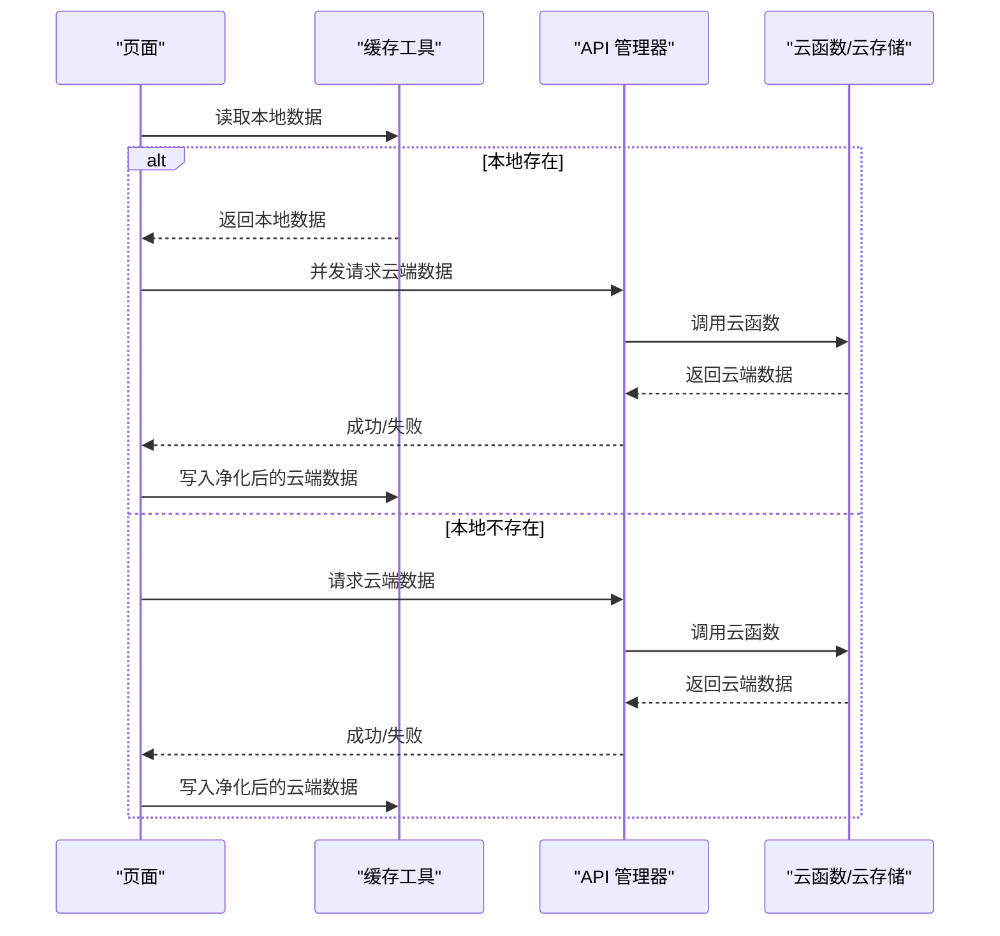
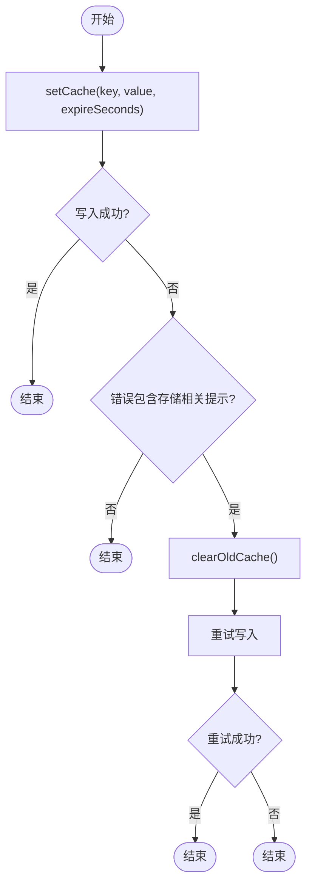
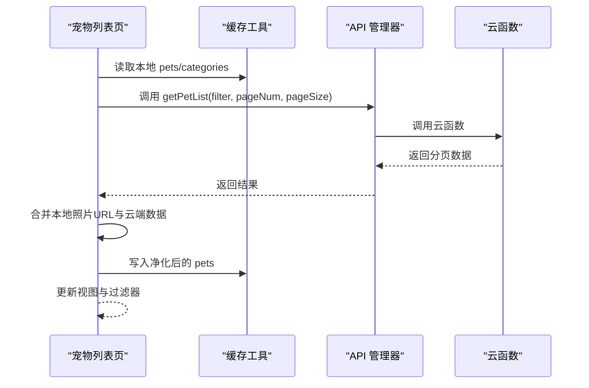
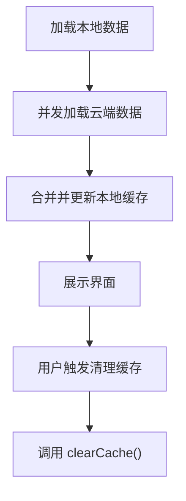
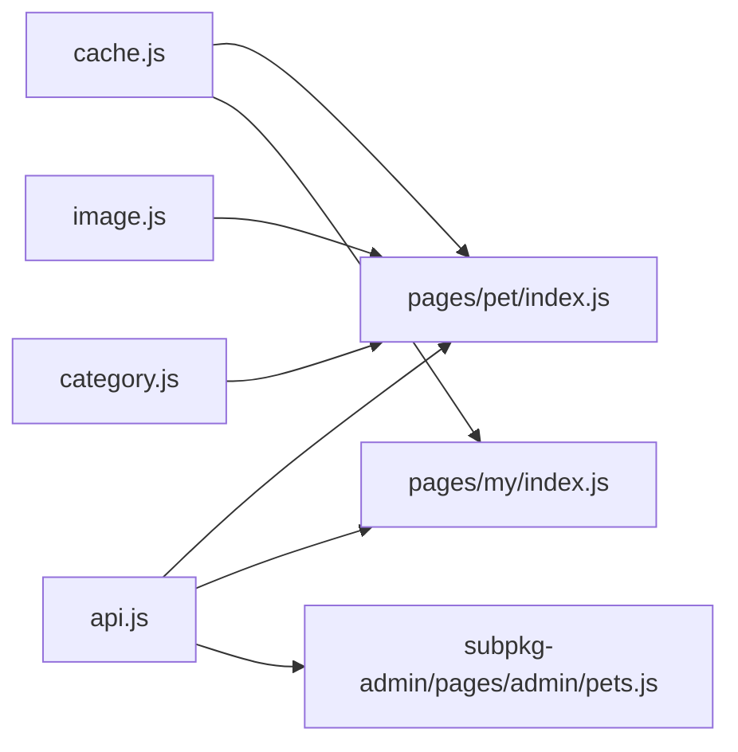

# 缓存策略

<cite>
**本文引用的文件**
- [cache.js](file://miniprogram/utils/cache.js)
- [api.js](file://miniprogram/utils/api.js)
- [index.js（宠物列表页）](file://miniprogram/pages/pet/index.js)
- [index.js（我的页面）](file://miniprogram/pages/my/index.js)
- [category.js](file://miniprogram/utils/category.js)
- [image.js](file://miniprogram/utils/image.js)
- [index.js（管理员宠物页）](file://miniprogram/subpkg-admin/pages/admin/pets.js)
</cite>

## 目录
1. [引言](#引言)
2. [项目结构](#项目结构)
3. [核心组件](#核心组件)
4. [架构总览](#架构总览)
5. [详细组件分析](#详细组件分析)
6. [依赖关系分析](#依赖关系分析)
7. [性能考量](#性能考量)
8. [故障排查指南](#故障排查指南)
9. [结论](#结论)
10. [附录](#附录)

## 引言
本文件面向“养龟档案”项目的开发者，系统化梳理并制定本地缓存策略，涵盖缓存存储、读取与更新机制；明确缓存键命名规范、过期时间与失效策略；针对用户信息、宠物列表、记录数据等不同数据类型提出差异化缓存策略；给出缓存一致性保障与数据同步建议；提供性能优化与内存管理最佳实践，并说明离线处理与缓存降级方案，最后提供调试与性能分析方法。

## 项目结构
本项目在小程序端采用本地持久化存储作为主要缓存介质，配合云函数接口实现数据拉取与同步。关键位置如下：
- 缓存工具：miniprogram/utils/cache.js
- API 管理：miniprogram/utils/api.js
- 页面使用：pages/pet/index.js、pages/my/index.js、subpkg-admin/pages/admin/pets.js
- 数据净化与图片处理：utils/image.js
- 分类合并与同步：utils/category.js

图表来源
- [cache.js:1-120](file://miniprogram/utils/cache.js#L1-L120)
- [api.js:1-208](file://miniprogram/utils/api.js#L1-L208)
- [index.js（宠物列表页）:1-800](file://miniprogram/pages/pet/index.js#L1-L800)
- [index.js（我的页面）:1-800](file://miniprogram/pages/my/index.js#L1-L800)
- [category.js:1-65](file://miniprogram/utils/category.js#L1-L65)
- [image.js:1-170](file://miniprogram/utils/image.js#L1-L170)
- [index.js（管理员宠物页）:1-96](file://miniprogram/subpkg-admin/pages/admin/pets.js#L1-L96)

章节来源
- [cache.js:1-120](file://miniprogram/utils/cache.js#L1-L120)
- [api.js:1-208](file://miniprogram/utils/api.js#L1-L208)
- [index.js（宠物列表页）:1-800](file://miniprogram/pages/pet/index.js#L1-L800)
- [index.js（我的页面）:1-800](file://miniprogram/pages/my/index.js#L1-L800)
- [category.js:1-65](file://miniprogram/utils/category.js#L1-L65)
- [image.js:1-170](file://miniprogram/utils/image.js#L1-L170)
- [index.js（管理员宠物页）:1-96](file://miniprogram/subpkg-admin/pages/admin/pets.js#L1-L96)

## 核心组件
- 本地缓存工具
  - 提供统一的 setCache/getCache/removeCache/clearCache 接口，支持过期时间与自动清理过期项。
  - 采用前缀命名与内部过期键，避免与其他业务键冲突。
- API 管理器
  - 统一封装云函数调用，负责数据拉取与错误降级（云函数不可用时返回可用的降级信息）。
- 页面与工具协作
  - 宠物列表页：结合本地存储与云端数据，实现骨架屏体验与图片 URL 转换。
  - 我的页面：统计与分享信息的本地兜底与云端同步。
  - 管理员页：直接调用云函数，不涉及本地缓存键。
  - 图片工具：对 cloud:// 与临时 URL 的转换与净化，确保缓存中的图片数据稳定可用。
  - 分类工具：合并与同步分类，减少云端往返。

章节来源
- [cache.js:1-120](file://miniprogram/utils/cache.js#L1-L120)
- [api.js:1-208](file://miniprogram/utils/api.js#L1-L208)
- [index.js（宠物列表页）:199-338](file://miniprogram/pages/pet/index.js#L199-L338)
- [index.js（我的页面）:550-616](file://miniprogram/pages/my/index.js#L550-L616)
- [image.js:38-159](file://miniprogram/utils/image.js#L38-L159)
- [category.js:4-59](file://miniprogram/utils/category.js#L4-L59)

## 架构总览
本地缓存与云端数据交互遵循“优先本地、兜底云端”的原则。页面在首次加载或返回时，先读取本地缓存，同时发起云端请求进行静默更新；若云端不可用，则使用本地数据继续运行。

图表来源
- [cache.js:69-85](file://miniprogram/utils/cache.js#L69-L85)
- [api.js:12-38](file://miniprogram/utils/api.js#L12-L38)
- [index.js（宠物列表页）:244-338](file://miniprogram/pages/pet/index.js#L244-L338)
- [index.js（我的页面）:567-597](file://miniprogram/pages/my/index.js#L567-L597)

## 详细组件分析

### 本地缓存工具（cache.js）
- 设计要点
  - 前缀命名：所有缓存键均带统一前缀，避免键冲突。
  - 过期键：内部使用固定过期键标识，支持按时间戳判断是否过期。
  - 自动清理：设置失败时检测存储错误并触发清理过期项，再重试。
  - 读取校验：读取时自动剔除过期项并返回默认值。
- 关键行为
  - setCache(key, value, expireSeconds): 支持永久与定时过期。
  - getCache(key, defaultValue): 自动过期检查与清理。
  - clearOldCache(): 遍历本地存储，清理过期项。
  - clearCache(): 清空所有带前缀的缓存。
- 错误处理
  - 存储空间不足时自动清理过期项并重试。
  - 读写异常时记录日志并返回默认值，保证页面稳定性。

图表来源
- [cache.js:11-36](file://miniprogram/utils/cache.js#L11-L36)

章节来源
- [cache.js:1-120](file://miniprogram/utils/cache.js#L1-L120)

### 宠物列表页（pages/pet/index.js）
- 数据来源与策略
  - 首次加载：读取本地 pets 与 categories，展示骨架屏；后台静默拉取云端数据并合并更新。
  - 列表分页：根据 reset 与 loadingMore 控制加载逻辑，避免重复与错乱。
  - 图片处理：优先使用本地有效图片 URL（临时 URL 可直接显示），否则转换云端 cloud:// 为临时 URL。
  - 本地兜底：云函数失败时加载本地默认数据，保证可用性。
- 缓存键与数据
  - 本地键：'pets'、'categories'、'records'、'openid'、'showManual' 等。
  - 缓存写入：将净化后的宠物列表写入本地存储，确保图片字段为 cloud://fileID，避免过期问题。
- 并发与一致性
  - 使用序列号防过期响应覆盖，确保最新请求优先。
  - 合并去重，避免重复数据叠加。

图表来源
- [index.js（宠物列表页）:199-338](file://miniprogram/pages/pet/index.js#L199-L338)
- [image.js:151-159](file://miniprogram/utils/image.js#L151-L159)

章节来源
- [index.js（宠物列表页）:199-338](file://miniprogram/pages/pet/index.js#L199-L338)
- [image.js:151-159](file://miniprogram/utils/image.js#L151-L159)

### 我的页面（pages/my/index.js）
- 数据来源与策略
  - 用户信息与分享信息：优先本地，云端失败时使用本地兜底。
  - 统计数据：本地快速展示，云端静默更新，避免阻塞 UI。
  - 打印配置：云端优先，失败时回退本地配置。
- 缓存键与数据
  - 本地键：'userInfo'、'shareInfo'、'printerConfig'、'systemConfig'、'qrcodeImage'、'qrcodeImageVersion' 等。
  - 清理策略：提供一键清理缓存入口，调用缓存工具清空指定前缀缓存。
- 二维码与分享图
  - 二维码 v2 版本指向新页面，旧版本缓存自动清理。
  - 分享图生成后保存至相册，不强制写入缓存，避免占用空间。

图表来源
- [index.js（我的页面）:550-616](file://miniprogram/pages/my/index.js#L550-L616)
- [cache.js:102-113](file://miniprogram/utils/cache.js#L102-L113)

章节来源
- [index.js（我的页面）:355-435](file://miniprogram/pages/my/index.js#L355-L435)
- [index.js（我的页面）:550-616](file://miniprogram/pages/my/index.js#L550-L616)
- [cache.js:102-113](file://miniprogram/utils/cache.js#L102-L113)

### 管理员宠物页（subpkg-admin/pages/admin/pets.js）
- 数据来源与策略
  - 直接调用云函数获取宠物列表，不涉及本地缓存键。
  - 搜索与筛选通过防抖与参数传递实现，降低云端压力。
- 适用缓存策略
  - 当前页面无需本地缓存；如需优化，可在本地缓存最近查询条件与结果，设置短 TTL。

章节来源
- [index.js（管理员宠物页）:28-54](file://miniprogram/subpkg-admin/pages/admin/pets.js#L28-L54)

### 图片工具（utils/image.js）
- 关键能力
  - 将 cloud:// 转换为临时 URL，用于展示。
  - 将临时 URL 净化为 cloud://fileID，确保缓存稳定。
  - 对宠物照片列表进行批量转换与净化，避免过期链接。
- 在缓存中的作用
  - 写入本地 pets 时，使用净化函数确保 photos 字段为稳定的 cloud://fileID，避免过期问题。

章节来源
- [image.js:38-159](file://miniprogram/utils/image.js#L38-L159)

### 分类工具（utils/category.js）
- 关键能力
  - 合并多来源分类，保证“无”在首位且不重复。
  - 将本地缺失的分类同步到云端，保证两端一致。
- 在缓存中的作用
  - categories 作为本地缓存键之一，与云端分类保持一致，减少重复请求。

章节来源
- [category.js:4-59](file://miniprogram/utils/category.js#L4-L59)

## 依赖关系分析
- 缓存工具被多个页面与工具模块依赖，形成统一的本地存储抽象。
- API 管理器为页面提供统一的云端数据入口，支持降级与错误处理。
- 图片与分类工具为页面提供数据净化与合并能力，提升缓存数据质量。

图表来源
- [cache.js:1-120](file://miniprogram/utils/cache.js#L1-L120)
- [api.js:1-208](file://miniprogram/utils/api.js#L1-L208)
- [index.js（宠物列表页）:1-800](file://miniprogram/pages/pet/index.js#L1-L800)
- [index.js（我的页面）:1-800](file://miniprogram/pages/my/index.js#L1-L800)
- [index.js（管理员宠物页）:1-96](file://miniprogram/subpkg-admin/pages/admin/pets.js#L1-L96)
- [image.js:1-170](file://miniprogram/utils/image.js#L1-L170)
- [category.js:1-65](file://miniprogram/utils/category.js#L1-L65)

章节来源
- [cache.js:1-120](file://miniprogram/utils/cache.js#L1-L120)
- [api.js:1-208](file://miniprogram/utils/api.js#L1-L208)
- [index.js（宠物列表页）:1-800](file://miniprogram/pages/pet/index.js#L1-L800)
- [index.js（我的页面）:1-800](file://miniprogram/pages/my/index.js#L1-L800)
- [index.js（管理员宠物页）:1-96](file://miniprogram/subpkg-admin/pages/admin/pets.js#L1-L96)
- [image.js:1-170](file://miniprogram/utils/image.js#L1-L170)
- [category.js:1-65](file://miniprogram/utils/category.js#L1-L65)

## 性能考量
- 命中率优化
  - 首屏展示优先使用本地缓存，减少首屏等待；后台静默更新云端数据。
  - 对高频读取的轻量数据（如分类、用户信息）设置合理 TTL，避免频繁云端请求。
- 写入策略
  - 写入前进行数据净化（尤其是图片 URL），避免过期链接进入缓存。
  - 批量写入时尽量合并，减少多次 IO。
- 内存与存储
  - 定期清理过期缓存，避免缓存膨胀。
  - 对大对象（如图片）尽量只缓存 fileID，避免缓存完整二进制数据。
- 并发与一致性
  - 使用序列号避免过期响应覆盖最新请求。
  - 对于列表数据，采用去重合并策略，避免重复渲染与内存浪费。

## 故障排查指南
- 常见问题
  - 存储空间不足：setCache 内部会自动清理过期项并重试；若仍失败，检查是否存在大量过期键或单条缓存过大。
  - 云端不可用：API 管理器会返回降级信息，页面应优先展示本地数据并提示网络状态。
  - 图片显示异常：检查图片 URL 是否为 cloud://fileID；必要时重新转换并写入缓存。
- 调试方法
  - 在页面中增加缓存开关与日志输出，定位读写路径。
  - 使用“一键清理缓存”功能验证缓存是否影响页面行为。
  - 对关键数据（如 pets、records）在本地存储中直接查看结构与大小。

章节来源
- [cache.js:11-36](file://miniprogram/utils/cache.js#L11-L36)
- [api.js:27-38](file://miniprogram/utils/api.js#L27-L38)
- [index.js（宠物列表页）:328-338](file://miniprogram/pages/pet/index.js#L328-L338)

## 结论
本项目的缓存策略以本地持久化为核心，结合云端数据与降级机制，实现了良好的用户体验与稳定性。通过统一的缓存工具、数据净化与去重合并策略，显著提升了缓存命中率与数据一致性。建议在后续迭代中引入更细粒度的 TTL 策略与缓存监控指标，进一步优化性能与资源利用。

## 附录

### 缓存键命名规范
- 前缀：统一使用项目前缀，避免键冲突。
- 类型区分：按数据类型划分键名，如 'pets'、'records'、'categories'、'userInfo'、'printerConfig'、'systemConfig'、'qrcodeImage' 等。
- 版本控制：对于重要资源（如二维码），增加版本键以支持迁移与清理。

章节来源
- [cache.js:2-3](file://miniprogram/utils/cache.js#L2-L3)
- [index.js（宠物列表页）:299-303](file://miniprogram/pages/pet/index.js#L299-L303)
- [index.js（我的页面）:390-400](file://miniprogram/pages/my/index.js#L390-L400)

### 过期时间与失效机制
- 定时过期：setCache 支持 expireSeconds；0 表示永久。
- 自动清理：clearOldCache 遍历本地存储，清理过期项。
- 读取校验：getCache 在读取时自动判断并清理过期项。

章节来源
- [cache.js:11-16](file://miniprogram/utils/cache.js#L11-L16)
- [cache.js:41-61](file://miniprogram/utils/cache.js#L41-L61)
- [cache.js:69-85](file://miniprogram/utils/cache.js#L69-L85)

### 不同类型数据的缓存策略
- 用户信息（userInfo）
  - 本地优先：首次加载本地，云端失败时使用本地兜底。
  - 同步策略：云端更新后写回本地，避免频繁请求。
- 宠物列表（pets）
  - 本地优先：骨架屏展示本地数据，后台静默更新。
  - 图片净化：写入前将临时 URL 转换为 cloud://fileID。
- 记录数据（records）
  - 本地优先：统计与列表加载时优先本地，云端静默更新。
- 分类（categories）
  - 本地优先：与云端合并，缺失分类同步到云端。
- 系统配置（systemConfig）、打印配置（printerConfig）、二维码（qrcodeImage）
  - 云端优先：失败时回退本地；二维码增加版本键，支持迁移。

章节来源
- [index.js（宠物列表页）:169-197](file://miniprogram/pages/pet/index.js#L169-L197)
- [index.js（宠物列表页）:244-338](file://miniprogram/pages/pet/index.js#L244-L338)
- [index.js（我的页面）:550-616](file://miniprogram/pages/my/index.js#L550-L616)
- [category.js:29-59](file://miniprogram/utils/category.js#L29-L59)
- [image.js:151-159](file://miniprogram/utils/image.js#L151-L159)

### 缓存一致性与数据同步
- 读写分离：读取使用本地缓存，写入使用云端结果并回写本地。
- 并发控制：使用序列号避免过期响应覆盖最新请求。
- 去重合并：列表加载时对新旧数据进行去重合并，避免重复与错乱。

章节来源
- [index.js（宠物列表页）:244-338](file://miniprogram/pages/pet/index.js#L244-L338)

### 离线数据处理与缓存降级
- 云端不可用：API 管理器返回降级信息，页面优先展示本地数据。
- 默认数据：当本地无数据时，提供默认示例数据，保证基本功能可用。
- 静默更新：云端可用时再进行静默更新，不阻塞 UI。

章节来源
- [api.js:27-38](file://miniprogram/utils/api.js#L27-L38)
- [index.js（宠物列表页）:328-370](file://miniprogram/pages/pet/index.js#L328-L370)

### 缓存性能优化与内存管理
- 优化建议
  - 对大对象仅缓存 fileID，避免缓存完整二进制数据。
  - 合理设置 TTL，避免长期缓存过期数据。
  - 批量写入合并，减少 IO 次数。
  - 定期清理过期项，避免缓存膨胀。
- 监控与清理
  - 提供一键清理缓存入口，便于调试与维护。
  - 建议引入缓存命中率与体积统计，持续优化策略。

章节来源
- [cache.js:102-113](file://miniprogram/utils/cache.js#L102-L113)
- [index.js（我的页面）:632-643](file://miniprogram/pages/my/index.js#L632-L643)