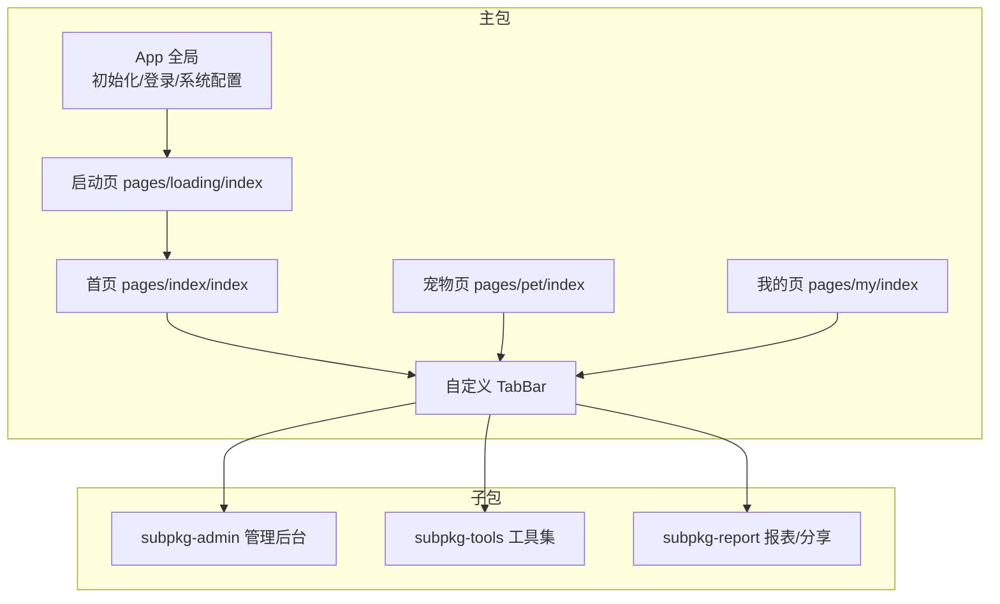
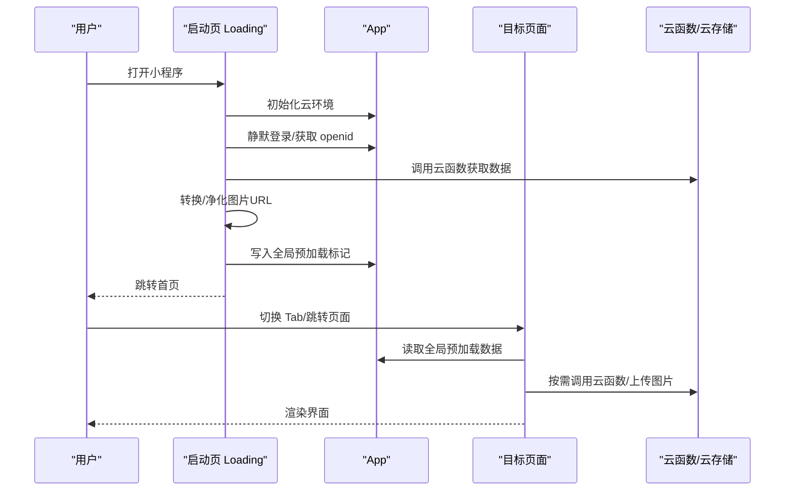
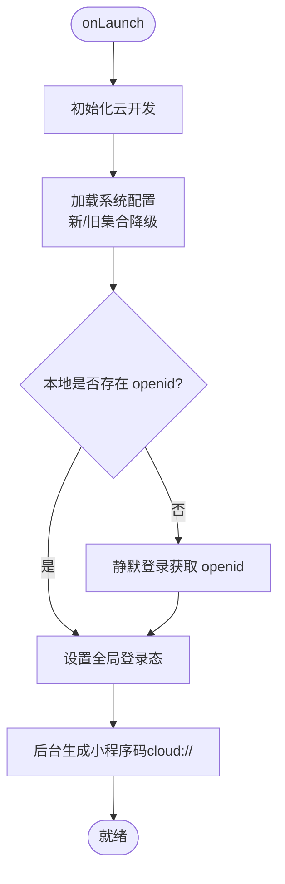
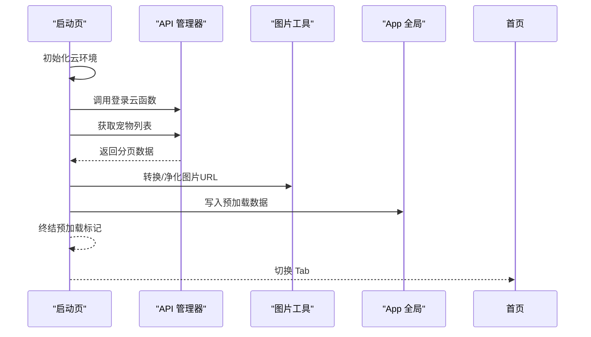
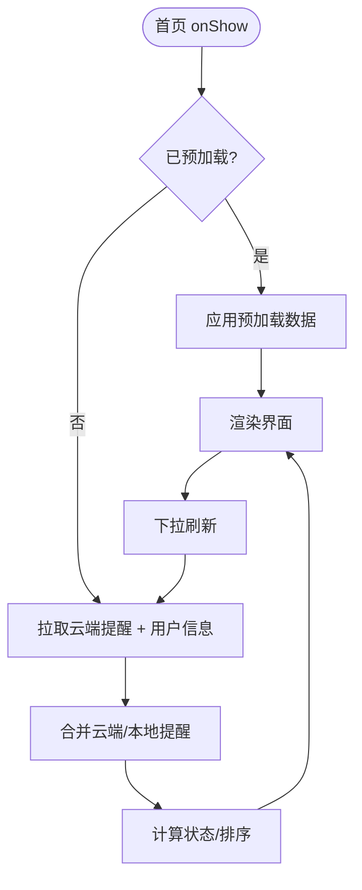
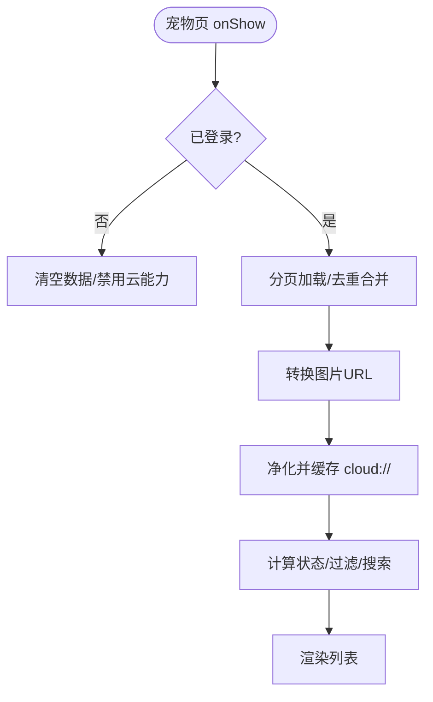
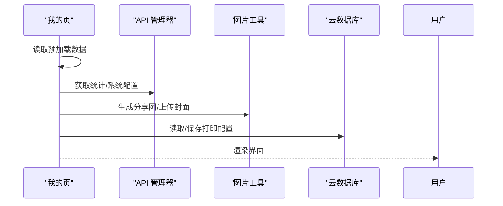
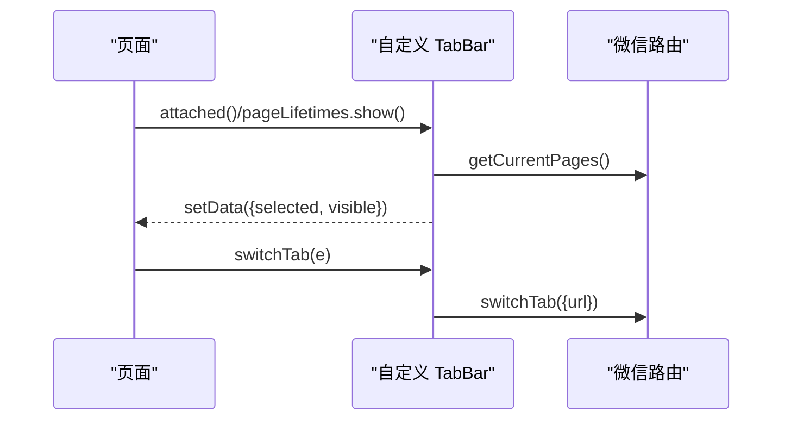
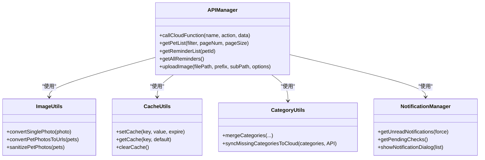
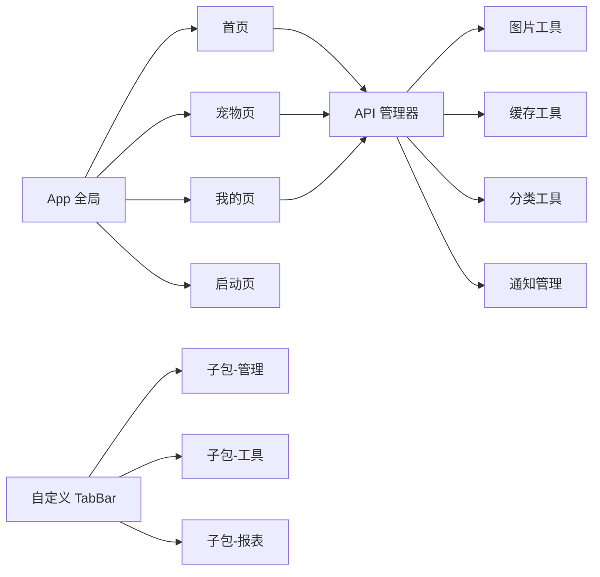

# 前端架构

<cite>
**本文引用的文件**
- [miniprogram/app.js](file://miniprogram/app.js)
- [miniprogram/app.json](file://miniprogram/app.json)
- [miniprogram/pages/loading/index.js](file://miniprogram/pages/loading/index.js)
- [miniprogram/pages/index/index.js](file://miniprogram/pages/index/index.js)
- [miniprogram/pages/pet/index.js](file://miniprogram/pages/pet/index.js)
- [miniprogram/pages/my/index.js](file://miniprogram/pages/my/index.js)
- [miniprogram/custom-tab-bar/index.js](file://miniprogram/custom-tab-bar/index.js)
- [miniprogram/utils/api.js](file://miniprogram/utils/api.js)
- [miniprogram/utils/cache.js](file://miniprogram/utils/cache.js)
- [miniprogram/utils/image.js](file://miniprogram/utils/image.js)
- [miniprogram/utils/category.js](file://miniprogram/utils/category.js)
- [miniprogram/utils/notification.js](file://miniprogram/utils/notification.js)
</cite>

## 目录
1. [引言](#引言)
2. [项目结构](#项目结构)
3. [核心组件](#核心组件)
4. [架构总览](#架构总览)
5. [详细组件分析](#详细组件分析)
6. [依赖关系分析](#依赖关系分析)
7. [性能考量](#性能考量)
8. [故障排查指南](#故障排查指南)
9. [结论](#结论)
10. [附录](#附录)

## 引言
本文件面向“养龟档案”微信小程序前端，系统化梳理其架构设计与实现要点，重点覆盖页面架构、组件化设计、状态管理模式、生命周期与路由机制、数据流设计、全局状态与本地存储策略、云开发集成方式，并给出前端各层职责分工与可视化图示，帮助开发者快速理解与迭代。

## 项目结构
小程序采用分包+主包的组织方式，主包承载基础页面与通用能力，子包按功能域拆分，提升首屏加载效率与维护性。页面清单与分包配置见应用配置文件；自定义 TabBar 作为全局导航补充。

图表来源
- [miniprogram/app.json:1-74](file://miniprogram/app.json#L1-L74)
- [miniprogram/custom-tab-bar/index.js:1-72](file://miniprogram/custom-tab-bar/index.js#L1-L72)

章节来源
- [miniprogram/app.json:1-74](file://miniprogram/app.json#L1-L74)

## 核心组件
- 应用层（App）
  - 负责云开发初始化、系统配置加载、登录态管理、全局数据预加载标记、二维码生成与安全通知检查。
- 页面层（Page）
  - 首页：聚合提醒、统计、用户信息与快捷入口。
  - 宠物页：列表、筛选、搜索、状态计算、新增/编辑、扫码跳转。
  - 我的页：统计、分享卡片、打印配置、系统配置、回收站与最近浏览。
  - 启动页：串行/并行预加载宠物、提醒、统计、二维码等数据，完成全局预加载标记。
- 组件层（Component）
  - 自定义 TabBar：统一导航状态与切换。
- 工具层（Utils）
  - API 管理器：封装云函数调用与图片上传。
  - 缓存管理：带过期策略的本地缓存。
  - 图片处理：临时 URL 与 cloud:// 文件 ID 的互转、净化。
  - 分类合并：多源分类合并与云端补齐。
  - 通知管理：审核通知查询与弹窗展示。
- 云开发集成
  - 云函数调用、云存储上传下载、云数据库读写、二维码生成与下载。

章节来源
- [miniprogram/app.js:1-312](file://miniprogram/app.js#L1-L312)
- [miniprogram/pages/loading/index.js:1-338](file://miniprogram/pages/loading/index.js#L1-L338)
- [miniprogram/pages/index/index.js:1-477](file://miniprogram/pages/index/index.js#L1-L477)
- [miniprogram/pages/pet/index.js:1-800](file://miniprogram/pages/pet/index.js#L1-L800)
- [miniprogram/pages/my/index.js:1-800](file://miniprogram/pages/my/index.js#L1-L800)
- [miniprogram/custom-tab-bar/index.js:1-72](file://miniprogram/custom-tab-bar/index.js#L1-L72)
- [miniprogram/utils/api.js:1-208](file://miniprogram/utils/api.js#L1-L208)
- [miniprogram/utils/cache.js:1-121](file://miniprogram/utils/cache.js#L1-L121)
- [miniprogram/utils/image.js:1-170](file://miniprogram/utils/image.js#L1-L170)
- [miniprogram/utils/category.js:1-65](file://miniprogram/utils/category.js#L1-L65)
- [miniprogram/utils/notification.js:1-146](file://miniprogram/utils/notification.js#L1-L146)

## 架构总览
整体采用“启动页预加载 + 主包页面懒加载 + 子包按需加载”的策略，结合自定义 TabBar 与全局 App 状态，形成清晰的生命周期与数据流闭环。

图表来源
- [miniprogram/pages/loading/index.js:15-43](file://miniprogram/pages/loading/index.js#L15-L43)
- [miniprogram/app.js:1-312](file://miniprogram/app.js#L1-L312)
- [miniprogram/utils/api.js:12-38](file://miniprogram/utils/api.js#L12-L38)

## 详细组件分析

### App 全局状态与生命周期
- 初始化与云开发准备
  - 在启动时初始化云开发环境，随后加载系统配置（支持从新旧集合降级读取）。
- 登录态管理
  - 支持静默登录与强制登录，登录成功后写入本地存储并更新全局状态。
  - 提供登出清理逻辑，重置全局状态并 reLaunch 到首页。
- 预加载与全局数据
  - 通过全局对象挂载预加载数据，供首页、宠物页、我的页在 onShow 中读取。
- 二维码与安全通知
  - 后台静默生成小程序码并缓存；前台进入时检查审核通知与超时审核记录。

图表来源
- [miniprogram/app.js:2-58](file://miniprogram/app.js#L2-L58)
- [miniprogram/app.js:84-140](file://miniprogram/app.js#L84-L140)
- [miniprogram/app.js:143-174](file://miniprogram/app.js#L143-L174)

章节来源
- [miniprogram/app.js:1-312](file://miniprogram/app.js#L1-L312)

### 启动页预加载流程
- 步骤化加载：连接服务 → 获取身份 → 加载宠物列表 → 加载首页数据 → 加载个人中心 → 终结预加载标记 → 跳转首页。
- 预加载数据：宠物列表、分类、提醒、统计、特色宠物、我的统计、二维码等。
- 图片处理：批量转换 cloud:// 为临时 URL，随后净化为纯 fileID 写入缓存。

图表来源
- [miniprogram/pages/loading/index.js:15-43](file://miniprogram/pages/loading/index.js#L15-L43)
- [miniprogram/pages/loading/index.js:196-232](file://miniprogram/pages/loading/index.js#L196-L232)
- [miniprogram/utils/image.js:38-57](file://miniprogram/utils/image.js#L38-L57)

章节来源
- [miniprogram/pages/loading/index.js:1-338](file://miniprogram/pages/loading/index.js#L1-L338)
- [miniprogram/utils/image.js:1-170](file://miniprogram/utils/image.js#L1-L170)

### 首页数据流与提醒聚合
- 预加载读取：首页 onShow 优先读取 App 全局预加载数据，避免二次请求。
- 云端与本地合并：从云函数获取提醒列表，同时合并本地宠物的本地提醒，统一计算状态并排序。
- 下拉刷新：并发刷新提醒、统计与用户信息。
- 提醒标记完成：双阶段更新（云端成功后再本地刷新），保证一致性。

图表来源
- [miniprogram/pages/index/index.js:48-79](file://miniprogram/pages/index/index.js#L48-L79)
- [miniprogram/pages/index/index.js:259-331](file://miniprogram/pages/index/index.js#L259-L331)
- [miniprogram/pages/index/index.js:334-380](file://miniprogram/pages/index/index.js#L334-L380)

章节来源
- [miniprogram/pages/index/index.js:1-477](file://miniprogram/pages/index/index.js#L1-L477)

### 宠物页：列表、筛选、状态计算与扫码
- 骨架屏策略：onHide 提前开启骨架屏，onShow 结束后最小展示时长，避免闪烁。
- 登录态校验：未登录时清空数据并提示登录。
- 分页与去重：合并本地缓存与云端数据，去重后渲染。
- 状态计算：基于记录计算“预警/待配/正常”，并映射为样式类。
- 扫码：兼容多种场景参数，解析 petId 并跳转详情。

图表来源
- [miniprogram/pages/pet/index.js:97-139](file://miniprogram/pages/pet/index.js#L97-L139)
- [miniprogram/pages/pet/index.js:199-338](file://miniprogram/pages/pet/index.js#L199-L338)
- [miniprogram/pages/pet/index.js:400-475](file://miniprogram/pages/pet/index.js#L400-L475)
- [miniprogram/pages/pet/index.js:528-581](file://miniprogram/pages/pet/index.js#L528-L581)

章节来源
- [miniprogram/pages/pet/index.js:1-800](file://miniprogram/pages/pet/index.js#L1-L800)
- [miniprogram/utils/image.js:38-57](file://miniprogram/utils/image.js#L38-L57)

### 我的页：统计、分享卡片与打印配置
- 预加载应用：读取预加载的统计与二维码，减少首屏等待。
- 统计数据：本地快速展示 + 云端静默更新。
- 分享卡片：封面、标签、环境图、种群图等，支持上传云存储并同步云端。
- 打印配置：用户级配置存储于云数据库，支持自动连接与类型开关。
- 系统配置：从云函数读取，失败时回退本地存储。

图表来源
- [miniprogram/pages/my/index.js:115-157](file://miniprogram/pages/my/index.js#L115-L157)
- [miniprogram/pages/my/index.js:330-353](file://miniprogram/pages/my/index.js#L330-L353)
- [miniprogram/pages/my/index.js:490-520](file://miniprogram/pages/my/index.js#L490-L520)
- [miniprogram/pages/my/index.js:177-269](file://miniprogram/pages/my/index.js#L177-L269)

章节来源
- [miniprogram/pages/my/index.js:1-800](file://miniprogram/pages/my/index.js#L1-L800)

### 自定义 TabBar 组件
- 自动识别当前路由并高亮对应 Tab。
- 切换 Tab 时更新选中状态，避免重复跳转。
- 生命周期内兜底刷新可见性，保证体验一致。

图表来源
- [miniprogram/custom-tab-bar/index.js:14-69](file://miniprogram/custom-tab-bar/index.js#L14-L69)

章节来源
- [miniprogram/custom-tab-bar/index.js:1-72](file://miniprogram/custom-tab-bar/index.js#L1-L72)

### API 管理器与云开发集成
- 统一封装云函数调用，统一处理成功/失败与降级策略。
- 图片上传：上传至云存储后异步触发安全审核。
- 提醒/记录/足迹/宠物等模块化接口，便于页面按需调用。

图表来源
- [miniprogram/utils/api.js:4-191](file://miniprogram/utils/api.js#L4-L191)
- [miniprogram/utils/image.js:87-169](file://miniprogram/utils/image.js#L87-L169)
- [miniprogram/utils/cache.js:11-121](file://miniprogram/utils/cache.js#L11-L121)
- [miniprogram/utils/category.js:4-65](file://miniprogram/utils/category.js#L4-L65)
- [miniprogram/utils/notification.js:13-146](file://miniprogram/utils/notification.js#L13-L146)

章节来源
- [miniprogram/utils/api.js:1-208](file://miniprogram/utils/api.js#L1-L208)
- [miniprogram/utils/image.js:1-170](file://miniprogram/utils/image.js#L1-L170)
- [miniprogram/utils/cache.js:1-121](file://miniprogram/utils/cache.js#L1-L121)
- [miniprogram/utils/category.js:1-65](file://miniprogram/utils/category.js#L1-L65)
- [miniprogram/utils/notification.js:1-146](file://miniprogram/utils/notification.js#L1-L146)

## 依赖关系分析
- 页面对 App 全局状态的依赖：通过 getApp() 读取全局登录态、预加载数据与系统配置。
- 页面对 API 管理器的依赖：统一调用云函数与图片上传。
- 页面对工具模块的依赖：图片转换/净化、分类合并、缓存、通知。
- 子包与 TabBar：通过自定义 TabBar 统一切换，子包页面按需加载。

图表来源
- [miniprogram/app.js:292-310](file://miniprogram/app.js#L292-L310)
- [miniprogram/pages/index/index.js:1-6](file://miniprogram/pages/index/index.js#L1-L6)
- [miniprogram/pages/pet/index.js:1-8](file://miniprogram/pages/pet/index.js#L1-L8)
- [miniprogram/pages/my/index.js:3-12](file://miniprogram/pages/my/index.js#L3-L12)
- [miniprogram/custom-tab-bar/index.js:1-72](file://miniprogram/custom-tab-bar/index.js#L1-L72)

章节来源
- [miniprogram/app.js:1-312](file://miniprogram/app.js#L1-L312)
- [miniprogram/pages/index/index.js:1-6](file://miniprogram/pages/index/index.js#L1-L6)
- [miniprogram/pages/pet/index.js:1-8](file://miniprogram/pages/pet/index.js#L1-L8)
- [miniprogram/pages/my/index.js:1-12](file://miniprogram/pages/my/index.js#L1-L12)
- [miniprogram/custom-tab-bar/index.js:1-72](file://miniprogram/custom-tab-bar/index.js#L1-L72)

## 性能考量
- 预加载与骨架屏
  - 启动页集中预加载关键数据，页面 onShow 时直接应用，显著缩短首屏时间。
  - 骨架屏最小展示时长策略，避免频繁闪烁。
- 并发与去重
  - 首页下拉刷新采用并发策略，减少等待时间。
  - 宠物页分页加载时去重合并，避免重复渲染。
- 图片优化
  - 云端图片统一转换为临时 URL，随后净化为 cloud:// fileID，避免过期与缓存污染。
- 登录态与云可用性
  - 未登录时页面快速清空，避免无效请求；云函数失败时自动降级使用本地数据。

## 故障排查指南
- 登录失败
  - 检查静默登录云函数返回与本地存储写入；必要时触发强制登录。
- 二维码问题
  - 检查缓存版本与生成逻辑；若缓存无效，重新调用云函数生成并下载。
- 图片显示异常
  - 检查临时 URL 是否过期，触发刷新；若仍失败，清理头像并回退默认占位。
- 通知与审核
  - 使用通知管理器检查未读通知与待审核记录，按需弹窗或 Toast 提示。
- 缓存清理
  - 提供一键清理缓存入口，避免过期缓存影响体验。

章节来源
- [miniprogram/app.js:176-225](file://miniprogram/app.js#L176-L225)
- [miniprogram/pages/index/index.js:119-155](file://miniprogram/pages/index/index.js#L119-L155)
- [miniprogram/utils/notification.js:41-130](file://miniprogram/utils/notification.js#L41-L130)
- [miniprogram/pages/my/index.js:632-643](file://miniprogram/pages/my/index.js#L632-L643)

## 结论
该前端架构以“启动页预加载 + 页面懒加载 + 子包按需加载”为核心，结合自定义 TabBar 与全局 App 状态，形成稳定的数据流与生命周期闭环。通过 API 管理器统一云开发接入、图片工具与缓存策略保障性能与可靠性，满足多页面、多数据源的复杂业务需求。

## 附录
- 关键流程图与类图已在文中相应章节呈现，建议结合代码路径定位具体实现细节。
- 如需进一步细化某一页面或工具模块，可参考对应文件的章节来源定位。