# 数据流设计

<cite>
**本文引用的文件**
- [miniprogram/app.js](file://miniprogram/app.js)
- [miniprogram/utils/api.js](file://miniprogram/utils/api.js)
- [miniprogram/utils/cache.js](file://miniprogram/utils/cache.js)
- [miniprogram/utils/image.js](file://miniprogram/utils/image.js)
- [miniprogram/utils/printer.js](file://miniprogram/utils/printer.js)
- [miniprogram/utils/voice.js](file://miniprogram/utils/voice.js)
- [miniprogram/utils/error.js](file://miniprogram/utils/error.js)
- [miniprogram/utils/securityChecker.js](file://miniprogram/utils/securityChecker.js)
- [miniprogram/pages/pet/index.js](file://miniprogram/pages/pet/index.js)
- [miniprogram/pages/pet/detail.js](file://miniprogram/pages/pet/detail.js)
- [cloudfunctions/admin/index.js](file://cloudfunctions/admin/index.js)
- [cloudfunctions/pet/index.js](file://cloudfunctions/pet/index.js)
- [cloudfunctions/html2image/index.js](file://cloudfunctions/html2image/index.js)
- [cloudfunctions/speech/index.js](file://cloudfunctions/speech/index.js)
</cite>

## 目录
1. [引言](#引言)
2. [项目结构](#项目结构)
3. [核心组件](#核心组件)
4. [架构总览](#架构总览)
5. [详细组件分析](#详细组件分析)
6. [依赖关系分析](#依赖关系分析)
7. [性能考量](#性能考量)
8. [故障排查指南](#故障排查指南)
9. [结论](#结论)

## 引言
本文件面向“养龟档案”项目的前端数据流设计，系统性梳理从前端页面到云函数、再到云存储与第三方服务的完整数据通路。重点覆盖：
- 前端数据获取、处理与展示的全链路
- API 调用封装、数据转换与错误处理机制
- 云开发数据同步策略、本地数据缓存与实时更新
- 图片、打印、语音三类特殊数据流的处理方式
- 数据流图与 API 调用链路图，帮助开发者快速定位问题与优化性能

## 项目结构
项目采用“小程序前端 + 云开发 + 云函数 + 第三方服务”的分层架构：
- 小程序前端：页面与工具模块负责数据请求、缓存、展示与交互
- 云开发：云数据库、云存储、云函数构成后端能力
- 云函数：按领域拆分（pet、record、reminder、admin、speech、html2image 等）
- 第三方服务：语音识别（腾讯云 ASR）、图片生成（自建服务或 COS）

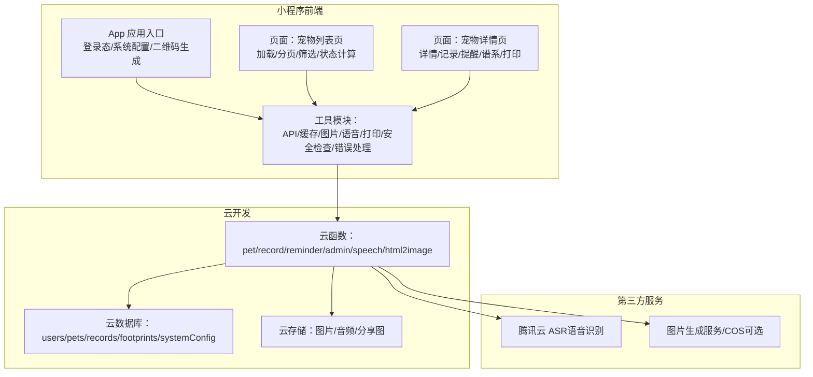

图表来源
- [miniprogram/app.js:1-312](file://miniprogram/app.js#L1-L312)
- [miniprogram/pages/pet/index.js:1-800](file://miniprogram/pages/pet/index.js#L1-L800)
- [miniprogram/pages/pet/detail.js:1-800](file://miniprogram/pages/pet/detail.js#L1-L800)
- [cloudfunctions/pet/index.js:1-723](file://cloudfunctions/pet/index.js#L1-L723)
- [cloudfunctions/admin/index.js:1-533](file://cloudfunctions/admin/index.js#L1-L533)
- [cloudfunctions/speech/index.js:1-144](file://cloudfunctions/speech/index.js#L1-L144)
- [cloudfunctions/html2image/index.js:1-205](file://cloudfunctions/html2image/index.js#L1-L205)

章节来源
- [miniprogram/app.js:1-312](file://miniprogram/app.js#L1-L312)
- [miniprogram/pages/pet/index.js:1-800](file://miniprogram/pages/pet/index.js#L1-L800)
- [miniprogram/pages/pet/detail.js:1-800](file://miniprogram/pages/pet/detail.js#L1-L800)
- [cloudfunctions/pet/index.js:1-723](file://cloudfunctions/pet/index.js#L1-L723)
- [cloudfunctions/admin/index.js:1-533](file://cloudfunctions/admin/index.js#L1-L533)
- [cloudfunctions/speech/index.js:1-144](file://cloudfunctions/speech/index.js#L1-L144)
- [cloudfunctions/html2image/index.js:1-205](file://cloudfunctions/html2image/index.js#L1-L205)

## 核心组件
- 应用入口与全局状态
  - 初始化云开发、加载系统配置、登录态管理、二维码生成、安全通知检查
- API 管理器
  - 统一封装云函数调用、错误处理、图片上传与安全审核
- 缓存管理
  - 前端本地缓存（pets、categories、records 等），支持过期清理
- 图片处理
  - 云存储 URL 转换、临时链接获取、fileID 净化、批量处理
- 语音输入
  - 录音、上传、调用语音识别云函数、结果回填
- 打印机管理
  - 蓝牙扫描/连接、自动连接、标签打印任务
- 错误与安全
  - 统一错误提示、安全审核（图片/文本）调用

章节来源
- [miniprogram/app.js:1-312](file://miniprogram/app.js#L1-L312)
- [miniprogram/utils/api.js:1-208](file://miniprogram/utils/api.js#L1-L208)
- [miniprogram/utils/cache.js:1-121](file://miniprogram/utils/cache.js#L1-L121)
- [miniprogram/utils/image.js:1-170](file://miniprogram/utils/image.js#L1-L170)
- [miniprogram/utils/voice.js:1-195](file://miniprogram/utils/voice.js#L1-L195)
- [miniprogram/utils/printer.js:1-314](file://miniprogram/utils/printer.js#L1-L314)
- [miniprogram/utils/error.js:1-92](file://miniprogram/utils/error.js#L1-L92)
- [miniprogram/utils/securityChecker.js:1-122](file://miniprogram/utils/securityChecker.js#L1-L122)

## 架构总览
前端通过 API 管理器发起云函数调用，云函数访问云数据库与云存储，并在必要时调用第三方服务（语音识别、图片生成）。前端在本地维护缓存与骨架屏体验，实现离线可用与快速回退。

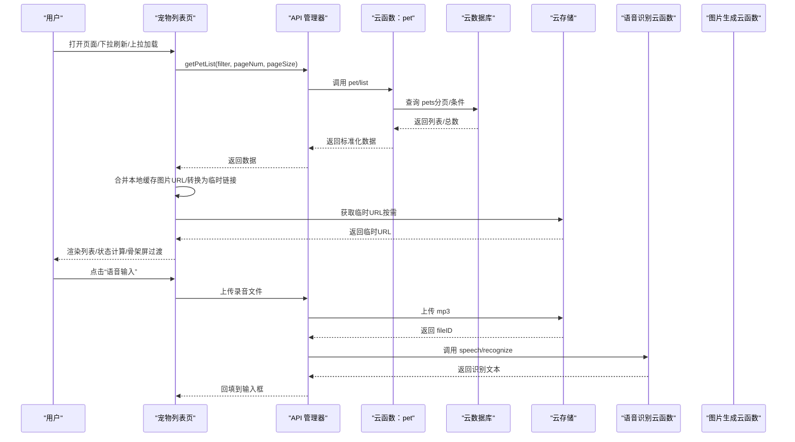

图表来源
- [miniprogram/pages/pet/index.js:199-338](file://miniprogram/pages/pet/index.js#L199-L338)
- [miniprogram/utils/api.js:12-61](file://miniprogram/utils/api.js#L12-L61)
- [cloudfunctions/pet/index.js:140-180](file://cloudfunctions/pet/index.js#L140-L180)
- [cloudfunctions/speech/index.js:94-143](file://cloudfunctions/speech/index.js#L94-L143)
- [cloudfunctions/html2image/index.js:66-140](file://cloudfunctions/html2image/index.js#L66-L140)

## 详细组件分析

### 1) 前端数据获取与展示（宠物列表/详情）
- 列表页
  - 登录态检查与骨架屏控制，分页加载与去重合并
  - 本地缓存优先策略：若云端失败，回退本地 pets
  - 图片 URL 转换：将 cloud:// 转为临时链接，保证可展示
  - 动态状态计算：结合记录统计，标注“待配/预警/正常”等状态
- 详情页
  - 公开模式与扫码模式的差异化加载
  - 图片错误处理：单图加载失败时刷新或清空，谱系图统一刷新首图
  - 分类同步：云端/本地/已用分类合并，缺失分类同步至云端

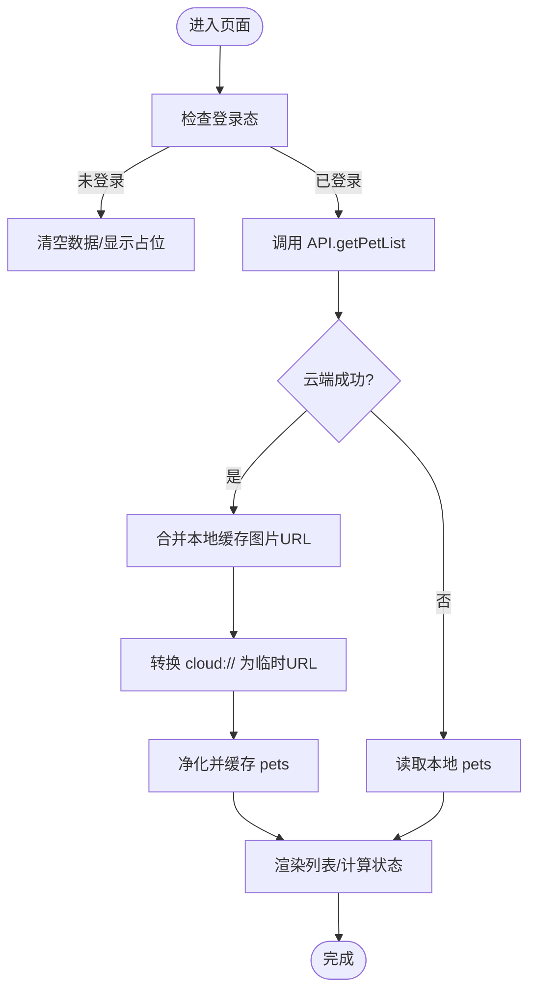

图表来源
- [miniprogram/pages/pet/index.js:199-338](file://miniprogram/pages/pet/index.js#L199-L338)
- [miniprogram/utils/image.js:38-108](file://miniprogram/utils/image.js#L38-L108)
- [miniprogram/utils/cache.js:11-85](file://miniprogram/utils/cache.js#L11-L85)

章节来源
- [miniprogram/pages/pet/index.js:199-338](file://miniprogram/pages/pet/index.js#L199-L338)
- [miniprogram/pages/pet/detail.js:420-514](file://miniprogram/pages/pet/detail.js#L420-L514)
- [miniprogram/utils/image.js:38-108](file://miniprogram/utils/image.js#L38-L108)
- [miniprogram/utils/cache.js:11-85](file://miniprogram/utils/cache.js#L11-L85)

### 2) API 调用封装与错误处理
- 统一调用云函数，解析 result.success，失败时返回 message 并标记 useFallback
- 宠物/记录/提醒/足迹/登录等 API 方法集中管理
- 图片上传：上传到云存储后异步触发安全审核，不阻塞主流程
- 云函数调用失败时，前端走本地回退策略，保证可用性

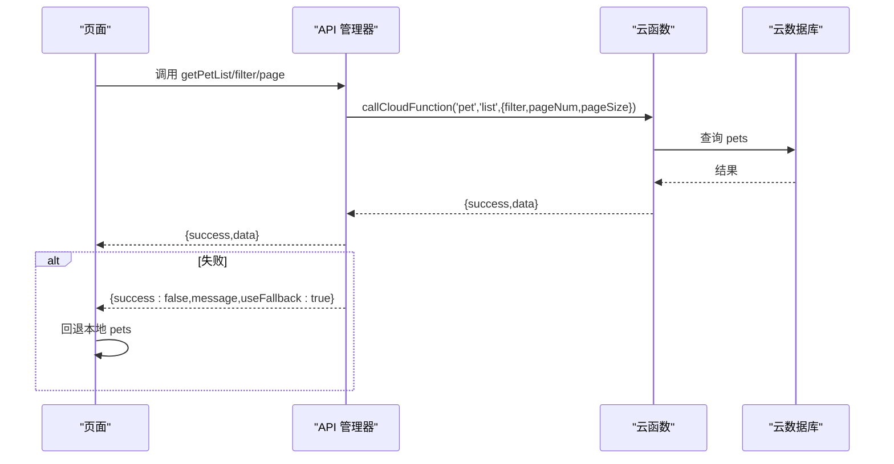

图表来源
- [miniprogram/utils/api.js:12-61](file://miniprogram/utils/api.js#L12-L61)
- [cloudfunctions/pet/index.js:140-180](file://cloudfunctions/pet/index.js#L140-L180)

章节来源
- [miniprogram/utils/api.js:12-61](file://miniprogram/utils/api.js#L12-L61)
- [miniprogram/utils/error.js:8-20](file://miniprogram/utils/error.js#L8-L20)

### 3) 云开发数据同步策略
- 宠物列表：云端返回分页数据，合并本地缓存中的有效图片 URL，转换为临时链接后渲染
- 分类同步：云端/本地/已用分类合并，缺失分类同步到云端，保持一致性
- 系统配置：启动时从 systemConfig 读取，兼容旧集合 system，降级兜底

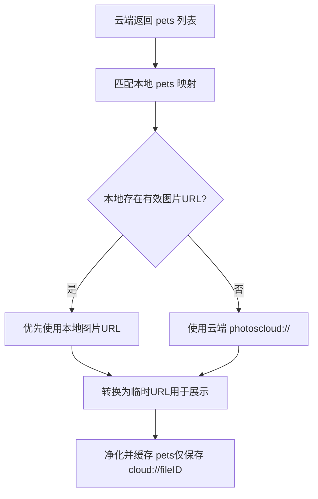

图表来源
- [miniprogram/pages/pet/index.js:252-303](file://miniprogram/pages/pet/index.js#L252-L303)
- [miniprogram/utils/image.js:133-144](file://miniprogram/utils/image.js#L133-L144)

章节来源
- [miniprogram/pages/pet/index.js:252-303](file://miniprogram/pages/pet/index.js#L252-L303)
- [miniprogram/utils/image.js:133-144](file://miniprogram/utils/image.js#L133-L144)
- [miniprogram/app.js:17-58](file://miniprogram/app.js#L17-L58)

### 4) 本地数据缓存与实时更新
- 缓存键前缀与过期时间管理，支持清理过期缓存与重试
- 宠物列表缓存：仅保存 cloud://fileID，避免过期临时链接
- 分类缓存：本地/云端/已用分类合并，写入全局预加载数据
- 预加载：首页加载完成后，后台静默同步，前台直接使用预加载数据

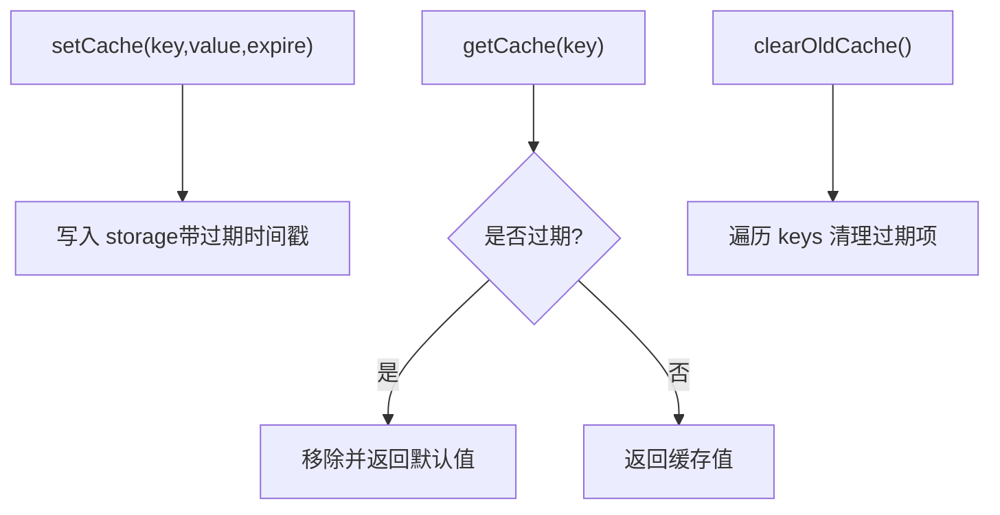

图表来源
- [miniprogram/utils/cache.js:11-85](file://miniprogram/utils/cache.js#L11-L85)

章节来源
- [miniprogram/utils/cache.js:11-85](file://miniprogram/utils/cache.js#L11-L85)
- [miniprogram/pages/pet/index.js:111-127](file://miniprogram/pages/pet/index.js#L111-L127)

### 5) 图片数据流
- 云存储 URL 净化：将临时链接转换为 cloud://fileID，确保缓存稳定
- 临时链接获取：按需调用 getTempFileURL，失败时保留原 fileID
- 上传流程：前端上传 mp3/png 等文件，云函数触发安全审核或图片生成

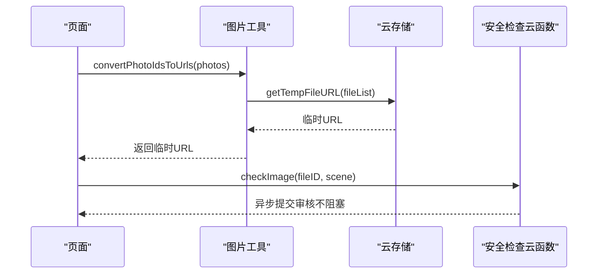

图表来源
- [miniprogram/utils/image.js:38-108](file://miniprogram/utils/image.js#L38-L108)
- [miniprogram/utils/securityChecker.js:50-59](file://miniprogram/utils/securityChecker.js#L50-L59)

章节来源
- [miniprogram/utils/image.js:38-108](file://miniprogram/utils/image.js#L38-L108)
- [miniprogram/utils/securityChecker.js:50-59](file://miniprogram/utils/securityChecker.js#L50-L59)

### 6) 打印数据流
- 蓝牙扫描/连接：自动连接失败次数限制，断开连接确认
- 打印任务：根据配置决定是否打印二维码，智能截断文本，提交打印任务
- 资源清理：页面隐藏/卸载时停止扫描，关闭打印机

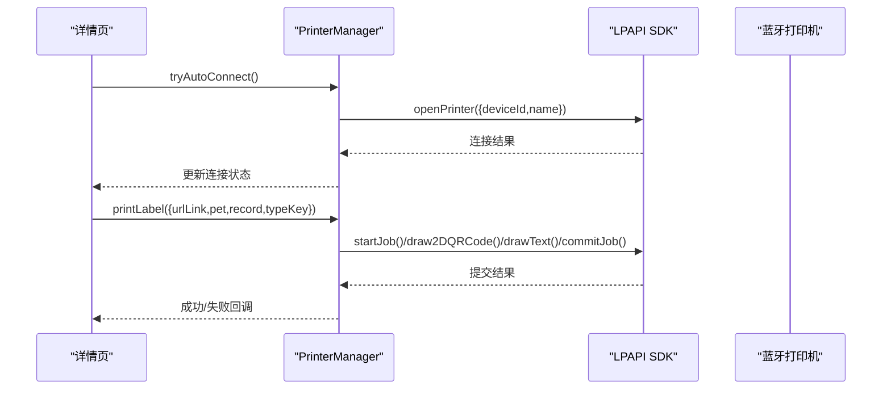

图表来源
- [miniprogram/utils/printer.js:172-287](file://miniprogram/utils/printer.js#L172-L287)

章节来源
- [miniprogram/utils/printer.js:172-287](file://miniprogram/utils/printer.js#L172-L287)

### 7) 语音数据流
- 录音：15 秒限制，停止时触发识别
- 上传与识别：mp3 上传到云存储，调用 speech 云函数进行语音识别
- 结果回填：识别成功后回填到对应输入框

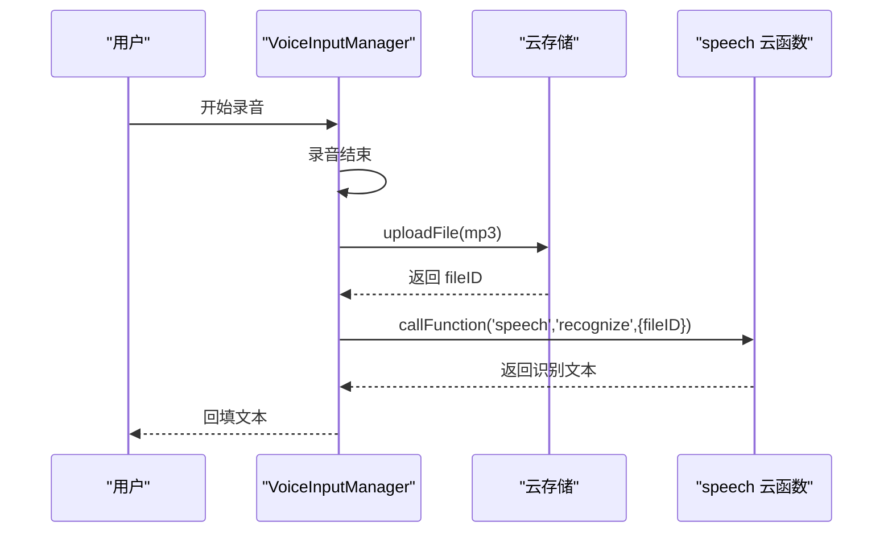

图表来源
- [miniprogram/utils/voice.js:149-178](file://miniprogram/utils/voice.js#L149-L178)
- [cloudfunctions/speech/index.js:94-143](file://cloudfunctions/speech/index.js#L94-L143)

章节来源
- [miniprogram/utils/voice.js:149-178](file://miniprogram/utils/voice.js#L149-L178)
- [cloudfunctions/speech/index.js:94-143](file://cloudfunctions/speech/index.js#L94-L143)

### 8) 管理员与系统配置
- 管理员权限：从数据库 admins 集合读取，支持兜底配置
- 系统配置：优先从 systemConfig 读取，兼容旧集合；提供统计、用户/宠物/足迹查询、配置更新等接口

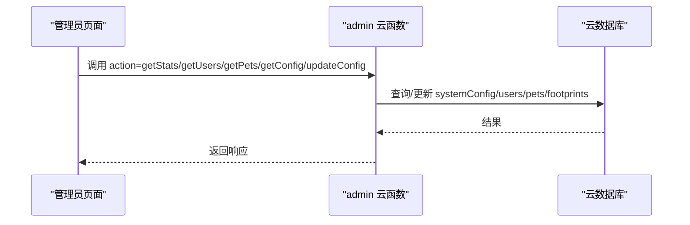

图表来源
- [cloudfunctions/admin/index.js:27-71](file://cloudfunctions/admin/index.js#L27-L71)
- [cloudfunctions/admin/index.js:434-473](file://cloudfunctions/admin/index.js#L434-L473)

章节来源
- [cloudfunctions/admin/index.js:27-71](file://cloudfunctions/admin/index.js#L27-L71)
- [cloudfunctions/admin/index.js:434-473](file://cloudfunctions/admin/index.js#L434-L473)

## 依赖关系分析
- 页面依赖工具模块：API、缓存、图片、语音、打印、安全检查、错误处理
- API 管理器依赖云函数与云存储
- 云函数依赖云数据库与第三方服务（ASR、图片生成）
- 安全检查与语音识别云函数依赖系统配置

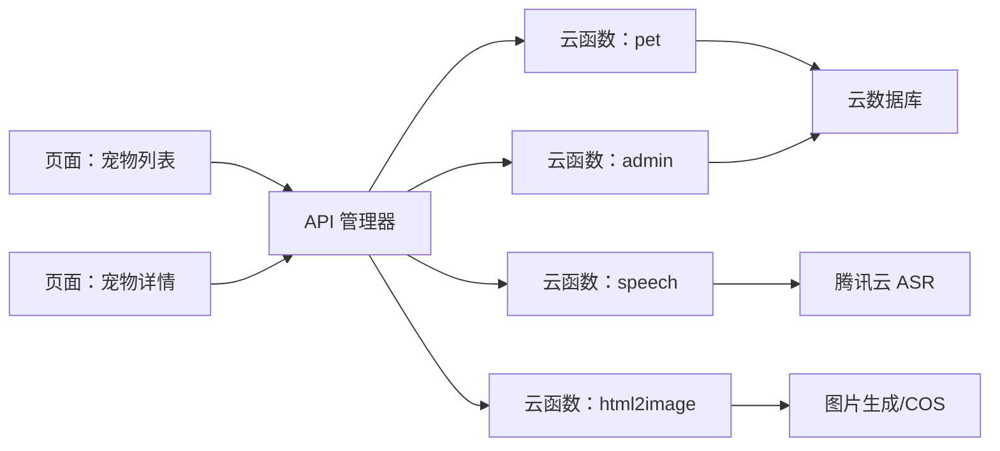

图表来源
- [miniprogram/pages/pet/index.js:1-800](file://miniprogram/pages/pet/index.js#L1-L800)
- [miniprogram/pages/pet/detail.js:1-800](file://miniprogram/pages/pet/detail.js#L1-L800)
- [miniprogram/utils/api.js:1-208](file://miniprogram/utils/api.js#L1-L208)
- [cloudfunctions/pet/index.js:1-723](file://cloudfunctions/pet/index.js#L1-L723)
- [cloudfunctions/admin/index.js:1-533](file://cloudfunctions/admin/index.js#L1-L533)
- [cloudfunctions/speech/index.js:1-144](file://cloudfunctions/speech/index.js#L1-L144)
- [cloudfunctions/html2image/index.js:1-205](file://cloudfunctions/html2image/index.js#L1-L205)

章节来源
- [miniprogram/pages/pet/index.js:1-800](file://miniprogram/pages/pet/index.js#L1-L800)
- [miniprogram/pages/pet/detail.js:1-800](file://miniprogram/pages/pet/detail.js#L1-L800)
- [miniprogram/utils/api.js:1-208](file://miniprogram/utils/api.js#L1-L208)
- [cloudfunctions/pet/index.js:1-723](file://cloudfunctions/pet/index.js#L1-L723)
- [cloudfunctions/admin/index.js:1-533](file://cloudfunctions/admin/index.js#L1-L533)
- [cloudfunctions/speech/index.js:1-144](file://cloudfunctions/speech/index.js#L1-L144)
- [cloudfunctions/html2image/index.js:1-205](file://cloudfunctions/html2image/index.js#L1-L205)

## 性能考量
- 骨架屏与最小展示时长：确保用户感知流畅，避免闪烁
- 并发请求保护：序列号控制，丢弃过期请求结果
- 本地回退：云端失败时快速使用本地缓存，提升可用性
- 图片转换按需：仅在渲染前转换 cloud:// 为临时链接，减少不必要的请求
- 打印任务：异步提交，避免阻塞 UI

## 故障排查指南
- 登录态问题
  - 检查 App 初始化与本地 openid 存储，必要时强制登录
- 云端调用失败
  - 查看 API 返回的 message，确认 useFallback 标志，回退本地数据
- 图片加载失败
  - 检查 fileID 是否为 cloud://，尝试重新获取临时链接；失败时清空或替换
- 语音识别失败
  - 确认上传成功与 fileID 有效，检查 speech 云函数配置与鉴权
- 打印机连接失败
  - 检查蓝牙适配器初始化、自动连接次数限制、设备信息正确性

章节来源
- [miniprogram/app.js:84-140](file://miniprogram/app.js#L84-L140)
- [miniprogram/utils/api.js:27-38](file://miniprogram/utils/api.js#L27-L38)
- [miniprogram/utils/image.js:64-80](file://miniprogram/utils/image.js#L64-L80)
- [miniprogram/utils/voice.js:149-178](file://miniprogram/utils/voice.js#L149-L178)
- [miniprogram/utils/printer.js:184-194](file://miniprogram/utils/printer.js#L184-L194)

## 结论
本项目通过“前端 API 封装 + 云函数 + 云数据库/存储 + 第三方服务”的组合，实现了稳定、可扩展的数据流。前端以缓存与骨架屏提升体验，云端以分页与权限控制保障性能与安全。图片、语音、打印三大特殊数据流均采用异步与回退策略，确保在弱网或异常情况下仍能提供基本功能。