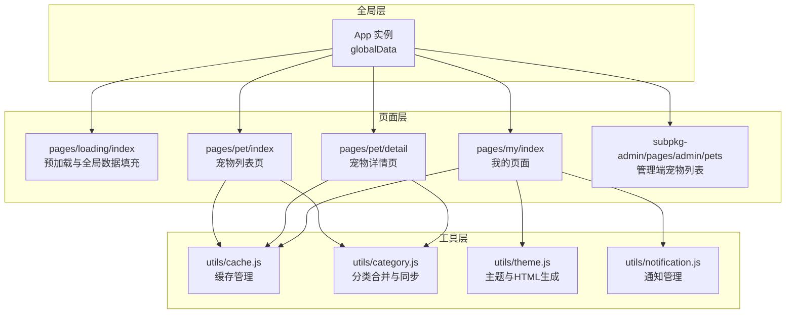
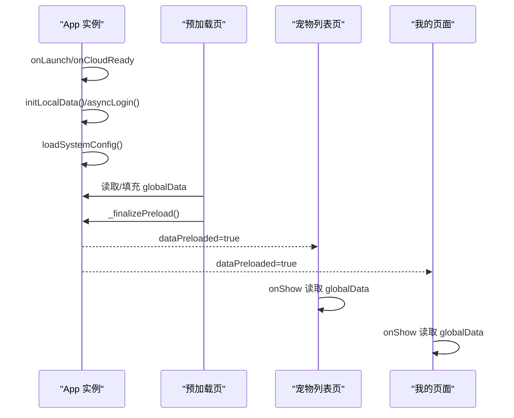
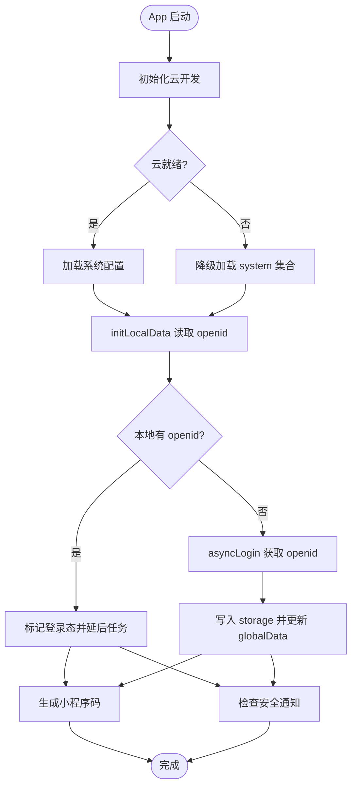
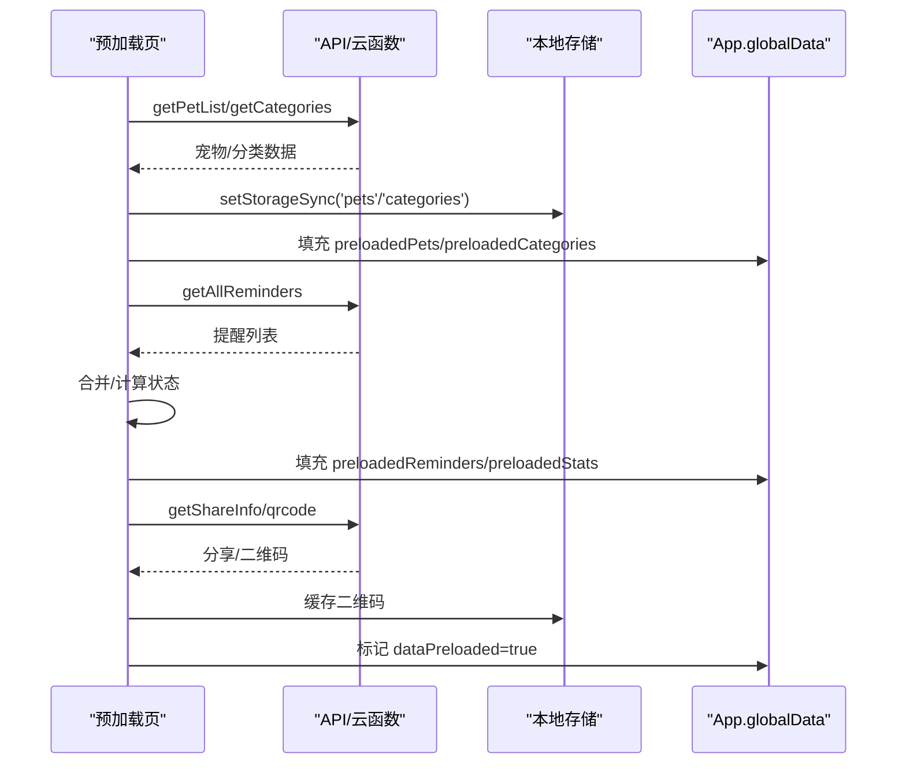
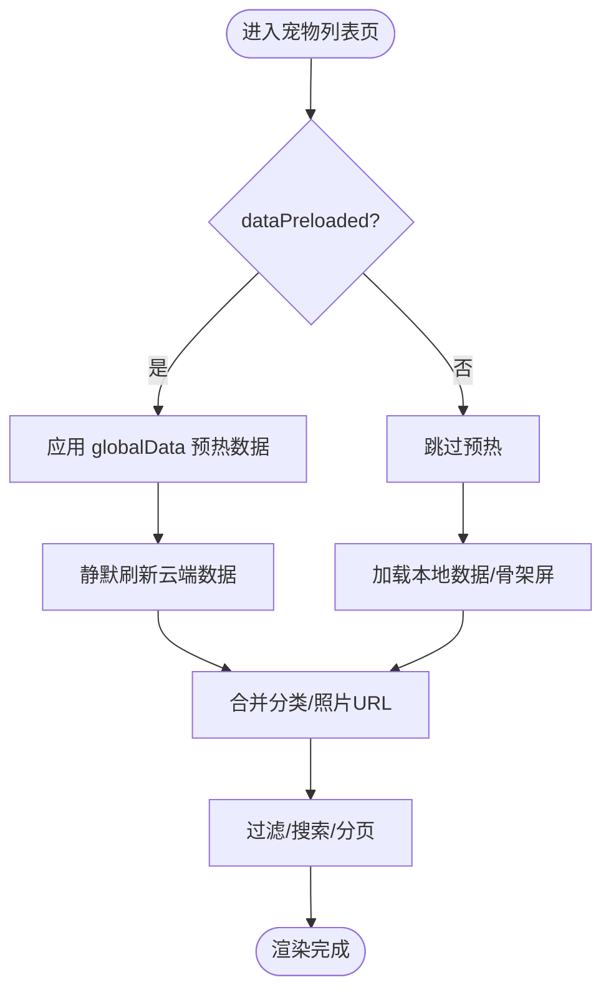
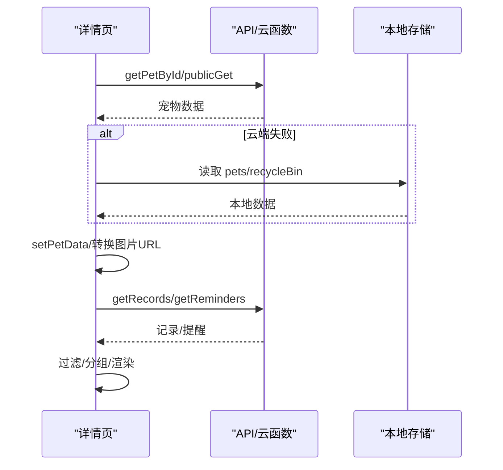
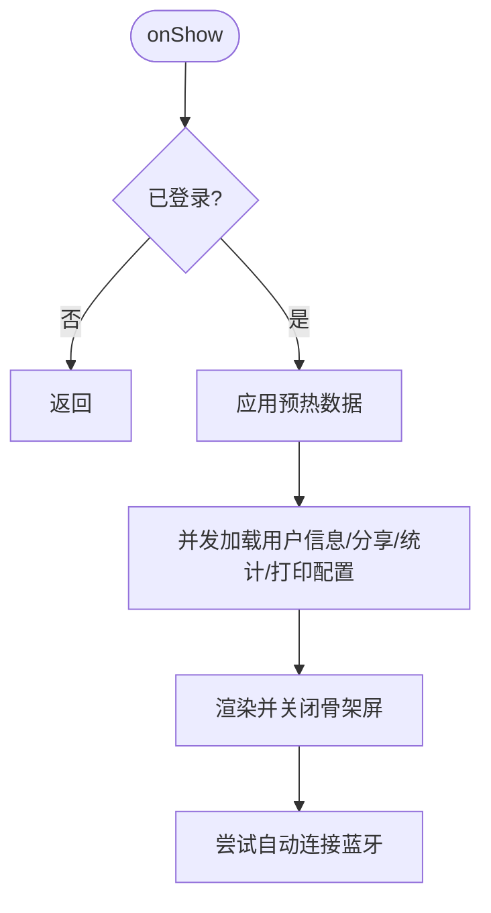
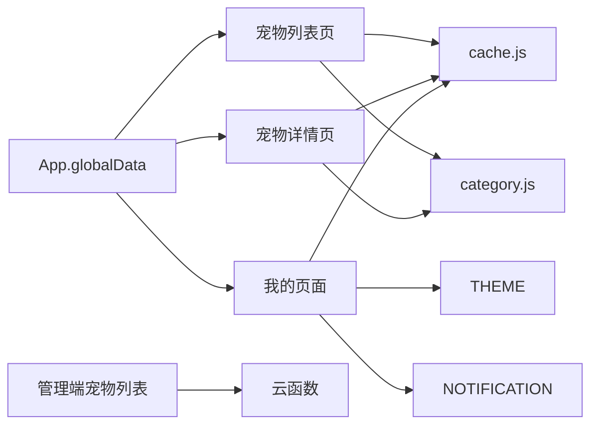

# 状态管理

<cite>
**本文引用的文件**
- [miniprogram/app.js](file://miniprogram/app.js)
- [miniprogram/pages/loading/index.js](file://miniprogram/pages/loading/index.js)
- [miniprogram/pages/pet/index.js](file://miniprogram/pages/pet/index.js)
- [miniprogram/pages/pet/detail.js](file://miniprogram/pages/pet/detail.js)
- [miniprogram/pages/my/index.js](file://miniprogram/pages/my/index.js)
- [miniprogram/utils/cache.js](file://miniprogram/utils/cache.js)
- [miniprogram/utils/category.js](file://miniprogram/utils/category.js)
- [miniprogram/utils/theme.js](file://miniprogram/utils/theme.js)
- [miniprogram/utils/notification.js](file://miniprogram/utils/notification.js)
- [miniprogram/subpkg-admin/pages/admin/pets.js](file://miniprogram/subpkg-admin/pages/admin/pets.js)
</cite>

## 目录
1. [引言](#引言)
2. [项目结构](#项目结构)
3. [核心组件](#核心组件)
4. [架构总览](#架构总览)
5. [详细组件分析](#详细组件分析)
6. [依赖分析](#依赖分析)
7. [性能考虑](#性能考虑)
8. [故障排除指南](#故障排除指南)
9. [结论](#结论)
10. [附录](#附录)

## 引言
本文件面向“养龟档案”小程序，系统化梳理其状态管理模式，涵盖全局状态、页面状态、组件状态，以及数据持久化、缓存管理、主题与分类状态、状态同步与监听机制。文档同时提供状态流转与数据流向图，帮助开发者与产品人员理解状态在不同层级间的传递与更新。

## 项目结构
小程序采用分包与页面级状态管理相结合的组织方式：
- 全局状态集中在 App 实例的 globalData 中，包含用户登录态、系统配置、预加载数据等。
- 页面级状态通过 Page.data 管理，结合本地存储（storage）实现轻量持久化。
- 工具模块负责缓存、分类、主题、通知等横切能力，供页面按需注入。

图表来源
- [miniprogram/app.js:292-310](file://miniprogram/app.js#L292-L310)
- [miniprogram/pages/loading/index.js:1-450](file://miniprogram/pages/loading/index.js#L1-L450)
- [miniprogram/pages/pet/index.js:1-800](file://miniprogram/pages/pet/index.js#L1-L800)
- [miniprogram/pages/pet/detail.js:1-800](file://miniprogram/pages/pet/detail.js#L1-L800)
- [miniprogram/pages/my/index.js:1-800](file://miniprogram/pages/my/index.js#L1-L800)
- [miniprogram/utils/cache.js:1-121](file://miniprogram/utils/cache.js#L1-L121)
- [miniprogram/utils/category.js:1-65](file://miniprogram/utils/category.js#L1-L65)
- [miniprogram/utils/theme.js:1-200](file://miniprogram/utils/theme.js#L1-L200)
- [miniprogram/utils/notification.js:1-146](file://miniprogram/utils/notification.js#L1-L146)
- [miniprogram/subpkg-admin/pages/admin/pets.js:1-96](file://miniprogram/subpkg-admin/pages/admin/pets.js#L1-L96)

章节来源
- [miniprogram/app.js:1-312](file://miniprogram/app.js#L1-L312)
- [miniprogram/pages/loading/index.js:1-450](file://miniprogram/pages/loading/index.js#L1-L450)

## 核心组件
- 全局状态管理（App）
  - 登录态与用户信息：openid、userInfo、isLoggedIn。
  - 系统配置：systemConfig。
  - 预加载数据：预加载宠物、分类、提醒、统计、精选宠物、我的统计、二维码等。
  - 生命周期钩子：onLaunch、onCloudReady、onShow、onHide。
- 页面状态管理（Page.data）
  - 宠物列表页：过滤条件、分页、骨架屏、登录态、分类集合等。
  - 宠物详情页：当前宠物、记录、谱系、提醒、编辑表单、打印配置等。
  - 我的页面：统计数据、分享卡片、打印配置、管理员权限等。
- 工具模块
  - 缓存：带过期时间的本地缓存封装，支持清理过期与批量清理。
  - 分类：合并多源分类、向云端补同步缺失分类。
  - 主题：主题配置与HTML生成（用于分享图等）。
  - 通知：安全审核通知的查询、节流、弹窗展示与超时提示。

章节来源
- [miniprogram/app.js:292-310](file://miniprogram/app.js#L292-L310)
- [miniprogram/pages/pet/index.js:10-120](file://miniprogram/pages/pet/index.js#L10-L120)
- [miniprogram/pages/pet/detail.js:11-152](file://miniprogram/pages/pet/detail.js#L11-L152)
- [miniprogram/pages/my/index.js:14-95](file://miniprogram/pages/my/index.js#L14-L95)
- [miniprogram/utils/cache.js:1-121](file://miniprogram/utils/cache.js#L1-L121)
- [miniprogram/utils/category.js:1-65](file://miniprogram/utils/category.js#L1-L65)
- [miniprogram/utils/theme.js:135-160](file://miniprogram/utils/theme.js#L135-L160)
- [miniprogram/utils/notification.js:13-141](file://miniprogram/utils/notification.js#L13-L141)

## 架构总览
全局状态通过 App 在启动阶段初始化，并在预加载页集中填充至 globalData，随后各页面按需读取与局部更新。页面间通过 setData 与 storage 协作，实现状态同步与持久化。

图表来源
- [miniprogram/app.js:2-58](file://miniprogram/app.js#L2-L58)
- [miniprogram/pages/loading/index.js:45-74](file://miniprogram/pages/loading/index.js#L45-L74)
- [miniprogram/pages/pet/index.js:97-139](file://miniprogram/pages/pet/index.js#L97-L139)
- [miniprogram/pages/my/index.js:123-157](file://miniprogram/pages/my/index.js#L123-L157)

## 详细组件分析

### 全局状态管理（App）
- 初始化流程
  - 云开发初始化与就绪回调。
  - 加载系统配置（优先从 systemConfig 集合，降级到 system 集合）。
  - 本地初始化：读取 openid，若存在则标记登录态并延后执行二维码生成与安全通知检查。
  - 异步登录：调用云函数获取 openid，写入 storage 并更新 globalData。
- 登录态与用户态
  - requireLogin/promptLogin/forceLogin：统一登录校验与触发。
  - logout：清理 storage 与 globalData，reLaunch 回首页。
- 预加载与共享数据
  - globalData 中的 preloaded* 字段作为跨页面共享的“热数据”，减少重复请求。
- 通知与推送
  - _checkSecurityNotifications：进入前台时检查未读通知与超时审核记录。

图表来源
- [miniprogram/app.js:2-58](file://miniprogram/app.js#L2-L58)
- [miniprogram/app.js:60-81](file://miniprogram/app.js#L60-L81)
- [miniprogram/app.js:83-140](file://miniprogram/app.js#L83-L140)
- [miniprogram/app.js:142-174](file://miniprogram/app.js#L142-L174)
- [miniprogram/app.js:267-288](file://miniprogram/app.js#L267-L288)

章节来源
- [miniprogram/app.js:2-58](file://miniprogram/app.js#L2-L58)
- [miniprogram/app.js:60-81](file://miniprogram/app.js#L60-L81)
- [miniprogram/app.js:83-140](file://miniprogram/app.js#L83-L140)
- [miniprogram/app.js:142-174](file://miniprogram/app.js#L142-L174)
- [miniprogram/app.js:176-256](file://miniprogram/app.js#L176-L256)
- [miniprogram/app.js:267-288](file://miniprogram/app.js#L267-L288)

### 预加载与全局数据填充（pages/loading/index）
- 预加载步骤
  - 连接服务、获取身份、加载宠物列表、加载首页数据、加载我的数据。
  - _finalizePreload：补齐 globalData 的预加载字段，标记 dataPreloaded。
- 首页数据与提醒聚合
  - 合并云端与本地提醒，计算优先级与状态，生成预加载提醒列表与统计信息。
- 二维码与分享信息
  - 优先使用缓存，否则调用云函数生成并下载到本地。

图表来源
- [miniprogram/pages/loading/index.js:15-43](file://miniprogram/pages/loading/index.js#L15-L43)
- [miniprogram/pages/loading/index.js:45-74](file://miniprogram/pages/loading/index.js#L45-L74)
- [miniprogram/pages/loading/index.js:143-201](file://miniprogram/pages/loading/index.js#L143-L201)
- [miniprogram/pages/loading/index.js:203-240](file://miniprogram/pages/loading/index.js#L203-L240)
- [miniprogram/pages/loading/index.js:242-289](file://miniprogram/pages/loading/index.js#L242-L289)

章节来源
- [miniprogram/pages/loading/index.js:15-43](file://miniprogram/pages/loading/index.js#L15-L43)
- [miniprogram/pages/loading/index.js:45-74](file://miniprogram/pages/loading/index.js#L45-L74)
- [miniprogram/pages/loading/index.js:143-201](file://miniprogram/pages/loading/index.js#L143-L201)
- [miniprogram/pages/loading/index.js:203-240](file://miniprogram/pages/loading/index.js#L203-L240)
- [miniprogram/pages/loading/index.js:242-289](file://miniprogram/pages/loading/index.js#L242-L289)

### 宠物列表页（pages/pet/index）
- 预加载协同
  - onShow 中检测 dataPreloaded，若已完成则直接应用 globalData 的预热数据，后台静默刷新。
- 分类与数据合并
  - 从云端获取分类并与本地/已有宠物分类合并，必要时补同步到云端。
  - 合并云端与本地宠物照片 URL，优先使用本地有效临时 URL。
- 状态计算与过滤
  - 计算动态状态（正常/待配/预警/出售/死亡），支持性别与状态过滤、搜索。
- 分页与并发保护
  - 通过序列号防过期请求，避免并发请求导致的旧数据覆盖。

图表来源
- [miniprogram/pages/pet/index.js:97-139](file://miniprogram/pages/pet/index.js#L97-L139)
- [miniprogram/pages/pet/index.js:169-197](file://miniprogram/pages/pet/index.js#L169-L197)
- [miniprogram/pages/pet/index.js:199-338](file://miniprogram/pages/pet/index.js#L199-L338)
- [miniprogram/pages/pet/index.js:372-475](file://miniprogram/pages/pet/index.js#L372-L475)

章节来源
- [miniprogram/pages/pet/index.js:97-139](file://miniprogram/pages/pet/index.js#L97-L139)
- [miniprogram/pages/pet/index.js:169-197](file://miniprogram/pages/pet/index.js#L169-L197)
- [miniprogram/pages/pet/index.js:199-338](file://miniprogram/pages/pet/index.js#L199-L338)
- [miniprogram/pages/pet/index.js:372-475](file://miniprogram/pages/pet/index.js#L372-L475)

### 宠物详情页（pages/pet/detail）
- 登录态与只读模式
  - requireLogin 校验；公开浏览模式与扫码进入模式的只读控制。
- 数据加载顺序
  - 先云端后本地：详情、记录、提醒、谱系；公开模式调用公开接口。
- 本地容错与图片修复
  - 图片失效时替换为临时 URL 或清理；谱系树图片统一刷新。
- 分类与提醒管理
  - 分类加载与补同步；提醒类型与图标配置；提醒编辑与弹窗。

图表来源
- [miniprogram/pages/pet/detail.js:420-459](file://miniprogram/pages/pet/detail.js#L420-L459)
- [miniprogram/pages/pet/detail.js:461-482](file://miniprogram/pages/pet/detail.js#L461-L482)
- [miniprogram/pages/pet/detail.js:484-514](file://miniprogram/pages/pet/detail.js#L484-L514)

章节来源
- [miniprogram/pages/pet/detail.js:158-216](file://miniprogram/pages/pet/detail.js#L158-L216)
- [miniprogram/pages/pet/detail.js:420-459](file://miniprogram/pages/pet/detail.js#L420-L459)
- [miniprogram/pages/pet/detail.js:461-482](file://miniprogram/pages/pet/detail.js#L461-L482)
- [miniprogram/pages/pet/detail.js:484-514](file://miniprogram/pages/pet/detail.js#L484-L514)

### 我的页面（pages/my/index）
- 预加载数据应用
  - onShow 中检测 dataPreloaded，应用预热统计与二维码。
- 打印机配置与蓝牙
  - 读取/保存用户打印配置，支持自动连接与失败计数。
- 分享卡片与统计
  - 分享封面、环境图、标签、简介等；统计动态更新。
- 缓存与清理
  - 提供清理缓存入口，调用 cacheManager.clearCache。

图表来源
- [miniprogram/pages/my/index.js:123-157](file://miniprogram/pages/my/index.js#L123-L157)
- [miniprogram/pages/my/index.js:330-353](file://miniprogram/pages/my/index.js#L330-L353)
- [miniprogram/pages/my/index.js:535-548](file://miniprogram/pages/my/index.js#L535-L548)
- [miniprogram/pages/my/index.js:632-643](file://miniprogram/pages/my/index.js#L632-L643)

章节来源
- [miniprogram/pages/my/index.js:123-157](file://miniprogram/pages/my/index.js#L123-L157)
- [miniprogram/pages/my/index.js:330-353](file://miniprogram/pages/my/index.js#L330-L353)
- [miniprogram/pages/my/index.js:535-548](file://miniprogram/pages/my/index.js#L535-L548)
- [miniprogram/pages/my/index.js:632-643](file://miniprogram/pages/my/index.js#L632-L643)

### 工具模块

#### 缓存管理（utils/cache.js）
- 设计要点
  - 前缀隔离、过期时间戳、异常兜底与旧缓存清理。
  - 提供 set/get/remove/clear 与清理过期项。
- 使用建议
  - 对大对象建议分拆存储，避免单键过大。
  - 定期调用清理过期项，防止存储空间不足。

章节来源
- [miniprogram/utils/cache.js:1-121](file://miniprogram/utils/cache.js#L1-L121)

#### 分类管理（utils/category.js）
- 合并与补同步
  - 合并多源分类，保证“无”在首位且不重复。
  - 将本地有、云端没有的分类补同步到数据库。
- 与页面协作
  - 页面在加载时调用合并与补同步，更新本地 storage 与 globalData 预热数据。

章节来源
- [miniprogram/utils/category.js:1-65](file://miniprogram/utils/category.js#L1-L65)
- [miniprogram/pages/pet/index.js:169-197](file://miniprogram/pages/pet/index.js#L169-L197)
- [miniprogram/pages/pet/detail.js:587-605](file://miniprogram/pages/pet/detail.js#L587-L605)

#### 主题与HTML生成（utils/theme.js）
- 主题配置
  - 白色主题常量与主题管理器方法。
- HTML生成
  - 生成宠物档案预览页 HTML，支持图片转 base64，用于分享图生成。

章节来源
- [miniprogram/utils/theme.js:135-160](file://miniprogram/utils/theme.js#L135-L160)
- [miniprogram/utils/theme.js:174-480](file://miniprogram/utils/theme.js#L174-L480)

#### 通知管理（utils/notification.js）
- 功能
  - 查询未读通知（带节流）、标记已读、弹窗展示、超时提示。
- 与 App 协作
  - App 在 onShow 与登录后调用检查，确保用户及时获知审核状态。

章节来源
- [miniprogram/utils/notification.js:13-141](file://miniprogram/utils/notification.js#L13-L141)
- [miniprogram/app.js:267-288](file://miniprogram/app.js#L267-L288)

## 依赖分析
- 页面对 App 的依赖
  - 通过 getApp() 读取 globalData，实现跨页面共享与状态一致性。
- 页面对工具模块的依赖
  - 分类与缓存在列表与详情页高频使用；主题用于分享图生成；通知用于安全合规。
- 管理端页面
  - 管理端宠物列表页通过云函数获取数据，与前端页面解耦。

图表来源
- [miniprogram/app.js:292-310](file://miniprogram/app.js#L292-L310)
- [miniprogram/pages/pet/index.js:1-10](file://miniprogram/pages/pet/index.js#L1-L10)
- [miniprogram/pages/pet/detail.js:1-10](file://miniprogram/pages/pet/detail.js#L1-L10)
- [miniprogram/pages/my/index.js:1-12](file://miniprogram/pages/my/index.js#L1-L12)
- [miniprogram/utils/cache.js:1-121](file://miniprogram/utils/cache.js#L1-L121)
- [miniprogram/utils/category.js:1-65](file://miniprogram/utils/category.js#L1-L65)
- [miniprogram/utils/theme.js:1-200](file://miniprogram/utils/theme.js#L1-L200)
- [miniprogram/utils/notification.js:1-146](file://miniprogram/utils/notification.js#L1-L146)
- [miniprogram/subpkg-admin/pages/admin/pets.js:1-96](file://miniprogram/subpkg-admin/pages/admin/pets.js#L1-L96)

章节来源
- [miniprogram/app.js:292-310](file://miniprogram/app.js#L292-L310)
- [miniprogram/pages/pet/index.js:1-10](file://miniprogram/pages/pet/index.js#L1-L10)
- [miniprogram/pages/pet/detail.js:1-10](file://miniprogram/pages/pet/detail.js#L1-L10)
- [miniprogram/pages/my/index.js:1-12](file://miniprogram/pages/my/index.js#L1-L12)
- [miniprogram/utils/cache.js:1-121](file://miniprogram/utils/cache.js#L1-L121)
- [miniprogram/utils/category.js:1-65](file://miniprogram/utils/category.js#L1-L65)
- [miniprogram/utils/theme.js:1-200](file://miniprogram/utils/theme.js#L1-L200)
- [miniprogram/utils/notification.js:1-146](file://miniprogram/utils/notification.js#L1-L146)
- [miniprogram/subpkg-admin/pages/admin/pets.js:1-96](file://miniprogram/subpkg-admin/pages/admin/pets.js#L1-L96)

## 性能考虑
- 预加载与骨架屏
  - 预加载页集中填充 globalData，页面 onShow 时直接应用，显著降低首屏等待。
  - 骨架屏最小展示时长保障，避免闪烁。
- 并发与去重
  - 宠物列表分页与加载序列号机制，避免并发请求导致的旧数据覆盖。
  - 合并本地与云端数据时进行去重处理。
- 缓存策略
  - 本地缓存优先，图片 URL 转换失败时回退到本地有效临时 URL。
  - 定期清理过期缓存，防止存储空间不足。

## 故障排除指南
- 登录态异常
  - 现象：页面显示未登录。
  - 排查：检查 App.initLocalData 与 asyncLogin 流程，确认 storage 中 openid 是否存在。
  - 处理：调用 forceLogin 强制登录，或清理 storage 后重启。
- 数据不一致
  - 现象：页面显示旧数据或重复。
  - 排查：检查页面加载序列号与 globalData 更新时机。
  - 处理：确保最新请求后再 setData，必要时手动触发刷新。
- 缓存问题
  - 现象：图片不显示或显示异常。
  - 排查：检查缓存键前缀与过期时间，确认图片 URL 类型（cloud://、临时URL）。
  - 处理：清理过期缓存或删除对应键后重试。
- 通知未显示
  - 现象：审核通知未弹窗。
  - 排查：检查节流间隔与云函数调用结果。
  - 处理：等待节流结束或手动触发检查。

章节来源
- [miniprogram/app.js:176-225](file://miniprogram/app.js#L176-L225)
- [miniprogram/pages/pet/index.js:243-250](file://miniprogram/pages/pet/index.js#L243-L250)
- [miniprogram/utils/cache.js:41-61](file://miniprogram/utils/cache.js#L41-L61)
- [miniprogram/utils/notification.js:41-54](file://miniprogram/utils/notification.js#L41-L54)

## 结论
“养龟档案”的状态管理以 App.globalData 为核心，结合页面级状态与本地存储，形成“预加载热数据 + 页面局部状态 + 工具模块”的分层体系。通过骨架屏、并发保护、缓存与通知机制，系统在复杂业务场景下仍保持良好的用户体验与稳定性。建议持续完善状态变更监听与跨页面通信规范，进一步提升可维护性。

## 附录
- 关键状态字段
  - 登录态：isLoggedIn、openid、userInfo。
  - 系统配置：systemConfig。
  - 预加载数据：preloadedPets、preloadedCategories、preloadedReminders、preloadedStats、preloadedFeaturedPets、preloadedMyStats、preloadedShareInfo、preloadedQrcode。
- 常用工具
  - 缓存：setCache/getCache/removeCache/clearCache/clearOldCache。
  - 分类：mergeCategories/syncMissingCategoriesToCloud。
  - 主题：getTheme/generatePetHTML。
  - 通知：getUnreadNotifications/markRead/markAllRead/showNotificationDialog/getPendingChecks。