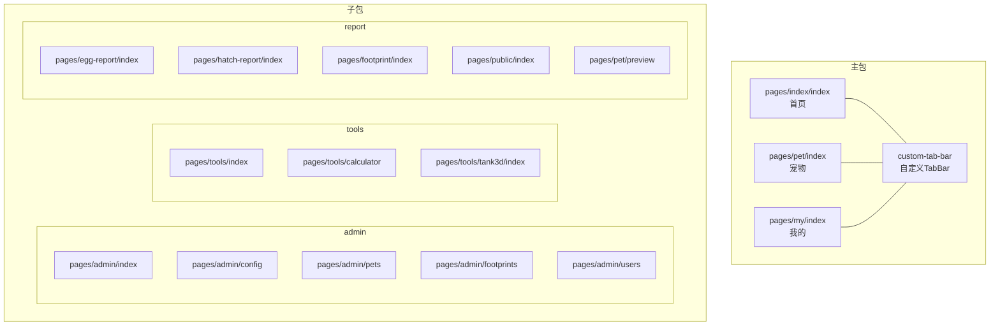
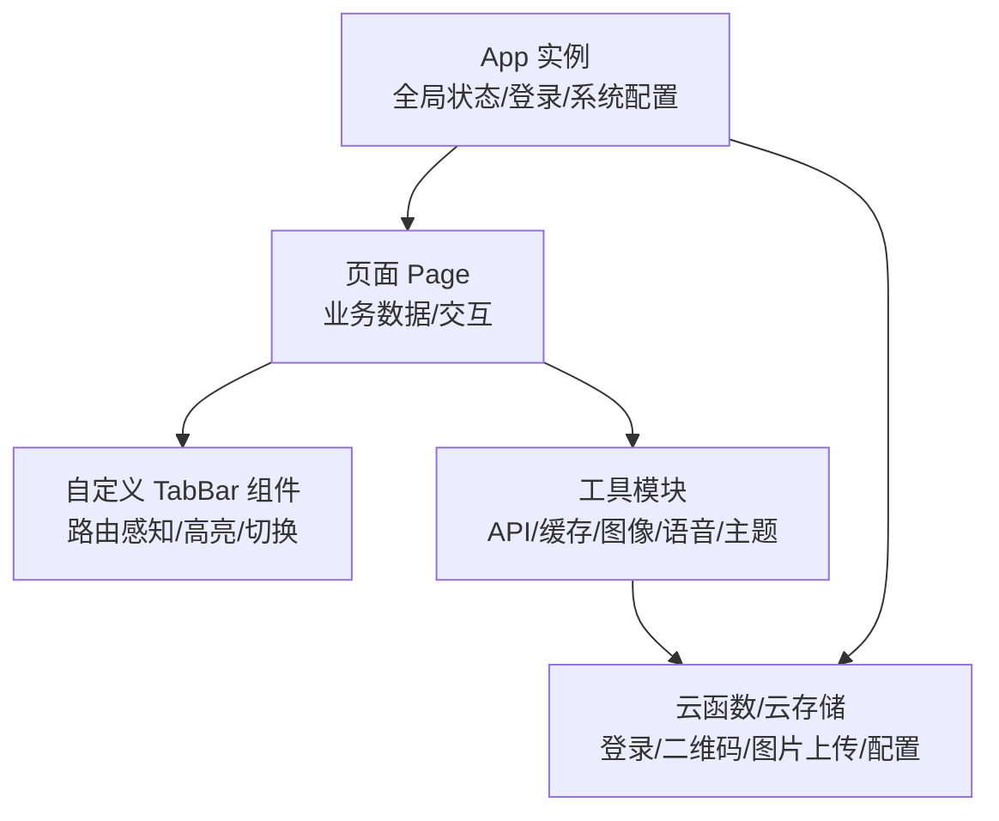
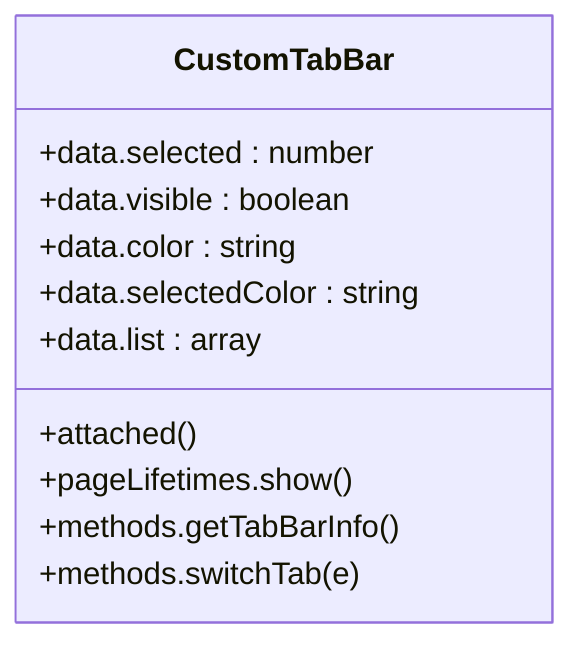
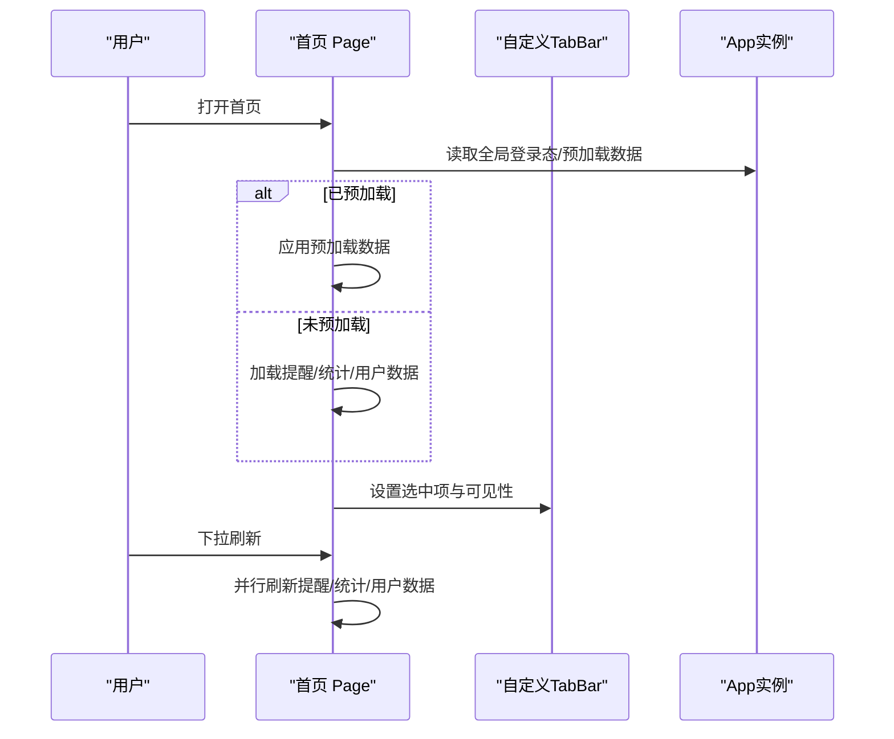
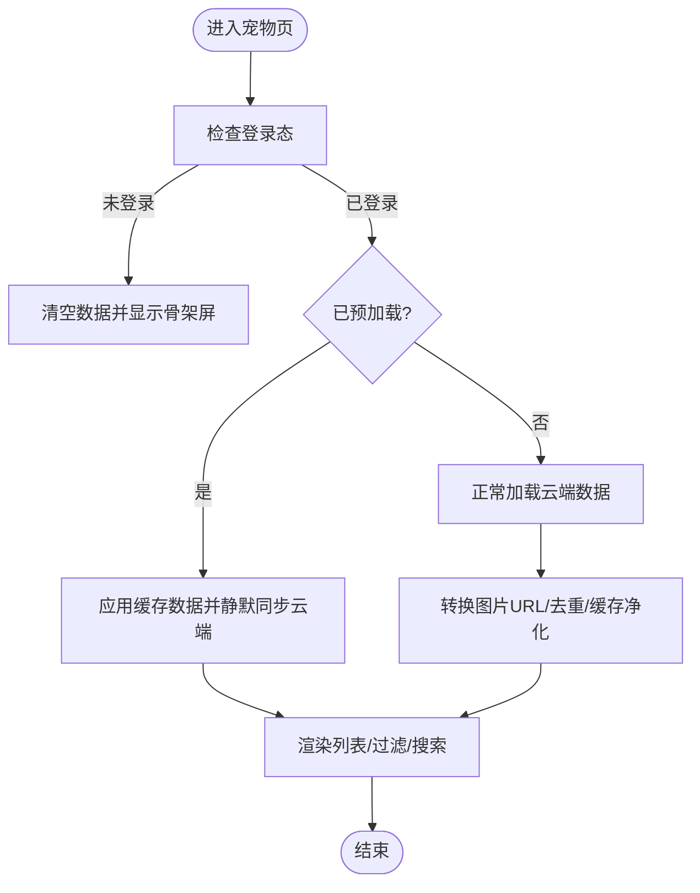
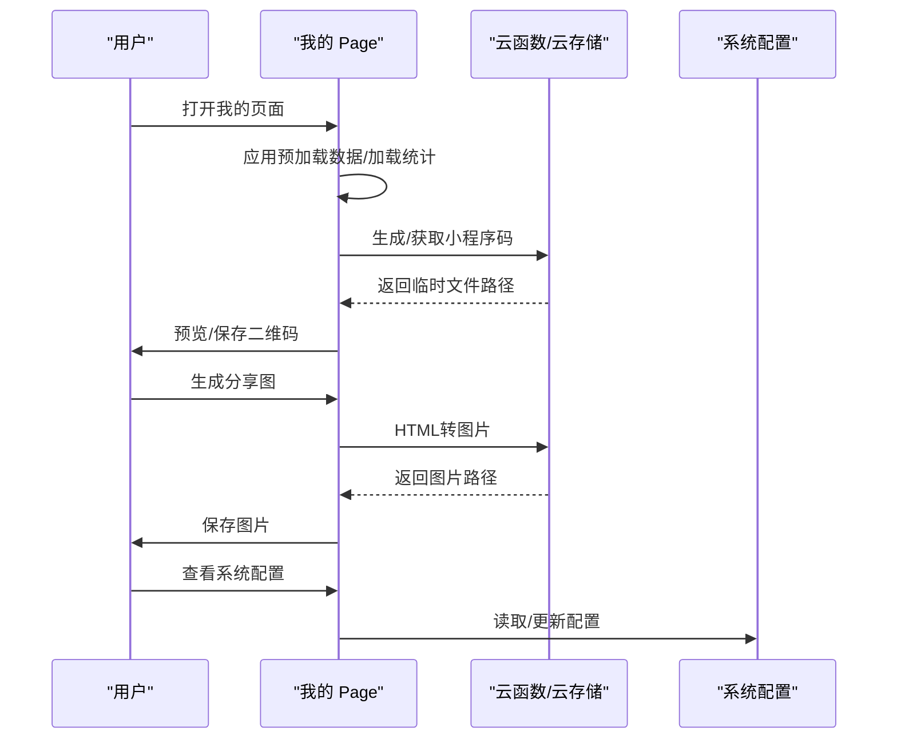
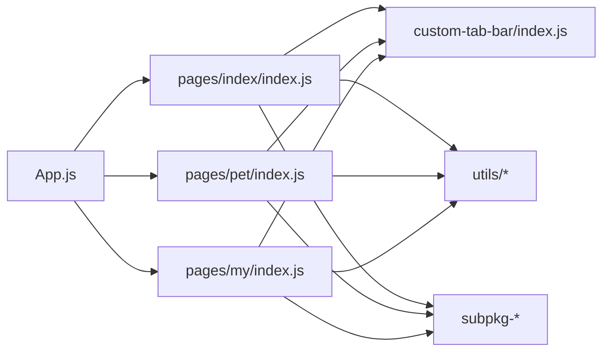
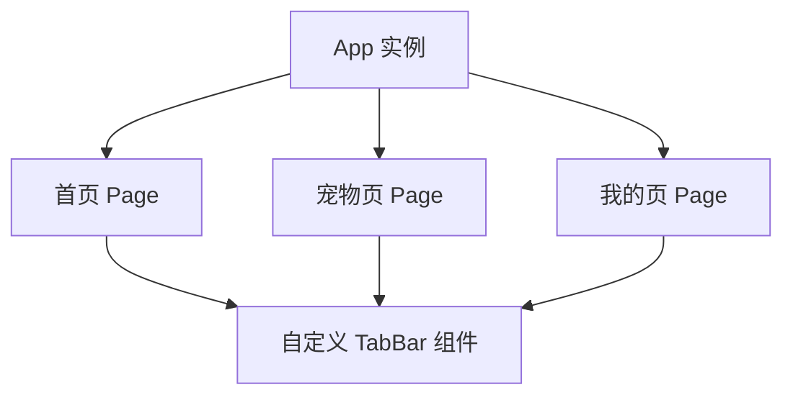

# 组件架构

<cite>
**本文引用的文件**   
- [miniprogram/app.js](file://miniprogram/app.js)
- [miniprogram/app.json](file://miniprogram/app.json)
- [miniprogram/custom-tab-bar/index.js](file://miniprogram/custom-tab-bar/index.js)
- [miniprogram/custom-tab-bar/index.json](file://miniprogram/custom-tab-bar/index.json)
- [miniprogram/custom-tab-bar/index.wxml](file://miniprogram/custom-tab-bar/index.wxml)
- [miniprogram/custom-tab-bar/index.wxss](file://miniprogram/custom-tab-bar/index.wxss)
- [miniprogram/pages/index/index.js](file://miniprogram/pages/index/index.js)
- [miniprogram/pages/index/index.json](file://miniprogram/pages/index/index.json)
- [miniprogram/pages/pet/index.js](file://miniprogram/pages/pet/index.js)
- [miniprogram/pages/pet/index.json](file://miniprogram/pages/pet/index.json)
- [miniprogram/pages/my/index.js](file://miniprogram/pages/my/index.js)
</cite>

## 目录
1. [引言](#引言)
2. [项目结构](#项目结构)
3. [核心组件](#核心组件)
4. [架构总览](#架构总览)
5. [组件详细分析](#组件详细分析)
6. [依赖关系分析](#依赖关系分析)
7. [性能考量](#性能考量)
8. [故障排查指南](#故障排查指南)
9. [结论](#结论)
10. [附录](#附录)

## 引言
本文件面向“养龟档案”小程序项目的前端组件架构，聚焦于自定义组件的设计原则与实现方式，系统梳理组件生命周期、属性传递、事件处理机制；总结公共组件的抽象与复用策略，以及组件间通信（父子、兄弟、跨层级）的方式；阐述样式隔离、数据绑定与模板渲染机制；并给出性能优化、懒加载与缓存管理策略，辅以架构图与组件树结构图，帮助开发者高效理解与维护代码。

## 项目结构
项目采用微信小程序原生框架组织，页面按功能划分为主包与多个子包（admin、tools、report），并在主包内提供自定义 TabBar 组件。应用全局状态通过 App 实例管理，页面通过 Page 生命周期与全局状态交互，并在必要时触发云函数或本地缓存。

图表来源
- [miniprogram/app.json:1-74](file://miniprogram/app.json#L1-L74)
- [miniprogram/pages/index/index.json:1-5](file://miniprogram/pages/index/index.json#L1-L5)
- [miniprogram/pages/pet/index.json:1-6](file://miniprogram/pages/pet/index.json#L1-L6)
- [miniprogram/custom-tab-bar/index.json:1-3](file://miniprogram/custom-tab-bar/index.json#L1-L3)

章节来源
- [miniprogram/app.json:1-74](file://miniprogram/app.json#L1-L74)

## 核心组件
- 自定义 TabBar 组件：提供自定义样式的底部导航栏，支持根据当前路由高亮选中项、响应切换动作。
- 页面组件：首页、宠物列表、我的页面等，负责业务数据加载、状态管理与交互。
- 子包页面：按功能拆分，减少主包体积，提升首包加载速度。

章节来源
- [miniprogram/custom-tab-bar/index.js:1-72](file://miniprogram/custom-tab-bar/index.js#L1-L72)
- [miniprogram/custom-tab-bar/index.wxml:1-47](file://miniprogram/custom-tab-bar/index.wxml#L1-L47)
- [miniprogram/custom-tab-bar/index.wxss:1-265](file://miniprogram/custom-tab-bar/index.wxss#L1-L265)
- [miniprogram/pages/index/index.js:1-477](file://miniprogram/pages/index/index.js#L1-L477)
- [miniprogram/pages/pet/index.js:1-800](file://miniprogram/pages/pet/index.js#L1-L800)
- [miniprogram/pages/my/index.js:1-800](file://miniprogram/pages/my/index.js#L1-L800)

## 架构总览
整体架构围绕“应用生命周期 + 页面生命周期 + 自定义组件”的三层结构展开。App 负责全局初始化、登录态与系统配置；页面负责具体业务数据与交互；自定义组件（如 TabBar）作为横切关注点注入到页面中，统一处理导航与视觉呈现。

图表来源
- [miniprogram/app.js:1-312](file://miniprogram/app.js#L1-L312)
- [miniprogram/custom-tab-bar/index.js:1-72](file://miniprogram/custom-tab-bar/index.js#L1-L72)
- [miniprogram/pages/index/index.js:1-477](file://miniprogram/pages/index/index.js#L1-L477)
- [miniprogram/pages/pet/index.js:1-800](file://miniprogram/pages/pet/index.js#L1-L800)
- [miniprogram/pages/my/index.js:1-800](file://miniprogram/pages/my/index.js#L1-L800)

## 组件详细分析

### 自定义 TabBar 组件
- 设计原则
  - 路由感知：通过 getCurrentPages 获取当前页面，匹配 list 中的 pagePath，决定选中项与可见性。
  - 低耦合：通过事件绑定与 dataset 传递目标路径，避免硬编码。
  - 视觉一致性：使用样式变量控制颜色与选中态，保证与整体设计风格一致。
- 生命周期
  - attached：初始化时获取一次 TabBar 信息，并延时二次校验，增强稳定性。
  - pageLifetimes.show：页面显示时再次校验，确保跨页面切换正确高亮。
- 事件处理
  - switchTab：根据传入路径判断是否需要切换，避免重复跳转。
- 样式隔离
  - 使用局部样式与类名控制，避免污染页面样式；通过隐藏类实现显隐过渡。
- 数据绑定与模板渲染
  - 列表循环渲染每个 Tab 项，动态绑定样式与文本；通过条件渲染展示不同图标。

图表来源
- [miniprogram/custom-tab-bar/index.js:1-72](file://miniprogram/custom-tab-bar/index.js#L1-L72)

章节来源
- [miniprogram/custom-tab-bar/index.js:1-72](file://miniprogram/custom-tab-bar/index.js#L1-L72)
- [miniprogram/custom-tab-bar/index.wxml:1-47](file://miniprogram/custom-tab-bar/index.wxml#L1-L47)
- [miniprogram/custom-tab-bar/index.wxss:1-265](file://miniprogram/custom-tab-bar/index.wxss#L1-L265)

### 首页组件（Index）
- 生命周期与数据流
  - onLoad：设置导航高度与问候语；将 TabBar 的选中状态与可见性同步到自定义 TabBar。
  - onShow：根据全局预加载状态与登录态，决定是否使用预加载数据并触发刷新；同时刷新提醒、统计与用户数据。
- 事件处理
  - 下拉刷新：统一加载提醒、统计与用户数据。
  - 导航跳转：跳转到宠物详情、计算器、报告页等。
- 数据绑定与模板渲染
  - 通过 setData 更新视图，结合本地缓存与云端数据进行合并与排序。
- 性能优化
  - 预加载：App 在启动阶段预加载部分数据，首页 onShow 时直接应用，减少首屏等待。
  - 骨架屏：在数据加载期间展示骨架屏，提升感知速度。

图表来源
- [miniprogram/pages/index/index.js:1-477](file://miniprogram/pages/index/index.js#L1-L477)
- [miniprogram/custom-tab-bar/index.js:1-72](file://miniprogram/custom-tab-bar/index.js#L1-L72)
- [miniprogram/app.js:1-312](file://miniprogram/app.js#L1-L312)

章节来源
- [miniprogram/pages/index/index.js:1-477](file://miniprogram/pages/index/index.js#L1-L477)
- [miniprogram/pages/index/index.json:1-5](file://miniprogram/pages/index/index.json#L1-L5)

### 宠物列表组件（Pet Index）
- 生命周期与数据流
  - onShow：根据登录态与预加载状态决定是否应用缓存数据并静默同步云端；否则正常加载。
  - onHide：提前设置骨架屏，保证下次显示时的初始状态。
  - onReachBottom/onPullDownRefresh：分页加载与下拉刷新。
- 数据绑定与模板渲染
  - 过滤与搜索：基于分类、性别、状态与关键词实时过滤；计算动态状态并渲染。
  - 图片处理：优先使用本地有效图片 URL，否则转换云端 cloud:// 文件 ID。
- 性能优化
  - 骨架屏最小展示时间：确保骨架屏至少展示 600ms，避免闪烁。
  - 请求幂等：为每次加载生成序列号，丢弃过期请求结果，避免竞态覆盖。
  - 缓存净化：存储宠物数据时净化图片 URL，确保只保存 cloud:// 格式。

图表来源
- [miniprogram/pages/pet/index.js:1-800](file://miniprogram/pages/pet/index.js#L1-L800)

章节来源
- [miniprogram/pages/pet/index.js:1-800](file://miniprogram/pages/pet/index.js#L1-L800)
- [miniprogram/pages/pet/index.json:1-6](file://miniprogram/pages/pet/index.json#L1-L6)

### 我的组件（My）
- 生命周期与数据流
  - onLoad：初始化蓝牙打印 SDK 实例；读取登录态。
  - onShow：根据登录态与预加载状态决定是否应用缓存数据；加载回收站、最近浏览、系统配置等。
  - onHide/onUnload：停止蓝牙扫描与关闭打印机，释放资源。
- 事件处理
  - 生成/保存二维码：优先使用本地缓存，否则调用云函数生成并下载到本地。
  - 生成分享图：基于主题与用户信息生成 HTML，再转图片保存到相册。
  - 打印配置：从云端加载用户打印配置，支持开关与类型选择。
- 数据绑定与模板渲染
  - 统计数据：本地快速展示，云端静默更新；支持多源聚合。
  - 分享信息：封面、标签、环境图、物种图等，支持编辑与同步云端。

图表来源
- [miniprogram/pages/my/index.js:1-800](file://miniprogram/pages/my/index.js#L1-L800)

章节来源
- [miniprogram/pages/my/index.js:1-800](file://miniprogram/pages/my/index.js#L1-L800)

## 依赖关系分析
- 页面与自定义组件
  - 首页、宠物、我的页面均通过 getTabBar 方法与自定义 TabBar 交互，实现选中态与可见性的统一管理。
- 页面与全局状态
  - App 实例提供全局登录态、系统配置与预加载数据；页面在生命周期中读取并应用。
- 页面与工具模块
  - API、缓存、图像、语音、主题等工具模块被页面按需引入，形成清晰的职责边界。
- 页面与子包
  - 通过相对路径跳转到子包页面，实现功能解耦与包体瘦身。

图表来源
- [miniprogram/app.js:1-312](file://miniprogram/app.js#L1-L312)
- [miniprogram/custom-tab-bar/index.js:1-72](file://miniprogram/custom-tab-bar/index.js#L1-L72)
- [miniprogram/pages/index/index.js:1-477](file://miniprogram/pages/index/index.js#L1-L477)
- [miniprogram/pages/pet/index.js:1-800](file://miniprogram/pages/pet/index.js#L1-L800)
- [miniprogram/pages/my/index.js:1-800](file://miniprogram/pages/my/index.js#L1-L800)

章节来源
- [miniprogram/app.json:1-74](file://miniprogram/app.json#L1-L74)

## 性能考量
- 骨架屏策略
  - 宠物页在 onHide 时提前设置骨架屏，在数据加载后按最小展示时长隐藏，避免闪烁。
- 预加载与懒加载
  - App 在启动阶段预加载部分数据，首页与我的页 onShow 时直接应用，减少首屏等待；子包按需加载，配合懒加载配置降低主包体积。
- 请求幂等与去重
  - 宠物页为每次加载生成序列号，丢弃过期请求结果，避免竞态覆盖；分页加载时去重合并，减少重复渲染。
- 缓存与净化
  - 宠物数据缓存时净化图片 URL，仅保存 cloud:// 格式，减少无效字段与后续转换成本。
- 并行加载
  - 首页下拉刷新与我的页加载均采用 Promise.all 并行处理，缩短总耗时。

章节来源
- [miniprogram/pages/pet/index.js:1-800](file://miniprogram/pages/pet/index.js#L1-L800)
- [miniprogram/pages/index/index.js:1-477](file://miniprogram/pages/index/index.js#L1-L477)
- [miniprogram/pages/my/index.js:1-800](file://miniprogram/pages/my/index.js#L1-L800)
- [miniprogram/app.json:72-72](file://miniprogram/app.json#L72-L72)

## 故障排查指南
- 登录态相关
  - App 提供 requireLogin/promptLogin/forceLogin 等方法，页面可通过 getApp() 获取实例并调用，必要时弹窗提示或强制登录。
- 通知与审核
  - App 在 onShow 时检查未读通知与超时审核记录，页面可复用通知管理器进行弹窗与提示。
- 图片加载失败
  - 首页与我的页提供头像/二维码等图片的错误回调与刷新逻辑，优先刷新临时 URL，失败则清空占位。
- 云函数调用失败
  - 页面在调用云函数失败时回退到本地数据或缓存，保证基本可用性；同时记录日志便于排查。

章节来源
- [miniprogram/app.js:176-288](file://miniprogram/app.js#L176-L288)
- [miniprogram/pages/index/index.js:139-155](file://miniprogram/pages/index/index.js#L139-L155)
- [miniprogram/pages/my/index.js:485-488](file://miniprogram/pages/my/index.js#L485-L488)

## 结论
本项目通过 App 全局状态、页面生命周期与自定义组件的协同，构建了清晰、可维护且高性能的小程序前端架构。自定义 TabBar 作为横切关注点，统一了导航体验；页面通过预加载、骨架屏、并行加载与请求幂等等策略，显著提升了用户体验与稳定性。建议在后续迭代中持续完善工具模块的抽象与测试覆盖，进一步强化组件复用与可扩展性。

## 附录
- 组件树结构（概念示意）
