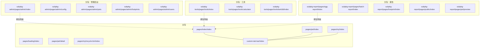
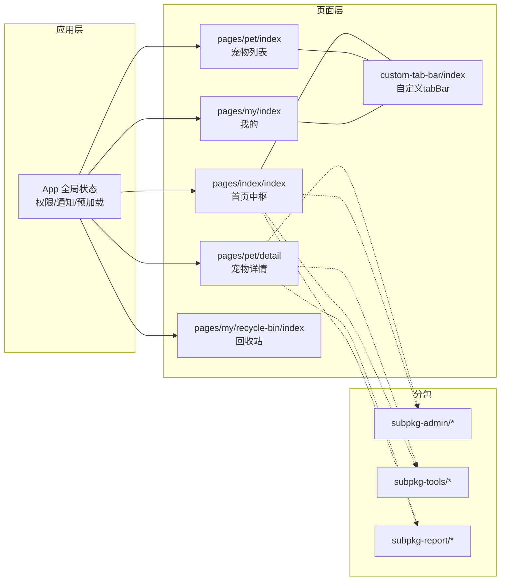
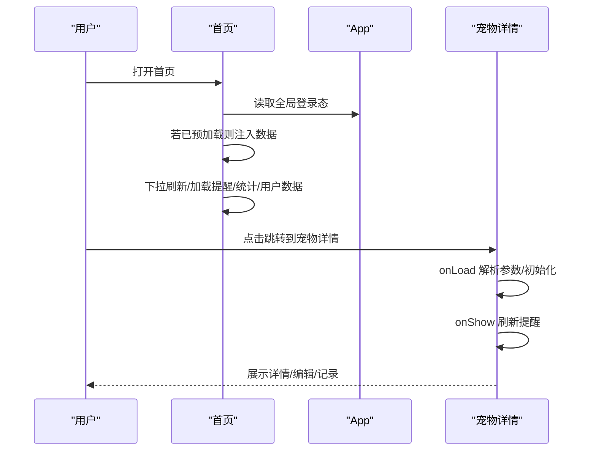
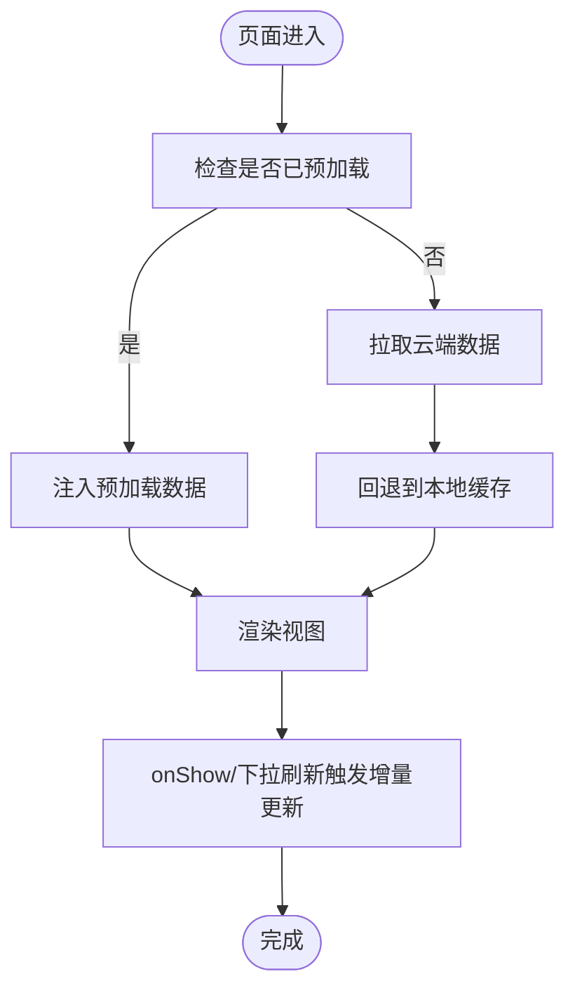
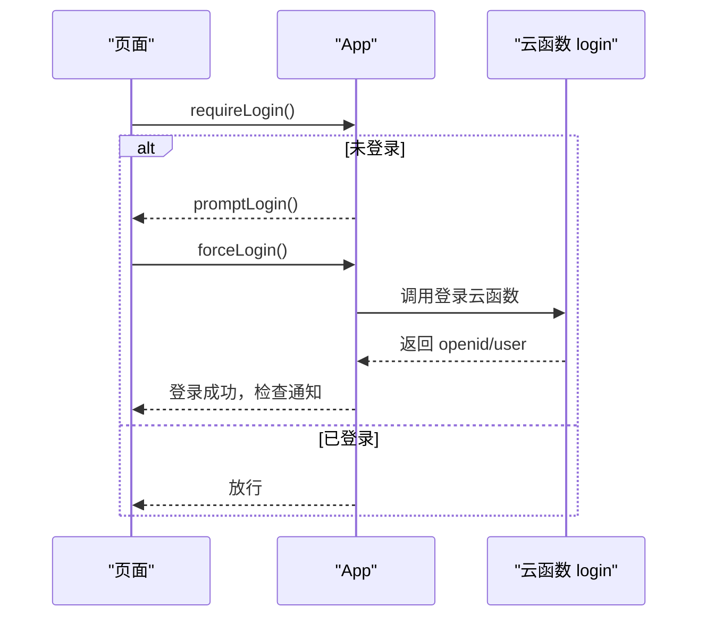
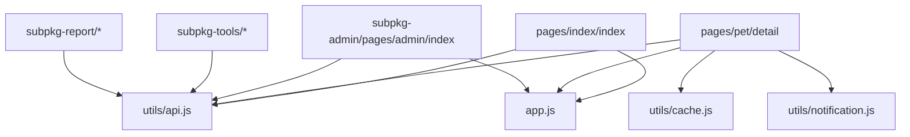

# 页面架构

<cite>
**本文引用的文件**
- [app.json](file://miniprogram/app.json)
- [app.js](file://miniprogram/app.js)
- [index.json](file://miniprogram/pages/index/index.json)
- [pet/index.json](file://miniprogram/pages/pet/index.json)
- [loading/index.json](file://miniprogram/pages/loading/index.json)
- [my/index.json](file://miniprogram/pages/my/index.json)
- [custom-tab-bar/index.json](file://miniprogram/custom-tab-bar/index.json)
- [index.js](file://miniprogram/pages/index/index.js)
- [detail.js](file://miniprogram/pages/pet/detail.js)
- [recycle-bin/index.js](file://miniprogram/pages/my/recycle-bin/index.js)
- [admin/index.js](file://miniprogram/subpkg-admin/pages/admin/index.js)
- [api.js](file://miniprogram/utils/api.js)
- [cache.js](file://miniprogram/utils/cache.js)
- [notification.js](file://miniprogram/utils/notification.js)
</cite>

## 目录
1. [引言](#引言)
2. [项目结构](#项目结构)
3. [核心组件](#核心组件)
4. [架构总览](#架构总览)
5. [详细组件分析](#详细组件分析)
6. [依赖分析](#依赖分析)
7. [性能考虑](#性能考虑)
8. [故障排查指南](#故障排查指南)
9. [结论](#结论)
10. [附录](#附录)

## 引言
本文件面向“养龟档案”微信小程序，系统性梳理其页面架构与运行机制，覆盖页面生命周期管理、路由机制、页面间通信、主包与分包划分、tabBar 设计原则、数据流向与状态传递、页面缓存策略、导航体系、权限控制与预加载优化，并提供架构图与路由流程图，帮助开发者快速理解与维护。

## 项目结构
小程序采用“主包 + 分包”的组织方式，通过 app.json 的 pages 与 subpackages 字段声明页面集合；同时自定义 tabBar，将高频入口集中在首页、宠物、我的三个 tab 页面，其余功能按业务域拆分为 subpkg-admin、subpkg-tools、subpkg-report 三大分包，降低首屏体积与加载压力。

图表来源
- [app.json:1-74](file://miniprogram/app.json#L1-L74)
- [index.json:1-5](file://miniprogram/pages/index/index.json#L1-L5)
- [pet/index.json:1-6](file://miniprogram/pages/pet/index.json#L1-L6)
- [loading/index.json:1-5](file://miniprogram/pages/loading/index.json#L1-L5)
- [my/index.json:1-5](file://miniprogram/pages/my/index.json#L1-L5)
- [custom-tab-bar/index.json:1-3](file://miniprogram/custom-tab-bar/index.json#L1-L3)

章节来源
- [app.json:1-74](file://miniprogram/app.json#L1-L74)

## 核心组件
- 应用生命周期与全局状态
  - App.onLaunch 初始化云开发、加载系统配置、异步登录与二维码生成；App.globalData 统一存放登录态、openid、预加载数据等；提供 requireLogin、forceLogin、logout 等权限控制方法。
- 页面生命周期与导航
  - 首页、宠物列表、我的等页面均采用自定义导航样式；首页在 onShow 中集中处理数据加载与预加载应用；宠物详情页在 onLoad/onShow 中分别处理参数解析与状态刷新；回收站页面在 onShow 中实时刷新本地数据。
- 分包与跨包导航
  - 管理后台、工具、报告三大分包通过 pages/*/*.json 的 navigationStyle 控制导航；跨包跳转使用 wx.navigateTo/wx.switchTab 等标准 API。
- 权限控制
  - 通过 App.requireLogin/App.forceLogin 在关键操作前校验登录态；未登录时弹窗引导登录；登出时清理本地存储并 reLaunch 回宠物列表。
- 数据与缓存
  - APIManager 统一封装云函数调用与错误处理；cache.js 提供带过期时间的本地缓存；首页支持预加载数据注入，减少二次请求。

章节来源
- [app.js:1-312](file://miniprogram/app.js#L1-L312)
- [index.js:1-477](file://miniprogram/pages/index/index.js#L1-L477)
- [detail.js:1-800](file://miniprogram/pages/pet/detail.js#L1-L800)
- [recycle-bin/index.js:1-148](file://miniprogram/pages/my/recycle-bin/index.js#L1-L148)
- [api.js:1-208](file://miniprogram/utils/api.js#L1-L208)
- [cache.js:1-121](file://miniprogram/utils/cache.js#L1-L121)

## 架构总览
整体采用“主包承载核心入口与基础能力，分包承载专项功能”的策略。首页作为中枢，聚合提醒、统计、快捷入口；宠物详情承载编辑、记录、谱系、打印等复杂交互；管理后台、工具、报告分别服务于运营、辅助工具与报表输出。

图表来源
- [app.js:1-312](file://miniprogram/app.js#L1-L312)
- [index.js:1-477](file://miniprogram/pages/index/index.js#L1-L477)
- [detail.js:1-800](file://miniprogram/pages/pet/detail.js#L1-L800)
- [recycle-bin/index.js:1-148](file://miniprogram/pages/my/recycle-bin/index.js#L1-L148)
- [custom-tab-bar/index.json:1-3](file://miniprogram/custom-tab-bar/index.json#L1-L3)

## 详细组件分析

### 页面生命周期与路由机制
- 首页（pages/index/index）
  - onShow 中根据是否已预加载数据决定使用 App.globalData.preloaded* 注入，否则触发本地/云端数据拉取；支持下拉刷新与提醒计算。
- 宠物详情（pages/pet/detail）
  - onLoad 解析参数（petId/isPublic/from=scan）、初始化今日日期与蓝牙打印配置；onShow 用于再次刷新提醒；onHide/onUnload 清理蓝牙资源。
- 我的（pages/my/index）与回收站（pages/my/recycle-bin/index）
  - onShow 实时读取本地存储并渲染；支持恢复/永久删除等操作。
- 管理后台（subpkg-admin/pages/admin/index）
  - onShow 每次进入刷新数据；通过云函数 admin 获取统计与趋势。

图表来源
- [index.js:1-477](file://miniprogram/pages/index/index.js#L1-L477)
- [detail.js:1-800](file://miniprogram/pages/pet/detail.js#L1-L800)
- [app.js:1-312](file://miniprogram/app.js#L1-L312)

章节来源
- [index.js:1-477](file://miniprogram/pages/index/index.js#L1-L477)
- [detail.js:1-800](file://miniprogram/pages/pet/detail.js#L1-L800)
- [recycle-bin/index.js:1-148](file://miniprogram/pages/my/recycle-bin/index.js#L1-L148)
- [admin/index.js:1-123](file://miniprogram/subpkg-admin/pages/admin/index.js#L1-L123)

### 页面间通信与数据共享
- 参数传递
  - 宠物详情通过 URL 参数 petId/isPublic/from=scan 传参；首页跳转到详情使用 navigateTo；管理后台/工具/报告通过跨包 navigateTo。
- 全局状态共享
  - App.globalData 统一存放 isLoggedIn/openid/systemConfig/preloaded* 等；首页在 onShow 中将预加载数据注入到页面 data。
- 本地存储共享
  - 宠物列表、记录、分类、回收站等数据通过 wx.setStorageSync/wx.getStorageSync 在页面间共享；详情页在 setPetData 后触发视图更新。
- 通知与权限
  - App.onShow 中检查未读审核通知；requireLogin/forceLogin 统一处理登录态校验与跳转。

章节来源
- [index.js:1-477](file://miniprogram/pages/index/index.js#L1-L477)
- [detail.js:1-800](file://miniprogram/pages/pet/detail.js#L1-L800)
- [app.js:1-312](file://miniprogram/app.js#L1-L312)
- [notification.js:1-146](file://miniprogram/utils/notification.js#L1-L146)

### 主包与分包划分策略
- 主包包含高频入口与基础页面：首页、宠物列表、我的、加载页、自定义 tabBar；确保首屏最小可用。
- 分包划分：
  - subpkg-admin：管理后台核心页面（统计、配置、用户、宠物、足迹）
  - subpkg-tools：工具集（计算器、3D 龟缸）
  - subpkg-report：报告与公共页（孵化/产蛋报告、足迹、公共档案、宠物预览）
- 优点：降低主包体积，提升冷启动速度；按功能域隔离，便于团队协作与独立迭代。

章节来源
- [app.json:1-74](file://miniprogram/app.json#L1-L74)

### tabBar 页面设计原则
- 三入口：首页、宠物、我的，均采用自定义导航样式，统一视觉风格。
- 首页负责中枢聚合与预加载；宠物列表负责浏览与筛选；我的负责个人中心与回收站。
- 自定义 tabBar 通过 custom-tab-bar 组件实现，首页在 onShow 中主动设置选中态与可见性。

章节来源
- [app.json:48-68](file://miniprogram/app.json#L48-L68)
- [index.json:1-5](file://miniprogram/pages/index/index.json#L1-L5)
- [pet/index.json:1-6](file://miniprogram/pages/pet/index.json#L1-L6)
- [my/index.json:1-5](file://miniprogram/pages/my/index.json#L1-L5)
- [custom-tab-bar/index.json:1-3](file://miniprogram/custom-tab-bar/index.json#L1-L3)

### 页面数据流向与状态传递
- 首页数据流
  - 预加载注入：App.globalData.dataPreloaded=true 且 _preloadedApplied=false 时，首页一次性注入预加载的提醒、统计、特色宠物等数据。
  - 动态刷新：登录态变化或返回前台时，按需拉取云端/本地数据并更新视图。
- 详情页数据流
  - 公开模式与私有模式分别调用公开/私有接口回退到本地缓存；图片 URL 通过工具函数转换；编辑/删除/新增记录等操作同步更新本地存储与云端。
- 本地缓存策略
  - cache.js 提供带过期时间的本地缓存封装；首页与详情页在合适时机写入/读取本地存储，降低网络依赖。

图表来源
- [index.js:1-477](file://miniprogram/pages/index/index.js#L1-L477)
- [detail.js:1-800](file://miniprogram/pages/pet/detail.js#L1-L800)
- [cache.js:1-121](file://miniprogram/utils/cache.js#L1-L121)

章节来源
- [index.js:1-477](file://miniprogram/pages/index/index.js#L1-L477)
- [detail.js:1-800](file://miniprogram/pages/pet/detail.js#L1-L800)
- [cache.js:1-121](file://miniprogram/utils/cache.js#L1-L121)

### 页面缓存策略
- 本地缓存
  - pets、records、categories、recycleBin 等关键数据以本地存储形式持久化；详情页在 setPetData 后更新视图。
- 云端缓存
  - APIManager 对云函数调用结果进行统一错误处理与降级；图片上传后触发安全审核异步处理。
- 预加载缓存
  - App.globalData.preloaded* 在加载页完成后注入首页，避免二次请求。

章节来源
- [api.js:1-208](file://miniprogram/utils/api.js#L1-L208)
- [cache.js:1-121](file://miniprogram/utils/cache.js#L1-L121)
- [app.js:1-312](file://miniprogram/app.js#L1-L312)

### 导航体系与权限控制
- 导航体系
  - 首页提供快捷入口到工具、报告、我的等模块；跨包导航使用 navigateTo/switchTab；详情页支持分享到朋友圈/转发卡片。
- 权限控制
  - requireLogin：未登录弹窗提示，点击“去登录”触发 forceLogin；forceLogin 成功后检查审核通知并提示。
  - 登出：清理 openid、userInfo、registerTime、isAdmin 等，reLaunch 回宠物列表。

图表来源
- [app.js:176-225](file://miniprogram/app.js#L176-L225)

章节来源
- [app.js:176-225](file://miniprogram/app.js#L176-L225)
- [index.js:1-477](file://miniprogram/pages/index/index.js#L1-L477)
- [detail.js:1-800](file://miniprogram/pages/pet/detail.js#L1-L800)

### 页面预加载优化
- 预加载目标
  - App.globalData 中预置 pets/categories/reminders/stats/featuredPets/myStats/shareInfo/qrcode 等数据。
- 预加载触发
  - 首页在 onShow 中检测 dataPreloaded 标志，一次性注入上述数据，随后按需刷新提醒与统计。
- 降级策略
  - 若未经过 loading 页直接进入，首页兜底走本地/云端拉取流程。

章节来源
- [app.js:1-312](file://miniprogram/app.js#L1-L312)
- [index.js:1-477](file://miniprogram/pages/index/index.js#L1-L477)

## 依赖分析
- 页面到工具
  - APIManager 统一调用云函数；cache.js 提供本地缓存；notification.js 提供审核通知管理。
- 页面到分包
  - 首页与详情页通过 navigateTo 跨包跳转到管理后台、工具、报告；分包内部页面通过相对路径相互跳转。
- 页面到 App
  - 所有页面通过 getApp() 访问全局状态与权限控制方法；首页在 onShow 中集中处理数据注入与刷新。

图表来源
- [index.js:1-477](file://miniprogram/pages/index/index.js#L1-L477)
- [detail.js:1-800](file://miniprogram/pages/pet/detail.js#L1-L800)
- [admin/index.js:1-123](file://miniprogram/subpkg-admin/pages/admin/index.js#L1-L123)
- [api.js:1-208](file://miniprogram/utils/api.js#L1-L208)
- [cache.js:1-121](file://miniprogram/utils/cache.js#L1-L121)
- [notification.js:1-146](file://miniprogram/utils/notification.js#L1-L146)
- [app.js:1-312](file://miniprogram/app.js#L1-L312)

章节来源
- [index.js:1-477](file://miniprogram/pages/index/index.js#L1-L477)
- [detail.js:1-800](file://miniprogram/pages/pet/detail.js#L1-L800)
- [admin/index.js:1-123](file://miniprogram/subpkg-admin/pages/admin/index.js#L1-L123)
- [api.js:1-208](file://miniprogram/utils/api.js#L1-L208)
- [cache.js:1-121](file://miniprogram/utils/cache.js#L1-L121)
- [notification.js:1-146](file://miniprogram/utils/notification.js#L1-L146)
- [app.js:1-312](file://miniprogram/app.js#L1-L312)

## 性能考虑
- 分包加载：将管理后台、工具、报告放入分包，降低主包体积，缩短首屏加载时间。
- 预加载：首页 onShow 一次性注入预加载数据，减少二次请求与闪烁。
- 本地缓存：关键数据本地持久化，图片 URL 转换失败时回退到本地存储，提升稳定性。
- 云函数降级：APIManager 对云函数调用失败进行降级处理，保证基本功能可用。
- 下拉刷新与节流：首页下拉刷新并发拉取多项数据；通知检查带节流，避免频繁调用。

## 故障排查指南
- 登录失败
  - 检查 App.forceLogin 的云函数调用结果与错误提示；确认网络状态与云环境配置。
- 图片加载失败
  - 首页头像与详情页图片在加载失败时尝试刷新临时 URL 或回退本地存储；确认云存储签名有效期与文件存在性。
- 通知未显示
  - App.onShow 中调用通知管理器检查未读通知；确认云函数 security 的可用性与权限。
- 回收站数据不同步
  - 回收站页面 onShow 读取本地存储；确认 setStorageSync 调用是否成功。

章节来源
- [app.js:176-225](file://miniprogram/app.js#L176-L225)
- [index.js:1-477](file://miniprogram/pages/index/index.js#L1-L477)
- [detail.js:1-800](file://miniprogram/pages/pet/detail.js#L1-L800)
- [recycle-bin/index.js:1-148](file://miniprogram/pages/my/recycle-bin/index.js#L1-L148)
- [notification.js:1-146](file://miniprogram/utils/notification.js#L1-L146)

## 结论
本项目通过“主包 + 分包”的页面组织与“预加载 + 本地缓存 + 权限控制”的运行机制，实现了稳定、可扩展的小程序页面架构。首页作为中枢聚合数据与入口，详情页承载复杂交互，分包按域解耦，配合统一的 API 与通知管理，形成清晰的职责边界与高效的开发协作模式。

## 附录
- 关键页面清单
  - 首页：pages/index/index
  - 宠物列表：pages/pet/index
  - 宠物详情：pages/pet/detail
  - 我的：pages/my/index
  - 回收站：pages/my/recycle-bin/index
  - 管理后台：subpkg-admin/pages/admin/*
  - 工具：subpkg-tools/pages/tools/*
  - 报告：subpkg-report/pages/*