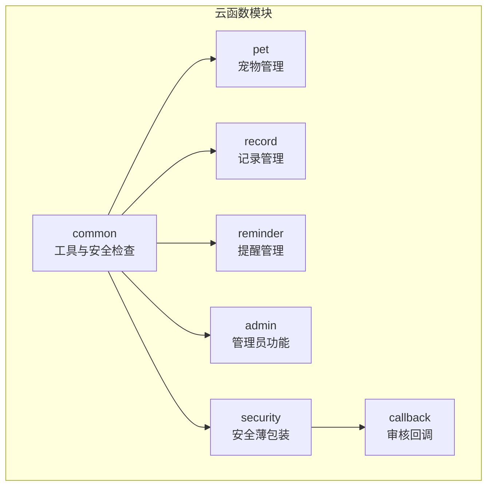
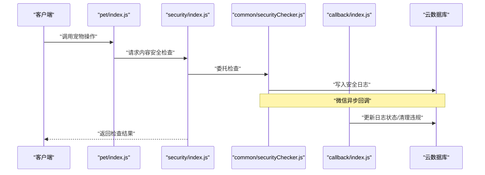
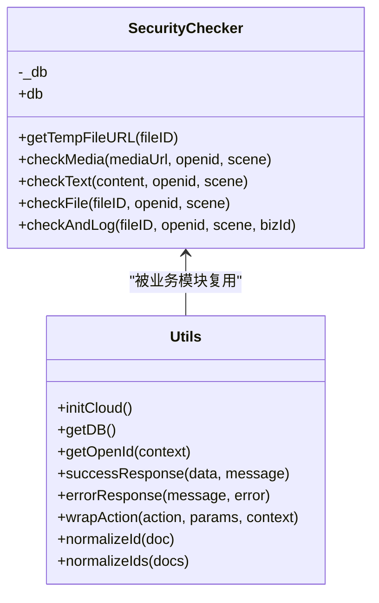
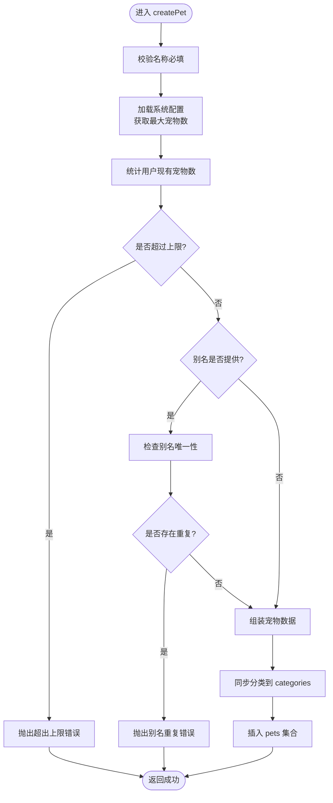
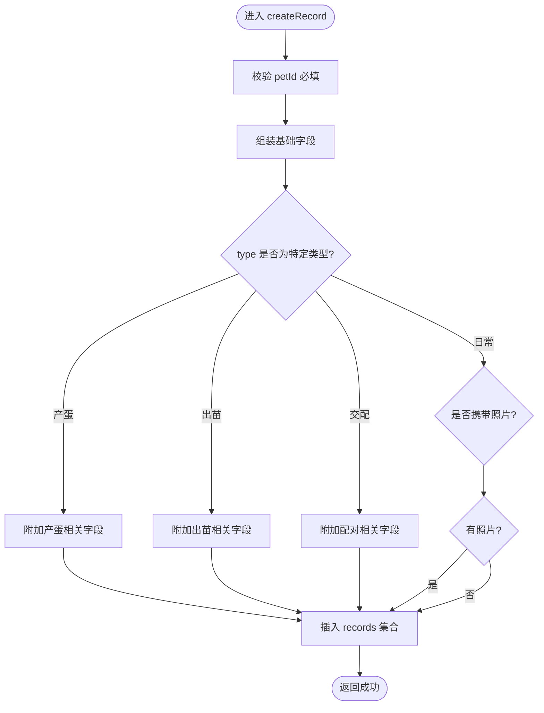
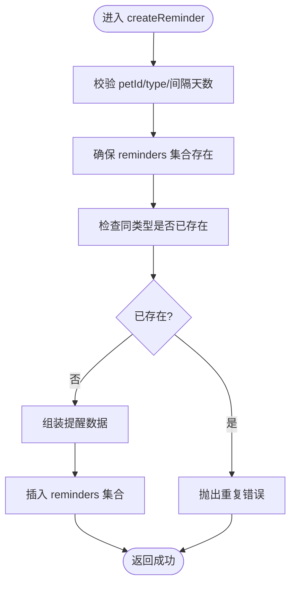
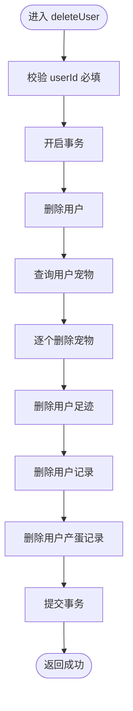
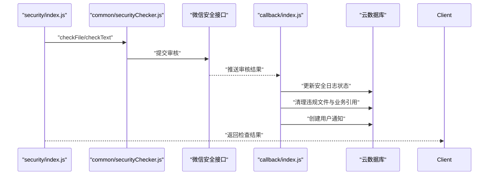
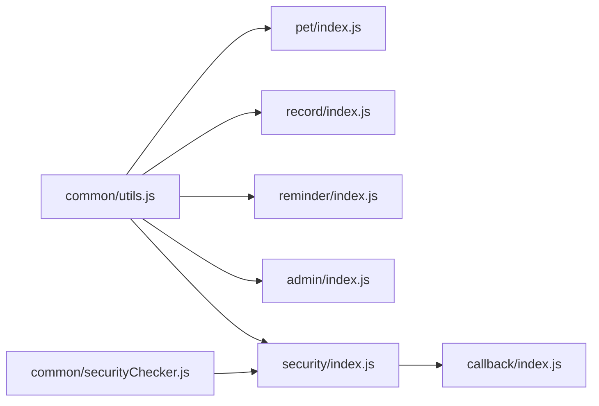

# 云函数设计

<cite>
**本文引用的文件**
- [cloudfunctions/common/securityChecker.js](file://cloudfunctions/common/securityChecker.js)
- [cloudfunctions/common/utils.js](file://cloudfunctions/common/utils.js)
- [cloudfunctions/admin/index.js](file://cloudfunctions/admin/index.js)
- [cloudfunctions/admin/config.json](file://cloudfunctions/admin/config.json)
- [cloudfunctions/pet/index.js](file://cloudfunctions/pet/index.js)
- [cloudfunctions/pet/utils.js](file://cloudfunctions/pet/utils.js)
- [cloudfunctions/pet/config.json](file://cloudfunctions/pet/config.json)
- [cloudfunctions/record/index.js](file://cloudfunctions/record/index.js)
- [cloudfunctions/record/utils.js](file://cloudfunctions/record/utils.js)
- [cloudfunctions/record/config.json](file://cloudfunctions/record/config.json)
- [cloudfunctions/reminder/index.js](file://cloudfunctions/reminder/index.js)
- [cloudfunctions/reminder/utils.js](file://cloudfunctions/reminder/utils.js)
- [cloudfunctions/reminder/config.json](file://cloudfunctions/reminder/config.json)
- [cloudfunctions/security/index.js](file://cloudfunctions/security/index.js)
- [cloudfunctions/callback/index.js](file://cloudfunctions/callback/index.js)
</cite>

## 目录
1. [引言](#引言)
2. [项目结构](#项目结构)
3. [核心组件](#核心组件)
4. [架构总览](#架构总览)
5. [详细组件分析](#详细组件分析)
6. [依赖分析](#依赖分析)
7. [性能考虑](#性能考虑)
8. [故障排查指南](#故障排查指南)
9. [结论](#结论)
10. [附录](#附录)

## 引言
本设计文档面向“养龟档案”项目的云函数体系，系统化阐述模块化架构、公共工具函数、安全检查机制、错误处理策略、生命周期与上下文获取、数据库连接管理、业务模块设计模式（宠物、记录、管理员）、云函数间调用关系与参数返回标准化，以及部署配置、环境变量管理与性能监控策略。目标是帮助开发者快速理解并高效扩展云函数能力。

## 项目结构
云函数采用按功能域划分的模块化组织方式，每个业务模块独立封装，共享公共工具与安全检查能力：
- common：通用工具与安全检查器
- admin：管理员后台功能
- pet：宠物管理与谱系查询
- record：日常记录管理
- reminder：提醒事项管理
- security：内容安全审核薄包装
- callback：微信异步审核回调处理
- 各模块均包含 index.js、utils.js、config.json

图表来源
- [cloudfunctions/common/utils.js:1-69](file://cloudfunctions/common/utils.js#L1-L69)
- [cloudfunctions/common/securityChecker.js:1-226](file://cloudfunctions/common/securityChecker.js#L1-L226)
- [cloudfunctions/pet/index.js:1-723](file://cloudfunctions/pet/index.js#L1-L723)
- [cloudfunctions/record/index.js:1-191](file://cloudfunctions/record/index.js#L1-L191)
- [cloudfunctions/reminder/index.js:1-205](file://cloudfunctions/reminder/index.js#L1-L205)
- [cloudfunctions/admin/index.js:1-533](file://cloudfunctions/admin/index.js#L1-L533)
- [cloudfunctions/security/index.js:1-200](file://cloudfunctions/security/index.js#L1-L200)
- [cloudfunctions/callback/index.js:1-223](file://cloudfunctions/callback/index.js#L1-L223)

章节来源
- [cloudfunctions/common/utils.js:1-69](file://cloudfunctions/common/utils.js#L1-L69)
- [cloudfunctions/common/securityChecker.js:1-226](file://cloudfunctions/common/securityChecker.js#L1-L226)
- [cloudfunctions/pet/index.js:1-723](file://cloudfunctions/pet/index.js#L1-L723)
- [cloudfunctions/record/index.js:1-191](file://cloudfunctions/record/index.js#L1-L191)
- [cloudfunctions/reminder/index.js:1-205](file://cloudfunctions/reminder/index.js#L1-L205)
- [cloudfunctions/admin/index.js:1-533](file://cloudfunctions/admin/index.js#L1-L533)
- [cloudfunctions/security/index.js:1-200](file://cloudfunctions/security/index.js#L1-L200)
- [cloudfunctions/callback/index.js:1-223](file://cloudfunctions/callback/index.js#L1-L223)

## 核心组件
- 上下文与数据库初始化：统一通过公共工具初始化云环境与数据库连接，避免重复初始化带来的资源浪费。
- 成功/失败响应标准化：统一返回结构，便于前端一致处理。
- 权限与安全：通过 openid 校验与安全检查器实现内容审核与违规处理闭环。
- 错误处理：try/catch 包裹业务入口，捕获异常并返回标准错误响应。

章节来源
- [cloudfunctions/common/utils.js:3-69](file://cloudfunctions/common/utils.js#L3-L69)
- [cloudfunctions/common/securityChecker.js:30-226](file://cloudfunctions/common/securityChecker.js#L30-L226)

## 架构总览
云函数整体遵循“薄包装 + 业务处理 + 统一工具”的分层设计。安全检查器以单例形式复用，避免重复初始化；各业务模块通过 utils.js 获取上下文与数据库；管理员模块负责全局统计与配置维护；安全模块对接微信审核并联动回调清理违规内容；回调模块异步处理审核结果并落地通知。

图表来源
- [cloudfunctions/pet/index.js:1-723](file://cloudfunctions/pet/index.js#L1-L723)
- [cloudfunctions/security/index.js:1-200](file://cloudfunctions/security/index.js#L1-L200)
- [cloudfunctions/common/securityChecker.js:1-226](file://cloudfunctions/common/securityChecker.js#L1-L226)
- [cloudfunctions/callback/index.js:1-223](file://cloudfunctions/callback/index.js#L1-L223)

## 详细组件分析

### 公共工具与安全检查器
- 初始化与上下文
  - initCloud：按动态环境初始化云 SDK
  - getDB/getOpenId：获取数据库实例与当前用户 openid
- 响应与包装
  - successResponse/errorResponse：统一成功/失败响应
  - wrapAction：将业务方法包裹为统一 try/catch 流程
  - normalizeId/normalizeIds：将 _id 映射为 id，便于前端使用
- 安全检查器
  - 单例模式：避免重复初始化数据库连接
  - 场景映射：avatar、cover、pet、footprint、comment、nickname
  - 文件 URL 转换：将 cloud:// 转为临时可访问 URL
  - 媒体/文本审核：异步提交至微信安全接口
  - 审核日志：记录 trace_id、场景、业务 ID、状态等
  - 审核回调：根据 trace_id 回写日志并清理违规内容

图表来源
- [cloudfunctions/common/securityChecker.js:30-226](file://cloudfunctions/common/securityChecker.js#L30-L226)
- [cloudfunctions/common/utils.js:3-69](file://cloudfunctions/common/utils.js#L3-L69)

章节来源
- [cloudfunctions/common/securityChecker.js:1-226](file://cloudfunctions/common/securityChecker.js#L1-L226)
- [cloudfunctions/common/utils.js:1-69](file://cloudfunctions/common/utils.js#L1-L69)

### 宠物管理模块（pet）
- 设计模式
  - 主入口 switch(action) 分发，统一错误处理
  - 数据净化：将过期临时 URL 转换为 cloud://fileID
  - 权限校验：所有读写操作均验证 openid 一致性
  - 分类同步：新增/更新时自动同步分类至 categories 集合
  - 谱系查询：递归构建家谱树，提取父系/母系主线并统计
- 关键流程（创建宠物）

图表来源
- [cloudfunctions/pet/index.js:84-138](file://cloudfunctions/pet/index.js#L84-L138)

章节来源
- [cloudfunctions/pet/index.js:1-723](file://cloudfunctions/pet/index.js#L1-L723)
- [cloudfunctions/pet/utils.js:1-69](file://cloudfunctions/pet/utils.js#L1-L69)

### 记录管理模块（record）
- 设计要点
  - 类型化记录：产蛋、出苗、交配、日常等，分别注入对应字段
  - 权限校验：读取/更新/删除均验证 openid
  - 分页与规范化：统一返回 list、total、pageNum、pageSize、hasMore
  - QR 缓存：静默更新记录的二维码 Base64 缓存字段
- 关键流程（创建记录）

图表来源
- [cloudfunctions/record/index.js:37-82](file://cloudfunctions/record/index.js#L37-L82)

章节来源
- [cloudfunctions/record/index.js:1-191](file://cloudfunctions/record/index.js#L1-L191)
- [cloudfunctions/record/utils.js:1-69](file://cloudfunctions/record/utils.js#L1-L69)

### 提醒管理模块（reminder）
- 设计要点
  - 集合保障：兼容旧 SDK，确保 reminders 集合存在
  - 去重约束：同一宠物+类型在同一用户下唯一
  - 类型变更冲突检测：更新类型时避免与其他记录冲突
  - 聚合查询：按宠物或用户聚合返回提醒列表
- 关键流程（创建提醒）

图表来源
- [cloudfunctions/reminder/index.js:55-102](file://cloudfunctions/reminder/index.js#L55-L102)

章节来源
- [cloudfunctions/reminder/index.js:1-205](file://cloudfunctions/reminder/index.js#L1-L205)
- [cloudfunctions/reminder/utils.js:1-69](file://cloudfunctions/reminder/utils.js#L1-L69)

### 管理员模块（admin）
- 设计要点
  - 管理员鉴权：优先从数据库读取启用的管理员列表，兜底配置
  - 统计与报表：用户/宠物/足迹总量、今日活跃、增长率、分布
  - 用户管理：搜索、分页、状态变更、封禁/解封联动
  - 数据删除：事务删除用户及其所有关联数据
  - 配置管理：读取/更新系统配置，记录更新人与时间
- 关键流程（删除用户）

图表来源
- [cloudfunctions/admin/index.js:220-258](file://cloudfunctions/admin/index.js#L220-L258)

章节来源
- [cloudfunctions/admin/index.js:1-533](file://cloudfunctions/admin/index.js#L1-L533)
- [cloudfunctions/admin/config.json:1-6](file://cloudfunctions/admin/config.json#L1-L6)

### 安全模块与回调模块
- 安全模块（security）
  - 动作：checkImage、checkText、checkAndLog、通知查询与标记、待回调查询
  - 委托：将具体检查逻辑委派给公共安全检查器
- 回调模块（callback）
  - 作用：接收微信异步审核结果，回写日志状态，清理违规文件与业务引用，发送用户通知

图表来源
- [cloudfunctions/security/index.js:15-64](file://cloudfunctions/security/index.js#L15-L64)
- [cloudfunctions/common/securityChecker.js:74-207](file://cloudfunctions/common/securityChecker.js#L74-L207)
- [cloudfunctions/callback/index.js:57-223](file://cloudfunctions/callback/index.js#L57-L223)

章节来源
- [cloudfunctions/security/index.js:1-200](file://cloudfunctions/security/index.js#L1-L200)
- [cloudfunctions/callback/index.js:1-223](file://cloudfunctions/callback/index.js#L1-L223)

## 依赖分析
- 模块内聚与耦合
  - 各业务模块仅依赖公共 utils.js，降低耦合度
  - 安全模块与回调模块形成闭环，解耦业务与审核流程
- 外部依赖
  - 微信云开发 SDK：初始化、数据库、云存储、开放接口
  - 微信内容安全接口：媒体/文本审核
- 潜在循环依赖
  - 当前结构清晰，无直接循环依赖风险

图表来源
- [cloudfunctions/common/utils.js:1-69](file://cloudfunctions/common/utils.js#L1-L69)
- [cloudfunctions/common/securityChecker.js:1-226](file://cloudfunctions/common/securityChecker.js#L1-L226)
- [cloudfunctions/pet/index.js:1-723](file://cloudfunctions/pet/index.js#L1-L723)
- [cloudfunctions/record/index.js:1-191](file://cloudfunctions/record/index.js#L1-L191)
- [cloudfunctions/reminder/index.js:1-205](file://cloudfunctions/reminder/index.js#L1-L205)
- [cloudfunctions/admin/index.js:1-533](file://cloudfunctions/admin/index.js#L1-L533)
- [cloudfunctions/security/index.js:1-200](file://cloudfunctions/security/index.js#L1-L200)
- [cloudfunctions/callback/index.js:1-223](file://cloudfunctions/callback/index.js#L1-L223)

章节来源
- [cloudfunctions/common/utils.js:1-69](file://cloudfunctions/common/utils.js#L1-L69)
- [cloudfunctions/common/securityChecker.js:1-226](file://cloudfunctions/common/securityChecker.js#L1-L226)
- [cloudfunctions/pet/index.js:1-723](file://cloudfunctions/pet/index.js#L1-L723)
- [cloudfunctions/record/index.js:1-191](file://cloudfunctions/record/index.js#L1-L191)
- [cloudfunctions/reminder/index.js:1-205](file://cloudfunctions/reminder/index.js#L1-L205)
- [cloudfunctions/admin/index.js:1-533](file://cloudfunctions/admin/index.js#L1-L533)
- [cloudfunctions/security/index.js:1-200](file://cloudfunctions/security/index.js#L1-L200)
- [cloudfunctions/callback/index.js:1-223](file://cloudfunctions/callback/index.js#L1-L223)

## 性能考虑
- 并发与批量
  - 管理端统计使用 Promise.all 并行查询多集合计数
  - 宠物列表与用户画像查询使用批量查询减少往返
- 查询优化
  - 合理使用索引字段（如 openid、createdAt、category、name 等）
  - 分页与 limit 控制返回规模
- 资源复用
  - 安全检查器单例避免重复初始化
  - 公共工具统一数据库连接
- 异步回调
  - 审核采用异步回调，避免阻塞主流程
- 监控建议
  - 结合云开发控制台日志与耗时指标观察热点函数
  - 对高频操作（如统计、列表）增加缓存策略（如需）

## 故障排查指南
- 常见错误与定位
  - 未知操作：检查 event.action 是否正确传入
  - 权限不足：确认 openid 与文档 owner 一致
  - 审核回调未生效：检查微信控制台消息推送配置与回调云函数部署状态
  - 集合不存在：提醒模块对旧 SDK 的集合创建兼容处理
- 日志与追踪
  - 统一使用 errorResponse 输出错误信息，便于前端与运维定位
  - 安全日志包含 trace_id，便于回溯审核链路
- 回滚与修复
  - 管理员删除用户采用事务，失败会自动回滚
  - 审核不通过时回调会清理违规文件与业务引用并发送通知

章节来源
- [cloudfunctions/admin/index.js:220-258](file://cloudfunctions/admin/index.js#L220-L258)
- [cloudfunctions/reminder/index.js:39-52](file://cloudfunctions/reminder/index.js#L39-L52)
- [cloudfunctions/callback/index.js:57-223](file://cloudfunctions/callback/index.js#L57-L223)
- [cloudfunctions/common/utils.js:28-35](file://cloudfunctions/common/utils.js#L28-L35)

## 结论
本云函数体系通过公共工具与安全检查器实现了高内聚、低耦合的模块化架构，结合统一的响应与错误处理策略，保证了业务扩展的一致性与可靠性。管理员、宠物、记录、提醒等模块遵循相同的模式，配合安全模块与回调模块，形成了完整的内容治理闭环。建议在生产环境中持续关注日志与性能指标，按需引入缓存与索引优化。

## 附录
- 部署配置与环境变量
  - 环境变量：通过 DYNAMIC_CURRENT_ENV 实现按环境区分
  - 权限配置：各模块 config.json 中的 permissions 字段预留开放接口权限
- 最佳实践
  - 业务入口统一使用 wrapAction 或 try/catch 包裹
  - 读写分离与权限校验前置
  - 审核与回调双保险，确保内容合规
  - 对热点查询使用分页与索引优化

章节来源
- [cloudfunctions/pet/config.json:1-6](file://cloudfunctions/pet/config.json#L1-L6)
- [cloudfunctions/record/config.json:1-6](file://cloudfunctions/record/config.json#L1-L6)
- [cloudfunctions/reminder/config.json:1-6](file://cloudfunctions/reminder/config.json#L1-L6)
- [cloudfunctions/admin/config.json:1-6](file://cloudfunctions/admin/config.json#L1-L6)