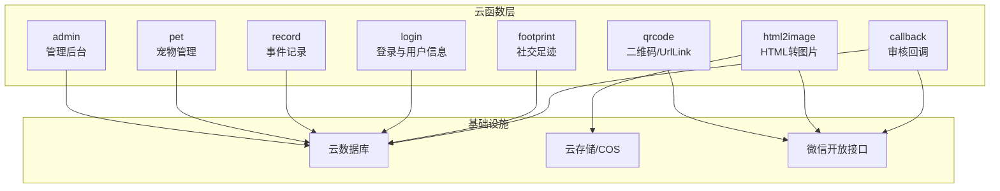
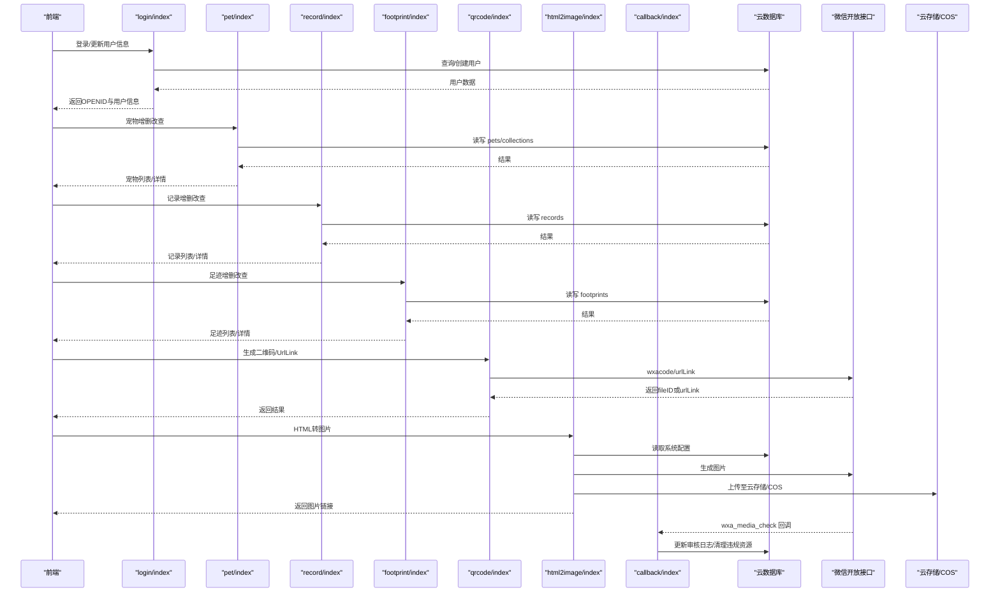
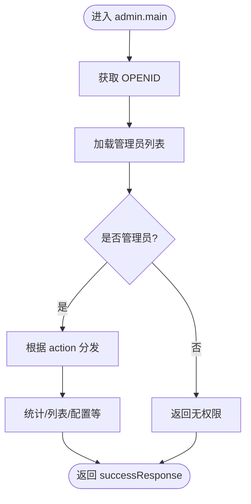
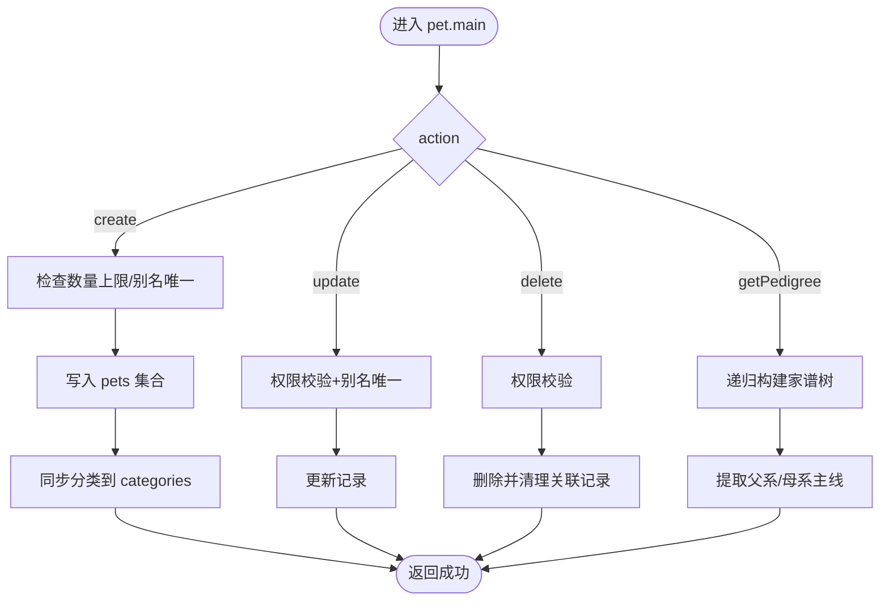
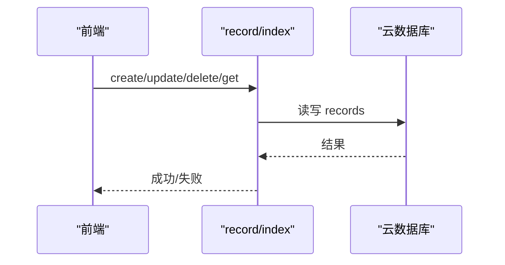
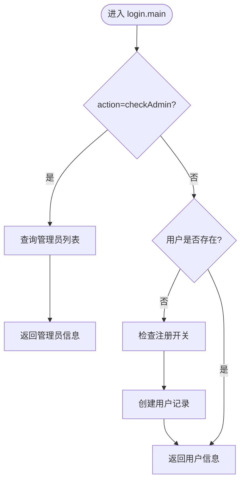
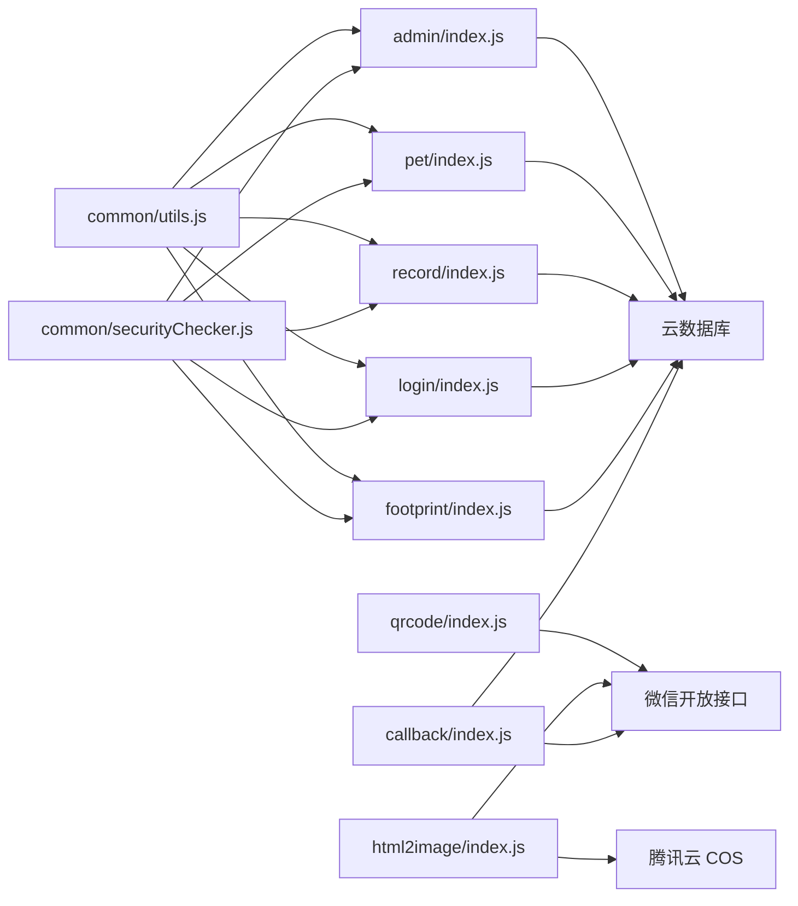

# 后端架构

<cite>
**本文引用的文件**   
- [cloudfunctions/admin/index.js](file://cloudfunctions/admin/index.js)
- [cloudfunctions/pet/index.js](file://cloudfunctions/pet/index.js)
- [cloudfunctions/record/index.js](file://cloudfunctions/record/index.js)
- [cloudfunctions/login/index.js](file://cloudfunctions/login/index.js)
- [cloudfunctions/footprint/index.js](file://cloudfunctions/footprint/index.js)
- [cloudfunctions/qrcode/index.js](file://cloudfunctions/qrcode/index.js)
- [cloudfunctions/html2image/index.js](file://cloudfunctions/html2image/index.js)
- [cloudfunctions/callback/index.js](file://cloudfunctions/callback/index.js)
- [cloudfunctions/common/utils.js](file://cloudfunctions/common/utils.js)
- [cloudfunctions/common/securityChecker.js](file://cloudfunctions/common/securityChecker.js)
- [cloudfunctions/admin/config.json](file://cloudfunctions/admin/config.json)
- [cloudfunctions/pet/config.json](file://cloudfunctions/pet/config.json)
- [cloudfunctions/record/config.json](file://cloudfunctions/record/config.json)
- [cloudfunctions/login/config.json](file://cloudfunctions/login/config.json)
- [cloudfunctions/footprint/config.json](file://cloudfunctions/footprint/config.json)
</cite>

## 目录
1. [引言](#引言)
2. [项目结构](#项目结构)
3. [核心组件](#核心组件)
4. [架构总览](#架构总览)
5. [详细组件分析](#详细组件分析)
6. [依赖分析](#依赖分析)
7. [性能考虑](#性能考虑)
8. [故障排查指南](#故障排查指南)
9. [结论](#结论)
10. [附录](#附录)

## 引言
本文件面向“养龟档案”项目的后端架构，聚焦于腾讯云函数（云开发）的模块化组织、服务间通信机制、数据处理流程与生命周期管理。文档从系统架构、组件职责、数据流与依赖关系出发，结合云数据库与云存储的集成方式，给出可操作的扩展性、性能优化与安全防护建议，并提供架构图与数据处理流程图以帮助读者快速把握整体设计。

## 项目结构
后端采用“云函数即服务”的无服务器架构，按业务域划分多个独立的云函数目录，每个云函数负责单一职责，通过统一的数据库与云存储进行数据交互。公共工具与安全组件被抽取为通用模块，供各云函数复用。

图表来源
- [cloudfunctions/admin/index.js:27-71](file://cloudfunctions/admin/index.js#L27-L71)
- [cloudfunctions/pet/index.js:45-82](file://cloudfunctions/pet/index.js#L45-L82)
- [cloudfunctions/record/index.js:10-35](file://cloudfunctions/record/index.js#L10-L35)
- [cloudfunctions/login/index.js:38-147](file://cloudfunctions/login/index.js#L38-L147)
- [cloudfunctions/footprint/index.js:9-32](file://cloudfunctions/footprint/index.js#L9-L32)
- [cloudfunctions/qrcode/index.js:7-22](file://cloudfunctions/qrcode/index.js#L7-L22)
- [cloudfunctions/html2image/index.js:14-27](file://cloudfunctions/html2image/index.js#L14-L27)
- [cloudfunctions/callback/index.js:42-52](file://cloudfunctions/callback/index.js#L42-L52)

章节来源
- [cloudfunctions/admin/index.js:1-71](file://cloudfunctions/admin/index.js#L1-L71)
- [cloudfunctions/pet/index.js:1-82](file://cloudfunctions/pet/index.js#L1-L82)
- [cloudfunctions/record/index.js:1-35](file://cloudfunctions/record/index.js#L1-L35)
- [cloudfunctions/login/index.js:1-147](file://cloudfunctions/login/index.js#L1-L147)
- [cloudfunctions/footprint/index.js:1-32](file://cloudfunctions/footprint/index.js#L1-L32)
- [cloudfunctions/qrcode/index.js:1-22](file://cloudfunctions/qrcode/index.js#L1-L22)
- [cloudfunctions/html2image/index.js:1-27](file://cloudfunctions/html2image/index.js#L1-L27)
- [cloudfunctions/callback/index.js:1-52](file://cloudfunctions/callback/index.js#L1-L52)

## 核心组件
- 云函数入口与路由
  - 各云函数均以 exports.main 作为统一入口，通过 event.action 分发具体操作，返回统一的成功/失败响应结构。
- 数据库与上下文
  - 通过 wx-server-sdk 初始化环境，使用 cloud.database() 获取数据库实例；通过 cloud.getWXContext() 获取 OPENID 等上下文信息，用于鉴权与数据隔离。
- 公共工具
  - utils.js 提供 getDB/getOpenId/successResponse/errorResponse/normalizeId 等通用方法，降低重复代码。
- 安全与内容审核
  - securityChecker.js 封装图片/文本审核与异步回调处理，支持将 cloud:// 文件ID转换为临时URL并调用微信安全接口，同时记录审核日志并在不通过时清理违规资源。

章节来源
- [cloudfunctions/common/utils.js:1-69](file://cloudfunctions/common/utils.js#L1-L69)
- [cloudfunctions/common/securityChecker.js:1-226](file://cloudfunctions/common/securityChecker.js#L1-L226)

## 架构总览
下图展示了云函数之间的典型调用关系与数据流向：前端通过云函数发起请求，云函数读写云数据库，必要时调用微信开放接口或云存储，部分异步流程通过回调云函数处理。

图表来源
- [cloudfunctions/login/index.js:38-147](file://cloudfunctions/login/index.js#L38-L147)
- [cloudfunctions/pet/index.js:45-82](file://cloudfunctions/pet/index.js#L45-L82)
- [cloudfunctions/record/index.js:10-35](file://cloudfunctions/record/index.js#L10-L35)
- [cloudfunctions/footprint/index.js:9-32](file://cloudfunctions/footprint/index.js#L9-L32)
- [cloudfunctions/qrcode/index.js:7-22](file://cloudfunctions/qrcode/index.js#L7-L22)
- [cloudfunctions/html2image/index.js:14-27](file://cloudfunctions/html2image/index.js#L14-L27)
- [cloudfunctions/callback/index.js:42-52](file://cloudfunctions/callback/index.js#L42-L52)

## 详细组件分析

### 管理后台云函数（admin）
- 职责
  - 管理员鉴权、系统统计、用户/宠物/足迹管理、配置维护等。
- 关键流程
  - 通过 getAdmins 从数据库加载管理员列表，结合 OPENID 鉴权。
  - 并行查询多集合统计信息，计算当日活跃、用户/宠物增长率等。
  - 支持用户封禁/解封联动更新封禁名单。
- 错误处理
  - 数据库查询失败时回退到兜底管理员列表；统一返回 errorResponse。

图表来源
- [cloudfunctions/admin/index.js:27-71](file://cloudfunctions/admin/index.js#L27-L71)
- [cloudfunctions/admin/index.js:17-25](file://cloudfunctions/admin/index.js#L17-L25)

章节来源
- [cloudfunctions/admin/index.js:1-71](file://cloudfunctions/admin/index.js#L1-L71)

### 宠物管理云函数（pet）
- 职责
  - 宠物增删改查、公开档案、谱系查询、分类管理。
- 关键流程
  - 创建宠物前检查系统配置与数量上限；别名唯一性校验。
  - 更新/删除前进行权限校验（仅本人 OPENID）。
  - 家谱树递归查询，提取父系/母系主线并统计谱系信息。
  - 分类同步：新增宠物时将分类同步到 categories 集合。
- 错误处理
  - 统一抛错并由外层捕获返回 errorResponse。

图表来源
- [cloudfunctions/pet/index.js:84-138](file://cloudfunctions/pet/index.js#L84-L138)
- [cloudfunctions/pet/index.js:193-250](file://cloudfunctions/pet/index.js#L193-L250)
- [cloudfunctions/pet/index.js:376-412](file://cloudfunctions/pet/index.js#L376-L412)
- [cloudfunctions/pet/index.js:517-634](file://cloudfunctions/pet/index.js#L517-L634)

章节来源
- [cloudfunctions/pet/index.js:1-723](file://cloudfunctions/pet/index.js#L1-L723)

### 事件记录云函数（record）
- 职责
  - 日常/产蛋/出苗/交配等事件记录的增删改查。
- 关键流程
  - 根据记录类型附加相应字段（如产蛋数、受精数、出芽数等）。
  - 权限校验：仅记录创建者可更新/删除。
  - 静默更新 QR 缓存字段（updateQrBase64），避免越权。
- 错误处理
  - 统一 errorResponse，静默忽略不存在的记录（更新QR缓存场景）。

图表来源
- [cloudfunctions/record/index.js:10-35](file://cloudfunctions/record/index.js#L10-L35)
- [cloudfunctions/record/index.js:37-82](file://cloudfunctions/record/index.js#L37-L82)
- [cloudfunctions/record/index.js:124-159](file://cloudfunctions/record/index.js#L124-L159)
- [cloudfunctions/record/index.js:162-190](file://cloudfunctions/record/index.js#L162-L190)

章节来源
- [cloudfunctions/record/index.js:1-191](file://cloudfunctions/record/index.js#L1-L191)

### 登录与用户信息云函数（login）
- 职责
  - 登录态校验、管理员身份检查、用户信息与公开名片更新。
- 关键流程
  - 通过 wx-server-sdk 获取 OPENID/UNIONID/APPID。
  - 新用户注册时检查系统配置中的注册开关；若集合不存在则降级返回 openid。
  - 支持更新用户昵称/头像/手机与公开名片字段。
- 错误处理
  - 数据库异常时仍返回 openid 与警告信息，保证前端可用性。

图表来源
- [cloudfunctions/login/index.js:38-147](file://cloudfunctions/login/index.js#L38-L147)
- [cloudfunctions/login/index.js:24-36](file://cloudfunctions/login/index.js#L24-L36)

章节来源
- [cloudfunctions/login/index.js:1-148](file://cloudfunctions/login/index.js#L1-L148)

### 社交足迹云函数（footprint）
- 职责
  - 足迹的增删改查，支持图片数量限制与分页。
- 关键流程
  - 读取系统配置中的最大图片数，进行输入校验。
  - 权限校验：仅本人 OPENID 可操作。
- 错误处理
  - 统一 errorResponse，拒绝越权与非法操作。

章节来源
- [cloudfunctions/footprint/index.js:1-160](file://cloudfunctions/footprint/index.js#L1-L160)

### 二维码与 UrlLink 云函数（qrcode）
- 职责
  - 生成小程序码（wxacode.get）并上传云存储；生成 UrlLink（urlLink.generate），兼容多环境。
- 关键流程
  - 生成二维码：调用微信接口，上传到云存储，返回 fileID。
  - 生成 UrlLink：多环境尝试，失败时回退到静态链接。
- 错误处理
  - 捕获错误并返回详细信息，便于前端定位问题。

章节来源
- [cloudfunctions/qrcode/index.js:1-117](file://cloudfunctions/qrcode/index.js#L1-L117)

### HTML 转图片云函数（html2image）
- 职责
  - 调用外部图片生成服务，支持将图片上传至云存储或腾讯云 COS。
- 关键流程
  - 读取系统配置（服务地址、超时、COS 凭证等）。
  - 请求外部服务生成图片，可选上传至 COS 或云存储。
- 错误处理
  - 外部服务失败时返回错误；COS 上传失败不影响主流程。

章节来源
- [cloudfunctions/html2image/index.js:1-205](file://cloudfunctions/html2image/index.js#L1-L205)

### 审核回调云函数（callback）
- 职责
  - 接收微信异步审核结果，更新审核日志，清理违规资源并发送通知。
- 关键流程
  - 根据 trace_id 查找对应日志，更新状态为通过/失败。
  - 不通过时删除云存储文件，从业务数据中移除引用，创建通知记录。
- 错误处理
  - 未找到日志时记录告警；清理与通知失败时记录错误但不中断流程。

章节来源
- [cloudfunctions/callback/index.js:1-223](file://cloudfunctions/callback/index.js#L1-L223)

## 依赖分析
- 模块内聚与耦合
  - 各云函数围绕单一业务域，内部逻辑清晰；通过公共 utils 与 securityChecker 解耦通用能力。
- 外部依赖
  - 微信开放接口：wxacode、urlLink、security.mediaCheckAsync、security.msgSecCheck。
  - 云存储：云开发存储与腾讯云 COS。
  - 外部服务：HTML 转图片服务（通过系统配置注入）。
- 配置与权限
  - 各云函数目录包含 config.json，目前 permissions 为空数组，表示默认权限策略；可在云开发控制台按需开启所需 openapi 权限。

图表来源
- [cloudfunctions/common/utils.js:1-69](file://cloudfunctions/common/utils.js#L1-L69)
- [cloudfunctions/common/securityChecker.js:1-226](file://cloudfunctions/common/securityChecker.js#L1-L226)
- [cloudfunctions/admin/index.js:1-71](file://cloudfunctions/admin/index.js#L1-L71)
- [cloudfunctions/pet/index.js:1-82](file://cloudfunctions/pet/index.js#L1-L82)
- [cloudfunctions/record/index.js:1-35](file://cloudfunctions/record/index.js#L1-L35)
- [cloudfunctions/login/index.js:1-147](file://cloudfunctions/login/index.js#L1-L147)
- [cloudfunctions/footprint/index.js:1-32](file://cloudfunctions/footprint/index.js#L1-L32)
- [cloudfunctions/qrcode/index.js:1-22](file://cloudfunctions/qrcode/index.js#L1-L22)
- [cloudfunctions/html2image/index.js:1-27](file://cloudfunctions/html2image/index.js#L1-L27)
- [cloudfunctions/callback/index.js:1-52](file://cloudfunctions/callback/index.js#L1-L52)

章节来源
- [cloudfunctions/admin/config.json:1-6](file://cloudfunctions/admin/config.json#L1-L6)
- [cloudfunctions/pet/config.json:1-6](file://cloudfunctions/pet/config.json#L1-L6)
- [cloudfunctions/record/config.json:1-6](file://cloudfunctions/record/config.json#L1-L6)
- [cloudfunctions/login/config.json:1-6](file://cloudfunctions/login/config.json#L1-L6)
- [cloudfunctions/footprint/config.json:1-6](file://cloudfunctions/footprint/config.json#L1-L6)

## 性能考虑
- 并发与批量操作
  - 管理后台统计使用 Promise.all 并行查询多集合，减少往返延迟。
  - 宠物列表与足迹列表支持分页与排序，避免一次性拉取大量数据。
- 数据净化与索引
  - 宠物图片 URL 清洗与批量查询用户信息，减少前端二次处理成本。
  - 建议在 users/pets/records/footprints 等常用查询字段建立索引，提升查询性能。
- 存储与网络
  - HTML 转图片支持上传至 COS，可结合 CDN 加速；失败时回退本地生成，保障可用性。
- 云函数冷启动
  - 将初始化逻辑集中在入口处，避免在热路径重复初始化；合理设置超时与内存上限。

## 故障排查指南
- 常见问题定位
  - 无权限：确认 OPENID 是否匹配记录创建者；检查管理员列表加载是否成功。
  - 注册失败：检查 systemConfig 中 allowRegister；当集合不存在时会降级返回 openid。
  - 审核不通过：查看 security_logs 中 trace_id 与 label；确认回调云函数是否正确处理。
  - 二维码/UrlLink 生成失败：检查微信开放接口权限与多环境配置；查看错误码与错误信息。
  - HTML 转图片失败：检查 imageServerUrl 与 imageTimeout；COS 上传失败不影响主流程。
- 日志与监控
  - 各云函数均输出错误日志；建议在云开发控制台查看实时日志与调用指标。
  - 审核回调云函数会记录清理与通知过程，便于审计与复盘。

章节来源
- [cloudfunctions/login/index.js:92-128](file://cloudfunctions/login/index.js#L92-L128)
- [cloudfunctions/callback/index.js:42-52](file://cloudfunctions/callback/index.js#L42-L52)
- [cloudfunctions/qrcode/index.js:49-60](file://cloudfunctions/qrcode/index.js#L49-L60)
- [cloudfunctions/html2image/index.js:132-139](file://cloudfunctions/html2image/index.js#L132-L139)

## 结论
该项目采用云函数即服务的轻量架构，通过清晰的模块划分与通用工具/安全组件，实现了高内聚、低耦合的服务体系。云数据库与云存储的无缝集成，配合微信开放接口，满足了从用户管理、宠物档案到社交分享与内容安全的完整需求。后续可在索引优化、异步任务与可观测性方面进一步增强系统的稳定性与可运维性。

## 附录
- 配置项参考（来自系统配置与云函数）
  - 注册开关、最大宠物数、最大足迹图片数、图片服务地址与超时、COS 凭证与区域、ASR 配置等。
- 权限配置
  - 各云函数目录的 config.json 当前 permissions 为空数组，建议在云开发控制台按需开启所需 openapi 权限。

章节来源
- [cloudfunctions/admin/index.js:434-473](file://cloudfunctions/admin/index.js#L434-L473)
- [cloudfunctions/html2image/index.js:29-55](file://cloudfunctions/html2image/index.js#L29-L55)
- [cloudfunctions/admin/config.json:1-6](file://cloudfunctions/admin/config.json#L1-L6)
- [cloudfunctions/pet/config.json:1-6](file://cloudfunctions/pet/config.json#L1-L6)
- [cloudfunctions/record/config.json:1-6](file://cloudfunctions/record/config.json#L1-L6)
- [cloudfunctions/login/config.json:1-6](file://cloudfunctions/login/config.json#L1-L6)
- [cloudfunctions/footprint/config.json:1-6](file://cloudfunctions/footprint/config.json#L1-L6)