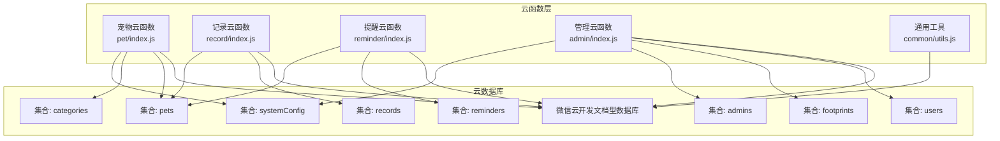
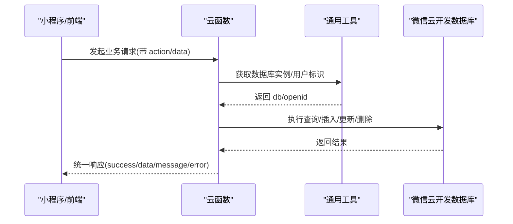
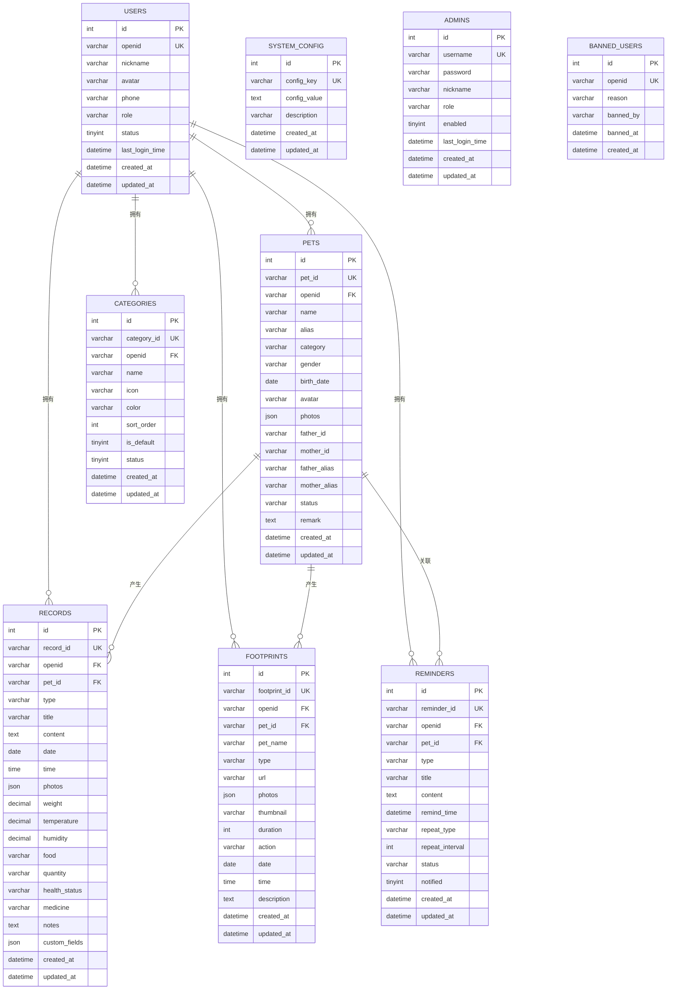
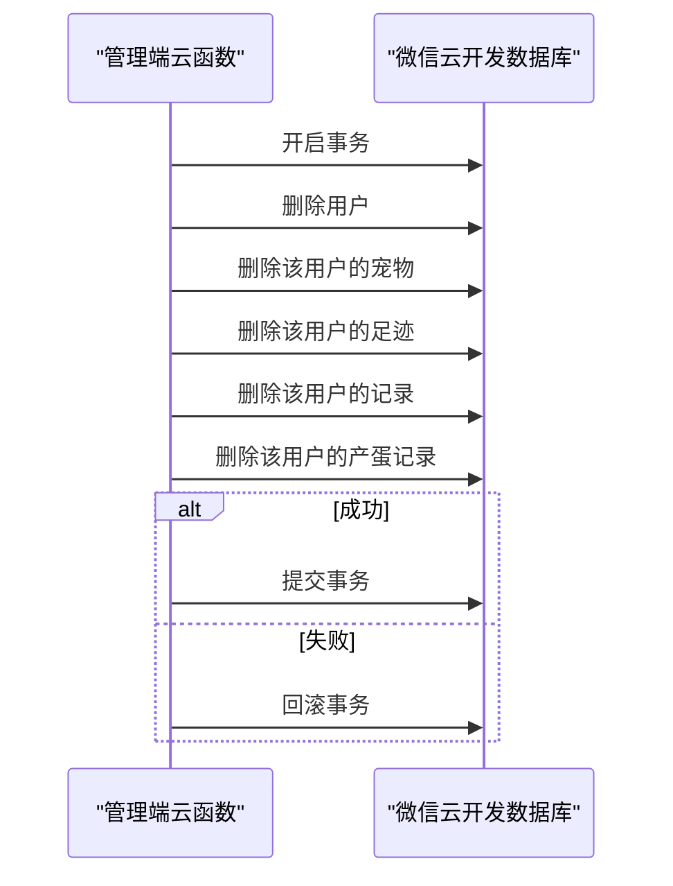
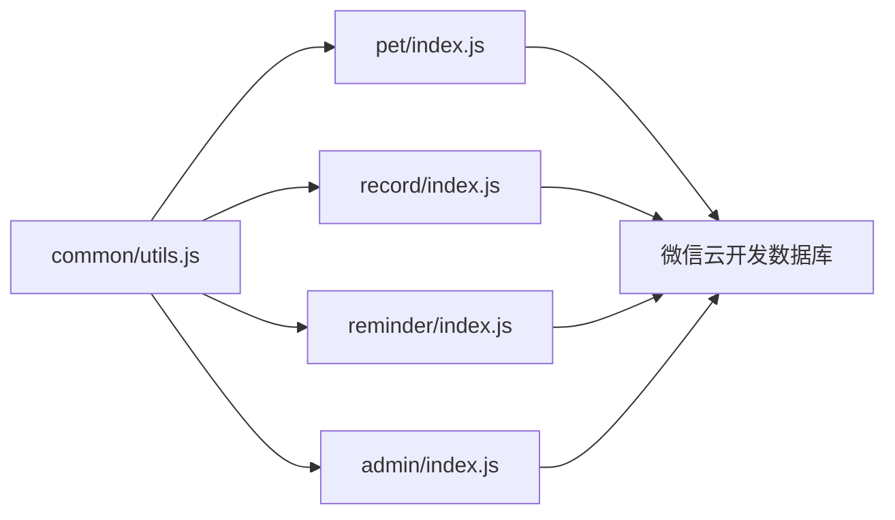

# 数据库架构

<cite>
**本文引用的文件**
- [database.sql](file://server-setup/database.sql)
- [setup.sh](file://server-setup/setup.sh)
- [utils.js](file://cloudfunctions/common/utils.js)
- [pet/index.js](file://cloudfunctions/pet/index.js)
- [record/index.js](file://cloudfunctions/record/index.js)
- [reminder/index.js](file://cloudfunctions/reminder/index.js)
- [admin/index.js](file://cloudfunctions/admin/index.js)
</cite>

## 目录
1. [简介](#简介)
2. [项目结构](#项目结构)
3. [核心组件](#核心组件)
4. [架构总览](#架构总览)
5. [详细组件分析](#详细组件分析)
6. [依赖分析](#依赖分析)
7. [性能考虑](#性能考虑)
8. [故障排查指南](#故障排查指南)
9. [结论](#结论)
10. [附录](#附录)

## 简介
本文件面向“养龟档案”项目的云数据库与数据访问层，系统化梳理数据库表结构、字段定义、索引策略；阐明宠物、记录、用户、提醒等核心实体的关系模型与外键约束；总结数据访问层的连接与事务处理模式；给出数据模型演进与迁移策略建议，并提供查询优化、索引设计与缓存策略的实践指导。

## 项目结构
- 云数据库采用微信云开发（Serverless）文档型数据库，对应后端云函数通过统一工具初始化数据库连接与上下文。
- 本地部署脚本提供 MySQL 8.0 的数据库与用户创建流程，便于本地或传统环境下的数据准备与迁移对照。

**图表来源**
- [pet/index.js:1-82](file://cloudfunctions/pet/index.js#L1-L82)
- [record/index.js:1-35](file://cloudfunctions/record/index.js#L1-L35)
- [reminder/index.js:1-37](file://cloudfunctions/reminder/index.js#L1-L37)
- [admin/index.js:40-71](file://cloudfunctions/admin/index.js#L40-L71)
- [utils.js:1-13](file://cloudfunctions/common/utils.js#L1-L13)

**章节来源**
- [setup.sh:83-98](file://server-setup/setup.sh#L83-L98)

## 核心组件
- 用户表（users）：存储小程序用户基础信息，主键自增，唯一索引 openid，辅助索引 phone、status。
- 宠物表（pets）：存储宠物档案，主键自增，唯一索引 pet_id，辅助索引 openid、category、status、created_at。
- 记录表（records）：存储各类事件记录，主键自增，唯一索引 record_id，辅助索引 openid、pet_id、type、date、created_at。
- 足迹表（footprints）：存储媒体足迹，主键自增，唯一索引 footprint_id，辅助索引 openid、pet_id、date、created_at。
- 提醒表（reminders）：存储周期提醒，主键自增，唯一索引 reminder_id，辅助索引 openid、pet_id、remind_time、status。
- 分类表（categories）：存储用户分类，主键自增，唯一索引 category_id，辅助索引 openid、status。
- 系统配置表（system_config）：存储系统配置项，主键自增，唯一索引 config_key。
- 管理员表（admins）：存储后台管理员账号，主键自增，唯一索引 username。
- 黑名单表（banned_users）：存储封禁用户，主键自增，唯一索引 openid。

**章节来源**
- [database.sql:11-26](file://server-setup/database.sql#L11-L26)
- [database.sql:50-76](file://server-setup/database.sql#L50-L76)
- [database.sql:79-109](file://server-setup/database.sql#L79-L109)
- [database.sql:112-136](file://server-setup/database.sql#L112-L136)
- [database.sql:139-161](file://server-setup/database.sql#L139-L161)
- [database.sql:164-181](file://server-setup/database.sql#L164-L181)
- [database.sql:184-194](file://server-setup/database.sql#L184-L194)
- [database.sql:29-42](file://server-setup/database.sql#L29-L42)
- [database.sql:204-214](file://server-setup/database.sql#L204-L214)

## 架构总览
- 数据访问层通过云函数统一入口调用微信云开发数据库 SDK，使用 getDB 初始化数据库实例，结合 getOpenId 获取用户标识 openid，实现按用户隔离的数据读写。
- 云函数内部封装了统一的成功/失败响应格式与错误日志输出，便于前端消费与排障。
- 管理端云函数支持事务式批量删除用户及其关联数据，保证数据一致性。

**图表来源**
- [utils.js:10-18](file://cloudfunctions/common/utils.js#L10-L18)
- [pet/index.js:45-82](file://cloudfunctions/pet/index.js#L45-L82)
- [record/index.js:10-35](file://cloudfunctions/record/index.js#L10-L35)
- [reminder/index.js:10-37](file://cloudfunctions/reminder/index.js#L10-L37)

## 详细组件分析

### 关系模型与外键约束
- 当前代码库主要使用微信云开发文档型数据库，未显式声明外键约束。实际关系通过字段语义与查询条件体现：
  - pets.openid → users.openid（用户维度隔离）
  - records.openid → users.openid；records.pet_id → pets.pet_id（记录归属用户与宠物）
  - footprints.openid → users.openid；footprints.pet_id → pets.pet_id（足迹归属用户与宠物）
  - reminders.openid → users.openid；reminders.pet_id → pets.pet_id（提醒归属用户与宠物）
  - categories.openid → users.openid（分类归属用户）
- 在传统关系型数据库中，可将 openid、pet_id、record_id、footprint_id、reminder_id 等作为逻辑外键，配合唯一索引与业务校验实现参照完整性。

**图表来源**
- [database.sql:11-26](file://server-setup/database.sql#L11-L26)
- [database.sql:50-76](file://server-setup/database.sql#L50-L76)
- [database.sql:79-109](file://server-setup/database.sql#L79-L109)
- [database.sql:112-136](file://server-setup/database.sql#L112-L136)
- [database.sql:139-161](file://server-setup/database.sql#L139-L161)
- [database.sql:164-181](file://server-setup/database.sql#L164-L181)
- [database.sql:184-194](file://server-setup/database.sql#L184-L194)
- [database.sql:29-42](file://server-setup/database.sql#L29-L42)
- [database.sql:204-214](file://server-setup/database.sql#L204-L214)

### 数据访问层设计
- 连接与上下文
  - 通过通用工具初始化云开发环境并获取数据库实例，统一在云函数入口调用。
  - 从上下文提取 openid，用于按用户隔离数据。
- 事务处理
  - 管理端支持事务式批量删除用户及其关联数据，先开启事务，再删除用户、宠物、足迹、记录、产蛋记录，最后提交或回滚。
- 查询与分页
  - 宠物列表、记录列表均支持过滤、分页与总数统计，使用 where 条件构建查询链，结合 count、orderBy、skip、limit 实现。
- 错误处理
  - 统一封装错误响应，记录错误日志，便于前端展示与定位问题。

**图表来源**
- [admin/index.js:227-257](file://cloudfunctions/admin/index.js#L227-L257)

**章节来源**
- [utils.js:3-18](file://cloudfunctions/common/utils.js#L3-L18)
- [pet/index.js:140-180](file://cloudfunctions/pet/index.js#L140-L180)
- [record/index.js:84-111](file://cloudfunctions/record/index.js#L84-L111)
- [admin/index.js:227-257](file://cloudfunctions/admin/index.js#L227-L257)

### 表结构与索引策略
- 用户表（users）
  - 主键：id
  - 唯一索引：openid
  - 辅助索引：phone、status
  - 用途：用户身份识别、手机号检索、状态过滤
- 宠物表（pets）
  - 主键：id
  - 唯一索引：pet_id
  - 辅助索引：openid、category、status、created_at
  - 用途：按用户聚合、分类筛选、状态动态推导、时间倒序
- 记录表（records）
  - 主键：id
  - 唯一索引：record_id
  - 辅助索引：openid、pet_id、type、date、created_at
  - 用途：按用户/宠物/类型/日期检索、时间倒序
- 足迹表（footprints）
  - 主键：id
  - 唯一索引：footprint_id
  - 辅助索引：openid、pet_id、date、created_at
  - 用途：媒体足迹检索与时间倒序
- 提醒表（reminders）
  - 主键：id
  - 唯一索引：reminder_id
  - 辅助索引：openid、pet_id、remind_time、status
  - 用途：按用户/宠物/到期时间/状态检索
- 分类表（categories）
  - 主键：id
  - 唯一索引：category_id
  - 辅助索引：openid、status
  - 用途：用户分类与状态管理
- 系统配置表（system_config）
  - 主键：id
  - 唯一索引：config_key
  - 用途：系统参数读取
- 管理员表（admins）
  - 主键：id
  - 唯一索引：username
  - 用途：后台认证与授权
- 黑名单表（banned_users）
  - 主键：id
  - 唯一索引：openid
  - 用途：封禁用户管理

**章节来源**
- [database.sql:11-26](file://server-setup/database.sql#L11-L26)
- [database.sql:50-76](file://server-setup/database.sql#L50-L76)
- [database.sql:79-109](file://server-setup/database.sql#L79-L109)
- [database.sql:112-136](file://server-setup/database.sql#L112-L136)
- [database.sql:139-161](file://server-setup/database.sql#L139-L161)
- [database.sql:164-181](file://server-setup/database.sql#L164-L181)
- [database.sql:184-194](file://server-setup/database.sql#L184-L194)
- [database.sql:29-42](file://server-setup/database.sql#L29-L42)
- [database.sql:204-214](file://server-setup/database.sql#L204-L214)

### 数据模型演进与版本管理
- 版本字段：系统配置表包含 version 字段，可用于记录当前系统版本，便于迁移脚本判断执行条件。
- 默认配置：系统启动时插入若干默认配置项（如提醒开关、最大图片数、版本号），可在升级时作为迁移依据。
- 建议策略：
  - 引入版本号与迁移脚本，按版本增量更新表结构与索引。
  - 对于新增列，采用非空+默认值或可空策略，并在应用层兼容旧数据。
  - 对于索引变更，优先评估查询负载，必要时分批上线并监控性能。

**章节来源**
- [database.sql:196-201](file://server-setup/database.sql#L196-L201)

### 数据迁移策略
- 本地导入：通过数据库 SQL 文件导入表结构与初始数据，适合本地开发与测试环境。
- 环境准备：安装脚本创建数据库与用户，授予相应权限，便于一键部署。
- 迁移路径：
  - 从文档型数据库迁移到关系型数据库时，需映射集合到表、字段到列、索引到索引。
  - 保持唯一键（如 openid、pet_id、record_id 等）不变，确保业务逻辑兼容。
  - 对 JSON 字段（如 photos、custom_fields）在关系型数据库中可采用 JSON 类型或拆分为独立表，视查询需求而定。

**章节来源**
- [database.sql:1-221](file://server-setup/database.sql#L1-L221)
- [setup.sh:83-98](file://server-setup/setup.sh#L83-L98)

## 依赖分析
- 云函数依赖通用工具模块提供的数据库初始化与上下文解析能力。
- 宠物、记录、提醒云函数分别依赖各自集合进行 CRUD 操作。
- 管理端云函数依赖事务能力，串联多个集合的删除操作。

**图表来源**
- [utils.js:1-13](file://cloudfunctions/common/utils.js#L1-L13)
- [pet/index.js:1-10](file://cloudfunctions/pet/index.js#L1-L10)
- [record/index.js:1-10](file://cloudfunctions/record/index.js#L1-L10)
- [reminder/index.js:1-10](file://cloudfunctions/reminder/index.js#L1-L10)
- [admin/index.js:1-10](file://cloudfunctions/admin/index.js#L1-L10)

**章节来源**
- [utils.js:1-13](file://cloudfunctions/common/utils.js#L1-L13)
- [pet/index.js:1-10](file://cloudfunctions/pet/index.js#L1-L10)
- [record/index.js:1-10](file://cloudfunctions/record/index.js#L1-L10)
- [reminder/index.js:1-10](file://cloudfunctions/reminder/index.js#L1-L10)
- [admin/index.js:1-10](file://cloudfunctions/admin/index.js#L1-L10)

## 性能考虑
- 查询优化
  - 使用合适的索引覆盖常见过滤条件（openid、pet_id、type、date、status、remind_time）。
  - 对时间范围查询（date、created_at）建立复合索引，减少全表扫描。
  - 对 JSON 字段（photos、custom_fields）避免在查询中频繁解析，必要时拆表或预处理。
- 索引设计
  - 唯一索引保障业务唯一性（openid、pet_id、record_id、footprint_id、reminder_id、username、config_key）。
  - 辅助索引支撑高频查询（phone、status、category、repeat_type）。
- 缓存策略
  - 对热点数据（如用户配置、常用分类）引入应用层缓存，降低数据库压力。
  - 对图片 URL 进行净化与持久化（cloud://fileID），减少临时链接失效带来的重试。
- 事务与并发
  - 管理端批量删除使用事务，确保原子性；对高并发场景建议限流与重试策略。
- 分页与排序
  - 使用 orderBy + limit + skip 实现分页，注意大偏移量场景的性能影响，可考虑游标分页或基于时间戳的增量拉取。

## 故障排查指南
- 常见错误与处理
  - 权限不足/记录不存在：多数读写接口在获取文档后会校验 openid 或存在性，返回明确错误信息。
  - 集合不存在：提醒云函数在新增时对集合存在性做兜底处理，若仍报错，需在云开发控制台手动创建集合。
  - 重复提醒：同一宠物+类型在同一用户下不允许重复，创建前会做去重校验。
  - 事务失败：管理端删除用户时捕获异常并回滚，检查日志定位具体失败点。
- 日志与响应
  - 统一错误响应包含 message 与 error 字段，便于前端展示与定位问题。
  - 建议在生产环境开启数据库与云函数日志采集，定期巡检慢查询与异常。

**章节来源**
- [reminder/index.js:39-52](file://cloudfunctions/reminder/index.js#L39-L52)
- [reminder/index.js:63-77](file://cloudfunctions/reminder/index.js#L63-L77)
- [reminder/index.js:94-100](file://cloudfunctions/reminder/index.js#L94-L100)
- [pet/index.js:182-190](file://cloudfunctions/pet/index.js#L182-L190)
- [record/index.js:113-121](file://cloudfunctions/record/index.js#L113-L121)
- [admin/index.js:227-257](file://cloudfunctions/admin/index.js#L227-L257)
- [utils.js:28-35](file://cloudfunctions/common/utils.js#L28-L35)

## 结论
本项目采用微信云开发文档型数据库，围绕 openid 与实体主键（pet_id、record_id、footprint_id、reminder_id）实现用户与数据的强隔离。通过合理的索引设计与查询模式，满足日常增删改查与统计分析需求。建议在演进过程中完善版本化迁移策略、引入应用层缓存与慢查询治理，持续提升系统稳定性与性能表现。

## 附录
- SQL 示例（基于现有表结构）
  - 创建用户表
    - [database.sql:11-26](file://server-setup/database.sql#L11-L26)
  - 创建宠物表
    - [database.sql:50-76](file://server-setup/database.sql#L50-L76)
  - 创建记录表
    - [database.sql:79-109](file://server-setup/database.sql#L79-L109)
  - 创建足迹表
    - [database.sql:112-136](file://server-setup/database.sql#L112-L136)
  - 创建提醒表
    - [database.sql:139-161](file://server-setup/database.sql#L139-L161)
  - 创建分类表
    - [database.sql:164-181](file://server-setup/database.sql#L164-L181)
  - 创建系统配置表
    - [database.sql:184-194](file://server-setup/database.sql#L184-L194)
  - 创建管理员表
    - [database.sql:29-42](file://server-setup/database.sql#L29-L42)
  - 创建黑名单表
    - [database.sql:204-214](file://server-setup/database.sql#L204-L214)
- 部署与初始化
  - 数据库与用户创建
    - [setup.sh:83-98](file://server-setup/setup.sh#L83-L98)
  - 数据库导入
    - [database.sql](file://server-setup/database.sql#L3)