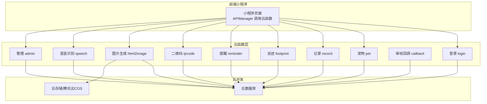
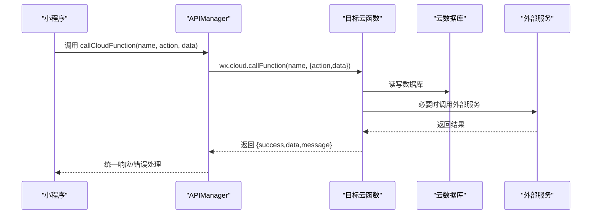
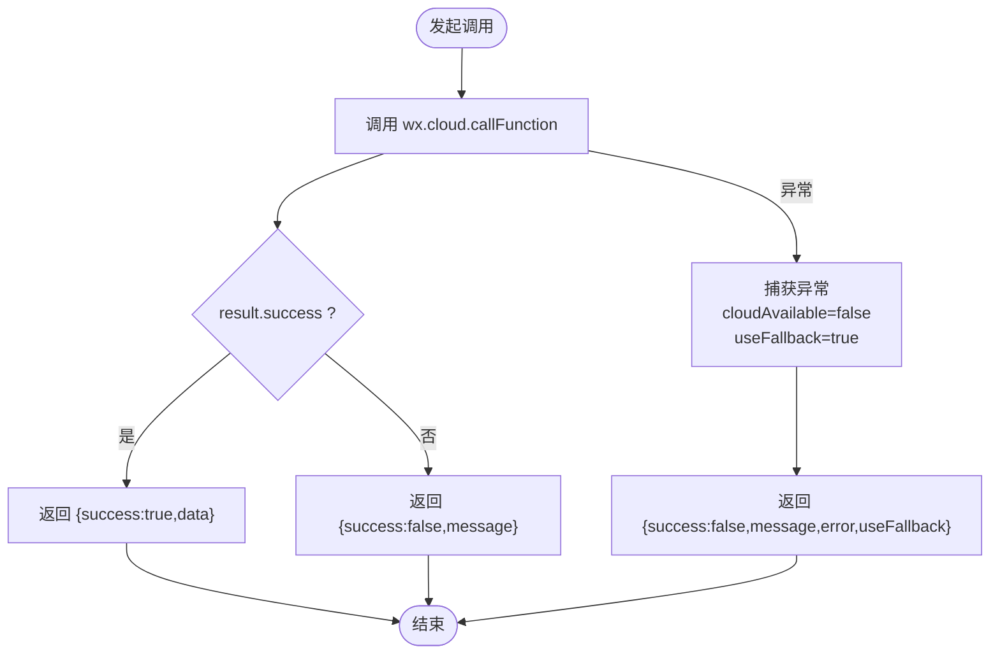
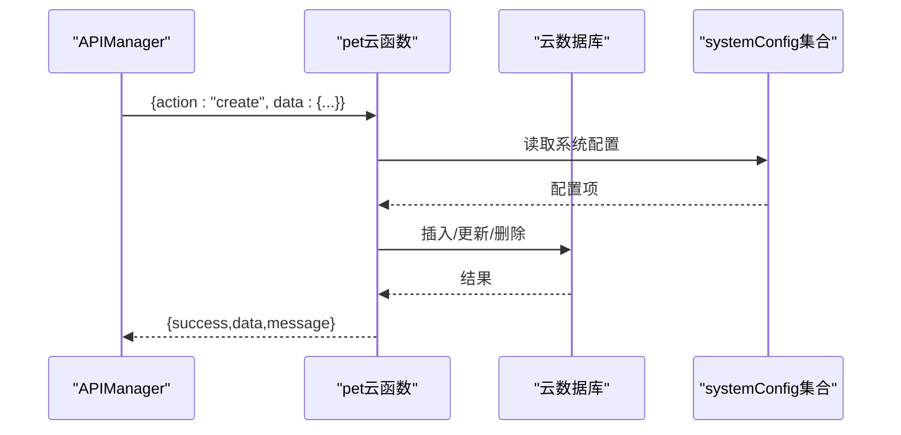
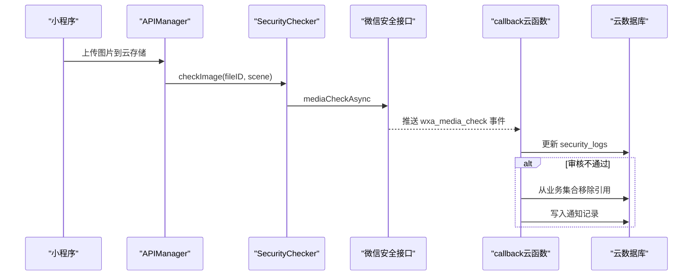
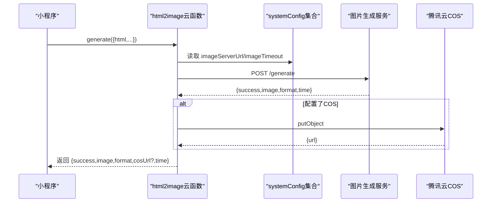
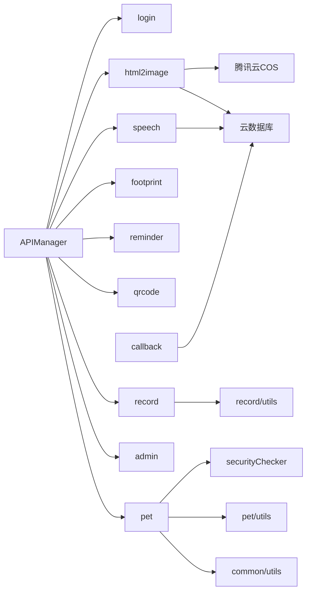

# 服务通信

<cite>
**本文引用的文件**
- [cloudfunctions/admin/index.js](file://cloudfunctions/admin/index.js)
- [cloudfunctions/callback/index.js](file://cloudfunctions/callback/index.js)
- [cloudfunctions/login/index.js](file://cloudfunctions/login/index.js)
- [cloudfunctions/pet/index.js](file://cloudfunctions/pet/index.js)
- [cloudfunctions/record/index.js](file://cloudfunctions/record/index.js)
- [cloudfunctions/footprint/index.js](file://cloudfunctions/footprint/index.js)
- [cloudfunctions/reminder/index.js](file://cloudfunctions/reminder/index.js)
- [cloudfunctions/html2image/index.js](file://cloudfunctions/html2image/index.js)
- [cloudfunctions/qrcode/index.js](file://cloudfunctions/qrcode/index.js)
- [cloudfunctions/speech/index.js](file://cloudfunctions/speech/index.js)
- [cloudfunctions/common/utils.js](file://cloudfunctions/common/utils.js)
- [cloudfunctions/security/securityChecker.js](file://cloudfunctions/security/securityChecker.js)
- [cloudfunctions/record/utils.js](file://cloudfunctions/record/utils.js)
- [cloudfunctions/pet/utils.js](file://cloudfunctions/pet/utils.js)
- [miniprogram/utils/api.js](file://miniprogram/utils/api.js)
</cite>

## 目录
1. [引言](#引言)
2. [项目结构](#项目结构)
3. [核心组件](#核心组件)
4. [架构总览](#架构总览)
5. [详细组件分析](#详细组件分析)
6. [依赖关系分析](#依赖关系分析)
7. [性能考量](#性能考量)
8. [故障排查指南](#故障排查指南)
9. [结论](#结论)
10. [附录](#附录)

## 引言
本文件面向“养龟档案”项目，聚焦于服务通信机制与前后端 API 协议，涵盖以下主题：
- 云函数间的服务调用机制：同步调用、异步处理、回调机制
- 前端与后端的 API 通信协议：请求格式、响应标准、错误码定义
- 并发处理能力、负载均衡策略、超时处理机制
- 服务间的依赖关系、数据流转过程、状态管理
- 服务监控与日志记录方案：性能指标收集、异常告警、调试工具
- 具体通信示例与故障排查指南

## 项目结构
项目采用“云开发 + 小程序前端”的分层架构：
- 前端：微信小程序，通过 wx.cloud.callFunction 调用云函数
- 云函数：按业务域拆分（pet、record、footprint、reminder、login、admin、callback、qrcode、speech、html2image 等）
- 数据存储：微信云开发数据库与云存储
- 第三方服务：腾讯云 COS、语音识别（ASR）、图片生成服务（外链）

图表来源
- [miniprogram/utils/api.js:12-38](file://miniprogram/utils/api.js#L12-L38)
- [cloudfunctions/login/index.js:38-147](file://cloudfunctions/login/index.js#L38-L147)
- [cloudfunctions/pet/index.js:45-82](file://cloudfunctions/pet/index.js#L45-L82)
- [cloudfunctions/record/index.js:10-35](file://cloudfunctions/record/index.js#L10-L35)
- [cloudfunctions/footprint/index.js:9-32](file://cloudfunctions/footprint/index.js#L9-L32)
- [cloudfunctions/reminder/index.js:10-37](file://cloudfunctions/reminder/index.js#L10-L37)
- [cloudfunctions/qrcode/index.js:7-22](file://cloudfunctions/qrcode/index.js#L7-L22)
- [cloudfunctions/html2image/index.js:14-27](file://cloudfunctions/html2image/index.js#L14-L27)
- [cloudfunctions/speech/index.js:69-92](file://cloudfunctions/speech/index.js#L69-L92)
- [cloudfunctions/callback/index.js:42-52](file://cloudfunctions/callback/index.js#L42-L52)
- [cloudfunctions/admin/index.js:27-71](file://cloudfunctions/admin/index.js#L27-L71)

章节来源
- [miniprogram/utils/api.js:12-38](file://miniprogram/utils/api.js#L12-L38)
- [cloudfunctions/common/utils.js:10-18](file://cloudfunctions/common/utils.js#L10-L18)
- [cloudfunctions/security/securityChecker.js:163-190](file://cloudfunctions/security/securityChecker.js#L163-L190)

## 核心组件
- 前端 API 管理器：封装统一的云函数调用、错误处理与回退逻辑
- 通用工具模块：提供数据库连接、OPENID 获取、统一响应包装、ID 规范化
- 安全检查器：封装图片/文本审核、异步回调处理与审核日志
- 业务云函数：按领域划分，负责具体 CRUD 与业务编排

章节来源
- [miniprogram/utils/api.js:4-38](file://miniprogram/utils/api.js#L4-L38)
- [cloudfunctions/common/utils.js:20-35](file://cloudfunctions/common/utils.js#L20-L35)
- [cloudfunctions/security/securityChecker.js:30-101](file://cloudfunctions/security/securityChecker.js#L30-L101)

## 架构总览
云函数间通信以“同步调用”为主，部分场景采用“异步审核 + 回调”和“外部服务调用”。前端通过 wx.cloud.callFunction 发起请求，云函数内部可调用微信云开发 OpenAPI 或第三方 SDK。

图表来源
- [miniprogram/utils/api.js:12-38](file://miniprogram/utils/api.js#L12-L38)
- [cloudfunctions/pet/index.js:45-82](file://cloudfunctions/pet/index.js#L45-L82)
- [cloudfunctions/record/index.js:10-35](file://cloudfunctions/record/index.js#L10-L35)
- [cloudfunctions/html2image/index.js:82-98](file://cloudfunctions/html2image/index.js#L82-L98)

## 详细组件分析

### 前端 API 通信协议
- 请求格式
  - 云函数调用：wx.cloud.callFunction(name, { action, data })
  - APIManager 统一封装：callCloudFunction(name, action, data)
- 响应标准
  - 成功：{ success: true, data }
  - 失败：{ success: false, message, error?, useFallback? }
- 错误码定义
  - 云函数内部：统一返回 { success, data?, message, error? }
  - 网络/调用异常：APIManager 标记 cloudAvailable=false，并返回 useFallback

图表来源
- [miniprogram/utils/api.js:12-38](file://miniprogram/utils/api.js#L12-L38)

章节来源
- [miniprogram/utils/api.js:12-38](file://miniprogram/utils/api.js#L12-L38)

### 云函数间同步调用与业务编排
- 通用工具模块提供 getDB/getOpenId/successResponse/errorResponse，降低重复代码
- 业务云函数通过 switch(action) 分派不同操作，集中处理权限校验与数据校验
- 事务与并发：部分操作使用事务保证一致性（如删除用户时级联删除多集合）

图表来源
- [cloudfunctions/pet/index.js:84-138](file://cloudfunctions/pet/index.js#L84-L138)
- [cloudfunctions/common/utils.js:10-18](file://cloudfunctions/common/utils.js#L10-L18)

章节来源
- [cloudfunctions/common/utils.js:10-18](file://cloudfunctions/common/utils.js#L10-L18)
- [cloudfunctions/pet/index.js:84-138](file://cloudfunctions/pet/index.js#L84-L138)

### 异步处理与回调机制
- 微信异步审核回调：云函数 callback 接收微信推送的 event，解析 trace_id，更新 security_logs，并在不通过时清理违规资源与业务引用
- 图片上传后异步审核：前端上传至云存储后，调用安全检查器提交审核，审核结果通过回调云函数处理

图表来源
- [miniprogram/utils/api.js:156-178](file://miniprogram/utils/api.js#L156-L178)
- [cloudfunctions/security/securityChecker.js:70-101](file://cloudfunctions/security/securityChecker.js#L70-L101)
- [cloudfunctions/callback/index.js:42-109](file://cloudfunctions/callback/index.js#L42-L109)

章节来源
- [cloudfunctions/security/securityChecker.js:163-190](file://cloudfunctions/security/securityChecker.js#L163-L190)
- [cloudfunctions/callback/index.js:42-109](file://cloudfunctions/callback/index.js#L42-L109)

### 外部服务集成
- 图片生成服务：html2image 云函数根据 systemConfig 中的 imageServerUrl 与 imageTimeout 调用外部服务，支持上传至腾讯云 COS
- 语音识别服务：speech 云函数按配置初始化 ASR 客户端，下载音频文件后调用腾讯云 ASR 识别

图表来源
- [cloudfunctions/html2image/index.js:66-140](file://cloudfunctions/html2image/index.js#L66-L140)

章节来源
- [cloudfunctions/html2image/index.js:29-55](file://cloudfunctions/html2image/index.js#L29-L55)
- [cloudfunctions/html2image/index.js:66-140](file://cloudfunctions/html2image/index.js#L66-L140)
- [cloudfunctions/speech/index.js:94-143](file://cloudfunctions/speech/index.js#L94-L143)

### 权限与数据校验
- 登录云函数：检查是否允许注册、创建用户记录、更新用户信息与公开名片
- 管理云函数：管理员鉴权后执行统计、用户/宠物/足迹管理、系统配置更新
- 业务云函数：对关键字段进行校验（如宠物别名唯一、数量上限、图片数量限制等）

章节来源
- [cloudfunctions/login/index.js:38-147](file://cloudfunctions/login/index.js#L38-L147)
- [cloudfunctions/admin/index.js:27-71](file://cloudfunctions/admin/index.js#L27-L71)
- [cloudfunctions/pet/index.js:84-110](file://cloudfunctions/pet/index.js#L84-L110)
- [cloudfunctions/footprint/index.js:34-44](file://cloudfunctions/footprint/index.js#L34-L44)

## 依赖关系分析
- 前端依赖 APIManager 统一调用云函数，云函数依赖通用工具模块与云开发 SDK
- 安全检查器依赖微信云开发 OpenAPI 与云存储
- 外部服务依赖 systemConfig 中的配置项（URL、超时、密钥等）

图表来源
- [miniprogram/utils/api.js:12-38](file://miniprogram/utils/api.js#L12-L38)
- [cloudfunctions/common/utils.js:10-18](file://cloudfunctions/common/utils.js#L10-L18)
- [cloudfunctions/security/securityChecker.js:163-190](file://cloudfunctions/security/securityChecker.js#L163-L190)
- [cloudfunctions/html2image/index.js:14-27](file://cloudfunctions/html2image/index.js#L14-L27)
- [cloudfunctions/speech/index.js:69-92](file://cloudfunctions/speech/index.js#L69-L92)
- [cloudfunctions/callback/index.js:42-52](file://cloudfunctions/callback/index.js#L42-L52)

章节来源
- [cloudfunctions/common/utils.js:10-18](file://cloudfunctions/common/utils.js#L10-L18)
- [cloudfunctions/security/securityChecker.js:163-190](file://cloudfunctions/security/securityChecker.js#L163-L190)

## 性能考量
- 并发处理能力
  - 云函数天然支持并发，建议对热点查询使用索引与分页（如 pet/record/list）
  - 对多集合读写使用 Promise.all 并行化（如 admin 统计）
- 负载均衡策略
  - 云函数按需扩缩容，建议将耗时任务（图片生成、语音识别）下沉至独立云函数或外部服务
- 超时处理机制
  - 外部服务调用设置合理超时（html2image 使用 imageTimeout）
  - 对长耗时任务采用异步回调（微信审核、语音识别）

章节来源
- [cloudfunctions/admin/index.js:75-79](file://cloudfunctions/admin/index.js#L75-L79)
- [cloudfunctions/html2image/index.js:75-98](file://cloudfunctions/html2image/index.js#L75-L98)
- [cloudfunctions/speech/index.js:94-143](file://cloudfunctions/speech/index.js#L94-L143)

## 故障排查指南
- 常见问题定位
  - 云函数调用失败：检查 APIManager 的错误返回与 useFallback 标记
  - 审核不通过：查看 callback 云函数对 security_logs 的更新与业务引用清理
  - 图片生成失败：确认 systemConfig 中 imageServerUrl 与 imageTimeout 配置
  - 语音识别失败：确认 ASR 配置（secretId/secretKey/region）与客户端初始化
- 日志与监控
  - 云函数内使用 console.error 输出错误上下文
  - 建议接入云开发日志与告警，关注高频错误与超时
- 调试工具
  - 使用微信开发者工具的云开发面板查看调用日志与数据库状态
  - 对外部服务调用增加重试与降级策略

章节来源
- [miniprogram/utils/api.js:27-37](file://miniprogram/utils/api.js#L27-L37)
- [cloudfunctions/callback/index.js:48-51](file://cloudfunctions/callback/index.js#L48-L51)
- [cloudfunctions/html2image/index.js:132-139](file://cloudfunctions/html2image/index.js#L132-L139)
- [cloudfunctions/speech/index.js:89-91](file://cloudfunctions/speech/index.js#L89-L91)

## 结论
本项目通过统一的前端 API 管理器与标准化的云函数响应格式，实现了清晰的服务通信模型。同步调用满足大多数业务场景，异步审核与外部服务集成保障了内容安全与扩展能力。建议持续优化热点查询、引入更细粒度的监控与告警，并对长耗时任务进行异步化改造。

## 附录
- 请求与响应约定
  - 请求：wx.cloud.callFunction(name, { action, data })
  - 响应：{ success, data?, message, error? }
- 关键配置项
  - systemConfig：imageServerUrl、imageTimeout、qcloudSecretId/Key/Bucket、asrSecretId/Key/Region、maxPetCount、maxFootprintImages、allowRegister 等

章节来源
- [cloudfunctions/html2image/index.js:32-54](file://cloudfunctions/html2image/index.js#L32-L54)
- [cloudfunctions/speech/index.js:18-46](file://cloudfunctions/speech/index.js#L18-L46)
- [cloudfunctions/admin/index.js:435-473](file://cloudfunctions/admin/index.js#L435-L473)