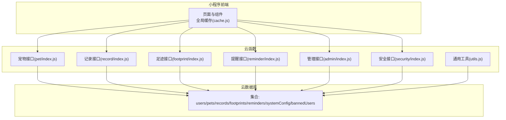
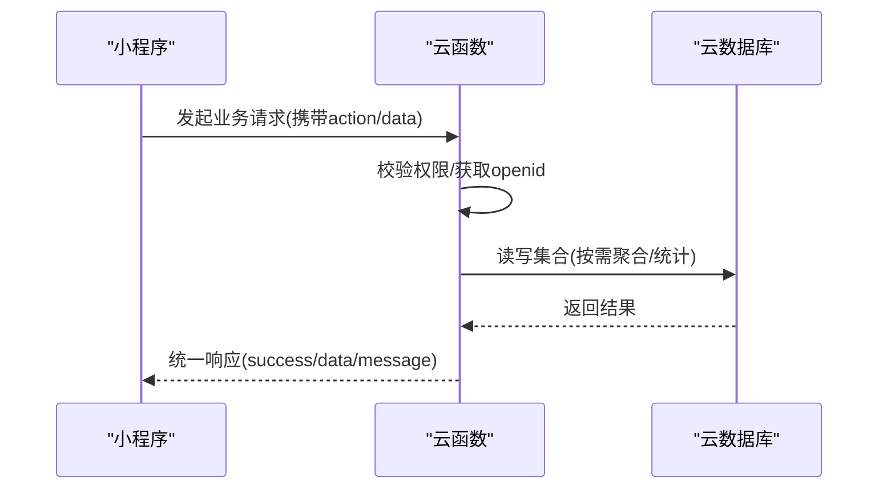
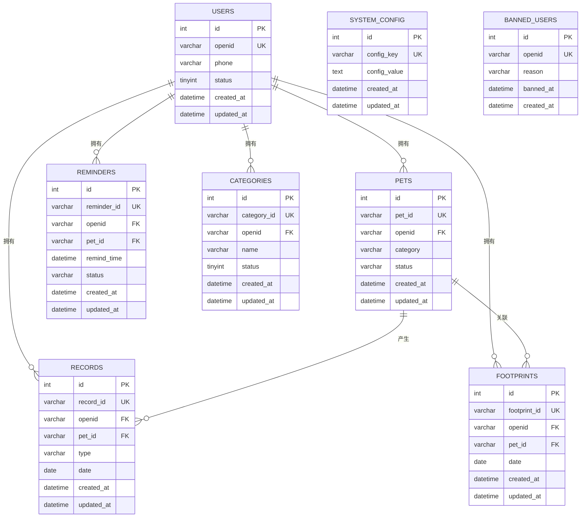
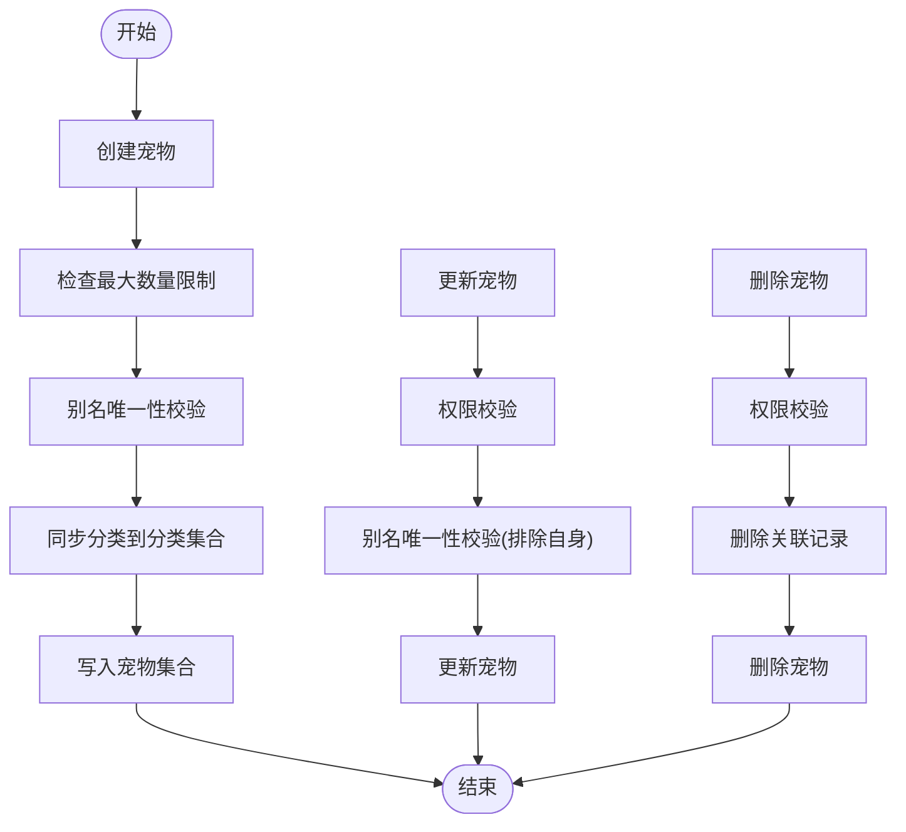
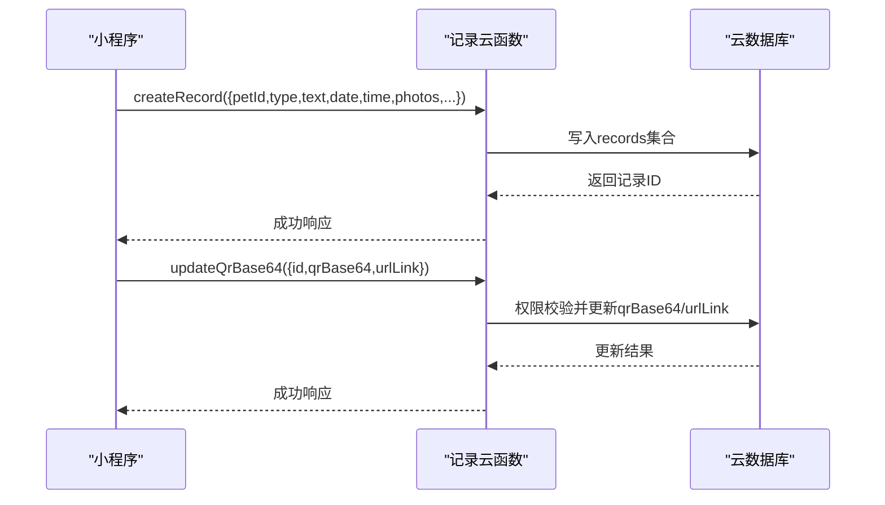
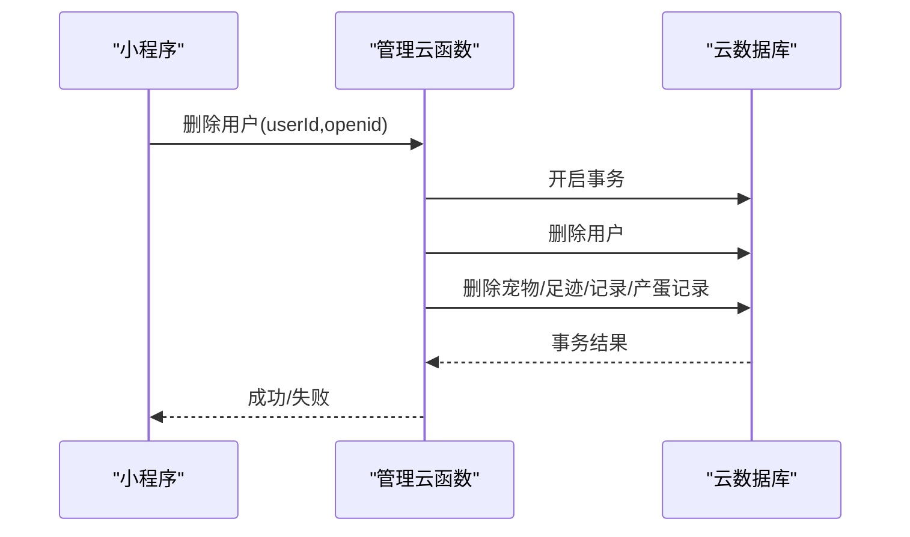
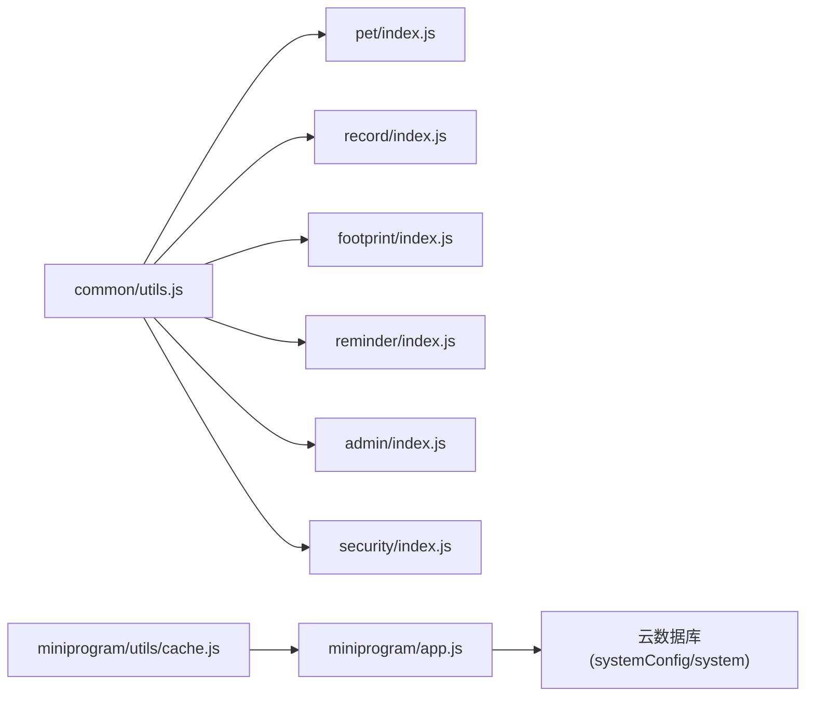

# 数据架构

<cite>
**本文引用的文件**
- [database.sql](file://server-setup/database.sql)
- [app.js](file://miniprogram/app.js)
- [cache.js](file://miniprogram/utils/cache.js)
- [utils.js](file://cloudfunctions/common/utils.js)
- [pet/index.js](file://cloudfunctions/pet/index.js)
- [pet/utils.js](file://cloudfunctions/pet/utils.js)
- [record/index.js](file://cloudfunctions/record/index.js)
- [footprint/index.js](file://cloudfunctions/footprint/index.js)
- [reminder/index.js](file://cloudfunctions/reminder/index.js)
- [admin/index.js](file://cloudfunctions/admin/index.js)
- [security/index.js](file://cloudfunctions/security/index.js)
</cite>

## 目录
1. [简介](#简介)
2. [项目结构](#项目结构)
3. [核心组件](#核心组件)
4. [架构总览](#架构总览)
5. [详细组件分析](#详细组件分析)
6. [依赖分析](#依赖分析)
7. [性能考虑](#性能考虑)
8. [故障排查指南](#故障排查指南)
9. [结论](#结论)
10. [附录](#附录)

## 简介
本文件面向“养龟档案”项目，系统化梳理其数据架构与实现要点，覆盖以下方面：
- 云数据库设计与表结构、字段、索引与约束
- 本地缓存策略与数据一致性
- 数据访问模式与云函数交互流程
- 数据迁移、版本管理与备份恢复思路
- 数据架构图与ER图，明确实体关系与数据流向

## 项目结构
项目采用“小程序前端 + 微信云开发云函数 + 云数据库”的三层架构：
- 前端（小程序）负责用户界面与本地缓存
- 云函数（Cloud Function）负责业务编排、鉴权与数据访问
- 云数据库（Cloud Database）负责持久化存储与索引

图表来源
- [pet/index.js:1-723](file://cloudfunctions/pet/index.js#L1-L723)
- [record/index.js:1-191](file://cloudfunctions/record/index.js#L1-L191)
- [footprint/index.js:1-160](file://cloudfunctions/footprint/index.js#L1-L160)
- [reminder/index.js:1-205](file://cloudfunctions/reminder/index.js#L1-L205)
- [admin/index.js:1-533](file://cloudfunctions/admin/index.js#L1-L533)
- [security/index.js:1-200](file://cloudfunctions/security/index.js#L1-L200)
- [utils.js:1-69](file://cloudfunctions/common/utils.js#L1-L69)

章节来源
- [pet/index.js:1-82](file://cloudfunctions/pet/index.js#L1-L82)
- [record/index.js:1-35](file://cloudfunctions/record/index.js#L1-L35)
- [footprint/index.js:1-32](file://cloudfunctions/footprint/index.js#L1-L32)
- [reminder/index.js:1-37](file://cloudfunctions/reminder/index.js#L1-L37)
- [admin/index.js:1-71](file://cloudfunctions/admin/index.js#L1-L71)
- [security/index.js:1-64](file://cloudfunctions/security/index.js#L1-L64)
- [utils.js:1-69](file://cloudfunctions/common/utils.js#L1-L69)

## 核心组件
- 云数据库集合与关键字段
  - 用户集合 users：主键、唯一索引 openid、phone、status 索引
  - 宠物集合 pets：主键、唯一索引 pet_id、普通索引 openid/category/status/created_at
  - 记录集合 records：主键、唯一索引 record_id、普通索引 openid/pet_id/type/date/created_at
  - 足迹集合 footprints：主键、唯一索引 footprint_id、普通索引 openid/pet_id/date/created_at
  - 提醒集合 reminders：主键、唯一索引 reminder_id、普通索引 openid/pet_id/remind_time/status
  - 分类集合 categories：主键、唯一索引 category_id、普通索引 openid/status
  - 系统配置 system_config：主键、唯一索引 config_key
  - 黑名单 banned_users：主键、唯一索引 openid
- 云函数工具
  - 初始化云环境、获取 openid、数据库句柄、统一封装响应与错误
- 小程序缓存
  - 前端本地缓存封装，支持过期时间与清理策略

章节来源
- [database.sql:9-221](file://server-setup/database.sql#L9-L221)
- [utils.js:1-69](file://cloudfunctions/common/utils.js#L1-L69)
- [cache.js:1-121](file://miniprogram/utils/cache.js#L1-L121)

## 架构总览
整体数据流：小程序通过云函数访问云数据库，云函数负责鉴权、参数校验、数据清洗与聚合，并通过系统配置实现运行时行为控制。

图表来源
- [pet/index.js:45-82](file://cloudfunctions/pet/index.js#L45-L82)
- [record/index.js:10-35](file://cloudfunctions/record/index.js#L10-L35)
- [footprint/index.js:9-32](file://cloudfunctions/footprint/index.js#L9-L32)
- [reminder/index.js:10-37](file://cloudfunctions/reminder/index.js#L10-L37)
- [admin/index.js:27-71](file://cloudfunctions/admin/index.js#L27-L71)
- [security/index.js:15-64](file://cloudfunctions/security/index.js#L15-L64)

## 详细组件分析

### 数据库表结构与索引策略
- 用户表 users
  - 主键 id，唯一索引 openid，辅助索引 phone、status
  - 用于登录态与权限校验
- 宠物表 pets
  - 主键 id，唯一索引 pet_id，索引 openid/category/status/created_at
  - 用于按用户、分类、状态与时间检索
- 记录表 records
  - 主键 id，唯一索引 record_id，索引 openid/pet_id/type/date/created_at
  - 用于按类型、日期、宠物维度查询
- 足迹表 footprints
  - 主键 id，唯一索引 footprint_id，索引 openid/pet_id/date/created_at
  - 用于时间线展示与分页
- 提醒表 reminders
  - 主键 id，唯一索引 reminder_id，索引 openid/pet_id/remind_time/status
  - 用于定时任务与状态管理
- 分类表 categories
  - 主键 id，唯一索引 category_id，索引 openid/status
  - 用于用户分类管理
- 系统配置 system_config
  - 主键 id，唯一索引 config_key
  - 存放运行时配置（如最大图片数、开关等）
- 黑名单 banned_users
  - 主键 id，唯一索引 openid
  - 用于封禁用户

章节来源
- [database.sql:9-221](file://server-setup/database.sql#L9-L221)

### 实体关系与ER图

图表来源
- [database.sql:9-221](file://server-setup/database.sql#L9-L221)

### 数据访问模式与缓存策略
- 云函数访问模式
  - 统一入口：各云函数接收 action 与 data，解析上下文 openid，进行权限校验与参数校验
  - 数据读写：通过数据库命令进行查询、插入、更新、删除
  - 统一响应：success/error 包装，便于前端消费
- 小程序本地缓存
  - 前端提供 set/get/remove/clear 等缓存能力，支持过期时间与清理策略
  - 在网络不稳定或重复请求场景提升体验
- 数据一致性
  - 云函数侧进行权限校验与业务规则校验
  - 通过系统配置集中管理运行时开关与阈值

章节来源
- [pet/index.js:45-82](file://cloudfunctions/pet/index.js#L45-L82)
- [record/index.js:10-35](file://cloudfunctions/record/index.js#L10-L35)
- [footprint/index.js:9-32](file://cloudfunctions/footprint/index.js#L9-L32)
- [reminder/index.js:10-37](file://cloudfunctions/reminder/index.js#L10-L37)
- [admin/index.js:27-71](file://cloudfunctions/admin/index.js#L27-L71)
- [security/index.js:15-64](file://cloudfunctions/security/index.js#L15-L64)
- [utils.js:1-69](file://cloudfunctions/common/utils.js#L1-L69)
- [cache.js:1-121](file://miniprogram/utils/cache.js#L1-L121)

### 数据同步机制
- 宠物与分类同步
  - 创建/更新宠物时，若分类不存在则同步写入分类集合
- 图片URL净化
  - 将过期临时URL转换为稳定 cloud:// fileID，保障资源长期可用
- QR缓存
  - 记录提供静默更新 QR Base64 的能力，减少重复生成成本

章节来源
- [pet/index.js:84-138](file://cloudfunctions/pet/index.js#L84-L138)
- [pet/index.js:16-32](file://cloudfunctions/pet/index.js#L16-L32)
- [record/index.js:161-190](file://cloudfunctions/record/index.js#L161-L190)

### 数据迁移与版本管理
- 集合演进
  - 通过云函数 ensureCollection/createCollection 适配集合不存在的场景
  - 若集合缺失，提示在云开发控制台手动创建
- 配置驱动
  - system_config 集合作为运行时配置中心，支持热更新
- 版本管理
  - system_config 中包含 version 字段，可用于灰度与兼容判断

章节来源
- [reminder/index.js:39-52](file://cloudfunctions/reminder/index.js#L39-L52)
- [reminder/index.js:90-101](file://cloudfunctions/reminder/index.js#L90-L101)
- [database.sql:183-201](file://server-setup/database.sql#L183-L201)

### 备份与恢复策略
- 建议策略
  - 定期导出重要集合（users、pets、records、footprints、reminders、system_config）
  - 通过云开发控制台或命令行工具进行备份与恢复
  - 对敏感数据（如用户隐私）进行脱敏处理后再备份

章节来源
- [database.sql:1-221](file://server-setup/database.sql#L1-L221)

### 关键流程图示

#### 宠物生命周期流程

图表来源
- [pet/index.js:84-138](file://cloudfunctions/pet/index.js#L84-L138)
- [pet/index.js:193-250](file://cloudfunctions/pet/index.js#L193-L250)

#### 记录创建与QR缓存更新

图表来源
- [record/index.js:37-82](file://cloudfunctions/record/index.js#L37-L82)
- [record/index.js:161-190](file://cloudfunctions/record/index.js#L161-L190)

#### 管理员操作与事务

图表来源
- [admin/index.js:227-258](file://cloudfunctions/admin/index.js#L227-L258)

## 依赖分析
- 云函数依赖
  - 通用工具模块提供初始化、数据库句柄、openid 获取与统一封装
  - 各业务云函数依赖通用工具进行鉴权与数据访问
- 前端依赖
  - app.js 在启动阶段从云数据库加载系统配置，兼容旧集合
  - cache.js 提供本地缓存能力，降低网络压力

图表来源
- [utils.js:1-69](file://cloudfunctions/common/utils.js#L1-L69)
- [pet/index.js:1-10](file://cloudfunctions/pet/index.js#L1-L10)
- [record/index.js:1-10](file://cloudfunctions/record/index.js#L1-L10)
- [footprint/index.js:1-8](file://cloudfunctions/footprint/index.js#L1-L8)
- [reminder/index.js:1-9](file://cloudfunctions/reminder/index.js#L1-L9)
- [admin/index.js:1-10](file://cloudfunctions/admin/index.js#L1-L10)
- [security/index.js:1-10](file://cloudfunctions/security/index.js#L1-L10)
- [app.js:16-48](file://miniprogram/app.js#L16-L48)
- [cache.js:1-121](file://miniprogram/utils/cache.js#L1-L121)

章节来源
- [utils.js:1-69](file://cloudfunctions/common/utils.js#L1-L69)
- [app.js:16-48](file://miniprogram/app.js#L16-L48)
- [cache.js:1-121](file://miniprogram/utils/cache.js#L1-L121)

## 性能考虑
- 查询优化
  - 为高频查询字段建立合适索引（如 openid、pet_id、type、date、status）
  - 使用分页与排序结合 limit/skip 控制返回规模
- 写入优化
  - 批量写入与事务合并，减少往返次数
- 缓存策略
  - 前端缓存热点数据，设置合理过期时间
  - 对频繁读取的系统配置进行本地缓存
- 资源管理
  - 图片URL净化减少无效请求
  - QR缓存避免重复生成

## 故障排查指南
- 常见错误定位
  - 云函数统一返回 success/message/error 结构，前端据此展示
  - 权限不足、记录不存在、参数非法等均有明确错误提示
- 配置问题
  - system_config 为空或缺失时，前端降级读取旧集合
- 集合缺失
  - reminders 集合不存在时，云函数会提示在控制台创建

章节来源
- [utils.js:28-35](file://cloudfunctions/common/utils.js#L28-L35)
- [pet/index.js:182-190](file://cloudfunctions/pet/index.js#L182-L190)
- [record/index.js:113-121](file://cloudfunctions/record/index.js#L113-L121)
- [reminder/index.js:90-101](file://cloudfunctions/reminder/index.js#L90-L101)
- [admin/index.js:46-50](file://cloudfunctions/admin/index.js#L46-L50)
- [app.js:17-48](file://miniprogram/app.js#L17-L48)

## 结论
本项目以云数据库为核心，配合云函数实现鉴权与业务编排，前端通过本地缓存提升体验。数据库层面通过合理的索引与集合设计支撑高频查询；通过系统配置实现灵活的运行时控制；通过同步与净化机制保障数据一致性与资源稳定性。建议后续完善备份与版本治理流程，持续优化查询与缓存策略。

## 附录
- 系统配置键示例
  - maxFootprintImages：每张足迹最多图片数
  - maxPetPhotos：每只宠物最多照片数
  - enableReminder：是否启用提醒功能
  - version：系统版本号

章节来源
- [database.sql:196-201](file://server-setup/database.sql#L196-L201)