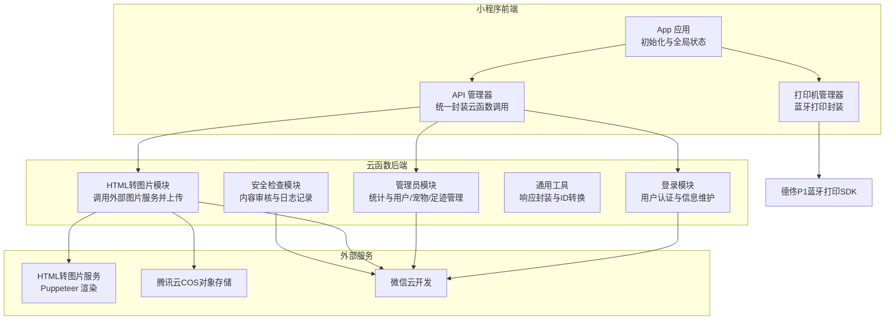
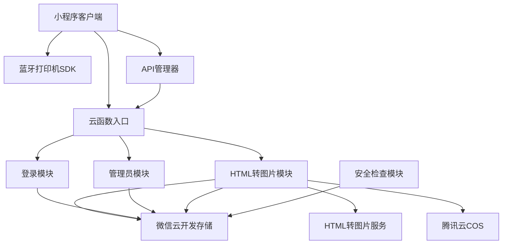
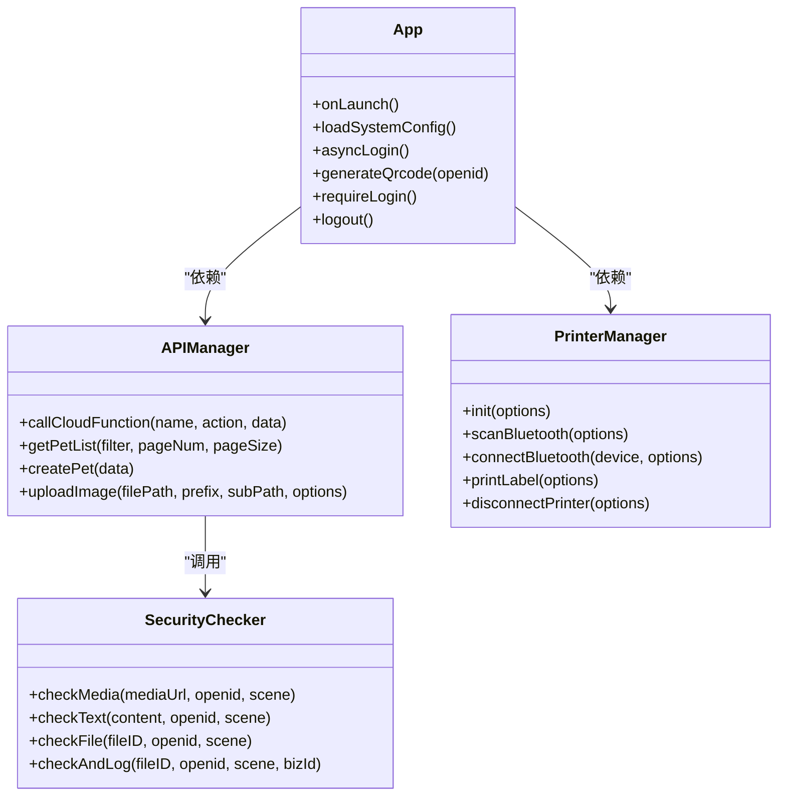
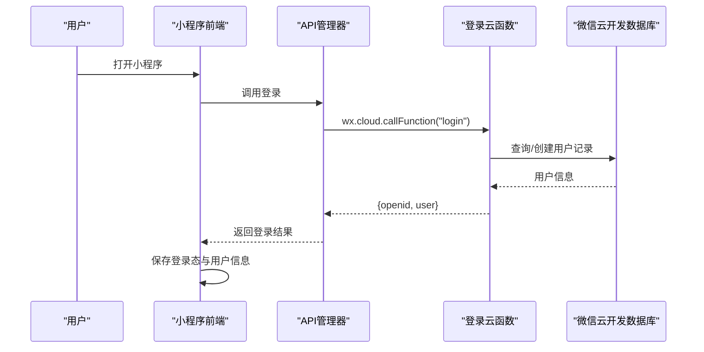
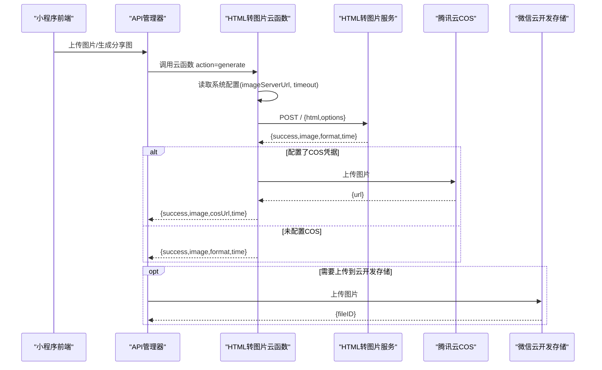
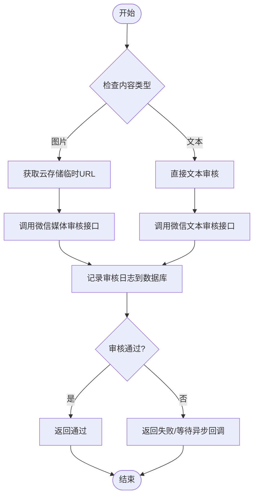
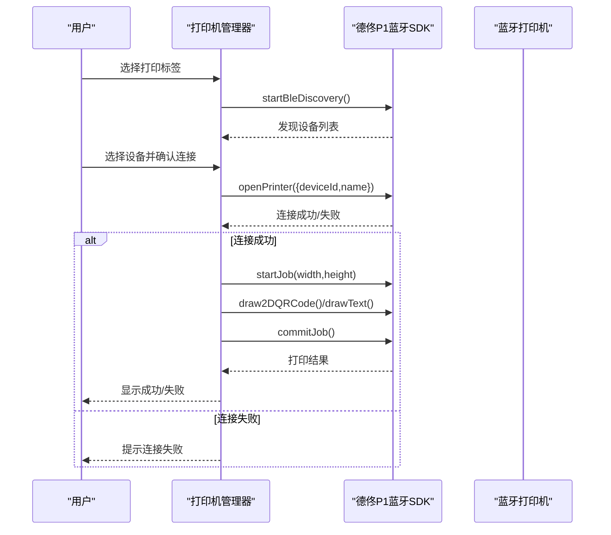
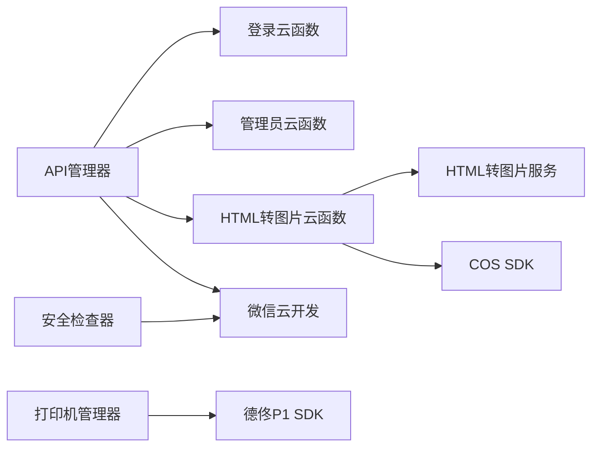

# 整体架构

<cite>
**本文引用的文件**   
- [miniprogram/app.js](file://miniprogram/app.js)
- [miniprogram/utils/api.js](file://miniprogram/utils/api.js)
- [miniprogram/utils/printer.js](file://miniprogram/utils/printer.js)
- [cloudfunctions/common/securityChecker.js](file://cloudfunctions/common/securityChecker.js)
- [cloudfunctions/common/utils.js](file://cloudfunctions/common/utils.js)
- [cloudfunctions/login/index.js](file://cloudfunctions/login/index.js)
- [cloudfunctions/admin/index.js](file://cloudfunctions/admin/index.js)
- [cloudfunctions/html2image/index.js](file://cloudfunctions/html2image/index.js)
- [html2image-server/server.js](file://html2image-server/server.js)
- [miniprogram/project.config.json](file://miniprogram/project.config.json)
- [cloudfunctions/html2image/package.json](file://cloudfunctions/html2image/package.json)
- [html2image-server-dist/package.json](file://html2image-server-dist/package.json)
</cite>

## 目录
1. [引言](#引言)
2. [项目结构](#项目结构)
3. [核心组件](#核心组件)
4. [架构总览](#架构总览)
5. [详细组件分析](#详细组件分析)
6. [依赖分析](#依赖分析)
7. [性能考虑](#性能考虑)
8. [故障排查指南](#故障排查指南)
9. [结论](#结论)
10. [附录](#附录)

## 引言
本项目围绕“养龟档案”构建，采用前后端分离与微服务理念，结合小程序前端、云开发后端（云函数）、独立 HTML 转图片服务以及蓝牙打印机 SDK，形成完整的数据采集、处理、展示与打印闭环。系统以云函数为后端服务入口，统一处理用户认证、数据管理、内容安全审核、分享图片生成与存储等能力；HTML 转图片服务负责将富 HTML 内容渲染为图片；蓝牙打印机 SDK 提供本地打印能力。项目同时遵循 MVVM 架构思想，通过 Model-View-ViewModel 的职责划分实现清晰的数据绑定与交互。

## 项目结构
项目采用多模块分层组织：
- 小程序前端（miniprogram）：包含页面、组件、工具库与云函数封装层。
- 云函数（cloudfunctions）：按领域拆分的微服务模块，如登录、宠物、记录、提醒、管理员、HTML 转图片、安全检查等。
- HTML 转图片服务（html2image-server）：独立 Node.js 服务，基于 Puppeteer 渲染 HTML 为图片。
- 蓝牙打印机 SDK（detonger/test/lpapi-ble-test）：封装德佟 P1 打印机的 BLE 打印逻辑。
- Cloudflare Worker（cloudflare-worker）：边缘计算示例（当前仓库包含其依赖，未见实际业务逻辑文件）。

图表来源
- [miniprogram/app.js:1-312](file://miniprogram/app.js#L1-L312)
- [miniprogram/utils/api.js:1-208](file://miniprogram/utils/api.js#L1-L208)
- [miniprogram/utils/printer.js:1-314](file://miniprogram/utils/printer.js#L1-L314)
- [cloudfunctions/login/index.js:1-148](file://cloudfunctions/login/index.js#L1-L148)
- [cloudfunctions/admin/index.js:1-533](file://cloudfunctions/admin/index.js#L1-L533)
- [cloudfunctions/html2image/index.js:1-205](file://cloudfunctions/html2image/index.js#L1-L205)
- [cloudfunctions/common/utils.js:1-69](file://cloudfunctions/common/utils.js#L1-L69)
- [cloudfunctions/common/securityChecker.js:1-226](file://cloudfunctions/common/securityChecker.js#L1-L226)
- [html2image-server/server.js:1-365](file://html2image-server/server.js#L1-L365)

章节来源
- [miniprogram/project.config.json:1-34](file://miniprogram/project.config.json#L1-L34)

## 核心组件
- 小程序应用层（App）
  - 负责云开发初始化、系统配置加载、登录态管理、二维码生成与安全通知检查。
  - 关键职责：全局状态管理、云函数调用入口、用户引导与强制登录。
- API 管理器（APIManager）
  - 统一调用云函数，封装错误处理与降级策略，提供宠物、记录、提醒、足迹等业务接口。
- 安全检查器（SecurityChecker）
  - 封装微信内容安全接口，支持图片与文本审核，异步提交并记录审核日志。
- 管理员模块（Admin）
  - 提供统计、用户、宠物、足迹管理与系统配置更新等能力，支持事务性删除用户及其全部数据。
- 登录模块（Login）
  - 获取用户 openid，创建/更新用户记录，支持公开名片信息维护与管理员校验。
- HTML 转图片模块（HTML2Image）
  - 从系统配置读取图片服务地址与超时，调用外部服务生成图片，支持上传至腾讯云 COS 或云开发存储。
- HTML 转图片服务（HTML-to-Image Server）
  - 基于 Puppeteer 的独立服务，提供健康检查、配置查询与图片生成接口。
- 打印机管理器（PrinterManager）
  - 封装蓝牙扫描、连接、断开与标签打印逻辑，支持自动连接与二维码打印控制。

章节来源
- [miniprogram/app.js:1-312](file://miniprogram/app.js#L1-L312)
- [miniprogram/utils/api.js:1-208](file://miniprogram/utils/api.js#L1-L208)
- [cloudfunctions/common/securityChecker.js:1-226](file://cloudfunctions/common/securityChecker.js#L1-L226)
- [cloudfunctions/admin/index.js:1-533](file://cloudfunctions/admin/index.js#L1-L533)
- [cloudfunctions/login/index.js:1-148](file://cloudfunctions/login/index.js#L1-L148)
- [cloudfunctions/html2image/index.js:1-205](file://cloudfunctions/html2image/index.js#L1-L205)
- [html2image-server/server.js:1-365](file://html2image-server/server.js#L1-L365)
- [miniprogram/utils/printer.js:1-314](file://miniprogram/utils/printer.js#L1-L314)

## 架构总览
系统采用“小程序前端 + 云函数后端 + 独立图片服务 + 蓝牙打印”的分布式架构：
- 前端通过云函数进行认证、数据读写与业务编排；对图片生成请求转发至独立图片服务；对蓝牙设备进行本地打印。
- 云函数模块化拆分，职责单一，便于扩展与维护；通过系统配置集中管理图片服务地址、COS 凭据等。
- 图片服务独立部署，具备健康检查与配置查询接口，支持高并发截图与格式转换。
- 打印机 SDK 在小程序端运行，提供稳定的蓝牙打印体验。

图表来源
- [miniprogram/utils/api.js:1-208](file://miniprogram/utils/api.js#L1-L208)
- [cloudfunctions/login/index.js:1-148](file://cloudfunctions/login/index.js#L1-L148)
- [cloudfunctions/admin/index.js:1-533](file://cloudfunctions/admin/index.js#L1-L533)
- [cloudfunctions/html2image/index.js:1-205](file://cloudfunctions/html2image/index.js#L1-L205)
- [cloudfunctions/common/securityChecker.js:1-226](file://cloudfunctions/common/securityChecker.js#L1-L226)
- [html2image-server/server.js:1-365](file://html2image-server/server.js#L1-L365)

## 详细组件分析

### MVVM 架构在项目中的应用
- Model（模型）
  - 云函数模块承担后端模型职责，封装数据库访问、业务规则与对外接口。
  - 安全检查器、API 管理器、打印机管理器分别抽象出安全、网络与硬件交互的模型。
- View（视图）
  - 小程序页面与组件构成视图层，负责用户交互与展示。
- ViewModel（视图模型）
  - API 管理器与 App 全局状态共同承担 ViewModel 职责，协调 Model 与 View 的数据流，实现数据绑定与状态同步。

图表来源
- [miniprogram/utils/api.js:1-208](file://miniprogram/utils/api.js#L1-L208)
- [cloudfunctions/common/securityChecker.js:1-226](file://cloudfunctions/common/securityChecker.js#L1-L226)
- [miniprogram/utils/printer.js:1-314](file://miniprogram/utils/printer.js#L1-L314)
- [miniprogram/app.js:1-312](file://miniprogram/app.js#L1-L312)

章节来源
- [miniprogram/utils/api.js:1-208](file://miniprogram/utils/api.js#L1-L208)
- [cloudfunctions/common/securityChecker.js:1-226](file://cloudfunctions/common/securityChecker.js#L1-L226)
- [miniprogram/utils/printer.js:1-314](file://miniprogram/utils/printer.js#L1-L314)
- [miniprogram/app.js:1-312](file://miniprogram/app.js#L1-L312)

### 登录与认证流程（云函数）

图表来源
- [miniprogram/utils/api.js:143-145](file://miniprogram/utils/api.js#L143-L145)
- [cloudfunctions/login/index.js:38-147](file://cloudfunctions/login/index.js#L38-L147)

章节来源
- [cloudfunctions/login/index.js:1-148](file://cloudfunctions/login/index.js#L1-L148)
- [miniprogram/utils/api.js:1-208](file://miniprogram/utils/api.js#L1-L208)

### 图片生成与存储流程（云函数 -> 图片服务）

图表来源
- [cloudfunctions/html2image/index.js:14-140](file://cloudfunctions/html2image/index.js#L14-L140)
- [html2image-server/server.js:276-318](file://html2image-server/server.js#L276-L318)
- [cloudfunctions/html2image/package.json:1-12](file://cloudfunctions/html2image/package.json#L1-L12)
- [html2image-server-dist/package.json:1-26](file://html2image-server-dist/package.json#L1-L26)

章节来源
- [cloudfunctions/html2image/index.js:1-205](file://cloudfunctions/html2image/index.js#L1-L205)
- [html2image-server/server.js:1-365](file://html2image-server/server.js#L1-L365)

### 安全检查与审核日志

图表来源
- [cloudfunctions/common/securityChecker.js:74-207](file://cloudfunctions/common/securityChecker.js#L74-L207)

章节来源
- [cloudfunctions/common/securityChecker.js:1-226](file://cloudfunctions/common/securityChecker.js#L1-L226)

### 蓝牙打印流程

图表来源
- [miniprogram/utils/printer.js:75-287](file://miniprogram/utils/printer.js#L75-L287)

章节来源
- [miniprogram/utils/printer.js:1-314](file://miniprogram/utils/printer.js#L1-L314)

## 依赖分析
- 模块耦合
  - API 管理器与云函数模块松耦合，通过统一的 action/data 协议交互。
  - 安全检查器与云函数模块通过微信云开发开放接口集成，避免直接耦合。
  - HTML 转图片模块与图片服务通过 HTTP 协议解耦，支持横向扩展。
- 外部依赖
  - 云函数依赖微信云开发 SDK 与腾讯云 COS SDK。
  - 图片服务依赖 Puppeteer 与 Chromium。
  - 小程序前端依赖蓝牙打印 SDK 与云开发能力。

图表来源
- [miniprogram/utils/api.js:1-208](file://miniprogram/utils/api.js#L1-L208)
- [cloudfunctions/html2image/index.js:1-205](file://cloudfunctions/html2image/index.js#L1-L205)
- [cloudfunctions/common/securityChecker.js:1-226](file://cloudfunctions/common/securityChecker.js#L1-L226)
- [miniprogram/utils/printer.js:1-314](file://miniprogram/utils/printer.js#L1-L314)

章节来源
- [cloudfunctions/common/utils.js:1-69](file://cloudfunctions/common/utils.js#L1-L69)
- [cloudfunctions/html2image/package.json:1-12](file://cloudfunctions/html2image/package.json#L1-L12)
- [html2image-server-dist/package.json:1-26](file://html2image-server-dist/package.json#L1-L26)

## 性能考虑
- 云函数冷启动与并发
  - 通过合理拆分云函数模块，减少单函数体积与依赖，降低冷启动时间。
  - 对高频调用接口（如登录、图片生成）建议配合缓存与限流策略。
- 图片服务
  - Puppeteer 启动成本较高，建议在容器内常驻或使用无服务器容器方案，减少启动延迟。
  - 控制图片尺寸与质量参数，避免过大图片导致内存与带宽压力。
- 数据库查询
  - 管理员模块使用聚合查询与事务，注意索引优化与分页大小控制。
- 蓝牙打印
  - 连接失败重试次数限制，避免频繁扫描造成电量消耗。
  - 打印任务批量化提交，减少连接/断开频率。

## 故障排查指南
- 登录失败
  - 检查云函数日志与数据库集合是否存在；确认系统配置中的注册开关。
  - 关注小程序端网络状态与云函数可用性标记。
- 图片生成失败
  - 核对系统配置中的图片服务地址与超时；检查图片服务健康状态与日志。
  - 若启用 COS，确认密钥与桶配置正确。
- 安全审核异常
  - 检查临时文件 URL 获取与微信审核接口返回码；查看审核日志表状态。
- 蓝牙打印失败
  - 确认蓝牙适配器初始化成功；检查设备连接状态与打印任务参数。

章节来源
- [cloudfunctions/login/index.js:136-146](file://cloudfunctions/login/index.js#L136-L146)
- [cloudfunctions/html2image/index.js:132-139](file://cloudfunctions/html2image/index.js#L132-L139)
- [cloudfunctions/common/securityChecker.js:90-104](file://cloudfunctions/common/securityChecker.js#L90-L104)
- [miniprogram/utils/printer.js:184-194](file://miniprogram/utils/printer.js#L184-L194)

## 结论
本项目通过前后端分离与微服务理念，实现了认证、数据管理、内容安全、图片生成与打印等核心能力的模块化与解耦。MVVM 架构在前端层面提升了数据绑定与状态管理效率。云函数与独立图片服务的组合兼顾了灵活性与可扩展性，蓝牙打印 SDK 则提供了良好的本地化体验。后续可在监控告警、缓存策略与自动化运维方面进一步完善。

## 附录
- 配置项参考
  - 系统配置（imageServerUrl、imageTimeout、qcloudSecretId/Key/Bucket/Region 等）由管理员在后台更新，云函数与图片服务均从数据库读取。
- 版本与打包
  - 小程序项目配置中包含打包忽略规则与编译设置，确保发布包精简与稳定。

章节来源
- [cloudfunctions/admin/index.js:434-473](file://cloudfunctions/admin/index.js#L434-L473)
- [miniprogram/project.config.json:1-34](file://miniprogram/project.config.json#L1-L34)