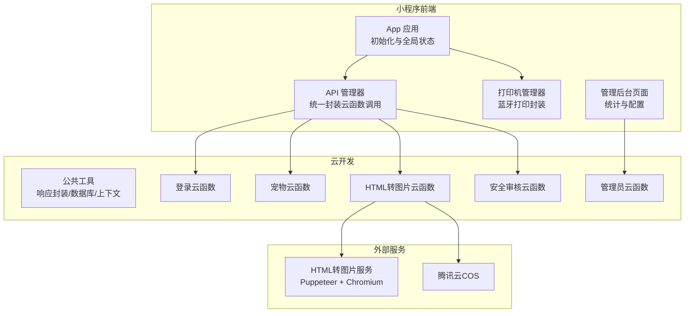
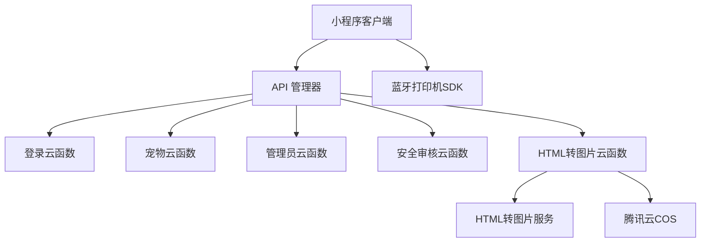
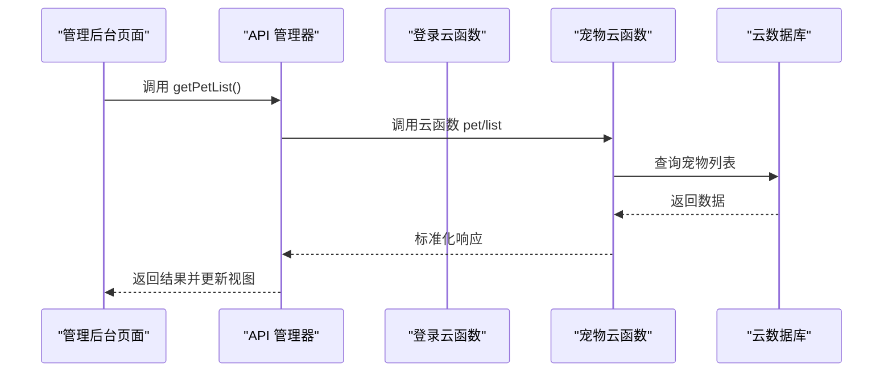
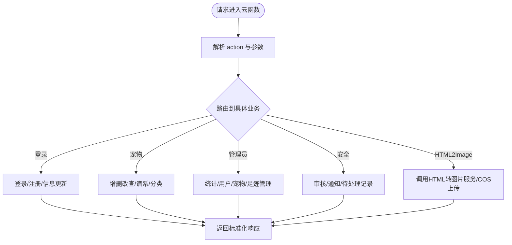
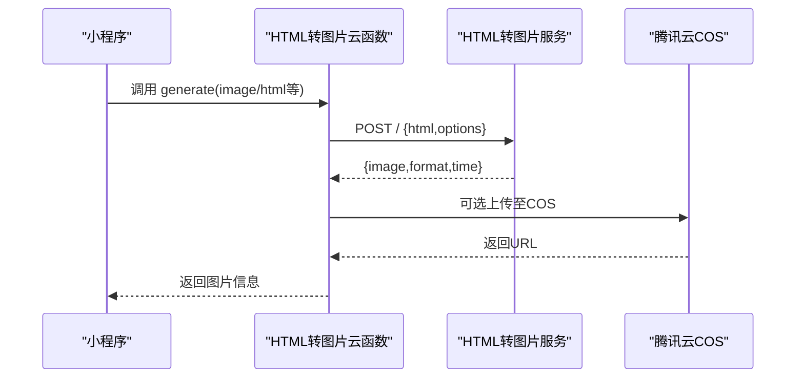
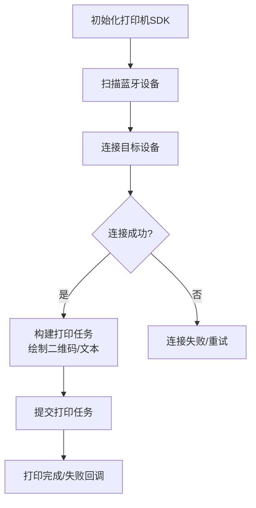
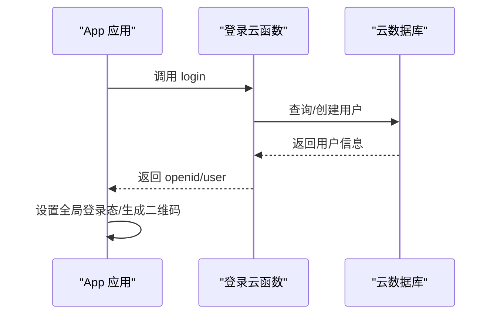
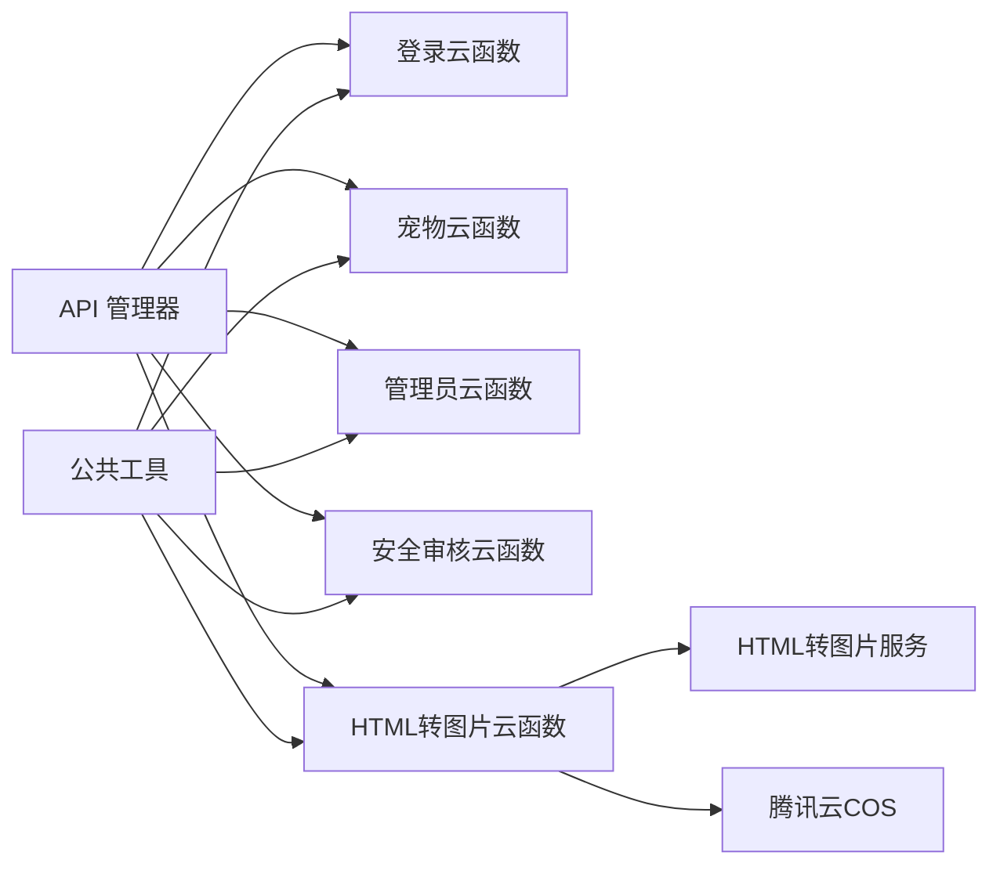

# 架构设计

<cite>
**本文引用的文件**
- [miniprogram/app.js](file://miniprogram/app.js)
- [miniprogram/utils/api.js](file://miniprogram/utils/api.js)
- [miniprogram/utils/printer.js](file://miniprogram/utils/printer.js)
- [miniprogram/subpkg-admin/pages/admin/index.js](file://miniprogram/subpkg-admin/pages/admin/index.js)
- [cloudfunctions/common/utils.js](file://cloudfunctions/common/utils.js)
- [cloudfunctions/login/index.js](file://cloudfunctions/login/index.js)
- [cloudfunctions/pet/index.js](file://cloudfunctions/pet/index.js)
- [cloudfunctions/admin/index.js](file://cloudfunctions/admin/index.js)
- [cloudfunctions/html2image/index.js](file://cloudfunctions/html2image/index.js)
- [cloudfunctions/security/index.js](file://cloudfunctions/security/index.js)
- [html2image-server/server.js](file://html2image-server/server.js)
- [miniprogram/project.config.json](file://miniprogram/project.config.json)
</cite>

## 目录
1. [引言](#引言)
2. [项目结构](#项目结构)
3. [核心组件](#核心组件)
4. [架构总览](#架构总览)
5. [详细组件分析](#详细组件分析)
6. [依赖关系分析](#依赖关系分析)
7. [性能考量](#性能考量)
8. [故障排查指南](#故障排查指南)
9. [结论](#结论)
10. [附录](#附录)

## 引言
本项目“养龟档案”采用前后端分离架构，以微信小程序前端为核心入口，结合腾讯云开发提供的云函数与云数据库，实现用户认证、数据管理、内容安全审核、HTML转图片渲染以及蓝牙打印机打印等能力。系统通过云函数模块化拆分业务域，配合独立的HTML转图片服务与Puppeteer渲染引擎，满足高并发下的图片生成需求；同时引入MVVM架构思想，将视图层与业务逻辑解耦，提升可维护性与可扩展性。

## 项目结构
项目由以下主要部分组成：
- 微信小程序前端（miniprogram）：包含页面、组件、工具类与云函数封装。
- 腾讯云函数（cloudfunctions）：按业务域拆分，如登录、宠物、足迹、提醒、管理员、安全、HTML转图片等。
- HTML转图片服务（html2image-server）：基于Puppeteer的独立HTTP服务，负责将HTML内容渲染为图片。
- 蓝牙打印机SDK（detonger）：封装德佟P1蓝牙打印机的通用逻辑，便于在小程序内调用。
- 服务器部署脚本与配置（server-setup）：数据库SQL与Nginx配置示例。
- 设计预览（design-preview）：静态页面预览素材。

图表来源
- [miniprogram/app.js:1-312](file://miniprogram/app.js#L1-L312)
- [miniprogram/utils/api.js:1-208](file://miniprogram/utils/api.js#L1-L208)
- [miniprogram/utils/printer.js:1-314](file://miniprogram/utils/printer.js#L1-L314)
- [cloudfunctions/common/utils.js:1-69](file://cloudfunctions/common/utils.js#L1-L69)
- [cloudfunctions/login/index.js:1-148](file://cloudfunctions/login/index.js#L1-L148)
- [cloudfunctions/pet/index.js:1-723](file://cloudfunctions/pet/index.js#L1-L723)
- [cloudfunctions/admin/index.js:1-533](file://cloudfunctions/admin/index.js#L1-L533)
- [cloudfunctions/html2image/index.js:1-205](file://cloudfunctions/html2image/index.js#L1-L205)
- [cloudfunctions/security/index.js:1-200](file://cloudfunctions/security/index.js#L1-L200)
- [html2image-server/server.js:1-365](file://html2image-server/server.js#L1-L365)

章节来源
- [miniprogram/project.config.json:1-34](file://miniprogram/project.config.json#L1-L34)

## 核心组件
- MVVM架构要点
  - Model：云数据库与云函数返回的数据模型，如用户、宠物、足迹、记录等。
  - View：小程序页面与组件，负责UI呈现与用户交互。
  - ViewModel：API管理器与App应用层，负责数据获取、状态管理与业务编排。
- 云函数模块化
  - 每个业务域对应一个云函数，统一通过action参数路由到具体方法，便于扩展与维护。
  - 通过公共工具模块封装数据库连接、响应格式与错误处理，降低重复代码。
- HTML转图片服务
  - 云函数负责调用独立的HTML转图片服务，支持配置化参数与COS上传。
  - 服务端基于Puppeteer渲染，具备浏览器生命周期管理与健康检查。
- 蓝牙打印机SDK
  - 封装蓝牙扫描、连接、打印等流程，提供统一的打印任务构建与提交。

章节来源
- [miniprogram/utils/api.js:1-208](file://miniprogram/utils/api.js#L1-L208)
- [cloudfunctions/common/utils.js:1-69](file://cloudfunctions/common/utils.js#L1-L69)
- [cloudfunctions/html2image/index.js:1-205](file://cloudfunctions/html2image/index.js#L1-L205)
- [html2image-server/server.js:1-365](file://html2image-server/server.js#L1-L365)
- [miniprogram/utils/printer.js:1-314](file://miniprogram/utils/printer.js#L1-L314)

## 架构总览
系统采用“小程序前端 + 云函数后端 + 外部服务”的三层架构：
- 前端层：小程序页面与组件，通过API管理器调用云函数，实现用户认证、数据增删改查、图片分享与打印。
- 云函数层：按业务域拆分，统一处理鉴权、数据校验、数据库操作与第三方服务集成。
- 服务层：HTML转图片服务与腾讯云COS，提供高性能的图片生成与存储能力。

图表来源
- [miniprogram/utils/api.js:1-208](file://miniprogram/utils/api.js#L1-L208)
- [cloudfunctions/login/index.js:1-148](file://cloudfunctions/login/index.js#L1-L148)
- [cloudfunctions/pet/index.js:1-723](file://cloudfunctions/pet/index.js#L1-L723)
- [cloudfunctions/admin/index.js:1-533](file://cloudfunctions/admin/index.js#L1-L533)
- [cloudfunctions/security/index.js:1-200](file://cloudfunctions/security/index.js#L1-L200)
- [cloudfunctions/html2image/index.js:1-205](file://cloudfunctions/html2image/index.js#L1-L205)
- [html2image-server/server.js:1-365](file://html2image-server/server.js#L1-L365)

## 详细组件分析

### MVVM架构在项目中的应用
- 视图层（View）
  - 页面与组件负责渲染数据与收集用户输入，例如管理后台首页聚合展示各类统计与活动。
- 业务层（ViewModel）
  - App应用层负责全局状态、登录态与系统配置加载；API管理器统一封装云函数调用，屏蔽错误与回退策略。
- 数据层（Model）
  - 云函数作为业务模型，负责数据校验、数据库操作与第三方服务调用，返回标准化响应。

图表来源
- [miniprogram/subpkg-admin/pages/admin/index.js:1-123](file://miniprogram/subpkg-admin/pages/admin/index.js#L1-L123)
- [miniprogram/utils/api.js:1-208](file://miniprogram/utils/api.js#L1-L208)
- [cloudfunctions/pet/index.js:1-723](file://cloudfunctions/pet/index.js#L1-L723)

章节来源
- [miniprogram/subpkg-admin/pages/admin/index.js:1-123](file://miniprogram/subpkg-admin/pages/admin/index.js#L1-L123)
- [miniprogram/utils/api.js:1-208](file://miniprogram/utils/api.js#L1-L208)
- [miniprogram/app.js:1-312](file://miniprogram/app.js#L1-L312)

### 云函数模块化设计与服务间通信
- 模块化原则
  - 每个云函数聚焦单一业务域，通过action参数路由，便于独立测试与演进。
  - 公共工具模块提供统一的数据库连接、响应封装与错误处理。
- 服务间通信
  - 小程序前端通过云函数调用实现与后端的解耦；HTML转图片云函数再调用独立的HTML转图片服务，实现横向扩展。
  - 安全审核云函数负责内容安全与通知管理，与数据库协同完成异步回调与超时检测。

图表来源
- [cloudfunctions/login/index.js:1-148](file://cloudfunctions/login/index.js#L1-L148)
- [cloudfunctions/pet/index.js:1-723](file://cloudfunctions/pet/index.js#L1-L723)
- [cloudfunctions/admin/index.js:1-533](file://cloudfunctions/admin/index.js#L1-L533)
- [cloudfunctions/security/index.js:1-200](file://cloudfunctions/security/index.js#L1-L200)
- [cloudfunctions/html2image/index.js:1-205](file://cloudfunctions/html2image/index.js#L1-L205)

章节来源
- [cloudfunctions/common/utils.js:1-69](file://cloudfunctions/common/utils.js#L1-L69)
- [cloudfunctions/admin/index.js:1-533](file://cloudfunctions/admin/index.js#L1-L533)
- [cloudfunctions/html2image/index.js:1-205](file://cloudfunctions/html2image/index.js#L1-L205)

### HTML转图片服务与渲染引擎
- 技术选型
  - 使用Puppeteer与headless Chromium进行HTML渲染，支持PNG/JPEG/WebP输出与自定义视口、缩放与质量参数。
  - 服务内置浏览器池管理、启动超时控制与断连自动恢复，确保稳定性。
- 与云函数协作
  - 云函数负责读取系统配置、调用服务端点、上传至COS或云存储，并返回结果给小程序端。

图表来源
- [cloudfunctions/html2image/index.js:1-205](file://cloudfunctions/html2image/index.js#L1-L205)
- [html2image-server/server.js:1-365](file://html2image-server/server.js#L1-L365)

章节来源
- [cloudfunctions/html2image/index.js:1-205](file://cloudfunctions/html2image/index.js#L1-L205)
- [html2image-server/server.js:1-365](file://html2image-server/server.js#L1-L365)

### 蓝牙打印机SDK与打印流程
- 功能封装
  - 提供蓝牙扫描、连接、断开、自动连接与打印任务构建，支持二维码与文本组合打印。
- 流程示意

图表来源
- [miniprogram/utils/printer.js:1-314](file://miniprogram/utils/printer.js#L1-L314)

章节来源
- [miniprogram/utils/printer.js:1-314](file://miniprogram/utils/printer.js#L1-L314)

### 系统配置与登录态管理
- App应用层负责系统配置加载、登录态初始化与静默登录、二维码生成与安全通知检查。
- 登录云函数负责用户信息创建与更新、公开名片更新与管理员判定。

图表来源
- [miniprogram/app.js:1-312](file://miniprogram/app.js#L1-L312)
- [cloudfunctions/login/index.js:1-148](file://cloudfunctions/login/index.js#L1-L148)

章节来源
- [miniprogram/app.js:1-312](file://miniprogram/app.js#L1-L312)
- [cloudfunctions/login/index.js:1-148](file://cloudfunctions/login/index.js#L1-L148)

## 依赖关系分析
- 前端依赖
  - API管理器依赖云函数；App应用层依赖API管理器与安全通知模块。
- 云函数依赖
  - 各云函数依赖公共工具模块与云数据库；HTML转图片云函数依赖外部HTML转图片服务与COS。
- 服务依赖
  - HTML转图片服务依赖Puppeteer与Chromium二进制；支持系统Chrome/Chromium自动探测与启动超时控制。

图表来源
- [miniprogram/utils/api.js:1-208](file://miniprogram/utils/api.js#L1-L208)
- [cloudfunctions/common/utils.js:1-69](file://cloudfunctions/common/utils.js#L1-L69)
- [cloudfunctions/login/index.js:1-148](file://cloudfunctions/login/index.js#L1-L148)
- [cloudfunctions/pet/index.js:1-723](file://cloudfunctions/pet/index.js#L1-L723)
- [cloudfunctions/admin/index.js:1-533](file://cloudfunctions/admin/index.js#L1-L533)
- [cloudfunctions/security/index.js:1-200](file://cloudfunctions/security/index.js#L1-L200)
- [cloudfunctions/html2image/index.js:1-205](file://cloudfunctions/html2image/index.js#L1-L205)
- [html2image-server/server.js:1-365](file://html2image-server/server.js#L1-L365)

章节来源
- [miniprogram/utils/api.js:1-208](file://miniprogram/utils/api.js#L1-L208)
- [cloudfunctions/common/utils.js:1-69](file://cloudfunctions/common/utils.js#L1-L69)

## 性能考量
- 云函数冷启动与并发
  - 通过模块化与公共工具减少重复初始化，合理利用云函数并发能力。
- 图片生成性能
  - HTML转图片服务采用浏览器池与启动超时控制，建议在高峰期增加实例副本或优化HTML复杂度。
- 数据库查询
  - 使用索引字段与分页查询，避免一次性加载大量数据；对高频统计使用聚合查询。
- 前端体验
  - 使用骨架屏与懒加载，减少首屏等待；对图片上传采用异步审核，避免阻塞主流程。

## 故障排查指南
- 登录失败
  - 检查登录云函数返回的警告信息与数据库集合是否存在；确认系统配置中的注册开关。
- 图片生成失败
  - 查看HTML转图片云函数返回的错误信息与服务端健康状态；确认COS配置与网络连通性。
- 安全审核未回调
  - 通过安全云函数的待处理记录接口查询超时项，并在数据库中标记状态以便前端提示。
- 蓝牙打印连接失败
  - 检查蓝牙适配器初始化、设备发现与连接回调；关注自动连接失败次数阈值。

章节来源
- [cloudfunctions/login/index.js:1-148](file://cloudfunctions/login/index.js#L1-L148)
- [cloudfunctions/html2image/index.js:1-205](file://cloudfunctions/html2image/index.js#L1-L205)
- [cloudfunctions/security/index.js:1-200](file://cloudfunctions/security/index.js#L1-L200)
- [miniprogram/utils/printer.js:1-314](file://miniprogram/utils/printer.js#L1-L314)

## 结论
本项目通过MVVM架构与云函数模块化设计，实现了前后端清晰分离与高内聚低耦合的服务组织方式。结合HTML转图片服务与Puppeteer渲染引擎，满足了复杂的图片生成需求；蓝牙打印机SDK进一步拓展了线下打印能力。整体架构具备良好的可扩展性与可维护性，适合持续迭代与功能扩展。

## 附录
- 技术栈选择说明
  - 小程序原生开发：生态成熟、调试便捷、包体可控。
  - 云开发服务：免运维、高可用、与小程序无缝集成。
  - Puppeteer渲染：稳定可靠、兼容性强，适合复杂HTML渲染。
  - 蓝牙打印机SDK：针对德佟P1的封装，简化蓝牙交互与打印流程。