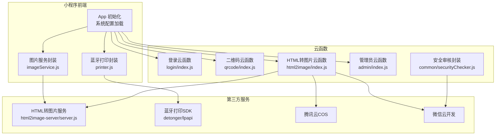
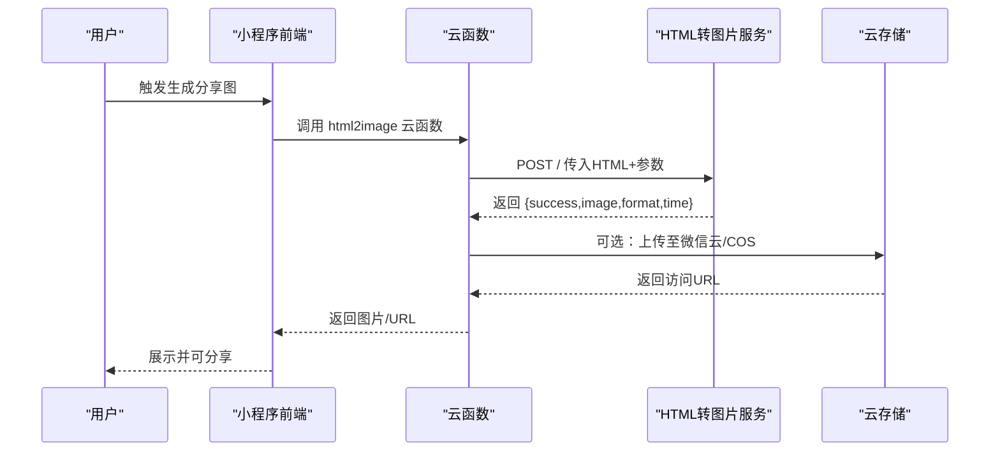
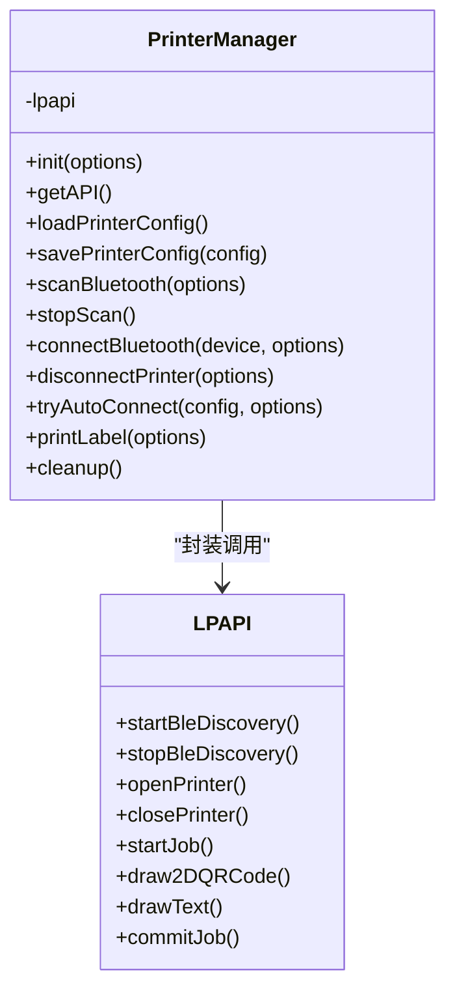
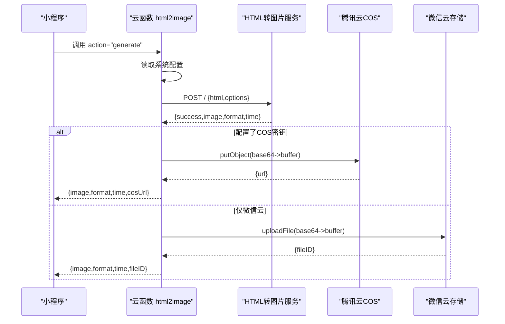
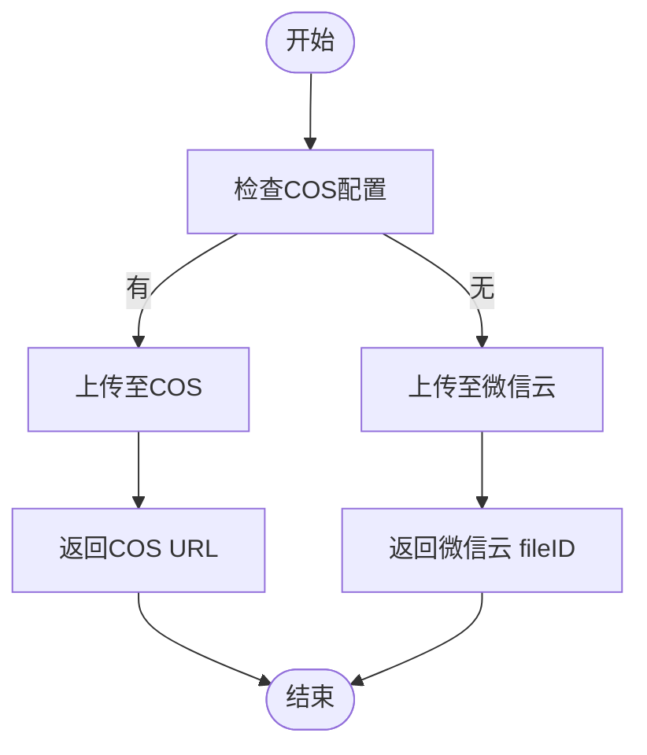
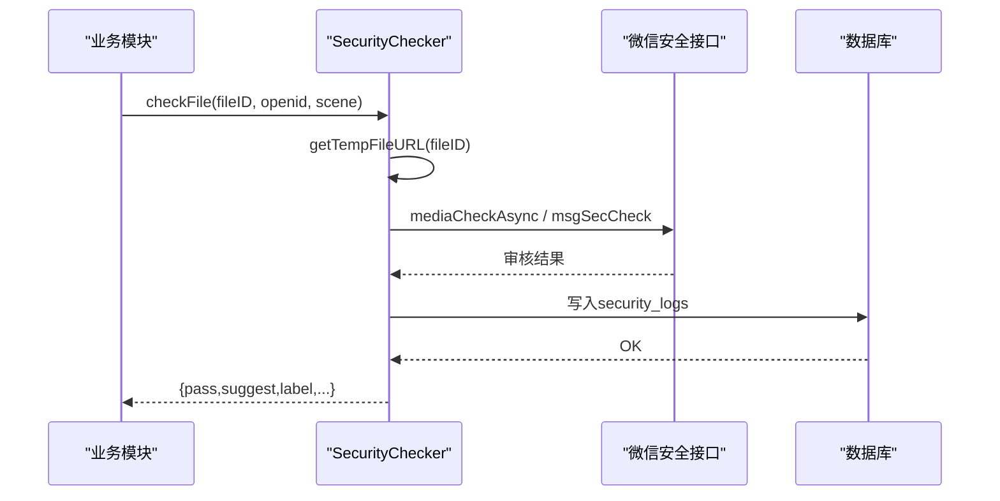
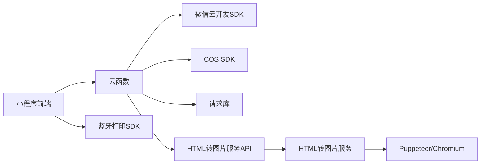

# 集成架构

<cite>
**本文引用的文件**
- [miniprogram/app.js](file://miniprogram/app.js)
- [miniprogram/utils/imageService.js](file://miniprogram/utils/imageService.js)
- [miniprogram/utils/printer.js](file://miniprogram/utils/printer.js)
- [cloudfunctions/html2image/index.js](file://cloudfunctions/html2image/index.js)
- [cloudfunctions/html2image/package.json](file://cloudfunctions/html2image/package.json)
- [cloudfunctions/html2image/config.json](file://cloudfunctions/html2image/config.json)
- [cloudfunctions/login/index.js](file://cloudfunctions/login/index.js)
- [cloudfunctions/qrcode/index.js](file://cloudfunctions/qrcode/index.js)
- [cloudfunctions/admin/index.js](file://cloudfunctions/admin/index.js)
- [cloudfunctions/common/securityChecker.js](file://cloudfunctions/common/securityChecker.js)
- [html2image-server/server.js](file://html2image-server/server.js)
- [html2image-server/config.js](file://html2image-server/config.js)
- [html2image-server/package.json](file://html2image-server/package.json)
- [detonger/test/lpapi-ble-test/app.js](file://detonger/test/lpapi-ble-test/app.js)
</cite>

## 目录
1. [引言](#引言)
2. [项目结构](#项目结构)
3. [核心组件](#核心组件)
4. [架构总览](#架构总览)
5. [详细组件分析](#详细组件分析)
6. [依赖关系分析](#依赖关系分析)
7. [性能考虑](#性能考虑)
8. [故障排查指南](#故障排查指南)
9. [结论](#结论)
10. [附录](#附录)

## 引言
本集成架构文档聚焦“养龟档案”项目中的第三方服务集成，涵盖以下方面：
- 蓝牙打印机SDK集成（德佟P1）
- HTML转图片服务集成（Puppeteer + Node HTTP服务）
- 云存储服务集成（微信云开发与腾讯云COS）

文档解释集成接口的设计原则、错误处理机制、性能优化策略，并阐述服务间通信协议、数据格式转换、安全认证机制，最后提供架构图与接口设计图，说明各服务间的交互方式。

## 项目结构
项目采用多层架构：
- 小程序前端层：负责用户交互、调用云函数、蓝牙打印控制、图片生成与分享
- 云函数层：提供登录、二维码、HTML转图片、安全审核、管理员后台等能力
- 第三方服务层：Puppeteer HTML转图片服务、蓝牙打印机SDK、云存储（微信云开发/COS）

图表来源
- [miniprogram/app.js:1-312](file://miniprogram/app.js#L1-L312)
- [miniprogram/utils/imageService.js:1-202](file://miniprogram/utils/imageService.js#L1-L202)
- [miniprogram/utils/printer.js:1-314](file://miniprogram/utils/printer.js#L1-L314)
- [cloudfunctions/html2image/index.js:1-205](file://cloudfunctions/html2image/index.js#L1-L205)
- [cloudfunctions/login/index.js:1-148](file://cloudfunctions/login/index.js#L1-L148)
- [cloudfunctions/qrcode/index.js:1-117](file://cloudfunctions/qrcode/index.js#L1-L117)
- [cloudfunctions/admin/index.js:1-533](file://cloudfunctions/admin/index.js#L1-L533)
- [cloudfunctions/common/securityChecker.js:1-226](file://cloudfunctions/common/securityChecker.js#L1-L226)
- [html2image-server/server.js:1-365](file://html2image-server/server.js#L1-L365)

章节来源
- [miniprogram/app.js:1-312](file://miniprogram/app.js#L1-L312)
- [cloudfunctions/html2image/index.js:1-205](file://cloudfunctions/html2image/index.js#L1-L205)
- [html2image-server/server.js:1-365](file://html2image-server/server.js#L1-L365)

## 核心组件
- 小程序应用入口与配置加载：负责系统配置读取、静默登录、二维码生成、安全通知检查等
- 图片生成服务封装：统一调用HTML转图片HTTP服务，支持主题渲染、图片保存
- 蓝牙打印封装：统一封装德佟P1蓝牙打印SDK，提供扫描、连接、自动连接、打印标签等功能
- 云函数：登录、二维码、HTML转图片、管理员后台、安全审核
- HTML转图片服务：基于Puppeteer的独立Node服务，提供健康检查、配置查看、图片生成API
- 云存储：微信云开发与腾讯云COS双通道上传

章节来源
- [miniprogram/app.js:17-58](file://miniprogram/app.js#L17-L58)
- [miniprogram/utils/imageService.js:59-143](file://miniprogram/utils/imageService.js#L59-L143)
- [miniprogram/utils/printer.js:5-298](file://miniprogram/utils/printer.js#L5-L298)
- [cloudfunctions/html2image/index.js:14-205](file://cloudfunctions/html2image/index.js#L14-L205)
- [html2image-server/server.js:208-330](file://html2image-server/server.js#L208-L330)

## 架构总览
整体交互流程如下：
- 小程序启动时加载系统配置，静默登录获取openid，生成小程序码
- 图片生成：小程序或云函数调用HTML转图片服务，返回Base64图片，必要时保存至本地临时文件或上传云存储
- 蓝牙打印：小程序通过封装的PrinterManager调用SDK，连接打印机并按模板打印标签
- 安全与存储：云函数调用微信云安全接口进行内容审核，图片可上传至微信云或COS

图表来源
- [cloudfunctions/html2image/index.js:66-140](file://cloudfunctions/html2image/index.js#L66-L140)
- [html2image-server/server.js:276-318](file://html2image-server/server.js#L276-L318)
- [miniprogram/utils/imageService.js:98-143](file://miniprogram/utils/imageService.js#L98-L143)

## 详细组件分析

### 蓝牙打印机SDK集成
- 设计原则
  - 单例封装：PrinterManager提供统一入口，避免多处重复初始化
  - 生命周期管理：自动扫描、连接、断开、资源清理
  - 配置持久化：本地存储打印机配置，支持自动连接与失败计数
  - 模板化打印：按固定尺寸布局（二维码+文字），支持按记录类型开关二维码
- 关键流程
  - 初始化SDK → 扫描设备 → 连接设备 → 创建打印任务 → 绘制二维码/文字 → 提交打印
- 错误处理
  - 蓝牙适配器初始化失败、连接失败、打印任务创建失败、提交失败均有明确分支处理
- 性能优化
  - 连接失败次数阈值限制，避免频繁重试
  - 打印前对内容进行智能截断，保证排版清晰

图表来源
- [miniprogram/utils/printer.js:5-298](file://miniprogram/utils/printer.js#L5-L298)

章节来源
- [miniprogram/utils/printer.js:15-298](file://miniprogram/utils/printer.js#L15-L298)
- [detonger/test/lpapi-ble-test/app.js:1-30](file://detonger/test/lpapi-ble-test/app.js#L1-L30)

### HTML转图片服务集成
- 设计原则
  - 云函数作为网关：统一读取系统配置、调用外部HTML转图片服务、可选上传云存储
  - 外部服务独立部署：Puppeteer + headless Chromium，提供HTTP API
  - 配置驱动：系统配置表决定图片服务地址、超时、COS密钥等
- 数据流
  - 小程序/云函数 → 云函数html2image → 外部HTML转图片服务 → 返回Base64图片
  - 可选：上传至微信云或COS，返回可访问URL
- 错误处理
  - 参数校验、超时、网络错误、COS上传失败均返回结构化错误
  - COS失败不阻断主流程，回退返回本地生成的图片
- 性能优化
  - 外部服务浏览器池复用、超时控制、请求体大小限制
  - 云函数侧缓存配置，减少数据库查询

图表来源
- [cloudfunctions/html2image/index.js:14-205](file://cloudfunctions/html2image/index.js#L14-L205)
- [html2image-server/server.js:276-318](file://html2image-server/server.js#L276-L318)

章节来源
- [cloudfunctions/html2image/index.js:14-205](file://cloudfunctions/html2image/index.js#L14-L205)
- [cloudfunctions/html2image/package.json:1-12](file://cloudfunctions/html2image/package.json#L1-L12)
- [cloudfunctions/html2image/config.json:1-8](file://cloudfunctions/html2image/config.json#L1-L8)
- [html2image-server/server.js:1-365](file://html2image-server/server.js#L1-L365)
- [html2image-server/config.js:1-268](file://html2image-server/config.js#L1-L268)
- [html2image-server/package.json:1-26](file://html2image-server/package.json#L1-L26)

### 云存储服务集成
- 微信云开发
  - 二维码生成：调用云API生成小程序码并上传至云存储，返回永久有效的fileID
  - 图片上传：云函数将Base64图片上传至微信云，返回fileID供后续分享
- 腾讯云COS
  - 条件上传：当系统配置包含COS密钥时，云函数将图片上传至COS，返回可访问URL
  - ACL与ContentType：公共读、按格式设置Content-Type
- 安全性
  - COS凭据通过系统配置注入，避免硬编码
  - 二维码URL优先使用云API生成，支持多环境回退

图表来源
- [cloudfunctions/html2image/index.js:102-172](file://cloudfunctions/html2image/index.js#L102-L172)
- [cloudfunctions/qrcode/index.js:24-61](file://cloudfunctions/qrcode/index.js#L24-L61)

章节来源
- [cloudfunctions/qrcode/index.js:1-117](file://cloudfunctions/qrcode/index.js#L1-L117)
- [cloudfunctions/html2image/index.js:102-172](file://cloudfunctions/html2image/index.js#L102-L172)

### 安全认证与内容审核
- 设计原则
  - 统一的安全检查封装：支持文本与图片的异步/同步审核
  - 自动fileID→URL转换：无需业务层关心临时URL获取细节
  - 审核日志落库：便于追踪与审计
- 流程
  - 业务触发审核 → 获取临时URL → 调用微信安全接口 → 记录日志 → 返回结果
- 场景映射
  - 头像/昵称/宠物资料、社交日志、评论等场景对应不同审核场景值

图表来源
- [cloudfunctions/common/securityChecker.js:30-208](file://cloudfunctions/common/securityChecker.js#L30-L208)

章节来源
- [cloudfunctions/common/securityChecker.js:1-226](file://cloudfunctions/common/securityChecker.js#L1-L226)

### 管理员后台与系统配置
- 管理员鉴权：从数据库admins集合读取启用的管理员列表，兜底配置
- 系统配置：集中于systemConfig集合，包含图片服务地址、超时、COS配置、ASR配置等
- 统计与报表：用户/宠物/足迹数量、今日活跃、用户增长趋势、宠物类型分布
- 数据一致性：删除用户时使用事务，确保关联数据一致

章节来源
- [cloudfunctions/admin/index.js:16-71](file://cloudfunctions/admin/index.js#L16-L71)
- [cloudfunctions/admin/index.js:434-473](file://cloudfunctions/admin/index.js#L434-L473)
- [cloudfunctions/admin/index.js:227-258](file://cloudfunctions/admin/index.js#L227-L258)

## 依赖关系分析
- 小程序前端依赖云函数与外部HTML转图片服务
- 云函数依赖微信云开发SDK、腾讯云COS SDK、请求库
- HTML转图片服务依赖Puppeteer与headless Chromium
- 蓝牙打印依赖德佟SDK（detonger/lpapi）

图表来源
- [cloudfunctions/html2image/package.json:6-11](file://cloudfunctions/html2image/package.json#L6-L11)
- [html2image-server/package.json:22-24](file://html2image-server/package.json#L22-L24)
- [miniprogram/utils/printer.js:17-21](file://miniprogram/utils/printer.js#L17-L21)

章节来源
- [cloudfunctions/html2image/package.json:1-12](file://cloudfunctions/html2image/package.json#L1-L12)
- [html2image-server/package.json:1-26](file://html2image-server/package.json#L1-L26)

## 性能考虑
- HTML转图片服务
  - 浏览器池复用与断线自动重连
  - 请求体大小限制与超时控制
  - viewport与deviceScaleFactor合理设置，避免过大内存占用
- 云函数
  - 配置读取缓存，减少数据库查询
  - COS上传失败不阻断主流程，保障可用性
- 蓝牙打印
  - 连接失败次数阈值，避免频繁重试
  - 打印前内容截断，提升打印效率与成功率

## 故障排查指南
- HTML转图片失败
  - 检查系统配置中的图片服务地址与超时
  - 查看云函数返回的错误信息与详细堆栈
  - 确认外部HTML转图片服务健康状态与日志
- 腾讯云COS上传失败
  - 校验SecretId/SecretKey/Bucket/Region配置
  - 检查网络与COS权限策略
- 蓝牙打印失败
  - 确认蓝牙适配器初始化成功
  - 检查设备是否可达、连接是否建立
  - 查看连接失败次数与自动重试策略
- 安全审核异常
  - 检查fileID是否有效、临时URL是否可访问
  - 查看微信安全接口返回的errcode与errmsg
- 登录与二维码
  - 确认云函数login返回的openid与用户信息
  - 二维码生成失败时检查云API调用与上传状态

章节来源
- [cloudfunctions/html2image/index.js:132-139](file://cloudfunctions/html2image/index.js#L132-L139)
- [cloudfunctions/common/securityChecker.js:74-105](file://cloudfunctions/common/securityChecker.js#L74-L105)
- [cloudfunctions/login/index.js:136-146](file://cloudfunctions/login/index.js#L136-L146)
- [cloudfunctions/qrcode/index.js:49-60](file://cloudfunctions/qrcode/index.js#L49-L60)

## 结论
本集成架构以云函数为桥梁，串联小程序前端、外部HTML转图片服务、蓝牙打印SDK与云存储，形成高内聚、低耦合的服务体系。通过配置驱动、统一错误处理与安全封装，提升了系统的可维护性与可靠性。建议持续关注外部服务健康度、打印设备稳定性与存储成本优化。

## 附录
- 关键接口定义
  - HTML转图片云函数：支持generate/getConfig/uploadToCloud
  - HTML转图片服务：POST / 接收{html,options}，返回{success,image,format,time}
  - 登录云函数：支持checkAdmin/updateUserInfo/updatePublicProfile
  - 二维码云函数：支持generate/generateUrlLink
- 数据格式
  - 图片：Base64字符串，支持png/jpeg/webp
  - 文件ID：微信云存储fileID，永久有效
  - URL：COS可访问URL或微信云临时URL
- 安全机制
  - 微信云安全接口：文本与图片审核
  - COS凭据：通过系统配置注入，避免硬编码
  - 管理员鉴权：数据库+兜底配置双重保障