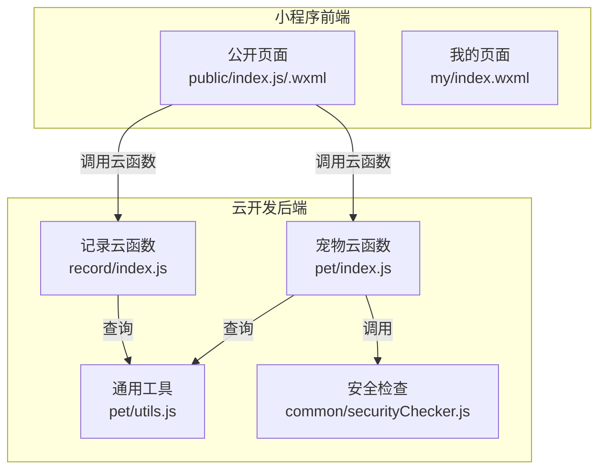
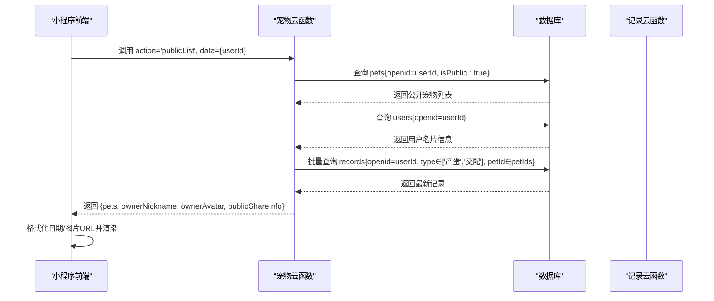
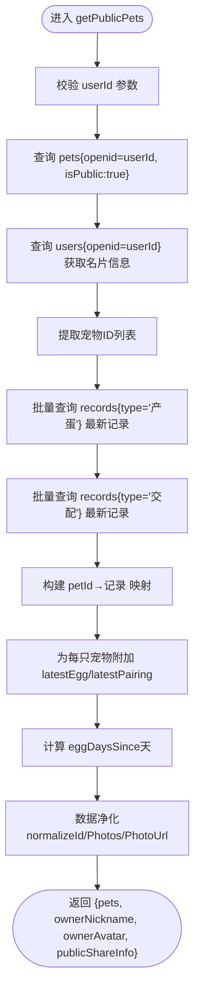
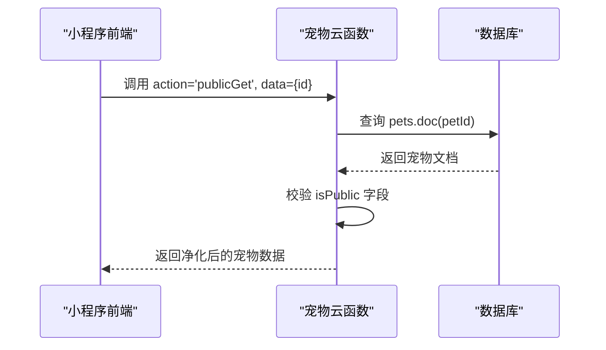
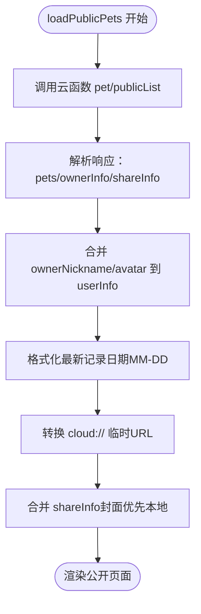
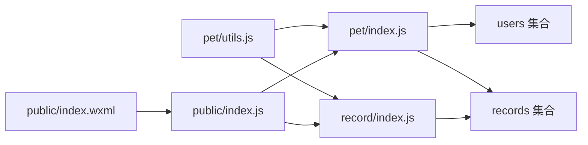

# 宠物公开分享功能

<cite>
**本文引用的文件**
- [cloudfunctions/pet/index.js](file://cloudfunctions/pet/index.js)
- [cloudfunctions/pet/utils.js](file://cloudfunctions/pet/utils.js)
- [cloudfunctions/record/index.js](file://cloudfunctions/record/index.js)
- [cloudfunctions/common/securityChecker.js](file://cloudfunctions/common/securityChecker.js)
- [miniprogram/subpkg-report/pages/public/index.js](file://miniprogram/subpkg-report/pages/public/index.js)
- [miniprogram/subpkg-report/pages/public/index.wxml](file://miniprogram/subpkg-report/pages/public/index.wxml)
- [miniprogram/pages/my/index.wxml](file://miniprogram/pages/my/index.wxml)
</cite>

## 目录
1. [简介](#简介)
2. [项目结构](#项目结构)
3. [核心组件](#核心组件)
4. [架构总览](#架构总览)
5. [详细组件分析](#详细组件分析)
6. [依赖关系分析](#依赖关系分析)
7. [性能考量](#性能考量)
8. [故障排查指南](#故障排查指南)
9. [结论](#结论)
10. [附录](#附录)

## 简介
本文件面向“宠物公开分享”功能，系统性阐述公开宠物列表获取机制、权限控制策略、用户名片信息查询、以及公开宠物详情访问流程。重点解析以下函数的实现逻辑：
- getPublicPets：公开宠物筛选、用户信息获取、最新记录关联查询
- getPublicPetById：公开访问控制、数据净化处理
- 展示逻辑：产蛋记录、配对记录的最新数据获取与显示

同时提供完整的接口文档、权限验证规则、使用场景与最佳实践建议，帮助开发者快速理解与正确集成该功能。

## 项目结构
公开分享功能涉及小程序前端页面与云开发后端云函数协作：
- 小程序前端负责发起请求、渲染公开页面、处理图片与名片信息展示
- 云函数负责数据查询、权限校验、数据净化与聚合

图表来源
- [cloudfunctions/pet/index.js:45-82](file://cloudfunctions/pet/index.js#L45-L82)
- [cloudfunctions/pet/utils.js:1-69](file://cloudfunctions/pet/utils.js#L1-L69)
- [cloudfunctions/record/index.js:10-35](file://cloudfunctions/record/index.js#L10-L35)
- [cloudfunctions/common/securityChecker.js:30-226](file://cloudfunctions/common/securityChecker.js#L30-L226)
- [miniprogram/subpkg-report/pages/public/index.js:1-44](file://miniprogram/subpkg-report/pages/public/index.js#L1-L44)
- [miniprogram/pages/my/index.wxml:88-303](file://miniprogram/pages/my/index.wxml#L88-L303)

章节来源
- [cloudfunctions/pet/index.js:1-82](file://cloudfunctions/pet/index.js#L1-L82)
- [cloudfunctions/pet/utils.js:1-69](file://cloudfunctions/pet/utils.js#L1-L69)
- [cloudfunctions/record/index.js:1-35](file://cloudfunctions/record/index.js#L1-L35)
- [cloudfunctions/common/securityChecker.js:1-226](file://cloudfunctions/common/securityChecker.js#L1-L226)
- [miniprogram/subpkg-report/pages/public/index.js:1-44](file://miniprogram/subpkg-report/pages/public/index.js#L1-L44)
- [miniprogram/pages/my/index.wxml:88-303](file://miniprogram/pages/my/index.wxml#L88-L303)

## 核心组件
- 公开宠物列表获取：getPublicPets
  - 功能：按用户ID筛选公开宠物，附带用户名片信息与最新产蛋/配对记录
  - 关键点：isPublic=true、批量查询records、映射最新记录、计算产蛋间隔天数
- 公开宠物详情获取：getPublicPetById
  - 功能：无需权限验证，仅允许访问公开宠物
  - 关键点：校验isPublic字段、数据净化
- 展示层：公开页面 public/index.js/.wxml
  - 功能：接收云端数据，格式化日期、转换图片URL、展示名片信息与宠物卡片
- 记录层：records集合
  - 功能：维护产蛋、交配、出苗等事件记录，供公开页面聚合展示

章节来源
- [cloudfunctions/pet/index.js:252-368](file://cloudfunctions/pet/index.js#L252-L368)
- [cloudfunctions/record/index.js:84-122](file://cloudfunctions/record/index.js#L84-L122)
- [miniprogram/subpkg-report/pages/public/index.js:100-210](file://miniprogram/subpkg-report/pages/public/index.js#L100-L210)
- [miniprogram/subpkg-report/pages/public/index.wxml:1-117](file://miniprogram/subpkg-report/pages/public/index.wxml#L1-L117)

## 架构总览
公开分享功能的数据流如下：
- 前端调用云函数 pet/publicList(userId)
- 云函数查询 pets 集合（isPublic=true），并查询 users 集合获取名片信息
- 云函数批量查询 records 集合，取每只宠物的最新产蛋与配对记录
- 云函数返回 pets、ownerNickname、ownerAvatar、publicShareInfo
- 前端渲染公开页面，格式化日期与图片URL

图表来源
- [cloudfunctions/pet/index.js:252-349](file://cloudfunctions/pet/index.js#L252-L349)
- [cloudfunctions/pet/utils.js:46-57](file://cloudfunctions/pet/utils.js#L46-L57)
- [cloudfunctions/record/index.js:84-122](file://cloudfunctions/record/index.js#L84-L122)
- [miniprogram/subpkg-report/pages/public/index.js:100-210](file://miniprogram/subpkg-report/pages/public/index.js#L100-L210)

## 详细组件分析

### getPublicPets 实现逻辑
- 公开宠物筛选
  - 条件：openid=userId 且 isPublic=true
  - 排序：按创建时间倒序
- 用户名片信息
  - 查询 users 集合，返回 nickname、avatar、specialty、wechatId、wechatPublic、region、tags、intro、cover
- 最新记录关联查询
  - 构造 petIds 列表
  - 批量查询 records 集合，分别取 type='产蛋' 和 type='交配' 的最新记录
  - 构建 petId→记录 映射，为每只宠物附加 latestEgg、latestPairing
  - 计算 eggDaysSince：从最新产蛋日期到今天的天数
- 数据净化
  - normalizeId/normalizeIds：统一字段 id
  - sanitizePetData/sanitizePhotos/sanitizePhotoUrl：净化图片URL，兼容 cloud:// 与 tencent cloud 临时URL
- 返回结构
  - { pets, ownerNickname, ownerAvatar, publicShareInfo }

图表来源
- [cloudfunctions/pet/index.js:252-349](file://cloudfunctions/pet/index.js#L252-L349)
- [cloudfunctions/pet/utils.js:16-43](file://cloudfunctions/pet/utils.js#L16-L43)

章节来源
- [cloudfunctions/pet/index.js:252-349](file://cloudfunctions/pet/index.js#L252-L349)
- [cloudfunctions/pet/utils.js:16-43](file://cloudfunctions/pet/utils.js#L16-L43)

### getPublicPetById 实现逻辑
- 参数校验：必须提供 petId
- 查询宠物：根据 petId 获取宠物文档
- 权限控制：仅允许访问 isPublic=true 的宠物
- 数据净化：sanitizePetData/normalizeId
- 返回：净化后的宠物数据

图表来源
- [cloudfunctions/pet/index.js:351-368](file://cloudfunctions/pet/index.js#L351-L368)

章节来源
- [cloudfunctions/pet/index.js:351-368](file://cloudfunctions/pet/index.js#L351-L368)

### 展示逻辑与数据聚合
- 前端调用 API.callCloudFunction('pet', 'publicList', { userId })
- 云端返回 pets、ownerNickname、ownerAvatar、publicShareInfo
- 前端处理：
  - 将 ownerNickname/ownerAvatar 合并到 userInfo
  - 格式化最新记录日期（仅保留 MM-DD）
  - 将 cloud:// 或 tencent cloud 临时URL转换为可用的临时URL
  - 转换宠物首张图片为可用URL
  - 合并 shareInfo（封面优先本地，否则使用云端）

图表来源
- [miniprogram/subpkg-report/pages/public/index.js:100-210](file://miniprogram/subpkg-report/pages/public/index.js#L100-L210)
- [miniprogram/subpkg-report/pages/public/index.wxml:1-117](file://miniprogram/subpkg-report/pages/public/index.wxml#L1-L117)

章节来源
- [miniprogram/subpkg-report/pages/public/index.js:100-210](file://miniprogram/subpkg-report/pages/public/index.js#L100-L210)
- [miniprogram/subpkg-report/pages/public/index.wxml:1-117](file://miniprogram/subpkg-report/pages/public/index.wxml#L1-L117)

### 用户名片信息与权限控制
- 用户名片字段（来自 users 集合）：
  - specialty、wechatId、wechatPublic、region、tags、intro、cover
- 权限控制：
  - getPublicPets：无需 openid 验证，仅按 isPublic=true 过滤
  - getPublicPetById：无需 openid 验证，但要求 isPublic=true
  - 前端公开页面：支持访客访问，名片信息按用户设置公开与否展示

章节来源
- [cloudfunctions/pet/index.js:279-287](file://cloudfunctions/pet/index.js#L279-L287)
- [cloudfunctions/pet/index.js:362-365](file://cloudfunctions/pet/index.js#L362-L365)
- [miniprogram/pages/my/index.wxml:88-303](file://miniprogram/pages/my/index.wxml#L88-L303)

## 依赖关系分析
- 云函数 pet/index.js 依赖：
  - utils.js：数据库连接、OpenID获取、响应封装、ID规范化
  - records 集合：最新产蛋/配对记录聚合
  - users 集合：名片信息
- 云函数 record/index.js 依赖：
  - utils.js：数据库连接、OpenID获取、响应封装、ID规范化
- 前端 public/index.js 依赖：
  - API 工具：调用云函数
  - 图片工具：convertPhotoIdsToUrls/getTempUrl
  - WXML：渲染公开页面

图表来源
- [cloudfunctions/pet/utils.js:1-69](file://cloudfunctions/pet/utils.js#L1-L69)
- [cloudfunctions/pet/index.js:1-10](file://cloudfunctions/pet/index.js#L1-L10)
- [cloudfunctions/record/index.js:1-10](file://cloudfunctions/record/index.js#L1-L10)
- [miniprogram/subpkg-report/pages/public/index.js:1-4](file://miniprogram/subpkg-report/pages/public/index.js#L1-L4)
- [miniprogram/subpkg-report/pages/public/index.wxml:1-1](file://miniprogram/subpkg-report/pages/public/index.wxml#L1-L1)

章节来源
- [cloudfunctions/pet/utils.js:1-69](file://cloudfunctions/pet/utils.js#L1-L69)
- [cloudfunctions/pet/index.js:1-10](file://cloudfunctions/pet/index.js#L1-L10)
- [cloudfunctions/record/index.js:1-10](file://cloudfunctions/record/index.js#L1-L10)
- [miniprogram/subpkg-report/pages/public/index.js:1-4](file://miniprogram/subpkg-report/pages/public/index.js#L1-L4)
- [miniprogram/subpkg-report/pages/public/index.wxml:1-1](file://miniprogram/subpkg-report/pages/public/index.wxml#L1-L1)

## 性能考量
- 批量查询优化
  - getPublicPets 中对 records 的查询使用 _.in(petIds) 并限制每种类型最多 petIds.length 条，避免 N+1 查询
- 时间复杂度
  - 公开宠物查询：O(n)，其中 n 为公开宠物数量
  - 最新记录查询：O(m)，其中 m 为公开宠物数量（两条独立查询）
  - 整体：O(n+m)
- 图片URL转换
  - 前端仅对 cloud:// 或 tencent cloud 临时URL执行转换，减少不必要的网络请求
- 数据净化
  - sanitizePhotoUrl/sanitizePhotos 在云端与前端双重处理，确保输出稳定

章节来源
- [cloudfunctions/pet/index.js:297-309](file://cloudfunctions/pet/index.js#L297-L309)
- [cloudfunctions/pet/index.js:16-43](file://cloudfunctions/pet/index.js#L16-L43)
- [miniprogram/subpkg-report/pages/public/index.js:164-192](file://miniprogram/subpkg-report/pages/public/index.js#L164-L192)

## 故障排查指南
- 公开宠物为空
  - 检查用户是否设置了 isPublic=true
  - 检查 userId 是否正确传入
- 图片无法显示
  - 确认 cloud:// 或 tencent cloud 临时URL是否有效
  - 前端已做URL转换，若仍失败，检查文件是否存在
- 名片信息不显示
  - 检查 users 集合中对应字段是否设置
  - 微信号公开开关 wechatPublic 是否开启
- 权限错误
  - getPublicPetById 仅允许访问 isPublic=true 的宠物
  - 前端公开页面支持访客访问，无需登录

章节来源
- [cloudfunctions/pet/index.js:351-368](file://cloudfunctions/pet/index.js#L351-L368)
- [cloudfunctions/pet/index.js:279-287](file://cloudfunctions/pet/index.js#L279-L287)
- [miniprogram/subpkg-report/pages/public/index.js:164-192](file://miniprogram/subpkg-report/pages/public/index.js#L164-L192)

## 结论
公开分享功能通过“公开宠物筛选 + 用户名片聚合 + 最新记录关联”的方式，为访客提供了简洁直观的宠物档案浏览体验。云端与前端协同实现了高效的数据获取与展示，同时通过权限控制保障了隐私边界。建议在生产环境中持续关注图片URL有效性与用户隐私设置，以提升用户体验与安全性。

## 附录

### 接口定义

- 获取公开宠物列表
  - 方法：GET/云函数调用
  - 云函数：pet
  - action：publicList
  - 请求参数
    - userId: string（必填，目标用户的 openid）
  - 返回值
    - success: boolean
    - data: object
      - pets: array（公开宠物数组）
      - ownerNickname: string（宠物主人昵称）
      - ownerAvatar: string（宠物主人头像URL）
      - publicShareInfo: object（公开名片信息）
        - specialty: string（主玩品种）
        - wechatId: string（微信号）
        - wechatPublic: boolean（是否公开微信号）
        - region: string（地区）
        - tags: array（标签）
        - intro: string（简介）
        - cover: string（封面URL）
    - message: string
  - 权限规则
    - 无需登录态，但仅返回 isPublic=true 的宠物
  - 错误码
    - 缺少 userId：抛出错误
    - 查询失败：返回 errorResponse

- 获取公开宠物详情
  - 方法：GET/云函数调用
  - 云函数：pet
  - action：publicGet
  - 请求参数
    - id: string（必填，宠物ID）
  - 返回值
    - success: boolean
    - data: object（净化后的宠物数据）
    - message: string
  - 权限规则
    - 无需登录态，但仅允许访问 isPublic=true 的宠物
  - 错误码
    - 缺少 petId：抛出错误
    - 宠物不存在：抛出错误
    - 宠物未公开：抛出错误

- 展示字段说明（公开页面）
  - 宠物卡片
    - photos: array（首张图片用于卡片展示）
    - name/alias/gender/status/price/category 等基础信息
    - latestEgg/latestPairing：最新产蛋/配对记录（含日期）
    - eggDaysSince：距上次产蛋天数
  - 名片信息
    - ownerNickname/ownerAvatar：宠物主人信息
    - publicShareInfo：公开名片（specialty、region、tags、cover 等）

章节来源
- [cloudfunctions/pet/index.js:61-66](file://cloudfunctions/pet/index.js#L61-L66)
- [cloudfunctions/pet/index.js:252-349](file://cloudfunctions/pet/index.js#L252-L349)
- [cloudfunctions/pet/index.js:65-66](file://cloudfunctions/pet/index.js#L65-L66)
- [cloudfunctions/pet/index.js:351-368](file://cloudfunctions/pet/index.js#L351-L368)
- [miniprogram/subpkg-report/pages/public/index.wxml:78-115](file://miniprogram/subpkg-report/pages/public/index.wxml#L78-L115)

### 实际使用场景与最佳实践
- 场景一：访客浏览他人公开档案
  - 前端通过 scene 或 userId 参数传递目标用户ID
  - 调用 pet/publicList 获取公开宠物与名片信息
  - 前端渲染卡片与名片，支持分享到朋友圈
- 场景二：直接访问某只公开宠物详情
  - 前端调用 pet/publicGet 获取净化后的宠物数据
  - 适用于短链或二维码直达
- 最佳实践
  - 云端与前端均进行图片URL净化，避免过期链接
  - 仅在必要时转换URL，减少网络请求
  - 用户名片公开项应明确开关，默认保护隐私
  - 记录聚合采用批量查询与映射，避免多次数据库往返

章节来源
- [miniprogram/subpkg-report/pages/public/index.js:20-44](file://miniprogram/subpkg-report/pages/public/index.js#L20-L44)
- [cloudfunctions/pet/index.js:297-346](file://cloudfunctions/pet/index.js#L297-L346)
- [cloudfunctions/pet/index.js:16-43](file://cloudfunctions/pet/index.js#L16-L43)