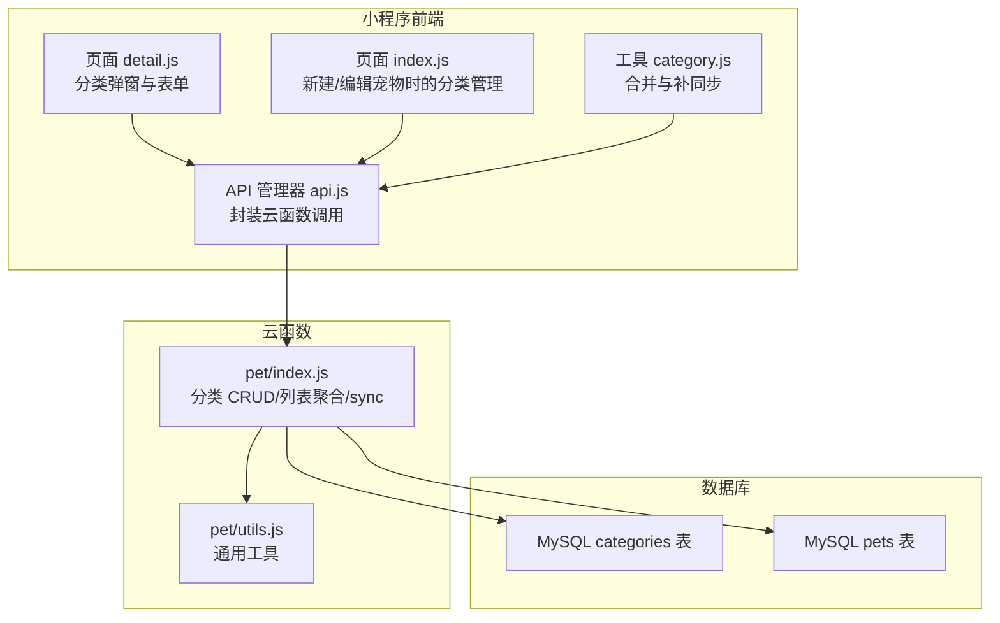
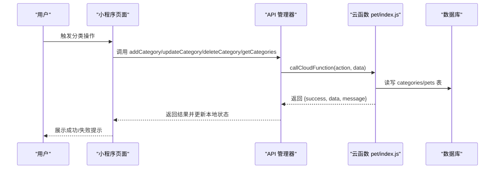
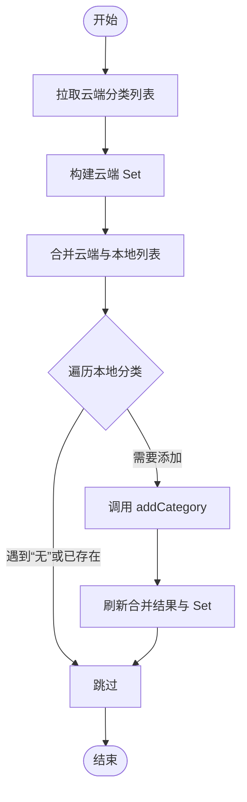
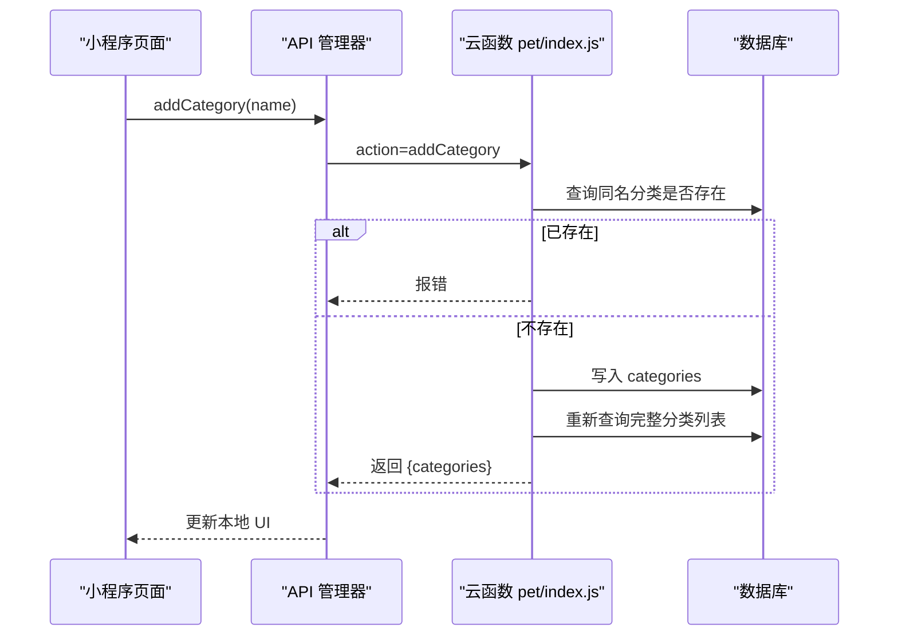
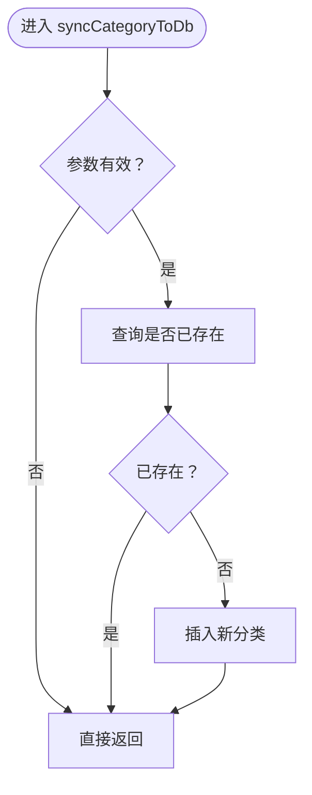
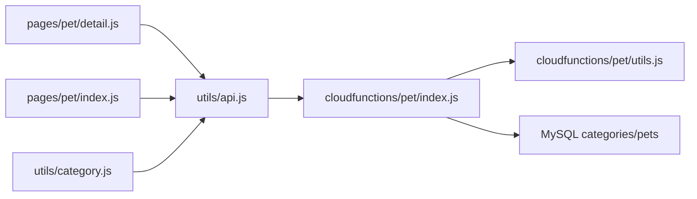

# 宠物分类管理

<cite>
**本文引用的文件**
- [miniprogram/utils/category.js](file://miniprogram/utils/category.js)
- [cloudfunctions/pet/index.js](file://cloudfunctions/pet/index.js)
- [cloudfunctions/pet/utils.js](file://cloudfunctions/pet/utils.js)
- [miniprogram/utils/api.js](file://miniprogram/utils/api.js)
- [miniprogram/pages/pet/detail.js](file://miniprogram/pages/pet/detail.js)
- [miniprogram/pages/pet/index.js](file://miniprogram/pages/pet/index.js)
- [server-setup/database.sql](file://server-setup/database.sql)
</cite>

## 目录
1. [引言](#引言)
2. [项目结构](#项目结构)
3. [核心组件](#核心组件)
4. [架构总览](#架构总览)
5. [详细组件分析](#详细组件分析)
6. [依赖关系分析](#依赖关系分析)
7. [性能考量](#性能考量)
8. [故障排查指南](#故障排查指南)
9. [结论](#结论)
10. [附录](#附录)

## 引言
本文件围绕“宠物分类管理”主题，系统梳理并解释分类系统的完整实现，涵盖分类列表获取、分类添加、分类更新、分类删除等核心功能；深入解析 buildCategoryList 的分类合并逻辑、去重机制与排序规则；阐述 syncCategoryToDb 的分类同步策略与自动创建机制；说明分类更新时的级联处理与数据一致性保障；提供完整的分类管理 API 文档与最佳实践、性能优化建议及典型使用场景。

## 项目结构
分类管理涉及三层协作：
- 前端小程序层：负责 UI 展示、交互与本地缓存，调用统一 API 管理器发起云函数请求。
- 云函数层：提供分类 CRUD 与列表聚合能力，负责与数据库交互与一致性控制。
- 数据库层：MySQL 中的 categories 表与 pets 表中的分类字段协同维护。

图表来源
- [miniprogram/pages/pet/detail.js:644-793](file://miniprogram/pages/pet/detail.js#L644-L793)
- [miniprogram/pages/pet/index.js:821-986](file://miniprogram/pages/pet/index.js#L821-L986)
- [miniprogram/utils/category.js:1-65](file://miniprogram/utils/category.js#L1-L65)
- [miniprogram/utils/api.js:43-81](file://miniprogram/utils/api.js#L43-L81)
- [cloudfunctions/pet/index.js:517-688](file://cloudfunctions/pet/index.js#L517-L688)
- [cloudfunctions/pet/utils.js:15-18](file://cloudfunctions/pet/utils.js#L15-L18)
- [server-setup/database.sql:163-181](file://server-setup/database.sql#L163-L181)

章节来源
- [miniprogram/utils/category.js:1-65](file://miniprogram/utils/category.js#L1-L65)
- [cloudfunctions/pet/index.js:517-688](file://cloudfunctions/pet/index.js#L517-L688)
- [miniprogram/utils/api.js:43-81](file://miniprogram/utils/api.js#L43-L81)
- [server-setup/database.sql:163-181](file://server-setup/database.sql#L163-L181)

## 核心组件
- 分类合并与补同步工具：提供多源合并、去重、首项固定与云端补同步能力。
- 云函数分类服务：提供分类列表、添加、更新、删除与同步策略。
- 前端 API 管理器：统一封装云函数调用，返回标准化结果。
- 页面交互：在新建/编辑宠物与独立分类管理界面中调用上述能力。

章节来源
- [miniprogram/utils/category.js:1-65](file://miniprogram/utils/category.js#L1-L65)
- [cloudfunctions/pet/index.js:517-688](file://cloudfunctions/pet/index.js#L517-L688)
- [miniprogram/utils/api.js:43-81](file://miniprogram/utils/api.js#L43-L81)

## 架构总览
分类管理遵循“前端 UI -> API 管理器 -> 云函数 -> 数据库”的链路，同时在云函数侧通过 buildCategoryList 聚合用户自有分类与已使用分类，并在创建/更新宠物时通过 syncCategoryToDb 自动确保分类存在。

图表来源
- [miniprogram/utils/api.js:12-38](file://miniprogram/utils/api.js#L12-L38)
- [cloudfunctions/pet/index.js:45-82](file://cloudfunctions/pet/index.js#L45-L82)
- [cloudfunctions/pet/index.js:517-634](file://cloudfunctions/pet/index.js#L517-L634)

## 详细组件分析

### 分类合并与补同步（前端工具）
- 合并策略
  - 固定首项为“无”，保证默认选项始终在首位。
  - 使用 Set 去重，按出现顺序保留，忽略空值与重复项。
  - 忽略“无”以外的重复项，确保最终列表稳定有序。
- 补同步策略
  - 先拉取云端分类列表，生成 Set。
  - 对比本地列表，逐个尝试添加缺失分类。
  - 成功后刷新合并结果并更新 Set，保证后续不再重复添加。

图表来源
- [miniprogram/utils/category.js:29-59](file://miniprogram/utils/category.js#L29-L59)

章节来源
- [miniprogram/utils/category.js:1-65](file://miniprogram/utils/category.js#L1-L65)

### 云函数分类服务（后端）
- 列表获取：buildCategoryList 并行查询 categories 与 pets，按创建时间升序排列用户自定义分类，再追加已使用分类，去重后形成最终列表。
- 添加分类：校验非空与唯一性，插入 categories 表后重新获取完整列表。
- 更新分类：禁止修改默认“无”，校验新名称唯一性；更新 categories 表并级联更新 pets 表中对应分类。
- 删除分类：删除 categories 表记录，并将 pets 表中使用该分类的记录统一更新为“无”。

图表来源
- [cloudfunctions/pet/index.js:526-556](file://cloudfunctions/pet/index.js#L526-L556)
- [cloudfunctions/pet/index.js:637-665](file://cloudfunctions/pet/index.js#L637-L665)

章节来源
- [cloudfunctions/pet/index.js:517-688](file://cloudfunctions/pet/index.js#L517-L688)

### 同步策略与自动创建（syncCategoryToDb）
- 在创建/更新宠物时，若分类非空且非“无”，则调用 syncCategoryToDb 确保分类存在于数据库。
- 若不存在则自动创建；若已存在则跳过。
- 该策略避免了“先用后补”的不一致问题，保证 UI 与数据一致。

图表来源
- [cloudfunctions/pet/index.js:672-688](file://cloudfunctions/pet/index.js#L672-L688)

章节来源
- [cloudfunctions/pet/index.js:132-135](file://cloudfunctions/pet/index.js#L132-L135)
- [cloudfunctions/pet/index.js:221-225](file://cloudfunctions/pet/index.js#L221-L225)
- [cloudfunctions/pet/index.js:672-688](file://cloudfunctions/pet/index.js#L672-L688)

### 级联处理与数据一致性
- 更新分类：更新 categories 表后，立即级联更新 pets 表中所有使用旧分类的记录为新分类，确保数据一致性。
- 删除分类：删除 categories 表记录后，将 pets 表中使用该分类的记录统一更新为“无”，防止悬挂引用。
- 默认分类“无”不可修改/删除，避免破坏基础语义。

章节来源
- [cloudfunctions/pet/index.js:588-604](file://cloudfunctions/pet/index.js#L588-L604)
- [cloudfunctions/pet/index.js:620-630](file://cloudfunctions/pet/index.js#L620-L630)

### 前端交互与 API 调用
- 新建/编辑宠物页面与独立分类管理页面均通过 API 管理器调用云函数，成功后更新本地缓存与全局预加载数据。
- 支持本地回退：当网络异常时优先使用本地缓存，保证可用性。

章节来源
- [miniprogram/pages/pet/detail.js:644-793](file://miniprogram/pages/pet/detail.js#L644-L793)
- [miniprogram/pages/pet/index.js:821-986](file://miniprogram/pages/pet/index.js#L821-L986)
- [miniprogram/utils/api.js:43-81](file://miniprogram/utils/api.js#L43-L81)

## 依赖关系分析
- 前端依赖
  - 页面依赖 API 管理器进行云函数调用。
  - 工具模块依赖 API 管理器进行云端补同步。
- 云函数依赖
  - 依赖数据库连接与工具函数，提供分类 CRUD 与列表聚合。
- 数据库依赖
  - categories 表存储用户自定义分类；pets 表的 category 字段引用分类。

图表来源
- [miniprogram/pages/pet/detail.js:644-793](file://miniprogram/pages/pet/detail.js#L644-L793)
- [miniprogram/pages/pet/index.js:821-986](file://miniprogram/pages/pet/index.js#L821-L986)
- [miniprogram/utils/category.js:1-65](file://miniprogram/utils/category.js#L1-L65)
- [miniprogram/utils/api.js:43-81](file://miniprogram/utils/api.js#L43-L81)
- [cloudfunctions/pet/index.js:517-688](file://cloudfunctions/pet/index.js#L517-L688)
- [cloudfunctions/pet/utils.js:15-18](file://cloudfunctions/pet/utils.js#L15-L18)
- [server-setup/database.sql:163-181](file://server-setup/database.sql#L163-L181)

章节来源
- [miniprogram/utils/api.js:43-81](file://miniprogram/utils/api.js#L43-L81)
- [cloudfunctions/pet/index.js:517-688](file://cloudfunctions/pet/index.js#L517-L688)
- [server-setup/database.sql:163-181](file://server-setup/database.sql#L163-L181)

## 性能考量
- 并行查询：buildCategoryList 使用 Promise.all 并行获取 categories 与 pets 的分类数据，降低等待时间。
- 去重与顺序：使用 Set 去重与顺序保持，避免重复渲染与排序开销。
- 云端补同步：仅对缺失分类执行添加，减少无效写入。
- 级联更新：批量更新 pets 表中使用旧分类的记录，避免多次往返。

章节来源
- [cloudfunctions/pet/index.js:637-665](file://cloudfunctions/pet/index.js#L637-L665)
- [miniprogram/utils/category.js:29-59](file://miniprogram/utils/category.js#L29-L59)

## 故障排查指南
- 云函数调用失败
  - 现象：返回 {success:false, message} 或 useFallback=true。
  - 处理：检查网络状态与云函数可用性，必要时降级使用本地缓存。
- 分类唯一性冲突
  - 现象：添加/更新时报“分类已存在”。
  - 处理：确认新名称是否与现有分类重复，或等待同步完成。
- 默认分类保护
  - 现象：尝试修改/删除“无”分类。
  - 处理：遵守默认分类不可变更的约束。
- 同步异常
  - 现象：本地与云端分类不一致。
  - 处理：触发补同步流程，确保云端补齐缺失分类。

章节来源
- [miniprogram/utils/api.js:12-38](file://miniprogram/utils/api.js#L12-L38)
- [cloudfunctions/pet/index.js:526-556](file://cloudfunctions/pet/index.js#L526-L556)
- [cloudfunctions/pet/index.js:558-608](file://cloudfunctions/pet/index.js#L558-L608)
- [cloudfunctions/pet/index.js:610-634](file://cloudfunctions/pet/index.js#L610-L634)
- [miniprogram/utils/category.js:29-59](file://miniprogram/utils/category.js#L29-L59)

## 结论
该分类管理体系以“前端工具 + 云函数 + 数据库”三层协同实现，具备完善的合并去重、自动同步与级联一致性保障。通过并行查询与批量更新优化性能，并在默认分类保护与唯一性约束下确保数据稳健性。推荐在实际使用中结合本地缓存与云端补同步策略，提升用户体验与系统可靠性。

## 附录

### API 定义与参数规范
- 获取分类列表
  - 方法：getCategories
  - 参数：无
  - 返回：{ success, data: { categories } }
- 添加分类
  - 方法：addCategory
  - 参数：{ name }
  - 返回：{ success, data: { categories } }
- 更新分类
  - 方法：updateCategory
  - 参数：{ oldName, newName }
  - 返回：{ success, data: { categories } }
- 删除分类
  - 方法：deleteCategory
  - 参数：{ name }
  - 返回：{ success, data: { categories } }

章节来源
- [miniprogram/utils/api.js:67-81](file://miniprogram/utils/api.js#L67-L81)
- [cloudfunctions/pet/index.js:517-634](file://cloudfunctions/pet/index.js#L517-L634)

### 数据模型与索引
- 分类表（categories）
  - 关键字段：category_id（唯一）、openid、name、sort_order、is_default、status
  - 索引：主键、唯一索引 category_id、索引 openid/status
- 宠物表（pets）
  - 关键字段：pet_id、openid、category
  - 索引：主键、索引 openid/category/status

章节来源
- [server-setup/database.sql:163-181](file://server-setup/database.sql#L163-L181)
- [server-setup/database.sql:49-76](file://server-setup/database.sql#L49-L76)