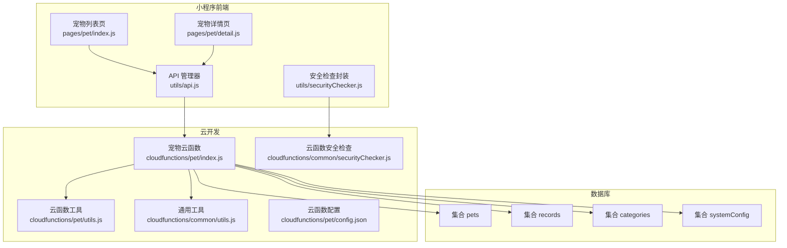
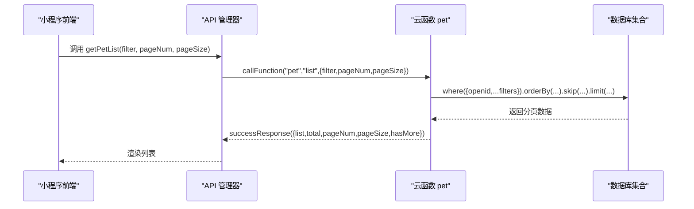
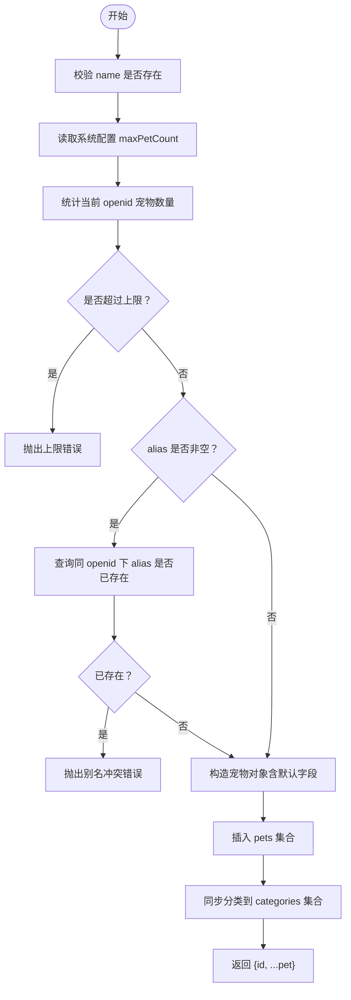
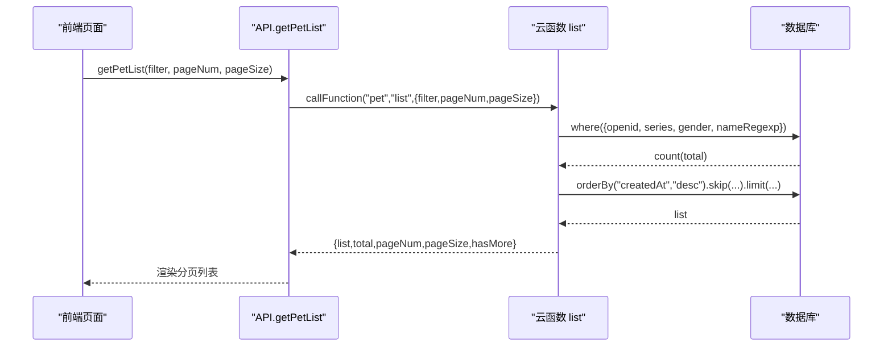
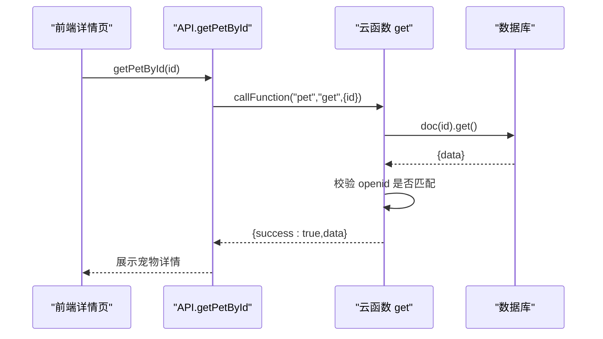
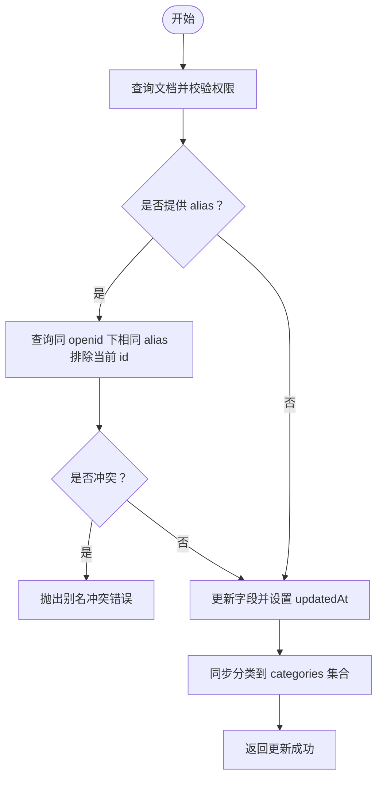
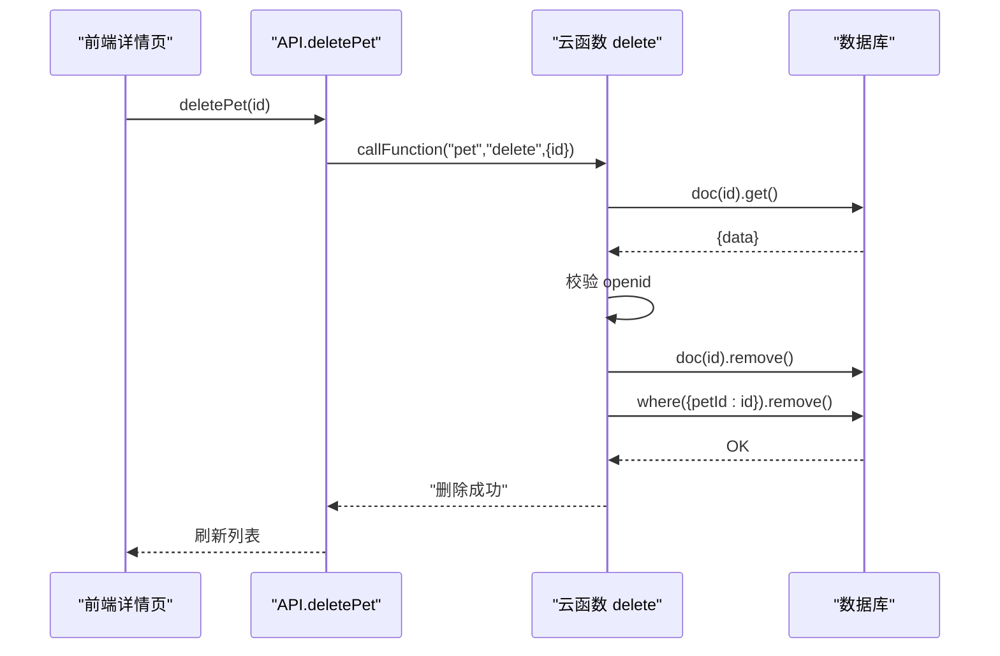
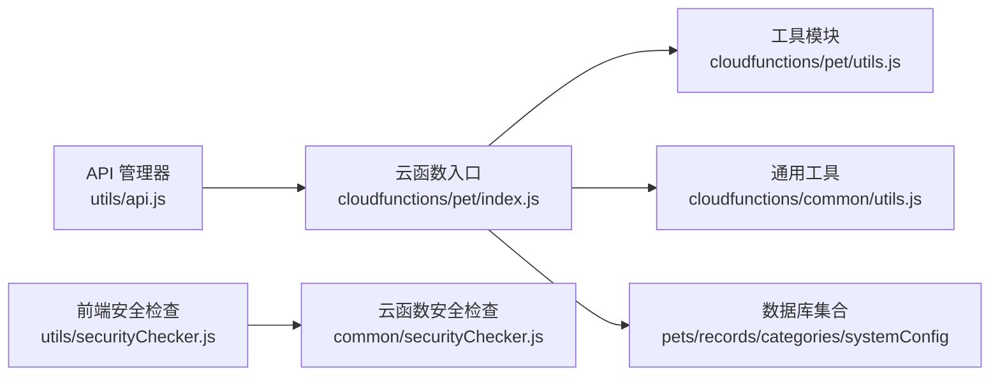
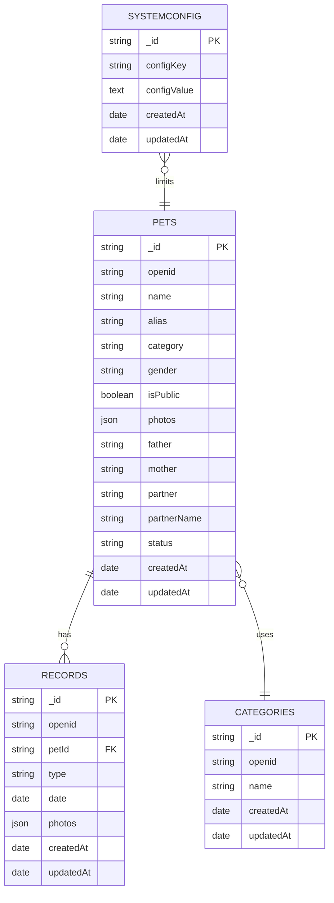

# 宠物基础CRUD操作

<cite>
**本文档引用的文件**
- [cloudfunctions/pet/index.js](file://cloudfunctions/pet/index.js)
- [cloudfunctions/pet/utils.js](file://cloudfunctions/pet/utils.js)
- [cloudfunctions/common/utils.js](file://cloudfunctions/common/utils.js)
- [cloudfunctions/common/securityChecker.js](file://cloudfunctions/common/securityChecker.js)
- [miniprogram/utils/api.js](file://miniprogram/utils/api.js)
- [miniprogram/pages/pet/index.js](file://miniprogram/pages/pet/index.js)
- [miniprogram/pages/pet/detail.js](file://miniprogram/pages/pet/detail.js)
- [miniprogram/utils/securityChecker.js](file://miniprogram/utils/securityChecker.js)
- [cloudfunctions/pet/config.json](file://cloudfunctions/pet/config.json)
- [server-setup/database.sql](file://server-setup/database.sql)
</cite>

## 目录
1. [简介](#简介)
2. [项目结构](#项目结构)
3. [核心组件](#核心组件)
4. [架构总览](#架构总览)
5. [详细组件分析](#详细组件分析)
6. [依赖关系分析](#依赖关系分析)
7. [性能考量](#性能考量)
8. [故障排查指南](#故障排查指南)
9. [结论](#结论)
10. [附录](#附录)

## 简介
本文件面向“宠物基础CRUD操作”的完整实现，涵盖增删改查全流程，重点包括：
- createPet：参数验证、数据净化、数量限制检查、别名唯一性验证
- getPetList：分页查询、搜索过滤、排序规则
- getPetById：权限验证、数据安全检查
- updatePet：更新流程、权限验证、别名冲突处理
- deletePet：级联删除机制、关联数据清理
- API接口文档：请求参数、响应格式、错误处理
- 实际代码示例与常见问题解决方案

## 项目结构
该项目采用“小程序前端 + 云开发云函数”的架构，宠物CRUD能力集中在 pet 云函数中，前端通过 API 管理器统一调用。

图表来源
- [cloudfunctions/pet/index.js:45-82](file://cloudfunctions/pet/index.js#L45-L82)
- [cloudfunctions/pet/utils.js:1-69](file://cloudfunctions/pet/utils.js#L1-L69)
- [cloudfunctions/common/utils.js:1-69](file://cloudfunctions/common/utils.js#L1-L69)
- [cloudfunctions/common/securityChecker.js:1-226](file://cloudfunctions/common/securityChecker.js#L1-L226)
- [miniprogram/utils/api.js:1-208](file://miniprogram/utils/api.js#L1-L208)
- [miniprogram/utils/securityChecker.js:1-122](file://miniprogram/utils/securityChecker.js#L1-L122)

章节来源
- [cloudfunctions/pet/index.js:1-82](file://cloudfunctions/pet/index.js#L1-L82)
- [miniprogram/utils/api.js:1-208](file://miniprogram/utils/api.js#L1-L208)

## 核心组件
- 云函数入口与路由分发：根据 action 调用对应函数（create/list/get/update/delete/publicList/getPedigree/publicGet/getCategories/addCategory/updateCategory/deleteCategory）
- 工具模块：统一数据库连接、OpenID 获取、响应封装、ID 规范化
- 前端 API 管理器：封装云函数调用、错误处理、分页参数传递
- 安全检查：前后端均提供安全检查封装，支持图片/文本审核

章节来源
- [cloudfunctions/pet/index.js:45-82](file://cloudfunctions/pet/index.js#L45-L82)
- [cloudfunctions/pet/utils.js:1-69](file://cloudfunctions/pet/utils.js#L1-L69)
- [cloudfunctions/common/utils.js:1-69](file://cloudfunctions/common/utils.js#L1-L69)
- [miniprogram/utils/api.js:1-208](file://miniprogram/utils/api.js#L1-L208)

## 架构总览
下图展示了从前端到云函数再到数据库的数据流与控制流。

图表来源
- [miniprogram/utils/api.js:43-45](file://miniprogram/utils/api.js#L43-L45)
- [cloudfunctions/pet/index.js:140-180](file://cloudfunctions/pet/index.js#L140-L180)

## 详细组件分析

### createPet 创建宠物
- 参数验证
  - 必填字段：name
  - 读取系统配置中的最大宠物数量限制（默认10），若超过则拒绝创建
- 数据净化
  - photos 字段统一净化为 cloud://fileID 格式
- 别名唯一性
  - 非空时检查同一 openid 下是否存在相同 alias
- 分类同步
  - 若 category 非默认值，则同步到 categories 集合
- 返回
  - 成功返回 { id, ...pet }

图表来源
- [cloudfunctions/pet/index.js:84-138](file://cloudfunctions/pet/index.js#L84-L138)

章节来源
- [cloudfunctions/pet/index.js:84-138](file://cloudfunctions/pet/index.js#L84-L138)

### getPetList 分页查询与过滤
- 查询条件
  - 默认按 openid 过滤
  - 支持分类（series）、性别（gender）、搜索关键字（searchText）
  - 搜索使用 name 字段的正则匹配（大小写不敏感）
- 分页
  - pageSize 默认20，pageNum 默认1
  - skip = (pageNum - 1) * pageSize
- 排序
  - 按 createdAt 降序
- 返回
  - list、total、pageNum、pageSize、hasMore

图表来源
- [miniprogram/utils/api.js:43-45](file://miniprogram/utils/api.js#L43-L45)
- [cloudfunctions/pet/index.js:140-180](file://cloudfunctions/pet/index.js#L140-L180)

章节来源
- [cloudfunctions/pet/index.js:140-180](file://cloudfunctions/pet/index.js#L140-L180)
- [miniprogram/pages/pet/index.js:199-338](file://miniprogram/pages/pet/index.js#L199-L338)

### getPetById 权限验证与安全检查
- 权限验证
  - 通过 doc(id) 获取文档，若不存在或 openid 不匹配则报错
- 数据安全
  - 返回前对 photos 进行 URL 净化（cloud://fileID）

图表来源
- [miniprogram/utils/api.js:47-49](file://miniprogram/utils/api.js#L47-L49)
- [cloudfunctions/pet/index.js:182-191](file://cloudfunctions/pet/index.js#L182-L191)

章节来源
- [cloudfunctions/pet/index.js:182-191](file://cloudfunctions/pet/index.js#L182-L191)

### updatePet 更新流程与别名冲突处理
- 权限验证
  - 先查询文档，不存在或 openid 不匹配则报错
- 别名冲突
  - 更新时排除自身 id，避免自冲突
- 分类同步
  - 若 category 非默认值，同步到 categories 集合
- 返回
  - 成功返回“更新成功”

图表来源
- [cloudfunctions/pet/index.js:193-231](file://cloudfunctions/pet/index.js#L193-L231)

章节来源
- [cloudfunctions/pet/index.js:193-231](file://cloudfunctions/pet/index.js#L193-L231)

### deletePet 级联删除与关联清理
- 权限验证
  - 通过 doc(id) 获取文档，不存在或 openid 不匹配则报错
- 级联删除
  - 删除 pets 文档
  - 删除 records 集合中所有 petId 关联记录（按 openid 字段过滤）

图表来源
- [miniprogram/utils/api.js:59-61](file://miniprogram/utils/api.js#L59-L61)
- [cloudfunctions/pet/index.js:233-250](file://cloudfunctions/pet/index.js#L233-L250)

章节来源
- [cloudfunctions/pet/index.js:233-250](file://cloudfunctions/pet/index.js#L233-L250)

### API 接口文档

- getPetList
  - 请求参数
    - filter: { series, gender, searchText }
    - pageNum: number（默认1）
    - pageSize: number（默认20）
  - 响应
    - list: 宠物数组
    - total: 总数
    - pageNum, pageSize, hasMore
  - 错误
    - 云函数内部捕获并返回 errorResponse

- getPetById
  - 请求参数
    - id: string
  - 响应
    - 宠物对象（含净化后的 photos）
  - 错误
    - 宠物不存在或无权限

- createPet
  - 请求参数
    - name, category, gender, alias, father, mother, partner, partnerName, price, status, isPublic, photos
  - 响应
    - { id, ...pet }
  - 错误
    - 名称为空、超过数量上限、别名冲突

- updatePet
  - 请求参数
    - id, ...更新字段
  - 响应
    - “更新成功”
  - 错误
    - 宠物不存在或无权限、别名冲突

- deletePet
  - 请求参数
    - id: string
  - 响应
    - “删除成功”
  - 错误
    - 宠物不存在或无权限

章节来源
- [miniprogram/utils/api.js:43-81](file://miniprogram/utils/api.js#L43-L81)
- [cloudfunctions/pet/index.js:84-250](file://cloudfunctions/pet/index.js#L84-L250)

## 依赖关系分析

图表来源
- [miniprogram/utils/api.js:1-208](file://miniprogram/utils/api.js#L1-L208)
- [cloudfunctions/pet/index.js:1-82](file://cloudfunctions/pet/index.js#L1-L82)
- [cloudfunctions/pet/utils.js:1-69](file://cloudfunctions/pet/utils.js#L1-L69)
- [cloudfunctions/common/utils.js:1-69](file://cloudfunctions/common/utils.js#L1-L69)
- [cloudfunctions/common/securityChecker.js:1-226](file://cloudfunctions/common/securityChecker.js#L1-L226)
- [miniprogram/utils/securityChecker.js:1-122](file://miniprogram/utils/securityChecker.js#L1-L122)

章节来源
- [cloudfunctions/pet/index.js:1-82](file://cloudfunctions/pet/index.js#L1-L82)
- [cloudfunctions/pet/utils.js:1-69](file://cloudfunctions/pet/utils.js#L1-L69)
- [cloudfunctions/common/utils.js:1-69](file://cloudfunctions/common/utils.js#L1-L69)
- [cloudfunctions/common/securityChecker.js:1-226](file://cloudfunctions/common/securityChecker.js#L1-L226)
- [miniprogram/utils/securityChecker.js:1-122](file://miniprogram/utils/securityChecker.js#L1-L122)

## 性能考量
- 分页与排序
  - 使用 skip/limit 实现分页，orderBy("createdAt","desc") 保证一致性
- 查询优化
  - where 条件组合避免多次 .where() 覆盖
  - 搜索使用正则匹配 name 字段，建议在大数据量时考虑索引优化
- 并发控制
  - 前端通过请求序列号避免并发请求导致的旧数据覆盖
- 数据净化
  - 统一将图片 URL 转换为 cloud://fileID，减少跨域与临时 URL 问题

章节来源
- [cloudfunctions/pet/index.js:140-180](file://cloudfunctions/pet/index.js#L140-L180)
- [miniprogram/pages/pet/index.js:199-338](file://miniprogram/pages/pet/index.js#L199-L338)

## 故障排查指南
- 常见错误与定位
  - “宠物不存在”：检查 id 是否正确、是否属于当前 openid
  - “已达到最大宠物数量限制”：检查 systemConfig 中 maxPetCount 配置
  - “别名已存在”：检查同 openid 下是否已有相同 alias
  - “操作失败”：查看云函数日志，确认数据库异常或参数缺失
- 前端排查
  - 确认已登录并获取到 openid
  - 检查分页参数 pageNum/pageSize 是否合理
  - 确认图片 URL 已转换为 cloud://fileID
- 安全检查
  - 前端上传图片后，云函数会异步提交安全审核；若审核未通过，需重新上传合规图片

章节来源
- [cloudfunctions/pet/index.js:78-81](file://cloudfunctions/pet/index.js#L78-L81)
- [cloudfunctions/common/securityChecker.js:172-207](file://cloudfunctions/common/securityChecker.js#L172-L207)
- [miniprogram/utils/securityChecker.js:43-106](file://miniprogram/utils/securityChecker.js#L43-L106)

## 结论
本实现以云函数为中心，结合前端 API 管理器与工具模块，提供了完整的宠物 CRUD 能力。通过严格的权限校验、数量限制与别名唯一性检查，确保数据一致性与安全性。分页查询与排序规则清晰，便于扩展更多筛选条件。建议在生产环境中进一步完善索引策略与监控告警，持续优化用户体验。

## 附录

### 数据模型与集合关系
- pets：存储宠物基本信息、关系字段（father/mother/partner）、公开状态、分类等
- records：存储宠物事件记录（交配、产蛋、健康等），与 pets 通过 petId 关联
- categories：存储用户自定义分类，与 pets 的 category 字段关联
- systemConfig：系统配置，如最大宠物数量限制

图表来源
- [server-setup/database.sql:49-109](file://server-setup/database.sql#L49-L109)
- [cloudfunctions/pet/index.js:89-98](file://cloudfunctions/pet/index.js#L89-L98)

章节来源
- [server-setup/database.sql:49-109](file://server-setup/database.sql#L49-L109)
- [cloudfunctions/pet/index.js:89-98](file://cloudfunctions/pet/index.js#L89-L98)