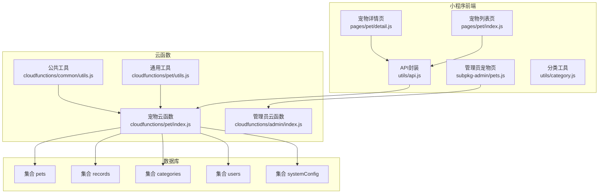
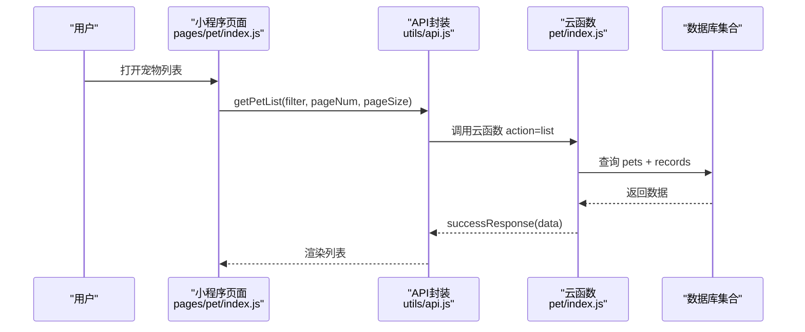
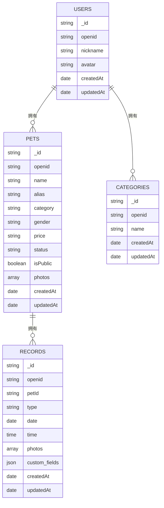
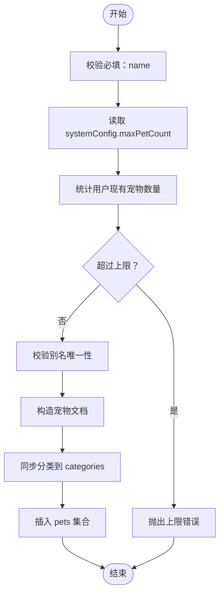
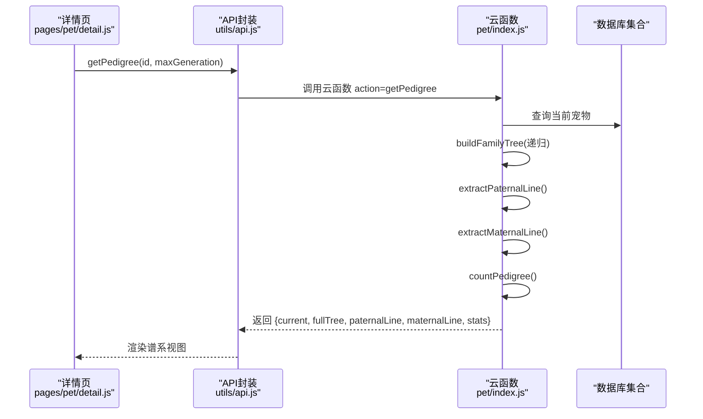
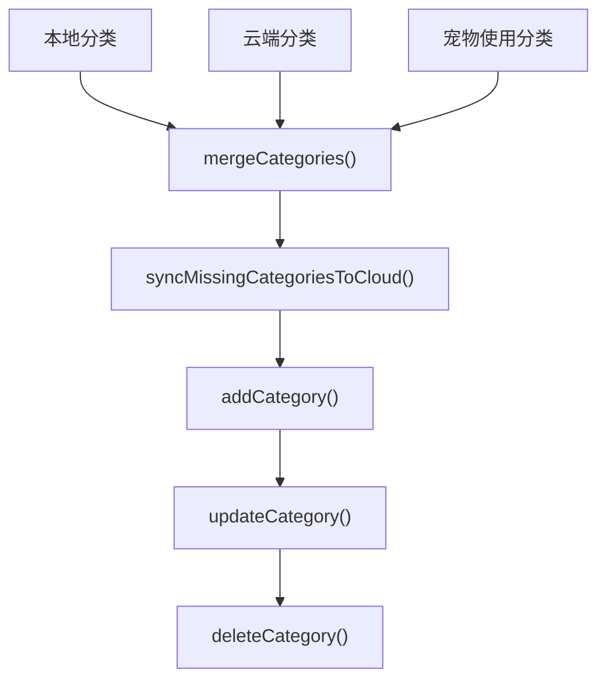
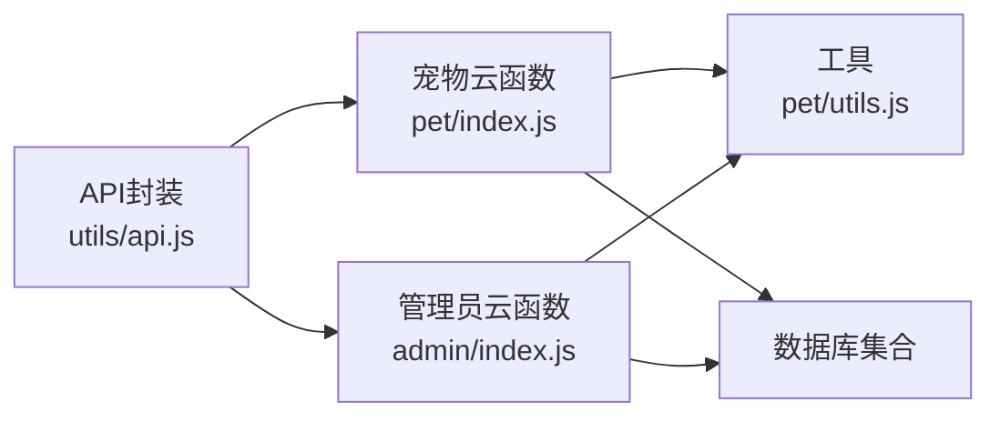

# 宠物管理模块

<cite>
**本文档引用的文件**
- [cloudfunctions/pet/index.js](file://cloudfunctions/pet/index.js)
- [cloudfunctions/pet/utils.js](file://cloudfunctions/pet/utils.js)
- [cloudfunctions/common/utils.js](file://cloudfunctions/common/utils.js)
- [miniprogram/utils/api.js](file://miniprogram/utils/api.js)
- [miniprogram/pages/pet/index.js](file://miniprogram/pages/pet/index.js)
- [miniprogram/pages/pet/detail.js](file://miniprogram/pages/pet/detail.js)
- [miniprogram/subpkg-admin/pages/admin/pets.js](file://miniprogram/subpkg-admin/pages/admin/pets.js)
- [miniprogram/utils/category.js](file://miniprogram/utils/category.js)
- [cloudfunctions/admin/index.js](file://cloudfunctions/admin/index.js)
- [server-setup/database.sql](file://server-setup/database.sql)
- [miniprogram/app.js](file://miniprogram/app.js)
</cite>

## 目录
1. [引言](#引言)
2. [项目结构](#项目结构)
3. [核心组件](#核心组件)
4. [架构总览](#架构总览)
5. [详细组件分析](#详细组件分析)
6. [依赖关系分析](#依赖关系分析)
7. [性能考虑](#性能考虑)
8. [故障排除指南](#故障排除指南)
9. [结论](#结论)
10. [附录](#附录)

## 引言
本文件面向“宠物管理模块”，系统性梳理宠物信息管理的完整能力，包括增删改查、分类管理、家谱查询、数量限制与别名唯一性校验、公开宠物功能等。文档以代码为依据，结合前端页面与云函数实现，提供数据模型、处理流程、API 接口、错误处理策略与最佳实践，帮助开发者快速理解与扩展。

## 项目结构
宠物管理模块主要由以下部分组成：
- 云函数层：提供宠物 CRUD、家谱查询、分类管理、公开宠物列表等服务端能力
- 前端小程序层：提供宠物列表、详情、编辑、分类管理、谱系查看等用户界面
- 数据模型：云数据库集合 pets、records、categories、users 等
- 管理后台：管理员统计、用户管理、配置管理等

**图表来源**
- [miniprogram/pages/pet/index.js:1-800](file://miniprogram/pages/pet/index.js#L1-L800)
- [miniprogram/pages/pet/detail.js:1-800](file://miniprogram/pages/pet/detail.js#L1-L800)
- [miniprogram/subpkg-admin/pages/admin/pets.js:1-96](file://miniprogram/subpkg-admin/pages/admin/pets.js#L1-L96)
- [miniprogram/utils/api.js:1-208](file://miniprogram/utils/api.js#L1-L208)
- [cloudfunctions/pet/index.js:1-723](file://cloudfunctions/pet/index.js#L1-L723)
- [cloudfunctions/pet/utils.js:1-69](file://cloudfunctions/pet/utils.js#L1-L69)
- [cloudfunctions/common/utils.js:1-69](file://cloudfunctions/common/utils.js#L1-L69)
- [cloudfunctions/admin/index.js:1-533](file://cloudfunctions/admin/index.js#L1-L533)

**章节来源**
- [cloudfunctions/pet/index.js:1-82](file://cloudfunctions/pet/index.js#L1-L82)
- [miniprogram/utils/api.js:12-81](file://miniprogram/utils/api.js#L12-L81)

## 核心组件
- 宠物云函数：提供 create/list/get/update/delete/getPedigree/getCategories/addCategory/updateCategory/deleteCategory/publicList/publicGet 等操作
- 前端 API 封装：统一调用云函数，处理响应与错误
- 分类管理：本地与云端分类合并、同步缺失分类
- 家谱查询：递归构建谱系树、提取父系/母系主线、统计谱系信息
- 数量限制与别名唯一性：系统配置中的最大宠物数、别名唯一性校验
- 公开宠物：仅公开宠物可被非拥有者访问

**章节来源**
- [cloudfunctions/pet/index.js:45-82](file://cloudfunctions/pet/index.js#L45-L82)
- [cloudfunctions/pet/index.js:84-138](file://cloudfunctions/pet/index.js#L84-L138)
- [cloudfunctions/pet/index.js:140-180](file://cloudfunctions/pet/index.js#L140-L180)
- [cloudfunctions/pet/index.js:182-191](file://cloudfunctions/pet/index.js#L182-L191)
- [cloudfunctions/pet/index.js:193-231](file://cloudfunctions/pet/index.js#L193-L231)
- [cloudfunctions/pet/index.js:233-250](file://cloudfunctions/pet/index.js#L233-L250)
- [cloudfunctions/pet/index.js:252-368](file://cloudfunctions/pet/index.js#L252-L368)
- [cloudfunctions/pet/index.js:376-412](file://cloudfunctions/pet/index.js#L376-L412)
- [cloudfunctions/pet/index.js:417-469](file://cloudfunctions/pet/index.js#L417-L469)
- [cloudfunctions/pet/index.js:474-515](file://cloudfunctions/pet/index.js#L474-L515)
- [cloudfunctions/pet/index.js:693-722](file://cloudfunctions/pet/index.js#L693-L722)
- [miniprogram/utils/api.js:43-81](file://miniprogram/utils/api.js#L43-L81)
- [miniprogram/utils/category.js:1-65](file://miniprogram/utils/category.js#L1-L65)

## 架构总览
前端通过 API 封装调用云函数，云函数对接数据库集合完成业务处理。系统通过 systemConfig 控制全局配置（如最大宠物数），并通过分类集合与 pets 集合协同维护分类一致性。

**图表来源**
- [miniprogram/pages/pet/index.js:199-338](file://miniprogram/pages/pet/index.js#L199-L338)
- [miniprogram/utils/api.js:43-45](file://miniprogram/utils/api.js#L43-L45)
- [cloudfunctions/pet/index.js:140-180](file://cloudfunctions/pet/index.js#L140-L180)

**章节来源**
- [cloudfunctions/pet/index.js:140-180](file://cloudfunctions/pet/index.js#L140-L180)
- [miniprogram/utils/api.js:43-45](file://miniprogram/utils/api.js#L43-L45)

## 详细组件分析

### 数据模型与字段设计
- 宠物集合（pets）字段要点
  - 基本信息：name、gender、alias、price、status、photos
  - 关系字段：father、mother、partner、partnerName
  - 状态字段：isPublic、openid
  - 时间戳：createdAt、updatedAt
- 分类集合（categories）字段要点
  - openid、name、createdAt、updatedAt
- 记录集合（records）字段要点
  - openid、petId、type、date/time、photos、custom_fields 等
- 系统配置（systemConfig）字段要点
  - maxPetCount 等全局配置

**图表来源**
- [server-setup/database.sql:50-76](file://server-setup/database.sql#L50-L76)
- [server-setup/database.sql:79-109](file://server-setup/database.sql#L79-L109)
- [cloudfunctions/pet/index.js:112-128](file://cloudfunctions/pet/index.js#L112-L128)
- [cloudfunctions/pet/index.js:517-556](file://cloudfunctions/pet/index.js#L517-L556)

**章节来源**
- [cloudfunctions/pet/index.js:112-128](file://cloudfunctions/pet/index.js#L112-L128)
- [cloudfunctions/pet/index.js:517-556](file://cloudfunctions/pet/index.js#L517-L556)
- [server-setup/database.sql:50-76](file://server-setup/database.sql#L50-L76)

### 增删改查与数量限制、别名唯一性
- 创建宠物
  - 必填校验：name
  - 数量限制：读取 systemConfig.maxPetCount，限制用户宠物数量
  - 别名唯一性：同一 openid 下别名唯一
  - 分类同步：若分类非“无”，同步到 categories 集合
- 列表查询
  - 支持按 series/gender/searchText 过滤
  - 分页：pageNum/pageSize
  - 排序：按 createdAt 降序
- 获取详情
  - 权限校验：仅宠物拥有者可查看
- 更新宠物
  - 权限校验：仅宠物拥有者可更新
  - 别名唯一性：更新时排除自身
  - 分类同步：必要时同步新分类
- 删除宠物
  - 权限校验：仅宠物拥有者可删除
  - 关联清理：删除该宠物在 records 的所有记录
- 数量限制与别名唯一性
  - 通过数据库查询与条件判断实现
- 公开宠物
  - publicList：查询某用户公开宠物并附带名片信息
  - publicGet：非拥有者可访问公开宠物详情

**图表来源**
- [cloudfunctions/pet/index.js:84-138](file://cloudfunctions/pet/index.js#L84-L138)

**章节来源**
- [cloudfunctions/pet/index.js:84-138](file://cloudfunctions/pet/index.js#L84-L138)
- [cloudfunctions/pet/index.js:140-180](file://cloudfunctions/pet/index.js#L140-L180)
- [cloudfunctions/pet/index.js:182-191](file://cloudfunctions/pet/index.js#L182-L191)
- [cloudfunctions/pet/index.js:193-231](file://cloudfunctions/pet/index.js#L193-L231)
- [cloudfunctions/pet/index.js:233-250](file://cloudfunctions/pet/index.js#L233-L250)
- [cloudfunctions/pet/index.js:252-368](file://cloudfunctions/pet/index.js#L252-L368)

### 家谱查询系统（谱系树、主线提取、统计）
- getPedigree
  - 输入：petId、openid、maxGeneration
  - 输出：current、fullTree、paternalLine、maternalLine、maxGeneration、stats
- 递归构建谱系树
  - buildFamilyTree：按 generation 递归查询父本/母本，构建 fullTree
- 主线提取
  - extractPaternalLine：沿父系方向提取主线
  - extractMaternalLine：沿母系方向提取主线
- 统计信息
  - countPedigree：统计祖先总数、男女数量、最大深度

**图表来源**
- [miniprogram/pages/pet/detail.js:1-800](file://miniprogram/pages/pet/detail.js#L1-L800)
- [miniprogram/utils/api.js:63-65](file://miniprogram/utils/api.js#L63-L65)
- [cloudfunctions/pet/index.js:376-412](file://cloudfunctions/pet/index.js#L376-L412)
- [cloudfunctions/pet/index.js:417-469](file://cloudfunctions/pet/index.js#L417-L469)
- [cloudfunctions/pet/index.js:474-515](file://cloudfunctions/pet/index.js#L474-L515)
- [cloudfunctions/pet/index.js:693-722](file://cloudfunctions/pet/index.js#L693-L722)

**章节来源**
- [cloudfunctions/pet/index.js:376-412](file://cloudfunctions/pet/index.js#L376-L412)
- [cloudfunctions/pet/index.js:417-469](file://cloudfunctions/pet/index.js#L417-L469)
- [cloudfunctions/pet/index.js:474-515](file://cloudfunctions/pet/index.js#L474-L515)
- [cloudfunctions/pet/index.js:693-722](file://cloudfunctions/pet/index.js#L693-L722)

### 分类管理
- 合并策略：本地分类 + 云端分类 + 宠物使用分类，保证“无”在首位且去重
- 同步策略：将本地有、云端没有的分类补同步到数据库
- 分类 CRUD：get/add/update/delete

**图表来源**
- [miniprogram/utils/category.js:1-65](file://miniprogram/utils/category.js#L1-L65)
- [cloudfunctions/pet/index.js:517-634](file://cloudfunctions/pet/index.js#L517-L634)

**章节来源**
- [miniprogram/utils/category.js:1-65](file://miniprogram/utils/category.js#L1-L65)
- [cloudfunctions/pet/index.js:517-634](file://cloudfunctions/pet/index.js#L517-L634)

### 公开宠物功能
- publicList：查询某用户公开宠物，附带名片信息与最新产蛋/配对记录
- publicGet：非拥有者可访问公开宠物详情
- 适用场景：分享、展示、社交传播

**章节来源**
- [cloudfunctions/pet/index.js:252-368](file://cloudfunctions/pet/index.js#L252-L368)

## 依赖关系分析
- 前端依赖
  - API 封装统一调用云函数，屏蔽云函数差异
  - 页面通过 API 调用 create/list/get/update/delete/getPedigree/getCategories 等
- 云函数依赖
  - 通过 utils.js 提供 getDB、getOpenId、successResponse、errorResponse 等工具
  - 与数据库集合 pets、records、categories、users、systemConfig 交互
- 管理后台
  - 管理员权限校验后，提供统计、用户管理、配置管理等能力

**图表来源**
- [miniprogram/utils/api.js:1-208](file://miniprogram/utils/api.js#L1-L208)
- [cloudfunctions/pet/index.js:1-82](file://cloudfunctions/pet/index.js#L1-L82)
- [cloudfunctions/admin/index.js:1-71](file://cloudfunctions/admin/index.js#L1-L71)
- [cloudfunctions/pet/utils.js:1-69](file://cloudfunctions/pet/utils.js#L1-L69)

**章节来源**
- [miniprogram/utils/api.js:1-208](file://miniprogram/utils/api.js#L1-L208)
- [cloudfunctions/pet/index.js:1-82](file://cloudfunctions/pet/index.js#L1-L82)
- [cloudfunctions/admin/index.js:1-71](file://cloudfunctions/admin/index.js#L1-L71)

## 性能考虑
- 分页与排序：列表查询使用分页与 createdAt 降序，减少一次性传输数据量
- 并发与幂等：前端加载序列号防过期，避免并发请求覆盖
- 图片处理：云端存储 URL 规范化与临时 URL 转换，提升展示稳定性
- 递归查询：家谱查询按 maxGeneration 限制递归深度，避免深层遍历造成性能问题
- 批量查询：公开宠物列表中对产蛋/配对记录采用批量查询并映射，降低多次往返

[本节为通用指导，无需特定文件引用]

## 故障排除指南
- 常见错误与处理
  - 未知操作：云函数 action 未匹配，返回未知操作错误
  - 宠物不存在/无权限：getPetById/updatePet/deletePet 前先校验存在性与 openid
  - 别名冲突：创建/更新时校验别名唯一性，提示使用其他别名
  - 达到最大宠物数量：根据 systemConfig.maxPetCount 限制添加
  - 公开宠物访问：publicGet 仅允许访问 isPublic=true 的宠物
- 错误响应格式
  - success=false，message，error（可选）

**章节来源**
- [cloudfunctions/pet/index.js:75-81](file://cloudfunctions/pet/index.js#L75-L81)
- [cloudfunctions/pet/index.js:182-191](file://cloudfunctions/pet/index.js#L182-L191)
- [cloudfunctions/pet/index.js:193-231](file://cloudfunctions/pet/index.js#L193-L231)
- [cloudfunctions/pet/index.js:233-250](file://cloudfunctions/pet/index.js#L233-L250)
- [cloudfunctions/pet/index.js:352-368](file://cloudfunctions/pet/index.js#L352-L368)
- [cloudfunctions/pet/utils.js:28-35](file://cloudfunctions/pet/utils.js#L28-L35)

## 结论
宠物管理模块围绕“宠物信息 + 家谱查询 + 分类管理 + 公开功能 + 限制与校验”构建了完整的业务闭环。通过云函数与小程序前端的清晰分工、统一的 API 封装以及数据库集合的规范设计，实现了可扩展、可维护的功能体系。建议在后续迭代中持续关注性能优化（如索引、缓存）与用户体验（如加载骨架屏、错误提示）。

[本节为总结，无需特定文件引用]

## 附录

### API 接口文档
- create
  - 方法：callCloudFunction('pet','create', data)
  - 参数：name、gender、alias、father、mother、partner、partnerName、price、status、isPublic、photos、category
  - 返回：success、data{id,...}
- list
  - 方法：callCloudFunction('pet','list', {filter, pageNum, pageSize})
  - 参数：filter{series, gender, searchText}、pageNum、pageSize
  - 返回：success、data{list,total,pageNum,pageSize,hasMore}
- get
  - 方法：callCloudFunction('pet','get', {id})
  - 参数：id
  - 返回：success、data{pet}
- update
  - 方法：callCloudFunction('pet','update', data)
  - 参数：id + 可选字段（name、gender、alias、...）
  - 返回：success、message
- delete
  - 方法：callCloudFunction('pet','delete', {id})
  - 参数：id
  - 返回：success、message
- getPedigree
  - 方法：callCloudFunction('pet','getPedigree', {id, maxGeneration})
  - 参数：id、maxGeneration（默认3）
  - 返回：success、data{current, fullTree, paternalLine, maternalLine, maxGeneration, stats}
- publicList
  - 方法：callCloudFunction('pet','publicList', {userId})
  - 参数：userId
  - 返回：success、data{pets, ownerNickname, ownerAvatar, publicShareInfo}
- publicGet
  - 方法：callCloudFunction('pet','publicGet', {id})
  - 参数：id
  - 返回：success、data{pet}
- getCategories
  - 方法：callCloudFunction('pet','getCategories', {})
  - 返回：success、data{categories}
- addCategory
  - 方法：callCloudFunction('pet','addCategory', {name})
  - 返回：success、data{categories}
- updateCategory
  - 方法：callCloudFunction('pet','updateCategory', {oldName,newName})
  - 返回：success、data{categories}
- deleteCategory
  - 方法：callCloudFunction('pet','deleteCategory', {name})
  - 返回：success、data{categories}

**章节来源**
- [miniprogram/utils/api.js:43-81](file://miniprogram/utils/api.js#L43-L81)
- [cloudfunctions/pet/index.js:45-75](file://cloudfunctions/pet/index.js#L45-L75)

### 数据模型字段说明
- 宠物（pets）
  - 基本信息：name、gender、alias、price、status、photos
  - 关系字段：father、mother、partner、partnerName
  - 状态字段：isPublic、openid
  - 时间戳：createdAt、updatedAt
- 分类（categories）
  - openid、name、createdAt、updatedAt
- 记录（records）
  - openid、petId、type、date、time、photos、custom_fields 等
- 系统配置（systemConfig）
  - maxPetCount 等

**章节来源**
- [cloudfunctions/pet/index.js:112-128](file://cloudfunctions/pet/index.js#L112-L128)
- [cloudfunctions/pet/index.js:517-556](file://cloudfunctions/pet/index.js#L517-L556)
- [server-setup/database.sql:50-76](file://server-setup/database.sql#L50-L76)
- [server-setup/database.sql:79-109](file://server-setup/database.sql#L79-L109)

### 家谱查询算法说明
- 递归构建：buildFamilyTree 按 generation 递归查询父本/母本，构建 fullTree
- 主线提取：extractPaternalLine/extractMaternalLine 沿父系/母系方向提取主线
- 统计：countPedigree 统计祖先总数、男女数量、最大深度

**章节来源**
- [cloudfunctions/pet/index.js:376-412](file://cloudfunctions/pet/index.js#L376-L412)
- [cloudfunctions/pet/index.js:417-469](file://cloudfunctions/pet/index.js#L417-L469)
- [cloudfunctions/pet/index.js:474-515](file://cloudfunctions/pet/index.js#L474-L515)
- [cloudfunctions/pet/index.js:693-722](file://cloudfunctions/pet/index.js#L693-L722)