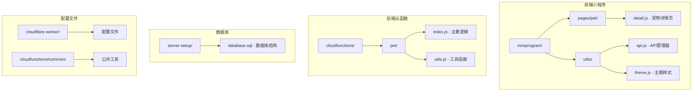
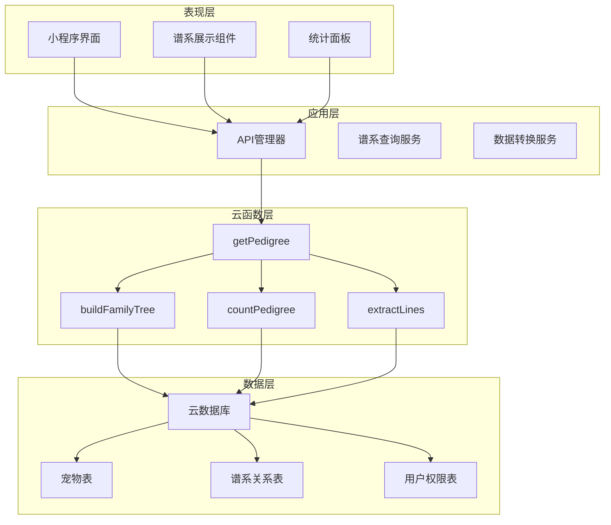
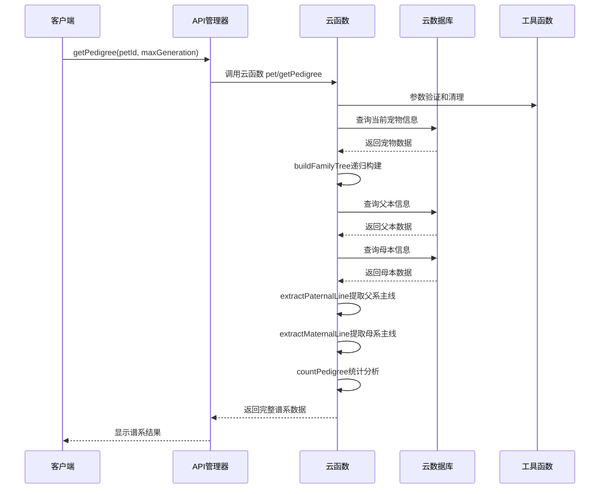
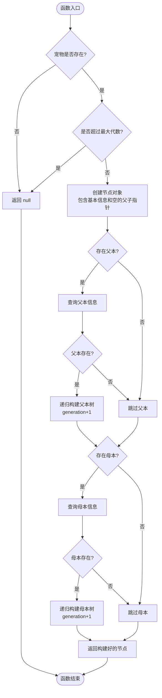
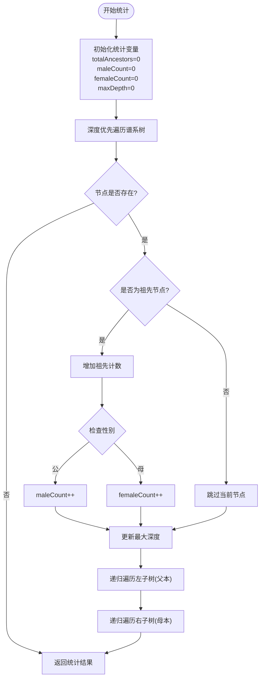
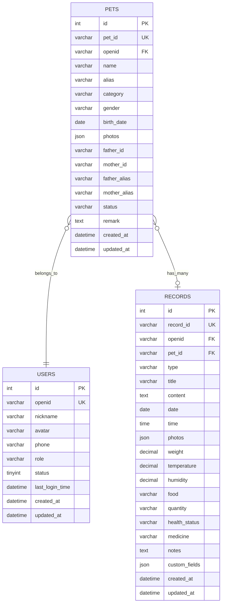

# 家谱查询与族谱系统

<cite>
**本文档引用的文件**
- [cloudfunctions/pet/index.js](file://cloudfunctions/pet/index.js)
- [cloudfunctions/pet/utils.js](file://cloudfunctions/pet/utils.js)
- [miniprogram/utils/api.js](file://miniprogram/utils/api.js)
- [miniprogram/pages/pet/detail.js](file://miniprogram/pages/pet/detail.js)
- [miniprogram/utils/theme.js](file://miniprogram/utils/theme.js)
- [server-setup/database.sql](file://server-setup/database.sql)
</cite>

## 目录
1. [简介](#简介)
2. [项目结构](#项目结构)
3. [核心组件](#核心组件)
4. [架构概览](#架构概览)
5. [详细组件分析](#详细组件分析)
6. [依赖关系分析](#依赖关系分析)
7. [性能考虑](#性能考虑)
8. [故障排除指南](#故障排除指南)
9. [结论](#结论)

## 简介

家谱查询与族谱系统是一个基于微信小程序平台的宠物谱系管理系统，专门用于追踪和展示宠物的血缘关系。该系统实现了完整的谱系查询功能，包括谱系树构建、递归查询机制、代数限制控制、主线提取算法和统计分析等功能。

系统采用前后端分离架构，前端使用微信小程序框架，后端使用云开发云函数，通过云数据库存储宠物信息和谱系关系。用户可以通过简单的界面操作查看宠物的父系、母系血统，以及完整的谱系树结构。

## 项目结构

该项目采用模块化的文件组织方式，主要分为以下几个部分：



**图表来源**
- [cloudfunctions/pet/index.js:1-82](file://cloudfunctions/pet/index.js#L1-L82)
- [miniprogram/utils/api.js:1-208](file://miniprogram/utils/api.js#L1-L208)

**章节来源**
- [cloudfunctions/pet/index.js:1-82](file://cloudfunctions/pet/index.js#L1-L82)
- [miniprogram/utils/api.js:1-208](file://miniprogram/utils/api.js#L1-L208)

## 核心组件

### 1. 谱系查询主函数 - getPedigree

`getPedigree` 是整个谱系查询系统的核心入口函数，负责协调各个子功能模块的工作。

**函数签名**: `async function getPedigree(petId, openid, maxGeneration = 3, envId)`

**主要功能**:
- 验证输入参数的有效性
- 获取当前宠物的基本信息
- 递归构建完整的家谱树
- 提取父系和母系主线
- 进行谱系统计分析
- 返回完整的谱系查询结果

**参数说明**:
- `petId`: 宠物唯一标识符
- `openid`: 用户标识符，用于权限验证
- `maxGeneration`: 最大查询代数，默认为3代
- `envId`: 环境标识符（可选）

**返回值结构**:
```javascript
{
  current: 当前宠物信息,
  fullTree: 完整家谱树,
  paternalLine: 父系主线,
  maternalLine: 母系主线,
  maxGeneration: 最大代数,
  stats: 统计信息
}
```

**章节来源**
- [cloudfunctions/pet/index.js:375-412](file://cloudfunctions/pet/index.js#L375-L412)

### 2. 家谱树构建器 - buildFamilyTree

`buildFamilyTree` 是一个递归函数，负责根据宠物的父子关系信息构建完整的谱系树。

**递归实现原理**:
- **基础情况**: 当宠物为空或超过最大代数时返回null
- **递归情况**: 对每个存在的父本或母本递归调用自身
- **层级标记**: 通过generation参数标记每一代的层级

**数据结构设计**:
```javascript
{
  id: 宠物ID,
  name: 宠物名称,
  alias: 宠物别名,
  gender: 性别,
  photos: 照片数组,
  generation: 层级,
  father: 父本节点,
  mother: 母本节点
}
```

**章节来源**
- [cloudfunctions/pet/index.js:417-469](file://cloudfunctions/pet/index.js#L417-L469)

### 3. 主线提取算法

系统提供了两种主线提取算法：父系主线和母系主线。

#### 父系主线提取 - extractPaternalLine

父系主线沿着父系血统向上追溯，只包含男性血统成员。

**算法流程**:
1. 从当前节点开始
2. 检查是否存在父本节点
3. 如果存在，将父本节点信息加入结果数组
4. 将当前位置移动到父本节点
5. 重复直到没有父本节点为止

#### 母系主线提取 - extractMaternalLine

母系主线沿着母系血统向上追溯，只包含女性血统成员。

**算法流程**:
1. 从当前节点开始
2. 检查是否存在母本节点
3. 如果存在，将母本节点信息加入结果数组
4. 将当前位置移动到母本节点
5. 重复直到没有母本节点为止

**章节来源**
- [cloudfunctions/pet/index.js:474-515](file://cloudfunctions/pet/index.js#L474-L515)

### 4. 统计分析功能 - countPedigree

`countPedigree` 函数负责对谱系树进行全面的统计分析。

**统计指标**:
- `totalAncestors`: 祖先总数（不包括当前个体）
- `maleCount`: 父系成员数量
- `femaleCount`: 母系成员数量
- `maxDepth`: 最大谱系深度

**算法实现**:
使用深度优先遍历的方式，对每个节点进行统计处理，同时维护全局的最大深度。

**章节来源**
- [cloudfunctions/pet/index.js:693-722](file://cloudfunctions/pet/index.js#L693-L722)

## 架构概览

系统采用三层架构设计，确保了良好的可维护性和扩展性。



**图表来源**
- [cloudfunctions/pet/index.js:375-412](file://cloudfunctions/pet/index.js#L375-L412)
- [miniprogram/utils/api.js:63-65](file://miniprogram/utils/api.js#L63-L65)

## 详细组件分析

### getPedigree 函数详细分析

#### 函数调用流程



**图表来源**
- [cloudfunctions/pet/index.js:375-412](file://cloudfunctions/pet/index.js#L375-L412)
- [miniprogram/utils/api.js:63-65](file://miniprogram/utils/api.js#L63-L65)

#### 参数验证和错误处理

getPedigree函数包含了完整的参数验证和错误处理机制：

1. **宠物ID验证**: 确保宠物ID不为空
2. **权限验证**: 检查当前用户是否拥有该宠物的访问权限
3. **数据库查询**: 获取宠物的详细信息并进行标准化处理
4. **异常处理**: 对各种可能的错误情况进行捕获和处理

**章节来源**
- [cloudfunctions/pet/index.js:376-411](file://cloudfunctions/pet/index.js#L376-L411)

### buildFamilyTree 递归实现分析

#### 递归算法设计



**图表来源**
- [cloudfunctions/pet/index.js:417-469](file://cloudfunctions/pet/index.js#L417-L469)

#### 代数层级标记机制

系统通过`generation`参数实现精确的代数层级标记：

- **generation = 0**: 当前个体（查询起点）
- **generation = 1**: 父母代（第一代祖先）
- **generation = 2**: 祖父母代（第二代祖先）
- **generation = 3**: 曾祖父母代（第三代祖先）

这种设计使得前端可以准确地渲染不同代数的谱系节点，并实现合理的查询深度控制。

**章节来源**
- [cloudfunctions/pet/index.js:417-469](file://cloudfunctions/pet/index.js#L417-L469)

### extractPaternalLine 和 extractMaternalLine 算法分析

#### 算法复杂度分析

两种主线提取算法都具有以下特点：

- **时间复杂度**: O(h)，其中h为谱系深度
- **空间复杂度**: O(h)，用于存储结果数组
- **执行效率**: 单次遍历，无需额外的数据结构

#### 数据结构转换

主线提取过程中会进行必要的数据结构转换：

```javascript
// 原始节点结构
{
  id: current.father.id,
  name: current.father.name,
  alias: current.father.alias,
  gender: current.father.gender,
  category: current.father.category,
  photos: current.father.photos,
  generation: current.father.generation
}

// 提取后的简化结构
{
  id: "pet_id",
  name: "宠物名称",
  alias: "别名",
  gender: "公/母",
  category: "分类",
  photos: ["photo_url"],
  generation: 1
}
```

**章节来源**
- [cloudfunctions/pet/index.js:474-515](file://cloudfunctions/pet/index.js#L474-L515)

### countPedigree 统计分析功能

#### 统计算法实现



**图表来源**
- [cloudfunctions/pet/index.js:693-722](file://cloudfunctions/pet/index.js#L693-L722)

#### 统计指标解释

- **祖先总数**: 排除当前个体外的所有祖先数量
- **父系成员**: 仅统计男性血统成员的数量
- **母系成员**: 仅统计女性血统成员的数量
- **最深远代数**: 谱系树的最大深度

**章节来源**
- [cloudfunctions/pet/index.js:693-722](file://cloudfunctions/pet/index.js#L693-L722)

## 依赖关系分析

### 前端依赖关系

```mermaid
graph TB
subgraph "前端模块依赖"
A[detail.js] --> B[api.js]
A --> C[theme.js]
B --> D[cloud functions]
C --> E[HTML模板渲染]
end
subgraph "云函数依赖"
F[pet/index.js] --> G[utils.js]
F --> H[cloud.database()]
G --> I[cloud.init]
G --> J[cloud.getWXContext]
end
subgraph "数据库依赖"
K[pets表] --> L[谱系关系字段]
K --> M[用户权限字段]
N[records表] --> O[事件记录]
end
A --> F
F --> K
```

**图表来源**
- [miniprogram/pages/pet/detail.js:2355-2368](file://miniprogram/pages/pet/detail.js#L2355-L2368)
- [cloudfunctions/pet/index.js:1-10](file://cloudfunctions/pet/index.js#L1-L10)

### 数据库模式设计

系统使用MySQL作为后端数据库，主要表结构如下：



**图表来源**
- [server-setup/database.sql:49-109](file://server-setup/database.sql#L49-L109)

**章节来源**
- [server-setup/database.sql:49-109](file://server-setup/database.sql#L49-L109)

## 性能考虑

### 查询性能优化策略

1. **索引优化**
   - 在`pets`表上建立`openid`索引，加速用户权限验证
   - 在`pets`表上建立`pet_id`索引，提高查询效率
   - 在`records`表上建立多列复合索引，优化事件记录查询

2. **查询深度控制**
   - 默认最大查询深度为3代，防止深层递归导致的性能问题
   - 支持动态调整查询深度，平衡用户体验和性能需求

3. **缓存策略**
   - 前端实现本地缓存机制，减少重复查询
   - 云函数层实现适当的内存缓存，提高重复查询响应速度

4. **批量查询优化**
   - 使用Promise.all并行查询父本和母本信息
   - 批量处理图片URL转换，减少网络请求次数

### 内存使用优化

1. **渐进式加载**: 只在用户需要时加载相应的谱系代数
2. **数据压缩**: 对传输的数据进行必要的压缩处理
3. **及时释放**: 及时释放不再使用的中间变量和临时数据

## 故障排除指南

### 常见问题及解决方案

#### 1. 权限验证失败

**问题现象**: 返回"无权限查看"错误

**可能原因**:
- 用户尝试访问不属于自己的宠物
- 云函数环境配置错误
- openid获取失败

**解决方法**:
- 检查用户登录状态
- 验证宠物与用户的关联关系
- 确认云函数环境配置正确

#### 2. 谱系查询超时

**问题现象**: 谱系查询响应时间过长

**可能原因**:
- 谱系树过深，递归层数过多
- 数据库连接不稳定
- 网络延迟过高

**解决方法**:
- 降低maxGeneration参数值
- 优化数据库查询索引
- 实现查询超时机制

#### 3. 图片显示异常

**问题现象**: 谱系中的宠物图片无法正常显示

**可能原因**:
- 临时URL过期
- 文件权限设置错误
- 图片格式不支持

**解决方法**:
- 实现图片URL净化功能
- 检查云存储权限配置
- 验证图片格式兼容性

**章节来源**
- [cloudfunctions/pet/index.js:376-411](file://cloudfunctions/pet/index.js#L376-L411)
- [cloudfunctions/pet/index.js:16-43](file://cloudfunctions/pet/index.js#L16-L43)

## 结论

家谱查询与族谱系统是一个功能完善、架构清晰的谱系管理解决方案。系统通过精心设计的递归算法和优化的数据结构，实现了高效的谱系查询和展示功能。

### 主要优势

1. **完整的谱系功能**: 支持父系、母系主线提取和统计分析
2. **灵活的查询控制**: 可配置的查询深度和权限验证机制
3. **优秀的用户体验**: 渐进式加载和直观的谱系展示
4. **良好的扩展性**: 模块化的架构设计便于功能扩展

### 技术亮点

1. **递归算法优化**: 通过generation参数精确控制查询深度
2. **数据结构设计**: 统一的节点结构便于后续功能扩展
3. **错误处理机制**: 完善的异常处理和用户反馈
4. **性能优化策略**: 多层次的性能优化措施

### 应用场景

该系统特别适用于以下场景：
- 宠物繁育管理
- 宠物血统追踪
- 宠物健康管理
- 宠物档案管理

通过持续的功能优化和技术改进，该系统能够为用户提供更加便捷、高效的谱系管理体验。