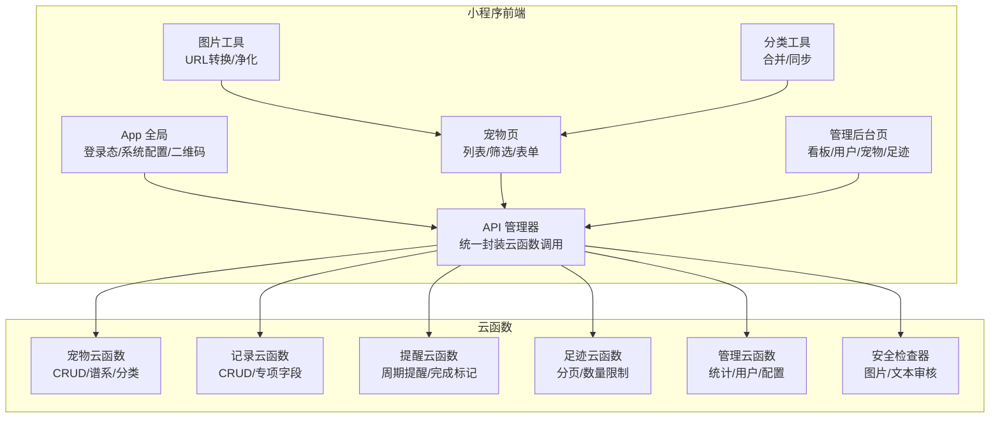
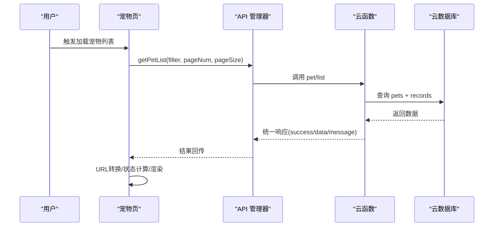
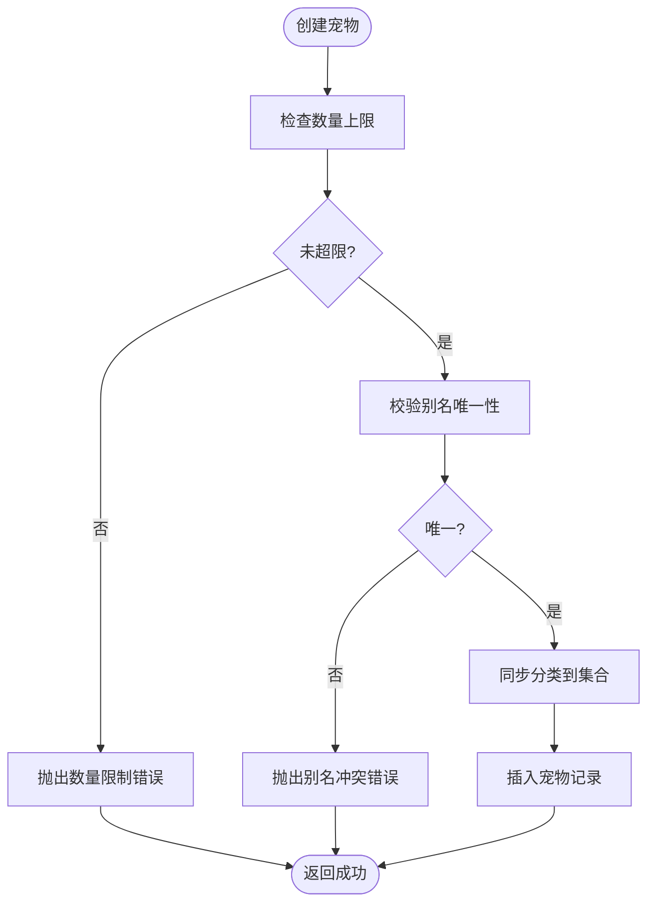
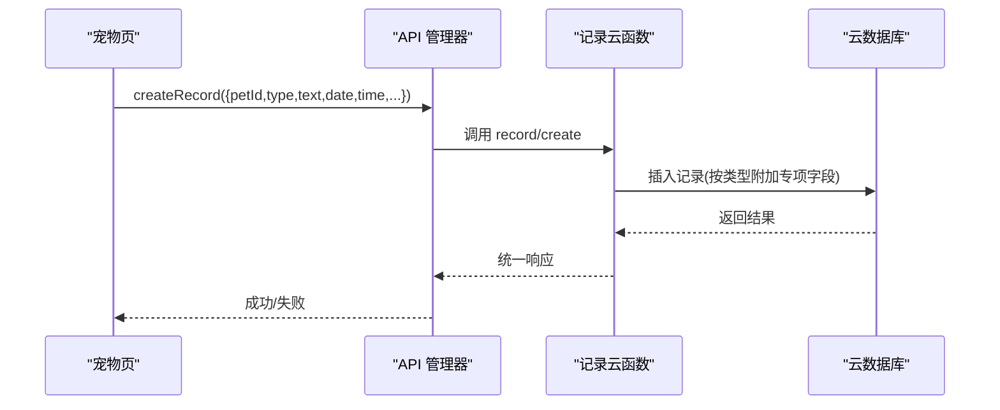
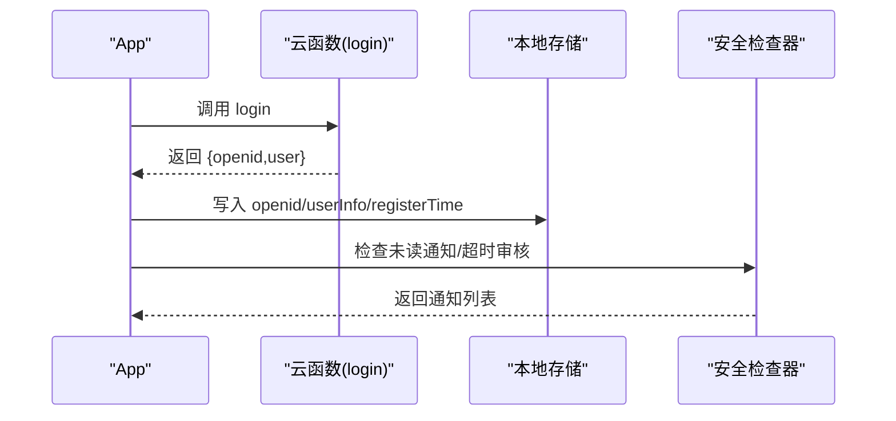
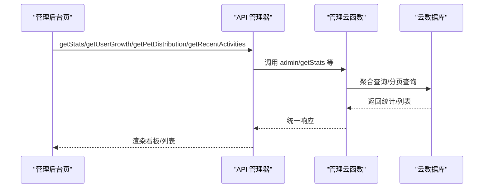
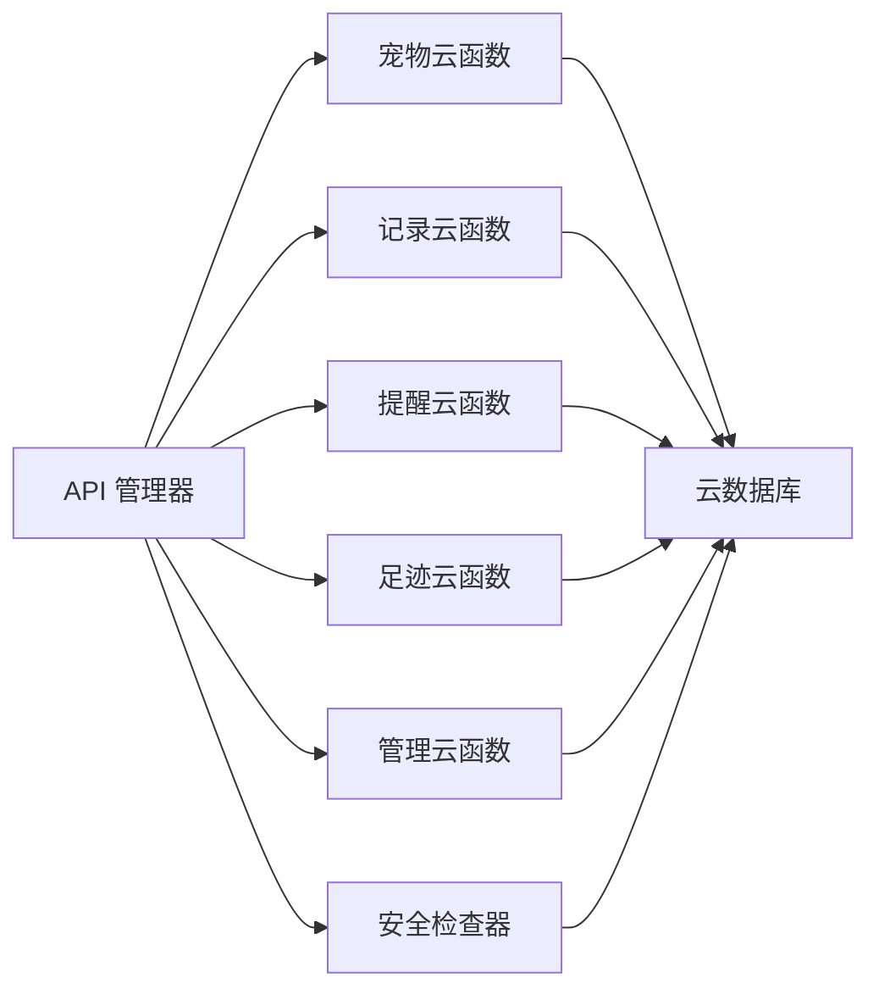

# 核心功能模块

<cite>
**本文引用的文件**
- [miniprogram/app.js](file://miniprogram/app.js)
- [miniprogram/utils/api.js](file://miniprogram/utils/api.js)
- [miniprogram/utils/image.js](file://miniprogram/utils/image.js)
- [miniprogram/utils/category.js](file://miniprogram/utils/category.js)
- [miniprogram/pages/pet/index.js](file://miniprogram/pages/pet/index.js)
- [miniprogram/subpkg-admin/pages/admin/index.js](file://miniprogram/subpkg-admin/pages/admin/index.js)
- [cloudfunctions/common/securityChecker.js](file://cloudfunctions/common/securityChecker.js)
- [cloudfunctions/pet/index.js](file://cloudfunctions/pet/index.js)
- [cloudfunctions/pet/utils.js](file://cloudfunctions/pet/utils.js)
- [cloudfunctions/record/index.js](file://cloudfunctions/record/index.js)
- [cloudfunctions/record/utils.js](file://cloudfunctions/record/utils.js)
- [cloudfunctions/reminder/index.js](file://cloudfunctions/reminder/index.js)
- [cloudfunctions/reminder/utils.js](file://cloudfunctions/reminder/utils.js)
- [cloudfunctions/footprint/index.js](file://cloudfunctions/footprint/index.js)
- [cloudfunctions/admin/index.js](file://cloudfunctions/admin/index.js)
</cite>

## 目录
1. [引言](#引言)
2. [项目结构](#项目结构)
3. [核心组件](#核心组件)
4. [架构总览](#架构总览)
5. [详细组件分析](#详细组件分析)
6. [依赖分析](#依赖分析)
7. [性能考虑](#性能考虑)
8. [故障排查指南](#故障排查指南)
9. [结论](#结论)
10. [附录](#附录)

## 引言
本文件聚焦“养龟档案”项目的核心功能模块，系统梳理并深入解析以下四大模块的设计理念与实现细节：
- 宠物管理模块：负责宠物的增删改查、谱系查询、分类管理与数量限制。
- 记录管理模块：负责日常记录、产蛋/出苗/交配等专项记录的创建、查询与维护。
- 用户系统模块：负责用户登录态管理、二维码分享、安全通知与基础鉴权。
- 管理后台模块：负责统计看板、用户/宠物/足迹管理、系统配置与管理员权限。

文档将从数据模型、业务流程、UI交互、模块间依赖、扩展点与配置参数、性能优化与错误处理等方面进行全面阐述，并提供可视化图示帮助理解。

## 项目结构
项目采用“小程序前端 + 云开发云函数”的分层架构：
- 小程序前端（miniprogram）：页面、组件、工具类与API封装。
- 云函数（cloudfunctions）：按功能拆分的后端服务，包括宠物、记录、提醒、足迹、管理员等。
- 公共安全组件（common/securityChecker.js）：统一的安全审核能力。
- 设计预览与服务器脚手架：辅助设计与部署。

图表来源
- [miniprogram/app.js:1-312](file://miniprogram/app.js#L1-L312)
- [miniprogram/utils/api.js:1-208](file://miniprogram/utils/api.js#L1-L208)
- [cloudfunctions/pet/index.js:1-723](file://cloudfunctions/pet/index.js#L1-L723)
- [cloudfunctions/record/index.js:1-191](file://cloudfunctions/record/index.js#L1-L191)
- [cloudfunctions/reminder/index.js:1-205](file://cloudfunctions/reminder/index.js#L1-L205)
- [cloudfunctions/footprint/index.js:1-160](file://cloudfunctions/footprint/index.js#L1-L160)
- [cloudfunctions/admin/index.js:1-533](file://cloudfunctions/admin/index.js#L1-L533)
- [cloudfunctions/common/securityChecker.js:1-226](file://cloudfunctions/common/securityChecker.js#L1-L226)

章节来源
- [miniprogram/app.js:1-312](file://miniprogram/app.js#L1-L312)
- [miniprogram/utils/api.js:1-208](file://miniprogram/utils/api.js#L1-L208)

## 核心组件
- 宠物管理模块：提供宠物CRUD、谱系树构建、分类管理、数量上限控制与公开展示。
- 记录管理模块：提供通用记录与专项记录（产蛋/出苗/交配）的创建与查询。
- 用户系统模块：提供静默登录、二维码生成、安全通知检查与登出清理。
- 管理后台模块：提供统计看板、用户/宠物/足迹检索、系统配置与管理员权限校验。

章节来源
- [cloudfunctions/pet/index.js:1-723](file://cloudfunctions/pet/index.js#L1-L723)
- [cloudfunctions/record/index.js:1-191](file://cloudfunctions/record/index.js#L1-L191)
- [cloudfunctions/footprint/index.js:1-160](file://cloudfunctions/footprint/index.js#L1-L160)
- [cloudfunctions/admin/index.js:1-533](file://cloudfunctions/admin/index.js#L1-L533)
- [miniprogram/app.js:1-312](file://miniprogram/app.js#L1-L312)

## 架构总览
整体采用“前端页面 + API 管理器 + 云函数 + 安全检查器”的分层设计。前端通过API管理器统一对云函数发起调用，云函数负责数据持久化与业务规则校验，安全检查器贯穿图片/文本审核流程。

图表来源
- [miniprogram/pages/pet/index.js:1-800](file://miniprogram/pages/pet/index.js#L1-L800)
- [miniprogram/utils/api.js:1-208](file://miniprogram/utils/api.js#L1-L208)
- [cloudfunctions/pet/index.js:140-180](file://cloudfunctions/pet/index.js#L140-L180)

## 详细组件分析

### 宠物管理模块
- 功能要点
  - 宠物CRUD：创建时校验别名唯一性与数量上限；更新时支持分类同步；删除时联动清理记录。
  - 分类管理：支持新增/更新/删除分类，并与宠物数据保持一致性。
  - 谱系查询：按最大代数递归构建家谱树，提取父系/母系主线并统计谱系信息。
  - 公开展示：支持按用户查询公开宠物列表并附带最新产蛋/交配记录。
- 关键流程
  - 创建宠物：读取系统配置中的最大数量限制，校验别名唯一，同步分类到集合，返回ID。
  - 列表查询：支持系列/性别/搜索文本筛选，分页返回并净化图片URL。
  - 谱系树：从当前个体向上递归查询父本/母本，构建完整树并统计。
- 数据模型
  - 宠物集合字段：name/category/gender/alias/father/mother/partner/status/photos/isPublic/openid/createdAt/updatedAt。
  - 分类集合字段：openid/name/createdAt/updatedAt。
  - 记录集合字段：petId/type/text/date/time/photos/createdAt/updatedAt。
- 错误处理
  - 权限校验：读取/更新/删除均校验openid归属。
  - 业务约束：别名唯一、数量上限、类型冲突等。
- 性能优化
  - 分页查询与总数统计分离，避免一次性拉取大量数据。
  - 图片URL净化与转换按需进行，减少无效IO。
- 扩展点
  - 新增宠物类型字段或专项记录类型时，可在创建/更新处扩展字段映射。
  - 谱系查询支持调整最大代数参数。

图表来源
- [cloudfunctions/pet/index.js:84-138](file://cloudfunctions/pet/index.js#L84-L138)

章节来源
- [cloudfunctions/pet/index.js:1-723](file://cloudfunctions/pet/index.js#L1-L723)
- [cloudfunctions/pet/utils.js:1-69](file://cloudfunctions/pet/utils.js#L1-L69)

### 记录管理模块
- 功能要点
  - 通用记录：支持按宠物与类型筛选，分页查询。
  - 专项记录：产蛋（记录数量与受精数）、出苗（记录数量与分级/缺陷）、交配（关联配对对象）。
  - QR缓存：静默更新记录的二维码缓存字段，便于快速分享。
- 关键流程
  - 创建记录：根据类型附加专项字段，写入数据库。
  - 列表查询：支持按宠物与类型筛选，分页返回。
  - 更新/删除：严格校验openid归属。
- 数据模型
  - 记录集合字段：petId/type/text/date/time/photos/createdAt/updatedAt（专项字段：eggCount/fertilizedCount/hatchCount/gradeACount/defectCount/partnerId/partnerName）。
- 错误处理
  - 权限校验与存在性校验贯穿CRUD。
  - 未知操作返回统一错误响应。
- 性能优化
  - 分页查询与总数统计分离。
  - 专项字段仅在对应类型下写入，避免冗余。
- 扩展点
  - 新增记录类型时，在创建处扩展字段映射与校验。

图表来源
- [cloudfunctions/record/index.js:37-82](file://cloudfunctions/record/index.js#L37-L82)
- [miniprogram/utils/api.js:86-96](file://miniprogram/utils/api.js#L86-L96)

章节来源
- [cloudfunctions/record/index.js:1-191](file://cloudfunctions/record/index.js#L1-L191)
- [cloudfunctions/record/utils.js:1-69](file://cloudfunctions/record/utils.js#L1-L69)
- [miniprogram/utils/api.js:86-96](file://miniprogram/utils/api.js#L86-L96)

### 用户系统模块
- 功能要点
  - 静默登录：自动获取openid并写入本地存储，支持用户信息合并与注册时间记录。
  - 二维码生成：后台静默生成小程序码并缓存，避免阻塞用户。
  - 安全通知：启动时检查未读通知与超时未回调审核记录。
  - 登出清理：清除登录态与用户信息并跳转首页。
- 关键流程
  - 登录：调用云函数login，成功后写入本地存储并触发安全检查。
  - 二维码：调用云函数qrcode，保存cloud:// fileID到本地。
  - 通知：通过通知管理器获取未读通知与待处理审核。
- 数据模型
  - 全局状态：isLoggedIn/openid/userInfo/systemConfig/dataPreloaded等。
  - 用户信息：昵称、头像、手机、注册时间等。
- 错误处理
  - 登录失败与网络异常均有明确提示。
  - 二维码生成失败与云函数调用失败均有日志记录。
- 性能优化
  - 预加载与骨架屏结合，提升首屏体验。
  - 后台静默任务避免阻塞前台。
- 扩展点
  - 可扩展更多登录方式或第三方授权。
  - 可增加登录态刷新与心跳机制。

图表来源
- [miniprogram/app.js:84-140](file://miniprogram/app.js#L84-L140)
- [miniprogram/app.js:267-288](file://miniprogram/app.js#L267-L288)

章节来源
- [miniprogram/app.js:1-312](file://miniprogram/app.js#L1-L312)
- [cloudfunctions/common/securityChecker.js:1-226](file://cloudfunctions/common/securityChecker.js#L1-L226)

### 管理后台模块
- 功能要点
  - 统计看板：用户/宠物/足迹总量、今日活跃、用户/宠物增长率。
  - 用户管理：按昵称/用户名/openid搜索、状态筛选、封禁/解封。
  - 宠物管理：按名称/分类筛选、批量展示主宠信息。
  - 足迹管理：按日期范围/关键词筛选。
  - 系统配置：读取/更新系统配置（如最大宠物数、图片服务器、推送开关等）。
- 关键流程
  - 权限校验：管理员列表优先读取数据库，兜底为内置管理员。
  - 统计聚合：使用聚合查询与时间区间计算。
  - 用户封禁：变更状态时同步写入/移除封禁列表。
- 数据模型
  - 管理员集合：enabled/openid/name。
  - 用户集合：nickname/phone/avatar/status/createdAt/updatedAt等。
  - 宠物集合：name/category/openid/photos等。
  - 足迹集合：text/petName/ownerName/photos等。
  - 系统配置集合：多字段配置项。
- 错误处理
  - 未知操作统一返回错误。
  - 删除用户采用事务，失败回滚。
- 性能优化
  - 并行加载看板数据，减少等待时间。
  - 分页查询与总数统计分离。
- 扩展点
  - 可扩展更多维度统计与图表。
  - 可增加审计日志与导出功能。

图表来源
- [miniprogram/subpkg-admin/pages/admin/index.js:35-82](file://miniprogram/subpkg-admin/pages/admin/index.js#L35-L82)
- [cloudfunctions/admin/index.js:74-115](file://cloudfunctions/admin/index.js#L74-L115)

章节来源
- [cloudfunctions/admin/index.js:1-533](file://cloudfunctions/admin/index.js#L1-L533)
- [miniprogram/subpkg-admin/pages/admin/index.js:1-123](file://miniprogram/subpkg-admin/pages/admin/index.js#L1-L123)

## 依赖分析
- 前端依赖
  - API管理器统一封装云函数调用，屏蔽错误与降级逻辑。
  - 图片工具负责URL转换与净化，确保缓存数据稳定。
  - 分类工具负责多源分类合并与云端同步。
- 云函数依赖
  - 统一工具函数：数据库初始化、上下文获取、成功/失败响应、ID标准化。
  - 安全检查器：图片/文本审核，异步提交审核并记录日志。
- 模块耦合
  - 宠物与记录：通过petId关联，谱系查询依赖父子关系。
  - 管理后台与各集合：统计看板依赖用户/宠物/足迹集合。
  - 用户系统与安全：登录态与安全通知检查相互独立又协同。

图表来源
- [miniprogram/utils/api.js:1-208](file://miniprogram/utils/api.js#L1-L208)
- [cloudfunctions/common/securityChecker.js:1-226](file://cloudfunctions/common/securityChecker.js#L1-L226)
- [cloudfunctions/pet/index.js:1-723](file://cloudfunctions/pet/index.js#L1-L723)
- [cloudfunctions/record/index.js:1-191](file://cloudfunctions/record/index.js#L1-L191)
- [cloudfunctions/reminder/index.js:1-205](file://cloudfunctions/reminder/index.js#L1-L205)
- [cloudfunctions/footprint/index.js:1-160](file://cloudfunctions/footprint/index.js#L1-L160)
- [cloudfunctions/admin/index.js:1-533](file://cloudfunctions/admin/index.js#L1-L533)

章节来源
- [miniprogram/utils/api.js:1-208](file://miniprogram/utils/api.js#L1-L208)
- [cloudfunctions/common/securityChecker.js:1-226](file://cloudfunctions/common/securityChecker.js#L1-L226)

## 性能考虑
- 首屏体验
  - 骨架屏与最小展示时长保障，避免闪烁。
  - 预加载全局数据，后台静默同步。
- 网络与缓存
  - 图片URL转换按需进行，避免频繁IO。
  - 本地缓存宠物与分类，降低重复请求。
- 查询优化
  - 分页查询与总数统计分离，避免一次性拉取大量数据。
  - 多集合并行查询（如看板数据）。
- 安全与异步
  - 图片上传后异步提交审核，不阻塞主流程。
  - 审核日志入库，便于追踪与复核。

## 故障排查指南
- 登录失败
  - 检查云函数login调用结果与网络状态。
  - 查看App日志中的错误信息与降级路径。
- 图片显示异常
  - 确认fileID是否为cloud://格式，必要时进行URL转换。
  - 检查临时URL是否过期，必要时重新生成。
- 权限错误
  - 确认openid归属与文档存在性校验。
  - 管理员权限：确认数据库管理员列表是否正确配置。
- 审核未生效
  - 检查安全检查器返回状态与审核日志。
  - 确认场景映射与审核接口调用结果。

章节来源
- [miniprogram/app.js:133-140](file://miniprogram/app.js#L133-L140)
- [miniprogram/utils/image.js:64-108](file://miniprogram/utils/image.js#L64-L108)
- [cloudfunctions/common/securityChecker.js:74-105](file://cloudfunctions/common/securityChecker.js#L74-L105)
- [cloudfunctions/admin/index.js:31-38](file://cloudfunctions/admin/index.js#L31-L38)

## 结论
本项目以清晰的模块划分与统一的API封装实现了前后端解耦，通过云函数承载业务规则与数据一致性，配合安全检查器与管理后台形成完整的运营闭环。模块间通过统一的响应格式与严格的权限校验实现稳健协作，具备良好的扩展性与可维护性。

## 附录
- 配置参数（系统配置集合）
  - 最大宠物数：控制用户可添加的宠物上限。
  - 最大足迹图片数：限制单条足迹图片数量。
  - 推送开关：控制推送通知启用状态。
  - 图片服务器：图片服务地址与超时配置。
  - 注册/匿名开关：控制注册与匿名访问策略。
  - 管理员列表：管理员白名单与兜底配置。
- 扩展建议
  - 引入鉴权中间件与更细粒度的RBAC。
  - 增加审计日志与数据导出功能。
  - 优化图片压缩与CDN加速策略。
  - 增加提醒推送与消息中心。