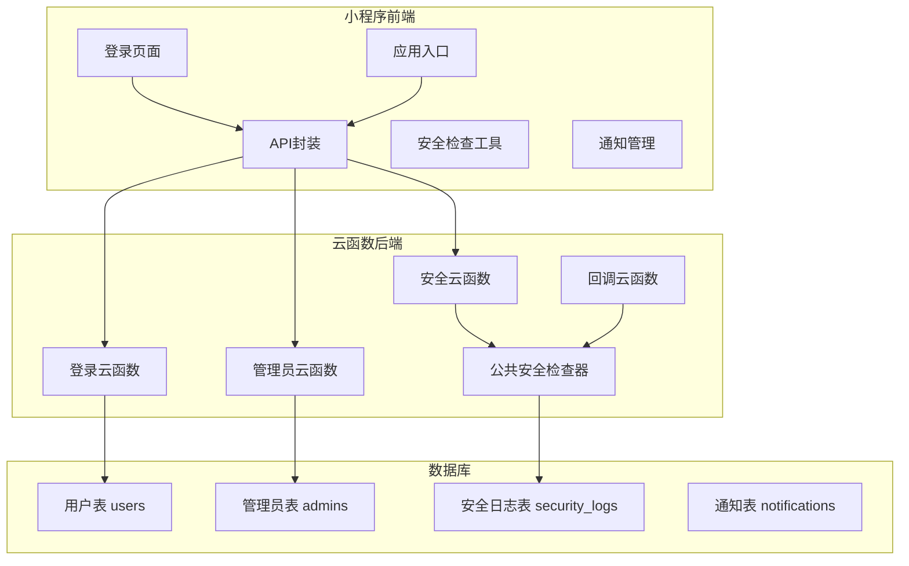
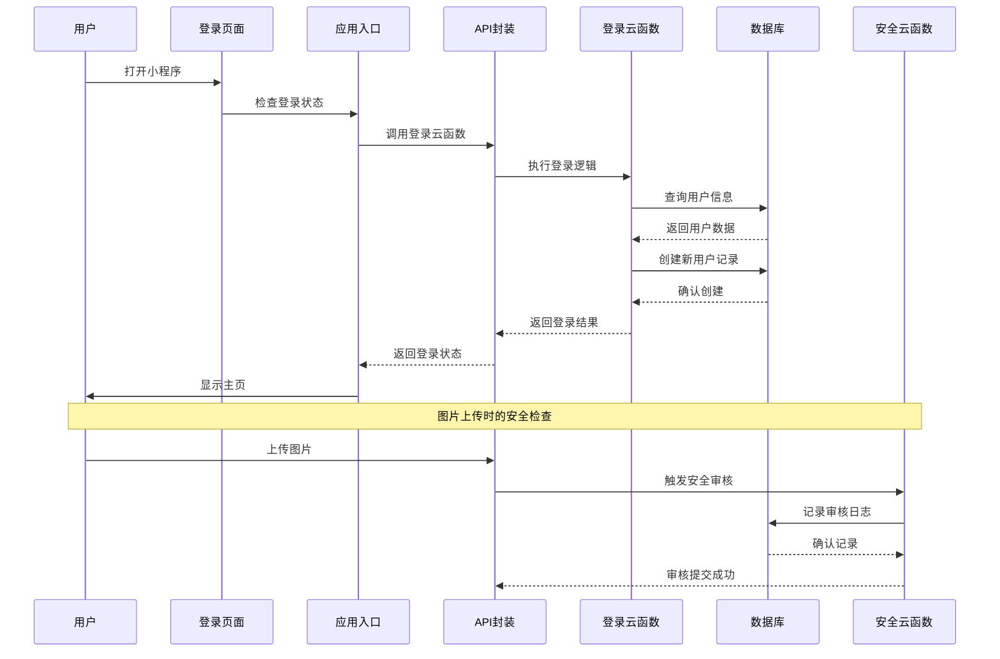
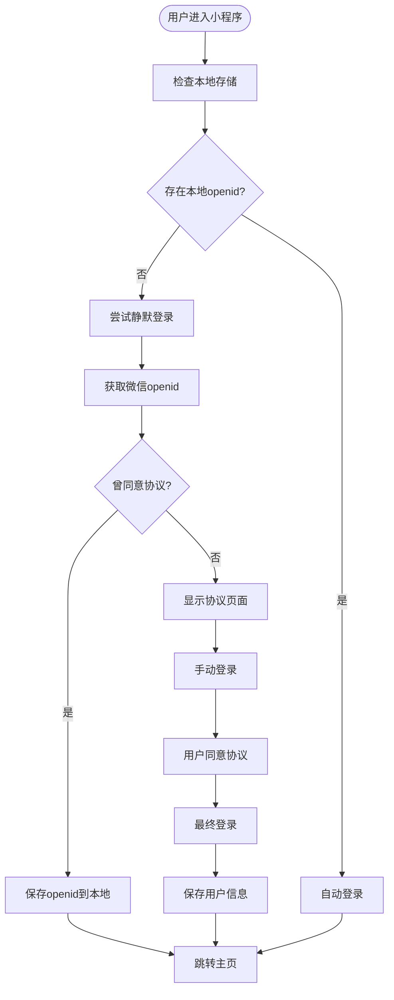
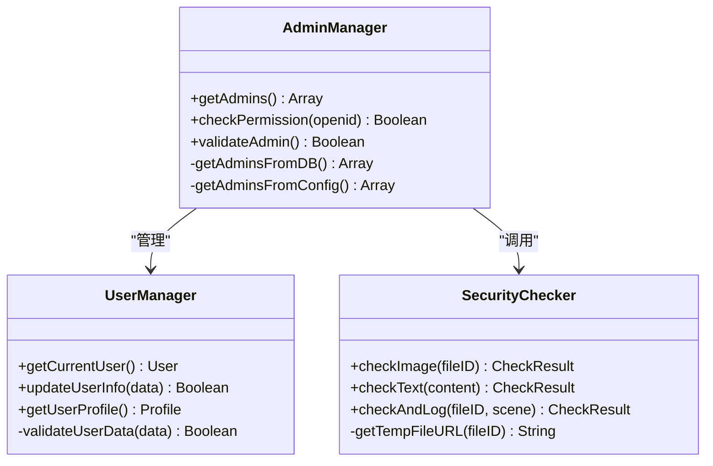
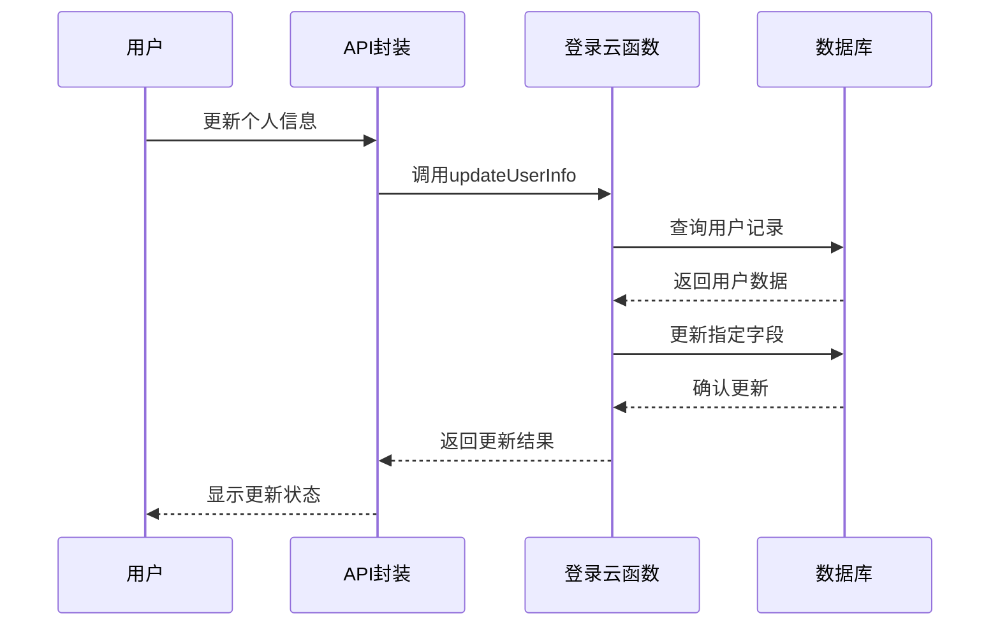
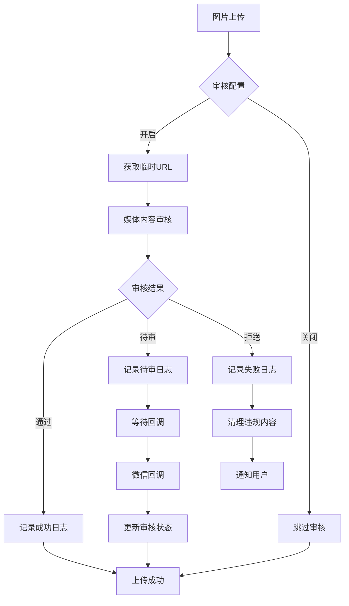
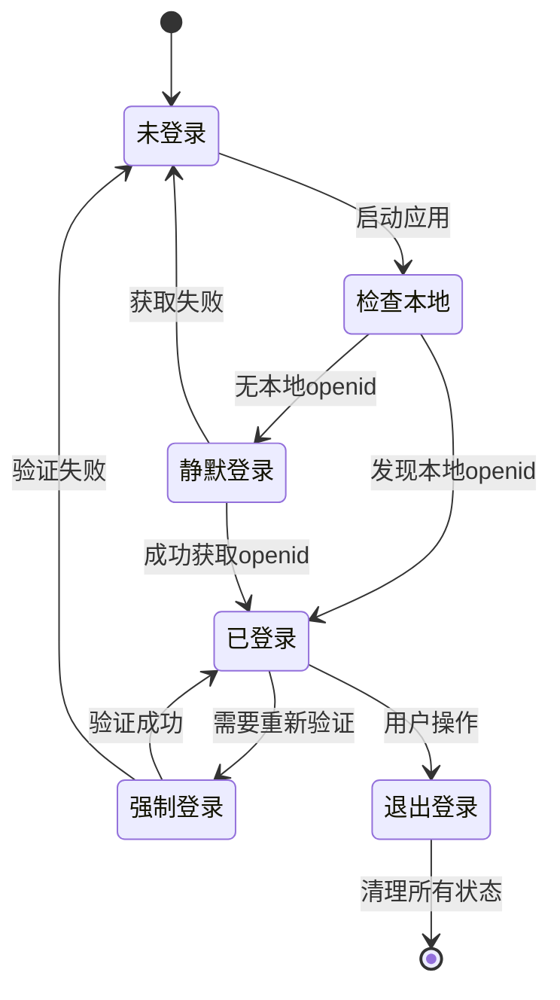
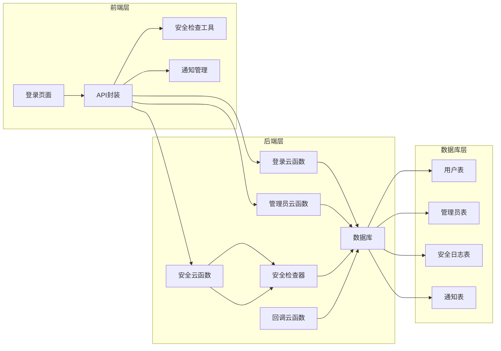

# 用户系统模块

<cite>
**本文档引用的文件**
- [cloudfunctions/login/index.js](file://cloudfunctions/login/index.js)
- [cloudfunctions/admin/index.js](file://cloudfunctions/admin/index.js)
- [cloudfunctions/admin/utils.js](file://cloudfunctions/admin/utils.js)
- [cloudfunctions/common/securityChecker.js](file://cloudfunctions/common/securityChecker.js)
- [cloudfunctions/security/index.js](file://cloudfunctions/security/index.js)
- [cloudfunctions/callback/index.js](file://cloudfunctions/callback/index.js)
- [miniprogram/pages/login/index.js](file://miniprogram/pages/login/index.js)
- [miniprogram/app.js](file://miniprogram/app.js)
- [miniprogram/utils/api.js](file://miniprogram/utils/api.js)
- [miniprogram/utils/securityChecker.js](file://miniprogram/utils/securityChecker.js)
- [miniprogram/utils/notification.js](file://miniprogram/utils/notification.js)
- [miniprogram/pages/my/index.js](file://miniprogram/pages/my/index.js)
- [server-setup/database.sql](file://server-setup/database.sql)
</cite>

## 目录
1. [简介](#简介)
2. [项目结构](#项目结构)
3. [核心组件](#核心组件)
4. [架构概览](#架构概览)
5. [详细组件分析](#详细组件分析)
6. [依赖关系分析](#依赖关系分析)
7. [性能考虑](#性能考虑)
8. [故障排除指南](#故障排除指南)
9. [结论](#结论)
10. [附录](#附录)

## 简介
本文件全面阐述用户系统模块的设计与实现，涵盖微信授权登录、用户认证与权限控制、个人信息管理、安全检查机制、用户状态管理以及API接口规范。系统基于微信云开发构建，采用前后端分离架构，前端通过云函数调用实现用户登录、权限验证、内容安全审核等功能，后端提供统一的权限管理和安全审核服务。

## 项目结构
用户系统模块主要分布在以下目录：
- cloudfunctions：云函数实现，包括登录、管理员管理、安全审核、回调处理等
- miniprogram：小程序前端，包含登录页面、应用入口、API封装、安全检查工具等
- server-setup：服务器端数据库初始化脚本

**图表来源**
- [cloudfunctions/login/index.js:1-148](file://cloudfunctions/login/index.js#L1-L148)
- [cloudfunctions/admin/index.js:1-533](file://cloudfunctions/admin/index.js#L1-L533)
- [cloudfunctions/common/securityChecker.js:1-226](file://cloudfunctions/common/securityChecker.js#L1-L226)

**章节来源**
- [cloudfunctions/login/index.js:1-148](file://cloudfunctions/login/index.js#L1-L148)
- [cloudfunctions/admin/index.js:1-533](file://cloudfunctions/admin/index.js#L1-L533)
- [cloudfunctions/common/securityChecker.js:1-226](file://cloudfunctions/common/securityChecker.js#L1-L226)

## 核心组件
用户系统模块包含以下核心组件：

### 1. 用户认证组件
- **登录云函数**：处理微信授权登录，创建/更新用户记录，支持管理员权限检查
- **应用入口**：管理全局登录状态，提供静默登录和强制登录功能
- **登录页面**：实现用户协议同意流程，处理自动登录逻辑

### 2. 权限控制组件
- **管理员云函数**：提供管理员权限验证和管理功能
- **权限工具**：封装权限检查和响应格式化
- **数据库管理员表**：存储管理员账户信息

### 3. 安全检查组件
- **安全检查器**：封装内容安全审核，支持图片和文本审核
- **安全云函数**：薄包装层，提供统一的审核接口
- **回调处理**：处理微信异步审核结果，自动清理违规内容

### 4. 用户状态管理
- **API封装**：统一云函数调用接口
- **通知管理**：处理审核违规通知和待审核记录
- **前端状态**：管理本地存储和全局状态

**章节来源**
- [cloudfunctions/login/index.js:38-147](file://cloudfunctions/login/index.js#L38-L147)
- [miniprogram/app.js:233-256](file://miniprogram/app.js#L233-L256)
- [cloudfunctions/admin/index.js:27-71](file://cloudfunctions/admin/index.js#L27-L71)

## 架构概览
用户系统采用分层架构设计，实现前后端分离和职责清晰划分：

**图表来源**
- [miniprogram/pages/login/index.js:52-87](file://miniprogram/pages/login/index.js#L52-L87)
- [miniprogram/app.js:84-140](file://miniprogram/app.js#L84-L140)
- [cloudfunctions/login/index.js:38-147](file://cloudfunctions/login/index.js#L38-L147)
- [cloudfunctions/security/index.js:15-64](file://cloudfunctions/security/index.js#L15-L64)

## 详细组件分析

### 用户认证流程

#### 微信授权登录机制
系统实现完整的微信授权登录流程，支持静默登录和手动登录两种模式：

**图表来源**
- [miniprogram/pages/login/index.js:16-87](file://miniprogram/pages/login/index.js#L16-L87)
- [miniprogram/app.js:60-140](file://miniprogram/app.js#L60-L140)

#### 登录云函数实现
登录云函数负责处理用户登录的核心逻辑：

**章节来源**
- [cloudfunctions/login/index.js:38-147](file://cloudfunctions/login/index.js#L38-L147)

### 权限控制系统

#### 管理员权限验证
系统提供两级权限控制：普通用户和管理员用户：

**图表来源**
- [cloudfunctions/admin/index.js:16-25](file://cloudfunctions/admin/index.js#L16-L25)
- [cloudfunctions/common/securityChecker.js:30-46](file://cloudfunctions/common/securityChecker.js#L30-L46)

#### 权限验证流程
管理员权限验证采用双重检查机制：

**章节来源**
- [cloudfunctions/admin/index.js:27-71](file://cloudfunctions/admin/index.js#L27-L71)
- [cloudfunctions/admin/utils.js:20-35](file://cloudfunctions/admin/utils.js#L20-L35)

### 用户个人信息管理

#### 信息更新机制
系统支持用户个人信息的动态更新，采用增量更新策略：

**图表来源**
- [cloudfunctions/login/index.js:55-67](file://cloudfunctions/login/index.js#L55-L67)
- [miniprogram/utils/api.js:156-178](file://miniprogram/utils/api.js#L156-L178)

#### 公开名片管理
系统提供公开名片功能，允许用户设置公开展示的信息：

**章节来源**
- [cloudfunctions/login/index.js:69-85](file://cloudfunctions/login/index.js#L69-L85)

### 安全检查机制

#### 内容安全审核体系
系统实现多层次的内容安全审核机制：

**图表来源**
- [cloudfunctions/common/securityChecker.js:74-105](file://cloudfunctions/common/securityChecker.js#L74-L105)
- [cloudfunctions/callback/index.js:57-109](file://cloudfunctions/callback/index.js#L57-L109)

#### 审核场景映射
系统定义了详细的审核场景映射：

**章节来源**
- [cloudfunctions/common/securityChecker.js:10-17](file://cloudfunctions/common/securityChecker.js#L10-L17)
- [cloudfunctions/security/index.js:22-39](file://cloudfunctions/security/index.js#L22-L39)

### 用户状态管理

#### 登录态持久化
系统采用多层存储策略管理用户状态：

**图表来源**
- [miniprogram/app.js:60-140](file://miniprogram/app.js#L60-L140)
- [miniprogram/app.js:233-256](file://miniprogram/app.js#L233-L256)

#### 自动登录处理
系统实现智能的自动登录机制：

**章节来源**
- [miniprogram/pages/login/index.js:52-87](file://miniprogram/pages/login/index.js#L52-L87)
- [miniprogram/app.js:84-140](file://miniprogram/app.js#L84-L140)

## 依赖关系分析

### 组件耦合度分析
用户系统模块采用松耦合设计，各组件职责清晰：

**图表来源**
- [miniprogram/utils/api.js:12-38](file://miniprogram/utils/api.js#L12-L38)
- [cloudfunctions/login/index.js:38-41](file://cloudfunctions/login/index.js#L38-L41)
- [cloudfunctions/admin/index.js:27-29](file://cloudfunctions/admin/index.js#L27-L29)

### 外部依赖
系统主要依赖以下外部服务：
- 微信云开发平台
- 微信内容安全审核服务
- 腾讯云存储服务

**章节来源**
- [cloudfunctions/common/securityChecker.js:82-88](file://cloudfunctions/common/securityChecker.js#L82-L88)
- [cloudfunctions/callback/index.js:36-52](file://cloudfunctions/callback/index.js#L36-L52)

## 性能考虑
用户系统模块在设计时充分考虑了性能优化：

### 缓存策略
- 本地存储：用户基本信息、登录状态、配置信息
- 云端缓存：预加载数据、统计信息
- 文件缓存：小程序码、头像等静态资源

### 异步处理
- 安全审核采用异步处理，不阻塞用户操作
- 图片上传后立即返回，审核在后台进行
- 通知检查采用节流机制，避免频繁请求

### 数据库优化
- 合理的索引设计，支持高频查询
- 批量操作减少数据库往返
- 事务处理保证数据一致性

## 故障排除指南

### 常见问题及解决方案

#### 登录失败
**症状**：用户无法登录小程序
**排查步骤**：
1. 检查微信授权是否正常
2. 验证云函数是否可访问
3. 确认数据库连接状态

#### 审核异常
**症状**：图片审核长时间无响应
**排查步骤**：
1. 检查微信审核服务状态
2. 验证回调配置是否正确
3. 查看安全日志表状态

#### 权限验证失败
**症状**：管理员功能无法使用
**排查步骤**：
1. 确认管理员账户状态
2. 检查数据库管理员表数据
3. 验证权限检查逻辑

**章节来源**
- [cloudfunctions/callback/index.js:42-52](file://cloudfunctions/callback/index.js#L42-L52)
- [cloudfunctions/admin/index.js:35-38](file://cloudfunctions/admin/index.js#L35-L38)

## 结论
用户系统模块通过合理的架构设计和完善的机制实现了安全、可靠的用户管理功能。系统采用前后端分离架构，结合微信云开发平台提供了完整的用户认证、权限控制、内容安全审核和状态管理能力。模块具有良好的扩展性和维护性，能够满足用户系统的各种需求。

## 附录

### API接口文档

#### 登录相关接口
- `login`：用户登录
- `checkAdmin`：检查管理员权限
- `updateUserInfo`：更新用户信息
- `updatePublicProfile`：更新公开名片

#### 管理员相关接口
- `getUsers`：获取用户列表
- `updateUser`：更新用户信息
- `deleteUser`：删除用户
- `getConfig`：获取系统配置
- `updateConfig`：更新系统配置

#### 安全相关接口
- `checkImage`：图片安全审核
- `checkText`：文本安全审核
- `checkAndLog`：审核并记录日志
- `getUnreadNotifications`：获取未读通知
- `markNotificationRead`：标记通知已读

**章节来源**
- [cloudfunctions/login/index.js:43-85](file://cloudfunctions/login/index.js#L43-L85)
- [cloudfunctions/admin/index.js:41-66](file://cloudfunctions/admin/index.js#L41-L66)
- [cloudfunctions/security/index.js:22-59](file://cloudfunctions/security/index.js#L22-L59)

### 安全注意事项
1. **数据保护**：用户敏感信息应加密存储
2. **权限控制**：严格验证用户权限
3. **输入验证**：对所有用户输入进行验证
4. **日志审计**：记录重要操作日志
5. **异常处理**：完善的错误处理机制

### 最佳实践
1. **状态管理**：合理使用本地和云端状态
2. **性能优化**：采用缓存和异步处理
3. **错误恢复**：实现优雅的错误恢复机制
4. **监控告警**：建立完善的监控体系
5. **版本管理**：严格的版本控制和发布流程