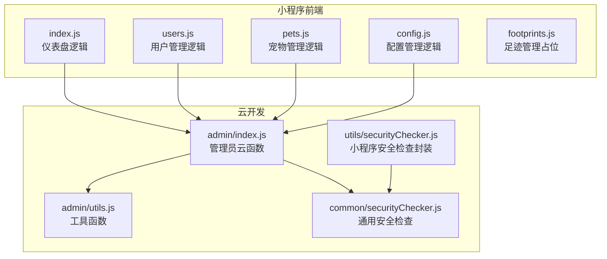
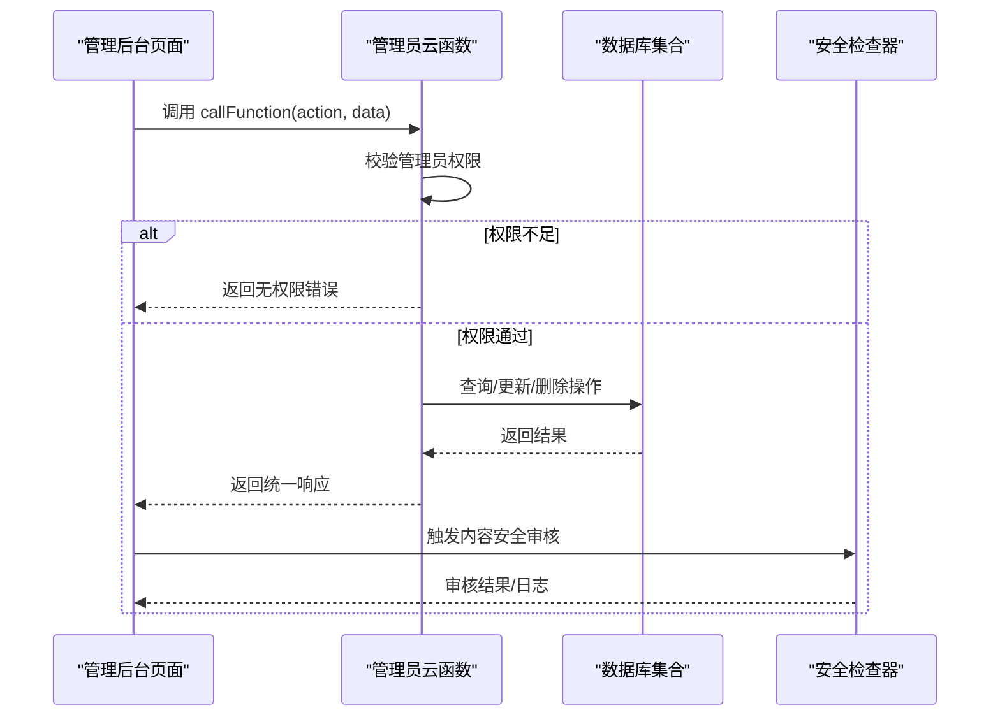
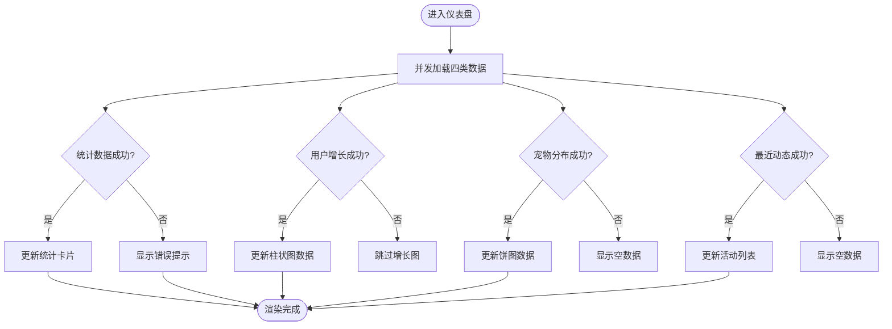
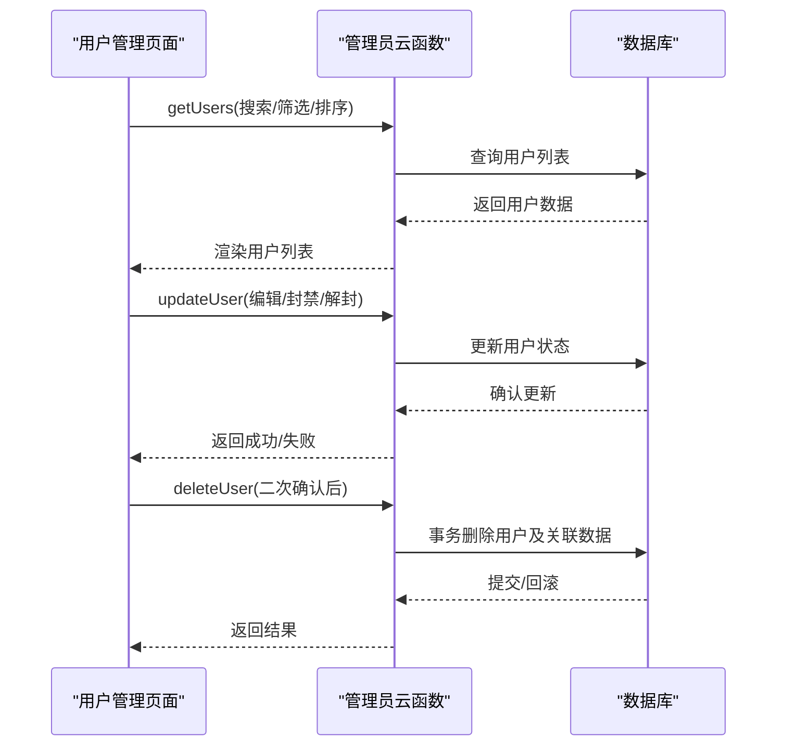
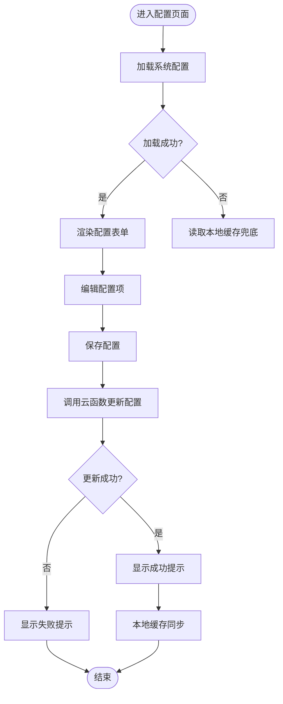
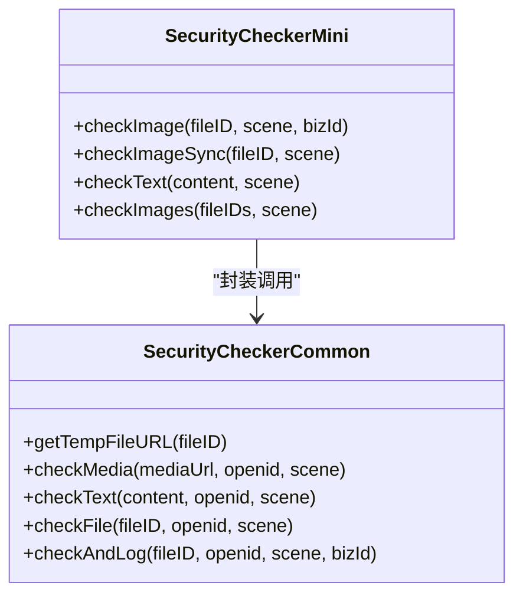
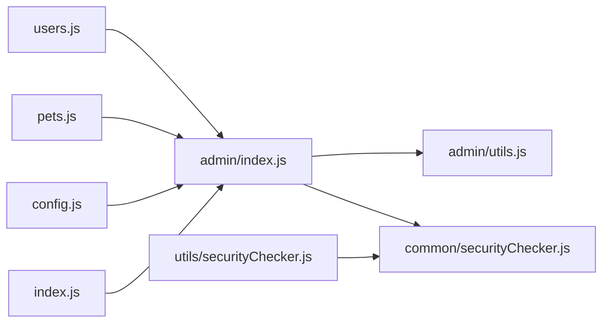

# 管理后台模块

<cite>
**本文引用的文件**
- [miniprogram/subpkg-admin/pages/admin/index.js](file://miniprogram/subpkg-admin/pages/admin/index.js)
- [miniprogram/subpkg-admin/pages/admin/users.js](file://miniprogram/subpkg-admin/pages/admin/users.js)
- [miniprogram/subpkg-admin/pages/admin/pets.js](file://miniprogram/subpkg-admin/pages/admin/pets.js)
- [miniprogram/subpkg-admin/pages/admin/config.js](file://miniprogram/subpkg-admin/pages/admin/config.js)
- [miniprogram/subpkg-admin/pages/admin/footprints.js](file://miniprogram/subpkg-admin/pages/admin/footprints.js)
- [miniprogram/subpkg-admin/pages/admin/index.wxml](file://miniprogram/subpkg-admin/pages/admin/index.wxml)
- [miniprogram/subpkg-admin/pages/admin/users.wxml](file://miniprogram/subpkg-admin/pages/admin/users.wxml)
- [miniprogram/subpkg-admin/pages/admin/pets.wxml](file://miniprogram/subpkg-admin/pages/admin/pets.wxml)
- [miniprogram/subpkg-admin/pages/admin/config.wxml](file://miniprogram/subpkg-admin/pages/admin/config.wxml)
- [miniprogram/subpkg-admin/pages/admin/index.wxss](file://miniprogram/subpkg-admin/pages/admin/index.wxss)
- [miniprogram/subpkg-admin/pages/admin/config.wxss](file://miniprogram/subpkg-admin/pages/admin/config.wxss)
- [cloudfunctions/admin/index.js](file://cloudfunctions/admin/index.js)
- [cloudfunctions/admin/utils.js](file://cloudfunctions/admin/utils.js)
- [cloudfunctions/common/securityChecker.js](file://cloudfunctions/common/securityChecker.js)
- [miniprogram/utils/securityChecker.js](file://miniprogram/utils/securityChecker.js)
</cite>

## 目录
1. [引言](#引言)
2. [项目结构](#项目结构)
3. [核心组件](#核心组件)
4. [架构概览](#架构概览)
5. [详细组件分析](#详细组件分析)
6. [依赖关系分析](#依赖关系分析)
7. [性能考虑](#性能考虑)
8. [故障排除指南](#故障排除指南)
9. [结论](#结论)
10. [附录](#附录)

## 引言
本文件全面介绍管理后台模块的功能与实现，涵盖用户数据管理、系统配置管理、数据统计分析、权限控制机制以及界面交互设计。管理后台基于微信小程序前端与云开发云函数协作，提供仪表盘、用户管理、宠物管理、配置管理与足迹管理等核心功能，并内置内容安全审核能力。

## 项目结构
管理后台位于小程序子包 `subpkg-admin` 中，采用按功能分页的组织方式：
- 仪表盘页面：展示系统关键指标、用户增长趋势、宠物分布与最近动态
- 用户管理页面：支持搜索、筛选、排序、批量操作（封禁/解封/删除）与敏感操作二次确认
- 宠物管理页面：支持按名称与分类搜索、查看宠物详情
- 配置管理页面：集中管理最大宠物数量、功能开关、第三方服务配置等
- 足迹管理页面：预留扩展入口

**图表来源**
- [miniprogram/subpkg-admin/pages/admin/index.js:1-123](file://miniprogram/subpkg-admin/pages/admin/index.js#L1-L123)
- [miniprogram/subpkg-admin/pages/admin/users.js:1-288](file://miniprogram/subpkg-admin/pages/admin/users.js#L1-L288)
- [miniprogram/subpkg-admin/pages/admin/pets.js:1-96](file://miniprogram/subpkg-admin/pages/admin/pets.js#L1-L96)
- [miniprogram/subpkg-admin/pages/admin/config.js:1-185](file://miniprogram/subpkg-admin/pages/admin/config.js#L1-L185)
- [cloudfunctions/admin/index.js:1-533](file://cloudfunctions/admin/index.js#L1-L533)
- [cloudfunctions/admin/utils.js:1-69](file://cloudfunctions/admin/utils.js#L1-L69)
- [cloudfunctions/common/securityChecker.js:1-226](file://cloudfunctions/common/securityChecker.js#L1-L226)
- [miniprogram/utils/securityChecker.js:1-122](file://miniprogram/utils/securityChecker.js#L1-L122)

**章节来源**
- [miniprogram/subpkg-admin/pages/admin/index.js:1-123](file://miniprogram/subpkg-admin/pages/admin/index.js#L1-L123)
- [miniprogram/subpkg-admin/pages/admin/users.js:1-288](file://miniprogram/subpkg-admin/pages/admin/users.js#L1-L288)
- [miniprogram/subpkg-admin/pages/admin/pets.js:1-96](file://miniprogram/subpkg-admin/pages/admin/pets.js#L1-L96)
- [miniprogram/subpkg-admin/pages/admin/config.js:1-185](file://miniprogram/subpkg-admin/pages/admin/config.js#L1-L185)
- [cloudfunctions/admin/index.js:1-533](file://cloudfunctions/admin/index.js#L1-L533)

## 核心组件
- 权限控制与鉴权
  - 管理员白名单与数据库管理员表双重保障，运行时校验当前用户是否具备管理员身份
  - 仅授权管理员可执行统计查询、用户管理、配置更新等敏感操作
- 数据统计与报表
  - 仪表盘聚合用户数、宠物数、足迹数、今日活跃与增长率
  - 用户增长趋势（7日）、宠物类型分布饼图、最近动态列表
- 用户数据管理
  - 支持按昵称/用户名/openid 搜索、状态筛选、时间/昵称排序
  - 提供编辑用户昵称、封禁/解封、删除用户（级联清理）等操作
  - 敏感操作采用二次确认弹窗，防止误操作
- 宠物数据管理
  - 支持按名称与分类搜索，查看宠物详情
- 系统配置管理
  - 集中管理最大宠物数量、最大足迹图片数、功能开关、第三方服务配置（COS、ASR）
  - 支持重置为默认配置，本地缓存兜底
- 内容安全审核
  - 小程序侧统一的安全检查封装，支持图片/文本异步/同步审核
  - 云函数侧提供通用安全检查器，负责调用微信云平台审核接口并记录日志

**章节来源**
- [cloudfunctions/admin/index.js:11-38](file://cloudfunctions/admin/index.js#L11-L38)
- [cloudfunctions/admin/index.js:74-115](file://cloudfunctions/admin/index.js#L74-L115)
- [cloudfunctions/admin/index.js:118-174](file://cloudfunctions/admin/index.js#L118-L174)
- [cloudfunctions/admin/index.js:219-258](file://cloudfunctions/admin/index.js#L219-L258)
- [cloudfunctions/admin/index.js:260-320](file://cloudfunctions/admin/index.js#L260-L320)
- [cloudfunctions/admin/index.js:434-473](file://cloudfunctions/admin/index.js#L434-L473)
- [cloudfunctions/admin/index.js:476-508](file://cloudfunctions/admin/index.js#L476-L508)
- [miniprogram/utils/securityChecker.js:1-122](file://miniprogram/utils/securityChecker.js#L1-L122)
- [cloudfunctions/common/securityChecker.js:1-226](file://cloudfunctions/common/securityChecker.js#L1-L226)

## 架构概览
管理后台采用“前端页面 + 云函数 + 数据库”的三层架构：
- 前端页面通过 wx.cloud.callFunction 调用管理员云函数，传递 action 与参数
- 云函数进行管理员权限校验，再路由到具体业务处理函数
- 业务函数访问数据库集合，执行查询/更新/删除等操作
- 安全检查贯穿上传与发布流程，确保内容合规

**图表来源**
- [miniprogram/subpkg-admin/pages/admin/index.js:90-95](file://miniprogram/subpkg-admin/pages/admin/index.js#L90-L95)
- [cloudfunctions/admin/index.js:27-71](file://cloudfunctions/admin/index.js#L27-L71)
- [cloudfunctions/common/securityChecker.js:180-207](file://cloudfunctions/common/securityChecker.js#L180-L207)

## 详细组件分析

### 仪表盘组件（index）
- 功能要点
  - 并发加载统计数据、用户增长趋势、宠物分布与最近动态
  - 展示卡片式指标与可视化图表（柱状图/饼图）
  - 支持导航至配置、宠物、足迹、用户管理页面
- 数据流
  - 通过 callAdminAPI 统一调用云函数，分别请求 getStats、getUserGrowth、getPetDistribution、getRecentActivities
  - 成功后合并更新页面数据，失败提示并保持加载态

**图表来源**
- [miniprogram/subpkg-admin/pages/admin/index.js:35-82](file://miniprogram/subpkg-admin/pages/admin/index.js#L35-L82)

**章节来源**
- [miniprogram/subpkg-admin/pages/admin/index.js:1-123](file://miniprogram/subpkg-admin/pages/admin/index.js#L1-L123)
- [miniprogram/subpkg-admin/pages/admin/index.wxml:1-130](file://miniprogram/subpkg-admin/pages/admin/index.wxml#L1-L130)
- [miniprogram/subpkg-admin/pages/admin/index.wxss:1-469](file://miniprogram/subpkg-admin/pages/admin/index.wxss#L1-L469)

### 用户管理组件（users）
- 功能要点
  - 搜索框防抖（300ms）提升输入体验
  - 状态筛选（全部/正常/封禁）与排序切换（注册时间/昵称）
  - 操作按钮：编辑昵称、封禁/解封、删除（二次确认）
  - 复制 openid、头像加载失败兜底
- 安全与交互
  - 封禁/解封/删除均弹出确认对话框，删除操作包含二次确认
  - 所有操作通过云函数 updateUser/deleteUser 执行，保证权限与一致性

**图表来源**
- [miniprogram/subpkg-admin/pages/admin/users.js:30-58](file://miniprogram/subpkg-admin/pages/admin/users.js#L30-L58)
- [cloudfunctions/admin/index.js:118-174](file://cloudfunctions/admin/index.js#L118-L174)
- [cloudfunctions/admin/index.js:177-217](file://cloudfunctions/admin/index.js#L177-L217)
- [cloudfunctions/admin/index.js:220-258](file://cloudfunctions/admin/index.js#L220-L258)

**章节来源**
- [miniprogram/subpkg-admin/pages/admin/users.js:1-288](file://miniprogram/subpkg-admin/pages/admin/users.js#L1-L288)
- [miniprogram/subpkg-admin/pages/admin/users.wxml:1-112](file://miniprogram/subpkg-admin/pages/admin/users.wxml#L1-L112)

### 宠物管理组件（pets）
- 功能要点
  - 按名称搜索与分类筛选（水龟/陆龟/其他）
  - 查看宠物详情（跳转至宠物详情页）
- 数据来源
  - 通过 getPets 获取列表，兼容多种用户字段与头像来源

**章节来源**
- [miniprogram/subpkg-admin/pages/admin/pets.js:1-96](file://miniprogram/subpkg-admin/pages/admin/pets.js#L1-L96)
- [miniprogram/subpkg-admin/pages/admin/pets.wxml:1-85](file://miniprogram/subpkg-admin/pages/admin/pets.wxml#L1-L85)
- [cloudfunctions/admin/index.js:260-320](file://cloudfunctions/admin/index.js#L260-L320)

### 配置管理组件（config）
- 功能要点
  - 分区展示基础配置、业务配置、功能开关、图片服务、COS、ASR 等
  - 实时输入与开关变更，保存时调用云函数更新 systemConfig 集合
  - 支持重置为默认配置；加载失败时使用本地存储兜底
- 数据持久化
  - 云函数写入/更新 systemConfig，同时记录更新人与时间戳

**图表来源**
- [miniprogram/subpkg-admin/pages/admin/config.js:49-114](file://miniprogram/subpkg-admin/pages/admin/config.js#L49-L114)
- [cloudfunctions/admin/index.js:434-473](file://cloudfunctions/admin/index.js#L434-L473)
- [cloudfunctions/admin/index.js:476-508](file://cloudfunctions/admin/index.js#L476-L508)

**章节来源**
- [miniprogram/subpkg-admin/pages/admin/config.js:1-185](file://miniprogram/subpkg-admin/pages/admin/config.js#L1-L185)
- [miniprogram/subpkg-admin/pages/admin/config.wxml:1-145](file://miniprogram/subpkg-admin/pages/admin/config.wxml#L1-L145)
- [miniprogram/subpkg-admin/pages/admin/config.wxss:1-210](file://miniprogram/subpkg-admin/pages/admin/config.wxss#L1-L210)

### 权限控制与安全检查
- 权限控制
  - 管理员白名单与数据库管理员表双重校验，确保只有授权用户可访问管理后台
  - 云函数统一入口，所有敏感操作均需通过权限校验
- 内容安全
  - 小程序侧提供异步/同步审核方法，便于上传后触发或阻塞式等待
  - 云函数侧提供通用安全检查器，自动转换云存储 fileID 为临时 URL 并调用微信审核接口，同时记录审核日志

**图表来源**
- [miniprogram/utils/securityChecker.js:13-107](file://miniprogram/utils/securityChecker.js#L13-L107)
- [cloudfunctions/common/securityChecker.js:30-208](file://cloudfunctions/common/securityChecker.js#L30-L208)

**章节来源**
- [cloudfunctions/admin/index.js:11-38](file://cloudfunctions/admin/index.js#L11-L38)
- [cloudfunctions/admin/index.js:476-508](file://cloudfunctions/admin/index.js#L476-L508)
- [miniprogram/utils/securityChecker.js:1-122](file://miniprogram/utils/securityChecker.js#L1-L122)
- [cloudfunctions/common/securityChecker.js:1-226](file://cloudfunctions/common/securityChecker.js#L1-L226)

## 依赖关系分析
- 前端页面依赖管理员云函数提供的统一 API，通过 action 字段区分不同业务
- 云函数依赖数据库集合（users、pets、footprints、records、eggRecords、admins、bannedUsers、systemConfig、security_logs）
- 安全检查器在云函数与小程序两端均有实现，形成前后端协同的内容审核体系

**图表来源**
- [miniprogram/subpkg-admin/pages/admin/users.js:33-42](file://miniprogram/subpkg-admin/pages/admin/users.js#L33-L42)
- [miniprogram/subpkg-admin/pages/admin/pets.js:31-38](file://miniprogram/subpkg-admin/pages/admin/pets.js#L31-L38)
- [miniprogram/subpkg-admin/pages/admin/config.js:52-55](file://miniprogram/subpkg-admin/pages/admin/config.js#L52-L55)
- [miniprogram/subpkg-admin/pages/admin/index.js:91-94](file://miniprogram/subpkg-admin/pages/admin/index.js#L91-L94)
- [cloudfunctions/admin/index.js:1-71](file://cloudfunctions/admin/index.js#L1-L71)
- [cloudfunctions/admin/utils.js:1-69](file://cloudfunctions/admin/utils.js#L1-L69)
- [cloudfunctions/common/securityChecker.js:1-226](file://cloudfunctions/common/securityChecker.js#L1-L226)
- [miniprogram/utils/securityChecker.js:1-122](file://miniprogram/utils/securityChecker.js#L1-L122)

**章节来源**
- [cloudfunctions/admin/index.js:1-71](file://cloudfunctions/admin/index.js#L1-L71)
- [cloudfunctions/admin/utils.js:1-69](file://cloudfunctions/admin/utils.js#L1-L69)

## 性能考虑
- 前端优化
  - 用户列表搜索采用防抖（300ms），减少频繁网络请求
  - 仪表盘使用 Promise.all 并发加载多项数据，缩短首屏等待时间
- 云函数优化
  - 统一响应包装与错误捕获，避免异常传播导致页面卡死
  - 宠物列表按 openid 去重后批量查询用户信息，降低查询次数
- 数据库优化
  - 合理使用索引字段（createdAt、openid、category 等），避免全表扫描
  - 事务删除用户时一次性清理关联集合，减少多次往返

[本节为通用指导，无需列出具体文件来源]

## 故障排除指南
- 无管理员权限
  - 现象：调用云函数返回无权限
  - 处理：确认当前用户是否在管理员白名单或数据库管理员表中
  - 参考路径：[cloudfunctions/admin/index.js:31-38](file://cloudfunctions/admin/index.js#L31-L38)
- 配置加载失败
  - 现象：配置页面加载失败或为空
  - 处理：检查数据库 systemConfig 是否存在；若不存在，使用默认配置；同时检查本地缓存
  - 参考路径：[miniprogram/subpkg-admin/pages/admin/config.js:67-79](file://miniprogram/subpkg-admin/pages/admin/config.js#L67-L79)
- 用户删除失败
  - 现象：删除用户后仍残留部分数据
  - 处理：确认事务是否正确提交；检查 records、eggRecords 等集合是否存在关联数据
  - 参考路径：[cloudfunctions/admin/index.js:227-258](file://cloudfunctions/admin/index.js#L227-L258)
- 审核服务异常
  - 现象：图片/文本审核失败或超时
  - 处理：检查云函数安全检查器调用链路与网络环境；必要时降级放行以保证用户体验
  - 参考路径：[cloudfunctions/common/securityChecker.js:82-105](file://cloudfunctions/common/securityChecker.js#L82-L105)

**章节来源**
- [cloudfunctions/admin/index.js:31-38](file://cloudfunctions/admin/index.js#L31-L38)
- [cloudfunctions/admin/index.js:227-258](file://cloudfunctions/admin/index.js#L227-L258)
- [cloudfunctions/common/securityChecker.js:82-105](file://cloudfunctions/common/securityChecker.js#L82-L105)
- [miniprogram/subpkg-admin/pages/admin/config.js:67-79](file://miniprogram/subpkg-admin/pages/admin/config.js#L67-L79)

## 结论
管理后台模块通过清晰的权限控制、完善的统计分析、便捷的数据管理与安全的内容审核机制，为系统运营提供了高效可靠的管理工具。前端采用模块化页面与统一云函数调用，后端以云函数为中心串联数据库与安全检查，整体架构简洁可靠，易于维护与扩展。

[本节为总结性内容，无需列出具体文件来源]

## 附录

### 管理API文档（概览）
- 通用约定
  - 请求：通过 wx.cloud.callFunction 调用，传入 action 与 data
  - 响应：统一包含 success、data/message/error 字段
- 管理员权限
  - 仅管理员可调用以下 API
- API 列表
  - getStats：获取系统统计指标（用户数、宠物数、足迹数、今日活跃、增长率）
  - getUserGrowth：获取用户增长趋势（默认7日）
  - getPetDistribution：获取宠物类型分布
  - getRecentActivities：获取最近动态
  - getUsers：获取用户列表（支持搜索、筛选、排序）
  - getPets：获取宠物列表（支持搜索、筛选）
  - getFootprints：获取足迹列表（支持日期筛选与搜索）
  - getConfig/updateConfig：获取与更新系统配置
  - updateUser：更新用户信息（昵称/状态）
  - deleteUser：删除用户（含关联数据）

**章节来源**
- [miniprogram/subpkg-admin/pages/admin/index.js:90-95](file://miniprogram/subpkg-admin/pages/admin/index.js#L90-L95)
- [cloudfunctions/admin/index.js:41-71](file://cloudfunctions/admin/index.js#L41-L71)
- [cloudfunctions/admin/index.js:42-66](file://cloudfunctions/admin/index.js#L42-L66)

### 界面交互与操作指南
- 仪表盘
  - 进入即刷新数据；支持导航至各功能页面
  - 可视化图表直观展示趋势与分布
- 用户管理
  - 输入搜索关键词自动触发查询（防抖）
  - 点击状态/排序项切换筛选条件
  - 对敏感操作（封禁/解封/删除）进行二次确认
- 宠物管理
  - 支持按名称与分类筛选；点击“查看”进入详情
- 配置管理
  - 分类编辑各项配置；点击“保存配置”提交更新
  - 支持“重置为默认配置”
- 底部导航
  - 固定导航栏快速切换各功能页面

**章节来源**
- [miniprogram/subpkg-admin/pages/admin/index.wxml:1-130](file://miniprogram/subpkg-admin/pages/admin/index.wxml#L1-L130)
- [miniprogram/subpkg-admin/pages/admin/users.wxml:1-112](file://miniprogram/subpkg-admin/pages/admin/users.wxml#L1-L112)
- [miniprogram/subpkg-admin/pages/admin/pets.wxml:1-85](file://miniprogram/subpkg-admin/pages/admin/pets.wxml#L1-L85)
- [miniprogram/subpkg-admin/pages/admin/config.wxml:1-145](file://miniprogram/subpkg-admin/pages/admin/config.wxml#L1-L145)