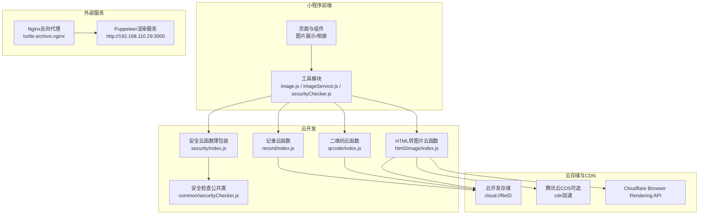
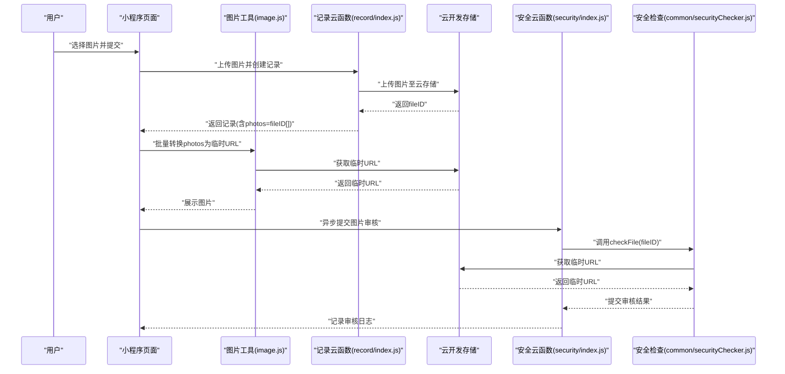
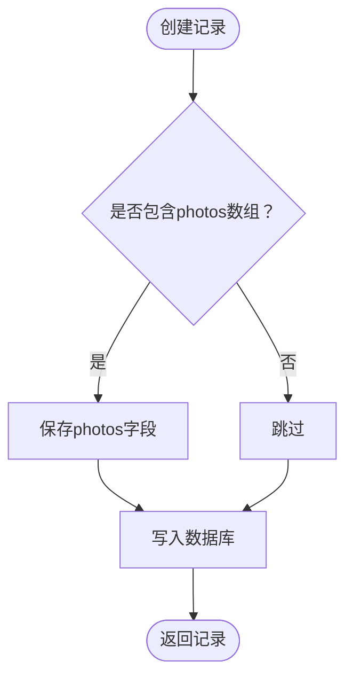
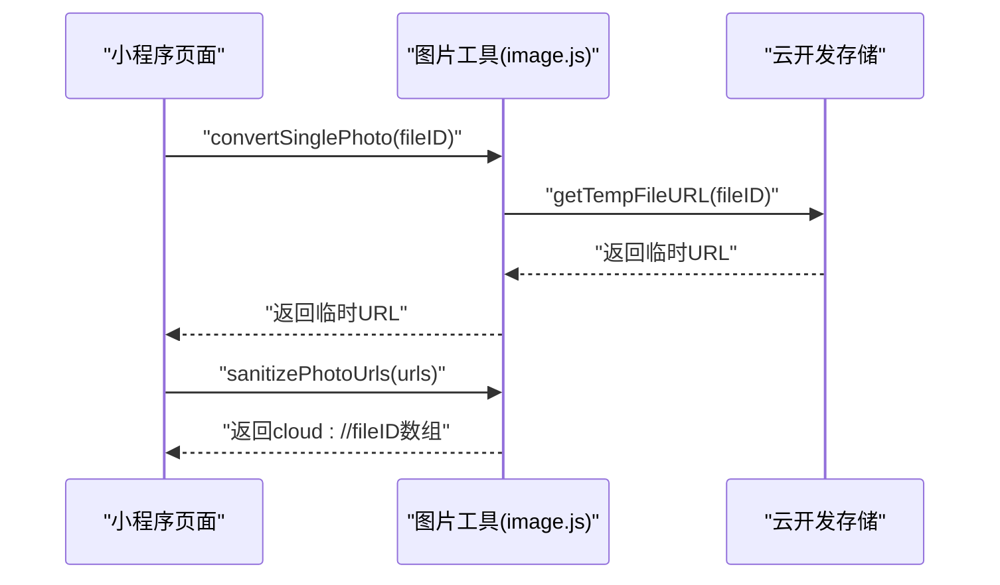
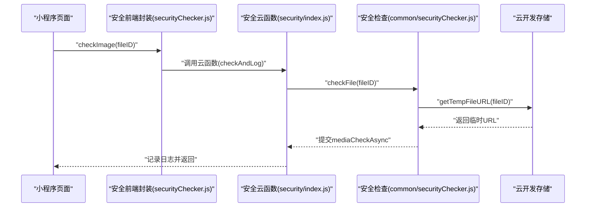
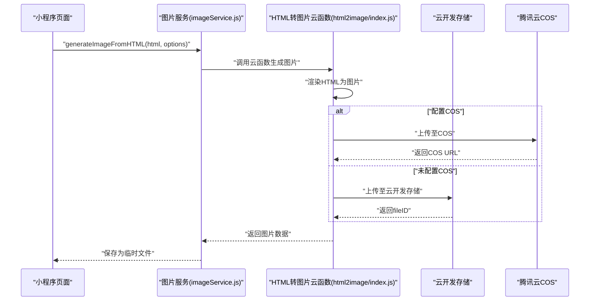
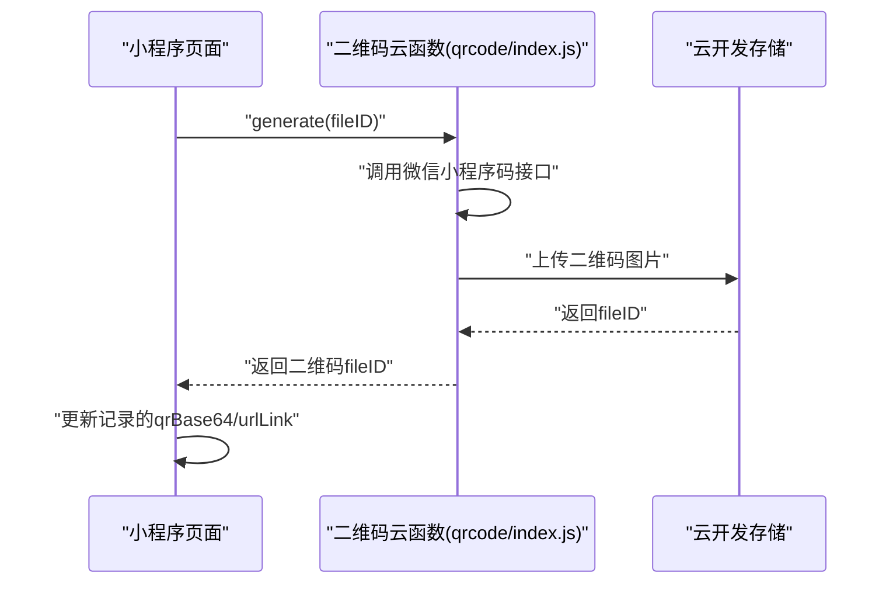
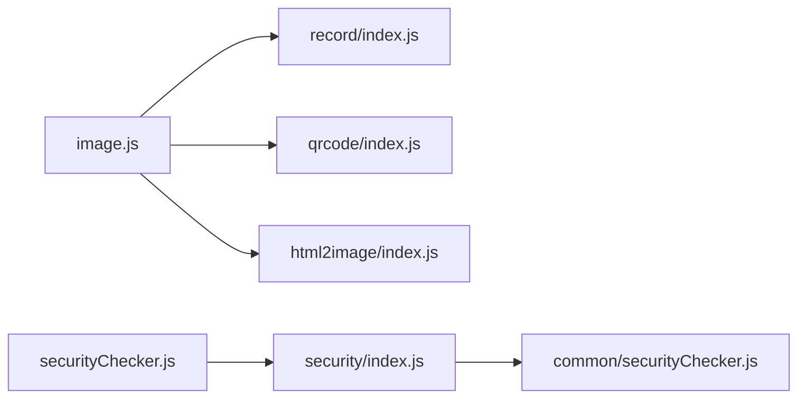

# 记录媒体处理

<cite>
**本文引用的文件**
- [cloudfunctions/record/index.js](file://cloudfunctions/record/index.js)
- [cloudfunctions/record/utils.js](file://cloudfunctions/record/utils.js)
- [cloudfunctions/qrcode/index.js](file://cloudfunctions/qrcode/index.js)
- [cloudfunctions/html2image/index.js](file://cloudfunctions/html2image/index.js)
- [cloudfunctions/common/securityChecker.js](file://cloudfunctions/common/securityChecker.js)
- [cloudfunctions/security/index.js](file://cloudfunctions/security/index.js)
- [miniprogram/utils/image.js](file://miniprogram/utils/image.js)
- [miniprogram/utils/imageService.js](file://miniprogram/utils/imageService.js)
- [miniprogram/utils/theme.js](file://miniprogram/utils/theme.js)
- [miniprogram/pages/pet/detail.js](file://miniprogram/pages/pet/detail.js)
- [miniprogram/utils/securityChecker.js](file://miniprogram/utils/securityChecker.js)
- [miniprogram/utils/error.js](file://miniprogram/utils/error.js)
- [cloudflare-worker/src/index.js](file://cloudflare-worker/src/index.js)
- [server-setup/turtle-archive.nginx](file://server-setup/turtle-archive.nginx)
</cite>

## 目录
1. [引言](#引言)
2. [项目结构](#项目结构)
3. [核心组件](#核心组件)
4. [架构总览](#架构总览)
5. [详细组件分析](#详细组件分析)
6. [依赖关系分析](#依赖关系分析)
7. [性能考虑](#性能考虑)
8. [故障排查指南](#故障排查指南)
9. [结论](#结论)

## 引言
本文件围绕“记录媒体处理”主题，系统梳理并说明以下能力与流程：
- 记录中图片附件的上传、存储、缩放、压缩与展示
- photos 字段的数据结构与语义（图片URL数组、元数据、上传时间等）
- 图片上传的安全验证（类型检查、大小限制、内容安全审核）
- 存储策略（云开发存储、CDN加速、防盗链）
- 图片预览与展示（缩略图生成、大图查看、相册浏览）
- QR码相关媒体处理（二维码生成、缓存机制、链接转换）
- 错误处理与回退机制，保障稳定性与可靠性

## 项目结构
本项目采用“小程序前端 + 云开发云函数 + 云存储 + 外部渲染服务”的分层架构：
- 小程序前端负责用户交互、图片URL转换、QR码生成与展示
- 云函数负责记录增删改查、图片安全审核、HTML转图片、二维码生成与持久化
- 云存储提供图片与二维码的临时/永久访问
- 外部渲染服务（Puppeteer）负责将HTML渲染为图片；Cloudflare Worker提供浏览器渲染API作为备选
- Nginx反向代理统一暴露服务端口

图表来源
- [cloudfunctions/record/index.js:10-35](file://cloudfunctions/record/index.js#L10-L35)
- [cloudfunctions/qrcode/index.js:7-22](file://cloudfunctions/qrcode/index.js#L7-L22)
- [cloudfunctions/html2image/index.js:14-27](file://cloudfunctions/html2image/index.js#L14-L27)
- [cloudfunctions/security/index.js:15-64](file://cloudfunctions/security/index.js#L15-L64)
- [cloudfunctions/common/securityChecker.js:30-208](file://cloudfunctions/common/securityChecker.js#L30-L208)
- [miniprogram/utils/image.js:64-80](file://miniprogram/utils/image.js#L64-L80)
- [miniprogram/utils/imageService.js:59-80](file://miniprogram/utils/imageService.js#L59-L80)
- [miniprogram/utils/securityChecker.js:22-41](file://miniprogram/utils/securityChecker.js#L22-L41)
- [cloudflare-worker/src/index.js:78-117](file://cloudflare-worker/src/index.js#L78-L117)
- [server-setup/turtle-archive.nginx:31-64](file://server-setup/turtle-archive.nginx#L31-L64)

章节来源
- [cloudfunctions/record/index.js:10-35](file://cloudfunctions/record/index.js#L10-L35)
- [cloudfunctions/qrcode/index.js:7-22](file://cloudfunctions/qrcode/index.js#L7-L22)
- [cloudfunctions/html2image/index.js:14-27](file://cloudfunctions/html2image/index.js#L14-L27)
- [cloudfunctions/security/index.js:15-64](file://cloudfunctions/security/index.js#L15-L64)
- [cloudfunctions/common/securityChecker.js:30-208](file://cloudfunctions/common/securityChecker.js#L30-L208)
- [miniprogram/utils/image.js:64-80](file://miniprogram/utils/image.js#L64-L80)
- [miniprogram/utils/imageService.js:59-80](file://miniprogram/utils/imageService.js#L59-L80)
- [miniprogram/utils/securityChecker.js:22-41](file://miniprogram/utils/securityChecker.js#L22-L41)
- [cloudflare-worker/src/index.js:78-117](file://cloudflare-worker/src/index.js#L78-L117)
- [server-setup/turtle-archive.nginx:31-64](file://server-setup/turtle-archive.nginx#L31-L64)

## 核心组件
- 记录云函数：提供记录的创建、查询、更新、删除与QR缓存更新能力，支持在记录中附带图片数组
- 图片工具模块：负责将云存储fileID转换为临时URL、批量净化URL、转换单个图片URL
- HTML转图片服务：封装Puppeteer渲染，支持自定义宽高、缩放、格式与质量
- 安全检查：提供图片/文本内容安全审核，异步提交并记录日志，支持超时检测
- QR码云函数：生成小程序码并上传至云存储，或生成永久URL Link（含多环境回退）
- 存储与CDN：云开发存储提供cloud://fileID；可选COS上传；Cloudflare Browser Rendering API作为备选渲染通道
- Nginx代理：统一暴露API与HTML转图片服务端口

章节来源
- [cloudfunctions/record/index.js:37-82](file://cloudfunctions/record/index.js#L37-L82)
- [cloudfunctions/record/utils.js:10-18](file://cloudfunctions/record/utils.js#L10-L18)
- [miniprogram/utils/image.js:64-108](file://miniprogram/utils/image.js#L64-L108)
- [miniprogram/utils/imageService.js:59-80](file://miniprogram/utils/imageService.js#L59-L80)
- [cloudfunctions/common/securityChecker.js:74-105](file://cloudfunctions/common/securityChecker.js#L74-L105)
- [cloudfunctions/qrcode/index.js:24-61](file://cloudfunctions/qrcode/index.js#L24-L61)
- [cloudfunctions/html2image/index.js:66-140](file://cloudfunctions/html2image/index.js#L66-L140)
- [server-setup/turtle-archive.nginx:31-64](file://server-setup/turtle-archive.nginx#L31-L64)

## 架构总览
记录媒体处理的关键流程如下：
- 图片上传与存储：小程序端选择图片后，云函数将图片上传至云开发存储，返回cloud://fileID；前端可将fileID持久化到记录的photos字段
- 图片展示：前端将cloud://fileID转换为临时URL进行展示；批量转换与净化保证缓存一致性
- 安全审核：上传完成后，前端调用安全云函数异步提交审核，后台记录日志并支持超时检测
- HTML转图片：前端调用HTML转图片云函数，内部可选Puppeteer或Cloudflare Browser Rendering API渲染，支持上传至COS或云开发存储
- QR码处理：生成二维码图片或URL Link，支持缓存到记录字段，便于后续展示与分享

图表来源
- [cloudfunctions/record/index.js:37-82](file://cloudfunctions/record/index.js#L37-L82)
- [miniprogram/utils/image.js:64-108](file://miniprogram/utils/image.js#L64-L108)
- [cloudfunctions/security/index.js:22-39](file://cloudfunctions/security/index.js#L22-L39)
- [cloudfunctions/common/securityChecker.js:74-105](file://cloudfunctions/common/securityChecker.js#L74-L105)

## 详细组件分析

### 记录云函数与photos字段
- 功能要点
  - 创建记录时可携带photos字段（数组），数组元素为云存储fileID或临时URL
  - 支持按用户openid过滤记录列表，支持分页
  - 支持按记录ID查询与权限校验
  - 支持更新记录的QR缓存字段（qrBase64、urlLink），仅记录创建者可更新
- 数据结构
  - photos：字符串数组，元素为cloud://fileID或HTTP临时URL
  - 元数据：记录创建/更新时间、类型、文本、日期/时间等
  - QR缓存：qrBase64（二维码图片的Base64）、urlLink（永久链接）

图表来源
- [cloudfunctions/record/index.js:72-76](file://cloudfunctions/record/index.js#L72-L76)
- [cloudfunctions/record/index.js:77-82](file://cloudfunctions/record/index.js#L77-L82)

章节来源
- [cloudfunctions/record/index.js:37-82](file://cloudfunctions/record/index.js#L37-L82)
- [cloudfunctions/record/index.js:161-190](file://cloudfunctions/record/index.js#L161-L190)

### 图片上传、存储与展示
- 上传与存储
  - 云函数负责接收图片并上传至云开发存储，返回fileID
  - 前端将fileID写入记录的photos字段，便于后续展示
- 展示与转换
  - 将cloud://fileID转换为临时URL，支持批量转换与单个转换
  - 净化URL：将临时URL还原为cloud://fileID，确保缓存数据不过期
- 缩放与压缩
  - 云函数未内置缩放/压缩逻辑；前端可通过HTML转图片服务生成指定尺寸与质量的图片

图表来源
- [miniprogram/utils/image.js:64-108](file://miniprogram/utils/image.js#L64-L108)
- [miniprogram/utils/image.js:133-144](file://miniprogram/utils/image.js#L133-L144)

章节来源
- [cloudfunctions/record/index.js:72-76](file://cloudfunctions/record/index.js#L72-L76)
- [miniprogram/utils/image.js:64-108](file://miniprogram/utils/image.js#L64-L108)
- [miniprogram/utils/image.js:133-144](file://miniprogram/utils/image.js#L133-L144)

### 安全验证与内容审核
- 审核流程
  - 前端调用安全云函数提交审核（异步），后台记录日志
  - 安全检查公共类将cloud://fileID转换为临时URL后调用微信内容安全接口
  - 支持文本与图片审核；图片审核返回trace_id，状态为pending
- 回退与超时
  - 若审核服务不可用，前端可选择放行（避免影响业务）
  - 后台记录“待回调”审核，超过一定时间标记为timeout

图表来源
- [miniprogram/utils/securityChecker.js:50-59](file://miniprogram/utils/securityChecker.js#L50-L59)
- [cloudfunctions/security/index.js:35-39](file://cloudfunctions/security/index.js#L35-L39)
- [cloudfunctions/common/securityChecker.js:159-170](file://cloudfunctions/common/securityChecker.js#L159-L170)

章节来源
- [cloudfunctions/common/securityChecker.js:74-105](file://cloudfunctions/common/securityChecker.js#L74-L105)
- [cloudfunctions/common/securityChecker.js:159-170](file://cloudfunctions/common/securityChecker.js#L159-L170)
- [cloudfunctions/security/index.js:35-39](file://cloudfunctions/security/index.js#L35-L39)
- [miniprogram/utils/securityChecker.js:68-74](file://miniprogram/utils/securityChecker.js#L68-L74)

### HTML转图片与CDN加速
- 渲染服务
  - 云函数封装Puppeteer渲染，支持自定义宽高、缩放、格式与质量
  - 可选上传至腾讯云COS，生成公网可访问URL
  - Cloudflare Browser Rendering API作为备选通道
- CDN与防盗链
  - 云开发存储默认提供临时URL；COS可配置公开读ACL
  - 建议结合小程序云开发的防盗链策略与Nginx代理配置提升安全性

图表来源
- [miniprogram/utils/imageService.js:59-80](file://miniprogram/utils/imageService.js#L59-L80)
- [cloudfunctions/html2image/index.js:66-140](file://cloudfunctions/html2image/index.js#L66-L140)
- [cloudfunctions/html2image/index.js:145-172](file://cloudfunctions/html2image/index.js#L145-L172)

章节来源
- [miniprogram/utils/imageService.js:59-80](file://miniprogram/utils/imageService.js#L59-L80)
- [cloudfunctions/html2image/index.js:66-140](file://cloudfunctions/html2image/index.js#L66-L140)
- [cloudfunctions/html2image/index.js:145-172](file://cloudfunctions/html2image/index.js#L145-L172)
- [cloudflare-worker/src/index.js:78-117](file://cloudflare-worker/src/index.js#L78-L117)

### QR码生成与缓存
- 二维码图片生成
  - 云函数调用微信小程序码接口生成图片，上传至云存储，返回fileID
- URL Link生成
  - 生成永久URL Link，支持多环境回退；失败时提供纯文本回退方案
- 缓存与更新
  - 记录云函数提供静默更新QR缓存的能力，仅记录创建者可更新qrBase64与urlLink

图表来源
- [cloudfunctions/qrcode/index.js:24-61](file://cloudfunctions/qrcode/index.js#L24-L61)
- [cloudfunctions/record/index.js:161-190](file://cloudfunctions/record/index.js#L161-L190)

章节来源
- [cloudfunctions/qrcode/index.js:63-117](file://cloudfunctions/qrcode/index.js#L63-L117)
- [cloudfunctions/record/index.js:161-190](file://cloudfunctions/record/index.js#L161-L190)

### 图片预览与相册浏览
- 预览与相册
  - 页面在渲染前对图片URL进行转换与净化，确保展示稳定
  - 家谱树等复杂结构也对图片URL进行逐级转换
- 性能优化
  - 仅在必要时转换单张图片（如家谱树节点），减少不必要的网络请求

章节来源
- [miniprogram/pages/pet/detail.js:2405-2416](file://miniprogram/pages/pet/detail.js#L2405-L2416)
- [miniprogram/utils/image.js:115-126](file://miniprogram/utils/image.js#L115-L126)

## 依赖关系分析
- 前端依赖
  - image.js：图片URL转换与净化
  - imageService.js：HTML转图片服务封装
  - securityChecker.js：安全审核前端封装
- 云函数依赖
  - record/index.js：记录CRUD与QR缓存更新
  - qrcode/index.js：二维码生成
  - html2image/index.js：HTML转图片与COS上传
  - security/index.js：安全云函数薄包装
  - common/securityChecker.js：安全检查公共类

图表来源
- [miniprogram/utils/image.js:161-169](file://miniprogram/utils/image.js#L161-L169)
- [miniprogram/utils/securityChecker.js:112-117](file://miniprogram/utils/securityChecker.js#L112-L117)
- [cloudfunctions/security/index.js:15-64](file://cloudfunctions/security/index.js#L15-L64)
- [cloudfunctions/common/securityChecker.js:30-208](file://cloudfunctions/common/securityChecker.js#L30-L208)

章节来源
- [miniprogram/utils/image.js:161-169](file://miniprogram/utils/image.js#L161-L169)
- [miniprogram/utils/securityChecker.js:112-117](file://miniprogram/utils/securityChecker.js#L112-L117)
- [cloudfunctions/security/index.js:15-64](file://cloudfunctions/security/index.js#L15-L64)
- [cloudfunctions/common/securityChecker.js:30-208](file://cloudfunctions/common/securityChecker.js#L30-L208)

## 性能考虑
- 图片渲染
  - HTML转图片建议按需生成，避免频繁渲染；可缓存最终图片URL
  - 控制渲染分辨率与质量，平衡清晰度与体积
- 存储与CDN
  - 云开发存储适合小规模访问；大规模场景建议启用COS并配置CDN
  - 合理设置临时URL有效期，避免频繁刷新
- 审核与回退
  - 安全审核采用异步提交，避免阻塞主线程
  - 审核服务异常时前端可选择放行，后台记录日志以便后续处理

## 故障排查指南
- 图片无法显示
  - 检查fileID是否正确；若为临时URL，确认是否已转换为临时URL
  - 若转换失败，保留原始fileID作为回退
- 审核未返回结果
  - 查看“待回调”列表，识别超时记录并标记为timeout
  - 检查安全云函数日志与微信内容安全接口返回
- HTML转图片失败
  - 检查渲染服务可用性与Nginx代理配置
  - 如启用COS，确认密钥与桶配置正确
- QR码生成失败
  - 检查二维码云函数返回的错误码与错误信息
  - URL Link生成失败时使用纯文本回退方案

章节来源
- [miniprogram/utils/image.js:96-104](file://miniprogram/utils/image.js#L96-L104)
- [cloudfunctions/security/index.js:151-195](file://cloudfunctions/security/index.js#L151-L195)
- [cloudfunctions/html2image/index.js:132-139](file://cloudfunctions/html2image/index.js#L132-L139)
- [cloudfunctions/qrcode/index.js:49-60](file://cloudfunctions/qrcode/index.js#L49-L60)
- [miniprogram/utils/error.js:8-20](file://miniprogram/utils/error.js#L8-L20)

## 结论
本项目通过“小程序前端 + 云开发云函数 + 云存储 + 外部渲染服务”的组合，实现了记录媒体处理的完整闭环：从图片上传、存储、展示，到安全审核、QR码生成与缓存，再到CDN加速与防盗链策略。前端提供URL转换与净化，云函数承担业务逻辑与安全审核，外部渲染服务与CDN进一步提升性能与可用性。完善的错误处理与回退机制确保系统在异常情况下仍能稳定运行。