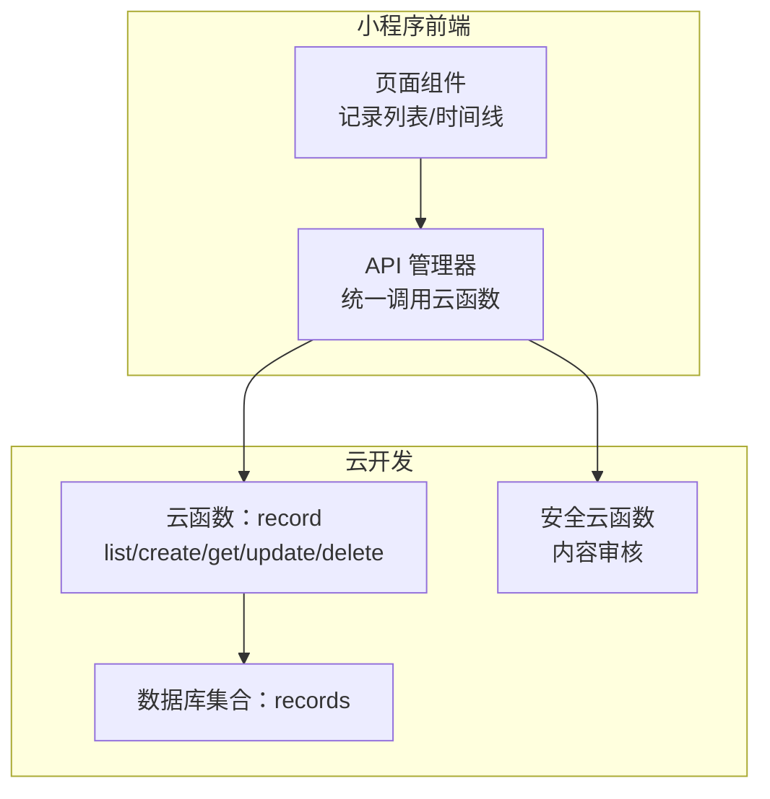
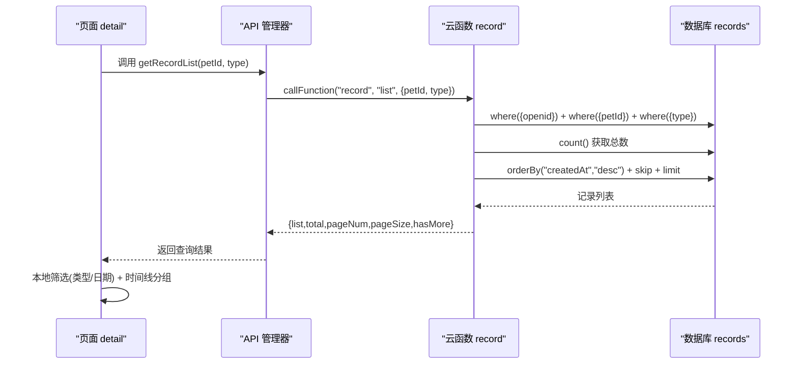
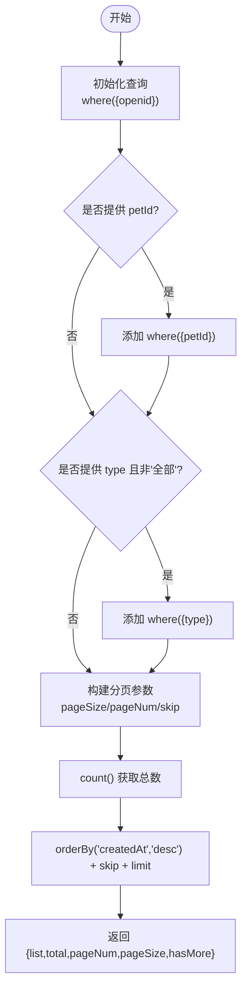
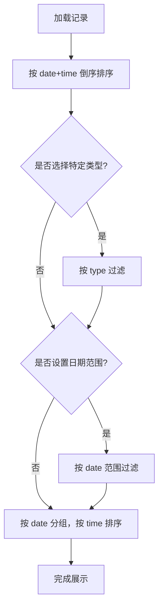
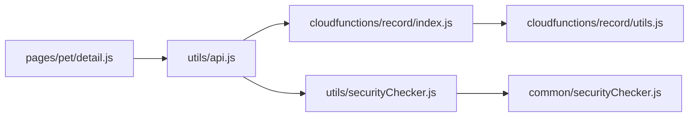

# 记录搜索与筛选

<cite>
**本文引用的文件**
- [cloudfunctions/record/index.js](file://cloudfunctions/record/index.js)
- [cloudfunctions/record/utils.js](file://cloudfunctions/record/utils.js)
- [miniprogram/utils/api.js](file://miniprogram/utils/api.js)
- [miniprogram/pages/pet/detail.js](file://miniprogram/pages/pet/detail.js)
- [cloudfunctions/common/securityChecker.js](file://cloudfunctions/common/securityChecker.js)
- [miniprogram/utils/securityChecker.js](file://miniprogram/utils/securityChecker.js)
</cite>

## 目录
1. [简介](#简介)
2. [项目结构](#项目结构)
3. [核心组件](#核心组件)
4. [架构总览](#架构总览)
5. [详细组件分析](#详细组件分析)
6. [依赖关系分析](#依赖关系分析)
7. [性能考量](#性能考量)
8. [故障排查指南](#故障排查指南)
9. [结论](#结论)
10. [附录](#附录)

## 简介
本文件系统性地介绍“记录搜索与筛选”功能，涵盖以下方面：
- 多种记录查询方式：按宠物ID筛选、按记录类型过滤、按日期范围查询等
- 分页查询机制：pageSize、pageNum 参数、skip 计算、hasMore 判断
- 查询条件构建：多条件组合、模糊搜索、精确匹配
- 查询结果排序：默认按创建时间倒序设计考虑
- 性能优化策略：索引使用、查询优化、缓存机制
- API 使用示例：完整查询场景的实际应用方法
- 查询限制与安全：防恶意查询攻击的防护措施

## 项目结构
记录搜索与筛选功能由前端小程序与云开发云函数协同实现：
- 前端通过统一 API 管理器调用云函数
- 云函数负责数据库查询、权限校验与结果封装
- 安全模块提供内容审核能力，保障数据安全

图表来源
- [cloudfunctions/record/index.js:10-35](file://cloudfunctions/record/index.js#L10-L35)
- [miniprogram/utils/api.js:86-96](file://miniprogram/utils/api.js#L86-L96)

章节来源
- [cloudfunctions/record/index.js:10-35](file://cloudfunctions/record/index.js#L10-L35)
- [miniprogram/utils/api.js:86-96](file://miniprogram/utils/api.js#L86-L96)

## 核心组件
- 云函数 record：提供记录列表查询、创建、获取、更新、删除等能力
- API 管理器：封装云函数调用，提供统一的 getRecordList 方法
- 前端页面 detail：负责记录加载、筛选、分组与展示
- 安全模块：提供图片/文本安全审核，辅助查询结果的合规性

章节来源
- [cloudfunctions/record/index.js:84-111](file://cloudfunctions/record/index.js#L84-L111)
- [miniprogram/utils/api.js:86-96](file://miniprogram/utils/api.js#L86-L96)
- [miniprogram/pages/pet/detail.js:1334-1352](file://miniprogram/pages/pet/detail.js#L1334-L1352)

## 架构总览
记录查询的端到端流程如下：
- 前端页面调用 API.getRecordList(petId, type)
- API 管理器将 action=list、data={petId, type} 发送至云函数 record
- 云函数在数据库 records 集合中按 openid、petId、type 构建查询条件
- 云函数执行分页查询，返回 list、total、pageNum、pageSize、hasMore
- 前端接收结果并进行本地筛选（类型、日期范围）与时间线分组

图表来源
- [miniprogram/utils/api.js:86-96](file://miniprogram/utils/api.js#L86-L96)
- [cloudfunctions/record/index.js:84-111](file://cloudfunctions/record/index.js#L84-L111)
- [miniprogram/pages/pet/detail.js:1334-1352](file://miniprogram/pages/pet/detail.js#L1334-L1352)

## 详细组件分析

### 云函数 record 的查询实现
- 查询入口：getRecordList(params, openid)
- 条件构建：
  - 必要条件：openid 限定用户可见范围
  - 可选条件：petId（按宠物筛选）、type（按记录类型过滤，"全部"表示不过滤）
- 分页逻辑：
  - 默认 pageSize=20，pageNum=1
  - skip=(pageNum-1)*pageSize
  - hasMore 通过比较 skip+data.length 与 total 判断
- 排序：按 createdAt 降序，保证最新记录优先展示
- 结果封装：normalizeIds 将 _id 映射为 id，便于前端统一处理

图表来源
- [cloudfunctions/record/index.js:84-111](file://cloudfunctions/record/index.js#L84-L111)

章节来源
- [cloudfunctions/record/index.js:84-111](file://cloudfunctions/record/index.js#L84-L111)

### 前端 API 管理器与调用
- API 管理器提供 getRecordList(petId, type) 方法，内部以 action=list 调用云函数 record
- 返回结果包含 success、data、message；前端可直接使用 data 或 data.list

章节来源
- [miniprogram/utils/api.js:86-96](file://miniprogram/utils/api.js#L86-L96)

### 前端页面 detail 的筛选与分组
- 加载记录：loadRecords(petId) -> API.getRecordList(petId)
- 本地筛选：
  - 类型筛选：currentEventTab 控制，过滤 type
  - 日期范围：selectedDate、endDate 控制，过滤 date
- 时间线分组：按 date 聚合，再按 time 排序
- 排序：sortRecords 按 date+time 倒序

图表来源
- [miniprogram/pages/pet/detail.js:1334-1352](file://miniprogram/pages/pet/detail.js#L1334-L1352)
- [miniprogram/pages/pet/detail.js:1366-1375](file://miniprogram/pages/pet/detail.js#L1366-L1375)
- [miniprogram/pages/pet/detail.js:1386-1424](file://miniprogram/pages/pet/detail.js#L1386-L1424)

章节来源
- [miniprogram/pages/pet/detail.js:1334-1352](file://miniprogram/pages/pet/detail.js#L1334-L1352)
- [miniprogram/pages/pet/detail.js:1366-1375](file://miniprogram/pages/pet/detail.js#L1366-L1375)
- [miniprogram/pages/pet/detail.js:1386-1424](file://miniprogram/pages/pet/detail.js#L1386-L1424)

### 查询条件构建与多条件组合
- 基础条件：openid 保证数据隔离
- 可选条件：
  - petId：精确匹配
  - type：精确匹配（"全部"表示不过滤）
- 本地二次筛选：
  - 类型标签切换
  - 日期范围选择器
- 注意：当前云函数未提供模糊搜索与多字段模糊匹配，如需扩展可在云函数层增加正则或全文检索

章节来源
- [cloudfunctions/record/index.js:84-93](file://cloudfunctions/record/index.js#L84-L93)
- [miniprogram/pages/pet/detail.js:1386-1400](file://miniprogram/pages/pet/detail.js#L1386-L1400)

### 分页查询机制详解
- 参数：
  - pageSize：每页条数，默认 20
  - pageNum：页码，默认 1
  - skip：(pageNum-1)*pageSize
- 计算：
  - total：查询总数
  - hasMore：skip + data.length < total
- 前端使用：
  - 通过 API.getRecordList(petId, type) 获取 list、total、pageNum、pageSize、hasMore
  - 在页面滚动到底部时递增 pageNum 并拼接数据

章节来源
- [cloudfunctions/record/index.js:96-110](file://cloudfunctions/record/index.js#L96-L110)
- [miniprogram/pages/pet/detail.js:308-313](file://miniprogram/pages/pet/detail.js#L308-L313)

### 查询结果排序规则
- 云函数默认按 createdAt 降序，确保最新记录优先
- 前端本地排序：按 date+time 倒序，保证时间线展示一致

章节来源
- [cloudfunctions/record/index.js](file://cloudfunctions/record/index.js#L103)
- [miniprogram/pages/pet/detail.js:1366-1375](file://miniprogram/pages/pet/detail.js#L1366-L1375)

### 安全与权限控制
- 云函数权限：
  - 所有查询均以 openid 作为基础条件，防止越权访问
  - 更新/删除操作会先校验记录是否存在且 openid 匹配
- 前端权限：
  - 仅展示当前用户的数据
- 安全审核：
  - 图片/文本内容审核通过安全云函数实现
  - 前端可异步或同步调用审核接口，保障内容合规

章节来源
- [cloudfunctions/record/index.js:113-121](file://cloudfunctions/record/index.js#L113-L121)
- [cloudfunctions/record/index.js:146-159](file://cloudfunctions/record/index.js#L146-L159)
- [cloudfunctions/common/securityChecker.js:74-105](file://cloudfunctions/common/securityChecker.js#L74-L105)
- [miniprogram/utils/securityChecker.js:50-92](file://miniprogram/utils/securityChecker.js#L50-L92)

## 依赖关系分析

图表来源
- [miniprogram/pages/pet/detail.js:1334-1352](file://miniprogram/pages/pet/detail.js#L1334-L1352)
- [miniprogram/utils/api.js:86-96](file://miniprogram/utils/api.js#L86-L96)
- [cloudfunctions/record/index.js:1-35](file://cloudfunctions/record/index.js#L1-L35)
- [cloudfunctions/record/utils.js:1-69](file://cloudfunctions/record/utils.js#L1-L69)
- [miniprogram/utils/securityChecker.js:1-122](file://miniprogram/utils/securityChecker.js#L1-L122)
- [cloudfunctions/common/securityChecker.js:1-226](file://cloudfunctions/common/securityChecker.js#L1-L226)

章节来源
- [miniprogram/pages/pet/detail.js:1334-1352](file://miniprogram/pages/pet/detail.js#L1334-L1352)
- [miniprogram/utils/api.js:86-96](file://miniprogram/utils/api.js#L86-L96)
- [cloudfunctions/record/index.js:1-35](file://cloudfunctions/record/index.js#L1-L35)
- [cloudfunctions/record/utils.js:1-69](file://cloudfunctions/record/utils.js#L1-L69)
- [miniprogram/utils/securityChecker.js:1-122](file://miniprogram/utils/securityChecker.js#L1-L122)
- [cloudfunctions/common/securityChecker.js:1-226](file://cloudfunctions/common/securityChecker.js#L1-L226)

## 性能考量
- 查询性能
  - 建议在 records 集合建立复合索引：{openid, petId, type, createdAt}
  - 云函数中按 openid + petId + type 的顺序构建查询，有利于命中索引
- 分页性能
  - 使用 skip/limit 实现分页，注意大数据量时 skip 过大可能影响性能
  - 可考虑基于游标（cursor）的分页替代 skip，减少深层偏移
- 缓存策略
  - 前端本地缓存 records，减少重复请求
  - 二维码链接等静态资源可做 CDN 缓存
- 排序与索引
  - createdAt 降序排序配合索引，提升排序效率
- 安全审核
  - 图片/文本审核采用异步提交，避免阻塞主线程
  - 审核结果通过日志记录，便于审计与问题追踪

[本节为通用性能建议，不直接分析具体文件]

## 故障排查指南
- 常见问题
  - 查询不到数据：确认 petId 是否正确、type 是否为"全部"、是否登录
  - 分页异常：检查 pageNum/pageSize 是否合理、hasMore 判断是否正确
  - 权限错误：检查 openid 是否匹配、更新/删除是否尝试越权
- 日志与定位
  - 云函数返回 success=false 时，查看 message 与 error 字段
  - 前端 API 调用失败时，检查 cloudAvailable 与 useFallback 标识
- 安全审核
  - 审核服务异常时，前端可选择放行并记录日志，避免影响用户体验

章节来源
- [cloudfunctions/record/index.js:31-34](file://cloudfunctions/record/index.js#L31-L34)
- [miniprogram/utils/api.js:12-38](file://miniprogram/utils/api.js#L12-L38)
- [cloudfunctions/common/securityChecker.js:82-105](file://cloudfunctions/common/securityChecker.js#L82-L105)
- [miniprogram/utils/securityChecker.js:68-92](file://miniprogram/utils/securityChecker.js#L68-L92)

## 结论
记录搜索与筛选功能通过“前端 API 管理器 + 云函数 + 数据库”的协作实现了：
- 精确的按宠物ID与记录类型筛选
- 简洁高效的分页查询与排序
- 严格的权限控制与安全审核
- 本地化的二次筛选与时间线分组
未来可进一步引入模糊搜索、全文检索、游标分页与更细粒度的索引策略，以满足更大规模数据的查询需求。

[本节为总结性内容，不直接分析具体文件]

## 附录

### API 使用示例（按场景）
- 按宠物ID查询所有记录
  - 调用：API.getRecordList(petId)
  - 说明：type 省略或传入"全部"
- 按宠物ID与记录类型查询
  - 调用：API.getRecordList(petId, type)
  - 说明：type 支持"建档"/"交配"/"产蛋"/"出苗"/"健康"
- 分页查询
  - 调用：API.getRecordList(petId, type)
  - 返回：list、total、pageNum、pageSize、hasMore
  - 前端逻辑：滚动到底部时 pageNum++ 并拼接 list
- 本地筛选与时间线分组
  - 类型筛选：currentEventTab 切换
  - 日期筛选：selectedDate、endDate 设置
  - 分组：按 date 聚合，按 time 排序

章节来源
- [miniprogram/utils/api.js:86-96](file://miniprogram/utils/api.js#L86-L96)
- [miniprogram/pages/pet/detail.js:1334-1352](file://miniprogram/pages/pet/detail.js#L1334-L1352)
- [miniprogram/pages/pet/detail.js:1386-1424](file://miniprogram/pages/pet/detail.js#L1386-L1424)

### 查询限制与安全考虑
- 查询限制
  - 仅返回当前 openid 下的数据，防止越权
  - 未提供模糊搜索与多字段检索，避免复杂查询带来的性能问题
- 安全考虑
  - 图片/文本内容审核异步提交，不影响主流程
  - 审核日志记录到数据库，便于审计
  - 前端可选择同步等待审核结果或异步提交

章节来源
- [cloudfunctions/record/index.js:84-93](file://cloudfunctions/record/index.js#L84-L93)
- [cloudfunctions/common/securityChecker.js:159-207](file://cloudfunctions/common/securityChecker.js#L159-L207)
- [miniprogram/utils/securityChecker.js:50-92](file://miniprogram/utils/securityChecker.js#L50-L92)