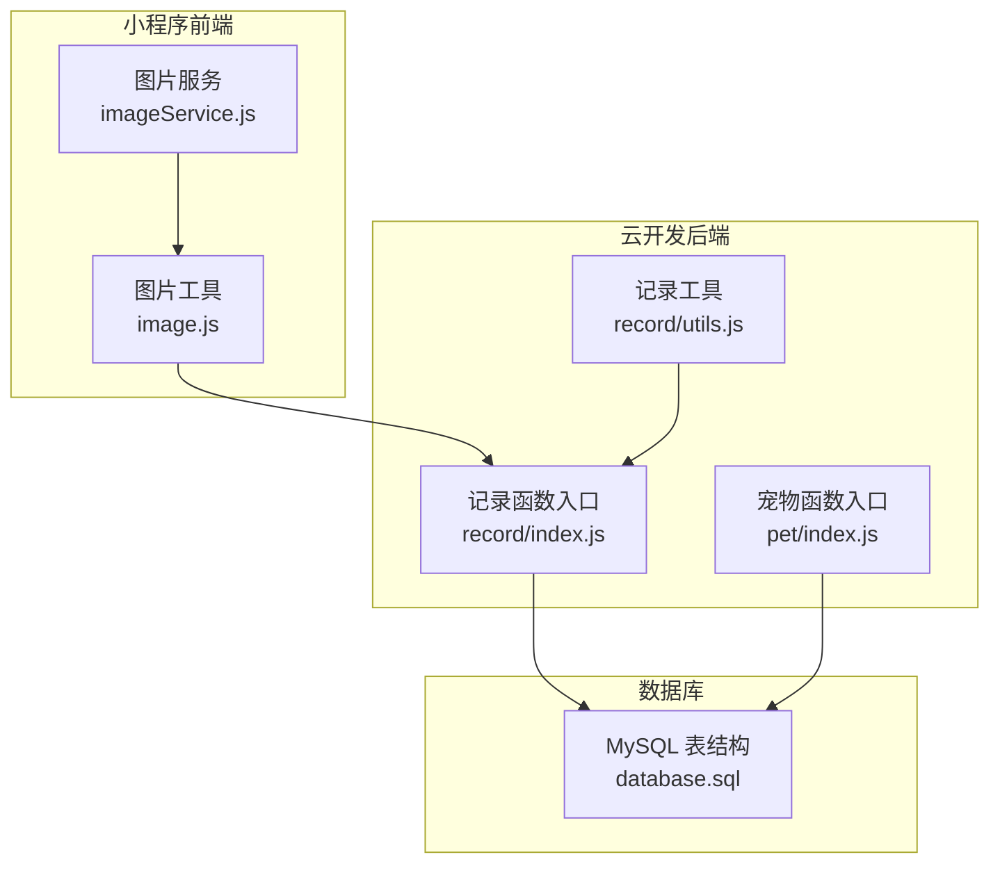
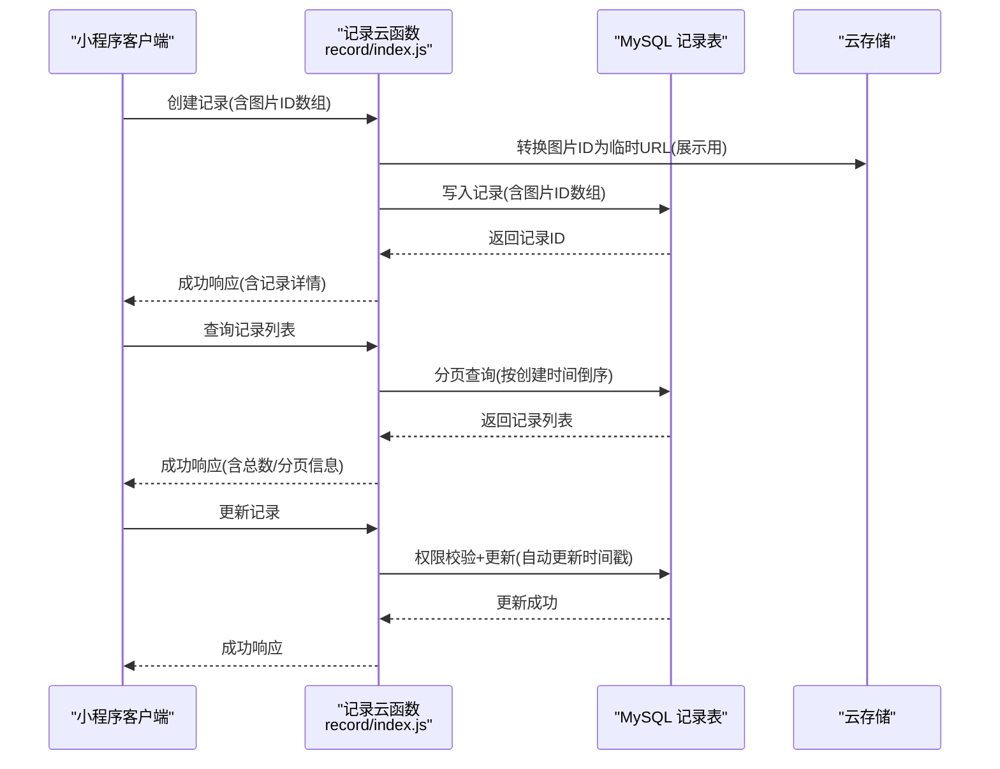
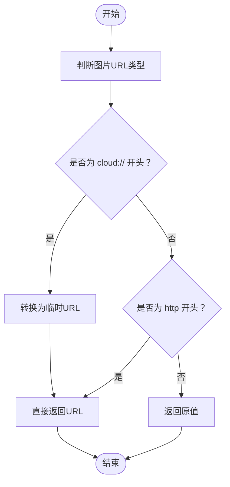
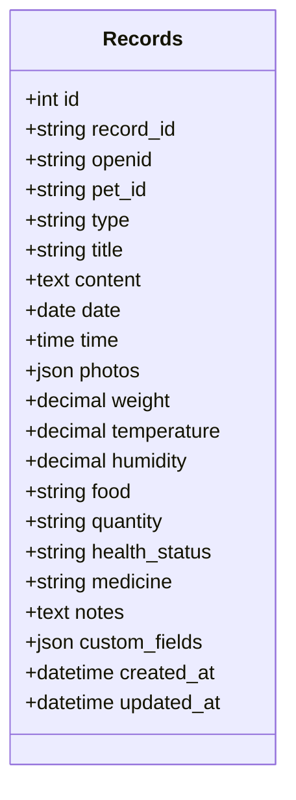
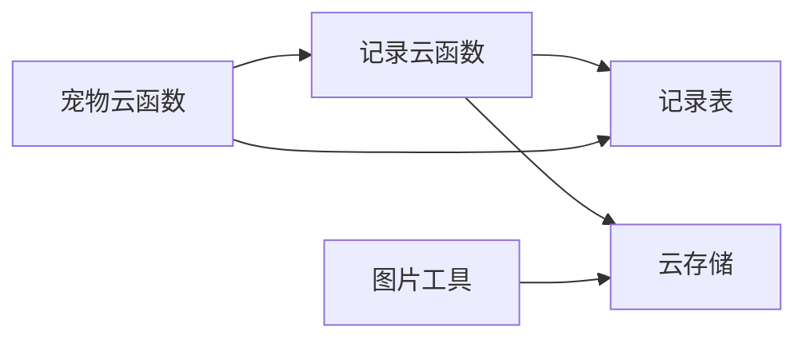

# 记录数据模型设计

<cite>
**本文档引用的文件**
- [cloudfunctions/record/index.js](file://cloudfunctions/record/index.js)
- [cloudfunctions/record/utils.js](file://cloudfunctions/record/utils.js)
- [cloudfunctions/pet/index.js](file://cloudfunctions/pet/index.js)
- [server-setup/database.sql](file://server-setup/database.sql)
- [miniprogram/utils/image.js](file://miniprogram/utils/image.js)
- [miniprogram/utils/imageService.js](file://miniprogram/utils/imageService.js)
</cite>

## 目录
1. [简介](#简介)
2. [项目结构](#项目结构)
3. [核心组件](#核心组件)
4. [架构概览](#架构概览)
5. [详细组件分析](#详细组件分析)
6. [依赖分析](#依赖分析)
7. [性能考虑](#性能考虑)
8. [故障排查指南](#故障排查指南)
9. [结论](#结论)
10. [附录](#附录)

## 简介
本文件系统性梳理“记录数据模型”的设计与实现，覆盖数据库表结构、字段定义、约束与索引、核心字段语义与格式、与宠物的关联关系、时间戳自动管理、图片附件存储策略、扩展性设计以及查询示例与性能优化建议。目标读者既包括开发者也包括产品与运维人员，力求以循序渐进的方式呈现复杂的技术细节。

## 项目结构
围绕“记录”主题，本项目涉及以下关键位置：
- 云开发后端函数：记录模块的增删改查逻辑与工具封装
- MySQL 数据库脚本：记录表的完整结构定义与索引策略
- 小程序前端工具：图片ID与临时URL互转、图片净化与缓存策略
- 与宠物模块的联动：删除宠物时清理关联记录

图表来源
- [cloudfunctions/record/index.js:1-191](file://cloudfunctions/record/index.js#L1-L191)
- [cloudfunctions/record/utils.js:1-69](file://cloudfunctions/record/utils.js#L1-L69)
- [cloudfunctions/pet/index.js:233-250](file://cloudfunctions/pet/index.js#L233-L250)
- [server-setup/database.sql:78-109](file://server-setup/database.sql#L78-L109)
- [miniprogram/utils/image.js:90-169](file://miniprogram/utils/image.js#L90-L169)
- [miniprogram/utils/imageService.js:1-202](file://miniprogram/utils/imageService.js#L1-L202)

章节来源
- [cloudfunctions/record/index.js:1-191](file://cloudfunctions/record/index.js#L1-L191)
- [cloudfunctions/record/utils.js:1-69](file://cloudfunctions/record/utils.js#L1-L69)
- [cloudfunctions/pet/index.js:233-250](file://cloudfunctions/pet/index.js#L233-L250)
- [server-setup/database.sql:78-109](file://server-setup/database.sql#L78-L109)
- [miniprogram/utils/image.js:90-169](file://miniprogram/utils/image.js#L90-L169)
- [miniprogram/utils/imageService.js:1-202](file://miniprogram/utils/imageService.js#L1-L202)

## 核心组件
- 记录表（MySQL）：承载各类记录的持久化结构，包含基础字段、业务字段与时间戳字段，并建立多维索引以支撑常见查询场景。
- 记录云函数：提供创建、查询、详情、更新、删除、QR缓存更新等能力；在创建与更新时自动维护时间戳。
- 图片工具链：负责将云存储fileID转换为临时URL用于展示，或将临时URL净化回fileID以避免缓存过期。
- 宠物联动：删除宠物时清理其关联记录，保障数据一致性。

章节来源
- [server-setup/database.sql:78-109](file://server-setup/database.sql#L78-L109)
- [cloudfunctions/record/index.js:37-82](file://cloudfunctions/record/index.js#L37-L82)
- [cloudfunctions/record/index.js:100-144](file://cloudfunctions/record/index.js#L100-L144)
- [miniprogram/utils/image.js:90-169](file://miniprogram/utils/image.js#L90-L169)
- [cloudfunctions/pet/index.js:246-248](file://cloudfunctions/pet/index.js#L246-L248)

## 架构概览
记录数据模型采用“云函数 + 关系型数据库 + 云存储”的组合方案：
- 云函数作为业务入口，负责参数校验、权限控制、数据组装与调用数据库。
- MySQL 记录表提供强一致性的结构化存储，配合索引提升查询性能。
- 云存储（cloud://）用于图片附件，前端通过工具链进行ID与临时URL互转。

图表来源
- [cloudfunctions/record/index.js:37-82](file://cloudfunctions/record/index.js#L37-L82)
- [cloudfunctions/record/index.js:84-111](file://cloudfunctions/record/index.js#L84-L111)
- [cloudfunctions/record/index.js:124-144](file://cloudfunctions/record/index.js#L124-L144)
- [server-setup/database.sql:78-109](file://server-setup/database.sql#L78-L109)

## 详细组件分析

### 数据库表结构与字段定义
记录表（records）的关键字段与约束如下：
- 主键与唯一标识
  - 自增主键 id
  - 唯一索引 idx_record_id（业务唯一ID）
- 关联字段
  - openid：用户标识，用于权限控制与数据隔离
  - pet_id：关联宠物的业务ID
- 类型与内容
  - type：记录类型，如 egg/breeding/health/feeding/custom
  - title/content：标题与内容
  - date/time：记录日期与时间
  - photos：JSON数组，存储图片fileID列表
  - weight/temperature/humidity：数值型指标
  - food/quantity/health_status/medicine/notes：文本型字段
  - custom_fields：JSON，支持扩展字段
- 时间戳
  - created_at：记录创建时间
  - updated_at：记录更新时间（自动更新）

索引策略
- idx_openid：按用户维度查询
- idx_pet_id：按宠物维度查询
- idx_type：按类型过滤
- idx_date：按日期范围查询
- idx_created_at：按创建时间倒序分页

章节来源
- [server-setup/database.sql:78-109](file://server-setup/database.sql#L78-L109)

### 核心字段语义与数据格式
- petId（MySQL字段：pet_id）
  - 语义：关联的宠物业务ID
  - 格式：字符串，长度限制由字段定义决定
  - 约束：非空；与宠物表保持一致
- type
  - 语义：记录类型
  - 取值：egg/breeding/health/feeding/custom
  - 约束：非空；建议在应用层做枚举校验
- text（MySQL字段：content）
  - 语义：记录内容文本
  - 格式：文本
  - 约束：可为空
- date
  - 语义：记录日期
  - 格式：YYYY-MM-DD
  - 约束：非空
- time
  - 语义：记录时间
  - 格式：HH:mm:ss 或空
  - 约束：可为空
- photos
  - 语义：图片附件列表
  - 格式：JSON数组，元素为云存储fileID
  - 约束：可为空；建议在前端进行数量与大小限制
- 其他业务字段
  - 数值型：weight、temperature、humidity（decimal）
  - 文本型：food、quantity、health_status、medicine、notes
  - 扩展型：custom_fields（JSON）

章节来源
- [server-setup/database.sql:84-99](file://server-setup/database.sql#L84-L99)
- [cloudfunctions/record/index.js:42-75](file://cloudfunctions/record/index.js#L42-L75)

### 记录与宠物的关联关系设计
- 关联方式
  - 记录表通过 pet_id 关联宠物表（业务ID）
  - 云函数在删除宠物时会清理该宠物的所有记录，确保数据一致性
- 外键约束
  - 当前数据库脚本未显式声明外键约束；可通过外键增强一致性，但需评估性能与迁移成本
- 级联删除
  - 通过云函数逻辑实现：删除宠物时调用删除记录集合中 petId 对应的文档
- 数据一致性保证
  - 云函数在创建/更新/删除记录时均进行 openid 权限校验
  - 前端图片ID与临时URL互转，避免缓存过期导致的显示异常

章节来源
- [cloudfunctions/pet/index.js:246-248](file://cloudfunctions/pet/index.js#L246-L248)
- [cloudfunctions/record/index.js:113-159](file://cloudfunctions/record/index.js#L113-L159)

### 时间戳字段设计与自动管理
- 字段
  - created_at：记录创建时间
  - updated_at：记录更新时间
- 自动管理机制
  - MySQL：created_at 默认 CURRENT_TIMESTAMP；updated_at 默认 CURRENT_TIMESTAMP ON UPDATE CURRENT_TIMESTAMP
  - 云函数：创建时写入 createdAt/updatedAt；更新时仅更新指定字段并自动刷新 updatedAt
- 作用
  - 支持按创建时间倒序分页
  - 便于审计与统计

章节来源
- [server-setup/database.sql:100-101](file://server-setup/database.sql#L100-L101)
- [cloudfunctions/record/index.js:49-50](file://cloudfunctions/record/index.js#L49-L50)
- [cloudfunctions/record/index.js:136-140](file://cloudfunctions/record/index.js#L136-L140)

### 图片附件存储策略
- 存储介质
  - 使用云存储（cloud://fileID）存储图片
- URL格式与转换
  - 前端工具支持将 cloud://fileID 转换为临时URL用于展示
  - 支持将临时URL净化回fileID，避免缓存过期
- 展示与缓存
  - 列表与详情页面通过工具链批量转换图片ID为URL
  - 建议在应用层对图片数量与尺寸进行限制，减少渲染压力

图表来源
- [miniprogram/utils/image.js:90-108](file://miniprogram/utils/image.js#L90-L108)

章节来源
- [miniprogram/utils/image.js:90-169](file://miniprogram/utils/image.js#L90-L169)
- [miniprogram/utils/imageService.js:1-202](file://miniprogram/utils/imageService.js#L1-L202)

### 扩展性设计与迁移策略
- 新增字段
  - 在数据库层新增列（如新的业务字段），并在云函数创建/更新逻辑中同步处理
  - JSON扩展字段 custom_fields 适合快速迭代的非结构化需求
- 修改现有字段
  - 优先采用向后兼容变更（如新增可空列），避免破坏既有数据
  - 如需重命名或变更类型，需制定迁移脚本与灰度发布策略
- 迁移与版本
  - 建议引入版本号字段或迁移脚本，确保多环境一致性
  - 对于索引变更，需评估查询性能影响并进行压测

章节来源
- [server-setup/database.sql:99-99](file://server-setup/database.sql#L99-L99)
- [cloudfunctions/record/index.js:54-70](file://cloudfunctions/record/index.js#L54-L70)

### 数据模型类图

图表来源
- [server-setup/database.sql:78-109](file://server-setup/database.sql#L78-L109)

## 依赖分析
- 记录云函数依赖数据库表结构与云存储
- 前端图片工具依赖云存储临时URL转换能力
- 宠物删除联动记录删除，体现跨集合的一致性设计

图表来源
- [cloudfunctions/record/index.js:1-191](file://cloudfunctions/record/index.js#L1-L191)
- [cloudfunctions/pet/index.js:233-250](file://cloudfunctions/pet/index.js#L233-L250)
- [server-setup/database.sql:78-109](file://server-setup/database.sql#L78-L109)
- [miniprogram/utils/image.js:90-169](file://miniprogram/utils/image.js#L90-L169)

章节来源
- [cloudfunctions/record/index.js:1-191](file://cloudfunctions/record/index.js#L1-L191)
- [cloudfunctions/pet/index.js:233-250](file://cloudfunctions/pet/index.js#L233-L250)
- [server-setup/database.sql:78-109](file://server-setup/database.sql#L78-L109)
- [miniprogram/utils/image.js:90-169](file://miniprogram/utils/image.js#L90-L169)

## 性能考虑
- 分页与排序
  - 通过 created_at desc + limit/skip 实现高效分页
  - 建议在高并发场景下对热门查询增加缓存层
- 索引优化
  - 已有按 openid/pet_id/type/date/created_at 的索引，满足常见查询
  - 对于复合查询（如 openid + type + date），可考虑联合索引
- 图片访问
  - 前端批量转换图片URL，减少多次网络请求
  - 控制单条记录图片数量与尺寸，避免渲染卡顿
- 写入性能
  - 创建/更新时仅写入必要字段，避免冗余IO
  - 批量操作时合并事务，减少往返次数

章节来源
- [cloudfunctions/record/index.js:84-111](file://cloudfunctions/record/index.js#L84-L111)
- [cloudfunctions/record/index.js:124-144](file://cloudfunctions/record/index.js#L124-L144)
- [server-setup/database.sql:103-108](file://server-setup/database.sql#L103-L108)

## 故障排查指南
- 权限相关
  - 记录不存在或无权限：检查 openid 是否匹配、记录是否存在
  - 建议在调用前校验用户身份与记录归属
- 图片显示异常
  - 若图片无法加载，尝试将临时URL净化回fileID再重新转换
  - 检查云存储权限与文件是否存在
- 查询结果异常
  - 确认分页参数（pageNum/pageSize）与排序字段（createdAt）
  - 对于复合条件查询，确认索引覆盖情况

章节来源
- [cloudfunctions/record/index.js:113-159](file://cloudfunctions/record/index.js#L113-L159)
- [miniprogram/utils/image.js:90-169](file://miniprogram/utils/image.js#L90-L169)

## 结论
记录数据模型在结构上清晰、在扩展上灵活，结合云函数与数据库索引实现了较好的查询性能与一致性保障。通过图片工具链与前端渲染优化，进一步提升了用户体验。建议后续在数据库层面补充外键约束，并持续完善索引与缓存策略，以应对更大规模的数据与更高的并发需求。

## 附录

### 数据库查询示例与性能优化建议
- 示例1：按用户与宠物查询记录（带分页）
  - 查询条件：openid、pet_id
  - 排序：按 created_at desc
  - 分页：limit/pageSize + skip
  - 索引：idx_openid、idx_pet_id、idx_created_at
- 示例2：按类型与日期范围查询
  - 查询条件：type、date（范围）
  - 排序：按 date/time 或 created_at
  - 索引：idx_type、idx_date、idx_created_at
- 示例3：统计某时间段内记录数量
  - 使用 date 或 created_at 范围 + count
  - 建议为高频统计场景建立物化视图或缓存

章节来源
- [cloudfunctions/record/index.js:84-111](file://cloudfunctions/record/index.js#L84-L111)
- [server-setup/database.sql:103-108](file://server-setup/database.sql#L103-L108)