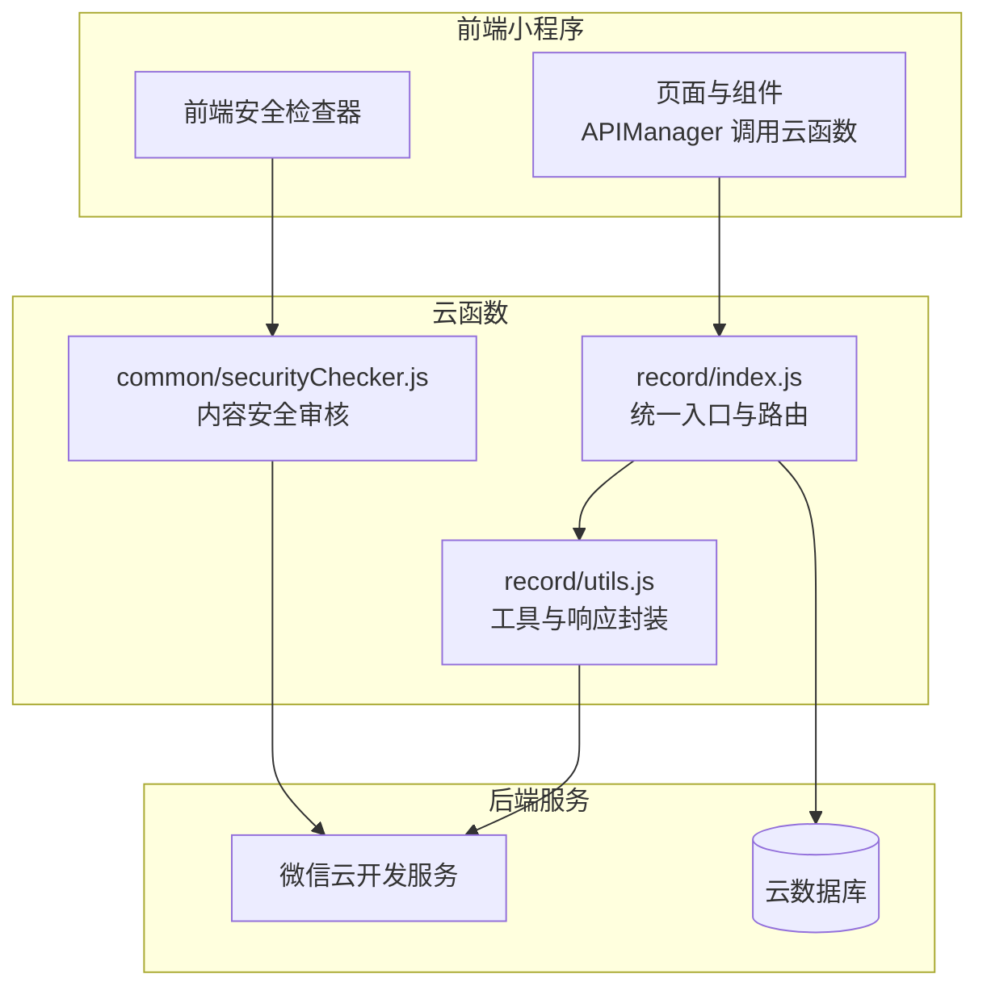
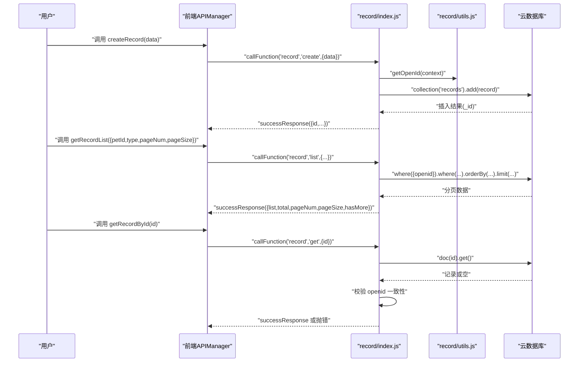
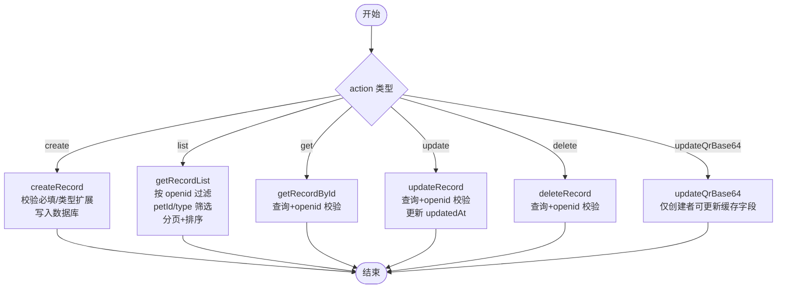
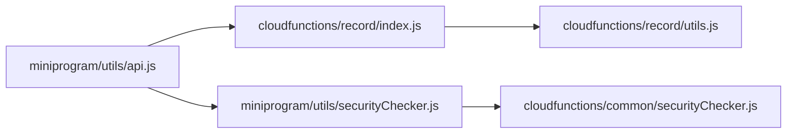

# 记录生命周期管理

<cite>
**本文引用的文件**
- [cloudfunctions/record/index.js](file://cloudfunctions/record/index.js)
- [cloudfunctions/record/utils.js](file://cloudfunctions/record/utils.js)
- [cloudfunctions/common/securityChecker.js](file://cloudfunctions/common/securityChecker.js)
- [miniprogram/utils/api.js](file://miniprogram/utils/api.js)
- [miniprogram/utils/securityChecker.js](file://miniprogram/utils/securityChecker.js)
- [cloudfunctions/record/config.json](file://cloudfunctions/record/config.json)
- [cloudfunctions/security/config.json](file://cloudfunctions/security/config.json)
</cite>

## 目录
1. [引言](#引言)
2. [项目结构](#项目结构)
3. [核心组件](#核心组件)
4. [架构总览](#架构总览)
5. [详细组件分析](#详细组件分析)
6. [依赖关系分析](#依赖关系分析)
7. [性能考虑](#性能考虑)
8. [故障排查指南](#故障排查指南)
9. [结论](#结论)

## 引言
本文件围绕“记录生命周期管理”主题，系统梳理从记录创建到删除的完整流程，覆盖数据验证、权限校验、状态变更、CRUD操作、分页与排序、搜索过滤、错误处理与异常策略等关键环节。同时结合前端调用链路与安全审核机制，给出可操作的最佳实践与排障建议。

## 项目结构
记录生命周期管理涉及三层协作：
- 前端小程序：负责用户交互、调用云函数、展示与提示
- 云函数 record：提供记录的 CRUD 与 QR 缓存更新能力，并执行基础权限校验
- 通用安全模块：提供内容安全审核能力，支撑图片/文本合规

图表来源
- [cloudfunctions/record/index.js:10-35](file://cloudfunctions/record/index.js#L10-L35)
- [cloudfunctions/record/utils.js:10-13](file://cloudfunctions/record/utils.js#L10-L13)
- [cloudfunctions/common/securityChecker.js:30-41](file://cloudfunctions/common/securityChecker.js#L30-L41)

章节来源
- [cloudfunctions/record/index.js:1-191](file://cloudfunctions/record/index.js#L1-L191)
- [cloudfunctions/record/utils.js:1-69](file://cloudfunctions/record/utils.js#L1-L69)
- [cloudfunctions/common/securityChecker.js:1-226](file://cloudfunctions/common/securityChecker.js#L1-L226)

## 核心组件
- 记录云函数：提供 create、list、get、update、delete、updateQrBase64 等操作；在写入与更新时自动维护时间戳；在读取时按 openid 进行跨用户数据隔离。
- 记录工具模块：统一封装数据库初始化、OpenID 获取、成功/失败响应、ID 规范化等。
- 前端 API 管理器：统一封装 wx.cloud.callFunction 调用，处理返回结果与网络异常，暴露 getRecordList、createRecord、deleteRecord 等便捷方法。
- 安全检查器：提供图片/文本安全审核能力，支持异步提交与日志记录，保障内容合规。

章节来源
- [cloudfunctions/record/index.js:10-35](file://cloudfunctions/record/index.js#L10-L35)
- [cloudfunctions/record/utils.js:15-18](file://cloudfunctions/record/utils.js#L15-L18)
- [cloudfunctions/record/utils.js:20-35](file://cloudfunctions/record/utils.js#L20-L35)
- [cloudfunctions/record/utils.js:46-57](file://cloudfunctions/record/utils.js#L46-L57)
- [miniprogram/utils/api.js:12-38](file://miniprogram/utils/api.js#L12-L38)
- [miniprogram/utils/api.js:86-96](file://miniprogram/utils/api.js#L86-L96)
- [cloudfunctions/common/securityChecker.js:30-41](file://cloudfunctions/common/securityChecker.js#L30-L41)

## 架构总览
记录生命周期的关键流程如下：
- 创建：前端调用 createRecord，云函数校验必填项，写入数据库并返回新记录 ID
- 查询：前端调用 getRecordList，云函数按 openid 过滤并支持 petId、type 筛选、分页与排序
- 详情：前端调用 getRecordById，云函数先查再校验 openid，确保跨用户隔离
- 更新：云函数先查后校验，仅允许记录创建者修改
- 删除：云函数先查后校验，仅允许记录创建者删除
- QR 缓存更新：仅允许记录创建者更新 qrBase64/urlLink 缓存字段

图表来源
- [cloudfunctions/record/index.js:10-35](file://cloudfunctions/record/index.js#L10-L35)
- [cloudfunctions/record/index.js:37-82](file://cloudfunctions/record/index.js#L37-L82)
- [cloudfunctions/record/index.js:84-111](file://cloudfunctions/record/index.js#L84-L111)
- [cloudfunctions/record/index.js:113-122](file://cloudfunctions/record/index.js#L113-L122)
- [cloudfunctions/record/utils.js:15-18](file://cloudfunctions/record/utils.js#L15-L18)

## 详细组件分析

### 记录云函数核心方法
- createRecord
  - 必填校验：petId 不能为空
  - 类型扩展：根据不同 type 追加对应字段（如产蛋、出苗、交配等）
  - 写入：包含 openid、createdAt、updatedAt
  - 返回：包含新生成的 id
- getRecordList
  - 过滤：始终按 openid 过滤，确保跨用户隔离
  - 搜索：支持 petId、type（排除“全部”）条件
  - 分页：pageSize/pageNum 计算 skip，按 createdAt 降序
  - 结果：返回 list、total、pageNum、pageSize、hasMore
- getRecordById
  - 权限：先查后校验 openid，不存在或非本人则报错
- updateRecord
  - 权限：先查后校验 openid，不存在或非本人则报错
  - 更新：除传入字段外，自动更新 updatedAt
- deleteRecord
  - 权限：先查后校验 openid，不存在或非本人则报错
- updateQrBase64
  - 仅允许记录创建者更新 qrBase64/urlLink
  - 若记录不存在则静默忽略（不抛错）

图表来源
- [cloudfunctions/record/index.js:14-35](file://cloudfunctions/record/index.js#L14-L35)
- [cloudfunctions/record/index.js:37-82](file://cloudfunctions/record/index.js#L37-L82)
- [cloudfunctions/record/index.js:84-111](file://cloudfunctions/record/index.js#L84-L111)
- [cloudfunctions/record/index.js:113-122](file://cloudfunctions/record/index.js#L113-L122)
- [cloudfunctions/record/index.js:124-144](file://cloudfunctions/record/index.js#L124-L144)
- [cloudfunctions/record/index.js:146-159](file://cloudfunctions/record/index.js#L146-L159)
- [cloudfunctions/record/index.js:161-190](file://cloudfunctions/record/index.js#L161-L190)

章节来源
- [cloudfunctions/record/index.js:37-82](file://cloudfunctions/record/index.js#L37-L82)
- [cloudfunctions/record/index.js:84-111](file://cloudfunctions/record/index.js#L84-L111)
- [cloudfunctions/record/index.js:113-122](file://cloudfunctions/record/index.js#L113-L122)
- [cloudfunctions/record/index.js:124-144](file://cloudfunctions/record/index.js#L124-L144)
- [cloudfunctions/record/index.js:146-159](file://cloudfunctions/record/index.js#L146-L159)
- [cloudfunctions/record/index.js:161-190](file://cloudfunctions/record/index.js#L161-L190)

### 权限控制与数据隔离
- openId 验证
  - 统一通过 getOpenId(context) 获取当前用户标识
  - 所有读写操作均以 openid 作为用户身份凭证
- 数据访问权限
  - 列表查询默认按 openid 过滤，确保用户只能看到自己的记录
  - 详情、更新、删除均先查询再校验 openid，防止越权访问
- 跨用户数据隔离
  - 通过 openid 字段天然隔离不同用户的数据
  - QR 缓存更新虽允许静默跳过不存在记录，但严格限制仅创建者可更新

章节来源
- [cloudfunctions/record/utils.js:15-18](file://cloudfunctions/record/utils.js#L15-L18)
- [cloudfunctions/record/index.js:84-89](file://cloudfunctions/record/index.js#L84-L89)
- [cloudfunctions/record/index.js:113-121](file://cloudfunctions/record/index.js#L113-L121)
- [cloudfunctions/record/index.js:127-134](file://cloudfunctions/record/index.js#L127-L134)
- [cloudfunctions/record/index.js:148-154](file://cloudfunctions/record/index.js#L148-L154)
- [cloudfunctions/record/index.js:175-178](file://cloudfunctions/record/index.js#L175-L178)

### CRUD 实现要点
- createRecord
  - 必填字段：petId
  - 可选字段：type、text、date、time、photos 等
  - 时间字段：createdAt/updatedAt 使用服务器时间
- getRecordList
  - 支持 petId、type（排除“全部”）过滤
  - 分页：pageSize 默认 20，pageNum 默认 1
  - 排序：按 createdAt 降序
- getRecordById
  - 返回前将 _id 规范化为 id
- updateRecord
  - 仅允许更新非主键字段，自动更新 updatedAt
- deleteRecord
  - 删除成功后返回成功消息
- updateQrBase64
  - 仅更新 qrBase64/urlLink 两个缓存字段

章节来源
- [cloudfunctions/record/index.js:37-82](file://cloudfunctions/record/index.js#L37-L82)
- [cloudfunctions/record/index.js:84-111](file://cloudfunctions/record/index.js#L84-L111)
- [cloudfunctions/record/index.js:113-122](file://cloudfunctions/record/index.js#L113-L122)
- [cloudfunctions/record/index.js:124-144](file://cloudfunctions/record/index.js#L124-L144)
- [cloudfunctions/record/index.js:146-159](file://cloudfunctions/record/index.js#L146-L159)
- [cloudfunctions/record/index.js:161-190](file://cloudfunctions/record/index.js#L161-L190)
- [cloudfunctions/record/utils.js:46-57](file://cloudfunctions/record/utils.js#L46-L57)

### 分页查询、排序与搜索过滤
- 分页
  - pageSize/pageNum 参数来自请求体
  - skip = (pageNum - 1) × pageSize
  - 返回 total、pageNum、pageSize、hasMore
- 排序
  - 默认按 createdAt 降序
- 过滤
  - openid 固定过滤
  - petId 可选
  - type 可选（排除“全部”）

章节来源
- [cloudfunctions/record/index.js:95-110](file://cloudfunctions/record/index.js#L95-L110)

### 错误处理与异常策略
- 云函数层
  - 统一 try/catch 包裹，捕获异常后返回 errorResponse
  - 对未知 action 返回“未知操作”
- 前端层
  - callCloudFunction 统一封装，区分 result.success 与 warning/message
  - 网络异常设置 cloudAvailable=false 并返回 useFallback 标记
- 典型异常场景
  - 记录不存在：查询为空或 openid 不匹配
  - 权限不足：非记录创建者尝试更新/删除
  - 参数错误：缺少 petId 等必填字段
  - 格式错误：类型转换失败（如整数解析）

章节来源
- [cloudfunctions/record/index.js:14-35](file://cloudfunctions/record/index.js#L14-L35)
- [cloudfunctions/record/index.js:38-40](file://cloudfunctions/record/index.js#L38-L40)
- [cloudfunctions/record/index.js:115-120](file://cloudfunctions/record/index.js#L115-L120)
- [cloudfunctions/record/index.js:129-134](file://cloudfunctions/record/index.js#L129-L134)
- [cloudfunctions/record/index.js:149-154](file://cloudfunctions/record/index.js#L149-L154)
- [miniprogram/utils/api.js:12-38](file://miniprogram/utils/api.js#L12-L38)

### 安全与合规
- 前端安全检查器
  - 封装对 security 云函数的调用，支持异步/同步审核
  - 提供 checkImage、checkImageSync、checkText、checkImages 方法
- 云函数安全检查器
  - 提供 checkFile/checkMedia/checkText/checkAndLog 等方法
  - 自动记录审核日志到 security_logs 集合
- 权限配置
  - record 云函数 config.json 开放权限为空
  - security 云函数开放 security.mediaCheckAsync/security.msgSecCheck

章节来源
- [miniprogram/utils/securityChecker.js:13-107](file://miniprogram/utils/securityChecker.js#L13-L107)
- [cloudfunctions/common/securityChecker.js:30-207](file://cloudfunctions/common/securityChecker.js#L30-L207)
- [cloudfunctions/record/config.json:1-5](file://cloudfunctions/record/config.json#L1-L5)
- [cloudfunctions/security/config.json:1-8](file://cloudfunctions/security/config.json#L1-L8)

## 依赖关系分析
- 前端 API 管理器依赖 record 云函数提供的 list/create/delete 等接口
- record 云函数依赖 utils.js 的数据库初始化、OpenID 获取与响应封装
- 安全检查器既可在前端调用，也可在云函数侧调用并落库

图表来源
- [miniprogram/utils/api.js:86-96](file://miniprogram/utils/api.js#L86-L96)
- [cloudfunctions/record/index.js:10-35](file://cloudfunctions/record/index.js#L10-L35)
- [cloudfunctions/record/utils.js:10-13](file://cloudfunctions/record/utils.js#L10-L13)
- [miniprogram/utils/securityChecker.js:22-41](file://miniprogram/utils/securityChecker.js#L22-L41)
- [cloudfunctions/common/securityChecker.js:51-64](file://cloudfunctions/common/securityChecker.js#L51-L64)

章节来源
- [miniprogram/utils/api.js:12-38](file://miniprogram/utils/api.js#L12-L38)
- [cloudfunctions/record/index.js:10-35](file://cloudfunctions/record/index.js#L10-L35)
- [cloudfunctions/record/utils.js:10-13](file://cloudfunctions/record/utils.js#L10-L13)
- [miniprogram/utils/securityChecker.js:13-107](file://miniprogram/utils/securityChecker.js#L13-L107)
- [cloudfunctions/common/securityChecker.js:30-64](file://cloudfunctions/common/securityChecker.js#L30-L64)

## 性能考虑
- 分页与排序
  - 使用 orderBy('createdAt','desc') 与 limit/skip 控制查询规模
  - 建议在 openid 与 type 上建立索引以提升过滤效率
- 写入优化
  - 批量写入时注意事务与幂等性，避免重复数据
- 审核异步化
  - 图片审核采用异步提交，减少前端阻塞
- 缓存字段
  - QR 缓存更新仅更新必要字段，降低写放大

## 故障排查指南
- 常见错误与定位
  - “记录不存在”：检查 id 是否正确、是否属于当前 openid
  - “权限不足”：确认调用者 openid 与记录 openid 是否一致
  - “未知操作”：检查前端 action 是否拼写正确
  - “网络错误”：查看前端 callCloudFunction 的 useFallback 标记
- 日志与追踪
  - 云函数层统一捕获异常并输出错误信息
  - 安全检查器会记录 trace_id 与审核日志，便于回溯
- 建议排查步骤
  1) 确认 openid 正确性与上下文环境
  2) 检查请求参数（petId、type、pageNum、pageSize 等）
  3) 查看数据库中是否存在该记录及 openid 字段
  4) 如涉及图片/文本审核，检查 security_logs 与 trace_id

章节来源
- [cloudfunctions/record/index.js:14-35](file://cloudfunctions/record/index.js#L14-L35)
- [cloudfunctions/record/index.js:115-120](file://cloudfunctions/record/index.js#L115-L120)
- [cloudfunctions/record/index.js:129-134](file://cloudfunctions/record/index.js#L129-L134)
- [cloudfunctions/record/index.js:149-154](file://cloudfunctions/record/index.js#L149-L154)
- [cloudfunctions/common/securityChecker.js:188-207](file://cloudfunctions/common/securityChecker.js#L188-L207)

## 结论
记录生命周期管理通过“前端统一调用 + 云函数权限校验 + 数据库规范化”的设计，实现了从创建到删除的闭环管理。配合分页、排序与过滤能力，以及安全审核与错误处理机制，整体具备良好的可维护性与安全性。建议后续在高并发场景下进一步完善索引策略与缓存设计，并持续监控安全审核日志以提升内容合规水平。