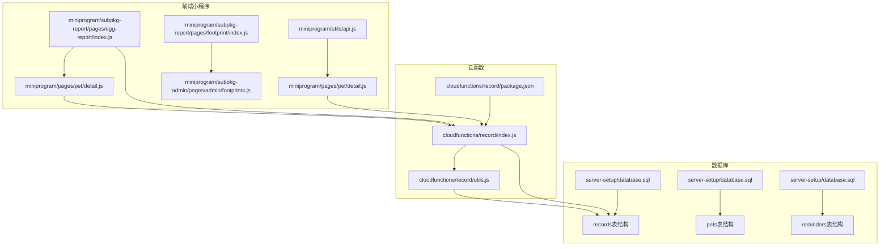
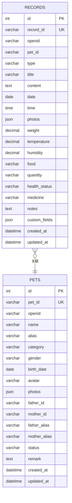
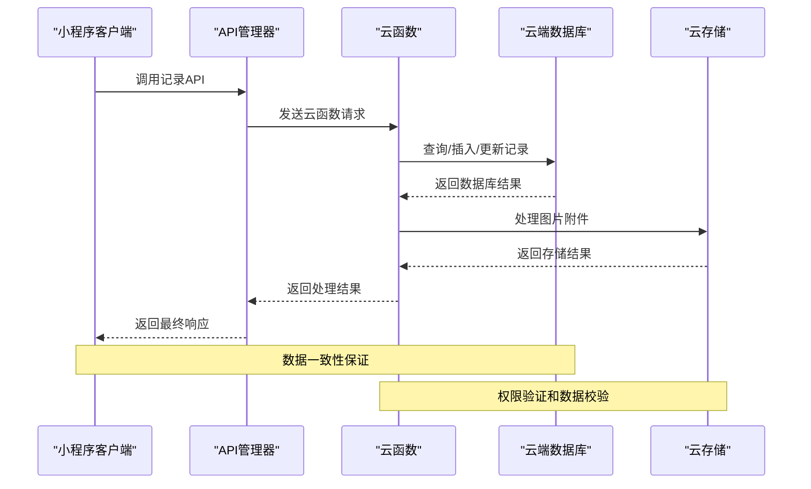
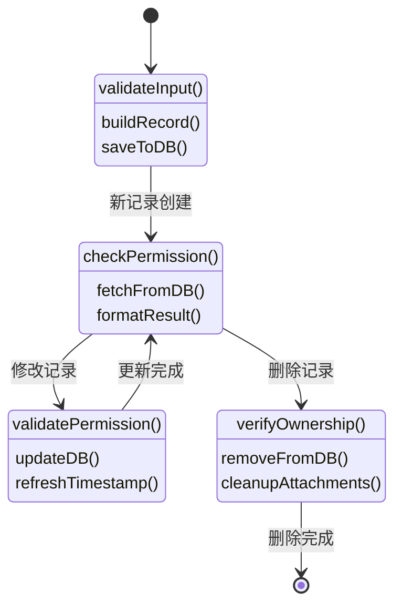
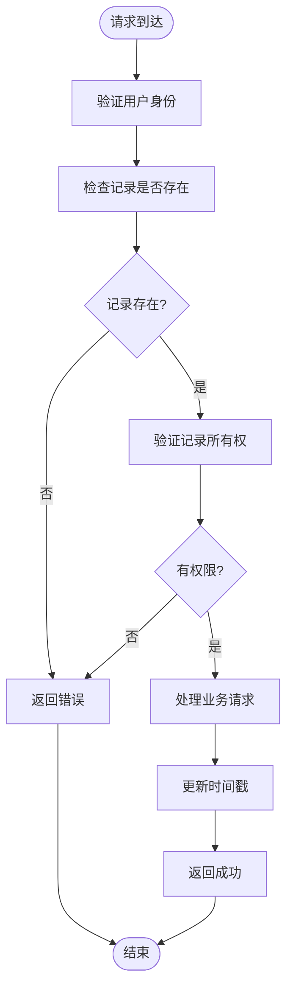
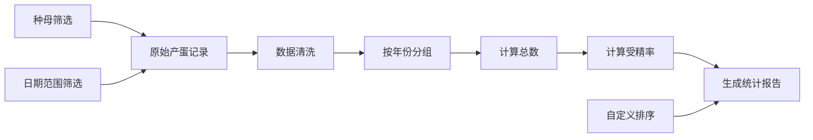
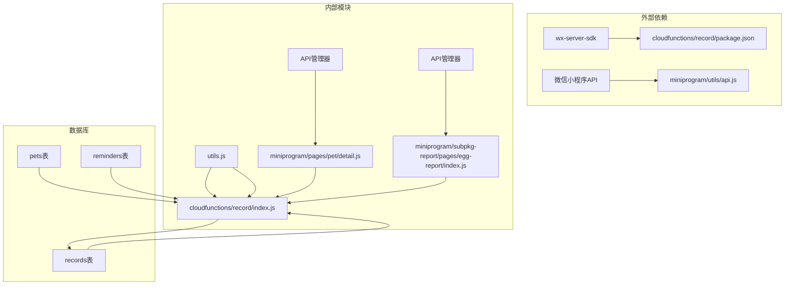

# 记录管理模块

<cite>
**本文档引用的文件**
- [cloudfunctions/record/index.js](file://cloudfunctions/record/index.js)
- [cloudfunctions/record/utils.js](file://cloudfunctions/record/utils.js)
- [cloudfunctions/record/package.json](file://cloudfunctions/record/package.json)
- [miniprogram/utils/api.js](file://miniprogram/utils/api.js)
- [miniprogram/pages/pet/detail.js](file://miniprogram/pages/pet/detail.js)
- [miniprogram/pages/pet/detail.wxml](file://miniprogram/pages/pet/detail.wxml)
- [miniprogram/subpkg-report/pages/egg-report/index.js](file://miniprogram/subpkg-report/pages/egg-report/index.js)
- [miniprogram/subpkg-report/pages/footprint/index.js](file://miniprogram/subpkg-report/pages/footprint/index.js)
- [miniprogram/subpkg-admin/pages/admin/footprints.js](file://miniprogram/subpkg-admin/pages/admin/footprints.js)
- [server-setup/database.sql](file://server-setup/database.sql)
</cite>

## 目录
1. [简介](#简介)
2. [项目结构](#项目结构)
3. [核心组件](#核心组件)
4. [架构概览](#架构概览)
5. [详细组件分析](#详细组件分析)
6. [依赖分析](#依赖分析)
7. [性能考虑](#性能考虑)
8. [故障排除指南](#故障排除指南)
9. [结论](#结论)
10. [附录](#附录)

## 简介

记录管理模块是"养龟档案"系统的核心功能之一，负责管理各类宠物健康记录、繁殖记录、日常观察记录等。该模块提供了完整的记录生命周期管理，包括创建、查询、更新、删除等操作，并支持多种记录类型和丰富的数据模型。

系统采用微信小程序云开发架构，前端通过云函数与云端数据库交互，实现了高性能、可扩展的记录管理功能。模块支持多类型记录管理，包括但不限于建档、交配、产蛋、出苗、健康观察等记录类型。

## 项目结构

记录管理模块主要分布在以下目录结构中：



**图表来源**
- [cloudfunctions/record/index.js:1-191](file://cloudfunctions/record/index.js#L1-L191)
- [miniprogram/utils/api.js:1-208](file://miniprogram/utils/api.js#L1-L208)
- [server-setup/database.sql:78-109](file://server-setup/database.sql#L78-L109)

**章节来源**
- [cloudfunctions/record/index.js:1-191](file://cloudfunctions/record/index.js#L1-L191)
- [miniprogram/utils/api.js:1-208](file://miniprogram/utils/api.js#L1-L208)
- [server-setup/database.sql:78-109](file://server-setup/database.sql#L78-L109)

## 核心组件

### 云函数服务

记录管理模块的核心是云函数服务，提供了完整的CRUD操作接口：

- **createRecord**: 创建新记录
- **getRecordList**: 获取记录列表
- **getRecordById**: 根据ID获取记录
- **updateRecord**: 更新记录
- **deleteRecord**: 删除记录
- **updateQrBase64**: 更新QR缓存字段

### 数据模型设计

系统支持多种记录类型，每种类型都有特定的数据字段：



**图表来源**
- [server-setup/database.sql:78-109](file://server-setup/database.sql#L78-L109)
- [server-setup/database.sql:50-76](file://server-setup/database.sql#L50-L76)

### 记录类型分类

系统支持以下记录类型：
- **建档**: 宠物基本信息记录
- **交配**: 繁殖配对记录
- **产蛋**: 产蛋情况记录
- **出苗**: 出苗统计记录
- **健康**: 健康观察记录
- **日常**: 日常观察记录

**章节来源**
- [cloudfunctions/record/index.js:42-82](file://cloudfunctions/record/index.js#L42-L82)
- [miniprogram/pages/pet/detail.js:85-95](file://miniprogram/pages/pet/detail.js#L85-L95)

## 架构概览

记录管理模块采用分层架构设计，实现了前后端分离和数据持久化：



**图表来源**
- [miniprogram/utils/api.js:12-38](file://miniprogram/utils/api.js#L12-L38)
- [cloudfunctions/record/index.js:10-35](file://cloudfunctions/record/index.js#L10-L35)

### 数据流处理

系统实现了完整的数据流处理机制：

1. **前端请求**: 小程序通过API管理器发起请求
2. **云函数处理**: 云函数接收请求并执行业务逻辑
3. **数据库操作**: 云函数与云端数据库交互
4. **存储处理**: 图片等附件存储到云存储
5. **结果返回**: 处理结果返回给前端

**章节来源**
- [cloudfunctions/record/index.js:10-35](file://cloudfunctions/record/index.js#L10-L35)
- [miniprogram/utils/api.js:12-38](file://miniprogram/utils/api.js#L12-L38)

## 详细组件分析

### 记录生命周期管理

记录的完整生命周期包括创建、查询、更新、删除四个阶段：



**图表来源**
- [cloudfunctions/record/index.js:37-82](file://cloudfunctions/record/index.js#L37-L82)
- [cloudfunctions/record/index.js:124-159](file://cloudfunctions/record/index.js#L124-L159)

#### 创建流程

记录创建过程包含输入验证、数据构建和持久化存储：

1. **输入验证**: 验证必需字段（如宠物ID）
2. **类型判断**: 根据记录类型添加特定字段
3. **数据构建**: 组装标准字段和类型特定字段
4. **持久化**: 保存到数据库并返回结果

#### 查询流程

记录查询支持多种筛选条件和分页功能：

1. **权限验证**: 确保用户只能访问自己的记录
2. **条件构建**: 根据参数构建查询条件
3. **分页处理**: 支持自定义页大小和页码
4. **结果格式化**: 统一返回格式

#### 更新流程

记录更新包含权限验证和数据同步：

1. **权限检查**: 验证记录所有权
2. **数据更新**: 执行数据库更新操作
3. **时间戳更新**: 自动更新修改时间

#### 删除流程

记录删除具有严格的权限控制：

1. **所有权验证**: 确认记录属于当前用户
2. **删除执行**: 从数据库中移除记录
3. **清理操作**: 清理相关资源

**章节来源**
- [cloudfunctions/record/index.js:37-82](file://cloudfunctions/record/index.js#L37-L82)
- [cloudfunctions/record/index.js:84-111](file://cloudfunctions/record/index.js#L84-L111)
- [cloudfunctions/record/index.js:124-159](file://cloudfunctions/record/index.js#L124-L159)

### 数据模型详解

#### 标准字段结构

所有记录都包含以下标准字段：

| 字段名 | 类型 | 描述 | 必需 |
|--------|------|------|------|
| petId | String | 宠物ID | 是 |
| type | String | 记录类型 | 是 |
| text | String | 记录内容 | 否 |
| date | Date | 记录日期 | 是 |
| time | Time | 记录时间 | 否 |
| openid | String | 用户OpenID | 是 |
| createdAt | DateTime | 创建时间 | 是 |
| updatedAt | DateTime | 更新时间 | 是 |

#### 类型特定字段

不同记录类型支持特定字段：

**产蛋记录 (type: '产蛋')**
- eggCount: 产蛋数量
- fertilizedCount: 受精蛋数量

**出苗记录 (type: '出苗')**
- hatchCount: 破壳数量
- gradeACount: 全品数量
- defectCount: 瑕疵数量

**交配记录 (type: '交配')**
- partnerId: 配对对象ID
- partnerName: 配对对象名称

**建档记录 (type: '建档')**
- photos: 图片附件列表

**章节来源**
- [cloudfunctions/record/index.js:53-75](file://cloudfunctions/record/index.js#L53-L75)

### 权限管理机制

系统实现了严格的权限控制机制：



**图表来源**
- [cloudfunctions/record/index.js:127-134](file://cloudfunctions/record/index.js#L127-L134)
- [cloudfunctions/record/index.js:146-154](file://cloudfunctions/record/index.js#L146-L154)

**章节来源**
- [cloudfunctions/record/index.js:127-154](file://cloudfunctions/record/index.js#L127-L154)

### 搜索和筛选功能

系统提供了灵活的搜索和筛选功能：

#### 基础筛选条件

| 参数名 | 类型 | 描述 | 默认值 |
|--------|------|------|--------|
| petId | String | 宠物ID | 无 |
| type | String | 记录类型 | 全部 |
| pageSize | Number | 每页数量 | 20 |
| pageNum | Number | 页码 | 1 |

#### 高级筛选功能

系统支持按日期范围、宠物类型、记录类型等多种条件进行筛选，为用户提供个性化的数据查看体验。

**章节来源**
- [cloudfunctions/record/index.js:84-111](file://cloudfunctions/record/index.js#L84-L111)

### 统计分析能力

系统具备强大的统计分析功能，特别是针对产蛋记录的专门分析：

#### 产蛋统计分析



**图表来源**
- [miniprogram/subpkg-report/pages/egg-report/index.js:261-367](file://miniprogram/subpkg-report/pages/egg-report/index.js#L261-L367)

#### 统计指标

系统提供以下关键统计指标：
- 总窝数 (totalNests)
- 总蛋数 (totalEggs)
- 受精窝数 (fertilizedNests)
- 受精蛋数 (fertilizedEggs)
- 受精率 (fertilizationRate)

**章节来源**
- [miniprogram/subpkg-report/pages/egg-report/index.js:261-367](file://miniprogram/subpkg-report/pages/egg-report/index.js#L261-L367)

### 扩展机制

系统设计了灵活的扩展机制，支持添加新的记录类型和自定义字段：

#### 新记录类型添加流程

1. **前端配置**: 在记录类型数组中添加新类型
2. **云函数支持**: 在创建函数中添加类型特定字段处理
3. **UI适配**: 更新界面显示和表单输入
4. **统计集成**: 添加相应的统计分析逻辑

#### 自定义字段支持

系统通过JSON字段支持自定义字段：
- custom_fields: JSON格式的自定义字段存储
- 支持动态添加和修改
- 不影响现有数据结构

**章节来源**
- [cloudfunctions/record/index.js:53-75](file://cloudfunctions/record/index.js#L53-L75)
- [server-setup/database.sql:99-99](file://server-setup/database.sql#L99-L99)

## 依赖分析

记录管理模块的依赖关系如下：



**图表来源**
- [cloudfunctions/record/package.json:6-8](file://cloudfunctions/record/package.json#L6-L8)
- [cloudfunctions/record/index.js:1-2](file://cloudfunctions/record/index.js#L1-L2)
- [miniprogram/utils/api.js:1-2](file://miniprogram/utils/api.js#L1-L2)

### 外部依赖

- **wx-server-sdk**: 微信云开发SDK，提供数据库和存储操作
- **微信小程序API**: 前端与云函数通信的基础

### 内部依赖

- **utils.js**: 提供数据库连接、权限验证、响应格式化等通用功能
- **API管理器**: 统一封装云函数调用，提供统一的API接口

**章节来源**
- [cloudfunctions/record/package.json:6-8](file://cloudfunctions/record/package.json#L6-L8)
- [cloudfunctions/record/utils.js:1-69](file://cloudfunctions/record/utils.js#L1-L69)

## 性能考虑

### 数据库优化

系统采用了多项数据库优化策略：

1. **索引优化**: 为常用查询字段建立索引
   - openid: 用户权限控制
   - pet_id: 宠物关联查询
   - type: 记录类型筛选
   - date: 日期范围查询
   - created_at: 时间排序

2. **分页查询**: 支持大数据量的分页显示
3. **批量操作**: 支持批量删除和更新操作

### 缓存策略

系统实现了多层次的缓存机制：

1. **本地缓存**: 小程序本地存储常用数据
2. **云函数缓存**: 云函数内部缓存数据库连接
3. **CDN加速**: 图片资源通过CDN加速

### 性能监控

系统提供了性能监控和错误处理机制：
- 网络异常自动降级
- 请求超时处理
- 错误日志记录

## 故障排除指南

### 常见问题及解决方案

#### 权限相关问题

**问题**: "记录不存在"
**原因**: 用户试图访问不属于自己的记录
**解决**: 检查openid匹配和记录所有权验证

**问题**: "更新失败，记录不存在或无权限"
**原因**: 记录ID无效或用户权限不足
**解决**: 验证记录ID有效性，确认用户登录状态

#### 数据库连接问题

**问题**: 云函数调用失败
**原因**: 网络连接不稳定或数据库服务异常
**解决**: 检查网络状态，重试请求，查看云函数日志

#### 图片上传问题

**问题**: 图片上传失败
**原因**: 文件格式不支持或大小超出限制
**解决**: 检查文件格式和大小，重新上传

**章节来源**
- [cloudfunctions/record/index.js:31-34](file://cloudfunctions/record/index.js#L31-L34)
- [cloudfunctions/record/index.js:127-134](file://cloudfunctions/record/index.js#L127-L134)

### 调试工具

系统提供了完善的调试工具：
- 控制台日志输出
- 错误堆栈跟踪
- 性能指标监控
- 网络请求追踪

## 结论

记录管理模块是一个功能完整、架构清晰的管理系统。它不仅满足了基本的记录管理需求，还提供了丰富的扩展能力和统计分析功能。模块的设计充分考虑了性能、安全性和用户体验，为"养龟档案"系统的长期发展奠定了坚实基础。

通过合理的数据模型设计、严格的权限控制和灵活的扩展机制，系统能够适应不断变化的业务需求，为用户提供优质的宠物档案管理服务。

## 附录

### API参考文档

#### 记录管理API

| 方法 | 功能 | 参数 | 返回值 |
|------|------|------|--------|
| createRecord | 创建记录 | record数据对象 | 记录ID和创建时间 |
| getRecordList | 获取记录列表 | petId, type, 分页参数 | 记录列表和分页信息 |
| getRecordById | 根据ID获取记录 | 记录ID | 单个记录详情 |
| updateRecord | 更新记录 | 记录ID和更新数据 | 更新状态 |
| deleteRecord | 删除记录 | 记录ID | 删除状态 |
| updateQrBase64 | 更新QR缓存 | 记录ID, QR数据 | 更新状态 |

#### 实际使用示例

**创建产蛋记录示例**
```javascript
// 前端调用
const result = await API.createRecord({
  petId: 'PET001',
  type: '产蛋',
  date: '2024-01-15',
  eggCount: 12,
  fertilizedCount: 8,
  text: '本次产蛋情况良好'
});
```

**查询记录示例**
```javascript
// 前端调用
const result = await API.getRecordList('PET001', '产蛋');
const records = result.data.list;
```

**章节来源**
- [miniprogram/utils/api.js:90-96](file://miniprogram/utils/api.js#L90-L96)
- [cloudfunctions/record/index.js:37-82](file://cloudfunctions/record/index.js#L37-L82)