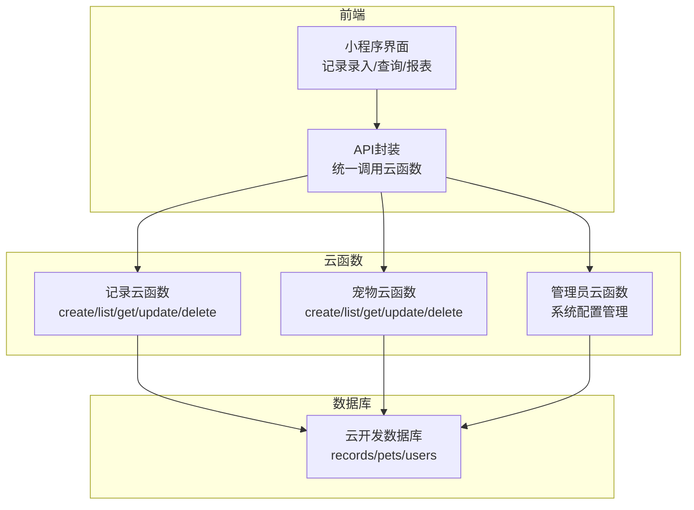
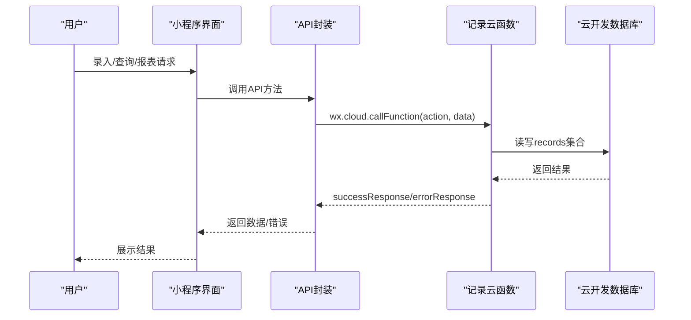
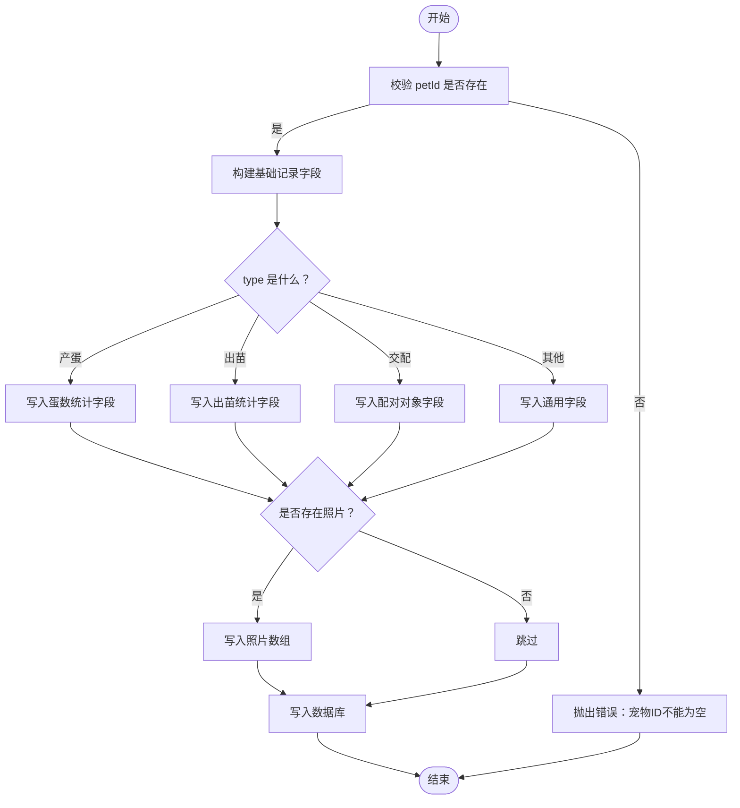
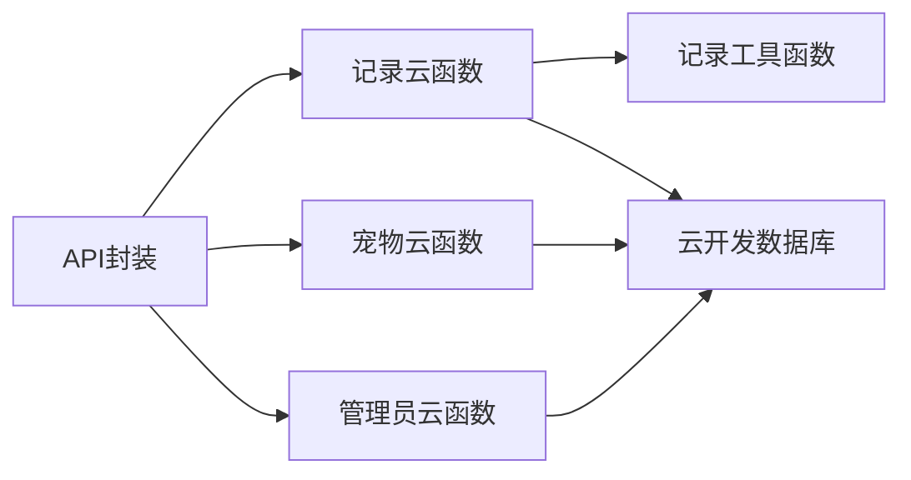
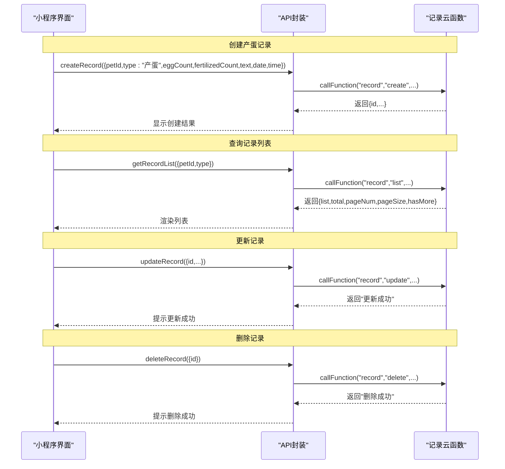

# 记录类型管理

<cite>
**本文引用的文件**
- [cloudfunctions/record/index.js](file://cloudfunctions/record/index.js)
- [cloudfunctions/record/utils.js](file://cloudfunctions/record/utils.js)
- [cloudfunctions/pet/index.js](file://cloudfunctions/pet/index.js)
- [miniprogram/utils/api.js](file://miniprogram/utils/api.js)
- [miniprogram/pages/pet/detail.js](file://miniprogram/pages/pet/detail.js)
- [miniprogram/subpkg-report/pages/egg-report/index.js](file://miniprogram/subpkg-report/pages/egg-report/index.js)
- [miniprogram/subpkg-report/pages/hatch-report/index.js](file://miniprogram/subpkg-report/pages/hatch-report/index.js)
- [cloudfunctions/admin/index.js](file://cloudfunctions/admin/index.js)
- [server-setup/database.sql](file://server-setup/database.sql)
</cite>

## 目录
1. [简介](#简介)
2. [项目结构](#项目结构)
3. [核心组件](#核心组件)
4. [架构总览](#架构总览)
5. [详细组件分析](#详细组件分析)
6. [依赖关系分析](#依赖关系分析)
7. [性能考量](#性能考量)
8. [故障排查指南](#故障排查指南)
9. [结论](#结论)
10. [附录](#附录)

## 简介
本文件系统性梳理“记录类型管理”的设计与实现，覆盖以下方面：
- 系统支持的记录类型及字段结构：日常观察、健康检查、产蛋记录、出苗记录、交配记录等
- 字段验证规则与数据约束条件
- 记录创建、查询、更新、删除的完整流程
- 记录类型的扩展机制与自定义字段模板配置
- 完整的API示例与调用序列图

## 项目结构
记录类型管理由云函数层、小程序前端API封装层与报表/打印组件协同构成，核心文件如下：
- 云函数：记录管理（record）、宠物管理（pet）、管理员（admin）
- 前端：API封装（api.js）、宠物详情页（detail.js）、产蛋报表（egg-report）、出苗报表（hatch-report）
- 数据库：records 表结构（含历史版本）

图表来源
- [cloudfunctions/record/index.js:10-35](file://cloudfunctions/record/index.js#L10-L35)
- [cloudfunctions/pet/index.js:45-82](file://cloudfunctions/pet/index.js#L45-L82)
- [cloudfunctions/admin/index.js:27-71](file://cloudfunctions/admin/index.js#L27-L71)

章节来源
- [cloudfunctions/record/index.js:10-35](file://cloudfunctions/record/index.js#L10-L35)
- [cloudfunctions/pet/index.js:45-82](file://cloudfunctions/pet/index.js#L45-L82)
- [cloudfunctions/admin/index.js:27-71](file://cloudfunctions/admin/index.js#L27-L71)

## 核心组件
- 记录云函数：负责记录的增删改查、类型特有字段处理、权限校验与分页
- 宠物云函数：负责宠物生命周期管理，与记录形成一对多关联
- API封装：统一调用云函数，屏蔽细节，提供易用接口
- 报表组件：产蛋报表、出苗报表，按类型聚合统计
- 管理员云函数：系统配置（如最大宠物数）影响记录创建约束

章节来源
- [cloudfunctions/record/index.js:37-82](file://cloudfunctions/record/index.js#L37-L82)
- [cloudfunctions/pet/index.js:84-138](file://cloudfunctions/pet/index.js#L84-L138)
- [miniprogram/utils/api.js:86-96](file://miniprogram/utils/api.js#L86-L96)
- [cloudfunctions/admin/index.js:475-508](file://cloudfunctions/admin/index.js#L475-L508)

## 架构总览
记录类型管理采用“云函数+前端API封装+报表组件”的分层架构，数据流如下：

图表来源
- [miniprogram/utils/api.js:12-38](file://miniprogram/utils/api.js#L12-L38)
- [cloudfunctions/record/index.js:10-35](file://cloudfunctions/record/index.js#L10-L35)

## 详细组件分析

### 记录类型与字段结构
系统支持的记录类型与特有字段如下：
- 日常观察：通用字段（文本、日期、时间、照片）
- 健康检查：通用字段（文本、日期、时间、照片）
- 产蛋记录：蛋数统计（总蛋数、受精蛋数）
- 出苗记录：出苗统计（总出芽数、全品数量、缺陷数量）
- 交配记录：配对信息（配对对象ID、配对对象名称）
- 建档/事件记录：可携带照片

字段约束与处理逻辑：
- 必填校验：创建时要求宠物ID存在
- 类型特有字段：按type分支处理（产蛋/出苗/交配）
- 权限校验：查询/更新/删除前验证openid一致性
- 分页查询：支持分页参数与总数统计
- QR缓存：支持静默更新记录的urlLink缓存字段

章节来源
- [cloudfunctions/record/index.js:37-82](file://cloudfunctions/record/index.js#L37-L82)
- [cloudfunctions/record/index.js:84-111](file://cloudfunctions/record/index.js#L84-L111)
- [cloudfunctions/record/index.js:113-122](file://cloudfunctions/record/index.js#L113-L122)
- [cloudfunctions/record/index.js:124-144](file://cloudfunctions/record/index.js#L124-L144)
- [cloudfunctions/record/index.js:146-159](file://cloudfunctions/record/index.js#L146-L159)
- [cloudfunctions/record/index.js:161-190](file://cloudfunctions/record/index.js#L161-L190)

### 记录创建流程
创建流程的关键步骤：
- 参数校验：必须提供petId
- 默认字段填充：type默认“日常”，时间戳自动写入
- 类型特有字段：根据type分支写入对应字段
- 照片字段：当存在时写入
- 返回新增记录ID与完整数据

图表来源
- [cloudfunctions/record/index.js:37-82](file://cloudfunctions/record/index.js#L37-L82)

章节来源
- [cloudfunctions/record/index.js:37-82](file://cloudfunctions/record/index.js#L37-L82)

### 记录查询与分页
- 支持按用户openid过滤
- 支持按petId过滤
- 支持按type过滤（“全部”表示不过滤）
- 支持分页：pageSize/pageNum
- 返回列表、总数、hasMore等

章节来源
- [cloudfunctions/record/index.js:84-111](file://cloudfunctions/record/index.js#L84-L111)

### 记录更新与删除
- 更新：先校验记录存在且openid一致，再更新字段并写入updatedAt
- 删除：先校验记录存在且openid一致，再删除
- QR缓存更新：静默更新urlLink字段（仅记录创建者可更新）

章节来源
- [cloudfunctions/record/index.js:124-144](file://cloudfunctions/record/index.js#L124-L144)
- [cloudfunctions/record/index.js:146-159](file://cloudfunctions/record/index.js#L146-L159)
- [cloudfunctions/record/index.js:161-190](file://cloudfunctions/record/index.js#L161-L190)

### 记录类型扩展机制
当前代码中，记录类型通过字符串type区分（如“产蛋”、“出苗”、“交配”）。扩展新类型的方式：
- 在前端界面增加type选项与对应字段输入
- 在记录云函数中为新type添加字段分支处理
- 在报表组件中增加对新type的统计与展示逻辑
- 如需持久化模板，可在系统配置或独立模板集合中维护字段定义（当前仓库未见专门的“记录模板”集合，建议新增）

章节来源
- [cloudfunctions/record/index.js:53-70](file://cloudfunctions/record/index.js#L53-L70)
- [miniprogram/pages/pet/detail.js:2090-2112](file://miniprogram/pages/pet/detail.js#L2090-L2112)

### 报表组件与统计
- 产蛋报表：按年份分组，统计总窝数、总蛋数、受精蛋数、受精率
- 出苗报表：按年份分组，统计总出芽数、全品数、缺陷数、全品率
- 支持按日期范围、种母筛选、排序方式（日期/产蛋数/受精率/全品率）等

章节来源
- [miniprogram/subpkg-report/pages/egg-report/index.js:177-367](file://miniprogram/subpkg-report/pages/egg-report/index.js#L177-L367)
- [miniprogram/subpkg-report/pages/hatch-report/index.js:145-367](file://miniprogram/subpkg-report/pages/hatch-report/index.js#L145-L367)

### 数据库结构与约束
- records 表：包含openid、pet_id、type、date、time、photos、权重、温度、湿度、食物、食量、健康状态、用药、备注、自定义字段等
- 约束：type字段用于区分记录类型；photo字段支持数组存储
- 历史版本：type字段在历史版本中包含egg/breeding/health/feeding/custom等枚举值

章节来源
- [server-setup/database.sql:78-109](file://server-setup/database.sql#L78-L109)

## 依赖关系分析
- 前端API封装依赖云函数：通过wx.cloud.callFunction统一调用
- 记录云函数依赖utils工具：统一响应格式、权限校验、ID规范化
- 宠物云函数与记录云函数相互配合：宠物删除时清理关联记录
- 管理员云函数提供系统配置：如最大宠物数，间接影响记录创建

图表来源
- [miniprogram/utils/api.js:12-38](file://miniprogram/utils/api.js#L12-L38)
- [cloudfunctions/record/utils.js:59-68](file://cloudfunctions/record/utils.js#L59-L68)
- [cloudfunctions/pet/index.js:233-250](file://cloudfunctions/pet/index.js#L233-L250)
- [cloudfunctions/admin/index.js:475-508](file://cloudfunctions/admin/index.js#L475-L508)

章节来源
- [miniprogram/utils/api.js:12-38](file://miniprogram/utils/api.js#L12-L38)
- [cloudfunctions/record/utils.js:59-68](file://cloudfunctions/record/utils.js#L59-L68)
- [cloudfunctions/pet/index.js:233-250](file://cloudfunctions/pet/index.js#L233-L250)
- [cloudfunctions/admin/index.js:475-508](file://cloudfunctions/admin/index.js#L475-L508)

## 性能考量
- 分页查询：记录列表查询支持分页，避免一次性拉取大量数据
- 权限前置校验：在更新/删除前先查询文档，减少无效写入
- QR缓存静默更新：避免阻塞主流程，提升用户体验
- 报表组件：云端查询失败时回退到本地缓存，保证可用性

章节来源
- [cloudfunctions/record/index.js:95-110](file://cloudfunctions/record/index.js#L95-L110)
- [cloudfunctions/record/index.js:146-159](file://cloudfunctions/record/index.js#L146-L159)
- [cloudfunctions/record/index.js:161-190](file://cloudfunctions/record/index.js#L161-L190)
- [miniprogram/subpkg-report/pages/egg-report/index.js:226-229](file://miniprogram/subpkg-report/pages/egg-report/index.js#L226-L229)
- [miniprogram/subpkg-report/pages/hatch-report/index.js:177-181](file://miniprogram/subpkg-report/pages/hatch-report/index.js#L177-L181)

## 故障排查指南
常见问题与定位要点：
- 创建失败：检查petId是否传入、type是否合法、照片数组格式是否正确
- 查询无数据：确认openid是否一致、是否设置了type过滤、分页参数是否合理
- 更新/删除失败：确认记录存在且openid一致
- QR缓存更新失败：确认记录创建者身份，urlLink格式是否为HTTPS

章节来源
- [cloudfunctions/record/index.js:37-40](file://cloudfunctions/record/index.js#L37-L40)
- [cloudfunctions/record/index.js:113-121](file://cloudfunctions/record/index.js#L113-L121)
- [cloudfunctions/record/index.js:124-134](file://cloudfunctions/record/index.js#L124-L134)
- [cloudfunctions/record/index.js:161-178](file://cloudfunctions/record/index.js#L161-L178)

## 结论
记录类型管理以云函数为核心，结合前端API封装与报表组件，实现了对日常观察、健康检查、产蛋、出苗、交配等记录类型的统一管理。通过类型特有字段处理、权限校验与分页查询，系统具备良好的扩展性与可用性。建议后续引入“记录模板”机制，以便更灵活地支持自定义字段与配置化管理。

## 附录

### API示例（调用序列）
以下为典型API调用序列，展示不同类型记录的创建、查询与更新操作。

图表来源
- [miniprogram/utils/api.js:86-96](file://miniprogram/utils/api.js#L86-L96)
- [cloudfunctions/record/index.js:10-35](file://cloudfunctions/record/index.js#L10-L35)