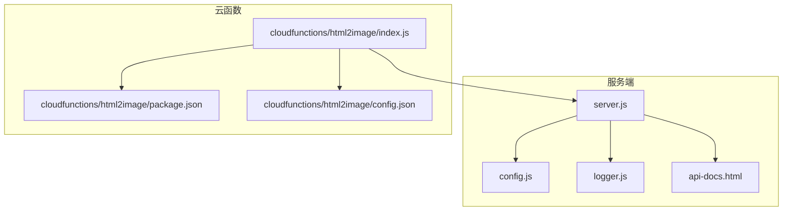
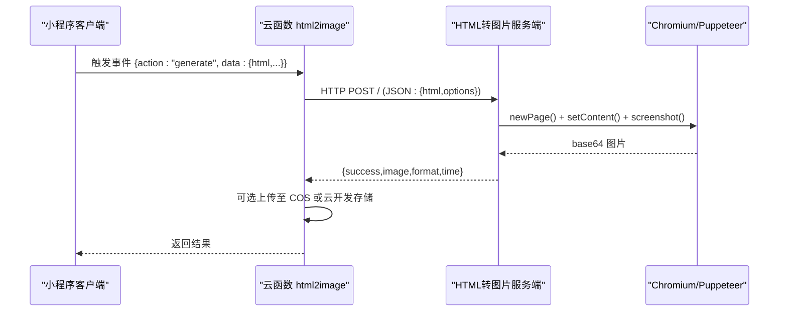
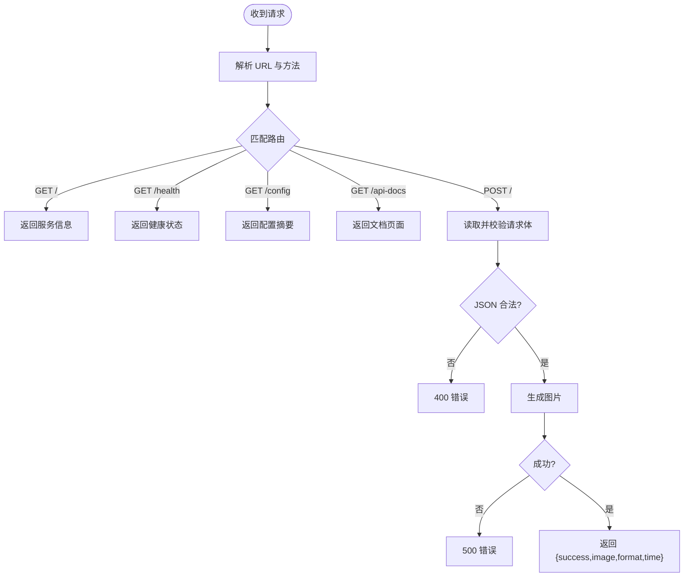
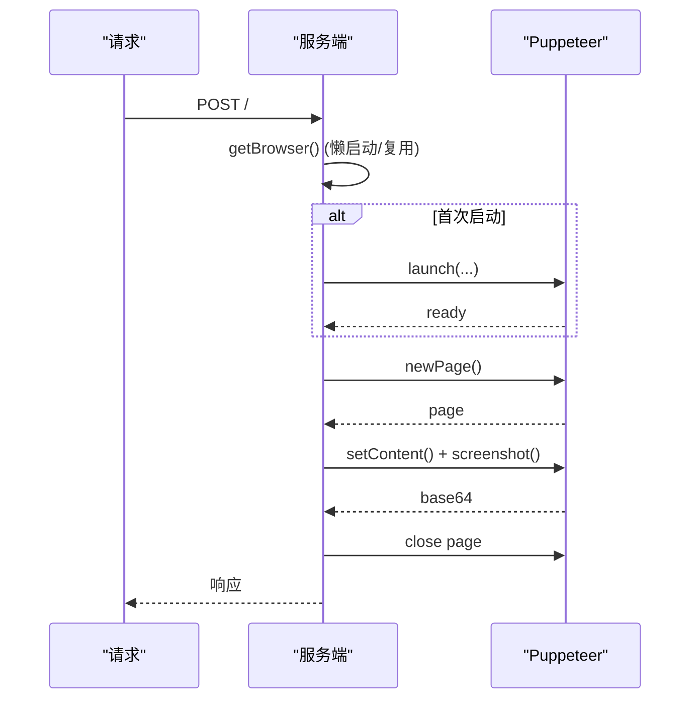
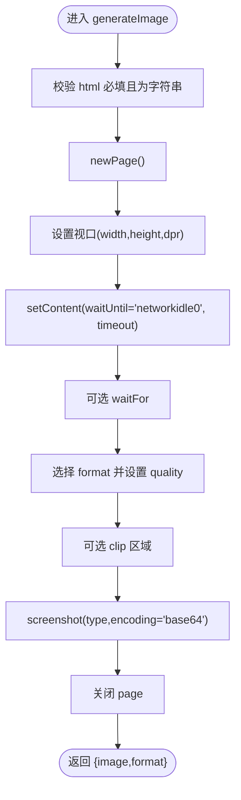
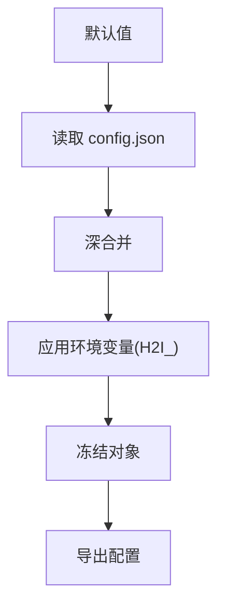
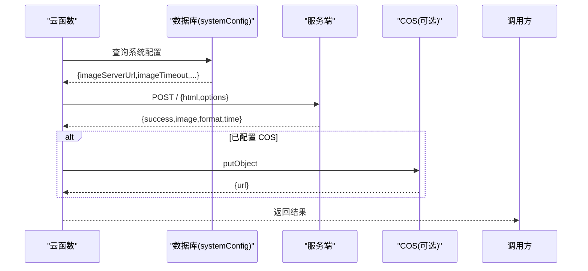
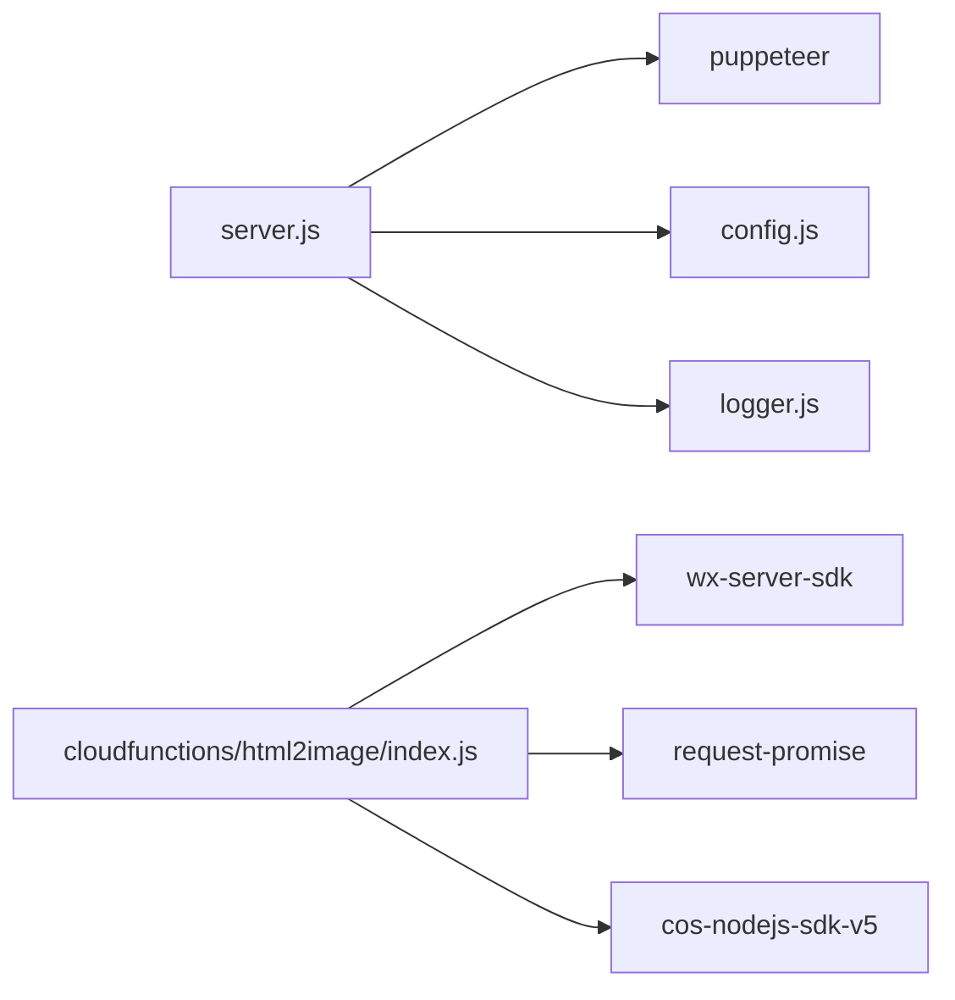

# HTML转图片服务

<cite>
**本文引用的文件**
- [server.js](file://html2image-server/server.js)
- [config.js](file://html2image-server/config.js)
- [logger.js](file://html2image-server/logger.js)
- [config-read.js](file://html2image-server/config-read.js)
- [package.json](file://html2image-server/package.json)
- [api-docs.html](file://html2image-server/api-docs.html)
- [start-server.sh](file://html2image-server/start-server.sh)
- [test.js](file://html2image-server/test.js)
- [index.js](file://cloudfunctions/html2image/index.js)
- [config.json](file://cloudfunctions/html2image/config.json)
- [package.json](file://cloudfunctions/html2image/package.json)
</cite>

## 目录
1. [引言](#引言)
2. [项目结构](#项目结构)
3. [核心组件](#核心组件)
4. [架构总览](#架构总览)
5. [详细组件分析](#详细组件分析)
6. [依赖关系分析](#依赖关系分析)
7. [性能考虑](#性能考虑)
8. [故障排除指南](#故障排除指南)
9. [结论](#结论)
10. [附录](#附录)

## 引言
本技术文档面向“HTML转图片服务”，系统性阐述基于 Puppeteer 与无头 Chromium 的 HTML 渲染架构，包括浏览器实例生命周期管理、内存优化与并发控制策略；RESTful API 设计与错误处理；配置系统（环境变量覆盖、运行时配置读取）；部署与运维（Docker 容器化建议、进程管理、监控）；性能优化与资源监控；以及与小程序云函数的集成方案与最佳实践。

## 项目结构
该仓库包含两部分关键能力：
- HTML 转图片服务端：基于 Node.js + HTTP + Puppeteer，提供 /、/health、/config、/api-docs 等接口，并支持将 HTML 渲染为 PNG/JPEG/WebP。
- 小程序云函数：封装调用服务端的逻辑，支持将生成的图片上传至云开发存储或腾讯云 COS。

图表来源
- [server.js:1-365](file://html2image-server/server.js#L1-L365)
- [config.js:1-268](file://html2image-server/config.js#L1-L268)
- [logger.js:1-95](file://html2image-server/logger.js#L1-L95)
- [api-docs.html:1-348](file://html2image-server/api-docs.html#L1-L348)
- [index.js:1-205](file://cloudfunctions/html2image/index.js#L1-L205)
- [package.json:1-12](file://cloudfunctions/html2image/package.json#L1-L12)
- [config.json:1-8](file://cloudfunctions/html2image/config.json#L1-L8)

章节来源
- [server.js:1-365](file://html2image-server/server.js#L1-L365)
- [config.js:1-268](file://html2image-server/config.js#L1-L268)
- [logger.js:1-95](file://html2image-server/logger.js#L1-L95)
- [api-docs.html:1-348](file://html2image-server/api-docs.html#L1-L348)
- [index.js:1-205](file://cloudfunctions/html2image/index.js#L1-L205)
- [package.json:1-12](file://cloudfunctions/html2image/package.json#L1-L12)
- [config.json:1-8](file://cloudfunctions/html2image/config.json#L1-L8)

## 核心组件
- HTTP 服务与路由：提供 /、/health、/config、/api-docs 与主接口 POST /。
- 浏览器实例管理：延迟启动、连接断开重连、超时保护。
- 渲染引擎：基于 Puppeteer 的页面创建、视口设置、内容注入、截图与裁剪。
- 日志系统：控制台与文件双通道，按天滚动。
- 配置系统：默认值、config.json 文件与环境变量（H2I_ 前缀）三层合并。
- 云函数集成：在云环境中发起 HTTP 请求到服务端，可选上传至 COS 或云开发存储。

章节来源
- [server.js:208-330](file://html2image-server/server.js#L208-L330)
- [config.js:27-74](file://html2image-server/config.js#L27-L74)
- [logger.js:1-95](file://html2image-server/logger.js#L1-L95)
- [index.js:14-27](file://cloudfunctions/html2image/index.js#L14-L27)

## 架构总览
整体采用“云函数侧发起请求 + 服务端渲染”的解耦架构。云函数负责业务编排与存储，服务端专注高性能渲染。

图表来源
- [index.js:66-140](file://cloudfunctions/html2image/index.js#L66-L140)
- [server.js:157-205](file://html2image-server/server.js#L157-L205)

## 详细组件分析

### 1) HTTP 服务与路由
- 支持的端点：
  - GET /：服务信息与引导
  - GET /health：健康检查（包含浏览器连接状态）
  - GET /config：只读配置摘要
  - GET /api-docs：API 文档页面
  - POST /：主接口，输入 HTML 与渲染选项，输出 base64 图片
- 请求体大小限制：默认 10MB，超出返回 413
- JSON 解析失败返回 400
- 其他异常统一返回 500

图表来源
- [server.js:208-330](file://html2image-server/server.js#L208-L330)

章节来源
- [server.js:208-330](file://html2image-server/server.js#L208-L330)
- [api-docs.html:128-270](file://html2image-server/api-docs.html#L128-L270)

### 2) 浏览器实例管理与并发控制
- 延迟启动：首次请求触发浏览器启动，避免常驻占用资源
- 连接断开重连：监听 disconnected 事件，下次请求重新启动
- 超时保护：启动超时与协议超时可配置
- 页面生命周期：每次请求新建 page 并在 finally 中关闭，避免泄漏
- 并发策略：单实例多页面模型，同一时间可承载多个请求；若需更高并发，可在上游做负载均衡或横向扩展实例

图表来源
- [server.js:65-113](file://html2image-server/server.js#L65-L113)
- [server.js:157-205](file://html2image-server/server.js#L157-L205)

章节来源
- [server.js:65-113](file://html2image-server/server.js#L65-L113)
- [server.js:157-205](file://html2image-server/server.js#L157-L205)

### 3) 渲染引擎与图像生成
- 视口与缩放：width、height、deviceScaleFactor 限制在合理区间
- 加载策略：waitUntil networkidle0，loadTimeout 可调
- 截图选项：format、quality、fullPage、clip 区域
- 输出：base64 字符串，便于直接传输或前端展示

图表来源
- [server.js:157-205](file://html2image-server/server.js#L157-L205)

章节来源
- [server.js:157-205](file://html2image-server/server.js#L157-L205)

### 4) 配置系统
- 配置来源优先级：环境变量（H2I_ 前缀）> config.json > 默认值
- 支持嵌套键名映射与驼峰键名匹配，双下划线表示键内的下划线
- 关键配置项：
  - server.host/port：监听地址与端口
  - browser.*：可执行路径、headless 模式、启动/协议超时、启动参数
  - rendering.*：默认视口、默认格式、默认质量、加载超时、整页截图默认开关
  - http.maxRequestBodyBytes：请求体大小限制
  - logging.*：日志目录与文件名
  - process.pidFile：PID 文件路径

图表来源
- [config.js:27-74](file://html2image-server/config.js#L27-L74)
- [config.js:145-156](file://html2image-server/config.js#L145-L156)
- [config.js:234-243](file://html2image-server/config.js#L234-L243)
- [config.js:249-264](file://html2image-server/config.js#L249-L264)

章节来源
- [config.js:1-268](file://html2image-server/config.js#L1-L268)
- [config-read.js:1-34](file://html2image-server/config-read.js#L1-L34)

### 5) 日志系统
- 控制台输出带颜色标识 INFO/WARN/ERROR/DEBUG
- 文件日志按天滚动，位于 logs/ 目录
- 提供请求开始/结束与浏览器事件的日志钩子

章节来源
- [logger.js:1-95](file://html2image-server/logger.js#L1-L95)

### 6) 云函数集成
- 云函数入口根据 action 分派：
  - generate：向服务端发起 POST 请求，支持整页截图、格式与质量等选项
  - getConfig：从数据库读取服务端地址、超时、COS 凭据等
  - uploadToCloud：上传 base64 到云开发存储
- 可选上传至腾讯云 COS，失败不影响主流程

图表来源
- [index.js:14-27](file://cloudfunctions/html2image/index.js#L14-L27)
- [index.js:66-140](file://cloudfunctions/html2image/index.js#L66-L140)
- [index.js:145-172](file://cloudfunctions/html2image/index.js#L145-L172)

章节来源
- [index.js:14-27](file://cloudfunctions/html2image/index.js#L14-L27)
- [index.js:66-140](file://cloudfunctions/html2image/index.js#L66-L140)
- [index.js:145-172](file://cloudfunctions/html2image/index.js#L145-L172)
- [config.json:1-8](file://cloudfunctions/html2image/config.json#L1-L8)
- [package.json:1-12](file://cloudfunctions/html2image/package.json#L1-L12)

## 依赖关系分析
- 服务端依赖 Puppeteer 作为渲染引擎，Node 内置模块提供 HTTP、文件系统与路径处理。
- 云函数依赖 wx-server-sdk、request-promise 与 cos-nodejs-sdk-v5，用于云环境调用与对象存储。

图表来源
- [package.json:1-26](file://html2image-server/package.json#L1-L26)
- [package.json:1-12](file://cloudfunctions/html2image/package.json#L1-L12)

章节来源
- [package.json:1-26](file://html2image-server/package.json#L1-L26)
- [package.json:1-12](file://cloudfunctions/html2image/package.json#L1-L12)

## 性能考虑
- 浏览器启动成本高，采用懒启动与连接断开重连策略，减少常驻开销。
- 限制请求体大小与渲染参数范围，避免资源滥用。
- 通过设备像素比与视口尺寸平衡清晰度与体积。
- 建议：
  - 在高并发场景下横向扩展服务端实例并在上游做负载均衡
  - 对外暴露只读配置接口，便于动态观测与排障
  - 使用健康检查接口接入存活探针与监控告警
  - 结合日志与响应耗时字段定位慢请求

[本节为通用性能指导，无需特定文件引用]

## 故障排除指南
- 健康检查失败：确认服务已启动、端口可达、浏览器可启动
- 浏览器启动超时：检查启动超时配置、系统可用内存、沙箱参数、可执行路径
- 渲染异常：检查 HTML 是否包含可访问的外部资源、等待时间是否足够、format/quality 设置是否合理
- 请求体过大：调整 http.maxRequestBodyBytes 或压缩输入
- 日志定位：查看 logs/ 下按日滚动的日志文件，结合请求开始/结束日志定位问题

章节来源
- [server.js:217-230](file://html2image-server/server.js#L217-L230)
- [logger.js:71-86](file://html2image-server/logger.js#L71-L86)

## 结论
该服务以最小依赖实现了稳定高效的 HTML 渲染能力，具备完善的配置体系与可观测性。通过云函数与服务端的解耦，既满足小程序侧的易用性，又能在服务端进行资源与性能的精细化控制。建议在生产环境配合负载均衡、监控告警与日志分析，持续优化渲染参数与资源访问策略。

[本节为总结性内容，无需特定文件引用]

## 附录

### A. API 接口定义与示例
- POST /
  - 请求体字段：html（必填）、options（可选）
  - options 支持：width、height、deviceScaleFactor、format、quality、fullPage、clip、waitFor、loadTimeout
  - 成功响应：{success:true,image,format,time}
  - 错误响应：{success:false,error}
- GET /health：返回 {success,status,browser,uptime,config}
- GET /config：返回当前生效配置摘要
- GET /：返回服务信息与引导

章节来源
- [api-docs.html:128-270](file://html2image-server/api-docs.html#L128-L270)
- [server.js:208-330](file://html2image-server/server.js#L208-L330)

### B. 配置覆盖与热更新
- 环境变量前缀：H2I_
- 嵌套层级用单下划线分隔，键内下划线用双下划线表示
- 优先级：环境变量 > config.json > 默认值
- 注意：config.json 修改后需重启服务生效；环境变量可在启动时传入

章节来源
- [config.js:4-20](file://html2image-server/config.js#L4-L20)
- [config.js:167-223](file://html2image-server/config.js#L167-L223)
- [config.js:234-243](file://html2image-server/config.js#L234-L243)
- [config-read.js:1-34](file://html2image-server/config-read.js#L1-L34)

### C. 部署与运维建议
- 启动与停止
  - Windows：双击 start-server.bat 或使用 stop-server.bat
  - Linux/macOS：chmod +x *.sh 后 ./start-server.sh，停止 ./stop-server.sh
  - 前台调试：node server.js，停止 node stop.js
- Docker 容器化建议
  - 基础镜像：官方 Node LTS slim
  - 安装 Chromium：apt-get install -y chromium-browser
  - 设置 Puppeteer 可执行路径指向系统 Chromium
  - 挂载 logs 目录持久化日志
  - 暴露端口与健康检查接口
- 进程管理与监控
  - 使用 systemd 或 PM2 管理进程，配置自动重启
  - 将 /health 接口接入存活探针与指标采集
  - 监控 CPU/内存/磁盘 IO，结合日志分析慢请求

章节来源
- [api-docs.html:272-294](file://html2image-server/api-docs.html#L272-L294)
- [start-server.sh:1-18](file://html2image-server/start-server.sh#L1-L18)

### D. 与小程序云函数集成最佳实践
- 在云函数中读取系统配置，动态决定服务端地址与超时
- 生成图片后可选上传至 COS 或云开发存储，失败不影响主流程
- 对外暴露只读配置接口，便于前端或管理端查询
- 保持云函数与服务端版本一致，避免接口差异导致的兼容问题

章节来源
- [index.js:14-27](file://cloudfunctions/html2image/index.js#L14-L27)
- [index.js:66-140](file://cloudfunctions/html2image/index.js#L66-L140)
- [index.js:145-172](file://cloudfunctions/html2image/index.js#L145-L172)