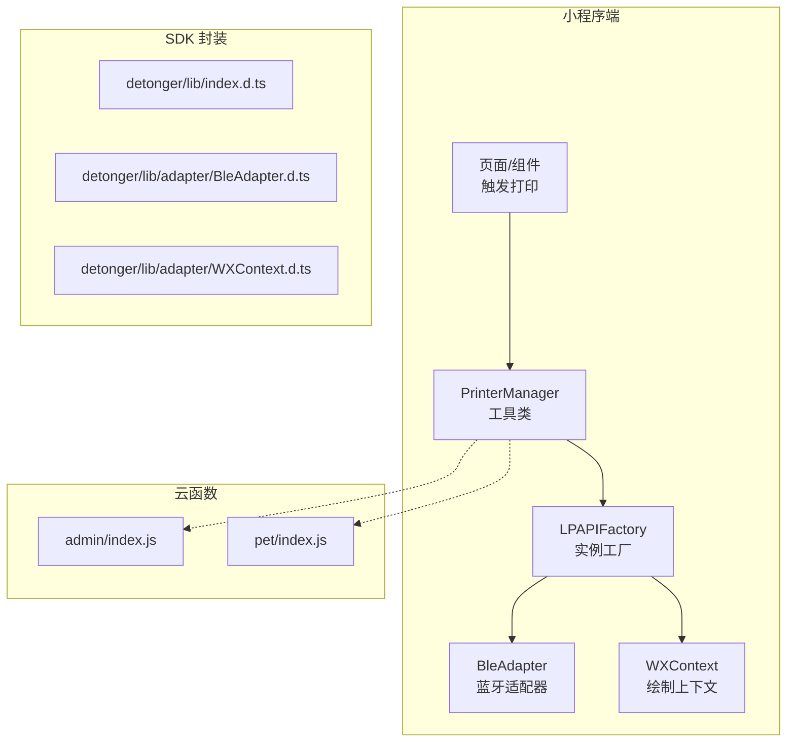
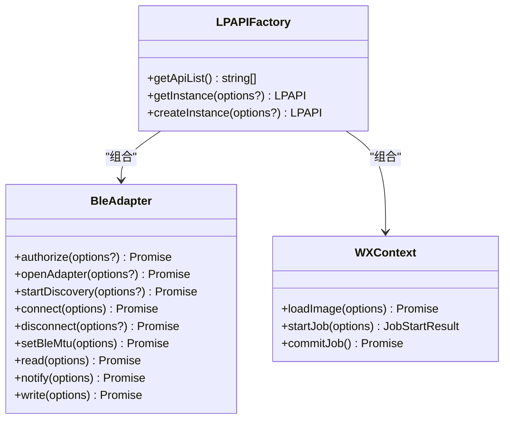
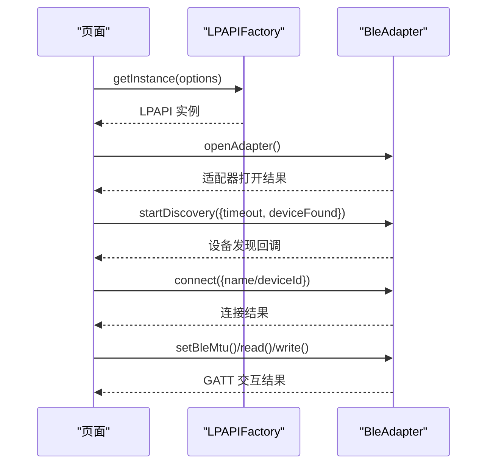
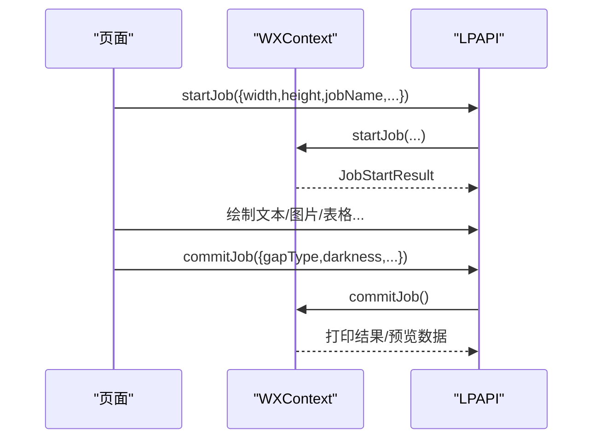
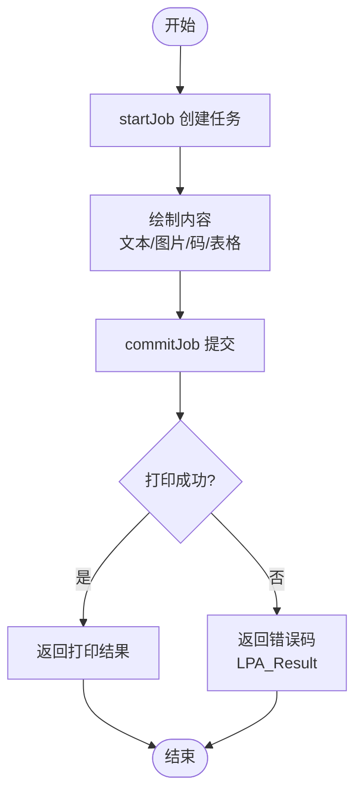
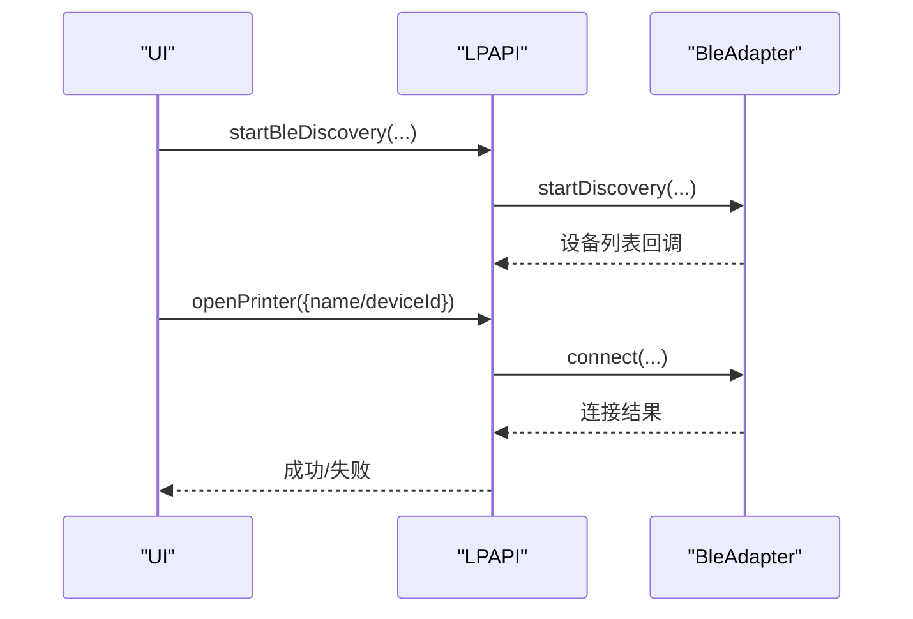
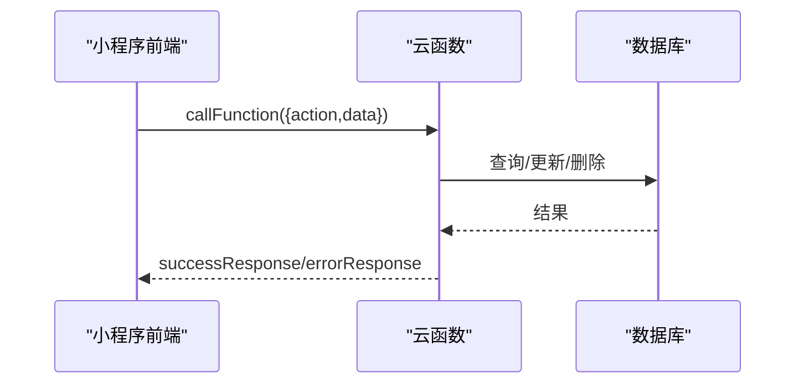
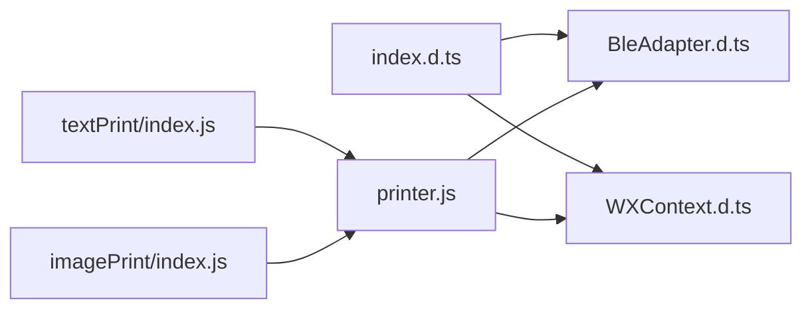

# 蓝牙打印机集成

<cite>
**本文引用的文件**
- [detonger/lib/index.d.ts](file://detonger/lib/index.d.ts)
- [miniprogram/lpapi/index.d.ts](file://miniprogram/lpapi/index.d.ts)
- [detonger/lib/adapter/BleAdapter.d.ts](file://detonger/lib/adapter/BleAdapter.d.ts)
- [detonger/lib/adapter/WXContext.d.ts](file://detonger/lib/adapter/WXContext.d.ts)
- [miniprogram/lpapi/adapter/BleAdapter.d.ts](file://miniprogram/lpapi/adapter/BleAdapter.d.ts)
- [miniprogram/lpapi/adapter/WXContext.d.ts](file://miniprogram/lpapi/adapter/WXContext.d.ts)
- [detonger/README.md](file://detonger/README.md)
- [detonger/test/lpapi-ble-test/pages/textPrint/index.js](file://detonger/test/lpapi-ble-test/pages/textPrint/index.js)
- [detonger/test/lpapi-ble-test/pages/imagePrint/index.js](file://detonger/test/lpapi-ble-test/pages/imagePrint/index.js)
- [miniprogram/utils/printer.js](file://miniprogram/utils/printer.js)
- [cloudfunctions/admin/index.js](file://cloudfunctions/admin/index.js)
- [cloudfunctions/pet/index.js](file://cloudfunctions/pet/index.js)
</cite>

## 目录
1. [简介](#简介)
2. [项目结构](#项目结构)
3. [核心组件](#核心组件)
4. [架构总览](#架构总览)
5. [详细组件分析](#详细组件分析)
6. [依赖关系分析](#依赖关系分析)
7. [性能考虑](#性能考虑)
8. [故障排除指南](#故障排除指南)
9. [结论](#结论)
10. [附录](#附录)

## 简介
本技术文档面向“蓝牙打印机集成”场景，聚焦于德佟印立方系列标签打印机的蓝牙打印能力，围绕 lpapi-ble-wx SDK 的架构设计与适配器模式展开，重点覆盖以下方面：
- 适配器模式：BleAdapter 蓝牙适配器与 WXContext 微信上下文适配
- 打印机发现、连接建立、打印任务生命周期与状态管理
- 类型定义与接口规范：打印参数、格式转换、错误码
- 打印模板设计、标签布局与多语言支持思路
- 与小程序云函数的协作模式与数据传输协议
- 故障排除、性能优化与扩展开发指导

## 项目结构
该项目采用“SDK 封装 + 示例页面 + 小程序工具 + 云函数”的分层组织方式：
- SDK 封装层：detonger/lib 与 miniprogram/lpapi 提供 LPAPIFactory、BleAdapter、WXContext 等核心类型与适配器
- 示例与测试：detonger/test/lpapi-ble-test 展示文本、图片、表格等打印场景
- 小程序工具：miniprogram/utils/printer.js 封装通用蓝牙打印管理逻辑
- 云函数：cloudfunctions/* 提供后台管理与业务数据服务

图表来源
- [detonger/lib/index.d.ts:1-19](file://detonger/lib/index.d.ts#L1-L19)
- [detonger/lib/adapter/BleAdapter.d.ts:1-59](file://detonger/lib/adapter/BleAdapter.d.ts#L1-L59)
- [detonger/lib/adapter/WXContext.d.ts:1-19](file://detonger/lib/adapter/WXContext.d.ts#L1-L19)
- [miniprogram/utils/printer.js:1-314](file://miniprogram/utils/printer.js#L1-L314)
- [cloudfunctions/admin/index.js:1-533](file://cloudfunctions/admin/index.js#L1-L533)
- [cloudfunctions/pet/index.js:1-723](file://cloudfunctions/pet/index.js#L1-L723)

章节来源
- [detonger/lib/index.d.ts:1-19](file://detonger/lib/index.d.ts#L1-L19)
- [detonger/lib/adapter/BleAdapter.d.ts:1-59](file://detonger/lib/adapter/BleAdapter.d.ts#L1-L59)
- [detonger/lib/adapter/WXContext.d.ts:1-19](file://detonger/lib/adapter/WXContext.d.ts#L1-L19)
- [miniprogram/lpapi/index.d.ts:1-19](file://miniprogram/lpapi/index.d.ts#L1-L19)
- [miniprogram/lpapi/adapter/BleAdapter.d.ts:1-59](file://miniprogram/lpapi/adapter/BleAdapter.d.ts#L1-L59)
- [miniprogram/lpapi/adapter/WXContext.d.ts:1-19](file://miniprogram/lpapi/adapter/WXContext.d.ts#L1-L19)
- [miniprogram/utils/printer.js:1-314](file://miniprogram/utils/printer.js#L1-L314)
- [detonger/README.md:1-901](file://detonger/README.md#L1-L901)

## 核心组件
- LPAPIFactory：提供 getInstance/createInstance 获取 LPAPI 实例，统一管理打印能力入口
- BleAdapter：封装微信小程序 BLE 能力，负责授权、适配器开关、设备发现、连接、GATT 读写、MTU 设置等
- WXContext：基于微信 Canvas 的绘制上下文，负责图像加载、作业开始与提交、预览与打印

章节来源
- [detonger/lib/index.d.ts:3-11](file://detonger/lib/index.d.ts#L3-L11)
- [miniprogram/lpapi/index.d.ts:3-11](file://miniprogram/lpapi/index.d.ts#L3-L11)
- [detonger/lib/adapter/BleAdapter.d.ts:6-57](file://detonger/lib/adapter/BleAdapter.d.ts#L6-L57)
- [miniprogram/lpapi/adapter/BleAdapter.d.ts:6-57](file://miniprogram/lpapi/adapter/BleAdapter.d.ts#L6-L57)
- [detonger/lib/adapter/WXContext.d.ts:5-18](file://detonger/lib/adapter/WXContext.d.ts#L5-L18)
- [miniprogram/lpapi/adapter/WXContext.d.ts:5-18](file://miniprogram/lpapi/adapter/WXContext.d.ts#L5-L18)

## 架构总览
SDK 采用“工厂 + 适配器 + 上下文”的分层设计：
- 工厂层：LPAPIFactory 统一对外暴露 LPAPI 能力
- 适配器层：BleAdapter 抽象蓝牙底层差异，屏蔽微信 BLE API 细节
- 上下文层：WXContext 抽象绘制与图像处理，统一输出为打印机可识别的指令/数据

图表来源
- [detonger/lib/index.d.ts:3-11](file://detonger/lib/index.d.ts#L3-L11)
- [detonger/lib/adapter/BleAdapter.d.ts:6-57](file://detonger/lib/adapter/BleAdapter.d.ts#L6-L57)
- [detonger/lib/adapter/WXContext.d.ts:5-18](file://detonger/lib/adapter/WXContext.d.ts#L5-L18)

## 详细组件分析

### BleAdapter 蓝牙适配器
职责与能力：
- 授权与适配器管理：authorize、openAdapter、closeAdapter、resetAdapter
- 设备发现与连接：startDiscovery、stopDiscovery、getFoundDevices、connect、disconnect、getConnectedBleDevices
- GATT 交互：getGATTServices、getGATTCharacteristics、read、notify、write
- MTU 设置：setBleMtu
- 事件与回调：连接状态变化、设备发现回调、适配器状态变化监听

图表来源
- [detonger/lib/adapter/BleAdapter.d.ts:37-56](file://detonger/lib/adapter/BleAdapter.d.ts#L37-L56)
- [miniprogram/lpapi/adapter/BleAdapter.d.ts:37-56](file://miniprogram/lpapi/adapter/BleAdapter.d.ts#L37-L56)

章节来源
- [detonger/lib/adapter/BleAdapter.d.ts:6-57](file://detonger/lib/adapter/BleAdapter.d.ts#L6-L57)
- [miniprogram/lpapi/adapter/BleAdapter.d.ts:6-57](file://miniprogram/lpapi/adapter/BleAdapter.d.ts#L6-L57)

### WXContext 微信绘制上下文
职责与能力：
- 通过 Canvas/DOM 创建离屏画布，支持微信 OffscreenCanvas
- 图像加载：loadImage 支持本地、网络、Base64
- 作业管理：startJob 创建打印任务，commitJob 结束并提交打印或生成预览

图表来源
- [detonger/lib/adapter/WXContext.d.ts:5-18](file://detonger/lib/adapter/WXContext.d.ts#L5-L18)
- [miniprogram/lpapi/adapter/WXContext.d.ts:5-18](file://miniprogram/lpapi/adapter/WXContext.d.ts#L5-L18)

章节来源
- [detonger/lib/adapter/WXContext.d.ts:5-18](file://detonger/lib/adapter/WXContext.d.ts#L5-L18)
- [miniprogram/lpapi/adapter/WXContext.d.ts:5-18](file://miniprogram/lpapi/adapter/WXContext.d.ts#L5-L18)

### 打印任务生命周期与状态管理
- 任务创建：startJob(width,height,jobName,...) 返回 JobStartResult，包含 canvas/context/isPreview/尺寸等
- 绘制阶段：drawText/drawImage/drawBarcode/drawQRCode/drawTable 等绘制接口
- 提交阶段：commitJob 触发打印或生成预览；返回 LPA_JobPrintResult，包含 statusCode、pages、previewData 等
- 状态码：LPA_Result 枚举涵盖参数、连接、通知、发送、接收、打印中、超时、任务创建/取消、图像获取等错误

图表来源
- [detonger/README.md:237-412](file://detonger/README.md#L237-L412)
- [detonger/README.md:186-206](file://detonger/README.md#L186-L206)

章节来源
- [detonger/README.md:237-412](file://detonger/README.md#L237-L412)
- [detonger/README.md:186-206](file://detonger/README.md#L186-L206)

### 打印机发现与连接流程
- 发现：startBleDiscovery(timeout, deviceFound, adapterStateChange)
- 选择与连接：openPrinter({name/deviceId,success,fail})
- 断开：closePrinter()

图表来源
- [detonger/test/lpapi-ble-test/pages/textPrint/index.js:152-223](file://detonger/test/lpapi-ble-test/pages/textPrint/index.js#L152-L223)
- [detonger/test/lpapi-ble-test/pages/imagePrint/index.js:137-208](file://detonger/test/lpapi-ble-test/pages/imagePrint/index.js#L137-L208)

章节来源
- [detonger/test/lpapi-ble-test/pages/textPrint/index.js:152-223](file://detonger/test/lpapi-ble-test/pages/textPrint/index.js#L152-L223)
- [detonger/test/lpapi-ble-test/pages/imagePrint/index.js:137-208](file://detonger/test/lpapi-ble-test/pages/imagePrint/index.js#L137-L208)

### 打印模板设计与标签布局
- 标签尺寸：startJob 中 width/height（毫米），orientation 支持 0/90/180/270
- 背景与预览：backgroundImage/backgroundColor 仅在预览任务生效
- 对齐与对齐组：setDrawContext 后的默认对齐；表格支持行列对齐与合并
- 多页打印：endPage/commitJob 支持多页，pages 数组返回每页结果

章节来源
- [detonger/README.md:240-298](file://detonger/README.md#L240-L298)
- [detonger/README.md:678-724](file://detonger/README.md#L678-L724)

### 多语言支持与国际化
- 文本绘制：drawText 支持 fontName、fontHeight、lineSpace、charSpace、autoReturn 等
- 建议：通过外部配置表维护多语言文案，按当前语言切换 fontName 与文本内容

（本节为概念性说明，无需代码来源）

### 与小程序云函数的协作模式
- 管理端：admin 云函数提供统计、用户/宠物/足迹管理、系统配置等
- 业务端：pet 云函数提供宠物增删改查、谱系查询、分类管理等
- 协作要点：小程序端通过 wx.cloud.callFunction 调用云函数，传递 action 与 data；云函数内部进行鉴权与数据库操作，返回统一的成功/失败响应

图表来源
- [cloudfunctions/admin/index.js:27-71](file://cloudfunctions/admin/index.js#L27-L71)
- [cloudfunctions/pet/index.js:45-82](file://cloudfunctions/pet/index.js#L45-L82)

章节来源
- [cloudfunctions/admin/index.js:27-71](file://cloudfunctions/admin/index.js#L27-L71)
- [cloudfunctions/pet/index.js:45-82](file://cloudfunctions/pet/index.js#L45-L82)

## 依赖关系分析
- 类型与接口：SDK 通过 index.d.ts 暴露 LPAPI、IBleAdapter、DrawContext 等类型，BleAdapter 与 WXContext 实现这些接口
- 小程序工具：PrinterManager 封装蓝牙扫描、连接、断开、自动连接、打印标签等通用逻辑
- 示例页面：textPrint/imagePrint 展示典型打印流程与参数配置

图表来源
- [detonger/lib/index.d.ts:1-19](file://detonger/lib/index.d.ts#L1-L19)
- [detonger/lib/adapter/BleAdapter.d.ts:1-59](file://detonger/lib/adapter/BleAdapter.d.ts#L1-L59)
- [detonger/lib/adapter/WXContext.d.ts:1-19](file://detonger/lib/adapter/WXContext.d.ts#L1-L19)
- [miniprogram/utils/printer.js:1-314](file://miniprogram/utils/printer.js#L1-L314)
- [detonger/test/lpapi-ble-test/pages/textPrint/index.js:1-399](file://detonger/test/lpapi-ble-test/pages/textPrint/index.js#L1-L399)
- [detonger/test/lpapi-ble-test/pages/imagePrint/index.js:1-347](file://detonger/test/lpapi-ble-test/pages/imagePrint/index.js#L1-L347)

章节来源
- [detonger/lib/index.d.ts:1-19](file://detonger/lib/index.d.ts#L1-L19)
- [miniprogram/lpapi/index.d.ts:1-19](file://miniprogram/lpapi/index.d.ts#L1-L19)
- [miniprogram/utils/printer.js:1-314](file://miniprogram/utils/printer.js#L1-L314)

## 性能考虑
- 调试模式：README 明确打印速度异常缓慢时可尝试关闭“调试模式”
- 蓝牙权限与定位：Android 需开启蓝牙/GPS 定位并授权；iOS 需蓝牙权限
- 日志级别：InitOptions 支持 showLog 控制日志输出，便于排查但会影响性能
- 图像加载：图片 URL 需等待异步加载完成后再 commitJob，避免预览/打印缺失
- MTU 设置：setBleMtu 可提升传输效率，需在连接后评估设备能力

章节来源
- [detonger/README.md:9-14](file://detonger/README.md#L9-L14)
- [detonger/README.md:725-796](file://detonger/README.md#L725-L796)
- [detonger/README.md:48-90](file://detonger/README.md#L48-L90)

## 故障排除指南
常见错误与处理：
- 未检测到打印机/未指定打印机：确认设备名称与 ID，检查 openPrinter 参数
- 未连接/连接失败：检查蓝牙适配器状态、权限与 discover 回调
- 数据通知启动失败/数据发送失败：检查 GATT 特征值、notify/write 流程
- 打印机正在打印中：避免并发打印，等待状态空闲
- 响应超时/任务创建失败：重试或检查设备状态与网络环境
- 图像获取失败：确保图片加载完成后再提交打印

章节来源
- [detonger/README.md:186-206](file://detonger/README.md#L186-L206)
- [detonger/README.md:349-372](file://detonger/README.md#L349-L372)
- [detonger/README.md:300-412](file://detonger/README.md#L300-L412)

## 结论
本项目通过 LPAPIFactory、BleAdapter 与 WXContext 的清晰分层，实现了对德佟印立方蓝牙打印机的稳定集成。结合小程序工具类与云函数，形成从前端打印控制到后台数据管理的完整闭环。遵循本文档的接口规范、流程与排错建议，可高效完成标签模板设计、打印任务管理与系统扩展。

## 附录

### 类型定义与接口规范摘要
- LPAPIFactory：getInstance/createInstance 获取 LPAPI 实例
- BleAdapter：授权、适配器、发现、连接、GATT、MTU、读写等
- WXContext：图像加载、作业开始与提交
- 错误码：LPA_Result 枚举覆盖参数、连接、通知、发送、接收、打印中、超时、任务创建/取消、图像获取等

章节来源
- [detonger/lib/index.d.ts:3-11](file://detonger/lib/index.d.ts#L3-L11)
- [detonger/lib/adapter/BleAdapter.d.ts:6-57](file://detonger/lib/adapter/BleAdapter.d.ts#L6-L57)
- [detonger/lib/adapter/WXContext.d.ts:5-18](file://detonger/lib/adapter/WXContext.d.ts#L5-L18)
- [detonger/README.md:186-206](file://detonger/README.md#L186-L206)