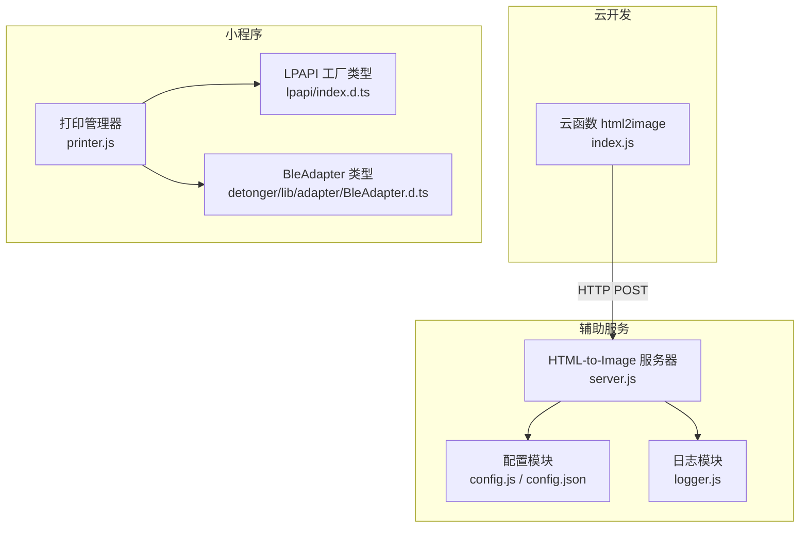
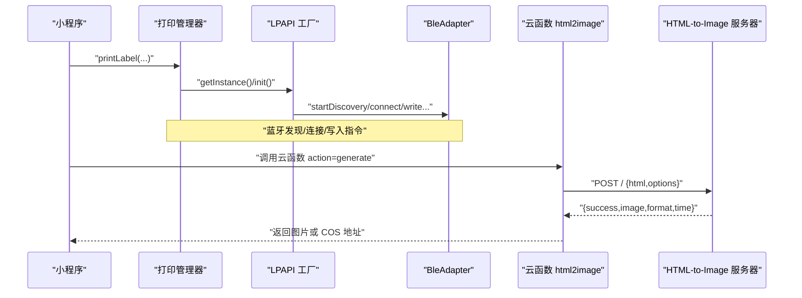
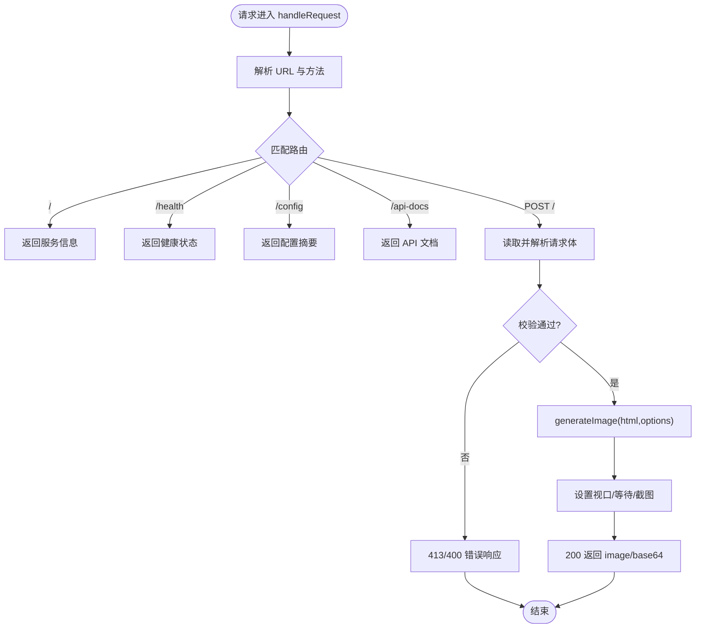
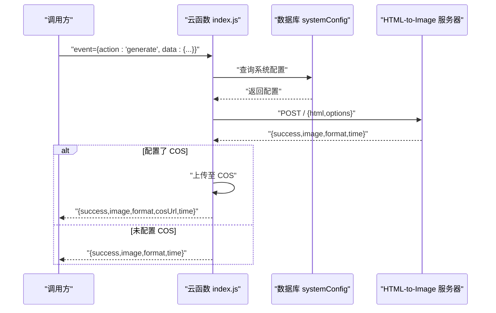
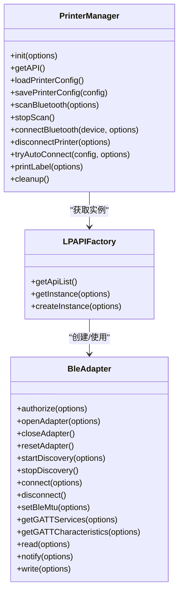
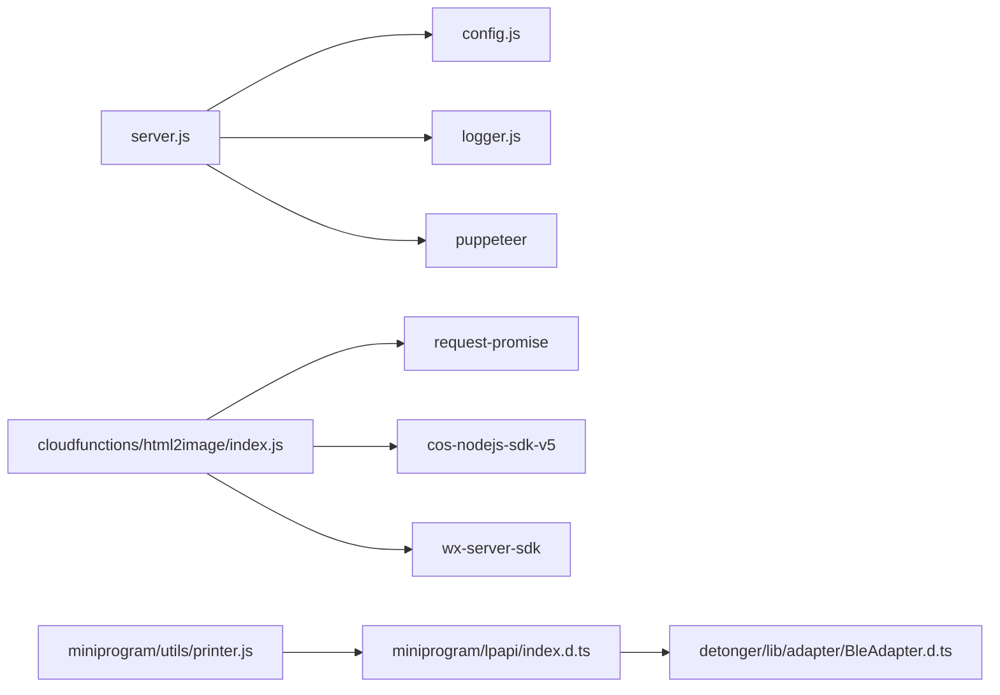

# 辅助服务

<cite>
**本文引用的文件**
- [html2image-server/server.js](file://html2image-server/server.js)
- [html2image-server/config.js](file://html2image-server/config.js)
- [html2image-server/config.json](file://html2image-server/config.json)
- [html2image-server/logger.js](file://html2image-server/logger.js)
- [html2image-server/package.json](file://html2image-server/package.json)
- [cloudfunctions/html2image/index.js](file://cloudfunctions/html2image/index.js)
- [cloudfunctions/html2image/package.json](file://cloudfunctions/html2image/package.json)
- [cloudfunctions/html2image/config.json](file://cloudfunctions/html2image/config.json)
- [miniprogram/utils/printer.js](file://miniprogram/utils/printer.js)
- [miniprogram/lpapi/index.d.ts](file://miniprogram/lpapi/index.d.ts)
- [detonger/lib/adapter/BleAdapter.d.ts](file://detonger/lib/adapter/BleAdapter.d.ts)
- [detonger/lib/index.d.ts](file://detonger/lib/index.d.ts)
- [html2image-server/start-server.sh](file://html2image-server/start-server.sh)
</cite>

## 目录
1. [引言](#引言)
2. [项目结构](#项目结构)
3. [核心组件](#核心组件)
4. [架构总览](#架构总览)
5. [组件详解](#组件详解)
6. [依赖关系分析](#依赖关系分析)
7. [性能考量](#性能考量)
8. [故障排查指南](#故障排查指南)
9. [结论](#结论)
10. [附录](#附录)

## 引言
本技术文档面向“养龟档案”项目的辅助服务，重点覆盖两大能力：
- HTML 转图片服务：基于 Puppeteer + 无头 Chromium 的 HTTP API，提供 PNG/JPEG/WebP 截图能力，支持视口、缩放、全页截图、裁剪与延迟等待等参数。
- 蓝牙打印机 SDK 集成：围绕德佟 P1 打印机，封装 LPAPI 适配器与小程序端的统一打印管理器，实现蓝牙发现、连接、自动重连、标签打印等流程。

文档同时给出部署配置、性能优化、故障处理、服务间通信协议、监控与日志、扩展性与高可用策略、开发与运维最佳实践。

## 项目结构
辅助服务涉及三个主要子系统：
- HTML 转图片服务（独立 Node 服务，提供 HTTP API）
- 云函数（云开发）桥接层，负责调用图片服务并可选上传至对象存储
- 小程序端蓝牙打印管理器，封装 LPAPI 与 BleAdapter，提供统一打印接口

图表来源
- [html2image-server/server.js:1-365](file://html2image-server/server.js#L1-L365)
- [html2image-server/config.js:1-268](file://html2image-server/config.js#L1-L268)
- [html2image-server/config.json:1-125](file://html2image-server/config.json#L1-L125)
- [html2image-server/logger.js:1-95](file://html2image-server/logger.js#L1-L95)
- [cloudfunctions/html2image/index.js:1-205](file://cloudfunctions/html2image/index.js#L1-L205)
- [miniprogram/utils/printer.js:1-314](file://miniprogram/utils/printer.js#L1-L314)
- [miniprogram/lpapi/index.d.ts:1-19](file://miniprogram/lpapi/index.d.ts#L1-L19)
- [detonger/lib/adapter/BleAdapter.d.ts:1-59](file://detonger/lib/adapter/BleAdapter.d.ts#L1-L59)

章节来源
- [html2image-server/server.js:1-365](file://html2image-server/server.js#L1-L365)
- [cloudfunctions/html2image/index.js:1-205](file://cloudfunctions/html2image/index.js#L1-L205)
- [miniprogram/utils/printer.js:1-314](file://miniprogram/utils/printer.js#L1-L314)

## 核心组件
- HTML-to-Image 服务器：提供 /、/health、/config、/api-docs 以及 POST / 的 HTTP 接口；内部通过 Puppeteer 启动 Chromium，按请求参数生成截图并返回 Base64。
- 配置系统：支持 config.json + 环境变量（H2I_ 前缀）+ 默认值三层合并，路径解析为绝对路径，冻结配置对象。
- 日志系统：控制台输出 + 按日期落盘，提供请求开始/结束与浏览器事件日志。
- 云函数桥接层：读取系统配置，调用图片服务，可选上传至腾讯云 COS 或云开发存储。
- 打印管理器：封装 LPAPI 与 BleAdapter，提供蓝牙扫描、连接、断开、自动连接、标签打印等统一接口。

章节来源
- [html2image-server/server.js:157-205](file://html2image-server/server.js#L157-L205)
- [html2image-server/config.js:27-74](file://html2image-server/config.js#L27-L74)
- [html2image-server/logger.js:64-95](file://html2image-server/logger.js#L64-L95)
- [cloudfunctions/html2image/index.js:66-140](file://cloudfunctions/html2image/index.js#L66-L140)
- [miniprogram/utils/printer.js:5-298](file://miniprogram/utils/printer.js#L5-L298)

## 架构总览
整体交互链路如下：
- 小程序端通过打印管理器发起打印任务，底层使用 LPAPI 与 BleAdapter 与打印机通信。
- 云函数根据系统配置调用 HTML-to-Image 服务器生成图片，必要时上传至对象存储。
- HTML-to-Image 服务器通过 Puppeteer 启动浏览器，渲染 HTML 并截图返回。

图表来源
- [miniprogram/utils/printer.js:228-287](file://miniprogram/utils/printer.js#L228-L287)
- [cloudfunctions/html2image/index.js:66-140](file://cloudfunctions/html2image/index.js#L66-L140)
- [html2image-server/server.js:276-318](file://html2image-server/server.js#L276-L318)

## 组件详解

### HTML-to-Image 服务器
- 启动与生命周期
  - 通过环境变量与配置文件合并得到最终配置，启动 HTTP 服务器并写入 PID 文件。
  - 支持 SIGTERM/SIGINT 优雅关闭，关闭浏览器实例并清理 PID 文件。
- 路由与接口
  - GET /：返回服务基本信息与可用路由。
  - GET /health：返回健康状态与运行时配置摘要。
  - GET /config：返回当前生效配置摘要。
  - GET /api-docs：返回 API 文档页面。
  - POST /：接收 JSON { html, options }，返回 { success, image, format, time }。
- 渲染与截图
  - 通过 getBrowser() 管理 Chromium 实例，支持自动重试与断线重连。
  - 支持视口尺寸、设备缩放、全页截图、裁剪区域、格式与质量、等待时长等参数。
  - 对请求体大小、JSON 解析、超时与异常进行严格校验与错误响应。
- 日志与可观测性
  - 提供请求开始/结束、HTTP 状态、浏览器事件等日志。
  - 日志按天落盘，便于问题定位。

图表来源
- [html2image-server/server.js:208-330](file://html2image-server/server.js#L208-L330)
- [html2image-server/server.js:157-205](file://html2image-server/server.js#L157-L205)

章节来源
- [html2image-server/server.js:1-365](file://html2image-server/server.js#L1-L365)
- [html2image-server/logger.js:1-95](file://html2image-server/logger.js#L1-L95)

### 配置系统
- 配置来源优先级：环境变量（H2I_ 前缀）> config.json > 默认值。
- 支持嵌套键名（下划线分隔，双下划线表示字面量下划线），大小写不敏感匹配。
- 路径类字段（日志目录、PID 文件）自动解析为绝对路径；配置对象被冻结，防止运行时篡改。
- 关键配置项包括：服务器监听地址/端口、浏览器启动参数与超时、默认视口与渲染参数、HTTP 请求体上限等。

章节来源
- [html2image-server/config.js:1-268](file://html2image-server/config.js#L1-L268)
- [html2image-server/config.json:1-125](file://html2image-server/config.json#L1-L125)

### 日志系统
- 控制台输出带颜色标识（INFO/WARN/ERROR/DEBUG）。
- 日志文件按日期命名，每日轮换，异常写入忽略，避免影响主流程。
- 提供请求生命周期日志与浏览器事件日志，便于追踪问题。

章节来源
- [html2image-server/logger.js:1-95](file://html2image-server/logger.js#L1-L95)

### 云函数桥接层（html2image）
- 主要职责
  - 读取系统配置（图片服务地址、超时、COS 凭证与桶信息）。
  - 调用 HTML-to-Image 服务器生成图片，支持上传至腾讯云 COS 或云开发存储。
- 关键行为
  - 读取数据库集合 systemConfig 获取配置，回退到默认值。
  - 调用外部服务时设置合理超时，失败时返回结构化错误。
  - 上传 COS 失败不影响主流程，继续返回本地生成结果。

图表来源
- [cloudfunctions/html2image/index.js:14-27](file://cloudfunctions/html2image/index.js#L14-L27)
- [cloudfunctions/html2image/index.js:32-55](file://cloudfunctions/html2image/index.js#L32-L55)
- [cloudfunctions/html2image/index.js:66-140](file://cloudfunctions/html2image/index.js#L66-L140)

章节来源
- [cloudfunctions/html2image/index.js:1-205](file://cloudfunctions/html2image/index.js#L1-L205)
- [cloudfunctions/html2image/package.json:1-12](file://cloudfunctions/html2image/package.json#L1-L12)
- [cloudfunctions/html2image/config.json:1-8](file://cloudfunctions/html2image/config.json#L1-L8)

### 蓝牙打印机 SDK 集成
- 打印管理器（PrinterManager）
  - 初始化 LPAPI 工厂，封装蓝牙扫描、连接、断开、自动连接、标签打印等。
  - 统一配置持久化（本地存储），支持自动连接失败次数限制。
- LPAPI 与 BleAdapter
  - LPAPI 工厂类型导出 getInstance/createInstance 与若干 define* 工具。
  - BleAdapter 类型定义了蓝牙适配器的生命周期、发现、连接、读写、MTU 设置等接口。
- 打印流程
  - 创建打印任务（指定尺寸与间隙类型），绘制二维码与文本，提交任务并处理结果。

图表来源
- [miniprogram/utils/printer.js:5-298](file://miniprogram/utils/printer.js#L5-L298)
- [miniprogram/lpapi/index.d.ts:3-11](file://miniprogram/lpapi/index.d.ts#L3-L11)
- [detonger/lib/adapter/BleAdapter.d.ts:6-57](file://detonger/lib/adapter/BleAdapter.d.ts#L6-L57)

章节来源
- [miniprogram/utils/printer.js:1-314](file://miniprogram/utils/printer.js#L1-L314)
- [miniprogram/lpapi/index.d.ts:1-19](file://miniprogram/lpapi/index.d.ts#L1-L19)
- [detonger/lib/adapter/BleAdapter.d.ts:1-59](file://detonger/lib/adapter/BleAdapter.d.ts#L1-L59)

## 依赖关系分析
- HTML-to-Image 服务器
  - 依赖：puppeteer（无头浏览器）、内置 http/fs/path 模块、自定义 logger。
  - 配置来源：config.js 读取 config.json 并合并环境变量。
- 云函数
  - 依赖：wx-server-sdk、request-promise、cos-nodejs-sdk-v5。
  - 通过数据库 systemConfig 获取图片服务地址与上传配置。
- 小程序
  - 依赖：lpapi-ble（通过工厂与适配器访问蓝牙与打印）。

图表来源
- [html2image-server/server.js:9-14](file://html2image-server/server.js#L9-L14)
- [html2image-server/config.js:22-26](file://html2image-server/config.js#L22-L26)
- [cloudfunctions/html2image/index.js:1-10](file://cloudfunctions/html2image/index.js#L1-L10)
- [miniprogram/utils/printer.js:17-21](file://miniprogram/utils/printer.js#L17-L21)

章节来源
- [html2image-server/package.json:22-24](file://html2image-server/package.json#L22-L24)
- [cloudfunctions/html2image/package.json:6-11](file://cloudfunctions/html2image/package.json#L6-L11)

## 性能考量
- 浏览器与渲染
  - 使用无头模式降低内存占用；通过 deviceScaleFactor 平衡清晰度与性能。
  - 合理设置 loadTimeoutMs 与 waitFor，避免长时间等待导致资源占用。
  - 视口过大或全页截图会显著增加内存与 CPU 开销，建议按需开启 fullPage。
- 请求与并发
  - 限制请求体大小，防止超大 HTML 导致内存压力。
  - 在容器/无 GUI 环境使用沙箱禁用参数，确保稳定性。
- 云函数与网络
  - 为外部图片服务调用设置合理超时，避免阻塞。
  - 上传 COS 失败不影响主流程，但应记录错误以便后续重试或告警。
- 日志与磁盘
  - 按天落盘减少单文件体积；生产环境建议外置日志卷并定期清理。

[本节为通用指导，无需列出章节来源]

## 故障排查指南
- 服务器无法启动/端口占用
  - 检查 config.json 中 server.host/port 与防火墙；确认未被占用。
  - 查看 logs 目录下当天日志文件，关注启动阶段错误。
- 浏览器启动失败/超时
  - 检查 H2I_BROWSER__EXECUTABLE_PATH 与 H2I_BROWSER__HEADLESS 配置。
  - 增大 H2I_BROWSER__LAUNCH_TIMEOUT_MS 与 H2I_BROWSER__PROTOCOL_TIMEOUT_MS。
- 渲染失败/空白图
  - 检查 HTML 内容与外部资源加载情况，适当增大 H2I_RENDERING__LOAD_TIMEOUT_MS。
  - 使用 /health 与 /config 接口核对运行时配置。
- 云函数调用失败
  - 核对 systemConfig 中 imageServerUrl 与 imageTimeout。
  - 检查 COS 凭证与桶配置，确认网络可达。
- 打印异常
  - 确认蓝牙适配器已打开、设备已连接；查看打印管理器回调与日志。
  - 若自动连接失败多次，检查 connectFailCount 与设备权限。

章节来源
- [html2image-server/config.js:234-243](file://html2image-server/config.js#L234-L243)
- [cloudfunctions/html2image/index.js:32-55](file://cloudfunctions/html2image/index.js#L32-L55)
- [miniprogram/utils/printer.js:172-215](file://miniprogram/utils/printer.js#L172-L215)

## 结论
本辅助服务通过“云函数桥接 + 专用图片服务 + 小程序蓝牙打印”的组合，实现了稳定、可扩展的图片生成与打印能力。HTML-to-Image 服务器采用 Puppeteer 与无头 Chromium，具备良好的兼容性与可控的性能；云函数层提供灵活的配置与可选的对象存储上传；小程序端通过 LPAPI 与 BleAdapter 抽象蓝牙细节，简化了打印流程。建议在生产环境中结合日志与监控，持续优化渲染参数与超时策略，并建立完善的告警与回滚机制。

[本节为总结性内容，无需列出章节来源]

## 附录

### 服务间通信协议与数据格式
- HTML-to-Image 服务器
  - 方法与路径
    - GET /：返回服务元信息与可用路由。
    - GET /health：返回健康状态与配置摘要。
    - GET /config：返回当前生效配置摘要。
    - GET /api-docs：返回 API 文档。
    - POST /：请求体 JSON { html, options }，响应 JSON { success, image, format, time }。
  - 请求体限制：受 H2I_HTTP__MAX_REQUEST_BODY_BYTES 控制。
  - 响应头：application/json; charset=utf-8。
- 云函数桥接层
  - 事件结构：{ action, data }。
  - action 可选：generate、getConfig、uploadToCloud。
  - generate 输入：{ html, width, deviceScaleFactor, format, quality }。
  - generate 输出：{ success, image, format, time }，若配置 COS 则额外包含 cosUrl。

章节来源
- [html2image-server/server.js:208-330](file://html2image-server/server.js#L208-L330)
- [cloudfunctions/html2image/index.js:14-27](file://cloudfunctions/html2image/index.js#L14-L27)
- [cloudfunctions/html2image/index.js:66-140](file://cloudfunctions/html2image/index.js#L66-L140)

### 部署与运维
- 启动脚本
  - Linux/macOS：start-server.sh 调用 start.js 启动服务。
- 进程与 PID
  - 启动时写入 PID 文件，优雅关闭时清理。
- 配置热更新
  - 通过环境变量（H2I_ 前缀）动态覆盖配置，无需重启即可生效（部分键位除外）。
- 监控与日志
  - 使用 /health 与 /config 接口进行健康检查与配置核对。
  - 日志按天落盘，建议接入集中式日志系统。

章节来源
- [html2image-server/start-server.sh:1-18](file://html2image-server/start-server.sh#L1-L18)
- [html2image-server/server.js:332-365](file://html2image-server/server.js#L332-L365)
- [html2image-server/logger.js:15-44](file://html2image-server/logger.js#L15-L44)

### 开发指南与最佳实践
- 开发
  - 使用 config.json 与环境变量（H2I_ 前缀）组织配置，避免硬编码。
  - 在本地调试时可临时开启非无头模式观察渲染效果。
- 测试
  - 使用 server.js 内置的 /health 与 /config 接口验证服务状态与配置。
  - 通过 /api-docs 查看接口规范，编写自动化测试覆盖常见场景。
- 运维
  - 建立健康检查与告警，关注浏览器断连与渲染超时。
  - 定期清理日志与缓存，监控磁盘空间。
  - 对外暴露的服务建议限制来源 IP 与速率，防止滥用。

[本节为通用指导，无需列出章节来源]