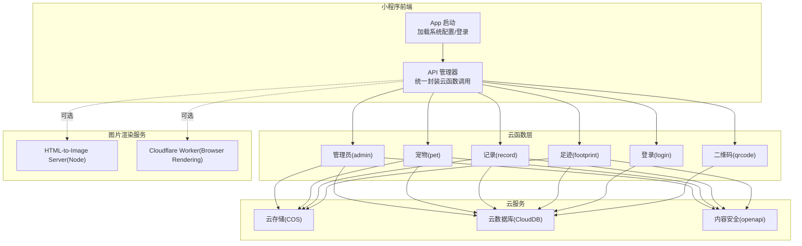
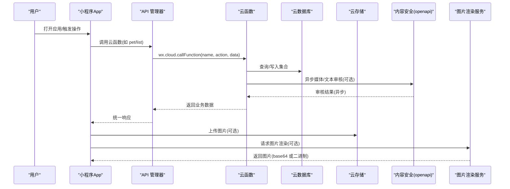
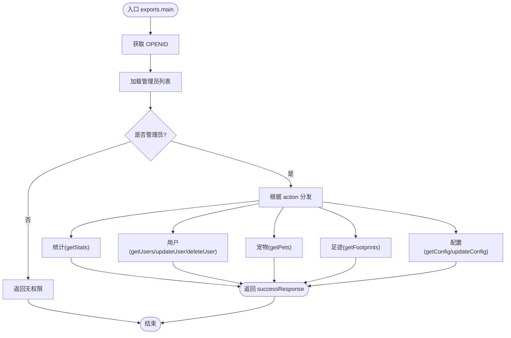
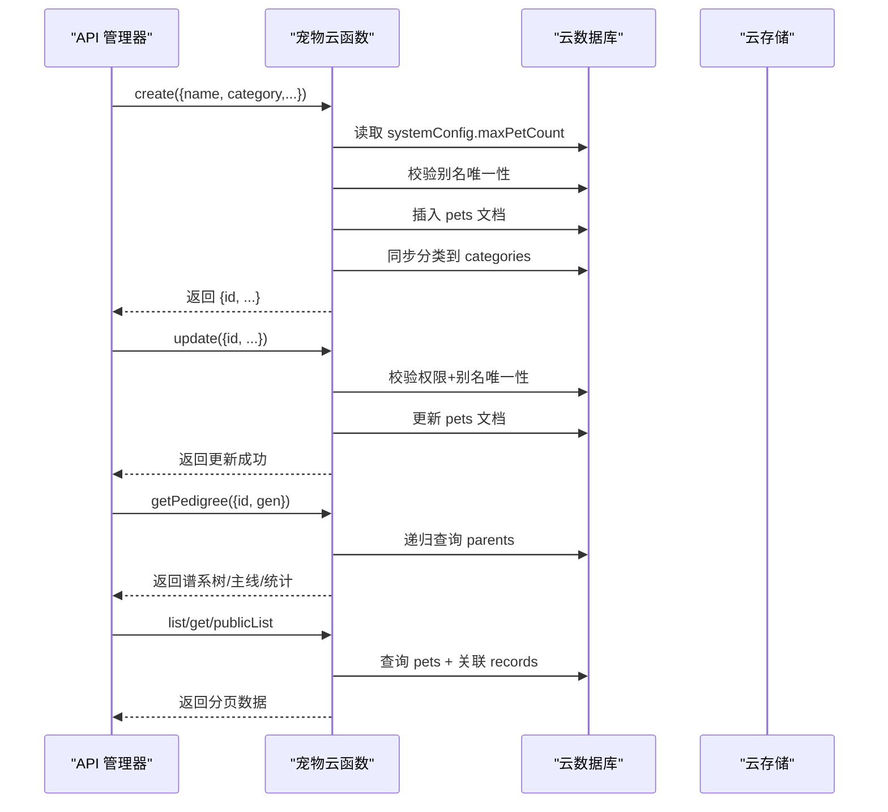
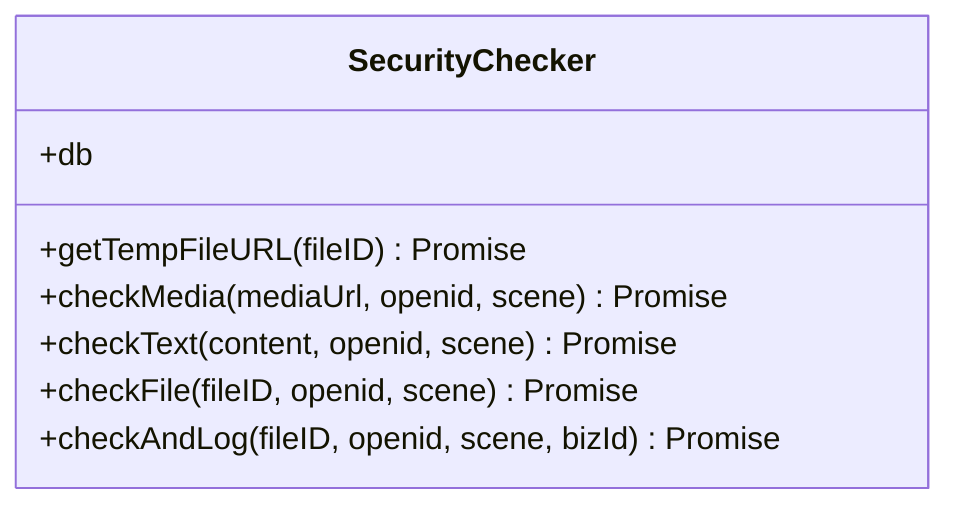
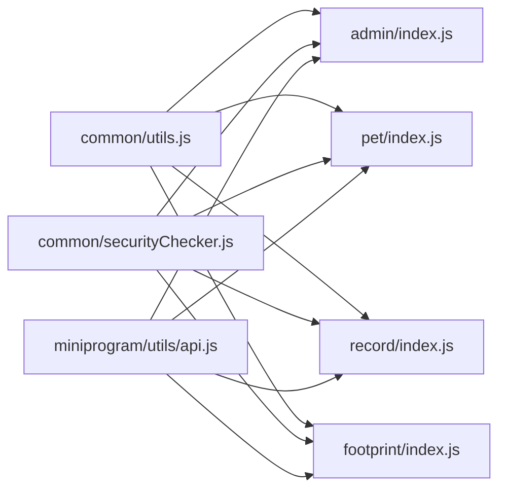

# 云开发部署

<cite>
**本文引用的文件**
- [cloudfunctions/admin/index.js](file://cloudfunctions/admin/index.js)
- [cloudfunctions/common/securityChecker.js](file://cloudfunctions/common/securityChecker.js)
- [miniprogram/utils/api.js](file://miniprogram/utils/api.js)
- [html2image-server/server.js](file://html2image-server/server.js)
- [cloudflare-worker/src/index.js](file://cloudflare-worker/src/index.js)
- [cloudfunctions/pet/index.js](file://cloudfunctions/pet/index.js)
- [cloudfunctions/record/index.js](file://cloudfunctions/record/index.js)
- [cloudfunctions/footprint/index.js](file://cloudfunctions/footprint/index.js)
- [miniprogram/app.js](file://miniprogram/app.js)
- [cloudfunctions/common/utils.js](file://cloudfunctions/common/utils.js)
- [cloudfunctions/admin/config.json](file://cloudfunctions/admin/config.json)
- [cloudfunctions/pet/config.json](file://cloudfunctions/pet/config.json)
- [cloudfunctions/record/config.json](file://cloudfunctions/record/config.json)
- [cloudfunctions/footprint/config.json](file://cloudfunctions/footprint/config.json)
- [cloudfunctions/login/config.json](file://cloudfunctions/login/config.json)
</cite>

## 目录
1. [简介](#简介)
2. [项目结构](#项目结构)
3. [核心组件](#核心组件)
4. [架构总览](#架构总览)
5. [详细组件分析](#详细组件分析)
6. [依赖关系分析](#依赖关系分析)
7. [性能与容量规划](#性能与容量规划)
8. [故障排查指南](#故障排查指南)
9. [结论](#结论)
10. [附录](#附录)

## 简介
本文件面向“云开发部署”的完整实践，结合仓库中的云函数、小程序前端、以及自托管 HTML 转图片服务与 Cloudflare Worker，系统化阐述以下主题：
- 云函数打包、上传与版本管理
- 云数据库初始化、索引与权限
- 云存储上传策略、CDN 加速与访问控制
- 云函数环境变量、日志与性能优化
- 部署前检查、测试与回滚
- 灰度发布、A/B 测试与流量分配
- 部署脚本、自动化与 CI/CD 集成

## 项目结构
该项目由多端协同组成：
- 小程序前端：负责调用云函数、上传图片、展示数据
- 云函数层：提供业务逻辑（宠物、记录、足迹、管理员、二维码等）
- 云存储与云数据库：持久化数据与静态资源
- 自托管 HTML-to-Image 服务与 Cloudflare Worker：提供图片渲染能力（可选替代方案）

图表来源
- [miniprogram/app.js:1-312](file://miniprogram/app.js#L1-L312)
- [miniprogram/utils/api.js:1-208](file://miniprogram/utils/api.js#L1-L208)
- [cloudfunctions/admin/index.js:1-533](file://cloudfunctions/admin/index.js#L1-L533)
- [cloudfunctions/pet/index.js:1-723](file://cloudfunctions/pet/index.js#L1-L723)
- [cloudfunctions/record/index.js:1-191](file://cloudfunctions/record/index.js#L1-L191)
- [cloudfunctions/footprint/index.js:1-160](file://cloudfunctions/footprint/index.js#L1-L160)
- [cloudfunctions/common/securityChecker.js:1-226](file://cloudfunctions/common/securityChecker.js#L1-L226)
- [html2image-server/server.js:1-365](file://html2image-server/server.js#L1-L365)
- [cloudflare-worker/src/index.js:1-223](file://cloudflare-worker/src/index.js#L1-L223)

章节来源
- [miniprogram/app.js:1-312](file://miniprogram/app.js#L1-L312)
- [miniprogram/utils/api.js:1-208](file://miniprogram/utils/api.js#L1-L208)

## 核心组件
- 小程序前端
  - 应用启动时初始化云开发、加载系统配置、自动登录、生成分享二维码、检查安全通知
  - 统一的 API 管理器封装云函数调用，提供宠物、记录、提醒、足迹、登录等接口
- 云函数
  - 管理员：统计、用户/宠物/足迹管理、配置管理、封禁处理
  - 宠物：增删改查、谱系查询、分类管理、图片净化
  - 记录：增删改查、产蛋/出苗/交配等专项数据
  - 足迹：增删改查、图片数量限制
  - 登录：获取 openid、用户信息落库
  - 通用工具：数据库连接、上下文、响应封装、ID 规范化
  - 安全检查：文本/媒体内容安全审核、异步回调、审核日志
- 云存储与数据库
  - 数据集合：users、pets、records、footprints、admins、systemConfig、security_logs、categories、bannedUsers
  - 存储策略：cloud:// fileID 永久有效，支持临时 URL 转换
- 图片渲染服务
  - 自托管 Node 服务：Puppeteer + Chromium，支持健康检查、配置查询、HTML 转图片
  - Cloudflare Worker：使用 Browser Rendering API，支持跨域、直出图片或返回 base64

章节来源
- [cloudfunctions/admin/index.js:1-533](file://cloudfunctions/admin/index.js#L1-L533)
- [cloudfunctions/pet/index.js:1-723](file://cloudfunctions/pet/index.js#L1-L723)
- [cloudfunctions/record/index.js:1-191](file://cloudfunctions/record/index.js#L1-L191)
- [cloudfunctions/footprint/index.js:1-160](file://cloudfunctions/footprint/index.js#L1-L160)
- [cloudfunctions/common/securityChecker.js:1-226](file://cloudfunctions/common/securityChecker.js#L1-L226)
- [cloudfunctions/common/utils.js:1-69](file://cloudfunctions/common/utils.js#L1-L69)
- [miniprogram/utils/api.js:1-208](file://miniprogram/utils/api.js#L1-L208)
- [html2image-server/server.js:1-365](file://html2image-server/server.js#L1-L365)
- [cloudflare-worker/src/index.js:1-223](file://cloudflare-worker/src/index.js#L1-L223)

## 架构总览
下图展示从小程序到云函数、再到云存储与数据库的整体调用链路，并标注安全审核与图片渲染的关键节点。

图表来源
- [miniprogram/app.js:1-312](file://miniprogram/app.js#L1-L312)
- [miniprogram/utils/api.js:1-208](file://miniprogram/utils/api.js#L1-L208)
- [cloudfunctions/common/securityChecker.js:1-226](file://cloudfunctions/common/securityChecker.js#L1-L226)
- [cloudfunctions/pet/index.js:1-723](file://cloudfunctions/pet/index.js#L1-L723)
- [html2image-server/server.js:1-365](file://html2image-server/server.js#L1-L365)
- [cloudflare-worker/src/index.js:1-223](file://cloudflare-worker/src/index.js#L1-L223)

## 详细组件分析

### 管理员云函数（admin）
职责与特性
- 管理员鉴权：优先从数据库读取管理员列表，兜底配置
- 统计与报表：用户/宠物/足迹总量、当日活跃、用户/宠物增长趋势
- 用户管理：查询、更新、删除（含事务）、封禁/解封联动
- 宠物管理：查询、统计、按类别聚合
- 足迹管理：查询、搜索、时间范围筛选
- 系统配置：读取/更新 systemConfig，记录更新人与时间戳
- 错误处理：统一返回结构，记录错误日志

图表来源
- [cloudfunctions/admin/index.js:27-71](file://cloudfunctions/admin/index.js#L27-L71)
- [cloudfunctions/admin/index.js:74-115](file://cloudfunctions/admin/index.js#L74-L115)
- [cloudfunctions/admin/index.js:118-174](file://cloudfunctions/admin/index.js#L118-L174)
- [cloudfunctions/admin/index.js:177-258](file://cloudfunctions/admin/index.js#L177-L258)
- [cloudfunctions/admin/index.js:261-362](file://cloudfunctions/admin/index.js#L261-L362)
- [cloudfunctions/admin/index.js:434-508](file://cloudfunctions/admin/index.js#L434-L508)

章节来源
- [cloudfunctions/admin/index.js:1-533](file://cloudfunctions/admin/index.js#L1-L533)
- [cloudfunctions/admin/config.json:1-6](file://cloudfunctions/admin/config.json#L1-L6)

### 宠物云函数（pet）
职责与特性
- 图片净化：将过期临时 URL 转换为 cloud:// fileID
- 业务：创建/查询/更新/删除宠物；公开列表与详情；谱系查询（父系/母系主线）
- 分类：增删改查分类，自动同步到 categories 集合
- 限额：受 systemConfig.maxPetCount 限制
- 权限：仅本人可操作

图表来源
- [cloudfunctions/pet/index.js:84-138](file://cloudfunctions/pet/index.js#L84-L138)
- [cloudfunctions/pet/index.js:193-231](file://cloudfunctions/pet/index.js#L193-L231)
- [cloudfunctions/pet/index.js:376-412](file://cloudfunctions/pet/index.js#L376-L412)
- [cloudfunctions/pet/index.js:517-634](file://cloudfunctions/pet/index.js#L517-L634)

章节来源
- [cloudfunctions/pet/index.js:1-723](file://cloudfunctions/pet/index.js#L1-L723)
- [cloudfunctions/pet/config.json:1-6](file://cloudfunctions/pet/config.json#L1-L6)

### 记录云函数（record）
职责与特性
- 专项记录：产蛋、出苗、交配、日常等
- 通用 CRUD：创建/查询/更新/删除
- QR 缓存：静默更新记录的二维码缓存字段

章节来源
- [cloudfunctions/record/index.js:1-191](file://cloudfunctions/record/index.js#L1-L191)
- [cloudfunctions/record/config.json:1-6](file://cloudfunctions/record/config.json#L1-L6)

### 足迹云函数（footprint）
职责与特性
- 限制每条足迹最多上传图片数量（受 systemConfig.maxFootprintImages 控制）
- 通用 CRUD

章节来源
- [cloudfunctions/footprint/index.js:1-160](file://cloudfunctions/footprint/index.js#L1-L160)
- [cloudfunctions/footprint/config.json:1-6](file://cloudfunctions/footprint/config.json#L1-L6)

### 安全检查组件（securityChecker）
职责与特性
- 支持场景映射：资料、评论、论坛、社交日志
- 提供三种能力：获取临时 URL、媒体异步审核、文本即时审核
- 审核日志：记录 traceId、bizId、场景、状态等

图表来源
- [cloudfunctions/common/securityChecker.js:30-208](file://cloudfunctions/common/securityChecker.js#L30-L208)

章节来源
- [cloudfunctions/common/securityChecker.js:1-226](file://cloudfunctions/common/securityChecker.js#L1-L226)

### 小程序 API 管理器
职责与特性
- 统一调用云函数，封装成功/失败响应
- 宠物、记录、提醒、足迹、登录等 API
- 图片上传：构造 cloudPath、上传后异步触发安全检查

章节来源
- [miniprogram/utils/api.js:1-208](file://miniprogram/utils/api.js#L1-L208)

### HTML-to-Image 服务（自托管 Node）
职责与特性
- Puppeteer + Chromium 渲染 HTML 为图片
- 支持健康检查、配置查询、请求体大小限制、超时控制
- 进程生命周期：优雅关闭、PID 文件

章节来源
- [html2image-server/server.js:1-365](file://html2image-server/server.js#L1-L365)

### Cloudflare Worker（浏览器渲染 API）
职责与特性
- 使用 Cloudflare Browser Rendering API 渲染 HTML
- 支持跨域、直出图片或返回 base64
- 需要配置 API Token 与 Account ID

章节来源
- [cloudflare-worker/src/index.js:1-223](file://cloudflare-worker/src/index.js#L1-L223)

## 依赖关系分析
- 模块内聚与耦合
  - 云函数内部通过公共工具模块复用数据库连接、上下文、响应封装
  - 安全检查组件独立于业务云函数，通过 openapi 调用实现低耦合
- 外部依赖
  - 云函数依赖微信云开发 SDK、云数据库、云存储、内容安全
  - 图片渲染服务依赖 Puppeteer 或 Cloudflare Browser Rendering API
- 配置文件
  - 各云函数目录下的 config.json 当前为空，表示默认权限策略

图表来源
- [cloudfunctions/common/utils.js:1-69](file://cloudfunctions/common/utils.js#L1-L69)
- [cloudfunctions/admin/index.js:1-533](file://cloudfunctions/admin/index.js#L1-L533)
- [cloudfunctions/pet/index.js:1-723](file://cloudfunctions/pet/index.js#L1-L723)
- [cloudfunctions/record/index.js:1-191](file://cloudfunctions/record/index.js#L1-L191)
- [cloudfunctions/footprint/index.js:1-160](file://cloudfunctions/footprint/index.js#L1-L160)
- [cloudfunctions/common/securityChecker.js:1-226](file://cloudfunctions/common/securityChecker.js#L1-L226)
- [miniprogram/utils/api.js:1-208](file://miniprogram/utils/api.js#L1-L208)

章节来源
- [cloudfunctions/admin/config.json:1-6](file://cloudfunctions/admin/config.json#L1-L6)
- [cloudfunctions/pet/config.json:1-6](file://cloudfunctions/pet/config.json#L1-L6)
- [cloudfunctions/record/config.json:1-6](file://cloudfunctions/record/config.json#L1-L6)
- [cloudfunctions/footprint/config.json:1-6](file://cloudfunctions/footprint/config.json#L1-L6)
- [cloudfunctions/login/config.json:1-6](file://cloudfunctions/login/config.json#L1-L6)

## 性能与容量规划
- 云函数
  - 合理拆分业务：将复杂查询拆分为多个云函数，减少单函数执行时间
  - 批量操作：利用数据库命令与事务，减少往返次数
  - 缓存策略：对热点数据（如 systemConfig）在小程序端做本地缓存
- 云存储
  - 使用 cloud:// fileID，避免临时 URL 过期导致的二次转换
  - 图片压缩与格式选择（PNG/JPEG/WebP），平衡质量与体积
- 数据库
  - 为高频查询字段建立索引（如 openid、createdAt、type 等）
  - 合理分页与投影字段，避免全表扫描
- 图片渲染
  - 自托管服务：合理设置 Chromium 启动参数、超时与并发
  - Cloudflare Worker：控制输出尺寸与格式，减少传输体积

[本节为通用指导，无需列出章节来源]

## 故障排查指南
- 云函数调用失败
  - 检查小程序端错误捕获与降级逻辑
  - 关注云函数返回的统一错误结构，定位具体 action 与参数
- 审核异常
  - 确认临时 URL 获取与 fileID 格式
  - 检查 security_logs 集合中的审核记录与 traceId
- 数据一致性
  - 管理员删除用户时使用事务，确保级联删除一致
- 图片渲染
  - 自托管服务：确认 Chromium 可执行路径、超时与协议超时配置
  - Cloudflare Worker：检查 API Token 与 Account ID

章节来源
- [miniprogram/utils/api.js:12-38](file://miniprogram/utils/api.js#L12-L38)
- [cloudfunctions/common/securityChecker.js:51-64](file://cloudfunctions/common/securityChecker.js#L51-L64)
- [cloudfunctions/admin/index.js:227-257](file://cloudfunctions/admin/index.js#L227-L257)
- [html2image-server/server.js:65-105](file://html2image-server/server.js#L65-L105)
- [cloudflare-worker/src/index.js:82-93](file://cloudflare-worker/src/index.js#L82-L93)

## 结论
本项目以小程序前端为核心，围绕云函数构建了完善的宠物档案管理能力，并辅以云存储、云数据库与内容安全服务。通过模块化的云函数设计、统一的安全检查与 API 管理器，以及可选的图片渲染服务，形成了可扩展、可维护的云开发体系。建议在生产环境中进一步完善索引、权限与监控告警，并结合灰度与 A/B 流量策略推进持续交付。

[本节为总结性内容，无需列出章节来源]

## 附录

### 部署前检查清单
- 代码规范与测试
  - 单元测试与集成测试覆盖关键分支（权限、限额、事务）
  - Lint 与格式化检查通过
- 数据库准备
  - 初始化 systemConfig、admins、categories 等基础集合
  - 为 openid、createdAt、type 等字段建立必要索引
- 云存储与 CDN
  - 配置 bucket 与访问策略，开启 CDN 加速
  - 上传默认资源（如 logo、默认头像），确保 cloud:// fileID 生效
- 云函数配置
  - 设置环境变量（如腾讯云 SecretId/Key、COS Bucket/Region）
  - 配置权限与 openapi 白名单
- 安全与合规
  - 内容安全审核策略明确，审核日志可追踪
  - 对敏感操作（删除、封禁）增加二次确认与审计

[本节为通用指导，无需列出章节来源]

### 版本管理与回滚
- 云函数版本
  - 使用云开发控制台或 CLI 发布新版本，保留旧版本
  - 回滚时选择目标版本，确保数据兼容
- 数据迁移
  - systemConfig 迁移：优先从 systemConfig 读取，降级到 system 集合
  - 集合结构变更：先写兼容读取，再逐步切换

章节来源
- [miniprogram/app.js:17-58](file://miniprogram/app.js#L17-L58)

### 灰度发布与 A/B 测试
- 流量分配
  - 通过网关或代理层将请求路由至不同版本的云函数
  - 基于用户维度（如 openid）进行分桶，保证稳定性
- 指标监控
  - 关键指标：成功率、P95 延迟、错误率、审核通过率
  - 日志采集与告警，异常快速收敛

[本节为通用指导，无需列出章节来源]

### CI/CD 集成建议
- 构建与打包
  - 使用云开发 CLI 或第三方 CI 工具进行云函数打包与上传
- 自动化测试
  - 在 CI 中运行测试用例，失败即阻断
- 部署策略
  - 蓝绿/金丝雀发布：先灰度 10%-20%，观察指标后再全量
  - 回滚：一键回退至上一个稳定版本

[本节为通用指导，无需列出章节来源]