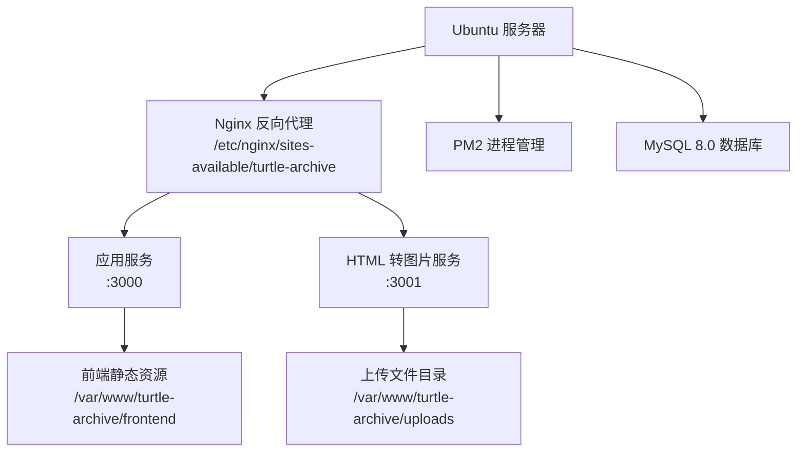
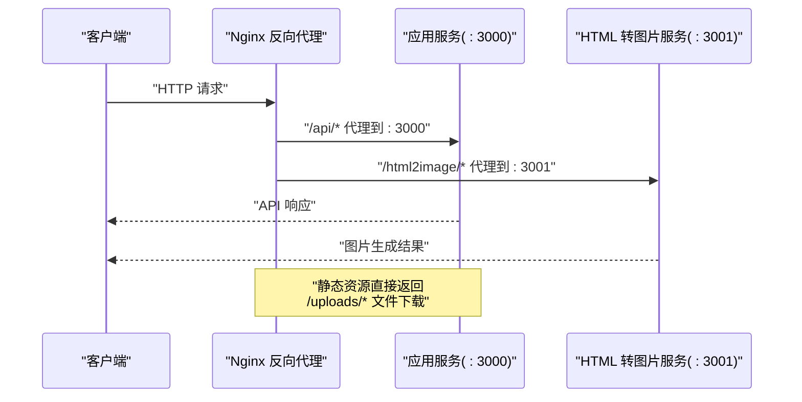
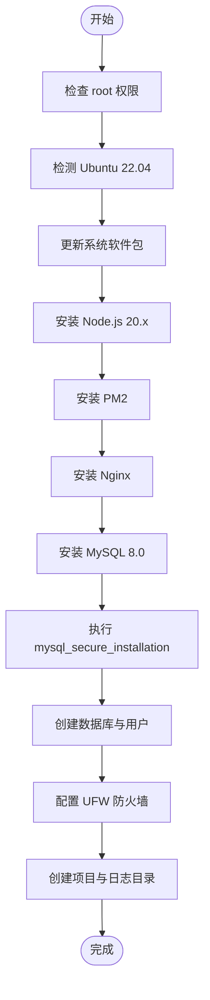
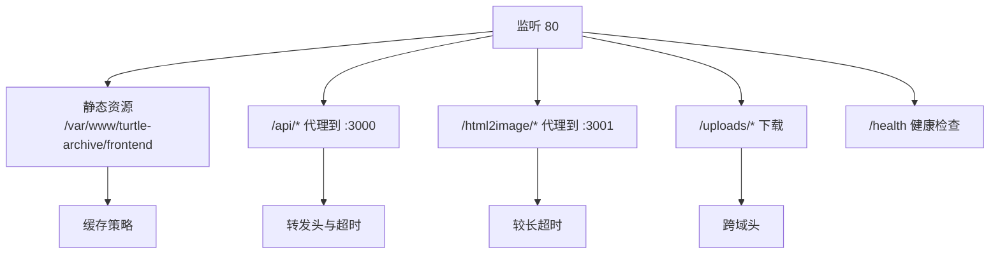
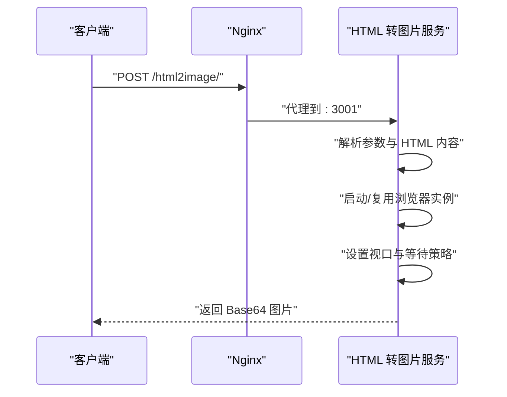
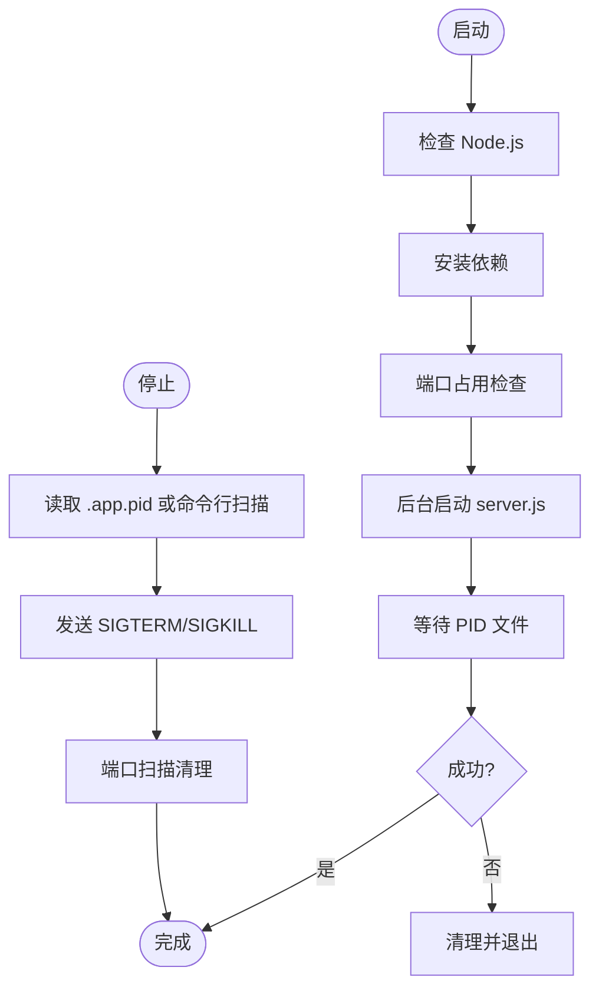
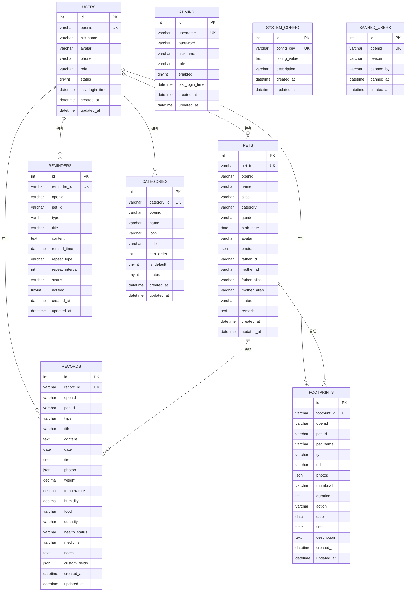
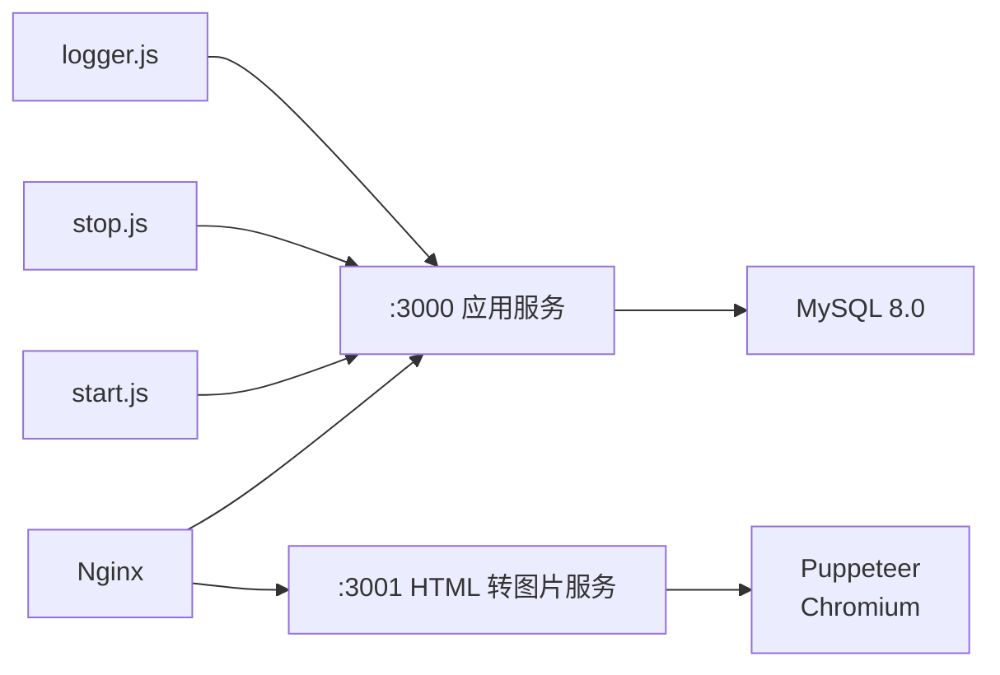

# 本地服务部署

<cite>
**本文档引用的文件**
- [setup.sh](file://server-setup/setup.sh)
- [turtle-archive.nginx](file://server-setup/turtle-archive.nginx)
- [database.sql](file://server-setup/database.sql)
- [package.json](file://html2image-server/package.json)
- [config.js](file://html2image-server/config.js)
- [server.js](file://html2image-server/server.js)
- [start.js](file://html2image-server/start.js)
- [stop.js](file://html2image-server/stop.js)
- [start-server.sh](file://html2image-server/start-server.sh)
- [stop-server.sh](file://html2image-server/stop-server.sh)
- [config-read.js](file://html2image-server/config-read.js)
- [logger.js](file://html2image-server/logger.js)
</cite>

## 目录
1. [简介](#简介)
2. [项目结构](#项目结构)
3. [核心组件](#核心组件)
4. [架构总览](#架构总览)
5. [详细组件分析](#详细组件分析)
6. [依赖关系分析](#依赖关系分析)
7. [性能考虑](#性能考虑)
8. [故障排查指南](#故障排查指南)
9. [结论](#结论)
10. [附录](#附录)

## 简介
本文件面向在 Ubuntu 服务器上部署本地服务的工程实践，覆盖环境准备、依赖安装与系统配置、Nginx 反向代理与 HTTPS 设置、PM2 进程管理与自动重启、MySQL 数据库安装与性能调优、HTML 转图片服务部署与启停脚本使用、防火墙与安全加固、系统监控以及完整部署清单与检查清单。

## 项目结构
本仓库包含用于本地部署的核心脚本与配置文件，主要分布在以下位置：
- server-setup：包含系统安装脚本、Nginx 配置模板与数据库初始化 SQL
- html2image-server：HTML 转图片服务的源代码与启停脚本
- html2image-server-dist：分发版的启停脚本（与源码一致）

图表来源
- [setup.sh:105-121](file://server-setup/setup.sh#L105-L121)
- [turtle-archive.nginx:7-101](file://server-setup/turtle-archive.nginx#L7-L101)

章节来源
- [setup.sh:105-121](file://server-setup/setup.sh#L105-L121)
- [turtle-archive.nginx:7-101](file://server-setup/turtle-archive.nginx#L7-L101)

## 核心组件
- 系统安装与环境准备：通过自动化脚本安装 Node.js、Nginx、PM2、MySQL，并配置防火墙与项目目录
- Nginx 反向代理：提供静态资源、API 代理、HTML 转图片服务代理、文件上传下载、健康检查等
- HTML 转图片服务：基于 Puppeteer 的 HTTP API，支持 PNG/JPEG/WebP 输出与多种渲染参数
- MySQL 数据库：提供用户、宠物、记录、足迹、提醒、分类、系统配置等表结构与默认数据
- 启停脚本：统一的跨平台启动与停止流程，支持 PID 文件与端口扫描清理

章节来源
- [setup.sh:43-121](file://server-setup/setup.sh#L43-L121)
- [turtle-archive.nginx:31-64](file://server-setup/turtle-archive.nginx#L31-L64)
- [package.json:22-24](file://html2image-server/package.json#L22-L24)
- [server.js:154-330](file://html2image-server/server.js#L154-L330)
- [database.sql:9-214](file://server-setup/database.sql#L9-L214)

## 架构总览
下图展示了从客户端请求到后端服务的整体流转，包括 Nginx 代理、应用服务与 HTML 转图片服务之间的交互。

图表来源
- [turtle-archive.nginx:18-101](file://server-setup/turtle-archive.nginx#L18-L101)
- [server.js:208-330](file://html2image-server/server.js#L208-L330)

## 详细组件分析

### 系统安装与环境准备
- 自动化安装 Node.js 20.x、Nginx、PM2、MySQL 8.0
- 安全加固：执行 mysql_secure_installation，创建专用数据库与用户
- 防火墙配置：允许 SSH、Nginx 全功能、MySQL 本地访问
- 项目目录：创建 /var/www/turtle-archive 与 /var/log/turtle-archive 并赋予权限

图表来源
- [setup.sh:20-121](file://server-setup/setup.sh#L20-L121)

章节来源
- [setup.sh:20-145](file://server-setup/setup.sh#L20-L145)

### Nginx 反向代理配置
- 监听 80 端口，支持静态资源缓存、隐藏文件禁止访问、错误页映射
- /api/ 代理到应用服务 :3000，支持 WebSocket 升级头
- /html2image/ 代理到 HTML 转图片服务 :3001，超时时间适当延长
- /uploads/ 提供文件下载与跨域访问控制
- 健康检查 /health 返回 200 文本
- HTTPS 配置示例（Let's Encrypt）可选启用

图表来源
- [turtle-archive.nginx:7-101](file://server-setup/turtle-archive.nginx#L7-L101)

章节来源
- [turtle-archive.nginx:7-125](file://server-setup/turtle-archive.nginx#L7-L125)

### HTML 转图片服务
- 基于 Puppeteer 的 HTTP API，支持 PNG/JPEG/WebP 输出
- 支持视口尺寸、设备缩放因子、等待时间、质量、裁剪区域等参数
- 内置浏览器池管理与优雅关闭
- 日志模块按天输出，支持请求开始/结束与错误记录

图表来源
- [server.js:154-205](file://html2image-server/server.js#L154-L205)
- [turtle-archive.nginx:49-64](file://server-setup/turtle-archive.nginx#L49-L64)

章节来源
- [server.js:154-330](file://html2image-server/server.js#L154-L330)
- [config.js:28-74](file://html2image-server/config.js#L28-L74)
- [logger.js:1-95](file://html2image-server/logger.js#L1-L95)

### 启停脚本与进程管理
- start.js：检查 Node.js、安装依赖、端口占用、后台启动、等待 PID 文件
- stop.js：读取 PID 文件、命令行扫描、端口扫描清理，支持强制终止
- shell 包装脚本：start-server.sh/stop-server.sh 统一入口

图表来源
- [start.js:52-151](file://html2image-server/start.js#L52-L151)
- [stop.js:120-192](file://html2image-server/stop.js#L120-L192)
- [start-server.sh:1-18](file://html2image-server/start-server.sh#L1-L18)
- [stop-server.sh:1-17](file://html2image-server/stop-server.sh#L1-L17)

章节来源
- [start.js:52-151](file://html2image-server/start.js#L52-L151)
- [stop.js:120-192](file://html2image-server/stop.js#L120-L192)
- [start-server.sh:1-18](file://html2image-server/start-server.sh#L1-L18)
- [stop-server.sh:1-17](file://html2image-server/stop-server.sh#L1-L17)

### MySQL 数据库安装与配置
- 安装 MySQL 8.0 并启用开机自启
- 初始化数据库与用户，导入表结构与默认数据
- 字符集设置为 utf8mb4，索引覆盖常见查询场景

图表来源
- [database.sql:9-214](file://server-setup/database.sql#L9-L214)

章节来源
- [setup.sh:65-98](file://server-setup/setup.sh#L65-L98)
- [database.sql:1-221](file://server-setup/database.sql#L1-L221)

## 依赖关系分析
- HTML 转图片服务依赖 Puppeteer（headless Chromium）
- Nginx 作为统一入口，分别代理到应用服务与 HTML 转图片服务
- 启停脚本通过 Node.js 进程管理器实现后台运行与优雅关闭
- 日志模块独立输出，便于问题定位

图表来源
- [package.json:22-24](file://html2image-server/package.json#L22-L24)
- [server.js:9-14](file://html2image-server/server.js#L9-L14)
- [turtle-archive.nginx:31-64](file://server-setup/turtle-archive.nginx#L31-L64)

章节来源
- [package.json:22-24](file://html2image-server/package.json#L22-L24)
- [server.js:9-14](file://html2image-server/server.js#L9-L14)
- [turtle-archive.nginx:31-64](file://server-setup/turtle-archive.nginx#L31-L64)

## 性能考虑
- Nginx 缓存策略：静态资源一年缓存，immutable 提升加载速度
- 代理超时：HTML 转图片服务适当延长连接/发送/读取超时，避免长任务中断
- 浏览器池：复用 Puppeteer 实例，减少启动开销；断线自动重连
- 日志轮转：按天输出，避免单文件过大影响 IO
- 数据库索引：针对常用查询字段建立索引，降低慢查询风险

章节来源
- [turtle-archive.nginx:24-28](file://server-setup/turtle-archive.nginx#L24-L28)
- [turtle-archive.nginx:60-64](file://server-setup/turtle-archive.nginx#L60-L64)
- [server.js:65-105](file://html2image-server/server.js#L65-L105)
- [logger.js:10-16](file://html2image-server/logger.js#L10-L16)

## 故障排查指南
- 启动失败
  - 检查 Node.js 版本与依赖安装：使用 start.js 的依赖检查逻辑
  - 查看日志：logs/app_output.log 与按日志文件
  - 端口占用：确认端口未被占用，必要时清理占用进程
- 停止异常
  - 优先读取 .app.pid，否则通过命令行扫描与端口扫描清理
  - 强制模式使用 --force 或 --pid 指定目标进程
- Nginx 代理问题
  - 检查站点配置文件语法与软链接
  - 确认代理路径与上游地址正确
- 数据库问题
  - 校验字符集与外键约束设置
  - 导入表结构前确保数据库存在且用户权限正确

章节来源
- [start.js:63-101](file://html2image-server/start.js#L63-L101)
- [logger.js:37-44](file://html2image-server/logger.js#L37-L44)
- [stop.js:141-192](file://html2image-server/stop.js#L141-L192)
- [setup.sh:105-112](file://server-setup/setup.sh#L105-L112)
- [database.sql:5-7](file://server-setup/database.sql#L5-L7)

## 结论
通过本部署文档，可在 Ubuntu 服务器上快速完成环境准备、服务部署与运维监控。建议结合实际业务对 Nginx 缓存策略、PM2 启动参数与 MySQL 参数进行进一步优化，并定期审查日志与安全配置。

## 附录

### 部署清单
- 系统环境
  - Ubuntu 22.04（root 权限）
  - 已执行安装脚本：安装 Node.js、Nginx、PM2、MySQL
- 数据库
  - 执行数据库初始化 SQL，导入表结构与默认数据
- 服务部署
  - 上传项目文件至 /var/www/turtle-archive
  - 配置 Nginx 站点并启用
  - 使用 PM2 启动应用服务与 HTML 转图片服务
- 安全加固
  - 配置防火墙规则
  - 修改默认数据库密码与管理员密码
- 监控与日志
  - 关注 Nginx 访问/错误日志与服务日志

章节来源
- [setup.sh:123-145](file://server-setup/setup.sh#L123-L145)
- [database.sql:1-221](file://server-setup/database.sql#L1-L221)
- [turtle-archive.nginx:1-6](file://server-setup/turtle-archive.nginx#L1-L6)

### 检查清单
- 系统组件
  - Node.js、PM2、Nginx、MySQL 版本与状态
- 网络与安全
  - 防火墙放行范围、SSH 与 Nginx、MySQL 本地访问
- 服务可用性
  - /health 健康检查、静态资源访问、API 代理、图片生成接口
- 数据一致性
  - 表结构导入成功、默认数据存在、索引生效

章节来源
- [setup.sh:129-141](file://server-setup/setup.sh#L129-L141)
- [turtle-archive.nginx:77-82](file://server-setup/turtle-archive.nginx#L77-L82)
- [database.sql:196-201](file://server-setup/database.sql#L196-L201)