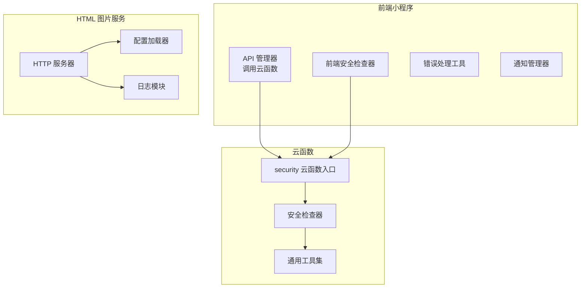
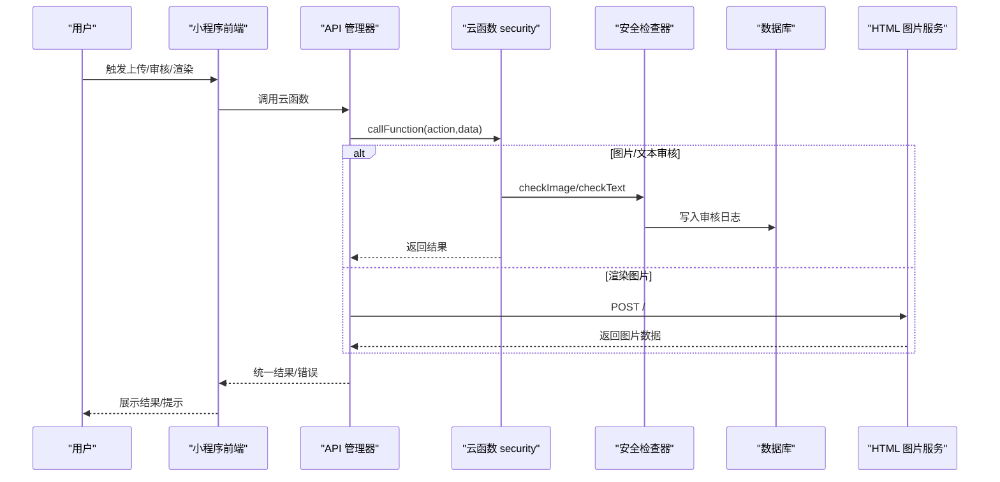
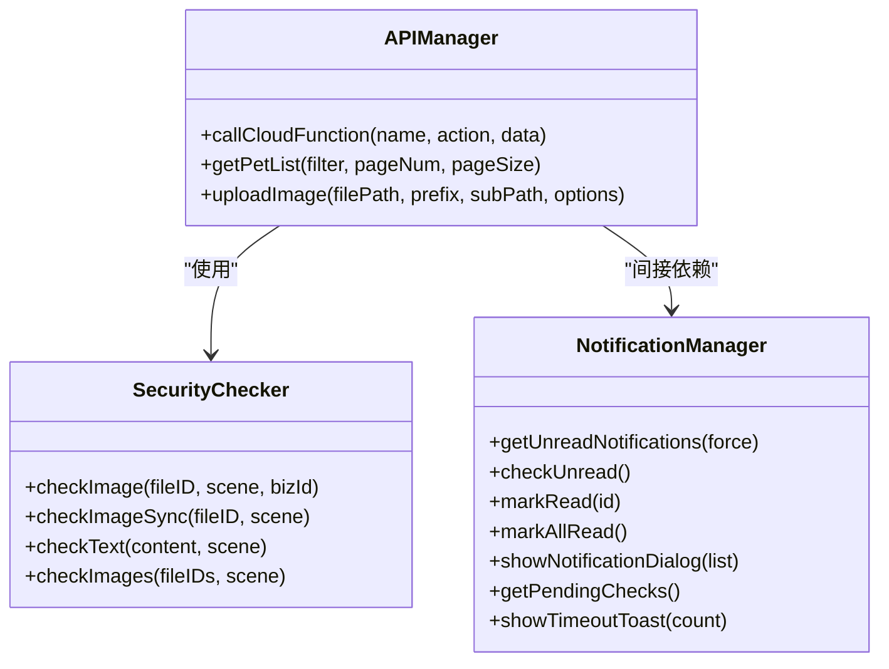
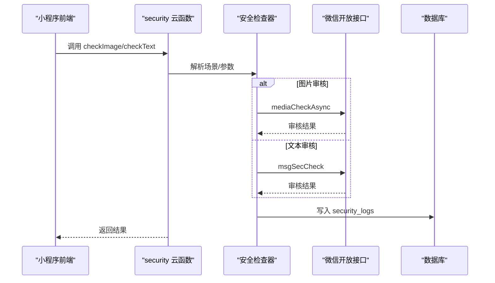
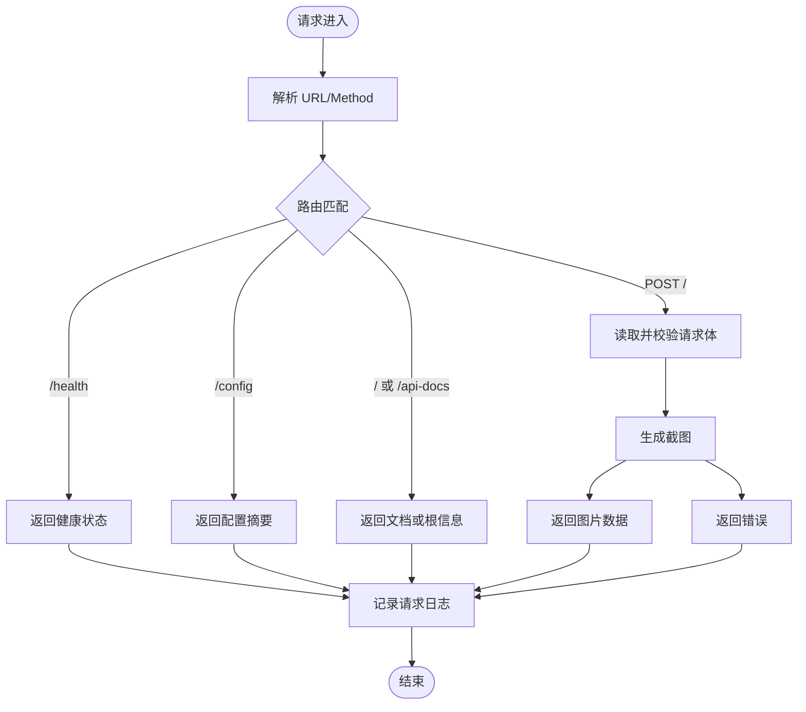
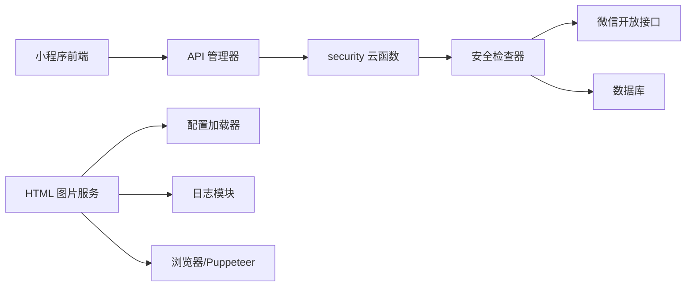

# 监控告警

<cite>
**本文引用的文件**
- [html2image-server/logger.js](file://html2image-server/logger.js)
- [html2image-server/config.js](file://html2image-server/config.js)
- [html2image-server/server.js](file://html2image-server/server.js)
- [cloudfunctions/common/utils.js](file://cloudfunctions/common/utils.js)
- [cloudfunctions/admin/utils.js](file://cloudfunctions/admin/utils.js)
- [cloudfunctions/pet/utils.js](file://cloudfunctions/pet/utils.js)
- [cloudfunctions/security/index.js](file://cloudfunctions/security/index.js)
- [cloudfunctions/security/securityChecker.js](file://cloudfunctions/security/securityChecker.js)
- [miniprogram/utils/api.js](file://miniprogram/utils/api.js)
- [miniprogram/utils/error.js](file://miniprogram/utils/error.js)
- [miniprogram/utils/notification.js](file://miniprogram/utils/notification.js)
- [miniprogram/utils/securityChecker.js](file://miniprogram/utils/securityChecker.js)
</cite>

## 目录
1. [引言](#引言)
2. [项目结构](#项目结构)
3. [核心组件](#核心组件)
4. [架构总览](#架构总览)
5. [详细组件分析](#详细组件分析)
6. [依赖关系分析](#依赖关系分析)
7. [性能考量](#性能考量)
8. [故障排查指南](#故障排查指南)
9. [结论](#结论)
10. [附录](#附录)

## 引言
本实施文档围绕“系统监控与告警”主题，结合代码库现有能力，给出一套可落地的监控方案。内容涵盖：
- 应用性能监控（APM）：指标采集、可视化与告警
- 日志系统：搭建、轮转与集中存储
- 错误监控与异常告警：前后端统一错误上报与通知
- 数据库性能监控：慢查询与连接池策略
- 前端用户体验监控：崩溃与性能指标采集
- 第三方监控工具集成：自定义指标与告警规则
- 监控仪表板与报表：设计思路与趋势分析

## 项目结构
该项目由三部分组成：
- 前端小程序（miniprogram）：负责用户交互、调用云函数、内容安全审核与通知展示
- 云函数（cloudfunctions）：提供业务接口、内容安全审核、数据库访问与通用工具
- HTML 到图片服务（html2image-server）：基于 Puppeteer 的渲染服务，提供健康检查、配置查看与请求日志

图示来源
- [miniprogram/utils/api.js:1-208](file://miniprogram/utils/api.js#L1-L208)
- [cloudfunctions/security/index.js:1-200](file://cloudfunctions/security/index.js#L1-L200)
- [cloudfunctions/security/securityChecker.js:1-206](file://cloudfunctions/security/securityChecker.js#L1-L206)
- [html2image-server/server.js:1-365](file://html2image-server/server.js#L1-L365)
- [html2image-server/config.js:1-268](file://html2image-server/config.js#L1-L268)
- [html2image-server/logger.js:1-95](file://html2image-server/logger.js#L1-L95)

章节来源
- [miniprogram/utils/api.js:1-208](file://miniprogram/utils/api.js#L1-L208)
- [cloudfunctions/security/index.js:1-200](file://cloudfunctions/security/index.js#L1-L200)
- [cloudfunctions/security/securityChecker.js:1-206](file://cloudfunctions/security/securityChecker.js#L1-L206)
- [html2image-server/server.js:1-365](file://html2image-server/server.js#L1-L365)
- [html2image-server/config.js:1-268](file://html2image-server/config.js#L1-L268)
- [html2image-server/logger.js:1-95](file://html2image-server/logger.js#L1-L95)

## 核心组件
- 前端 API 管理器：封装云函数调用、错误回退与降级策略
- 安全检查器（前端/后端）：统一图片与文本审核调用、异步提交与结果处理
- 云函数通用工具：初始化环境、数据库访问、统一响应与错误包装
- HTML 图片服务：HTTP 服务、浏览器生命周期管理、请求日志与健康检查
- 日志模块：控制台输出与文件落盘、按日期分日志文件
- 错误与通知：统一错误提示、加载状态、通知弹窗与超时提醒

章节来源
- [miniprogram/utils/api.js:1-208](file://miniprogram/utils/api.js#L1-L208)
- [miniprogram/utils/securityChecker.js:1-122](file://miniprogram/utils/securityChecker.js#L1-L122)
- [cloudfunctions/common/utils.js:1-69](file://cloudfunctions/common/utils.js#L1-L69)
- [cloudfunctions/admin/utils.js:1-69](file://cloudfunctions/admin/utils.js#L1-L69)
- [cloudfunctions/pet/utils.js:1-69](file://cloudfunctions/pet/utils.js#L1-L69)
- [html2image-server/server.js:1-365](file://html2image-server/server.js#L1-L365)
- [html2image-server/logger.js:1-95](file://html2image-server/logger.js#L1-L95)

## 架构总览
下图展示了从前端到云函数再到渲染服务的整体链路，以及日志与错误处理的关键节点。

图示来源
- [miniprogram/utils/api.js:1-208](file://miniprogram/utils/api.js#L1-L208)
- [cloudfunctions/security/index.js:1-200](file://cloudfunctions/security/index.js#L1-L200)
- [cloudfunctions/security/securityChecker.js:1-206](file://cloudfunctions/security/securityChecker.js#L1-L206)
- [html2image-server/server.js:208-330](file://html2image-server/server.js#L208-L330)

## 详细组件分析

### 前端监控与错误处理
- 统一错误处理：捕获错误、兜底消息、Toast 展示
- API 管理器：封装 callFunction，处理失败回退与网络异常标记
- 安全检查器（前端）：支持异步/同步审核，批量检查，审核失败时放行以保证可用性
- 通知管理器：拉取未读通知、标记已读、超时提示

图示来源
- [miniprogram/utils/api.js:1-208](file://miniprogram/utils/api.js#L1-L208)
- [miniprogram/utils/securityChecker.js:1-122](file://miniprogram/utils/securityChecker.js#L1-L122)
- [miniprogram/utils/notification.js:1-146](file://miniprogram/utils/notification.js#L1-L146)

章节来源
- [miniprogram/utils/error.js:1-92](file://miniprogram/utils/error.js#L1-L92)
- [miniprogram/utils/api.js:1-208](file://miniprogram/utils/api.js#L1-L208)
- [miniprogram/utils/securityChecker.js:1-122](file://miniprogram/utils/securityChecker.js#L1-L122)
- [miniprogram/utils/notification.js:1-146](file://miniprogram/utils/notification.js#L1-L146)

### 云函数与数据库监控
- 云函数入口：统一处理动作分发、上下文 OPENID 获取、异常捕获与返回
- 安全检查器：图片/文本审核、临时 URL 获取、审核日志写入
- 通用工具：数据库初始化、统一响应、错误包装、ID 规范化

图示来源
- [cloudfunctions/security/index.js:1-200](file://cloudfunctions/security/index.js#L1-L200)
- [cloudfunctions/security/securityChecker.js:1-206](file://cloudfunctions/security/securityChecker.js#L1-L206)

章节来源
- [cloudfunctions/security/index.js:1-200](file://cloudfunctions/security/index.js#L1-L200)
- [cloudfunctions/security/securityChecker.js:1-206](file://cloudfunctions/security/securityChecker.js#L1-L206)
- [cloudfunctions/common/utils.js:1-69](file://cloudfunctions/common/utils.js#L1-L69)
- [cloudfunctions/admin/utils.js:1-69](file://cloudfunctions/admin/utils.js#L1-L69)
- [cloudfunctions/pet/utils.js:1-69](file://cloudfunctions/pet/utils.js#L1-L69)

### HTML 图片服务监控
- HTTP 服务：/health、/config、/api-docs、/（POST 渲染）
- 浏览器生命周期：启动、断连自动重试、关闭
- 请求日志：开始/结束、耗时、状态码
- 配置加载：默认值、config.json、环境变量覆盖

图示来源
- [html2image-server/server.js:208-330](file://html2image-server/server.js#L208-L330)
- [html2image-server/logger.js:71-86](file://html2image-server/logger.js#L71-L86)

章节来源
- [html2image-server/server.js:1-365](file://html2image-server/server.js#L1-L365)
- [html2image-server/config.js:1-268](file://html2image-server/config.js#L1-L268)
- [html2image-server/logger.js:1-95](file://html2image-server/logger.js#L1-L95)

## 依赖关系分析
- 前端依赖云函数：通过 wx.cloud.callFunction 调用，依赖统一的错误处理与通知
- 云函数依赖微信开放接口与数据库：安全检查器封装审核与日志写入
- 渲染服务依赖浏览器与 Puppeteer：启动/断连/关闭，日志模块提供请求追踪
- 配置系统：优先环境变量，其次 config.json，最后硬编码默认值

图示来源
- [miniprogram/utils/api.js:1-208](file://miniprogram/utils/api.js#L1-L208)
- [cloudfunctions/security/index.js:1-200](file://cloudfunctions/security/index.js#L1-L200)
- [cloudfunctions/security/securityChecker.js:1-206](file://cloudfunctions/security/securityChecker.js#L1-L206)
- [html2image-server/server.js:1-365](file://html2image-server/server.js#L1-L365)
- [html2image-server/config.js:1-268](file://html2image-server/config.js#L1-L268)
- [html2image-server/logger.js:1-95](file://html2image-server/logger.js#L1-L95)

章节来源
- [miniprogram/utils/api.js:1-208](file://miniprogram/utils/api.js#L1-L208)
- [cloudfunctions/security/index.js:1-200](file://cloudfunctions/security/index.js#L1-L200)
- [cloudfunctions/security/securityChecker.js:1-206](file://cloudfunctions/security/securityChecker.js#L1-L206)
- [html2image-server/server.js:1-365](file://html2image-server/server.js#L1-L365)
- [html2image-server/config.js:1-268](file://html2image-server/config.js#L1-L268)
- [html2image-server/logger.js:1-95](file://html2image-server/logger.js#L1-L95)

## 性能考量
- 前端 API 调用
  - 统一错误回退：网络异常时标记不可用，避免频繁重试
  - 上传图片后异步审核，不阻塞主流程
- 云函数
  - 统一响应与错误包装，减少重复逻辑
  - 审核日志写入数据库，便于后续分析
- 渲染服务
  - 浏览器断连自动重试，提升稳定性
  - 请求体大小限制与 JSON 校验，防止过大负载
  - 健康检查接口便于外部探活

章节来源
- [miniprogram/utils/api.js:1-208](file://miniprogram/utils/api.js#L1-L208)
- [cloudfunctions/common/utils.js:1-69](file://cloudfunctions/common/utils.js#L1-L69)
- [cloudfunctions/security/securityChecker.js:1-206](file://cloudfunctions/security/securityChecker.js#L1-L206)
- [html2image-server/server.js:1-365](file://html2image-server/server.js#L1-L365)

## 故障排查指南
- 前端
  - 错误提示：统一错误处理与 Toast 展示
  - 通知检查：未读通知、超时提醒、一键已读
- 云函数
  - 审核失败：检查微信开放接口返回与数据库写入
  - 通知查询：确认 openid、权限与分页
- 渲染服务
  - 健康检查：/health 查看浏览器运行状态
  - 日志定位：按日期分文件的日志，结合请求开始/结束标识
  - 配置核对：/config 输出关键配置项

章节来源
- [miniprogram/utils/error.js:1-92](file://miniprogram/utils/error.js#L1-L92)
- [miniprogram/utils/notification.js:1-146](file://miniprogram/utils/notification.js#L1-L146)
- [cloudfunctions/security/index.js:1-200](file://cloudfunctions/security/index.js#L1-L200)
- [cloudfunctions/security/securityChecker.js:1-206](file://cloudfunctions/security/securityChecker.js#L1-L206)
- [html2image-server/server.js:208-330](file://html2image-server/server.js#L208-L330)
- [html2image-server/logger.js:1-95](file://html2image-server/logger.js#L1-L95)

## 结论
本项目已具备完善的前端错误处理、内容安全审核与日志记录基础。建议在此基础上扩展：
- APM：接入第三方 APM 工具，采集前端性能与后端请求指标
- 日志：引入结构化日志与集中式日志平台，完善轮转与检索
- 告警：基于健康检查与日志阈值设置告警规则
- 数据库：建立慢查询与连接池监控，定期分析增长趋势
- 仪表板：整合指标与日志，形成统一监控面板与报表

## 附录
- 配置加载顺序（高优先级优先）：环境变量（H2I_ 前缀）→ config.json → 默认值
- 关键日志字段：请求 ID、方法、URL、状态码、耗时、浏览器状态
- 审核场景映射：avatar/cover/pet/footprint/comment → 数字场景值
- 健康检查：/health 返回服务与浏览器运行状态

章节来源
- [html2image-server/config.js:1-268](file://html2image-server/config.js#L1-L268)
- [html2image-server/logger.js:71-86](file://html2image-server/logger.js#L71-L86)
- [cloudfunctions/security/securityChecker.js:10-28](file://cloudfunctions/security/securityChecker.js#L10-L28)
- [html2image-server/server.js:218-229](file://html2image-server/server.js#L218-L229)