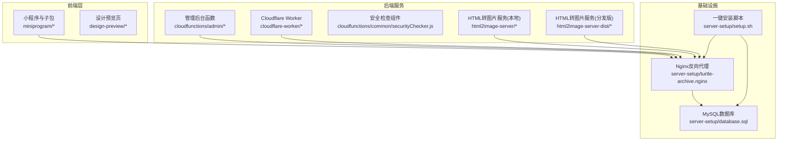
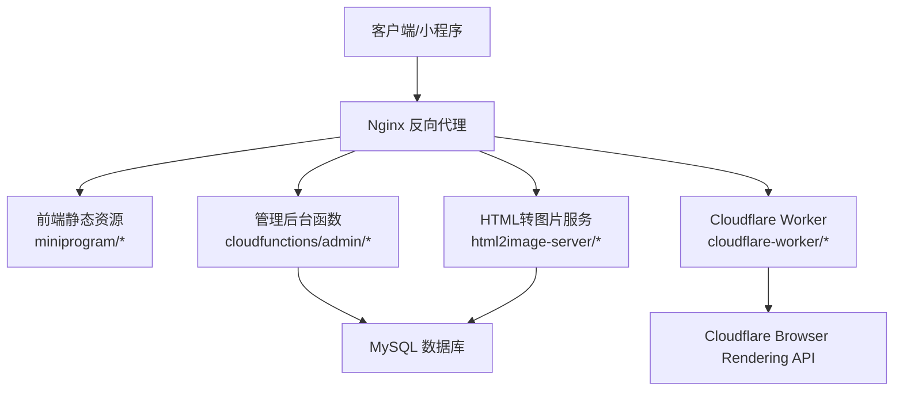
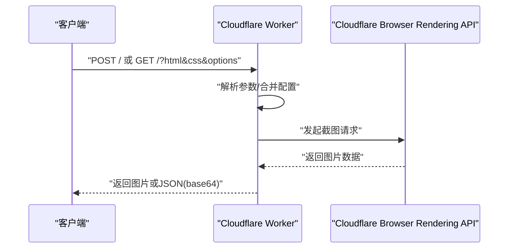
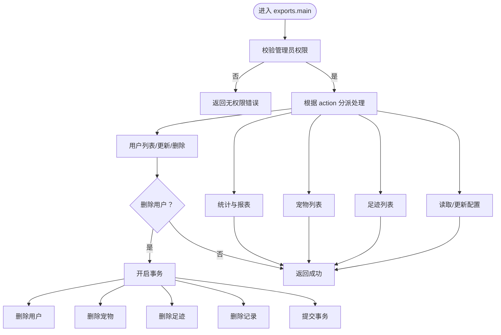
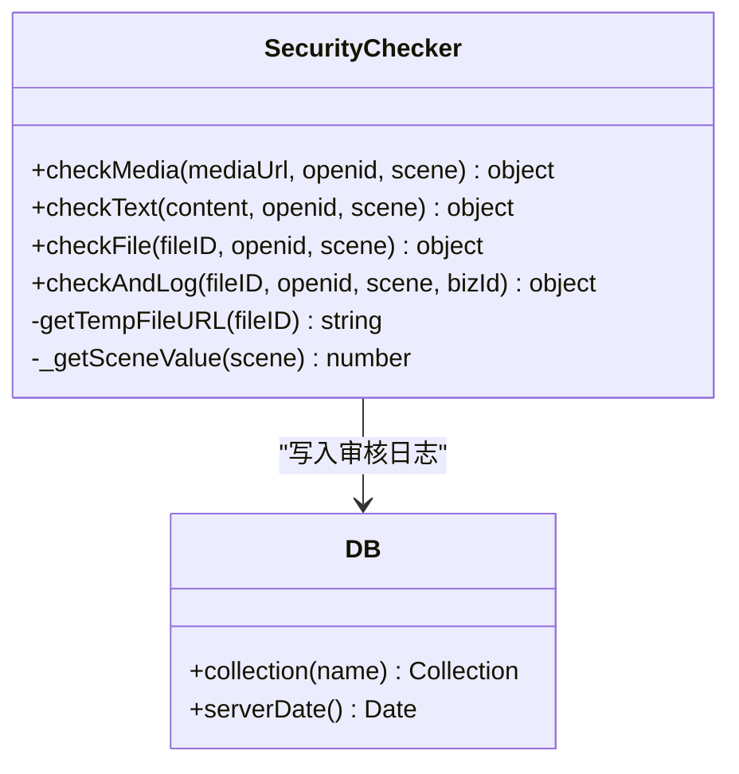
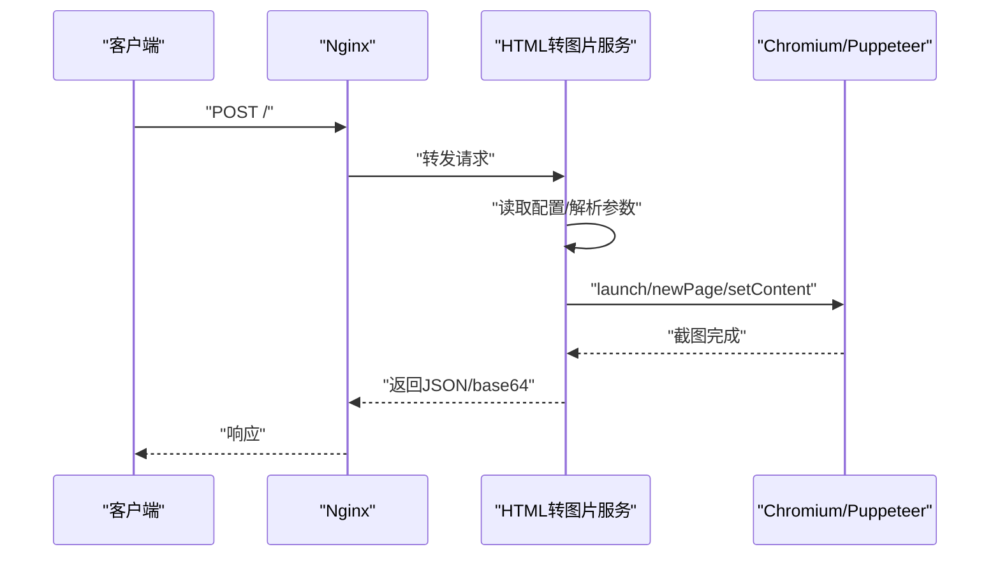
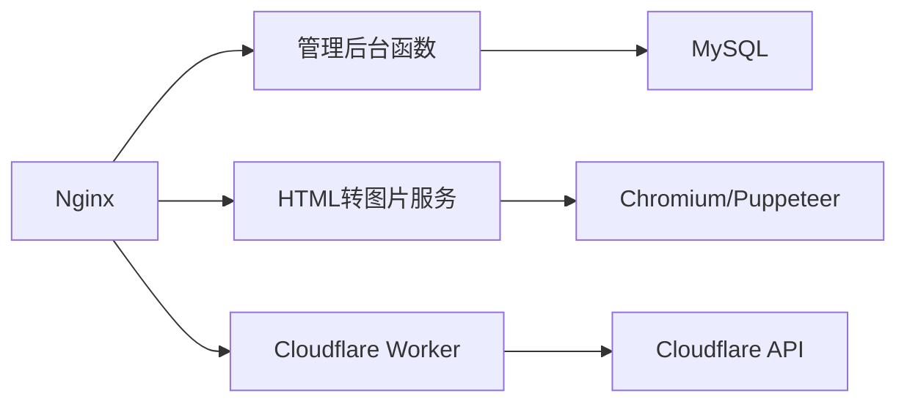
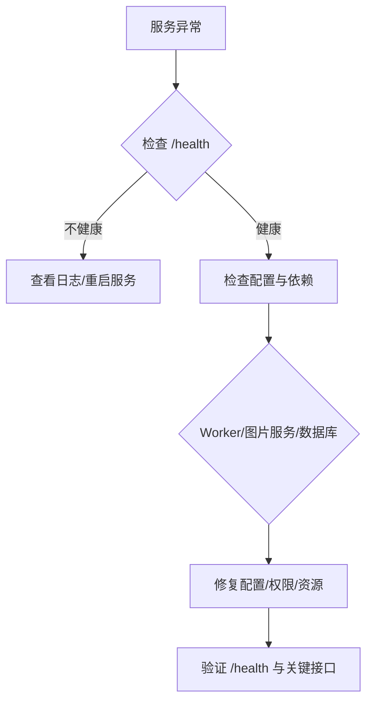

# 运维管理

<cite>
**本文引用的文件**   
- [cloudflare-worker/src/index.js](file://cloudflare-worker/src/index.js)
- [cloudflare-worker/wrangler.toml](file://cloudflare-worker/wrangler.toml)
- [cloudfunctions/admin/index.js](file://cloudfunctions/admin/index.js)
- [cloudfunctions/admin/utils.js](file://cloudfunctions/admin/utils.js)
- [cloudfunctions/common/securityChecker.js](file://cloudfunctions/common/securityChecker.js)
- [html2image-server/server.js](file://html2image-server/server.js)
- [html2image-server-dist/server.js](file://html2image-server-dist/server.js)
- [html2image-server/config.js](file://html2image-server/config.js)
- [html2image-server/logger.js](file://html2image-server/logger.js)
- [server-setup/setup.sh](file://server-setup/setup.sh)
- [server-setup/database.sql](file://server-setup/database.sql)
- [server-setup/turtle-archive.nginx](file://server-setup/turtle-archive.nginx)
</cite>

## 目录
1. [引言](#引言)
2. [项目结构](#项目结构)
3. [核心组件](#核心组件)
4. [架构总览](#架构总览)
5. [详细组件分析](#详细组件分析)
6. [依赖关系分析](#依赖关系分析)
7. [性能与容量规划](#性能与容量规划)
8. [运维操作与流程](#运维操作与流程)
9. [变更管理与发布](#变更管理与发布)
10. [故障排查与应急响应](#故障排查与应急响应)
11. [结论](#结论)
12. [附录](#附录)

## 引言
本指南面向运维团队，提供“养龟档案”项目的完整运维管理方案。内容覆盖日常运维、定期维护、紧急响应、数据备份与恢复、系统升级与版本控制、容量规划与监控、变更与发布流程、回滚机制以及工具链与自动化脚本。文档基于仓库中的实际代码与配置文件进行分析，并结合最佳实践给出可执行的操作建议。

## 项目结构
该项目由多模块组成：前端小程序与子包、云开发函数、Cloudflare Worker、HTML 到图片的服务（本地与分发版本）、Nginx 反向代理与健康检查、数据库初始化脚本、以及一键安装脚本。整体采用“前端 + 云函数 + 辅助服务”的混合架构，部分能力通过 Cloudflare Workers 与浏览器渲染 API 实现。

图表来源
- [cloudflare-worker/src/index.js:1-223](file://cloudflare-worker/src/index.js#L1-L223)
- [cloudfunctions/admin/index.js:1-533](file://cloudfunctions/admin/index.js#L1-L533)
- [cloudfunctions/common/securityChecker.js:1-226](file://cloudfunctions/common/securityChecker.js#L1-L226)
- [html2image-server/server.js:1-365](file://html2image-server/server.js#L1-L365)
- [html2image-server-dist/server.js:1-365](file://html2image-server-dist/server.js#L1-L365)
- [server-setup/turtle-archive.nginx:1-125](file://server-setup/turtle-archive.nginx#L1-L125)
- [server-setup/database.sql:1-221](file://server-setup/database.sql#L1-L221)
- [server-setup/setup.sh:1-145](file://server-setup/setup.sh#L1-L145)

章节来源
- [cloudflare-worker/src/index.js:1-223](file://cloudflare-worker/src/index.js#L1-L223)
- [cloudfunctions/admin/index.js:1-533](file://cloudfunctions/admin/index.js#L1-L533)
- [cloudfunctions/common/securityChecker.js:1-226](file://cloudfunctions/common/securityChecker.js#L1-L226)
- [html2image-server/server.js:1-365](file://html2image-server/server.js#L1-L365)
- [html2image-server-dist/server.js:1-365](file://html2image-server-dist/server.js#L1-L365)
- [server-setup/turtle-archive.nginx:1-125](file://server-setup/turtle-archive.nginx#L1-L125)
- [server-setup/database.sql:1-221](file://server-setup/database.sql#L1-L221)
- [server-setup/setup.sh:1-145](file://server-setup/setup.sh#L1-L145)

## 核心组件
- Cloudflare Worker：提供 HTML/CSS 渲染为图片的能力，调用 Cloudflare Browser Rendering API，支持跨域与响应类型选择。
- 管理后台函数：提供管理员统计、用户/宠物/足迹管理、系统配置更新等能力，具备事务删除用户及其关联数据。
- 安全检查组件：封装微信云安全检查接口，支持图片与文本审核，并记录审核日志。
- HTML 转图片服务：基于 Puppeteer 的本地服务，支持配置化启动参数、超时控制、日志与健康检查。
- Nginx 反向代理：统一入口，转发前端、API、图片服务与静态资源，设置缓存与超时。
- 数据库：MySQL 初始化脚本定义用户、宠物、记录、足迹、提醒、分类、系统配置、黑名单等表结构。
- 一键安装脚本：自动化安装 Node.js、PM2、Nginx、MySQL 并创建数据库与用户。

章节来源
- [cloudflare-worker/src/index.js:1-223](file://cloudflare-worker/src/index.js#L1-L223)
- [cloudfunctions/admin/index.js:1-533](file://cloudfunctions/admin/index.js#L1-L533)
- [cloudfunctions/common/securityChecker.js:1-226](file://cloudfunctions/common/securityChecker.js#L1-L226)
- [html2image-server/server.js:1-365](file://html2image-server/server.js#L1-L365)
- [server-setup/turtle-archive.nginx:1-125](file://server-setup/turtle-archive.nginx#L1-L125)
- [server-setup/database.sql:1-221](file://server-setup/database.sql#L1-L221)
- [server-setup/setup.sh:1-145](file://server-setup/setup.sh#L1-L145)

## 架构总览
系统采用“前端 + 云函数 + 辅助服务”的混合架构。前端通过 Nginx 暴露静态资源与 API；管理后台函数与 Cloudflare Worker 提供业务与图片渲染能力；HTML 转图片服务独立运行并通过 Nginx 转发；数据库由 MySQL 承载。

图表来源
- [cloudflare-worker/src/index.js:1-223](file://cloudflare-worker/src/index.js#L1-L223)
- [cloudfunctions/admin/index.js:1-533](file://cloudfunctions/admin/index.js#L1-L533)
- [html2image-server/server.js:1-365](file://html2image-server/server.js#L1-L365)
- [server-setup/turtle-archive.nginx:1-125](file://server-setup/turtle-archive.nginx#L1-L125)
- [server-setup/database.sql:1-221](file://server-setup/database.sql#L1-L221)

## 详细组件分析

### Cloudflare Worker（HTML 转图片）
- 功能要点
  - 支持 GET/POST 请求，解析 html/css/options。
  - 合并默认配置与请求参数，构建完整 HTML 页面。
  - 调用 Cloudflare Browser Rendering API，返回图片或 base64。
  - 支持跨域与缓存头设置。
- 关键配置
  - 环境变量：CLOUDFLARE_ACCOUNT_ID、CLOUDFLARE_API_TOKEN。
  - 默认视口、输出格式、全页截图、超时等。
- 错误处理
  - 缺少参数、API 调用失败、内部异常均返回 JSON 错误响应。

图表来源
- [cloudflare-worker/src/index.js:25-177](file://cloudflare-worker/src/index.js#L25-L177)
- [cloudflare-worker/wrangler.toml:17-38](file://cloudflare-worker/wrangler.toml#L17-L38)

章节来源
- [cloudflare-worker/src/index.js:1-223](file://cloudflare-worker/src/index.js#L1-L223)
- [cloudflare-worker/wrangler.toml:1-38](file://cloudflare-worker/wrangler.toml#L1-L38)

### 管理后台函数（Admin）
- 功能要点
  - 管理员鉴权：从数据库或兜底配置获取管理员列表。
  - 统计与报表：用户/宠物/足迹总量、今日活跃、用户/宠物增长趋势。
  - 用户管理：搜索、排序、封禁/解封、批量统计宠物与足迹数量。
  - 数据删除：事务删除用户及其宠物、足迹、记录、产蛋记录。
  - 系统配置：读取/更新系统配置，记录更新人与时间。
- 安全与健壮性
  - 统一响应包装与错误捕获。
  - 事务保证删除一致性。

图表来源
- [cloudfunctions/admin/index.js:27-71](file://cloudfunctions/admin/index.js#L27-L71)
- [cloudfunctions/admin/index.js:117-258](file://cloudfunctions/admin/index.js#L117-L258)
- [cloudfunctions/admin/utils.js:20-44](file://cloudfunctions/admin/utils.js#L20-L44)

章节来源
- [cloudfunctions/admin/index.js:1-533](file://cloudfunctions/admin/index.js#L1-L533)
- [cloudfunctions/admin/utils.js:1-69](file://cloudfunctions/admin/utils.js#L1-L69)

### 安全检查组件（SecurityChecker）
- 功能要点
  - 图片审核：支持 fileID 自动转换为临时 URL 后调用云安全接口。
  - 文本审核：直接调用云安全接口。
  - 审核日志：写入数据库，便于审计与追踪。
- 使用建议
  - 在上传流程中对图片与文本进行前置审核。
  - 对高风险场景（如社交日志）提高审核阈值或人工复核。

图表来源
- [cloudfunctions/common/securityChecker.js:30-226](file://cloudfunctions/common/securityChecker.js#L30-L226)

章节来源
- [cloudfunctions/common/securityChecker.js:1-226](file://cloudfunctions/common/securityChecker.js#L1-L226)

### HTML 转图片服务（本地与分发版）
- 功能要点
  - HTTP 服务：/、/health、/api-docs、/config、POST /。
  - 配置加载：支持 config.json 与环境变量（H2I_ 前缀）。
  - 日志：控制台与文件双通道，带请求开始/结束与耗时。
  - 浏览器池：延迟启动与断连自动重连，超时保护。
- 运维要点
  - 合理设置 headless、args、protocolTimeout、loadTimeout。
  - 监控 /health 与日志，确保浏览器进程稳定。
  - 通过 /config 查看当前生效配置，便于排障。

图表来源
- [html2image-server/server.js:207-330](file://html2image-server/server.js#L207-L330)
- [html2image-server/config.js:27-74](file://html2image-server/config.js#L27-L74)
- [html2image-server/logger.js:64-95](file://html2image-server/logger.js#L64-L95)

章节来源
- [html2image-server/server.js:1-365](file://html2image-server/server.js#L1-L365)
- [html2image-server-dist/server.js:1-365](file://html2image-server-dist/server.js#L1-L365)
- [html2image-server/config.js:1-268](file://html2image-server/config.js#L1-L268)
- [html2image-server/logger.js:1-95](file://html2image-server/logger.js#L1-L95)

## 依赖关系分析
- 组件耦合
  - 管理后台函数依赖数据库（云开发），负责业务数据的增删改查与事务。
  - HTML 转图片服务依赖 Puppeteer 与 Chromium，受系统资源与浏览器参数影响。
  - Cloudflare Worker 依赖 Cloudflare API，需正确配置账户与令牌。
  - Nginx 作为统一入口，依赖各后端服务的健康状态。
- 外部依赖
  - Node.js、PM2、Nginx、MySQL。
  - Cloudflare Browser Rendering API。
- 潜在风险
  - 浏览器启动超时、协议超时、内存不足导致服务不稳定。
  - 数据库连接与锁竞争引发性能问题。
  - API 密钥泄露或权限不足导致 Worker 失败。

图表来源
- [cloudfunctions/admin/index.js:1-533](file://cloudfunctions/admin/index.js#L1-L533)
- [html2image-server/server.js:1-365](file://html2image-server/server.js#L1-L365)
- [cloudflare-worker/src/index.js:1-223](file://cloudflare-worker/src/index.js#L1-L223)
- [server-setup/turtle-archive.nginx:1-125](file://server-setup/turtle-archive.nginx#L1-L125)

章节来源
- [cloudfunctions/admin/index.js:1-533](file://cloudfunctions/admin/index.js#L1-L533)
- [html2image-server/server.js:1-365](file://html2image-server/server.js#L1-L365)
- [cloudflare-worker/src/index.js:1-223](file://cloudflare-worker/src/index.js#L1-L223)
- [server-setup/turtle-archive.nginx:1-125](file://server-setup/turtle-archive.nginx#L1-L125)

## 性能与容量规划
- 资源监控
  - 使用 /health 与日志观察服务状态与耗时。
  - 监控浏览器进程连接状态与重启频率。
- 配置优化
  - 调整 headless、args、protocolTimeout、loadTimeout。
  - 控制并发与请求体大小，避免超时与内存溢出。
- 缓存与CDN
  - Nginx 已配置静态资源缓存，建议配合 CDN 加速。
- 数据库
  - 为高频查询列建立索引，定期分析慢查询。
- 弹性与隔离
  - 将图片服务与 API 服务分离，避免互相影响。
  - 使用容器或进程管理工具（PM2）实现自动重启与资源限制。

章节来源
- [html2image-server/server.js:217-330](file://html2image-server/server.js#L217-L330)
- [html2image-server/config.js:27-74](file://html2image-server/config.js#L27-L74)
- [server-setup/turtle-archive.nginx:18-29](file://server-setup/turtle-archive.nginx#L18-L29)

## 运维操作与流程

### 日常运维
- 健康巡检
  - 访问 /health 检查服务与浏览器状态。
  - 查看日志文件与控制台输出，关注 ERROR/WARN。
- 日志管理
  - 定期归档日志，清理过期文件，保留至少 30 天。
- 资源清理
  - 清理临时文件与缓存，释放磁盘空间。

章节来源
- [html2image-server/server.js:217-229](file://html2image-server/server.js#L217-L229)
- [html2image-server/logger.js:15-44](file://html2image-server/logger.js#L15-L44)

### 定期维护
- 数据库维护
  - 定期备份（见“数据备份策略”）。
  - 优化表结构与索引，清理历史数据。
- 服务升级
  - 评估依赖版本，灰度发布，验证 /health 与关键路径。
- 环境加固
  - 更新 Nginx 与系统补丁，强化防火墙规则。

章节来源
- [server-setup/database.sql:1-221](file://server-setup/database.sql#L1-L221)
- [server-setup/turtle-archive.nginx:1-125](file://server-setup/turtle-archive.nginx#L1-L125)

### 紧急响应流程
- 快速定位
  - 通过 /health 与日志判断服务状态。
  - 检查浏览器启动与网络超时。
- 降级与恢复
  - 临时关闭高负载接口，切换到备用节点。
  - 回滚到上一个稳定版本。
- 事后复盘
  - 生成事件报告，完善应急预案。

章节来源
- [html2image-server/server.js:338-346](file://html2image-server/server.js#L338-L346)
- [html2image-server/server.js:320-329](file://html2image-server/server.js#L320-L329)

## 数据备份策略与灾难恢复

### 备份策略
- 全量备份
  - 使用数据库导出工具生成 SQL 备份文件，定期归档至安全位置。
- 增量备份
  - 结合数据库二进制日志（binlog）进行增量备份与时间点恢复。
- 存储与加密
  - 备份文件加密存储，限制访问权限，异地存放。

### 灾难恢复与故障转移
- RTO/RPO 目标
  - 明确恢复时间与数据丢失容忍度。
- 故障转移
  - 通过 Nginx 负载均衡与多实例部署实现故障转移。
- 业务连续性
  - 保持关键数据（用户、宠物、足迹、记录）的可用性与一致性。

章节来源
- [server-setup/database.sql:1-221](file://server-setup/database.sql#L1-L221)
- [server-setup/setup.sh:83-98](file://server-setup/setup.sh#L83-L98)

## 系统升级、补丁管理与版本控制

### 版本控制
- 代码分支策略
  - develop/main 分支，hotfix/release 分支，规范提交信息。
- 发布标签
  - 使用语义化版本号，打 Tag 并生成发布说明。

### 升级与补丁
- 依赖升级
  - 定期扫描依赖漏洞，先在测试环境验证。
- 灰度发布
  - 逐步扩大流量比例，观察健康检查与日志。
- 回滚机制
  - 保留上一个稳定版本镜像/包，快速回滚。

章节来源
- [cloudfunctions/admin/index.js:475-508](file://cloudfunctions/admin/index.js#L475-L508)
- [html2image-server/config.js:1-268](file://html2image-server/config.js#L1-L268)

## 变更管理、发布流程与回滚机制

### 变更管理
- 变更审批
  - 重大变更需评审与批准。
- 影响评估
  - 评估对数据库、API、图片服务的影响范围。

### 发布流程
- 构建与测试
  - 自动化测试通过后打包。
- 预发布验证
  - 预生产环境验证 /health 与核心功能。
- 灰度发布
  - 逐步放量，监控指标与告警。

### 回滚机制
- 快速回滚
  - 一键回滚至上一个稳定版本。
- 数据回滚
  - 基于备份与 binlog 进行时间点恢复。

章节来源
- [cloudflare-worker/wrangler.toml:17-38](file://cloudflare-worker/wrangler.toml#L17-L38)
- [server-setup/turtle-archive.nginx:31-47](file://server-setup/turtle-archive.nginx#L31-L47)

## 运维工具链与自动化脚本

### 一键安装脚本
- 功能
  - 安装 Node.js、PM2、Nginx、MySQL，创建数据库与用户，配置防火墙。
- 使用
  - 以 root 运行，按提示输入 root 密码与确认信息。

章节来源
- [server-setup/setup.sh:1-145](file://server-setup/setup.sh#L1-L145)

### 服务管理
- Nginx
  - 配置站点与反向代理，启用访问/错误日志。
- PM2（可选）
  - 使用进程管理工具守护 Node 服务，实现自动重启与日志聚合。

章节来源
- [server-setup/turtle-archive.nginx:1-125](file://server-setup/turtle-archive.nginx#L1-L125)
- [server-setup/setup.sh:51-55](file://server-setup/setup.sh#L51-L55)

## 故障排查与应急响应

### 常见问题与处理
- Worker 未配置 API Token
  - 确认环境变量设置，检查权限与账户 ID。
- HTML 转图片服务启动失败
  - 检查浏览器可执行路径、args、超时设置与系统资源。
- 管理后台函数权限不足
  - 核对管理员列表与数据库配置。

图表来源
- [cloudflare-worker/src/index.js:82-93](file://cloudflare-worker/src/index.js#L82-L93)
- [html2image-server/server.js:217-229](file://html2image-server/server.js#L217-L229)
- [cloudfunctions/admin/index.js:31-38](file://cloudfunctions/admin/index.js#L31-L38)

章节来源
- [cloudflare-worker/src/index.js:166-175](file://cloudflare-worker/src/index.js#L166-L175)
- [html2image-server/server.js:320-329](file://html2image-server/server.js#L320-L329)
- [cloudfunctions/admin/index.js:67-70](file://cloudfunctions/admin/index.js#L67-L70)

## 结论
本指南基于仓库中的实际代码与配置，给出了运维管理的全流程建议。通过健康检查、日志监控、备份与恢复、灰度发布与回滚、变更管理与工具链建设，可以有效保障系统的稳定性与业务连续性。建议结合生产环境进一步细化策略与流程，并持续优化自动化与可观测性能力。

## 附录

### 关键接口与配置清单
- 管理后台函数
  - 统计与报表：/api/admin?action=getStats 等
  - 用户管理：/api/admin?action=getUsers/updateUser/deleteUser
  - 系统配置：/api/admin?action=getConfig/updateConfig
- HTML 转图片服务
  - 健康检查：/health
  - 配置查看：/config
  - 文档：/api-docs
  - 生成图片：POST /
- Cloudflare Worker
  - 环境变量：CLOUDFLARE_ACCOUNT_ID、CLOUDFLARE_API_TOKEN
  - 视口与格式：viewport、format、fullPage、timeout

章节来源
- [cloudfunctions/admin/index.js:40-66](file://cloudfunctions/admin/index.js#L40-L66)
- [html2image-server/server.js:217-274](file://html2image-server/server.js#L217-L274)
- [cloudflare-worker/wrangler.toml:17-26](file://cloudflare-worker/wrangler.toml#L17-L26)