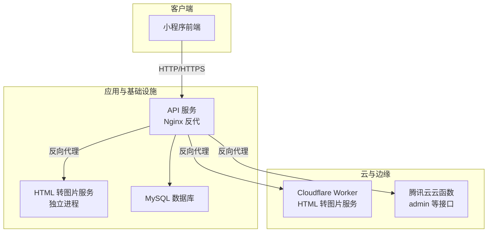
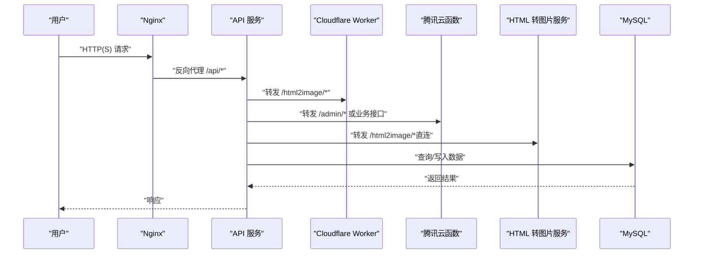
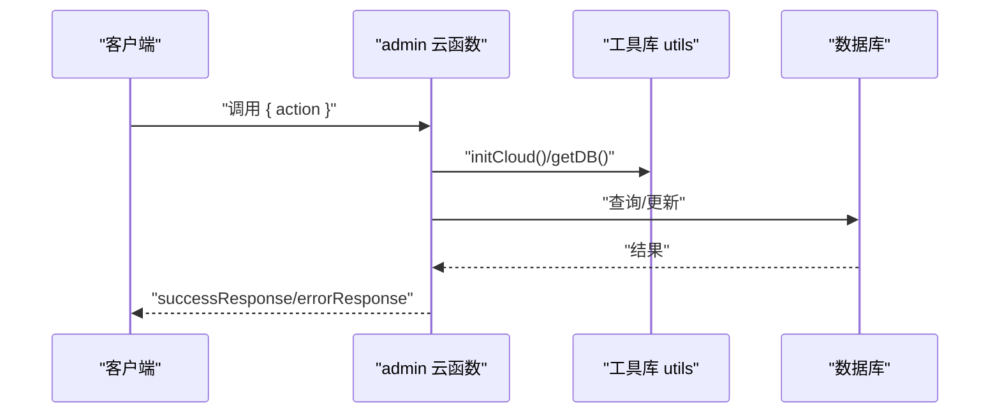
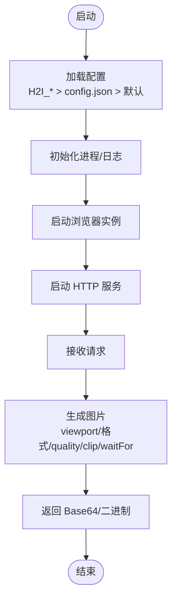
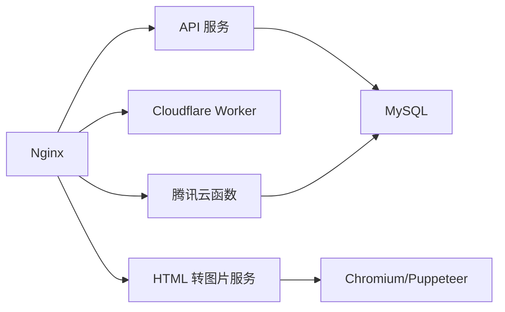

# 部署与运维

<cite>
**本文引用的文件**
- [wrangler.toml](file://cloudflare-worker/wrangler.toml)
- [package.json](file://cloudflare-worker/package.json)
- [package.json](file://cloudfunctions/admin/package.json)
- [utils.js](file://cloudfunctions/common/utils.js)
- [index.js](file://cloudfunctions/admin/index.js)
- [package.json](file://html2image-server/package.json)
- [config.js](file://html2image-server/config.js)
- [server.js](file://html2image-server/server.js)
- [start-server.sh](file://html2image-server/start-server.sh)
- [package.json](file://html2image-server-dist/package.json)
- [config.js](file://html2image-server-dist/config.js)
- [setup.sh](file://server-setup/setup.sh)
- [database.sql](file://server-setup/database.sql)
- [turtle-archive.nginx](file://server-setup/turtle-archive.nginx)
- [package.json](file://miniprogram/package.json)
</cite>

## 目录
1. [引言](#引言)
2. [项目结构](#项目结构)
3. [核心组件](#核心组件)
4. [架构总览](#架构总览)
5. [详细组件分析](#详细组件分析)
6. [依赖关系分析](#依赖关系分析)
7. [性能考虑](#性能考虑)
8. [故障排查指南](#故障排查指南)
9. [结论](#结论)
10. [附录](#附录)

## 引言
本文件面向运维工程师，提供“养龟档案”项目的完整部署与运维手册。内容覆盖云开发（Cloudflare Workers、腾讯云云函数）部署流程、版本管理与灰度策略、本地服务部署与环境变量、Nginx 反向代理与 SSL、负载均衡、监控告警与日志、自动化与 CI/CD、备份恢复与高可用、运维工具与性能分析，以及应急处置预案。

## 项目结构
项目由多模块组成：前端小程序、云函数（腾讯云）、Cloudflare Worker、HTML 转图片服务（独立 Node 服务）、Nginx 反代与数据库初始化脚本。整体采用“小程序前端 + 云函数/Worker 提供 API + 独立渲染服务 + Nginx 反代”的分层架构。

图表来源
- [turtle-archive.nginx:1-125](file://server-setup/turtle-archive.nginx#L1-L125)
- [wrangler.toml:1-38](file://cloudflare-worker/wrangler.toml#L1-L38)
- [package.json:1-10](file://cloudfunctions/admin/package.json#L1-L10)
- [package.json:1-26](file://html2image-server/package.json#L1-L26)

章节来源
- [turtle-archive.nginx:1-125](file://server-setup/turtle-archive.nginx#L1-L125)
- [setup.sh:1-145](file://server-setup/setup.sh#L1-L145)
- [database.sql:1-221](file://server-setup/database.sql#L1-L221)

## 核心组件
- Cloudflare Worker：提供 HTML 到图片的截图服务，支持通过环境变量与 secrets 配置。
- 腾讯云云函数：提供管理后台接口，基于 wx-server-sdk 访问数据库。
- HTML 转图片服务：基于 Puppeteer 的独立 Node 服务，支持环境变量覆盖配置。
- Nginx：统一入口，反向代理 API、Worker、云函数与图片服务，并提供静态资源缓存、健康检查与错误页。
- 数据库：MySQL 8.0，提供用户、宠物、记录、足迹、提醒、分类、系统配置等表结构。

章节来源
- [wrangler.toml:1-38](file://cloudflare-worker/wrangler.toml#L1-L38)
- [package.json:1-10](file://cloudfunctions/admin/package.json#L1-L10)
- [utils.js:1-69](file://cloudfunctions/common/utils.js#L1-L69)
- [index.js:1-200](file://cloudfunctions/admin/index.js#L1-L200)
- [package.json:1-26](file://html2image-server/package.json#L1-L26)
- [config.js:1-268](file://html2image-server/config.js#L1-L268)
- [server.js:1-200](file://html2image-server/server.js#L1-L200)
- [turtle-archive.nginx:1-125](file://server-setup/turtle-archive.nginx#L1-L125)
- [database.sql:1-221](file://server-setup/database.sql#L1-L221)

## 架构总览
下图展示生产环境典型流量路径：小程序通过 Nginx 访问 API；API 根据路由将请求转发至不同后端（Worker、云函数、图片服务），数据库由 API 侧访问。

图表来源
- [turtle-archive.nginx:32-64](file://server-setup/turtle-archive.nginx#L32-L64)
- [index.js:27-71](file://cloudfunctions/admin/index.js#L27-L71)
- [server.js:1-200](file://html2image-server/server.js#L1-L200)

## 详细组件分析

### Cloudflare Worker（HTML 转图片）
- 配置要点
  - 名称、主入口、兼容日期与 Node 兼容标志。
  - 环境变量（vars）：默认宽高质量、账户 ID。
  - Secrets：浏览器渲染 API Token（通过 wrangler secret 命令注入）。
- 部署与开发
  - 开发：使用 wrangler dev。
  - 部署：使用 wrangler deploy。
- 版本与灰度
  - 可在 wrangler.toml 中定义生产环境块，结合 Workers 计划与路由进行灰度分流。

章节来源
- [wrangler.toml:1-38](file://cloudflare-worker/wrangler.toml#L1-L38)
- [package.json:1-19](file://cloudflare-worker/package.json#L1-L19)

### 腾讯云云函数（管理后台）
- 初始化与上下文
  - 动态环境初始化，获取数据库连接与 OPENID。
- 接口能力
  - 统计数据、用户/宠物/足迹查询、近期活动、增长趋势、系统配置读写、用户封禁/解封等。
- 权限控制
  - 通过数据库中启用的管理员列表与兜底白名单校验。
- 错误处理
  - 统一 success/error 响应包装，异常捕获并返回错误信息。

图表来源
- [utils.js:1-69](file://cloudfunctions/common/utils.js#L1-L69)
- [index.js:27-71](file://cloudfunctions/admin/index.js#L27-L71)

章节来源
- [utils.js:1-69](file://cloudfunctions/common/utils.js#L1-L69)
- [index.js:1-200](file://cloudfunctions/admin/index.js#L1-L200)
- [package.json:1-10](file://cloudfunctions/admin/package.json#L1-L10)

### HTML 转图片服务（独立 Node 服务）
- 配置加载顺序
  - 环境变量（H2I_ 前缀，支持嵌套键与双下划线转义）> config.json > 默认值。
- 关键参数
  - 服务器监听地址/端口、日志目录、浏览器启动参数、渲染视口、超时、请求体大小限制等。
- 启动方式
  - 通过 start-server.sh 调用 Node 启动器，避免 Shell 编码问题。
- 图片生成
  - 基于 Puppeteer，支持 png/jpeg/webp，可裁剪、等待、全屏截图等。

图表来源
- [config.js:1-268](file://html2image-server/config.js#L1-L268)
- [server.js:1-200](file://html2image-server/server.js#L1-L200)
- [start-server.sh:1-18](file://html2image-server/start-server.sh#L1-L18)

章节来源
- [config.js:1-268](file://html2image-server/config.js#L1-L268)
- [server.js:1-200](file://html2image-server/server.js#L1-L200)
- [start-server.sh:1-18](file://html2image-server/start-server.sh#L1-L18)
- [package.json:1-26](file://html2image-server/package.json#L1-L26)

### Nginx 反向代理与静态资源
- 监听与域名
  - 监听 80，server_name 配置为域名或 IP。
- 日志
  - 访问日志与错误日志分别输出到指定路径。
- 限流与缓存
  - 客户端上传大小限制；静态资源 1 年缓存与 immutable。
- 路由规则
  - /api/ 反代至 API 服务（WebSocket 升级头透传）。
  - /html2image/ 反代至图片服务（较长超时）。
  - /uploads/ 别名到上传目录，开启跨域。
  - /health 健康检查。
  - 隐藏文件禁止访问；404/50x 错误页指向前端。
- HTTPS 建议
  - 提供 Let’s Encrypt 证书示例与 80→443 重定向注释。

章节来源
- [turtle-archive.nginx:1-125](file://server-setup/turtle-archive.nginx#L1-L125)

### 本地服务部署与环境变量
- 环境准备
  - Ubuntu 22.04，安装 Node.js 20、Nginx、PM2、MySQL 8.0。
  - 防火墙开放 SSH、Nginx、MySQL。
  - 创建项目目录与日志目录。
- 数据库初始化
  - 执行 database.sql 创建表结构与默认配置。
- 服务启动
  - 使用 PM2 启动 API 与图片服务。
  - 配置 Nginx 并启用站点。
- 环境变量建议
  - API 服务：数据库连接、密钥、日志路径等。
  - 图片服务：H2I_BROWSER__EXECUTABLE_PATH、H2I_SERVER_PORT、H2I_RENDERING__DEFAULT_VIEWPORT__WIDTH 等。
  - Worker：CLOUDFLARE_API_TOKEN（Secrets）。

章节来源
- [setup.sh:1-145](file://server-setup/setup.sh#L1-L145)
- [database.sql:1-221](file://server-setup/database.sql#L1-L221)
- [turtle-archive.nginx:1-125](file://server-setup/turtle-archive.nginx#L1-L125)
- [config.js:1-268](file://html2image-server/config.js#L1-L268)

### 版本管理与灰度发布策略
- 版本标识
  - 通过系统配置表维护版本号，便于前端/后端识别。
- 灰度策略
  - Nginx 基于路径或 Header 的权重分流。
  - Worker 使用路由与版本前缀（如 /api/v2/*）实现渐进式迁移。
  - 云函数通过环境变量切换新旧逻辑或数据库分支。
- 回滚机制
  - 快速回滚至上一个稳定版本；灰度比例逐步下调。

章节来源
- [database.sql:183-201](file://server-setup/database.sql#L183-L201)
- [wrangler.toml:35-38](file://cloudflare-worker/wrangler.toml#L35-L38)
- [turtle-archive.nginx:32-64](file://server-setup/turtle-archive.nginx#L32-L64)

### SSL 证书与负载均衡
- SSL
  - 使用 Let’s Encrypt 自动化证书（参考 Nginx 配置注释）。
- 负载均衡
  - 多实例 API 与图片服务，结合 Nginx upstream 或云厂商 LB。
  - 健康检查：/health 返回 200。
  - 会话保持：根据业务需求选择轮询/粘性会话。

章节来源
- [turtle-archive.nginx:103-125](file://server-setup/turtle-archive.nginx#L103-L125)

### 监控告警、日志与故障排查
- 日志
  - Nginx 访问/错误日志；图片服务日志目录；PM2 应用日志。
- 监控指标
  - QPS、响应时间、错误率、图片生成耗时、浏览器实例状态。
- 告警
  - 基于日志与指标阈值触发；关键事件（数据库异常、图片服务不可用）即时告警。
- 故障排查
  - API 无法访问：检查 Nginx 配置与 PM2 进程。
  - 图片生成失败：检查浏览器可执行路径、内存与超时设置。
  - 数据库异常：核对连接参数与权限。

章节来源
- [turtle-archive.nginx:11-13](file://server-setup/turtle-archive.nginx#L11-L13)
- [config.js:36-41](file://html2image-server/config.js#L36-L41)
- [server.js:107-113](file://html2image-server/server.js#L107-L113)

### 自动化部署与 CI/CD
- 本地构建
  - 前端小程序使用官方工具链打包；云函数与 Worker 使用各自构建脚本。
- 服务器部署
  - setup.sh 完成系统依赖与数据库初始化；PM2 管理进程。
- CI/CD 建议
  - 触发条件：push 到主分支或打 Tag。
  - 步骤：代码检出 → 依赖安装 → 单元测试 → 构建产物 → 发布到目标环境 → 灰度验证 → 全量发布。
  - 工具：GitHub Actions/Azure DevOps/Jenkins。

章节来源
- [package.json:7-11](file://cloudflare-worker/package.json#L7-L11)
- [package.json:6-9](file://html2image-server/package.json#L6-L9)
- [setup.sh:1-145](file://server-setup/setup.sh#L1-L145)

### 备份恢复与高可用
- 备份
  - 数据库定时快照；静态资源与日志归档。
- 恢复
  - 快速恢复到最近一次有效备份；验证 API 与图片服务可用性。
- 高可用
  - 多副本 API 与图片服务；数据库主从复制；CDN 加速静态资源。

章节来源
- [database.sql:1-221](file://server-setup/database.sql#L1-L221)
- [turtle-archive.nginx:19-29](file://server-setup/turtle-archive.nginx#L19-L29)

### 运维工具与性能分析
- 运维工具
  - PM2 进程管理与日志聚合；Nginx 控制与热重载；MySQL 客户端。
- 性能分析
  - 压测：ab/locust 对 /api/* 与 /html2image/* 压测；观察图片生成耗时。
  - 资源：CPU/内存/磁盘 IO 监控；浏览器实例并发与回收策略。

章节来源
- [package.json:1-26](file://html2image-server/package.json#L1-L26)
- [server.js:65-105](file://html2image-server/server.js#L65-L105)

## 依赖关系分析
- 组件耦合
  - Nginx 作为统一入口，耦合 API、Worker、云函数与图片服务。
  - 云函数依赖 wx-server-sdk 与数据库；图片服务依赖 Puppeteer。
- 外部依赖
  - Node.js 20+、MySQL 8.0、Nginx、PM2、Puppeteer。
- 循环依赖
  - 当前结构清晰，无明显循环依赖。

图表来源
- [turtle-archive.nginx:32-64](file://server-setup/turtle-archive.nginx#L32-L64)
- [index.js:1-200](file://cloudfunctions/admin/index.js#L1-L200)
- [server.js:1-200](file://html2image-server/server.js#L1-L200)

章节来源
- [turtle-archive.nginx:1-125](file://server-setup/turtle-archive.nginx#L1-L125)
- [package.json:1-10](file://cloudfunctions/admin/package.json#L1-L10)
- [package.json:1-26](file://html2image-server/package.json#L1-L26)

## 性能考虑
- 图片生成
  - 合理设置视口与质量；限制请求体大小；必要时启用浏览器池复用与超时控制。
- 反向代理
  - 适当调整超时与缓冲区；开启静态资源缓存；启用 gzip。
- 数据库
  - 合理索引（用户 openid、宠物 pet_id、记录日期等）；读写分离与连接池。

章节来源
- [config.js:62-74](file://html2image-server/config.js#L62-L74)
- [turtle-archive.nginx:15-16](file://server-setup/turtle-archive.nginx#L15-L16)
- [database.sql:11-26](file://server-setup/database.sql#L11-L26)

## 故障排查指南
- Worker 无法渲染
  - 检查 CLOUDFLARE_API_TOKEN 是否正确注入；确认浏览器渲染 API 可用。
- 云函数报错
  - 核对 OPENID 获取与管理员列表；检查数据库连接与命令对象使用。
- 图片服务崩溃
  - 查看浏览器启动日志与超时；确认可执行路径与沙箱参数。
- Nginx 502/504
  - 检查上游服务健康；增大 proxy 超时；确认端口与防火墙放行。
- 数据库异常
  - 核对 root 密码与用户权限；确认字符集与外键约束。

章节来源
- [wrangler.toml:25-27](file://cloudflare-worker/wrangler.toml#L25-L27)
- [utils.js:15-18](file://cloudfunctions/common/utils.js#L15-L18)
- [server.js:65-105](file://html2image-server/server.js#L65-L105)
- [turtle-archive.nginx:43-47](file://server-setup/turtle-archive.nginx#L43-L47)
- [database.sql:87-92](file://server-setup/database.sql#L87-L92)

## 结论
本运维文档提供了从部署、配置、监控到故障处理的全流程指导。建议在生产环境中结合灰度发布、自动化与高可用策略，确保系统稳定性与可扩展性。

## 附录
- 常用命令
  - 启动图片服务：./start-server.sh
  - Nginx 测试与重启：nginx -t && systemctl restart nginx
  - PM2 查看日志：pm2 logs
- 参考文件
  - [package.json:1-16](file://miniprogram/package.json#L1-L16)